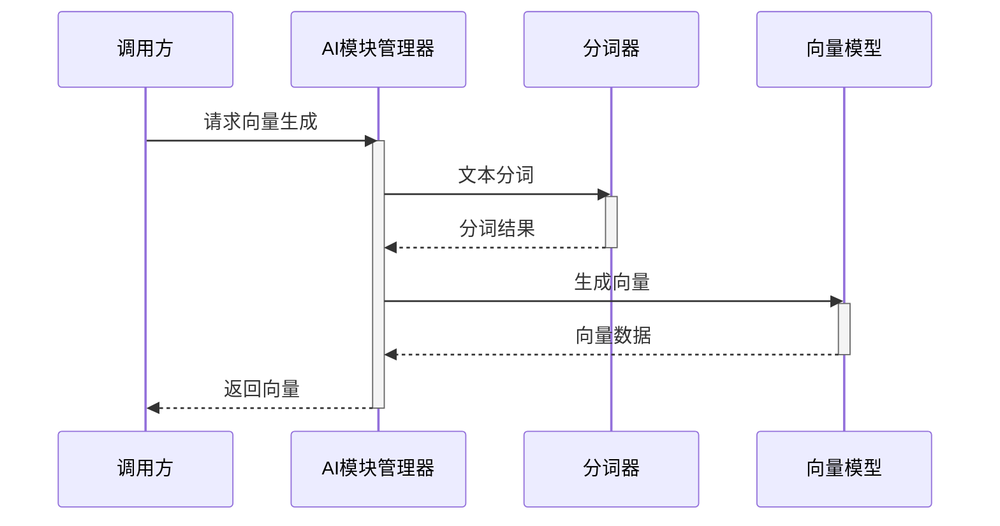

# 时序图技能使用演示

## 演示场景

本文件展示了如何使用 `sequence-diagram-maintainer` 技能来更新和维护 Weaviate 项目的时序图。

---

## 场景 1: 添加 Raft 共识层

### 用户请求

```
使用时序图技能,在 data-flow.md 中添加 Raft 共识层:

Schema管理 -> Raft领导者: 提交Schema变更
Raft领导者 -> Raft跟随者: 复制日志
Raft跟随者 -> Raft领导者: 确认接收
Raft领导者 -> Schema管理: 达成共识后应用
```

### AI 处理过程

1. **读取现有文件**: 打开 `diagrams/data-flow.md`
2. **分析变更**: 识别需要添加的新参与者 "Raft"
3. **确定位置**: 在 Schema 和 Storage 之间插入 Raft 层
4. **生成代码**: 创建 Mermaid 时序图代码
5. **增量更新**: 保留现有内容,只添加新的部分

### 输出结果

在时序图中添加:

```mermaid
participant Raft as Raft共识层

%% 在 Schema 验证后添加 Raft 流程
Schema->>Raft: 提交Schema变更
activate Raft
Raft->>Raft: 选举Leader(如需)
Raft->>Raft: 追加日志条目
Raft->>Raft: 等待多数确认
Raft-->>Schema: 达成共识
deactivate Raft
```

---

## 场景 2: 细化向量索引流程

### 用户请求

```
展开 Vector (向量索引) 的内部流程,展示:
- 接收对象数据
- 调用AI模块生成向量
- 构建HNSW索引
- 存储到内存缓存
- 持久化到磁盘
```

### AI 处理过程

1. **定位目标**: 找到现有的 Vector 参与者
2. **展开细节**: 将单一交互扩展为详细流程
3. **添加子组件**: 引入 HNSW、Cache 等内部组件
4. **保持层次**: 使用注释区分不同层级

### 输出结果

```mermaid
%% 向量索引详细流程
participant VIndex as 向量索引管理器
participant HNSW as HNSW索引
participant VCache as 向量缓存
participant VPersist as 向量持久化

Objects->>VIndex: 提交对象数据
activate VIndex

VIndex->>Modules: 请求向量生成
activate Modules
Modules-->>VIndex: 返回向量
deactivate Modules

VIndex->>HNSW: 添加到索引
activate HNSW
HNSW-->>VIndex: 索引更新完成
deactivate HNSW

VIndex->>VCache: 更新缓存
activate VCache
VCache-->>VIndex: 缓存已更新
deactivate VCache

opt 异步持久化
    VIndex->>VPersist: 加入持久化队列
    activate VPersist
    VPersist-->>VIndex: 持久化确认
    deactivate VPersist
end

VIndex-->>Objects: 向量操作完成
deactivate VIndex
```

---

## 场景 3: 添加备份服务

### 用户请求

```
添加一个完整的备份服务流程:

管理员 -> API网关: 触发备份
API网关 -> 备份管理器: 创建备份任务
备份管理器 -> 存储层: 读取所有数据
备份管理器 -> S3存储: 上传备份文件
S3存储 -> 备份管理器: 上传完成
备份管理器 -> 数据库: 记录备份元数据
备份管理器 -> API网关: 返回备份状态
API网关 -> 管理员: 显示备份结果
```

### AI 处理过程

1. **新增参与者**: 添加 BackupMgr (备份管理器) 和 S3 (S3存储)
2. **确定层级**: 放在业务层,与 Objects 平级
3. **添加交互**: 按顺序添加所有消息
4. **激活框配对**: 确保每个 activate 都有 deactivate

### 输出结果

```mermaid
participant Admin as 管理员
participant BackupMgr as 备份管理器
participant S3 as S3存储

Admin->>API: 触发备份
activate API
API->>BackupMgr: 创建备份任务
activate BackupMgr

BackupMgr->>Storage: 读取所有数据
activate Storage
Storage-->>BackupMgr: 返回数据
deactivate Storage

BackupMgr->>S3: 上传备份文件
activate S3
S3-->>BackupMgr: 上传完成
deactivate S3

BackupMgr->>Storage: 记录备份元数据
activate Storage
Storage-->>BackupMgr: 确认写入
deactivate Storage

BackupMgr-->>API: 返回备份状态
deactivate BackupMgr
API-->>Admin: 显示备份结果
deactivate API
```

---

## 场景 4: 添加错误处理分支

### 用户请求

```
为认证流程添加错误处理:
- token过期: 返回401,要求重新登录
- token无效: 返回403,拒绝访问
- 认证成功: 继续处理请求
```

### AI 处理过程

1. **定位位置**: 找到现有的 Auth 交互部分
2. **添加分支**: 使用 `alt` 块表示不同场景
3. **完善逻辑**: 添加错误码和响应消息

### 输出结果

```mermaid
API->>Auth: 验证token
activate Auth

alt token有效
    Auth-->>API: 验证通过
    deactivate Auth
    API->>Objects: 继续处理
else token过期
    Auth-->>API: 401 Token Expired
    deactivate Auth
    API-->>Client: 401 请重新登录
else token无效
    Auth-->>API: 403 Invalid Token
    deactivate Auth
    API-->>Client: 403 拒绝访问
end
```

---

## 场景 5: 创建批处理流程

### 用户请求

```
创建一个批量导入数据的时序图:

客户端发送批量数据
系统逐条验证Schema
并行生成向量(最多10个并发)
批量写入存储
返回导入结果统计
```

### AI 处理过程

1. **使用循环**: 用 `loop` 表示逐条处理
2. **并行处理**: 用 `par` 表示并发向量生成
3. **统计信息**: 添加 Note 说明返回的统计数据

### 输出结果

```mermaid
sequenceDiagram
    participant Client as 客户端
    participant Batch as 批处理器
    participant Schema as Schema验证
    participant Vector as 向量生成
    participant Storage as 存储层
    
    Client->>Batch: 批量导入请求(N条数据)
    activate Batch
    
    loop 处理每条数据 (i = 1 to N)
        Batch->>Schema: 验证第i条数据
        activate Schema
        alt 验证通过
            Schema-->>Batch: 验证成功
            deactivate Schema
            
            par 并行生成向量(最多10并发)
                Batch->>Vector: 生成向量i
                activate Vector
                Vector-->>Batch: 向量i完成
                deactivate Vector
            end
            
            Batch->>Storage: 写入第i条
            activate Storage
            Storage-->>Batch: 写入确认
            deactivate Storage
        else 验证失败
            Schema-->>Batch: 验证失败+错误信息
            deactivate Schema
            Batch->>Batch: 记录错误,继续下一条
        end
    end
    
    Note over Batch: 统计: 成功X条, 失败Y条
    
    Batch-->>Client: 返回导入结果统计
    deactivate Batch
```

---

## 场景 6: 优化现有时序图

### 用户请求

```
时序图太复杂了,帮我优化一下:
1. 把 AI模块 的细节移到子图
2. 简化错误处理,只用一个 alt 块
3. 添加分组注释,区分不同层级
```

### AI 处理过程

1. **提取子图**: 将 Modules 的详细流程移到独立文件
2. **简化逻辑**: 合并多个 alt 块为一个
3. **添加注释**: 使用 `%%` 添加层级分组注释

### 输出结果

**主图简化:**

```mermaid
%% ===== 客户端层 =====
participant Client as 客户端

%% ===== API层 =====
participant API as API网关
participant Auth as 认证服务

%% ===== 业务层 =====
participant Objects as 对象管理
participant Modules as AI模块 %% 详见 ai-modules.md

%% ===== 数据层 =====
participant Vector as 向量索引
participant Storage as 存储层

Client->>API: 请求
activate API

API->>Auth: 验证
activate Auth
alt 认证成功
    Auth-->>API: 通过
    deactivate Auth
    API->>Objects: 处理请求
    activate Objects
    
    opt 需要向量
        Objects->>Modules: 生成向量
        activate Modules
        Modules-->>Objects: 向量结果
        deactivate Modules
    end
    
    Objects->>Vector: 存储向量
    Objects->>Storage: 存储对象
    Objects-->>API: 返回结果
    deactivate Objects
else 认证失败
    Auth-->>API: 401/403
    deactivate Auth
    API-->>Client: 错误响应
end

API-->>Client: 响应
deactivate API
```

**子图 (ai-modules.md):**



---

## 最佳实践总结

### ✅ 推荐做法

1. **渐进式细化**: 先创建高层抽象,再根据需要展开细节
2. **合理分组**: 使用注释将相关组件分组
3. **保持一致**: 命名风格、消息格式保持一致
4. **文档化**: 每次更新都记录变更说明
5. **定期审查**: 检查时序图是否与实际架构同步

### ❌ 避免事项

1. **过度详细**: 不要展示每一行代码级别的交互
2. **忽略错误**: 重要的错误处理应该包含
3. **混乱布局**: 避免消息线交叉过多
4. **缺少激活框**: 重要组件应显示活跃状态
5. **忘记更新**: 架构变更后及时更新时序图

---

## 快速参考

### 常用 Mermaid 语法

```mermaid
%% 参与者声明
participant A as 组件A

%% 消息类型
A->>B: 同步调用
A->B: 异步消息
A-->>B: 返回消息

%% 激活框
activate B
...交互...
deactivate B

%% 条件分支
alt 条件1
    A->>B: 操作1
else 条件2
    A->>B: 操作2
end

%% 循环
loop 重复N次
    A->>B: 操作
end

%% 可选流程
opt 条件满足
    A->>B: 操作
end

%% 并行执行
par 任务1
    A->>B: 操作1
and 任务2
    A->>C: 操作2
end

%% 注释
Note over A,B: 说明文字
Note right of A: 右侧注释
```

---

## 下一步

现在你已经了解了如何使用这个技能,可以:

1. 📖 阅读完整文档: `.lingma/skills/sequence-diagram-maintainer/README.md`
2. 🚀 查看快速开始: `.lingma/skills/sequence-diagram-maintainer/QUICKSTART.md`
3. ✏️ 尝试更新: 告诉 AI 你想要添加或修改的组件关系
4. 👥 分享团队: 让团队成员也了解如何使用这个技能

祝你使用愉快! 🎉
