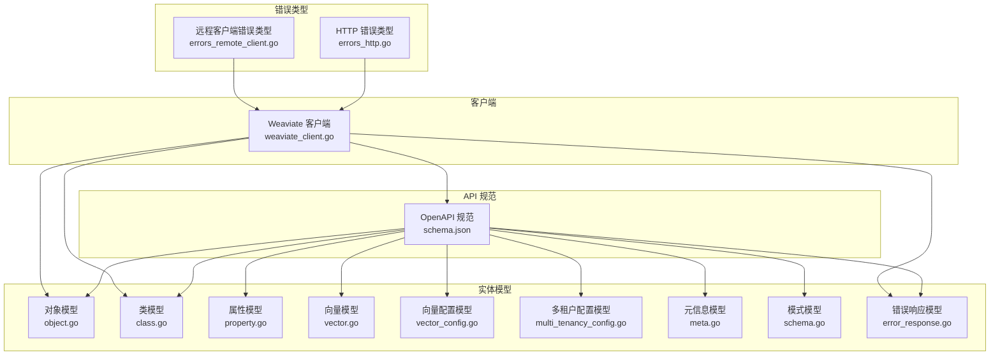
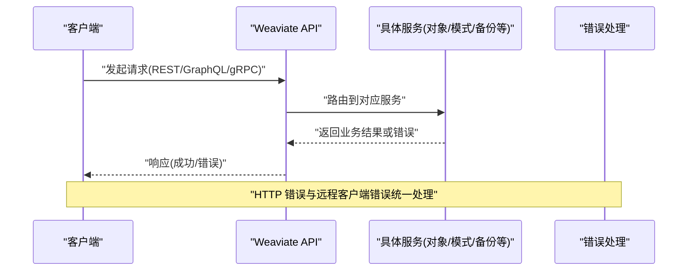
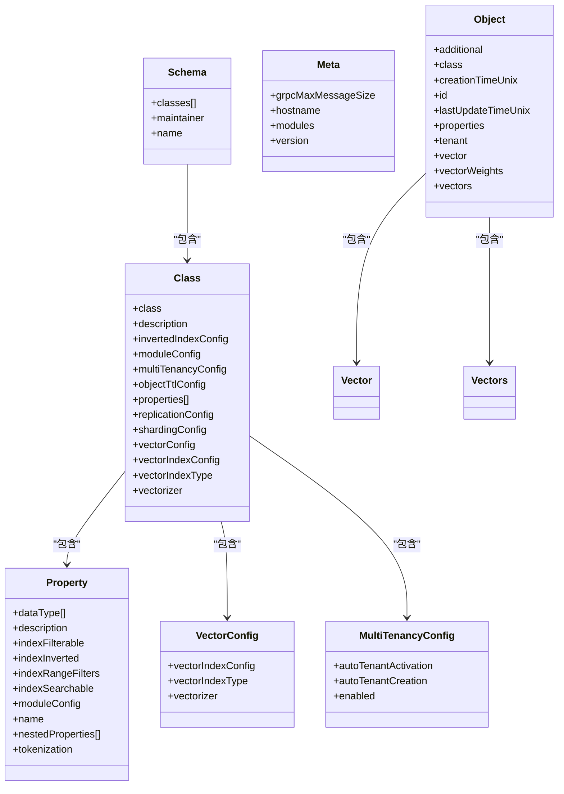
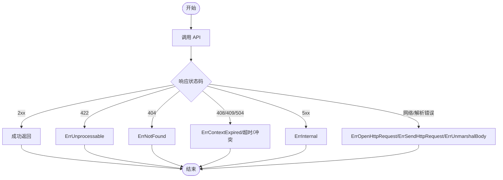
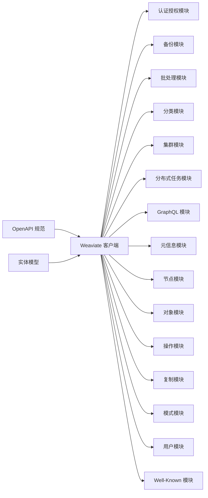

# API 参考

<cite>
**本文引用的文件**
- [schema.json](file://openapi-specs/schema.json)
- [class.go](file://entities/models/class.go)
- [object.go](file://entities/models/object.go)
- [vector.go](file://entities/models/vector.go)
- [error_response.go](file://entities/models/error_response.go)
- [weaviate_client.go](file://client/weaviate_client.go)
- [property.go](file://entities/models/property.go)
- [vector_config.go](file://entities/models/vector_config.go)
- [multi_tenancy_config.go](file://entities/models/multi_tenancy_config.go)
- [meta.go](file://entities/models/meta.go)
- [schema.go](file://entities/models/schema.go)
- [errors_http.go](file://entities/errors/errors_http.go)
- [errors_remote_client.go](file://entities/errors/errors_remote_client.go)
- [README.md](file://README.md)
</cite>

## 目录
1. [简介](#简介)
2. [项目结构](#项目结构)
3. [核心组件](#核心组件)
4. [架构总览](#架构总览)
5. [详细组件分析](#详细组件分析)
6. [依赖关系分析](#依赖关系分析)
7. [性能考量](#性能考量)
8. [故障排查指南](#故障排查指南)
9. [结论](#结论)
10. [附录](#附录)

## 简介
本文件为 Weaviate 的 API 参考文档，面向 API 开发者与集成工程师，覆盖数据模型（对象模型、向量模型、配置模型）、错误码系统、端点规范、数据传输对象（DTO）与序列化规则、版本控制与变更历史、约束与最佳实践，以及完整示例与代码片段路径指引。Weaviate 提供 REST、GraphQL 与 gRPC 三种 API，本文以 OpenAPI 规范与实体模型为基础进行梳理，并结合客户端封装与错误类型进行统一说明。

## 项目结构
Weaviate 的 API 参考主要由以下部分构成：
- OpenAPI 规范：定义了端点、参数、响应与通用数据模型（如角色、权限、上下文词典扩展、反向索引配置、复制配置等）
- 实体模型：Go 语言生成的数据模型（对象、类、属性、向量、元信息、模式等），用于 DTO 的字段定义、类型与校验
- 客户端封装：Go 客户端将各资源分组为模块化的子服务（schema、objects、batch、graphql、meta 等），统一默认主机、基础路径与协议
- 错误体系：HTTP 层错误与远程客户端错误类型，便于统一处理与诊断

**图表来源**
- [schema.json](file://openapi-specs/schema.json#L1-L800)
- [object.go](file://entities/models/object.go#L28-L63)
- [class.go](file://entities/models/class.go#L29-L72)
- [property.go](file://entities/models/property.go#L30-L65)
- [vector.go](file://entities/models/vector.go#L19-L22)
- [vector_config.go](file://entities/models/vector_config.go#L26-L39)
- [multi_tenancy_config.go](file://entities/models/multi_tenancy_config.go#L26-L39)
- [meta.go](file://entities/models/meta.go#L26-L42)
- [schema.go](file://entities/models/schema.go#L29-L43)
- [error_response.go](file://entities/models/error_response.go#L28-L35)
- [weaviate_client.go](file://client/weaviate_client.go#L41-L99)
- [errors_http.go](file://entities/errors/errors_http.go#L14-L63)
- [errors_remote_client.go](file://entities/errors/errors_remote_client.go#L18-L72)

**章节来源**
- [README.md](file://README.md#L100-L111)
- [weaviate_client.go](file://client/weaviate_client.go#L41-L99)

## 核心组件
- 对象模型（Object）：描述单个对象的属性、附加信息、向量与多向量、租户、类名、时间戳与 ID 等
- 类模型（Class）：描述集合（Collection）的配置，包括属性、反向索引、复制、多租户、向量配置、分片配置等
- 属性模型（Property）：描述集合属性的数据类型、索引策略、分词方式与嵌套属性
- 向量模型（Vector/Vectors）：描述单向量与多命名向量的结构
- 配置模型：反向索引配置、复制配置、多租户配置、向量配置等
- 错误响应模型（ErrorResponse）：统一的错误返回结构
- 元信息模型（Meta）：包含版本、主机名、模块元信息与 gRPC 最大消息尺寸等
- 模式模型（Schema）：包含多个类与维护者信息

**章节来源**
- [object.go](file://entities/models/object.go#L28-L63)
- [class.go](file://entities/models/class.go#L29-L72)
- [property.go](file://entities/models/property.go#L30-L65)
- [vector.go](file://entities/models/vector.go#L19-L22)
- [vector_config.go](file://entities/models/vector_config.go#L26-L39)
- [multi_tenancy_config.go](file://entities/models/multi_tenancy_config.go#L26-L39)
- [meta.go](file://entities/models/meta.go#L26-L42)
- [schema.go](file://entities/models/schema.go#L29-L43)
- [error_response.go](file://entities/models/error_response.go#L28-L35)

## 架构总览
Weaviate 的 API 通过 OpenAPI 规范定义端点与数据模型，Go 实体模型提供强类型 DTO 与校验逻辑；客户端将资源按领域拆分为子服务，统一默认主机、基础路径与协议；错误类型覆盖 HTTP 与远程调用场景，便于统一处理。

**图表来源**
- [weaviate_client.go](file://client/weaviate_client.go#L41-L99)
- [errors_http.go](file://entities/errors/errors_http.go#L14-L63)
- [errors_remote_client.go](file://entities/errors/errors_remote_client.go#L18-L72)

## 详细组件分析

### 数据模型总览与关系

**图表来源**
- [object.go](file://entities/models/object.go#L28-L63)
- [class.go](file://entities/models/class.go#L29-L72)
- [property.go](file://entities/models/property.go#L30-L65)
- [vector.go](file://entities/models/vector.go#L19-L22)
- [vector_config.go](file://entities/models/vector_config.go#L26-L39)
- [multi_tenancy_config.go](file://entities/models/multi_tenancy_config.go#L26-L39)
- [meta.go](file://entities/models/meta.go#L26-L42)
- [schema.go](file://entities/models/schema.go#L29-L43)

**章节来源**
- [object.go](file://entities/models/object.go#L28-L63)
- [class.go](file://entities/models/class.go#L29-L72)
- [property.go](file://entities/models/property.go#L30-L65)
- [vector.go](file://entities/models/vector.go#L19-L22)
- [vector_config.go](file://entities/models/vector_config.go#L26-L39)
- [multi_tenancy_config.go](file://entities/models/multi_tenancy_config.go#L26-L39)
- [meta.go](file://entities/models/meta.go#L26-L42)
- [schema.go](file://entities/models/schema.go#L29-L43)

### 对象模型（Object）
- 字段要点
  - 类名、租户、ID、时间戳：标识对象归属与生命周期
  - 属性：对象的属性值（PropertySchema）
  - 向量：单向量或命名向量（Vector/Vectors）
  - 附加信息：AdditionalProperties
  - 向量权重：VectorWeights
- 序列化与校验
  - ID 格式为 UUID
  - Vector/Vectors 存在时进行内部校验
- 使用建议
  - 导入时若提供向量，优先使用自有向量以避免模块开销
  - 多租户场景需显式指定 tenant

**章节来源**
- [object.go](file://entities/models/object.go#L28-L63)
- [object.go](file://entities/models/object.go#L65-L89)
- [object.go](file://entities/models/object.go#L158-L178)

### 类模型（Class）
- 字段要点
  - 名称、描述、属性列表
  - 反向索引配置、复制配置、多租户配置、对象 TTL 配置
  - 分片配置、向量配置（支持命名向量）
  - 向量化器与向量索引类型/配置
- 序列化与校验
  - 内嵌配置对象逐项校验
  - 向量配置键值要求存在且逐项校验
- 使用建议
  - 新集合建议使用 vectorConfig 替代旧版 vectorizer/vectorIndexType 组合
  - 多租户启用后需配合租户管理 API

**章节来源**
- [class.go](file://entities/models/class.go#L29-L72)
- [class.go](file://entities/models/class.go#L74-L106)
- [class.go](file://entities/models/class.go#L236-L268)

### 属性模型（Property）
- 字段要点
  - 数据类型数组（支持标量与引用/嵌套对象）
  - 索引策略：过滤索引、倒排索引（已弃用）、范围过滤、可搜索索引
  - 分词方式：word、lowercase、whitespace、field、trigram、gse、kagome_kr、kagome_ja、gse_ch
  - 嵌套属性：用于 object/object[] 类型
- 序列化与校验
  - tokenization 枚举校验
  - 嵌套属性逐项校验
- 使用建议
  - 文本属性建议开启 indexSearchable 以支持 BM25/Hybrid
  - 中文文本可考虑 gse 或 gse_ch

**章节来源**
- [property.go](file://entities/models/property.go#L30-L65)
- [property.go](file://entities/models/property.go#L67-L83)
- [property.go](file://entities/models/property.go#L174-L186)

### 向量模型（Vector/Vectors）
- 字段要点
  - Vector：任意 JSON 结构，用于承载向量
  - Vectors：命名向量映射，键为向量名称，值为 Vector
- 序列化与校验
  - 作为对象存在时进行上下文校验
- 使用建议
  - 多命名向量适用于多模态或多来源向量

**章节来源**
- [vector.go](file://entities/models/vector.go#L19-L22)
- [object.go](file://entities/models/object.go#L55-L62)
- [object.go](file://entities/models/object.go#L158-L178)

### 配置模型
- 反向索引配置（InvertedIndexConfig）：清理间隔、BM25 参数、停用词、索引开关、用户字典等
- 复制配置（ReplicationConfig）：副本因子、异步复制开关与配置、删除冲突解决策略
- 多租户配置（MultiTenancyConfig）：自动激活/创建租户、启用标志
- 向量配置（VectorConfig）：向量索引类型、索引配置、向量化器配置
- 元信息（Meta）：版本、主机名、模块元信息、gRPC 最大消息尺寸
- 模式（Schema）：类列表、维护者邮箱、模式名称

**章节来源**
- [schema.json](file://openapi-specs/schema.json#L703-L742)
- [schema.json](file://openapi-specs/schema.json#L744-L772)
- [multi_tenancy_config.go](file://entities/models/multi_tenancy_config.go#L26-L39)
- [vector_config.go](file://entities/models/vector_config.go#L26-L39)
- [meta.go](file://entities/models/meta.go#L26-L42)
- [schema.go](file://entities/models/schema.go#L29-L43)

### 错误码系统
- HTTP 错误类型
  - 未处理实体：ErrUnprocessable
  - 未找到：ErrNotFound
  - 上下文过期：ErrContextExpired
  - 内部错误：ErrInternal
- 远程客户端错误类型
  - 打开请求失败：ErrOpenHttpRequest
  - 发送请求失败：ErrSendHttpRequest
  - 未预期状态码：ErrUnexpectedStatusCode
  - 解析响应体失败：ErrUnmarshalBody
- 错误响应模型（ErrorResponse）
  - 统一错误数组结构，每项包含 message 字段

**图表来源**
- [errors_http.go](file://entities/errors/errors_http.go#L14-L63)
- [errors_remote_client.go](file://entities/errors/errors_remote_client.go#L18-L72)
- [error_response.go](file://entities/models/error_response.go#L28-L35)

**章节来源**
- [errors_http.go](file://entities/errors/errors_http.go#L14-L63)
- [errors_remote_client.go](file://entities/errors/errors_remote_client.go#L18-L72)
- [error_response.go](file://entities/models/error_response.go#L28-L35)

### 端点规范与使用示例
- 默认配置
  - 主机：localhost
  - 基础路径：/v1
  - 默认方案：https
- 客户端初始化
  - 通过 NewHTTPClient 或 NewHTTPClientWithConfig 创建
  - 支持设置 Host/BasePath/Schemes
- 资源分组
  - 认证授权、备份、批处理、分类、集群、分布式任务、GraphQL、元信息、节点、对象、操作、复制、模式、用户、Well-Known
- 使用示例（路径指引）
  - 基础使用与示例脚本：见仓库根目录 README 中的示例与安装说明
  - 客户端库与 API：见 README 的“客户端库和 API”章节

**章节来源**
- [weaviate_client.go](file://client/weaviate_client.go#L41-L99)
- [README.md](file://README.md#L98-L111)

### 数据传输对象（DTO）与序列化规则
- DTO 来源
  - OpenAPI 规范中的 definitions 与实体模型
- 序列化规则
  - 对象 ID 使用 UUID 格式
  - 向量字段（Vector/Vectors）在存在时进行内部校验
  - 属性 tokenization 采用枚举校验
- 校验逻辑
  - 实体模型提供 Validate 与 ContextValidate，支持复合校验与路径定位
- 建议
  - 在导入前完成字段与枚举校验，减少运行时错误
  - 多租户场景确保 tenant 字段正确传递

**章节来源**
- [object.go](file://entities/models/object.go#L110-L120)
- [object.go](file://entities/models/object.go#L122-L137)
- [property.go](file://entities/models/property.go#L161-L172)
- [class.go](file://entities/models/class.go#L108-L125)

### API 版本控制与变更历史
- OpenAPI 基础路径与默认主机/方案
  - basePath：/v1
  - 默认 Host：localhost
  - 默认 BasePath：/v1
  - 默认 Schemes：https
- 版本信息
  - 元信息模型包含版本号，可用于客户端与服务端一致性检查
- 变更与弃用
  - OpenAPI 定义中包含弃用条目（Deprecation），用于追踪移除计划与缓解措施

**章节来源**
- [weaviate_client.go](file://client/weaviate_client.go#L41-L51)
- [meta.go](file://entities/models/meta.go#L26-L42)
- [schema.json](file://openapi-specs/schema.json#L548-L602)

### 约束条件、限制与最佳实践
- 约束条件
  - 属性 tokenization 仅对 text/text[] 生效
  - 多租户启用后需配合租户管理 API
  - 向量导入优先使用自有向量以提升性能
- 限制
  - 反向索引配置项与向量索引类型需与模块能力匹配
- 最佳实践
  - 使用 vectorConfig 管理命名向量
  - 文本属性开启 indexSearchable 以支持 BM25/Hybrid
  - 合理设置复制因子与异步复制策略

**章节来源**
- [property.go](file://entities/models/property.go#L62-L65)
- [class.go](file://entities/models/class.go#L61-L72)
- [schema.json](file://openapi-specs/schema.json#L744-L772)

## 依赖关系分析
Weaviate 客户端将各资源模块化，统一默认传输配置，并在各子服务上暴露一致的参数与响应模型。OpenAPI 规范与实体模型共同保证数据契约的一致性。

**图表来源**
- [weaviate_client.go](file://client/weaviate_client.go#L24-L39)
- [weaviate_client.go](file://client/weaviate_client.go#L83-L98)

**章节来源**
- [weaviate_client.go](file://client/weaviate_client.go#L24-L39)
- [weaviate_client.go](file://client/weaviate_client.go#L83-L98)

## 性能考量
- 向量导入
  - 自有向量导入可减少模块调用开销
- 索引策略
  - 文本属性开启 indexSearchable 以支持 BM25/Hybrid
  - 合理使用倒排索引与范围过滤索引优化查询
- 复制与分片
  - 设置合适的复制因子与异步复制配置
  - 多租户场景注意租户热激活与自动创建策略

[本节为通用指导，不涉及具体文件分析]

## 故障排查指南
- 常见错误类型
  - 未处理实体：检查请求体与字段合法性
  - 未找到：确认资源是否存在与路径正确
  - 上下文过期/超时：检查网络与服务端负载
  - 内部错误：查看服务端日志与版本兼容性
  - 远程客户端错误：检查网络连通性、证书与超时设置
- 响应结构
  - 使用 ErrorResponse 统一解析错误消息数组

**章节来源**
- [errors_http.go](file://entities/errors/errors_http.go#L14-L63)
- [errors_remote_client.go](file://entities/errors/errors_remote_client.go#L18-L72)
- [error_response.go](file://entities/models/error_response.go#L28-L35)

## 结论
本文基于 OpenAPI 规范与实体模型，系统梳理了 Weaviate 的数据模型、错误码体系、客户端封装与版本控制，并提供了约束、限制与最佳实践。建议在实际集成中遵循 DTO 校验与序列化规则，合理配置索引与复制策略，以获得稳定与高性能的 API 使用体验。

[本节为总结性内容，不涉及具体文件分析]

## 附录
- 示例与脚本
  - 参考仓库根目录 README 中的示例与安装说明
- 相关模块
  - 客户端模块化封装与默认传输配置

**章节来源**
- [README.md](file://README.md#L98-L111)
- [weaviate_client.go](file://client/weaviate_client.go#L41-L99)