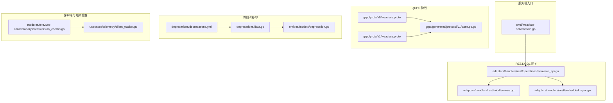
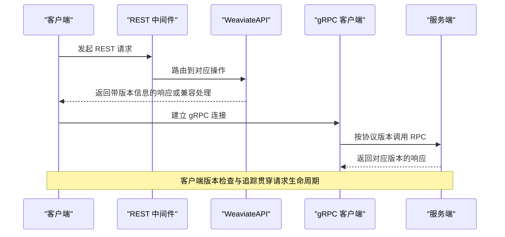
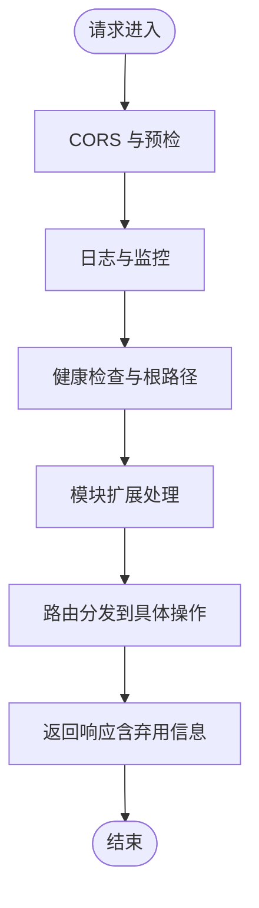
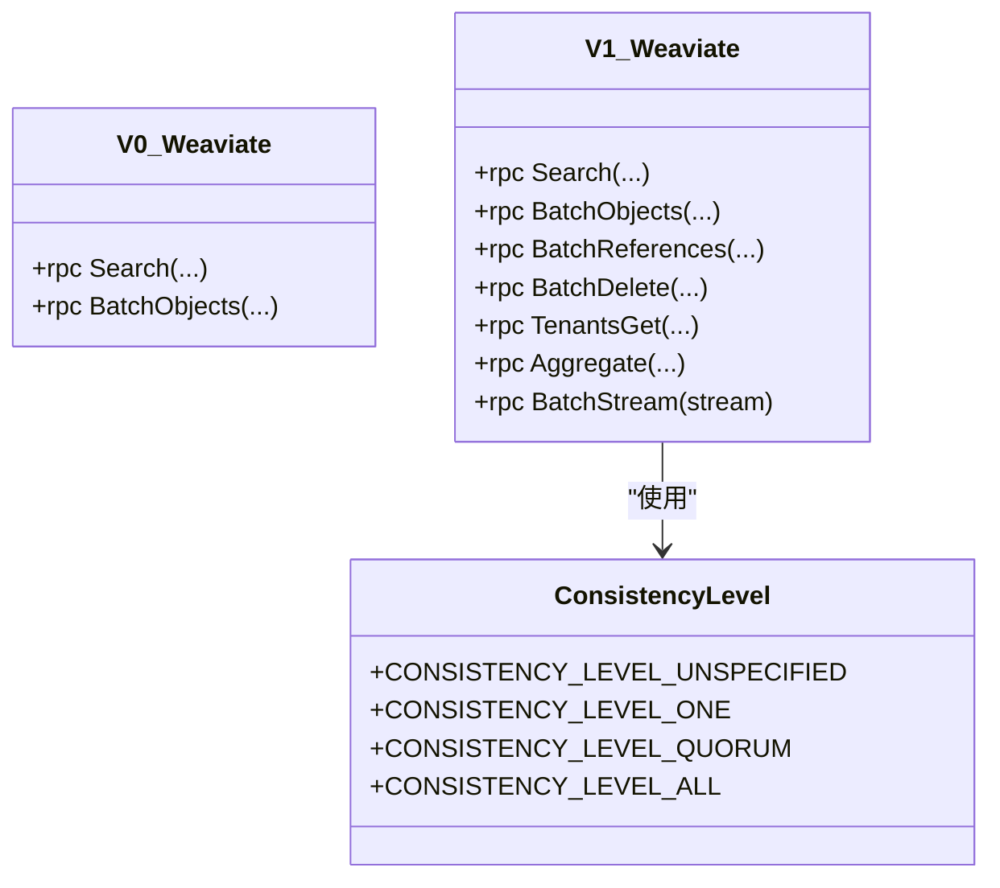
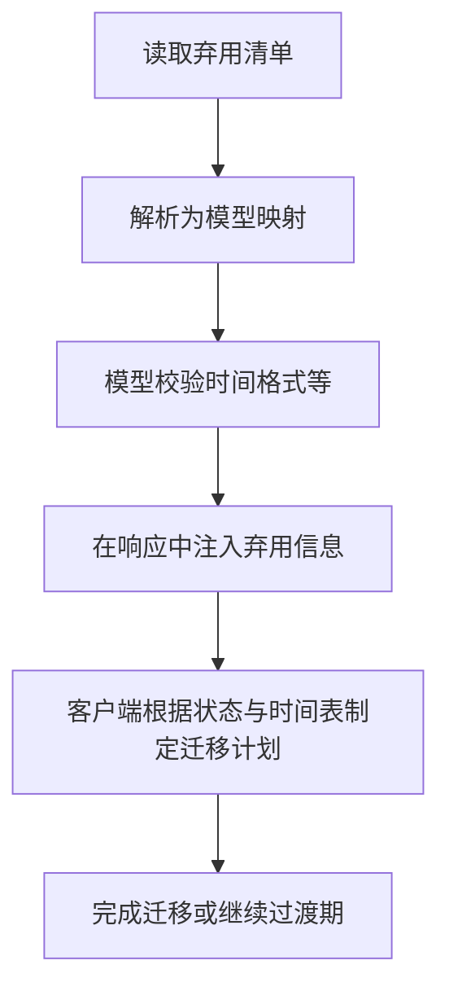
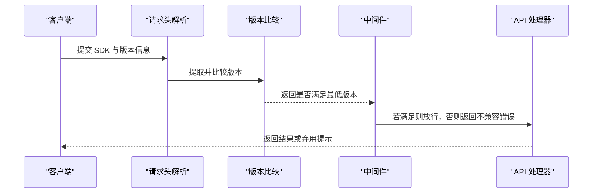
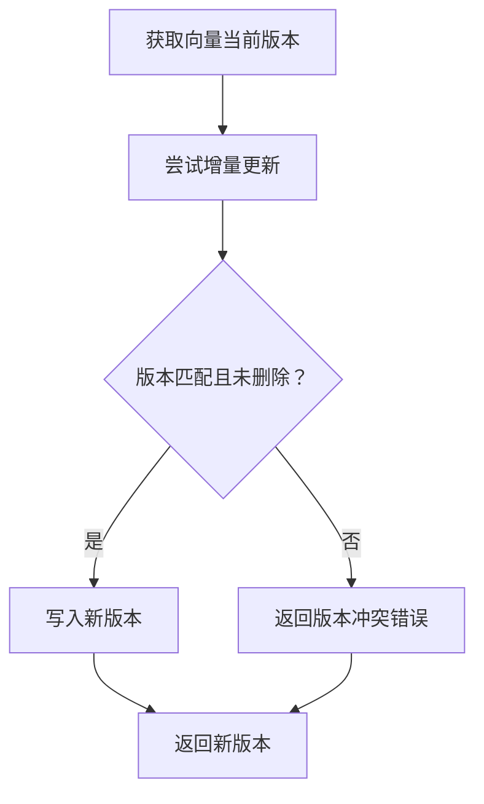
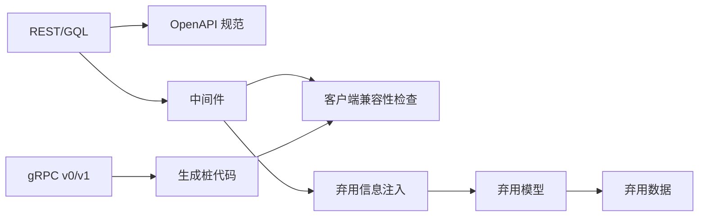

# API 版本控制

<cite>
**本文引用的文件**
- [cmd/weaviate-server/main.go](file://cmd/weaviate-server/main.go)
- [adapters/handlers/rest/operations/weaviate_api.go](file://adapters/handlers/rest/operations/weaviate_api.go)
- [adapters/handlers/rest/middlewares.go](file://adapters/handlers/rest/middlewares.go)
- [adapters/handlers/rest/embedded_spec.go](file://adapters/handlers/rest/embedded_spec.go)
- [entities/models/deprecation.go](file://entities/models/deprecation.go)
- [deprecations/data.go](file://deprecations/data.go)
- [deprecations/deprecations.yml](file://deprecations/deprecations.yml)
- [grpc/proto/v0/weaviate.proto](file://grpc/proto/v0/weaviate.proto)
- [grpc/proto/v1/weaviate.proto](file://grpc/proto/v1/weaviate.proto)
- [grpc/generated/protocol/v1/base.pb.go](file://grpc/generated/protocol/v1/base.pb.go)
- [modules/text2vec-contextionary/client/version_checks.go](file://modules/text2vec-contextionary/client/version_checks.go)
- [modules/text2vec-contextionary/client/version_checks_test.go](file://modules/text2vec-contextionary/client/version_checks_test.go)
- [usecases/telemetry/client_tracker.go](file://usecases/telemetry/client_tracker.go)
- [adapters/repos/db/vector/hfresh/version_map.go](file://adapters/repos/db/vector/hfresh/version_map.go)
- [adapters/repos/db/vector/hfresh/version_map_test.go](file://adapters/repos/db/vector/hfresh/version_map_test.go)
- [adapters/handlers/rest/embedded_spec.go](file://adapters/handlers/rest/embedded_spec.go)
</cite>

## 目录
1. [引言](#引言)
2. [项目结构](#项目结构)
3. [核心组件](#核心组件)
4. [架构总览](#架构总览)
5. [详细组件分析](#详细组件分析)
6. [依赖关系分析](#依赖关系分析)
7. [性能考量](#性能考量)
8. [故障排查指南](#故障排查指南)
9. [结论](#结论)
10. [附录](#附录)

## 引言
本文件为 Weaviate 的 API 版本控制系统提供权威参考，覆盖 REST、GraphQL（通过 OpenAPI 规范）与 gRPC 三层接口的版本策略与实现机制。重点内容包括：
- 语义化版本控制与向后兼容性保障
- 弃用策略与迁移路径：弃用通知、过渡期支持、最终移除时间表
- 版本协商机制与客户端兼容性检查
- API 变更影响评估与风险控制
- 升级最佳实践与迁移指南
- 配置项与运行时行为
- 在不同 API 层面的应用方式
- 版本冲突的诊断与解决方法

## 项目结构
Weaviate 的版本控制横跨服务端入口、REST/GQL 网关、gRPC 协议层、弃用元数据模型与客户端追踪等模块。下图概览了与版本控制相关的关键文件与职责分工。

图表来源
- [cmd/weaviate-server/main.go](file://cmd/weaviate-server/main.go#L30-L66)
- [adapters/handlers/rest/operations/weaviate_api.go](file://adapters/handlers/rest/operations/weaviate_api.go#L1055-L1084)
- [adapters/handlers/rest/middlewares.go](file://adapters/handlers/rest/middlewares.go#L90-L111)
- [adapters/handlers/rest/embedded_spec.go](file://adapters/handlers/rest/embedded_spec.go#L7013-L7052)
- [grpc/proto/v0/weaviate.proto](file://grpc/proto/v0/weaviate.proto#L1-L16)
- [grpc/proto/v1/weaviate.proto](file://grpc/proto/v1/weaviate.proto#L1-L24)
- [grpc/generated/protocol/v1/base.pb.go](file://grpc/generated/protocol/v1/base.pb.go#L22-L51)
- [deprecations/deprecations.yml](file://deprecations/deprecations.yml#L1-L66)
- [deprecations/data.go](file://deprecations/data.go#L44-L110)
- [entities/models/deprecation.go](file://entities/models/deprecation.go#L28-L67)
- [modules/text2vec-contextionary/client/version_checks.go](file://modules/text2vec-contextionary/client/version_checks.go#L20-L47)
- [usecases/telemetry/client_tracker.go](file://usecases/telemetry/client_tracker.go#L199-L234)

章节来源
- [cmd/weaviate-server/main.go](file://cmd/weaviate-server/main.go#L30-L66)
- [adapters/handlers/rest/operations/weaviate_api.go](file://adapters/handlers/rest/operations/weaviate_api.go#L1055-L1084)
- [adapters/handlers/rest/middlewares.go](file://adapters/handlers/rest/middlewares.go#L90-L111)
- [adapters/handlers/rest/embedded_spec.go](file://adapters/handlers/rest/embedded_spec.go#L7013-L7052)
- [grpc/proto/v0/weaviate.proto](file://grpc/proto/v0/weaviate.proto#L1-L16)
- [grpc/proto/v1/weaviate.proto](file://grpc/proto/v1/weaviate.proto#L1-L24)
- [grpc/generated/protocol/v1/base.pb.go](file://grpc/generated/protocol/v1/base.pb.go#L22-L51)
- [deprecations/deprecations.yml](file://deprecations/deprecations.yml#L1-L66)
- [deprecations/data.go](file://deprecations/data.go#L44-L110)
- [entities/models/deprecation.go](file://entities/models/deprecation.go#L28-L67)
- [modules/text2vec-contextionary/client/version_checks.go](file://modules/text2vec-contextionary/client/version_checks.go#L20-L47)
- [usecases/telemetry/client_tracker.go](file://usecases/telemetry/client_tracker.go#L199-L234)

## 核心组件
- 服务端入口与路由
  - 服务启动加载 Swagger/OpenAPI 规范，初始化 REST/GQL 路由与处理器缓存，确保版本化的 API 表达与路由分发一致。
- gRPC 协议版本
  - 通过独立的 proto 包版本（v0、v1）隔离变更，生成稳定的 Go 客户端桩代码，便于客户端按版本选择兼容的 API。
- 弃用元数据与模型
  - 使用 YAML 描述弃用清单，生成 Go 映射；模型定义包含弃用状态、受影响位置、计划移除版本、引入时间等字段，支撑运行时告警与迁移提示。
- 客户端兼容性检查
  - 通过请求头解析与版本比较逻辑，校验客户端 SDK 与服务端能力是否满足最低要求；同时记录客户端类型与版本，辅助观测与兼容性治理。
- REST/GQL 规范与中间件
  - 中间件链负责 CORS、监控、健康检查、根路径处理以及模块扩展等，为版本协商与兼容性提供统一入口。

章节来源
- [cmd/weaviate-server/main.go](file://cmd/weaviate-server/main.go#L30-L66)
- [adapters/handlers/rest/operations/weaviate_api.go](file://adapters/handlers/rest/operations/weaviate_api.go#L1055-L1084)
- [adapters/handlers/rest/middlewares.go](file://adapters/handlers/rest/middlewares.go#L90-L111)
- [deprecations/deprecations.yml](file://deprecations/deprecations.yml#L1-L66)
- [deprecations/data.go](file://deprecations/data.go#L44-L110)
- [entities/models/deprecation.go](file://entities/models/deprecation.go#L28-L67)
- [modules/text2vec-contextionary/client/version_checks.go](file://modules/text2vec-contextionary/client/version_checks.go#L20-L47)
- [usecases/telemetry/client_tracker.go](file://usecases/telemetry/client_tracker.go#L199-L234)

## 架构总览
Weaviate 的版本控制采用“多层并行演进”的策略：
- REST/GQL：以 OpenAPI 规范表达 API，通过中间件与处理器缓存实现版本化路由与响应。
- gRPC：以协议版本（v0/v1）隔离变更，客户端按版本选择兼容的接口。
- 弃用管理：集中维护弃用清单，模型化描述弃用状态与迁移建议，服务端在运行时进行提示与兼容性处理。
- 客户端追踪：识别客户端 SDK 类型与版本，用于兼容性治理与问题定位。

图表来源
- [adapters/handlers/rest/middlewares.go](file://adapters/handlers/rest/middlewares.go#L90-L111)
- [adapters/handlers/rest/operations/weaviate_api.go](file://adapters/handlers/rest/operations/weaviate_api.go#L1055-L1084)
- [grpc/proto/v1/weaviate.proto](file://grpc/proto/v1/weaviate.proto#L15-L23)
- [grpc/proto/v0/weaviate.proto](file://grpc/proto/v0/weaviate.proto#L12-L15)
- [modules/text2vec-contextionary/client/version_checks.go](file://modules/text2vec-contextionary/client/version_checks.go#L20-L47)
- [usecases/telemetry/client_tracker.go](file://usecases/telemetry/client_tracker.go#L199-L234)

## 详细组件分析

### REST/GQL 版本与路由
- 入口与路由
  - 服务启动加载嵌入式 OpenAPI 规范，构建 WeaviateAPI 并初始化处理器缓存，确保基于方法与路径的路由分发稳定。
- 中间件链
  - 提供 CORS、日志、监控、预检、健康检查、根路径处理与模块扩展等通用能力，为版本协商与兼容性提供统一入口。
- 规范与模型
  - OpenAPI 规范中包含弃用对象的 JSON Schema 字段，用于在响应中携带弃用信息；模型定义包含弃用状态、受影响位置、计划移除版本等字段。

图表来源
- [adapters/handlers/rest/middlewares.go](file://adapters/handlers/rest/middlewares.go#L90-L111)
- [adapters/handlers/rest/operations/weaviate_api.go](file://adapters/handlers/rest/operations/weaviate_api.go#L1055-L1084)
- [adapters/handlers/rest/embedded_spec.go](file://adapters/handlers/rest/embedded_spec.go#L7013-L7052)

章节来源
- [cmd/weaviate-server/main.go](file://cmd/weaviate-server/main.go#L30-L66)
- [adapters/handlers/rest/operations/weaviate_api.go](file://adapters/handlers/rest/operations/weaviate_api.go#L1055-L1084)
- [adapters/handlers/rest/middlewares.go](file://adapters/handlers/rest/middlewares.go#L90-L111)
- [adapters/handlers/rest/embedded_spec.go](file://adapters/handlers/rest/embedded_spec.go#L7013-L7052)

### gRPC 版本控制
- 协议版本
  - v0 与 v1 两个独立的 proto 包，分别定义服务与消息结构，避免在同一版本内引入破坏性变更。
- 生成代码
  - 通过编译生成稳定的 Go 客户端桩代码，客户端可明确选择兼容的协议版本。
- 一致性级别枚举
  - 生成代码中包含一致性级别枚举，体现协议层对一致性语义的版本化表达。

图表来源
- [grpc/proto/v0/weaviate.proto](file://grpc/proto/v0/weaviate.proto#L12-L15)
- [grpc/proto/v1/weaviate.proto](file://grpc/proto/v1/weaviate.proto#L15-L23)
- [grpc/generated/protocol/v1/base.pb.go](file://grpc/generated/protocol/v1/base.pb.go#L22-L51)

章节来源
- [grpc/proto/v0/weaviate.proto](file://grpc/proto/v0/weaviate.proto#L1-L16)
- [grpc/proto/v1/weaviate.proto](file://grpc/proto/v1/weaviate.proto#L1-L24)
- [grpc/generated/protocol/v1/base.pb.go](file://grpc/generated/protocol/v1/base.pb.go#L22-L51)

### 弃用策略与迁移路径
- 弃用清单与模型
  - YAML 清单描述弃用 ID、状态、API 类型、受影响位置、消息、缓解措施、自版本与时间、计划移除版本与实际移除版本/时间。
  - 生成的 Go 映射与模型定义支持序列化/反序列化与格式校验，便于在运行时输出弃用信息。
- 运行时应用
  - 通过中间件与 API 处理器在响应中携带弃用信息，帮助客户端识别并迁移至新接口或参数。
- 时间表与状态
  - 支持“已弃用”“已移除”两种状态，并记录引入与移除的时间点，形成清晰的迁移时间线。

图表来源
- [deprecations/deprecations.yml](file://deprecations/deprecations.yml#L1-L66)
- [deprecations/data.go](file://deprecations/data.go#L44-L110)
- [entities/models/deprecation.go](file://entities/models/deprecation.go#L28-L67)
- [adapters/handlers/rest/embedded_spec.go](file://adapters/handlers/rest/embedded_spec.go#L7013-L7052)

章节来源
- [deprecations/deprecations.yml](file://deprecations/deprecations.yml#L1-L66)
- [deprecations/data.go](file://deprecations/data.go#L44-L110)
- [entities/models/deprecation.go](file://entities/models/deprecation.go#L28-L67)
- [adapters/handlers/rest/embedded_spec.go](file://adapters/handlers/rest/embedded_spec.go#L7013-L7052)

### 客户端兼容性检查与版本协商
- 版本提取与比较
  - 从客户端标识中提取语义化版本号，与服务端要求的最小版本进行比较，决定是否允许访问。
- 客户端追踪
  - 解析请求头中的客户端标识，识别 SDK 类型与版本，用于兼容性治理与问题定位。
- 协商机制
  - 通过中间件在请求早期进行拦截与校验，结合弃用信息与版本要求，指导客户端进行升级或降级。

图表来源
- [modules/text2vec-contextionary/client/version_checks.go](file://modules/text2vec-contextionary/client/version_checks.go#L20-L47)
- [modules/text2vec-contextionary/client/version_checks_test.go](file://modules/text2vec-contextionary/client/version_checks_test.go#L21-L117)
- [usecases/telemetry/client_tracker.go](file://usecases/telemetry/client_tracker.go#L199-L234)
- [adapters/handlers/rest/middlewares.go](file://adapters/handlers/rest/middlewares.go#L90-L111)

章节来源
- [modules/text2vec-contextionary/client/version_checks.go](file://modules/text2vec-contextionary/client/version_checks.go#L20-L47)
- [modules/text2vec-contextionary/client/version_checks_test.go](file://modules/text2vec-contextionary/client/version_checks_test.go#L21-L117)
- [usecases/telemetry/client_tracker.go](file://usecases/telemetry/client_tracker.go#L199-L234)
- [adapters/handlers/rest/middlewares.go](file://adapters/handlers/rest/middlewares.go#L90-L111)

### 向量版本控制（内部一致性）
- 版本映射与增量
  - 提供向量版本映射与增量操作，确保并发场景下的版本一致性与删除标记。
- 错误处理
  - 当版本不匹配或并发冲突时返回错误，防止数据损坏。

图表来源
- [adapters/repos/db/vector/hfresh/version_map.go](file://adapters/repos/db/vector/hfresh/version_map.go#L99-L126)
- [adapters/repos/db/vector/hfresh/version_map_test.go](file://adapters/repos/db/vector/hfresh/version_map_test.go#L54-L131)

章节来源
- [adapters/repos/db/vector/hfresh/version_map.go](file://adapters/repos/db/vector/hfresh/version_map.go#L99-L126)
- [adapters/repos/db/vector/hfresh/version_map_test.go](file://adapters/repos/db/vector/hfresh/version_map_test.go#L54-L131)

## 依赖关系分析
- REST/GQL 与 gRPC 的版本并行演进，互不干扰，降低破坏性变更风险。
- 弃用清单与模型作为跨层共享的元数据，驱动运行时兼容性与迁移提示。
- 客户端追踪与版本检查在中间件层统一接入，确保所有请求均受控。

图表来源
- [adapters/handlers/rest/embedded_spec.go](file://adapters/handlers/rest/embedded_spec.go#L7013-L7052)
- [adapters/handlers/rest/middlewares.go](file://adapters/handlers/rest/middlewares.go#L90-L111)
- [grpc/proto/v0/weaviate.proto](file://grpc/proto/v0/weaviate.proto#L1-L16)
- [grpc/proto/v1/weaviate.proto](file://grpc/proto/v1/weaviate.proto#L1-L24)
- [grpc/generated/protocol/v1/base.pb.go](file://grpc/generated/protocol/v1/base.pb.go#L22-L51)
- [deprecations/data.go](file://deprecations/data.go#L44-L110)
- [entities/models/deprecation.go](file://entities/models/deprecation.go#L28-L67)

章节来源
- [adapters/handlers/rest/embedded_spec.go](file://adapters/handlers/rest/embedded_spec.go#L7013-L7052)
- [adapters/handlers/rest/middlewares.go](file://adapters/handlers/rest/middlewares.go#L90-L111)
- [grpc/proto/v0/weaviate.proto](file://grpc/proto/v0/weaviate.proto#L1-L16)
- [grpc/proto/v1/weaviate.proto](file://grpc/proto/v1/weaviate.proto#L1-L24)
- [grpc/generated/protocol/v1/base.pb.go](file://grpc/generated/protocol/v1/base.pb.go#L22-L51)
- [deprecations/data.go](file://deprecations/data.go#L44-L110)
- [entities/models/deprecation.go](file://entities/models/deprecation.go#L28-L67)

## 性能考量
- 路由与中间件缓存
  - 初始化处理器缓存与中间件链，减少每次请求的重复计算开销。
- gRPC 流式与批量
  - v1 引入流式批处理等特性，有助于提升吞吐与降低延迟。
- 弃用信息注入
  - 在响应中携带弃用信息应尽量轻量化，避免对关键路径造成额外负担。

## 故障排查指南
- 版本不兼容
  - 现象：客户端被拒绝访问或收到版本不满足错误。
  - 排查：确认客户端 SDK 与版本是否满足服务端要求；检查请求头中的 SDK 与版本信息。
- 弃用功能报错
  - 现象：访问被标记为弃用的功能时报错或警告。
  - 排查：查看响应中的弃用信息，对照迁移建议调整请求；关注计划移除版本与时间表。
- gRPC 协议不匹配
  - 现象：客户端连接失败或调用异常。
  - 排查：确认客户端使用的协议版本与服务端一致；核对生成的桩代码版本。
- 并发冲突（向量版本）
  - 现象：向量更新失败并提示版本冲突。
  - 排查：重试或使用最新版本号再次提交；检查并发更新策略。

章节来源
- [modules/text2vec-contextionary/client/version_checks.go](file://modules/text2vec-contextionary/client/version_checks.go#L20-L47)
- [usecases/telemetry/client_tracker.go](file://usecases/telemetry/client_tracker.go#L199-L234)
- [adapters/handlers/rest/embedded_spec.go](file://adapters/handlers/rest/embedded_spec.go#L7013-L7052)
- [grpc/proto/v1/weaviate.proto](file://grpc/proto/v1/weaviate.proto#L15-L23)
- [adapters/repos/db/vector/hfresh/version_map.go](file://adapters/repos/db/vector/hfresh/version_map.go#L99-L126)

## 结论
Weaviate 的版本控制体系通过 REST/GQL、gRPC 与弃用管理三方面协同，实现了稳定的多版本演进与平滑迁移。建议在升级过程中：
- 优先升级客户端 SDK 至满足最低版本要求；
- 关注弃用清单与迁移建议，提前替换受影响的 API；
- 对照协议版本选择兼容的 gRPC 客户端；
- 在生产环境逐步验证，利用中间件与监控观察兼容性表现。

## 附录
- 版本协商与兼容性检查
  - 通过请求头解析与版本比较逻辑，确保客户端与服务端能力匹配。
- 弃用清单与迁移时间表
  - 基于 YAML 清单生成模型映射，明确受影响位置、缓解措施与移除时间。
- gRPC 协议版本
  - v0 与 v1 分别适用于不同阶段的客户端，避免破坏性变更影响现有用户。

章节来源
- [modules/text2vec-contextionary/client/version_checks.go](file://modules/text2vec-contextionary/client/version_checks.go#L20-L47)
- [deprecations/deprecations.yml](file://deprecations/deprecations.yml#L1-L66)
- [grpc/proto/v0/weaviate.proto](file://grpc/proto/v0/weaviate.proto#L1-L16)
- [grpc/proto/v1/weaviate.proto](file://grpc/proto/v1/weaviate.proto#L1-L24)