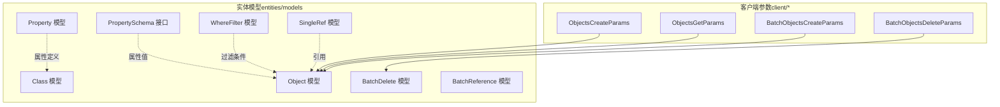
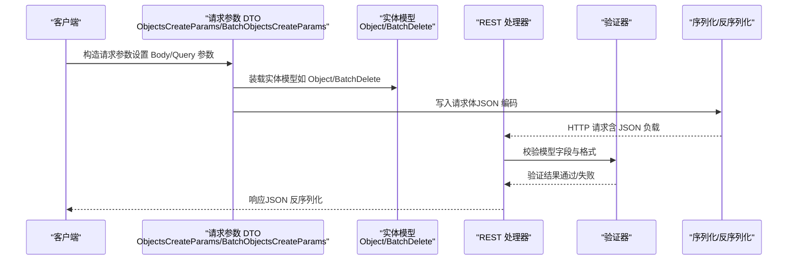
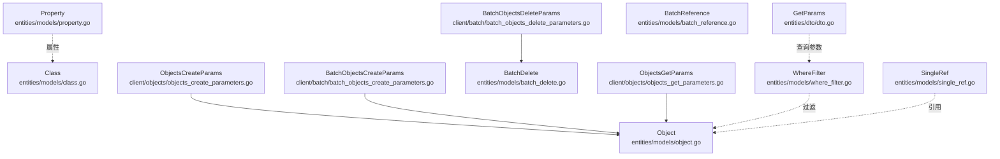
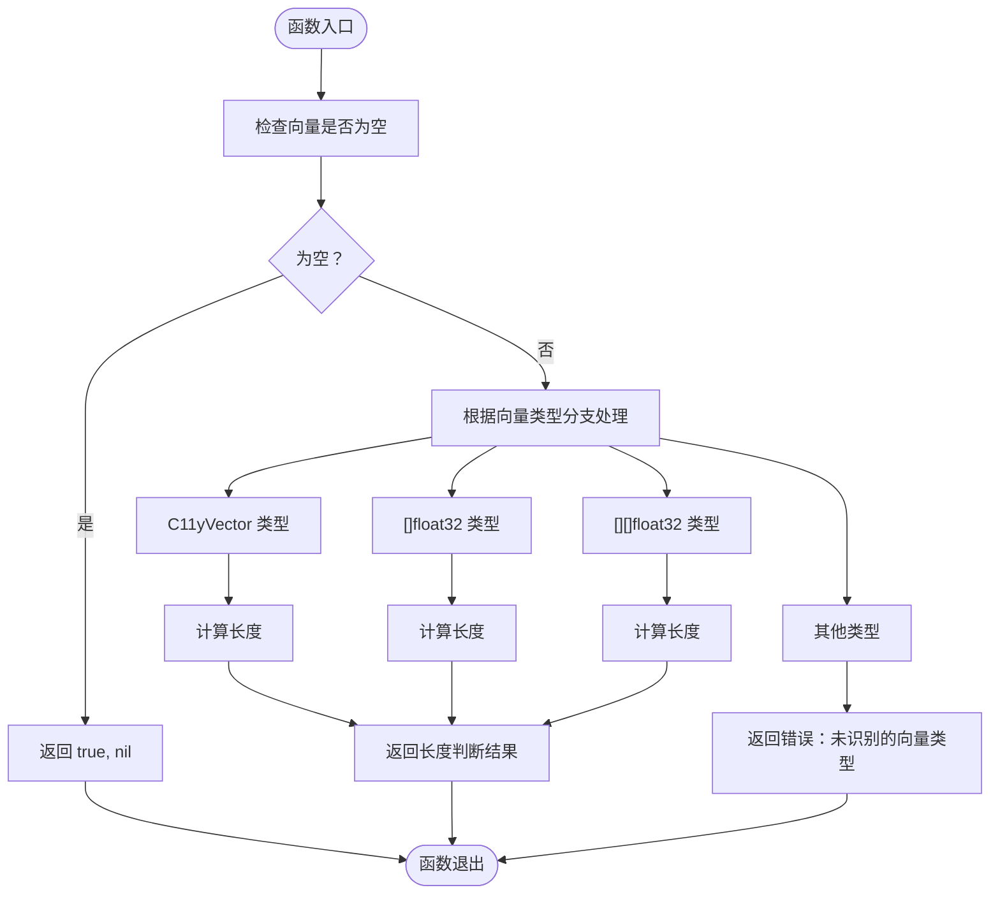

# 数据传输对象

<cite>
**本文引用的文件**
- [entities/dto/dto.go](file://entities/dto/dto.go)
- [entities/models/object.go](file://entities/models/object.go)
- [entities/models/class.go](file://entities/models/class.go)
- [entities/models/property.go](file://entities/models/property.go)
- [entities/models/property_schema.go](file://entities/models/property_schema.go)
- [entities/models/where_filter.go](file://entities/models/where_filter.go)
- [entities/models/single_ref.go](file://entities/models/single_ref.go)
- [entities/models/batch_delete.go](file://entities/models/batch_delete.go)
- [entities/models/batch_reference.go](file://entities/models/batch_reference.go)
- [client/objects/objects_create_parameters.go](file://client/objects/objects_create_parameters.go)
- [client/objects/objects_get_parameters.go](file://client/objects/objects_get_parameters.go)
- [client/batch/batch_objects_create_parameters.go](file://client/batch/batch_objects_create_parameters.go)
- [client/batch/batch_objects_delete_parameters.go](file://client/batch/batch_objects_delete_parameters.go)
</cite>

## 目录
1. [简介](#简介)
2. [项目结构](#项目结构)
3. [核心组件](#核心组件)
4. [架构总览](#架构总览)
5. [详细组件分析](#详细组件分析)
6. [依赖关系分析](#依赖关系分析)
7. [性能考量](#性能考量)
8. [故障排查指南](#故障排查指南)
9. [结论](#结论)
10. [附录](#附录)

## 简介
本文件系统性梳理 Weaviate 的数据传输对象（DTO）体系，覆盖请求 DTO 与响应 DTO 的设计原则、字段定义、数据类型与验证规则，以及序列化/反序列化机制、批量操作的特殊处理与性能考量、版本管理与兼容策略、校验逻辑与错误处理、在不同 API 层的使用方式，以及最佳实践与设计模式。目标读者为后端开发者与 API 设计师。

## 项目结构
Weaviate 的 DTO 分布于两个主要层次：
- 实体层（entities/models）：承载跨层使用的模型与验证逻辑，通常由 Swagger 工具生成，包含 JSON 标签、格式校验、二进制编解码接口等。
- 客户端层（client/*）：封装 HTTP 请求参数与负载，作为对外 API 的请求 DTO；部分参数对象直接持有实体模型或其子集。

图表来源
- [entities/models/object.go](file://entities/models/object.go#L28-L63)
- [entities/models/class.go](file://entities/models/class.go#L29-L72)
- [entities/models/property.go](file://entities/models/property.go#L30-L65)
- [entities/models/where_filter.go](file://entities/models/where_filter.go#L30-L97)
- [entities/models/single_ref.go](file://entities/models/single_ref.go#L28-L50)
- [entities/models/batch_delete.go](file://entities/models/batch_delete.go#L27-L43)
- [entities/models/batch_reference.go](file://entities/models/batch_reference.go#L28-L45)
- [client/objects/objects_create_parameters.go](file://client/objects/objects_create_parameters.go#L68-L92)
- [client/objects/objects_get_parameters.go](file://client/objects/objects_get_parameters.go#L66-L92)
- [client/batch/batch_objects_create_parameters.go](file://client/batch/batch_objects_create_parameters.go#L66-L90)
- [client/batch/batch_objects_delete_parameters.go](file://client/batch/batch_objects_delete_parameters.go#L68-L98)

章节来源
- [entities/models/object.go](file://entities/models/object.go#L28-L63)
- [client/objects/objects_create_parameters.go](file://client/objects/objects_create_parameters.go#L68-L92)

## 核心组件
本节聚焦两类核心 DTO 组件：查询/检索用的实体参数（GetParams）与通用对象模型（Object），并说明它们在请求与响应中的角色差异。

- 查询参数 DTO（GetParams）
  - 用于表达检索请求的输入参数，如过滤器、分页、排序、近邻搜索、混合检索、向量组合策略、租户、别名等。
  - 字段涵盖过滤、分页、游标、排序、属性选择、近邻/近对象、关键词重排、混合搜索、分组、目标向量组合、模块参数、附加属性、复制属性、租户与别名等。
  - 该结构在内部被解析为具体查询执行所需的参数集合，不直接参与 HTTP 序列化，但其字段类型与取值范围决定后续处理的正确性。

- 对象模型（Object）
  - 响应侧的核心载体，包含类名、ID、属性、向量、向量权重、额外元信息、多租户等。
  - 提供 JSON 标签与格式校验（UUID、向量等），并实现二进制编解码接口，便于内存/持久化/网络传输。

章节来源
- [entities/dto/dto.go](file://entities/dto/dto.go#L49-L69)
- [entities/models/object.go](file://entities/models/object.go#L28-L63)

## 架构总览
下图展示从客户端到服务端的关键交互路径，强调请求 DTO（客户端参数）如何携带实体模型，并通过验证与序列化进入服务端处理流程。

图表来源
- [client/objects/objects_create_parameters.go](file://client/objects/objects_create_parameters.go#L164-L198)
- [client/batch/batch_objects_create_parameters.go](file://client/batch/batch_objects_create_parameters.go#L162-L194)
- [entities/models/object.go](file://entities/models/object.go#L222-L238)
- [entities/models/batch_delete.go](file://entities/models/batch_delete.go#L108-L124)

## 详细组件分析

### 请求 DTO 与响应 DTO 的区别与用途
- 请求 DTO（客户端参数）
  - 作用：封装 HTTP 请求的路径、查询参数、请求体等，作为对外 API 的输入。
  - 示例：ObjectsCreateParams、BatchObjectsCreateParams、BatchObjectsDeleteParams。
  - 特点：包含 Body 字段（指向实体模型）、查询参数（如 consistency_level、tenant）、上下文与超时控制等。

- 响应 DTO（实体模型）
  - 作用：承载服务端返回的数据结构，如 Object、Class、Property、WhereFilter、SingleRef、BatchDelete、BatchReference 等。
  - 特点：提供 JSON 标签、格式校验、枚举约束、二进制编解码接口，确保跨进程/网络传输的一致性。

章节来源
- [client/objects/objects_create_parameters.go](file://client/objects/objects_create_parameters.go#L68-L92)
- [client/batch/batch_objects_create_parameters.go](file://client/batch/batch_objects_create_parameters.go#L66-L90)
- [client/batch/batch_objects_delete_parameters.go](file://client/batch/batch_objects_delete_parameters.go#L75-L98)
- [entities/models/object.go](file://entities/models/object.go#L28-L63)

### GetParams：查询参数 DTO
- 设计要点
  - 聚合多种检索维度：过滤、分页、游标、排序、属性选择、近邻/近对象、关键词重排、混合检索、分组、目标向量组合策略、租户、别名等。
  - 支持模块参数透传，便于扩展第三方能力。
  - 向量组合策略（TargetCombination）支持多种组合类型与权重，便于多向量融合。

- 字段与类型概览
  - Filters：本地过滤器
  - ClassName：字符串
  - Pagination：分页
  - Cursor：游标
  - Sort：排序列表
  - Properties：属性选择
  - NearVector/NearObject：近邻/近对象
  - KeywordRanking：关键词重排
  - HybridSearch：混合检索
  - GroupBy/Group：分组
  - TargetVectorCombination：目标向量组合
  - ModuleParams：模块参数映射
  - AdditionalProperties/ReplicationProperties/Tenant/Alias：附加属性、复制属性、租户、别名

- 使用场景
  - GraphQL/REST 查询入口参数
  - 批量检索与聚合
  - 多向量融合与重排

章节来源
- [entities/dto/dto.go](file://entities/dto/dto.go#L49-L69)

### Object：对象模型（响应 DTO）
- 字段与类型
  - Class：字符串（类名）
  - ID：UUID
  - Properties：PropertySchema（属性键值对）
  - Vector/Vectors：向量或命名向量映射
  - VectorWeights：向量权重
  - Additional：附加属性
  - CreationTimeUnix/LastUpdateTimeUnix：时间戳
  - Tenant：多租户标识
  - 其他只读字段（如向量相关）

- 验证与序列化
  - 提供 Validate/ContextValidate 方法，按字段进行格式与业务规则校验。
  - 提供 MarshalBinary/UnmarshalBinary，基于 JSON 进行二进制编解码，保证一致性。

- 使用场景
  - GET 对象、列表返回、聚合/分组结果中的对象载体。

章节来源
- [entities/models/object.go](file://entities/models/object.go#L28-L63)
- [entities/models/object.go](file://entities/models/object.go#L65-L89)
- [entities/models/object.go](file://entities/models/object.go#L158-L178)
- [entities/models/object.go](file://entities/models/object.go#L222-L238)

### Class：集合（类）模型
- 字段与类型
  - Class、Description、Properties、ReplicationConfig、ShardingConfig、VectorIndexType、Vectorizer、VectorConfig、VectorIndexConfig、MultiTenancyConfig、ObjectTTLConfig、InvertedIndexConfig、ModuleConfig 等。
- 验证与序列化
  - 提供 Validate/ContextValidate，逐字段校验嵌套模型。
  - 提供 MarshalBinary/UnmarshalBinary。

- 使用场景
  - Schema 管理、类配置读取与更新。

章节来源
- [entities/models/class.go](file://entities/models/class.go#L29-L72)
- [entities/models/class.go](file://entities/models/class.go#L74-L106)
- [entities/models/class.go](file://entities/models/class.go#L236-L267)
- [entities/models/class.go](file://entities/models/class.go#L369-L385)

### Property：属性模型
- 字段与类型
  - Name、Description、DataType、IndexFilterable、IndexSearchable、IndexRangeFilters、NestedProperties、Tokenization、ModuleConfig 等。
- 验证与序列化
  - 提供 Validate/ContextValidate，枚举校验（Tokenization）。
  - 提供 MarshalBinary/UnmarshalBinary。

- 使用场景
  - Schema 属性定义、索引策略配置。

章节来源
- [entities/models/property.go](file://entities/models/property.go#L30-L65)
- [entities/models/property.go](file://entities/models/property.go#L67-L82)
- [entities/models/property.go](file://entities/models/property.go#L174-L185)
- [entities/models/property.go](file://entities/models/property.go#L208-L224)

### PropertySchema：属性值接口
- 类型
  - PropertySchema 为接口，用于表示属性的名称与值，可包含分类或特征投影等附加元数据。
- 使用场景
  - Object.Properties 与聚合/分组结果中作为属性值容器。

章节来源
- [entities/models/property_schema.go](file://entities/models/property_schema.go#L19-L22)

### WhereFilter：过滤器模型
- 字段与类型
  - Operands（子条件）、Operator（运算符枚举）、Path（属性路径）、各类值字段（布尔/整数/数值/文本/日期/地理范围等）。
- 验证与序列化
  - 提供 Validate/ContextValidate，枚举校验（Operator）。
  - 提供 MarshalBinary/UnmarshalBinary。

- 使用场景
  - Where 条件构建、批量删除匹配条件。

章节来源
- [entities/models/where_filter.go](file://entities/models/where_filter.go#L30-L97)
- [entities/models/where_filter.go](file://entities/models/where_filter.go#L99-L118)
- [entities/models/where_filter.go](file://entities/models/where_filter.go#L247-L262)
- [entities/models/where_filter.go](file://entities/models/where_filter.go#L301-L317)

### SingleRef：单个引用
- 字段与类型
  - Beacon（直接引用 URI）、Class（概念引用 URI）、Href（只读链接）、Schema（属性值）、Classification（分类元信息）。
- 验证与序列化
  - 提供 Validate/ContextValidate，URI 格式校验。
  - 提供 MarshalBinary/UnmarshalBinary。

- 使用场景
  - 引用创建/删除/更新的输入与输出。

章节来源
- [entities/models/single_ref.go](file://entities/models/single_ref.go#L28-L50)
- [entities/models/single_ref.go](file://entities/models/single_ref.go#L52-L75)
- [entities/models/single_ref.go](file://entities/models/single_ref.go#L133-L144)
- [entities/models/single_ref.go](file://entities/models/single_ref.go#L163-L179)

### BatchDelete：批量删除
- 字段与类型
  - DeletionTimeUnixMilli、DryRun、Match（包含 Class 与 WhereFilter）、Output。
- 验证与序列化
  - 提供 Validate/ContextValidate，嵌套模型校验。
  - 提供 MarshalBinary/UnmarshalBinary。

- 使用场景
  - 批量删除请求 DTO。

章节来源
- [entities/models/batch_delete.go](file://entities/models/batch_delete.go#L27-L43)
- [entities/models/batch_delete.go](file://entities/models/batch_delete.go#L45-L56)
- [entities/models/batch_delete.go](file://entities/models/batch_delete.go#L78-L89)
- [entities/models/batch_delete.go](file://entities/models/batch_delete.go#L108-L124)

### BatchReference：批量引用
- 字段与类型
  - From（源引用 URI）、To（目标 URI）、Tenant。
- 验证与序列化
  - 提供 Validate/ContextValidate，URI 格式校验。
  - 提供 MarshalBinary/UnmarshalBinary。

- 使用场景
  - 批量引用创建的输入 DTO。

章节来源
- [entities/models/batch_reference.go](file://entities/models/batch_reference.go#L28-L45)
- [entities/models/batch_reference.go](file://entities/models/batch_reference.go#L47-L62)
- [entities/models/batch_reference.go](file://entities/models/batch_reference.go#L89-L91)
- [entities/models/batch_reference.go](file://entities/models/batch_reference.go#L94-L110)

### 客户端参数 DTO：请求 DTO
- ObjectsCreateParams
  - Body：*models.Object
  - ConsistencyLevel：一致性级别
  - 支持超时、上下文、自定义 HTTP 客户端
- ObjectsGetParams
  - ID：UUID
  - Include：附加信息（classification/vector/interpretation）
- BatchObjectsCreateParams
  - Body：BatchObjectsCreateBody（批量对象创建体）
  - ConsistencyLevel：一致性级别
- BatchObjectsDeleteParams
  - Body：*models.BatchDelete
  - ConsistencyLevel：一致性级别
  - Tenant：多租户

- 使用方式
  - 通过 WithBody/SetBody 设置实体模型
  - 通过 WriteToRequest 将参数写入运行时请求，自动处理查询参数与请求体

章节来源
- [client/objects/objects_create_parameters.go](file://client/objects/objects_create_parameters.go#L68-L92)
- [client/objects/objects_create_parameters.go](file://client/objects/objects_create_parameters.go#L164-L198)
- [client/objects/objects_get_parameters.go](file://client/objects/objects_get_parameters.go#L66-L92)
- [client/objects/objects_get_parameters.go](file://client/objects/objects_get_parameters.go#L164-L198)
- [client/batch/batch_objects_create_parameters.go](file://client/batch/batch_objects_create_parameters.go#L66-L90)
- [client/batch/batch_objects_create_parameters.go](file://client/batch/batch_objects_create_parameters.go#L162-L194)
- [client/batch/batch_objects_delete_parameters.go](file://client/batch/batch_objects_delete_parameters.go#L75-L98)
- [client/batch/batch_objects_delete_parameters.go](file://client/batch/batch_objects_delete_parameters.go#L181-L232)

### 序列化与反序列化机制
- JSON 格式转换
  - 实体模型通过 JSON 标签映射字段，遵循 OpenAPI 规范。
  - 提供 Validate/ContextValidate，确保字段格式与业务规则一致。
- 二进制编解码
  - 实现 MarshalBinary/UnmarshalBinary，内部使用 swag JSON 工具进行读写，保证跨进程/网络传输一致性。
- 字段映射规则
  - UUID、URI、时间戳等采用 strfmt/validate 校验，枚举字段通过枚举数组校验。

章节来源
- [entities/models/object.go](file://entities/models/object.go#L222-L238)
- [entities/models/class.go](file://entities/models/class.go#L369-L385)
- [entities/models/property.go](file://entities/models/property.go#L208-L224)
- [entities/models/where_filter.go](file://entities/models/where_filter.go#L301-L317)
- [entities/models/single_ref.go](file://entities/models/single_ref.go#L163-L179)
- [entities/models/batch_delete.go](file://entities/models/batch_delete.go#L108-L124)
- [entities/models/batch_reference.go](file://entities/models/batch_reference.go#L94-L110)

### 批量操作 DTO 的特殊处理与性能考虑
- 批量删除（BatchDelete）
  - DryRun：仅预估影响范围（最小/详细输出）
  - Match：限定 Class 与 WhereFilter
  - 性能建议：合理使用 WhereFilter 以减少扫描范围；根据 Output 控制返回粒度。
- 批量引用（BatchReference）
  - From/To：统一 URI 格式，便于跨节点引用
  - Tenant：多租户场景下的批量引用
  - 性能建议：批量提交前进行引用合法性校验，避免重复与无效引用。

章节来源
- [entities/models/batch_delete.go](file://entities/models/batch_delete.go#L27-L43)
- [entities/models/batch_reference.go](file://entities/models/batch_reference.go#L28-L45)

### 版本管理与兼容性策略
- Swagger 生成与二进制编解码
  - 实体模型由 Swagger 工具生成，具备 Validate/ContextValidate 与 MarshalBinary/UnmarshalBinary，有助于在版本演进中保持兼容性。
- 字段演进
  - 新增可选字段（omitempty）降低破坏性变更风险；保留历史字段并在验证中兼容。
- 建议
  - 对外 API 的请求 DTO（客户端参数）尽量保持稳定，通过实体模型的验证逻辑处理向后兼容。

章节来源
- [entities/models/object.go](file://entities/models/object.go#L12-L26)
- [entities/models/class.go](file://entities/models/class.go#L12-L27)
- [entities/models/property.go](file://entities/models/property.go#L12-L28)
- [entities/models/where_filter.go](file://entities/models/where_filter.go#L12-L28)
- [entities/models/single_ref.go](file://entities/models/single_ref.go#L12-L26)
- [entities/models/batch_delete.go](file://entities/models/batch_delete.go#L12-L25)
- [entities/models/batch_reference.go](file://entities/models/batch_reference.go#L12-L26)

### 校验逻辑与错误处理机制
- 字段级校验
  - UUID、URI、枚举值、嵌套模型等均在 Validate/ContextValidate 中完成。
- 错误聚合
  - 使用 CompositeValidationError 聚合多个错误，便于一次性反馈。
- 建议
  - 在服务端统一捕获验证错误并映射为标准 HTTP 状态码与错误响应。

章节来源
- [entities/models/object.go](file://entities/models/object.go#L65-L89)
- [entities/models/object.go](file://entities/models/object.go#L158-L178)
- [entities/models/class.go](file://entities/models/class.go#L74-L106)
- [entities/models/class.go](file://entities/models/class.go#L236-L267)
- [entities/models/property.go](file://entities/models/property.go#L67-L82)
- [entities/models/property.go](file://entities/models/property.go#L174-L185)
- [entities/models/where_filter.go](file://entities/models/where_filter.go#L99-L118)
- [entities/models/where_filter.go](file://entities/models/where_filter.go#L247-L262)
- [entities/models/single_ref.go](file://entities/models/single_ref.go#L52-L75)
- [entities/models/single_ref.go](file://entities/models/single_ref.go#L133-L144)
- [entities/models/batch_delete.go](file://entities/models/batch_delete.go#L45-L56)
- [entities/models/batch_delete.go](file://entities/models/batch_delete.go#L78-L89)
- [entities/models/batch_reference.go](file://entities/models/batch_reference.go#L47-L62)
- [entities/models/batch_reference.go](file://entities/models/batch_reference.go#L89-L91)

### 在不同 API 层的使用方式
- REST 层
  - 客户端参数 DTO 通过 WriteToRequest 写入请求，Body 字段装载实体模型。
- GraphQL 层
  - GetParams 作为内部查询参数，结合 WhereFilter、PropertySchema 等模型进行解析与执行。
- 批量层
  - BatchObjectsCreateParams/BatchObjectsDeleteParams 作为批量请求 DTO，分别装载对象集合与批量删除条件。

章节来源
- [client/objects/objects_create_parameters.go](file://client/objects/objects_create_parameters.go#L164-L198)
- [client/batch/batch_objects_create_parameters.go](file://client/batch/batch_objects_create_parameters.go#L162-L194)
- [client/batch/batch_objects_delete_parameters.go](file://client/batch/batch_objects_delete_parameters.go#L181-L232)
- [entities/dto/dto.go](file://entities/dto/dto.go#L49-L69)

### 最佳实践与设计模式
- 请求 DTO 设计
  - 明确区分必填/可选字段，使用枚举与格式校验约束输入。
  - 通过 WithBody/SetBody 统一装载实体模型，避免重复构造。
- 响应 DTO 设计
  - 保持 JSON 标签与字段类型稳定，新增字段使用可选字段。
  - 提供 Validate/ContextValidate 与二进制编解码，确保跨层一致性。
- 批量操作
  - 使用 DryRun 预估影响范围；合理组织 WhereFilter 与输出粒度。
- 版本兼容
  - 优先通过实体模型验证逻辑处理兼容，避免破坏性变更。

## 依赖关系分析
下图展示关键 DTO 之间的依赖关系与调用链：

图表来源
- [entities/dto/dto.go](file://entities/dto/dto.go#L49-L69)
- [entities/models/object.go](file://entities/models/object.go#L28-L63)
- [entities/models/class.go](file://entities/models/class.go#L29-L72)
- [entities/models/property.go](file://entities/models/property.go#L30-L65)
- [entities/models/where_filter.go](file://entities/models/where_filter.go#L30-L97)
- [entities/models/single_ref.go](file://entities/models/single_ref.go#L28-L50)
- [entities/models/batch_delete.go](file://entities/models/batch_delete.go#L27-L43)
- [entities/models/batch_reference.go](file://entities/models/batch_reference.go#L28-L45)
- [client/objects/objects_create_parameters.go](file://client/objects/objects_create_parameters.go#L68-L92)
- [client/objects/objects_get_parameters.go](file://client/objects/objects_get_parameters.go#L66-L92)
- [client/batch/batch_objects_create_parameters.go](file://client/batch/batch_objects_create_parameters.go#L66-L90)
- [client/batch/batch_objects_delete_parameters.go](file://client/batch/batch_objects_delete_parameters.go#L75-L98)

章节来源
- [entities/dto/dto.go](file://entities/dto/dto.go#L49-L69)
- [entities/models/object.go](file://entities/models/object.go#L28-L63)
- [entities/models/class.go](file://entities/models/class.go#L29-L72)
- [entities/models/property.go](file://entities/models/property.go#L30-L65)
- [entities/models/where_filter.go](file://entities/models/where_filter.go#L30-L97)
- [entities/models/single_ref.go](file://entities/models/single_ref.go#L28-L50)
- [entities/models/batch_delete.go](file://entities/models/batch_delete.go#L27-L43)
- [entities/models/batch_reference.go](file://entities/models/batch_reference.go#L28-L45)
- [client/objects/objects_create_parameters.go](file://client/objects/objects_create_parameters.go#L68-L92)
- [client/objects/objects_get_parameters.go](file://client/objects/objects_get_parameters.go#L66-L92)
- [client/batch/batch_objects_create_parameters.go](file://client/batch/batch_objects_create_parameters.go#L66-L90)
- [client/batch/batch_objects_delete_parameters.go](file://client/batch/batch_objects_delete_parameters.go#L75-L98)

## 性能考量
- 向量处理
  - GetParams 支持多向量与向量组合策略，合理选择组合类型与权重可提升检索质量与性能。
- 过滤与索引
  - WhereFilter 的 Operator 与 Path 设计直接影响查询计划与索引利用效率。
- 批量操作
  - 批量删除与引用创建应尽量减少无效请求与重复引用，配合 DryRun 评估影响范围。
- 序列化开销
  - 二进制编解码（MarshalBinary/UnmarshalBinary）在高并发场景下可降低 JSON 解析成本，但需权衡内存占用。

## 故障排查指南
- 常见问题
  - UUID/URI 格式错误：检查 strfmt 校验与 JSON 标签。
  - 枚举值非法：确认枚举数组与大小写敏感性。
  - 嵌套模型校验失败：逐层检查 Validate/ContextValidate 返回的复合错误。
- 排查步骤
  - 在客户端参数 DTO 中设置 Body 并调用 WriteToRequest，确认请求体结构。
  - 在服务端捕获验证错误，映射为标准错误响应。
  - 使用 DryRun 预估批量操作影响范围。

章节来源
- [entities/models/object.go](file://entities/models/object.go#L110-L120)
- [entities/models/where_filter.go](file://entities/models/where_filter.go#L208-L213)
- [entities/models/single_ref.go](file://entities/models/single_ref.go#L78-L100)
- [client/objects/objects_create_parameters.go](file://client/objects/objects_create_parameters.go#L164-L198)
- [client/batch/batch_objects_delete_parameters.go](file://client/batch/batch_objects_delete_parameters.go#L181-L232)

## 结论
Weaviate 的 DTO 体系通过实体模型与客户端参数 DTO 的清晰分工，实现了请求与响应的强类型约束与可验证性。借助 Swagger 生成、格式校验、枚举约束与二进制编解码，系统在跨层传输与版本演进中保持了良好的一致性与兼容性。批量操作 DTO 则提供了 DryRun、租户与多向量组合等特性，兼顾灵活性与性能。建议在实际开发中遵循本文的最佳实践与设计模式，确保 DTO 的正确使用与高效维护。

## 附录
- 关键流程图：向量解析与空向量检测

图表来源
- [entities/dto/dto.go](file://entities/dto/dto.go#L75-L88)
- [entities/dto/dto.go](file://entities/dto/dto.go#L90-L159)