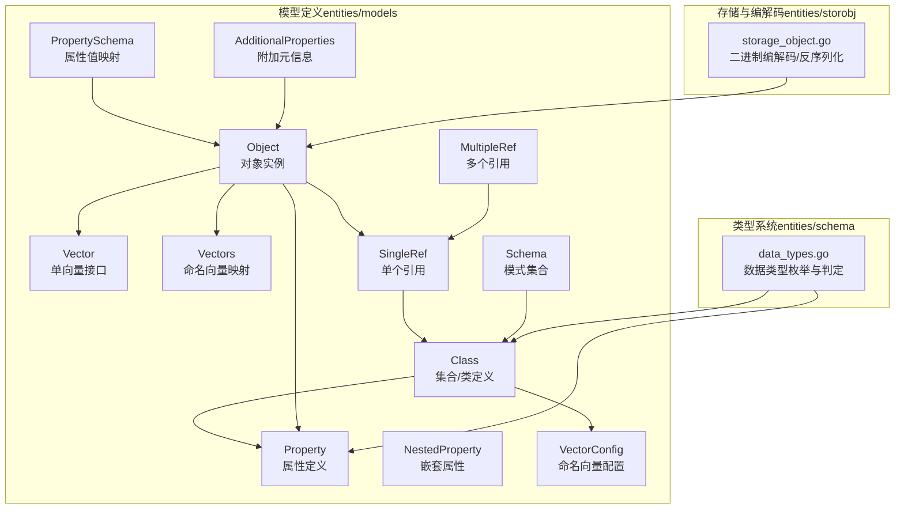
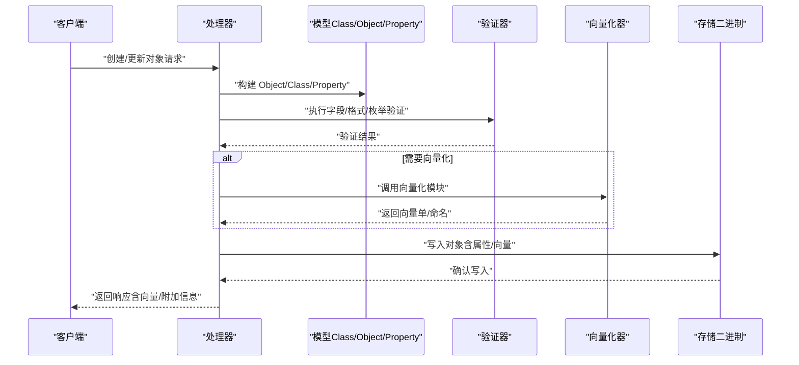
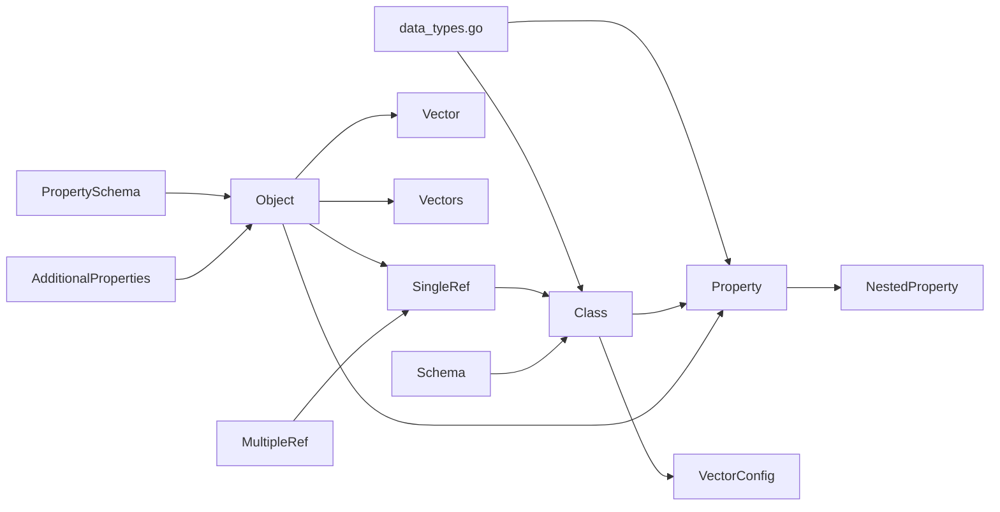
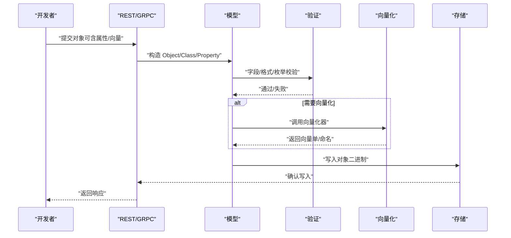

# 数据模型

<cite>
**本文档引用的文件**
- [entities/models/object.go](file://entities/models/object.go)
- [entities/models/class.go](file://entities/models/class.go)
- [entities/models/property.go](file://entities/models/property.go)
- [entities/models/vector.go](file://entities/models/vector.go)
- [entities/models/nested_property.go](file://entities/models/nested_property.go)
- [entities/models/vector_config.go](file://entities/models/vector_config.go)
- [entities/models/single_ref.go](file://entities/models/single_ref.go)
- [entities/models/multiple_ref.go](file://entities/models/multiple_ref.go)
- [entities/models/vectors.go](file://entities/models/vectors.go)
- [entities/models/property_schema.go](file://entities/models/property_schema.go)
- [entities/models/additional_properties.go](file://entities/models/additional_properties.go)
- [entities/models/schema.go](file://entities/models/schema.go)
- [entities/schema/data_types.go](file://entities/schema/data_types.go)
- [entities/storobj/storage_object.go](file://entities/storobj/storage_object.go)
- [adapters/handlers/grpc/v1/parse_search_request_test.go](file://adapters/handlers/grpc/v1/parse_search_request_test.go)
- [adapters/handlers/grpc/v1/prepare_reply_test.go](file://adapters/handlers/grpc/v1/prepare_reply_test.go)
- [test/acceptance_with_go_client/endpoint_test.go](file://test/acceptance_with_go_client/endpoint_test.go)
</cite>

## 目录
1. [简介](#简介)
2. [项目结构](#项目结构)
3. [核心组件](#核心组件)
4. [架构总览](#架构总览)
5. [详细组件分析](#详细组件分析)
6. [依赖分析](#依赖分析)
7. [性能考虑](#性能考虑)
8. [故障排查指南](#故障排查指南)
9. [结论](#结论)
10. [附录](#附录)

## 简介
本文件为 Weaviate 数据模型的权威参考，覆盖对象模型（Object）、类模型（Class）、属性模型（Property）、向量模型（Vector/Vectors）与引用模型（SingleRef/MultipleRef），并解释嵌套属性、引用属性与向量属性的建模方式、序列化/反序列化规则、数据类型体系、索引与验证约束，以及命名向量（Named Vectors）与多向量（Multi-Vectors）的处理。文档同时给出实体间关系映射（一对多、多对多）与版本兼容性与迁移策略建议，并提供可操作的使用场景与示例路径。

## 项目结构
Weaviate 的数据模型主要由一组 Swagger 生成的 Go 结构体组成，位于 entities/models 目录；数据类型体系与类型判定逻辑位于 entities/schema；底层存储与二进制编解码在 entities/storobj 中实现。典型的数据流从 API 层进入，经校验与模块化处理后写入存储层。

图表来源
- [entities/models/object.go](file://entities/models/object.go#L28-L63)
- [entities/models/class.go](file://entities/models/class.go#L29-L72)
- [entities/models/property.go](file://entities/models/property.go#L30-L65)
- [entities/models/nested_property.go](file://entities/models/nested_property.go#L30-L59)
- [entities/models/vector.go](file://entities/models/vector.go#L19-L22)
- [entities/models/vectors.go](file://entities/models/vectors.go#L27-L30)
- [entities/models/vector_config.go](file://entities/models/vector_config.go#L26-L39)
- [entities/models/single_ref.go](file://entities/models/single_ref.go#L28-L50)
- [entities/models/multiple_ref.go](file://entities/models/multiple_ref.go#L28-L31)
- [entities/models/property_schema.go](file://entities/models/property_schema.go#L19-L22)
- [entities/models/additional_properties.go](file://entities/models/additional_properties.go#L25-L28)
- [entities/models/schema.go](file://entities/models/schema.go#L29-L43)
- [entities/schema/data_types.go](file://entities/schema/data_types.go#L24-L106)
- [entities/storobj/storage_object.go](file://entities/storobj/storage_object.go#L1067-L1191)

章节来源
- [entities/models/object.go](file://entities/models/object.go#L28-L63)
- [entities/models/class.go](file://entities/models/class.go#L29-L72)
- [entities/models/property.go](file://entities/models/property.go#L30-L65)
- [entities/models/nested_property.go](file://entities/models/nested_property.go#L30-L59)
- [entities/models/vector.go](file://entities/models/vector.go#L19-L22)
- [entities/models/vectors.go](file://entities/models/vectors.go#L27-L30)
- [entities/models/vector_config.go](file://entities/models/vector_config.go#L26-L39)
- [entities/models/single_ref.go](file://entities/models/single_ref.go#L28-L50)
- [entities/models/multiple_ref.go](file://entities/models/multiple_ref.go#L28-L31)
- [entities/models/property_schema.go](file://entities/models/property_schema.go#L19-L22)
- [entities/models/additional_properties.go](file://entities/models/additional_properties.go#L25-L28)
- [entities/models/schema.go](file://entities/models/schema.go#L29-L43)
- [entities/schema/data_types.go](file://entities/schema/data_types.go#L24-L106)
- [entities/storobj/storage_object.go](file://entities/storobj/storage_object.go#L1067-L1191)

## 核心组件
- 对象模型（Object）
  - 字段：类名、ID、时间戳、属性、租户、向量（单向量或命名向量）、向量权重、附加元信息。
  - 验证：UUID 格式、向量/命名向量结构验证。
  - 序列化：支持二进制编解码。
- 类模型（Class）
  - 字段：类名、描述、倒排索引配置、模块配置、多租户配置、TTL 配置、属性列表、复制配置、分片配置、命名向量配置、向量索引类型/配置、向量化器。
  - 验证：属性、向量配置、复制配置等逐项验证。
- 属性模型（Property）
  - 字段：数据类型（支持引用/嵌套/基础类型）、描述、过滤索引、搜索索引、范围过滤索引、嵌套属性、分词设置。
  - 验证：嵌套属性、分词枚举。
- 嵌套属性（NestedProperty）
  - 字段：数据类型、描述、过滤/搜索/范围索引、名称、嵌套属性、分词设置。
  - 验证：嵌套属性、分词枚举。
- 向量模型
  - 单向量（Vector）：任意接口类型，用于导入或覆盖向量。
  - 命名向量（Vectors）：字符串到向量的映射，支持自定义反序列化以兼容一维/二维向量数组。
  - 命名向量配置（VectorConfig）：指定向量索引类型、索引配置、向量化器配置。
- 引用模型
  - 单个引用（SingleRef）：直接 beacon 或概念引用（类+Schema）。
  - 多个引用（MultipleRef）：SingleRef 切片。
- 其他
  - PropertySchema：属性名到值的映射（接口）。
  - AdditionalProperties：响应侧附加元信息（如分类结果）。
  - Schema：类集合的顶层模式容器。

章节来源
- [entities/models/object.go](file://entities/models/object.go#L28-L63)
- [entities/models/class.go](file://entities/models/class.go#L29-L72)
- [entities/models/property.go](file://entities/models/property.go#L30-L65)
- [entities/models/nested_property.go](file://entities/models/nested_property.go#L30-L59)
- [entities/models/vector.go](file://entities/models/vector.go#L19-L22)
- [entities/models/vectors.go](file://entities/models/vectors.go#L27-L30)
- [entities/models/vector_config.go](file://entities/models/vector_config.go#L26-L39)
- [entities/models/single_ref.go](file://entities/models/single_ref.go#L28-L50)
- [entities/models/multiple_ref.go](file://entities/models/multiple_ref.go#L28-L31)
- [entities/models/property_schema.go](file://entities/models/property_schema.go#L19-L22)
- [entities/models/additional_properties.go](file://entities/models/additional_properties.go#L25-L28)
- [entities/models/schema.go](file://entities/models/schema.go#L29-L43)

## 架构总览
下图展示了请求/响应在模型层的流转：客户端通过 REST/GRPC 发送请求，服务端解析为模型对象，进行验证与模块化处理（如向量化），随后持久化至存储层。

图表来源
- [entities/models/object.go](file://entities/models/object.go#L28-L63)
- [entities/models/class.go](file://entities/models/class.go#L29-L72)
- [entities/models/property.go](file://entities/models/property.go#L30-L65)
- [entities/models/vectors.go](file://entities/models/vectors.go#L42-L72)
- [entities/storobj/storage_object.go](file://entities/storobj/storage_object.go#L1067-L1191)

## 详细组件分析

### 对象模型（Object）
- 字段与约束
  - ID：UUID 格式校验。
  - 向量/命名向量：可选，分别进行结构验证。
  - Tenant：多租户标识。
  - 时间戳：创建/更新时间（毫秒）。
- 关系映射
  - 归属于某个 Class。
  - 可包含引用属性（指向其他对象）。
  - 可携带单向量或命名向量。
- 序列化/反序列化
  - 支持二进制编解码（MarshalBinary/UnmarshalBinary）。
- 使用场景
  - 查询时可选择返回向量（向量检索）。
  - 批量导入时可直接提供向量（覆盖向量化器）。

章节来源
- [entities/models/object.go](file://entities/models/object.go#L28-L63)
- [entities/models/vector.go](file://entities/models/vector.go#L19-L22)
- [entities/models/vectors.go](file://entities/models/vectors.go#L27-L30)
- [entities/storobj/storage_object.go](file://entities/storobj/storage_object.go#L1067-L1191)

### 类模型（Class）
- 字段与约束
  - Properties：必填，逐项验证。
  - VectorConfig：命名向量配置映射，键为向量名，值为 VectorConfig。
  - VectorIndexType/VectorIndexConfig/Vectorizer：传统全局向量配置（与 VectorConfig 并存时优先级需遵循实现约定）。
  - MultiTenancyConfig/ObjectTTLConfig/ReplicationConfig/ShardingConfig：可选配置。
- 关系映射
  - 定义了该类的所有属性（含嵌套属性）。
  - 可声明多个命名向量，每个向量可独立配置索引类型与向量化器。
- 使用场景
  - 创建类时定义属性与命名向量配置。
  - 更新类时可变更向量化器或添加新命名向量。

章节来源
- [entities/models/class.go](file://entities/models/class.go#L29-L72)
- [entities/models/vector_config.go](file://entities/models/vector_config.go#L26-L39)
- [adapters/handlers/grpc/v1/parse_search_request_test.go](file://adapters/handlers/grpc/v1/parse_search_request_test.go#L65-L100)
- [adapters/handlers/grpc/v1/prepare_reply_test.go](file://adapters/handlers/grpc/v1/prepare_reply_test.go#L118-L165)

### 属性模型（Property）与嵌套属性（NestedProperty）
- 字段与约束
  - DataType：支持基础类型、引用类型（首字母大写类名）、嵌套类型（object/object[]）。
  - IndexFilterable/IndexSearchable/IndexRangeFilters：控制索引行为。
  - NestedProperties：仅对 object/object[] 生效，递归验证。
  - Tokenization：文本分词策略枚举（word、lowercase、whitespace、field、trigram、gse、kagome_kr、kagome_ja、gse_ch）。
- 关系映射
  - 属性可嵌套，形成树状结构。
  - 引用属性通过 DataType 指向一个或多个类。
- 使用场景
  - 文本属性配置分词策略以优化检索。
  - 嵌套对象用于复杂结构（如地址、作者信息）。

章节来源
- [entities/models/property.go](file://entities/models/property.go#L30-L65)
- [entities/models/nested_property.go](file://entities/models/nested_property.go#L30-L59)
- [entities/schema/data_types.go](file://entities/schema/data_types.go#L24-L106)

### 向量模型（Vector/Vectors/VectorConfig）
- 单向量（Vector）
  - 接口类型，允许任意向量表示（如 []float32 或 [][]float32）。
- 命名向量（Vectors）
  - 映射：字符串 -> Vector。
  - 自定义反序列化：优先尝试一维向量（[]float32），否则尝试二维向量（[][]float32），否则报错。
- 命名向量配置（VectorConfig）
  - 包含向量索引类型、索引配置、向量化器配置。
- 使用场景
  - 为同一对象维护多个语义向量（如不同模态/任务）。
  - 在导入时提供向量以跳过在线向量化。

章节来源
- [entities/models/vector.go](file://entities/models/vector.go#L19-L22)
- [entities/models/vectors.go](file://entities/models/vectors.go#L27-L30)
- [entities/models/vectors.go](file://entities/models/vectors.go#L42-L72)
- [entities/models/vector_config.go](file://entities/models/vector_config.go#L26-L39)
- [adapters/handlers/grpc/v1/prepare_reply_test.go](file://adapters/handlers/grpc/v1/prepare_reply_test.go#L118-L165)

### 引用模型（SingleRef/MultipleRef）
- SingleRef
  - 直接引用（beacon）或概念引用（class + schema）。
  - 支持分类元信息（classification）。
- MultipleRef
  - SingleRef 切片，支持多目标引用。
- 使用场景
  - 多对多关系建模：一个对象可引用多个其他类别的对象。
  - 多租户下的跨对象引用。

章节来源
- [entities/models/single_ref.go](file://entities/models/single_ref.go#L28-L50)
- [entities/models/multiple_ref.go](file://entities/models/multiple_ref.go#L28-L31)

### 数据类型体系（DataType）
- 基础类型：text/int/number/boolean/date/uuid 及其数组。
- 引用类型：首字母大写的类名（DataTypeCRef）。
- 嵌套类型：object/object[]。
- 已弃用类型：string/string[]（由 text/text[] 替代）。
- 类型判定与引用解析：根据 DataType[] 推断属性种类（基础/引用/嵌套），并校验引用类存在性。

章节来源
- [entities/schema/data_types.go](file://entities/schema/data_types.go#L24-L106)
- [entities/schema/data_types.go](file://entities/schema/data_types.go#L225-L299)

### 序列化与反序列化规则
- JSON 编解码
  - 模型普遍支持 JSON 序列化/反序列化（含自定义反序列化方法）。
  - Vectors 提供自定义 UnmarshalJSON，以兼容一维/二维向量数组。
- 二进制编解码（存储层）
  - 存储对象支持版本化二进制编解码，包含向量长度、类名、属性长度等头部信息。
  - 反序列化属性时，针对嵌套对象采用标准 JSON 解析，其余基础类型使用高效解析器。

章节来源
- [entities/models/vectors.go](file://entities/models/vectors.go#L42-L72)
- [entities/storobj/storage_object.go](file://entities/storobj/storage_object.go#L1067-L1191)

### 实体关系映射与建模要点
- 一对多/多对多
  - 通过 MultipleRef 实现多目标引用，从而表达多对多关系。
  - 引用的目标类由 Property.DataType[] 决定，可为多个类。
- 嵌套属性
  - 通过 NestedProperties 与 Property/NestedProperty 的递归结构建模复杂对象。
- 向量属性
  - 单向量：Object.vector。
  - 命名向量：Object.vectors（多向量）。
  - 可与属性一起存储，查询时可按需返回。

章节来源
- [entities/models/multiple_ref.go](file://entities/models/multiple_ref.go#L28-L31)
- [entities/models/property.go](file://entities/models/property.go#L30-L65)
- [entities/models/nested_property.go](file://entities/models/nested_property.go#L30-L59)
- [entities/models/object.go](file://entities/models/object.go#L28-L63)

### 版本兼容性与迁移策略
- 模型版本
  - 存储对象支持版本化二进制编解码（MarshallerVersion），当前实现检查版本号以确保兼容性。
- 迁移建议
  - 新增字段：保持向后兼容，未使用的字段在读取时忽略。
  - 删除字段：避免破坏旧版本读取，必要时保留只读或标记弃用。
  - 向量结构变更：通过命名向量（VectorConfig/Vectors）提供并行向量，逐步替换旧向量。
  - 引用类变更：使用 DataType[] 的多类引用能力，避免硬编码单一目标类。

章节来源
- [entities/storobj/storage_object.go](file://entities/storobj/storage_object.go#L1184-L1191)

### 实际使用场景与示例路径
- 创建类并启用命名向量
  - 示例路径：[命名向量测试样例](file://adapters/handlers/grpc/v1/prepare_reply_test.go#L118-L165)
- 更新对象并向量合并
  - 示例路径：[更新对象并合并向量](file://test/acceptance_with_go_client/endpoint_test.go#L103-L129)
- 多类引用与属性定义
  - 示例路径：[多类引用与属性定义](file://adapters/handlers/grpc/v1/parse_search_request_test.go#L65-L100)

章节来源
- [adapters/handlers/grpc/v1/prepare_reply_test.go](file://adapters/handlers/grpc/v1/prepare_reply_test.go#L118-L165)
- [test/acceptance_with_go_client/endpoint_test.go](file://test/acceptance_with_go_client/endpoint_test.go#L103-L129)
- [adapters/handlers/grpc/v1/parse_search_request_test.go](file://adapters/handlers/grpc/v1/parse_search_request_test.go#L65-L100)

## 依赖分析
下图展示模型间的依赖关系与验证链路。

图表来源
- [entities/schema/data_types.go](file://entities/schema/data_types.go#L24-L106)
- [entities/models/class.go](file://entities/models/class.go#L29-L72)
- [entities/models/property.go](file://entities/models/property.go#L30-L65)
- [entities/models/nested_property.go](file://entities/models/nested_property.go#L30-L59)
- [entities/models/object.go](file://entities/models/object.go#L28-L63)
- [entities/models/vector.go](file://entities/models/vector.go#L19-L22)
- [entities/models/vectors.go](file://entities/models/vectors.go#L27-L30)
- [entities/models/single_ref.go](file://entities/models/single_ref.go#L28-L50)
- [entities/models/multiple_ref.go](file://entities/models/multiple_ref.go#L28-L31)
- [entities/models/property_schema.go](file://entities/models/property_schema.go#L19-L22)
- [entities/models/additional_properties.go](file://entities/models/additional_properties.go#L25-L28)
- [entities/models/schema.go](file://entities/models/schema.go#L29-L43)

## 性能考虑
- 向量存储与检索
  - 命名向量允许并行维护多组向量，便于按任务/模态选择最优向量。
  - Vectors 的自定义反序列化避免不必要的内存拷贝，优先识别一维/二维向量。
- 属性反序列化
  - 存储层对嵌套对象采用标准 JSON 解析，其余基础类型使用高效解析器，降低 CPU 与内存开销。
- 索引策略
  - 合理配置 IndexFilterable/IndexSearchable/IndexRangeFilters，平衡查询性能与存储成本。

[本节为通用指导，不直接分析具体文件]

## 故障排查指南
- UUID 格式错误
  - 现象：Object.ID 校验失败。
  - 排查：确认 ID 是否为合法 UUID。
- 向量/命名向量格式错误
  - 现象：Vectors 反序列化失败。
  - 排查：确保向量为一维（[]float32）或二维（[][]float32）数组之一。
- 引用类不存在
  - 现象：Property.DataType 指向的类未定义。
  - 排查：检查 DataType[] 中的类名是否存在于 Schema 中。
- 嵌套属性验证失败
  - 现象：NestedProperty 分词枚举或嵌套结构非法。
  - 排查：核对 tokenization 枚举值与嵌套层级。

章节来源
- [entities/models/object.go](file://entities/models/object.go#L110-L120)
- [entities/models/vectors.go](file://entities/models/vectors.go#L42-L72)
- [entities/models/property.go](file://entities/models/property.go#L161-L172)
- [entities/models/nested_property.go](file://entities/models/nested_property.go#L155-L166)
- [entities/schema/data_types.go](file://entities/schema/data_types.go#L243-L299)

## 结论
Weaviate 的数据模型以清晰的类/属性/对象三层结构为核心，结合命名向量与引用机制，既支持复杂嵌套与多对多关系建模，又兼顾向量检索与存储性能。通过严格的类型体系与验证规则，开发者可以安全地设计与演进数据模型；通过版本化存储与命名向量策略，可在不中断服务的前提下平滑迁移与扩展。

[本节为总结性内容，不直接分析具体文件]

## 附录
- 关键流程图：对象创建与向量化序列

图表来源
- [entities/models/object.go](file://entities/models/object.go#L28-L63)
- [entities/models/class.go](file://entities/models/class.go#L29-L72)
- [entities/models/property.go](file://entities/models/property.go#L30-L65)
- [entities/models/vectors.go](file://entities/models/vectors.go#L42-L72)
- [entities/storobj/storage_object.go](file://entities/storobj/storage_object.go#L1067-L1191)