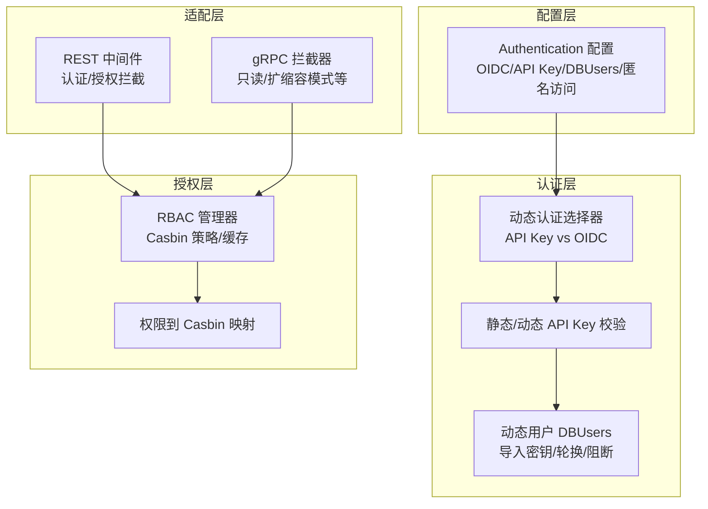
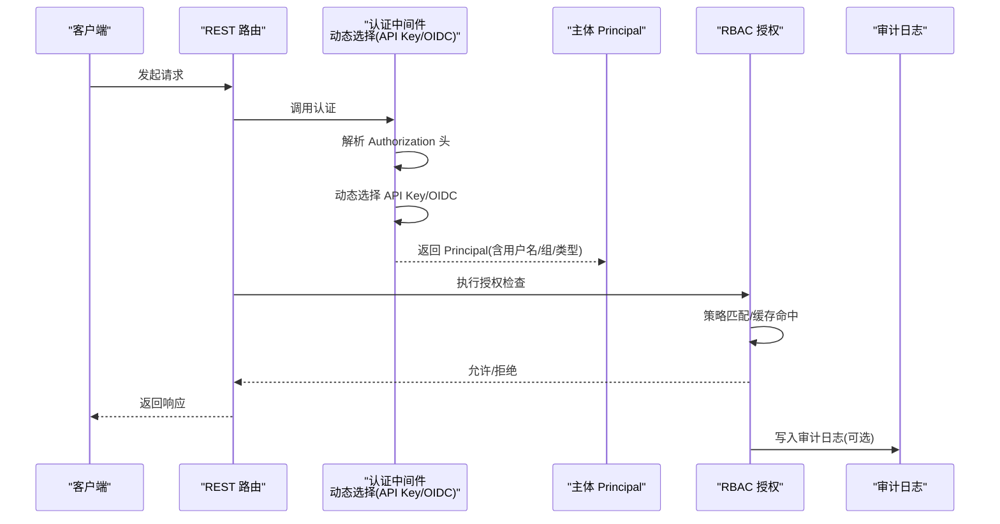
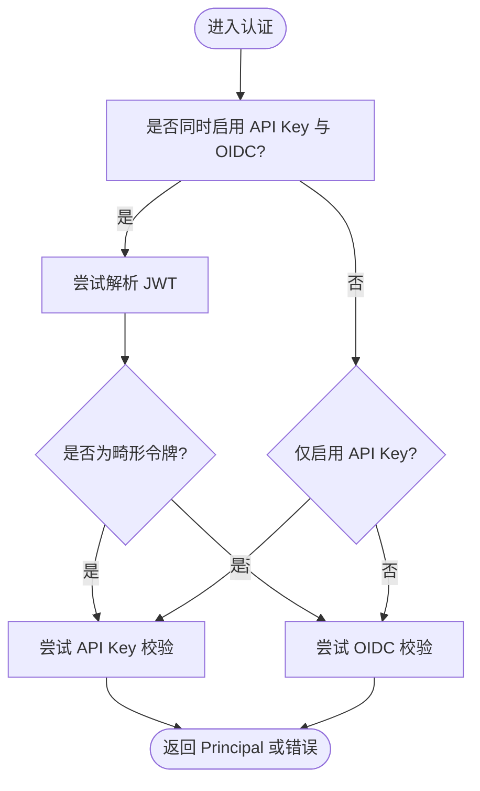
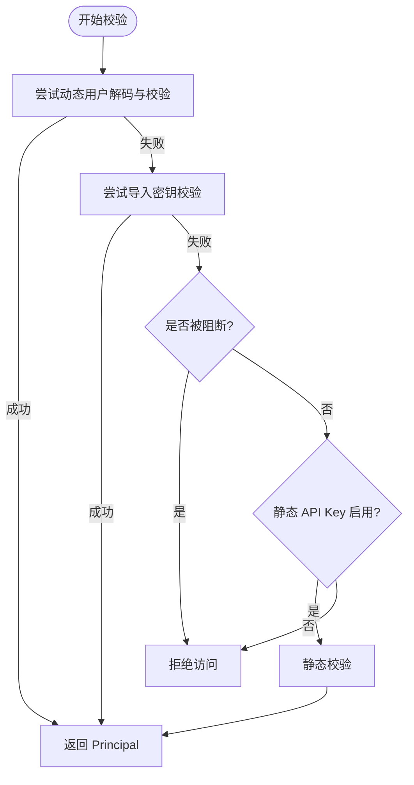
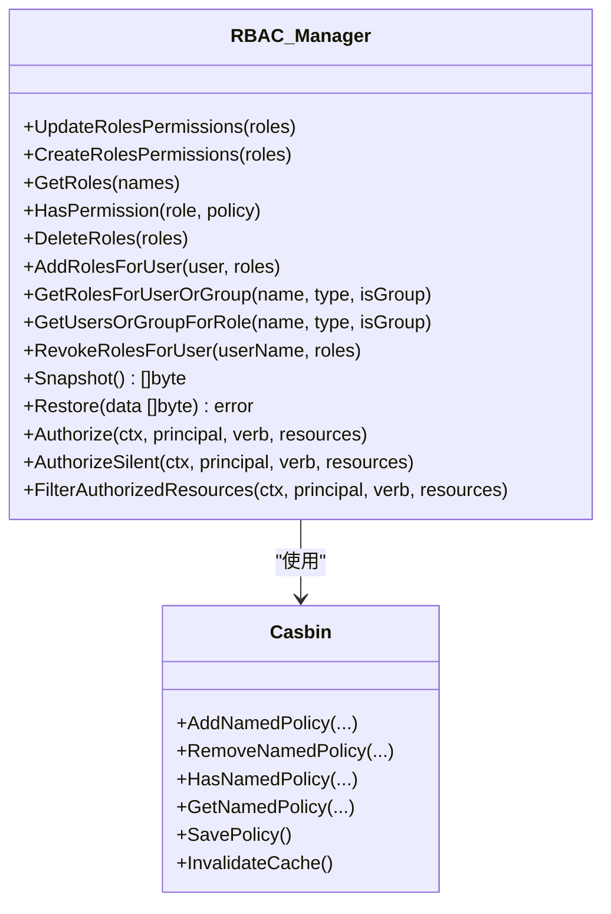
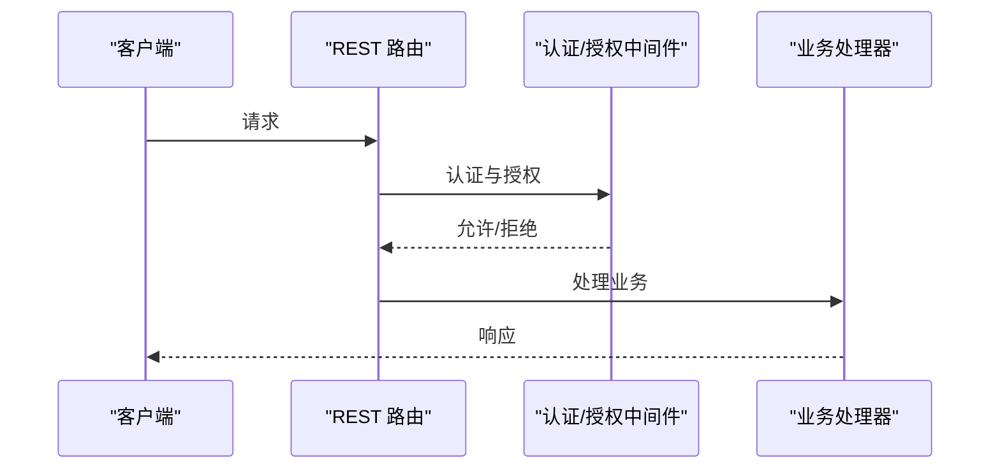
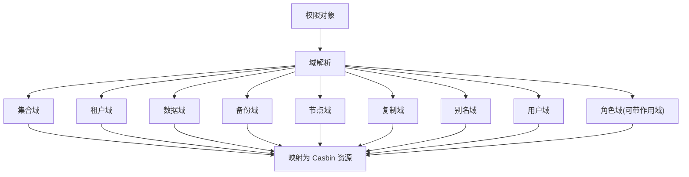
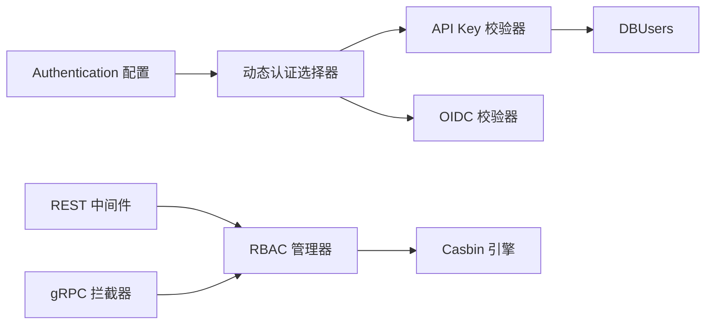

# API 认证与授权

<cite>
**本文引用的文件**   
- [token_validation.go](file://usecases/auth/authentication/composer/token_validation.go)
- [wrapper.go](file://usecases/auth/authentication/apikey/wrapper.go)
- [db_users.go](file://usecases/auth/authentication/apikey/db_users.go)
- [authentication.go](file://usecases/config/authentication.go)
- [principal.go](file://entities/models/principal.go)
- [manager.go](file://usecases/auth/authorization/rbac/manager.go)
- [configure_server.go](file://adapters/handlers/rest/configure_server.go)
- [handlers_authz.go](file://adapters/handlers/rest/authz/handlers_authz.go)
- [validation.go](file://adapters/handlers/rest/authz/validation.go)
- [casbin_types.go](file://usecases/auth/authorization/conv/casbin_types.go)
- [authorizer.go](file://usecases/auth/authorization/rbac/authorizer.go)
- [server.go](file://adapters/handlers/grpc/server.go)
- [rbac_auto_admin_permissions_test.go](file://test/acceptance/authz/rbac_auto_admin_permissions_test.go)
</cite>

## 目录
1. [引言](#引言)
2. [项目结构](#项目结构)
3. [核心组件](#核心组件)
4. [架构总览](#架构总览)
5. [详细组件分析](#详细组件分析)
6. [依赖关系分析](#依赖关系分析)
7. [性能考量](#性能考量)
8. [故障排查指南](#故障排查指南)
9. [结论](#结论)
10. [附录](#附录)

## 引言
本文件系统性梳理 Weaviate 的 API 认证与授权机制，覆盖以下主题：
- 认证方式：静态 API Key、动态用户（数据库用户）与 OIDC/OpenID Connect 的运行时选择；匿名访问策略。
- 授权模型：基于角色的访问控制（RBAC），使用 Casbin 策略引擎；资源域与动作域划分；权限继承与组合。
- 中间件与请求处理流程：REST 与 gRPC 层的认证与授权拦截器、权限过滤与审计日志。
- 权限策略：继承、组合与冲突处理；权限范围与作用域。
- 配置与集成：认证配置项、客户端接入要点、安全传输与令牌刷新建议。
- 错误处理与安全审计：失败响应、错误分类与审计日志字段。

## 项目结构
Weaviate 将认证与授权分层设计：
- 配置层：集中定义认证与授权开关与参数（如 OIDC、API Key、DB Users、匿名访问等）。
- 认证层：负责从请求中提取并校验身份，生成主体（Principal），支持动态选择 API Key 或 OIDC。
- 授权层：以 RBAC 为核心，使用 Casbin 进行策略匹配与缓存，提供权限查询、角色分配与审计日志。
- 适配层：REST 与 gRPC Handler 在路由入口处挂载认证与授权中间件，统一处理鉴权失败与权限过滤。

**图表来源**
- [authentication.go](file://usecases/config/authentication.go#L20-L84)
- [token_validation.go](file://usecases/auth/authentication/composer/token_validation.go#L25-L69)
- [wrapper.go](file://usecases/auth/authentication/apikey/wrapper.go#L24-L77)
- [db_users.go](file://usecases/auth/authentication/apikey/db_users.go#L99-L153)
- [manager.go](file://usecases/auth/authorization/rbac/manager.go#L40-L602)
- [casbin_types.go](file://usecases/auth/authorization/conv/casbin_types.go#L243-L292)
- [configure_server.go](file://adapters/handlers/rest/configure_server.go#L121-L149)

**章节来源**
- [authentication.go](file://usecases/config/authentication.go#L20-L84)
- [token_validation.go](file://usecases/auth/authentication/composer/token_validation.go#L25-L69)
- [wrapper.go](file://usecases/auth/authentication/apikey/wrapper.go#L24-L77)
- [db_users.go](file://usecases/auth/authentication/apikey/db_users.go#L99-L153)
- [manager.go](file://usecases/auth/authorization/rbac/manager.go#L40-L602)
- [casbin_types.go](file://usecases/auth/authorization/conv/casbin_types.go#L243-L292)
- [configure_server.go](file://adapters/handlers/rest/configure_server.go#L121-L149)

## 核心组件
- 动态认证选择器：根据配置在 API Key 与 OIDC 之间自动选择，或仅启用其一。
- API Key 统一校验器：优先尝试动态用户解码与校验，回退至静态 API Key；支持导入密钥阻断与轮换。
- 动态用户 DBUsers：持久化存储用户、弱哈希缓存、密钥轮换、导入阻断、最后使用时间更新。
- RBAC 管理器：封装 Casbin，提供角色/策略增删改查、权限检查、快照与恢复、审计日志。
- REST 与 gRPC 中间件：REST 在路由层进行认证与授权；gRPC 提供只读/写入模式拦截与基础认证拦截。

**章节来源**
- [token_validation.go](file://usecases/auth/authentication/composer/token_validation.go#L25-L69)
- [wrapper.go](file://usecases/auth/authentication/apikey/wrapper.go#L24-L77)
- [db_users.go](file://usecases/auth/authentication/apikey/db_users.go#L368-L436)
- [manager.go](file://usecases/auth/authorization/rbac/manager.go#L40-L602)
- [server.go](file://adapters/handlers/grpc/server.go#L197-L237)

## 架构总览
下图展示从请求进入 REST/GPRC 到完成认证与授权的整体流程。

**图表来源**
- [token_validation.go](file://usecases/auth/authentication/composer/token_validation.go#L25-L69)
- [wrapper.go](file://usecases/auth/authentication/apikey/wrapper.go#L45-L77)
- [manager.go](file://usecases/auth/authorization/rbac/manager.go#L444-L458)
- [authorizer.go](file://usecases/auth/authorization/rbac/authorizer.go#L93-L128)

## 详细组件分析

### 认证：动态选择 API Key 与 OIDC
- 运行时选择逻辑：若同时启用 API Key 与 OIDC，则通过解析 JWT 是否“畸形”来判断令牌类型，优先尝试 API Key，否则走 OIDC。
- 仅启用一种：若仅开启 API Key 或 OIDC，则直接调用对应校验器。
- 未配置但携带头：返回 401 并提示需配置认证方案或移除头部。

**图表来源**
- [token_validation.go](file://usecases/auth/authentication/composer/token_validation.go#L25-L69)

**章节来源**
- [token_validation.go](file://usecases/auth/authentication/composer/token_validation.go#L25-L69)

### 认证：API Key 统一校验与动态用户
- 动态用户优先：尝试对“动态用户令牌”进行解码与校验；若失败，尝试“导入密钥”校验；若仍失败且发现该密钥被阻断，则拒绝。
- 回退静态 API Key：当动态用户不可用或校验失败时，回退到静态 API Key 配置。
- 密钥阻断与轮换：导入密钥在轮换后会被阻断，确保旧密钥不再生效。
- 最后使用时间：并发登录时采用轻量锁更新最后使用时间，避免频繁落盘。

**图表来源**
- [wrapper.go](file://usecases/auth/authentication/apikey/wrapper.go#L45-L77)
- [db_users.go](file://usecases/auth/authentication/apikey/db_users.go#L328-L436)

**章节来源**
- [wrapper.go](file://usecases/auth/authentication/apikey/wrapper.go#L24-L77)
- [db_users.go](file://usecases/auth/authentication/apikey/db_users.go#L328-L436)

### 授权：RBAC 与 Casbin
- 策略存储与缓存：RBAC 使用 Casbin 的同步缓存执行器，支持策略保存、缓存失效与快照恢复。
- 权限映射：将权限对象转换为 Casbin 的资源、动作与域，支持多域（集合、租户、数据、备份、节点、复制、别名、用户、角色等）。
- 授权检查：先按组权限检查，再按用户权限检查；支持静默授权（内部使用）与带审计日志授权。
- 审计日志：记录每次授权结果与资源详情，便于合规审计。

**图表来源**
- [manager.go](file://usecases/auth/authorization/rbac/manager.go#L40-L602)
- [casbin_types.go](file://usecases/auth/authorization/conv/casbin_types.go#L243-L292)
- [authorizer.go](file://usecases/auth/authorization/rbac/authorizer.go#L93-L128)

**章节来源**
- [manager.go](file://usecases/auth/authorization/rbac/manager.go#L40-L602)
- [casbin_types.go](file://usecases/auth/authorization/conv/casbin_types.go#L243-L292)
- [authorizer.go](file://usecases/auth/authorization/rbac/authorizer.go#L93-L128)

### REST 与 gRPC 中间件集成
- REST：在路由层挂载认证与授权中间件，REST Handler 在处理业务前进行授权检查，并在需要时返回 401/403/5xx。
- gRPC：提供只读/写入模式拦截器与基础认证拦截器，确保在特定运营模式下拒绝不被允许的操作。

**图表来源**
- [configure_server.go](file://adapters/handlers/rest/configure_server.go#L121-L149)
- [handlers_authz.go](file://adapters/handlers/rest/authz/handlers_authz.go#L281-L310)
- [server.go](file://adapters/handlers/grpc/server.go#L197-L237)

**章节来源**
- [configure_server.go](file://adapters/handlers/rest/configure_server.go#L121-L149)
- [handlers_authz.go](file://adapters/handlers/rest/authz/handlers_authz.go#L281-L310)
- [server.go](file://adapters/handlers/grpc/server.go#L197-L237)

### 权限模型与资源域
- 权限对象包含多个域字段：集合、租户、数据、备份、节点、复制、别名、用户、角色等。
- 资源映射：将权限对象映射为 Casbin 的资源字符串，支持通配符与范围限定。
- 角色与作用域：角色域支持作用域修饰，用于细化权限边界。

**图表来源**
- [validation.go](file://adapters/handlers/rest/authz/validation.go#L22-L53)
- [casbin_types.go](file://usecases/auth/authorization/conv/casbin_types.go#L243-L292)

**章节来源**
- [validation.go](file://adapters/handlers/rest/authz/validation.go#L22-L53)
- [casbin_types.go](file://usecases/auth/authorization/conv/casbin_types.go#L243-L292)

### 主体（Principal）与用户类型
- Principal 包含用户名、用户类型与组列表，作为授权决策的输入。
- 用户类型区分数据库用户与 OIDC 用户，影响角色前缀与映射规则。

**章节来源**
- [principal.go](file://entities/models/principal.go#L27-L40)

## 依赖关系分析
- 认证配置驱动认证选择器与 API Key 校验器初始化。
- 认证选择器输出 Principal，交由 RBAC 管理器进行授权检查。
- REST 与 gRPC 适配层在路由与服务层分别挂载认证与授权拦截器。
- RBAC 管理器依赖 Casbin 进行策略匹配与缓存，支持快照与恢复。

**图表来源**
- [authentication.go](file://usecases/config/authentication.go#L20-L84)
- [token_validation.go](file://usecases/auth/authentication/composer/token_validation.go#L25-L69)
- [wrapper.go](file://usecases/auth/authentication/apikey/wrapper.go#L24-L77)
- [db_users.go](file://usecases/auth/authentication/apikey/db_users.go#L99-L153)
- [configure_server.go](file://adapters/handlers/rest/configure_server.go#L121-L149)
- [manager.go](file://usecases/auth/authorization/rbac/manager.go#L40-L602)

**章节来源**
- [authentication.go](file://usecases/config/authentication.go#L20-L84)
- [token_validation.go](file://usecases/auth/authentication/composer/token_validation.go#L25-L69)
- [wrapper.go](file://usecases/auth/authentication/apikey/wrapper.go#L24-L77)
- [db_users.go](file://usecases/auth/authentication/apikey/db_users.go#L99-L153)
- [configure_server.go](file://adapters/handlers/rest/configure_server.go#L121-L149)
- [manager.go](file://usecases/auth/authorization/rbac/manager.go#L40-L602)

## 性能考量
- 动态用户首次登录进行强哈希验证并缓存弱哈希，后续登录命中弱哈希快速比较，显著降低 CPU 开销。
- Casbin 使用同步缓存执行器，策略变更后主动失效缓存，保证一致性与性能平衡。
- DBUsers 文件写入采用定时器与原子重命名，减少频繁落盘带来的 IO 抖动。
- REST 与 gRPC 中间件在路由入口进行认证与授权，避免无谓的业务处理开销。

[本节为通用指导，无需列出具体文件来源]

## 故障排查指南
- 认证失败（401）：
  - 未配置任何认证方案却提供了 Authorization 头：请启用 OIDC 或 API Key，或移除头部。
  - 动态认证选择失败：确认令牌格式与配置项一致。
- 授权失败（403）：
  - 检查角色是否正确绑定到用户或组，确认策略资源与动作域匹配。
  - 使用权限检查接口验证角色是否具备所需权限。
- 审计日志：
  - 授权结果与资源详情会写入日志，便于定位问题。
- 测试参考：
  - 可参考端到端测试中管理员密钥通过所有写入接口的行为，验证默认管理员权限是否正确加载。

**章节来源**
- [token_validation.go](file://usecases/auth/authentication/composer/token_validation.go#L44-L48)
- [handlers_authz.go](file://adapters/handlers/rest/authz/handlers_authz.go#L281-L310)
- [authorizer.go](file://usecases/auth/authorization/rbac/authorizer.go#L93-L128)
- [rbac_auto_admin_permissions_test.go](file://test/acceptance/authz/rbac_auto_admin_permissions_test.go#L79-L141)

## 结论
Weaviate 的认证与授权体系以“动态认证 + RBAC 授权”为核心，结合 Casbin 的高效策略匹配与细粒度资源域建模，实现了灵活、可审计、可扩展的 API 安全框架。通过 REST 与 gRPC 中间件统一接入，开发者可在不侵入业务代码的前提下完成安全控制。建议在生产环境启用 TLS 传输、最小权限原则配置 RBAC、定期轮换密钥并启用审计日志。

[本节为总结性内容，无需列出具体文件来源]

## 附录

### 认证配置要点
- OIDC：启用、提供 Issuer、ClientID、UsernameClaim、Scopes 等必要字段；可配置证书与 JWKS URL。
- API Key：启用静态 API Key 或动态用户；动态用户支持导入密钥与轮换。
- 匿名访问：仅影响认证阶段，不影响授权。

**章节来源**
- [authentication.go](file://usecases/config/authentication.go#L20-L84)

### 客户端集成要点
- REST：在请求头添加 Authorization: Bearer <token>，或使用 API Key。
- gRPC：根据部署模式，可能需要基础认证或遵循只读/写入限制。
- RBAC：通过管理接口创建角色、分配权限、绑定用户/组，再进行授权检查。

**章节来源**
- [configure_server.go](file://adapters/handlers/rest/configure_server.go#L121-L149)
- [handlers_authz.go](file://adapters/handlers/rest/authz/handlers_authz.go#L281-L310)
- [server.go](file://adapters/handlers/grpc/server.go#L197-L237)

### 会话管理与令牌刷新
- OIDC：遵循标准流程，通过 OIDC 提供商进行令牌刷新与会话管理。
- API Key：建议定期轮换密钥，动态用户支持导入密钥与轮换后的阻断策略。

**章节来源**
- [db_users.go](file://usecases/auth/authentication/apikey/db_users.go#L215-L245)

### 安全传输与最佳实践
- 建议在网关或反向代理层启用 TLS，确保传输安全。
- 最小权限原则：为角色分配最小必要的权限域与动作。
- 定期审计：启用并审查授权日志，监控异常访问。

[本节为通用指导，无需列出具体文件来源]