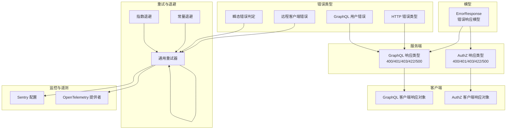
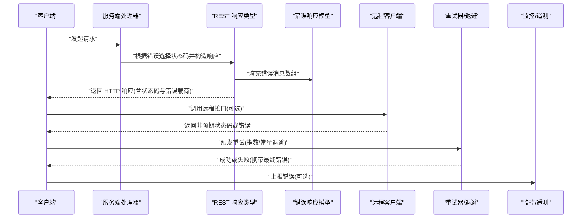
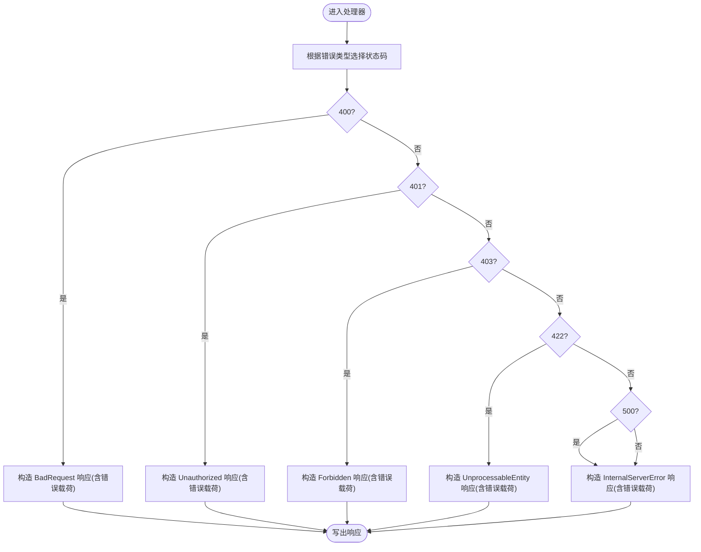
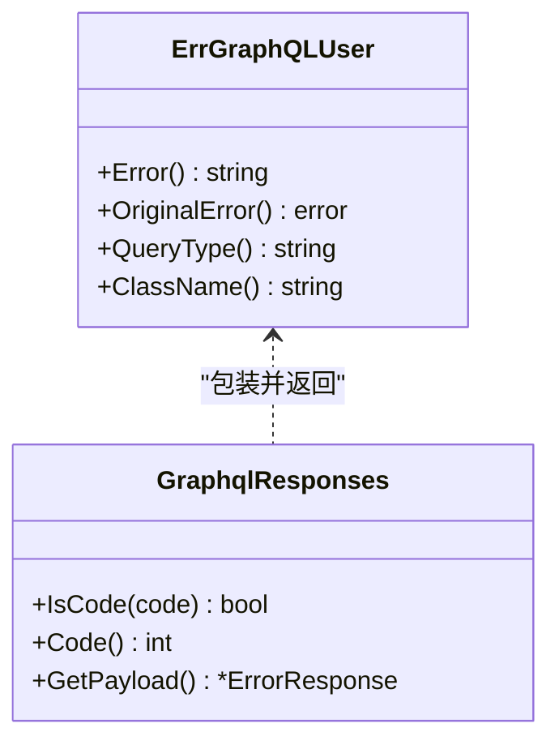
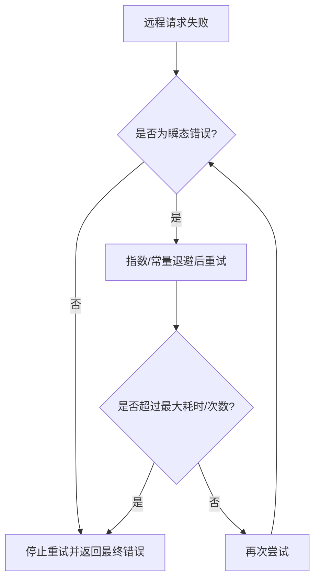
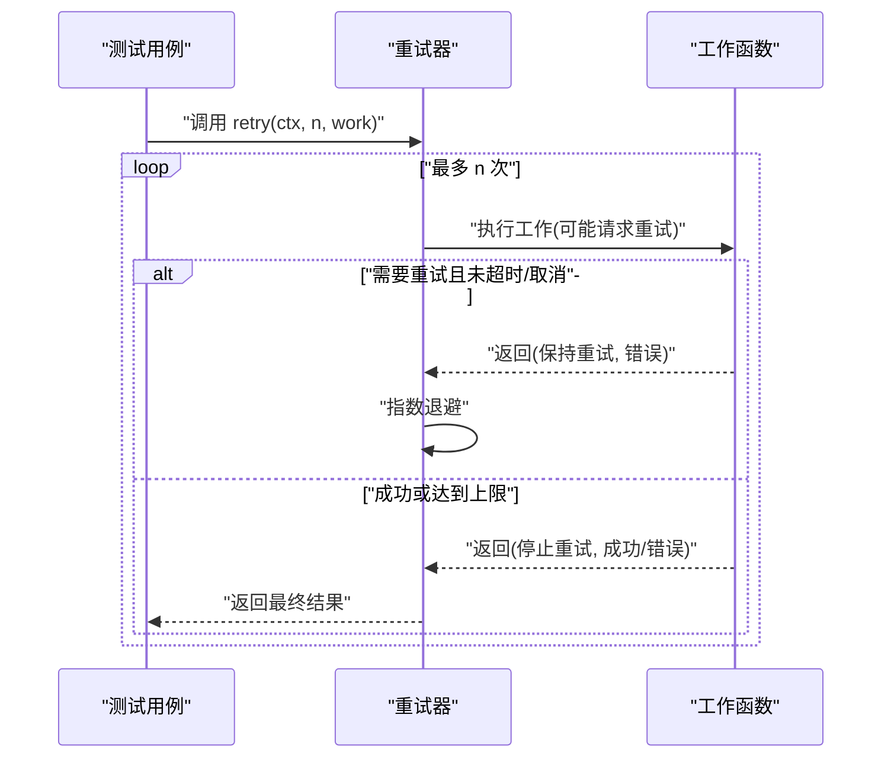
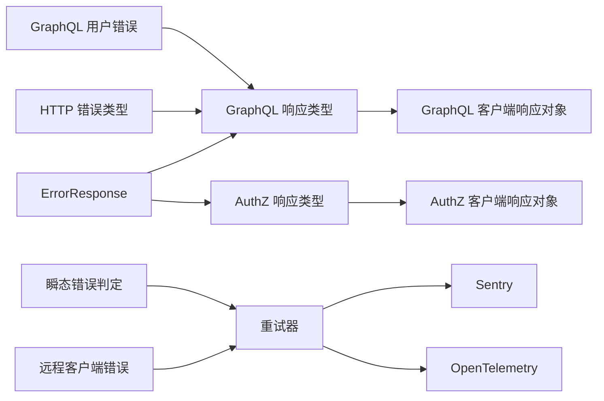

# API 错误处理

<cite>
**本文引用的文件**
- [adapters/handlers/rest/handlers_graphql.go](file://adapters/handlers/rest/handlers_graphql.go)
- [adapters/handlers/rest/operations/graphql/graphql_post_responses.go](file://adapters/handlers/rest/operations/graphql/graphql_post_responses.go)
- [adapters/handlers/rest/operations/authz/add_permissions_responses.go](file://adapters/handlers/rest/operations/authz/add_permissions_responses.go)
- [adapters/handlers/rest/operations/authz/has_permission_responses.go](file://adapters/handlers/rest/operations/authz/has_permission_responses.go)
- [client/graphql/graphql_post_responses.go](file://client/graphql/graphql_post_responses.go)
- [client/graphql/graphql_batch_responses.go](file://client/graphql/graphql_batch_responses.go)
- [client/authz/has_permission_responses.go](file://client/authz/has_permission_responses.go)
- [entities/models/error_response.go](file://entities/models/error_response.go)
- [entities/errors/errors_http.go](file://entities/errors/errors_http.go)
- [entities/errors/errors_graphql.go](file://entities/errors/errors_graphql.go)
- [entities/errors/errors_remote_client.go](file://entities/errors/errors_remote_client.go)
- [adapters/clients/client.go](file://adapters/clients/client.go)
- [adapters/clients/client_test.go](file://adapters/clients/client_test.go)
- [adapters/repos/db/queue/worker.go](file://adapters/repos/db/queue/worker.go)
- [entities/errors/transient.go](file://entities/errors/transient.go)
- [cluster/utils/retry.go](file://cluster/utils/retry.go)
- [entities/sentry/config.go](file://entities/sentry/config.go)
- [usecases/telemetry/opentelemetry/provider.go](file://usecases/telemetry/opentelemetry/provider.go)
- [usecases/telemetry/opentelemetry/config.go](file://usecases/telemetry/opentelemetry/config.go)
- [modules/text2vec-contextionary/extensions/rest_user_facing_test.go](file://modules/text2vec-contextionary/extensions/rest_user_facing_test.go)
</cite>

## 目录
1. 引言
2. 项目结构
3. 核心组件
4. 架构总览
5. 详细组件分析
6. 依赖关系分析
7. 性能考量
8. 故障排除指南
9. 结论
10. 附录

## 引言
本规范文档面向 API 集成开发者，系统性阐述 Weaviate 的 API 错误处理机制，覆盖：
- HTTP 错误码标准与使用场景
- GraphQL 错误的结构化报告与字段级错误处理
- 远程客户端错误的传播与处理
- 错误响应的标准化格式（错误代码、消息与上下文）
- 完整错误处理示例（网络、认证、权限、业务逻辑）
- 错误重试策略、超时与降级机制
- 错误监控、日志与调试工具
- 客户端最佳实践与用户体验优化

## 项目结构
Weaviate 的错误处理贯穿“模型定义 → 服务端响应 → 客户端响应 → 错误类型 → 重试与退避 → 监控与遥测”全链路。关键位置如下：
- 模型层：统一的错误响应模型
- 服务端层：REST 响应类型与状态码映射
- 客户端层：Swagger 生成的响应对象与错误判定
- 错误类型层：HTTP/GraphQL/远程客户端专用错误类型
- 重试与退避：通用重试器与常量/指数退避
- 监控与遥测：Sentry 配置与 OpenTelemetry 提供者

图表来源
- [entities/models/error_response.go](file://entities/models/error_response.go#L28-L35)
- [adapters/handlers/rest/operations/graphql/graphql_post_responses.go](file://adapters/handlers/rest/operations/graphql/graphql_post_responses.go#L152-L195)
- [adapters/handlers/rest/operations/authz/add_permissions_responses.go](file://adapters/handlers/rest/operations/authz/add_permissions_responses.go#L55-L106)
- [client/graphql/graphql_post_responses.go](file://client/graphql/graphql_post_responses.go#L163-L398)
- [client/authz/has_permission_responses.go](file://client/authz/has_permission_responses.go#L418-L454)
- [entities/errors/errors_http.go](file://entities/errors/errors_http.go#L14-L63)
- [entities/errors/errors_graphql.go](file://entities/errors/errors_graphql.go#L19-L66)
- [entities/errors/errors_remote_client.go](file://entities/errors/errors_remote_client.go#L18-L72)
- [adapters/clients/client.go](file://adapters/clients/client.go#L93-L128)
- [cluster/utils/retry.go](file://cluster/utils/retry.go#L20-L40)
- [entities/sentry/config.go](file://entities/sentry/config.go#L25-L83)
- [usecases/telemetry/opentelemetry/provider.go](file://usecases/telemetry/opentelemetry/provider.go#L47-L103)

章节来源
- [entities/models/error_response.go](file://entities/models/error_response.go#L28-L35)
- [adapters/handlers/rest/operations/graphql/graphql_post_responses.go](file://adapters/handlers/rest/operations/graphql/graphql_post_responses.go#L152-L195)
- [adapters/handlers/rest/operations/authz/add_permissions_responses.go](file://adapters/handlers/rest/operations/authz/add_permissions_responses.go#L55-L106)
- [client/graphql/graphql_post_responses.go](file://client/graphql/graphql_post_responses.go#L163-L398)
- [client/authz/has_permission_responses.go](file://client/authz/has_permission_responses.go#L418-L454)
- [entities/errors/errors_http.go](file://entities/errors/errors_http.go#L14-L63)
- [entities/errors/errors_graphql.go](file://entities/errors/errors_graphql.go#L19-L66)
- [entities/errors/errors_remote_client.go](file://entities/errors/errors_remote_client.go#L18-L72)
- [adapters/clients/client.go](file://adapters/clients/client.go#L93-L128)
- [cluster/utils/retry.go](file://cluster/utils/retry.go#L20-L40)
- [entities/sentry/config.go](file://entities/sentry/config.go#L25-L83)
- [usecases/telemetry/opentelemetry/provider.go](file://usecases/telemetry/opentelemetry/provider.go#L47-L103)

## 核心组件
- 统一错误响应模型：用于承载错误消息数组，支持校验与序列化。
- REST 响应类型：按 HTTP 状态码映射到具体响应对象，便于写入响应体与状态码。
- 客户端响应对象：由 Swagger 生成，包含状态码判断、错误载荷解析等。
- 错误类型体系：HTTP 错误、GraphQL 用户错误、远程客户端错误、瞬态错误判定。
- 重试与退避：指数退避与常量退避，结合最大尝试次数与最大耗时。
- 监控与遥测：Sentry 配置与 OpenTelemetry 提供者，支持采样与批量导出。

章节来源
- [entities/models/error_response.go](file://entities/models/error_response.go#L28-L35)
- [adapters/handlers/rest/operations/graphql/graphql_post_responses.go](file://adapters/handlers/rest/operations/graphql/graphql_post_responses.go#L152-L195)
- [client/graphql/graphql_post_responses.go](file://client/graphql/graphql_post_responses.go#L163-L398)
- [entities/errors/errors_http.go](file://entities/errors/errors_http.go#L14-L63)
- [entities/errors/errors_graphql.go](file://entities/errors/errors_graphql.go#L19-L66)
- [entities/errors/errors_remote_client.go](file://entities/errors/errors_remote_client.go#L18-L72)
- [adapters/clients/client.go](file://adapters/clients/client.go#L93-L128)
- [cluster/utils/retry.go](file://cluster/utils/retry.go#L20-L40)
- [entities/sentry/config.go](file://entities/sentry/config.go#L25-L83)
- [usecases/telemetry/opentelemetry/provider.go](file://usecases/telemetry/opentelemetry/provider.go#L47-L103)

## 架构总览
下图展示了从请求到错误响应与重试的整体流程，以及监控与遥测的集成点。

图表来源
- [adapters/handlers/rest/operations/graphql/graphql_post_responses.go](file://adapters/handlers/rest/operations/graphql/graphql_post_responses.go#L152-L195)
- [entities/models/error_response.go](file://entities/models/error_response.go#L28-L35)
- [adapters/clients/client.go](file://adapters/clients/client.go#L65-L91)
- [cluster/utils/retry.go](file://cluster/utils/retry.go#L20-L40)
- [entities/sentry/config.go](file://entities/sentry/config.go#L25-L83)
- [usecases/telemetry/opentelemetry/provider.go](file://usecases/telemetry/opentelemetry/provider.go#L47-L103)

## 详细组件分析

### HTTP 错误码与响应格式
- 标准状态码映射
  - 400 Bad Request：请求格式错误（如参数不合法）。
  - 401 Unauthorized：未授权或凭据无效。
  - 403 Forbidden：无权限访问资源。
  - 422 Unprocessable Entity：语义正确但无法处理（如 GraphQL 查询语法错误、字段不存在）。
  - 500 Internal Server Error：服务器内部错误。
- 错误响应格式
  - 使用统一的错误响应模型，包含错误消息数组，每个条目包含 message 字段。
  - 服务端在写入响应时设置状态码，并将错误响应模型作为响应体输出。
- 示例映射
  - GraphQL POST：401/403/422/500 对应不同错误场景。
  - AuthZ 授权相关：400/401/403/422/500 对应不同错误场景。

图表来源
- [adapters/handlers/rest/operations/authz/add_permissions_responses.go](file://adapters/handlers/rest/operations/authz/add_permissions_responses.go#L55-L106)
- [adapters/handlers/rest/operations/authz/has_permission_responses.go](file://adapters/handlers/rest/operations/authz/has_permission_responses.go#L70-L234)
- [adapters/handlers/rest/operations/graphql/graphql_post_responses.go](file://adapters/handlers/rest/operations/graphql/graphql_post_responses.go#L152-L195)
- [entities/models/error_response.go](file://entities/models/error_response.go#L28-L35)

章节来源
- [adapters/handlers/rest/operations/authz/add_permissions_responses.go](file://adapters/handlers/rest/operations/authz/add_permissions_responses.go#L55-L106)
- [adapters/handlers/rest/operations/authz/has_permission_responses.go](file://adapters/handlers/rest/operations/authz/has_permission_responses.go#L70-L234)
- [adapters/handlers/rest/operations/graphql/graphql_post_responses.go](file://adapters/handlers/rest/operations/graphql/graphql_post_responses.go#L152-L195)
- [entities/models/error_response.go](file://entities/models/error_response.go#L28-L35)

### GraphQL 错误处理与结构化报告
- GraphQL 用户错误类型
  - 包含原始错误、查询类型与类名，便于定位错误来源。
  - 服务端在处理 GraphQL 请求时，若发生用户相关错误，会包装为该类型并返回。
- 客户端响应对象
  - GraphQL POST/批处理提供 401/403/422/500 对应的响应对象，支持状态码判断与错误载荷解析。
- 语法与字段级错误识别
  - 通过前缀匹配识别语法相关错误（如语法错误、字段不存在），辅助区分错误类型。

图表来源
- [entities/errors/errors_graphql.go](file://entities/errors/errors_graphql.go#L19-L42)
- [client/graphql/graphql_post_responses.go](file://client/graphql/graphql_post_responses.go#L163-L398)
- [client/graphql/graphql_batch_responses.go](file://client/graphql/graphql_batch_responses.go#L330-L396)
- [adapters/handlers/rest/handlers_graphql.go](file://adapters/handlers/rest/handlers_graphql.go#L317-L356)

章节来源
- [entities/errors/errors_graphql.go](file://entities/errors/errors_graphql.go#L19-L42)
- [client/graphql/graphql_post_responses.go](file://client/graphql/graphql_post_responses.go#L163-L398)
- [client/graphql/graphql_batch_responses.go](file://client/graphql/graphql_batch_responses.go#L330-L396)
- [adapters/handlers/rest/handlers_graphql.go](file://adapters/handlers/rest/handlers_graphql.go#L317-L356)

### 远程客户端错误传播与处理
- 远程客户端错误类型
  - 打开/发送 HTTP 请求错误、意外状态码、反序列化错误等。
  - 支持 unwrap 以便使用 errors.Is/As 进行类型判定。
- 重试与退避
  - 通用重试器采用指数退避，限制最大间隔与最大耗时。
  - 常量退避用于读取一致性场景下的稳定重试。
  - 工作队列中对瞬态错误进行识别，决定是否重试或丢弃批次。

图表来源
- [entities/errors/errors_remote_client.go](file://entities/errors/errors_remote_client.go#L18-L72)
- [adapters/clients/client.go](file://adapters/clients/client.go#L65-L91)
- [adapters/clients/client.go](file://adapters/clients/client.go#L111-L124)
- [cluster/utils/retry.go](file://cluster/utils/retry.go#L20-L40)
- [adapters/repos/db/queue/worker.go](file://adapters/repos/db/queue/worker.go#L134-L164)
- [entities/errors/transient.go](file://entities/errors/transient.go#L19-L38)

章节来源
- [entities/errors/errors_remote_client.go](file://entities/errors/errors_remote_client.go#L18-L72)
- [adapters/clients/client.go](file://adapters/clients/client.go#L65-L91)
- [adapters/clients/client.go](file://adapters/clients/client.go#L111-L124)
- [cluster/utils/retry.go](file://cluster/utils/retry.go#L20-L40)
- [adapters/repos/db/queue/worker.go](file://adapters/repos/db/queue/worker.go#L134-L164)
- [entities/errors/transient.go](file://entities/errors/transient.go#L19-L38)

### 错误响应标准化格式
- 错误响应模型
  - 字段：error 数组，每项包含 message 字段。
  - 支持验证与上下文验证，确保响应结构一致。
- 客户端解析
  - 客户端响应对象在解析时将 body 反序列化为错误响应模型，便于统一处理。

章节来源
- [entities/models/error_response.go](file://entities/models/error_response.go#L28-L35)
- [entities/models/error_response.go](file://entities/models/error_response.go#L51-L109)
- [client/graphql/graphql_post_responses.go](file://client/graphql/graphql_post_responses.go#L320-L330)

### 错误处理示例与最佳实践
- 网络错误
  - 场景：连接失败、超时、非预期状态码。
  - 处理：使用重试器进行指数退避；达到上限后返回最后一次错误；结合上下文取消。
  - 参考路径：[adapters/clients/client.go](file://adapters/clients/client.go#L65-L91)，[adapters/clients/client.go](file://adapters/clients/client.go#L111-L124)
- 认证错误
  - 场景：401 未授权。
  - 处理：提示重新鉴权；客户端可缓存令牌刷新策略。
  - 参考路径：[client/graphql/graphql_post_responses.go](file://client/graphql/graphql_post_responses.go#L163-L194)，[client/authz/has_permission_responses.go](file://client/authz/has_permission_responses.go#L418-L454)
- 权限错误
  - 场景：403 禁止访问。
  - 处理：提示检查权限配置；建议提供权限检查接口。
  - 参考路径：[adapters/handlers/rest/operations/authz/add_permissions_responses.go](file://adapters/handlers/rest/operations/authz/add_permissions_responses.go#L55-L106)
- 业务逻辑错误
  - 场景：422 无法处理的实体（如 GraphQL 语法错误、字段不存在）。
  - 处理：解析错误消息数组，向用户展示具体字段与原因。
  - 参考路径：[adapters/handlers/rest/operations/graphql/graphql_post_responses.go](file://adapters/handlers/rest/operations/graphql/graphql_post_responses.go#L152-L195)，[adapters/handlers/rest/handlers_graphql.go](file://adapters/handlers/rest/handlers_graphql.go#L317-L356)
- 最佳实践
  - 客户端：区分 4xx/5xx 并采取不同策略；对瞬态错误启用重试；对永久错误快速失败并记录上下文。
  - 服务端：统一错误响应模型；明确状态码语义；在 GraphQL 中提供清晰的错误来源（查询类型/类名）。

章节来源
- [adapters/clients/client.go](file://adapters/clients/client.go#L65-L91)
- [adapters/clients/client.go](file://adapters/clients/client.go#L111-L124)
- [client/graphql/graphql_post_responses.go](file://client/graphql/graphql_post_responses.go#L163-L194)
- [client/authz/has_permission_responses.go](file://client/authz/has_permission_responses.go#L418-L454)
- [adapters/handlers/rest/operations/authz/add_permissions_responses.go](file://adapters/handlers/rest/operations/authz/add_permissions_responses.go#L55-L106)
- [adapters/handlers/rest/operations/graphql/graphql_post_responses.go](file://adapters/handlers/rest/operations/graphql/graphql_post_responses.go#L152-L195)
- [adapters/handlers/rest/handlers_graphql.go](file://adapters/handlers/rest/handlers_graphql.go#L317-L356)

### 错误重试策略、超时与降级
- 重试策略
  - 指数退避：初始/最大间隔可控，结合最大耗时防止无限等待。
  - 常量退避：适用于读取一致性场景。
- 超时处理
  - 在请求中注入带超时的上下文；超时后停止重试。
- 降级机制
  - 识别瞬态错误与永久错误；对后者直接失败并记录；对前者进行重试。
- 测试验证
  - 单元测试覆盖：立即失败、重试后成功、耗尽后返回最后错误、上下文取消。

图表来源
- [adapters/clients/client.go](file://adapters/clients/client.go#L111-L124)
- [cluster/utils/retry.go](file://cluster/utils/retry.go#L20-L40)
- [adapters/clients/client_test.go](file://adapters/clients/client_test.go#L53-L123)

章节来源
- [adapters/clients/client.go](file://adapters/clients/client.go#L111-L124)
- [cluster/utils/retry.go](file://cluster/utils/retry.go#L20-L40)
- [adapters/clients/client_test.go](file://adapters/clients/client_test.go#L53-L123)

### 错误监控、日志与调试工具
- Sentry
  - 通过环境变量启用/配置 DSN、采样率、标签、集群信息等。
  - 全局单例，可在任意位置捕获错误。
- OpenTelemetry
  - 提供配置加载与校验、资源属性设置、批量导出与采样策略。
  - 设置全局追踪提供者与传播器，便于端到端追踪。
- 调试建议
  - 在客户端捕获错误时附带请求 ID、时间戳、重试次数等上下文。
  - 对 429/5xx 错误进行采样上报，避免噪声。

章节来源
- [entities/sentry/config.go](file://entities/sentry/config.go#L25-L83)
- [usecases/telemetry/opentelemetry/provider.go](file://usecases/telemetry/opentelemetry/provider.go#L47-L103)
- [usecases/telemetry/opentelemetry/config.go](file://usecases/telemetry/opentelemetry/config.go#L90-L140)

## 依赖关系分析
- 组件耦合
  - 错误响应模型被 REST 响应类型与客户端响应对象共同使用，保证格式一致。
  - 错误类型与重试器解耦，通过错误判定接口（如瞬态错误）参与决策。
- 外部依赖
  - backoff 库提供指数/常量退避实现。
  - Swagger 生成客户端响应对象，简化状态码与载荷处理。
- 循环依赖
  - 未发现循环导入；错误类型与重试器通过接口与函数交互。

图表来源
- [entities/models/error_response.go](file://entities/models/error_response.go#L28-L35)
- [adapters/handlers/rest/operations/graphql/graphql_post_responses.go](file://adapters/handlers/rest/operations/graphql/graphql_post_responses.go#L152-L195)
- [adapters/handlers/rest/operations/authz/add_permissions_responses.go](file://adapters/handlers/rest/operations/authz/add_permissions_responses.go#L55-L106)
- [client/graphql/graphql_post_responses.go](file://client/graphql/graphql_post_responses.go#L163-L398)
- [client/authz/has_permission_responses.go](file://client/authz/has_permission_responses.go#L418-L454)
- [entities/errors/errors_http.go](file://entities/errors/errors_http.go#L14-L63)
- [entities/errors/errors_graphql.go](file://entities/errors/errors_graphql.go#L19-L66)
- [entities/errors/errors_remote_client.go](file://entities/errors/errors_remote_client.go#L18-L72)
- [adapters/clients/client.go](file://adapters/clients/client.go#L93-L128)
- [entities/sentry/config.go](file://entities/sentry/config.go#L25-L83)
- [usecases/telemetry/opentelemetry/provider.go](file://usecases/telemetry/opentelemetry/provider.go#L47-L103)

章节来源
- [entities/models/error_response.go](file://entities/models/error_response.go#L28-L35)
- [adapters/handlers/rest/operations/graphql/graphql_post_responses.go](file://adapters/handlers/rest/operations/graphql/graphql_post_responses.go#L152-L195)
- [adapters/handlers/rest/operations/authz/add_permissions_responses.go](file://adapters/handlers/rest/operations/authz/add_permissions_responses.go#L55-L106)
- [client/graphql/graphql_post_responses.go](file://client/graphql/graphql_post_responses.go#L163-L398)
- [client/authz/has_permission_responses.go](file://client/authz/has_permission_responses.go#L418-L454)
- [entities/errors/errors_http.go](file://entities/errors/errors_http.go#L14-L63)
- [entities/errors/errors_graphql.go](file://entities/errors/errors_graphql.go#L19-L66)
- [entities/errors/errors_remote_client.go](file://entities/errors/errors_remote_client.go#L18-L72)
- [adapters/clients/client.go](file://adapters/clients/client.go#L93-L128)
- [entities/sentry/config.go](file://entities/sentry/config.go#L25-L83)
- [usecases/telemetry/opentelemetry/provider.go](file://usecases/telemetry/opentelemetry/provider.go#L47-L103)

## 性能考量
- 重试成本控制
  - 合理设置最小/最大退避间隔与最大耗时，避免雪崩效应。
  - 对幂等操作启用重试，对非幂等操作谨慎重试。
- 监控开销
  - 通过采样率控制错误上报频率；批量导出减少网络开销。
- 响应体积
  - 错误消息尽量简洁明确，避免冗余字段。

## 故障排除指南
- 常见问题定位
  - 400/422：检查请求体结构与字段合法性；参考 GraphQL 语法与字段存在性。
  - 401/403：确认鉴权头与权限配置；必要时刷新令牌或调整角色。
  - 500：查看服务端日志与追踪；关注慢查询与资源瓶颈。
- 单元测试参考
  - 重试器行为：立即失败、重试后成功、耗尽后返回最后错误、上下文取消。
  - 参考路径：[adapters/clients/client_test.go](file://adapters/clients/client_test.go#L53-L123)
- 端到端验证
  - 通过模块测试验证错误码映射（如 UnsupportedMediaType、UnprocessableEntity、Bad Request）。
  - 参考路径：[modules/text2vec-contextionary/extensions/rest_user_facing_test.go](file://modules/text2vec-contextionary/extensions/rest_user_facing_test.go#L48-L107)

章节来源
- [adapters/clients/client_test.go](file://adapters/clients/client_test.go#L53-L123)
- [modules/text2vec-contextionary/extensions/rest_user_facing_test.go](file://modules/text2vec-contextionary/extensions/rest_user_facing_test.go#L48-L107)

## 结论
Weaviate 的错误处理机制以统一的错误响应模型为基础，配合明确的 HTTP 状态码映射、结构化的 GraphQL 错误类型、完善的远程客户端错误处理与可配置的重试/退避策略，实现了高一致性与可维护性的错误体验。结合 Sentry 与 OpenTelemetry，开发者可以快速定位问题并优化性能。建议在生产环境中严格区分瞬态与永久错误，合理配置重试与采样策略，并在客户端实现健壮的错误恢复与用户反馈。

## 附录
- 关键实现路径索引
  - 错误响应模型：[entities/models/error_response.go](file://entities/models/error_response.go#L28-L35)
  - GraphQL 响应类型：[adapters/handlers/rest/operations/graphql/graphql_post_responses.go](file://adapters/handlers/rest/operations/graphql/graphql_post_responses.go#L152-L195)
  - AuthZ 响应类型：[adapters/handlers/rest/operations/authz/add_permissions_responses.go](file://adapters/handlers/rest/operations/authz/add_permissions_responses.go#L55-L106)
  - GraphQL 客户端响应对象：[client/graphql/graphql_post_responses.go](file://client/graphql/graphql_post_responses.go#L163-L398)
  - 远程客户端错误类型：[entities/errors/errors_remote_client.go](file://entities/errors/errors_remote_client.go#L18-L72)
  - 重试器与退避：[adapters/clients/client.go](file://adapters/clients/client.go#L93-L128)，[cluster/utils/retry.go](file://cluster/utils/retry.go#L20-L40)
  - 瞬态错误判定：[entities/errors/transient.go](file://entities/errors/transient.go#L19-L38)
  - Sentry 配置：[entities/sentry/config.go](file://entities/sentry/config.go#L25-L83)
  - OpenTelemetry 提供者：[usecases/telemetry/opentelemetry/provider.go](file://usecases/telemetry/opentelemetry/provider.go#L47-L103)