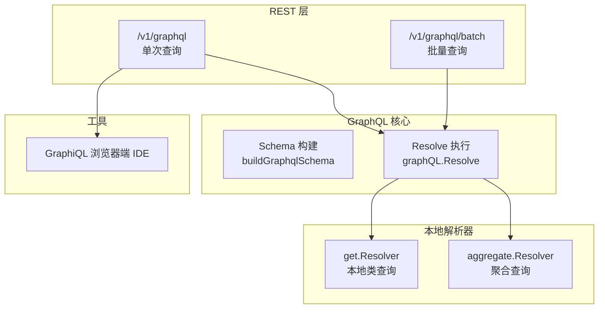
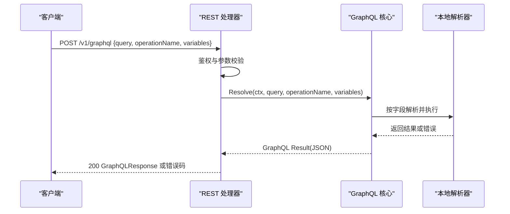
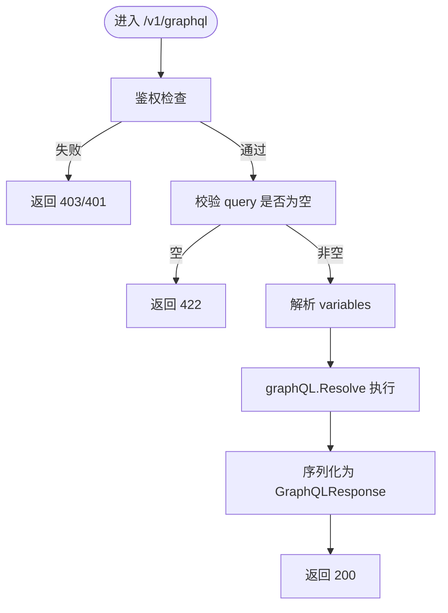
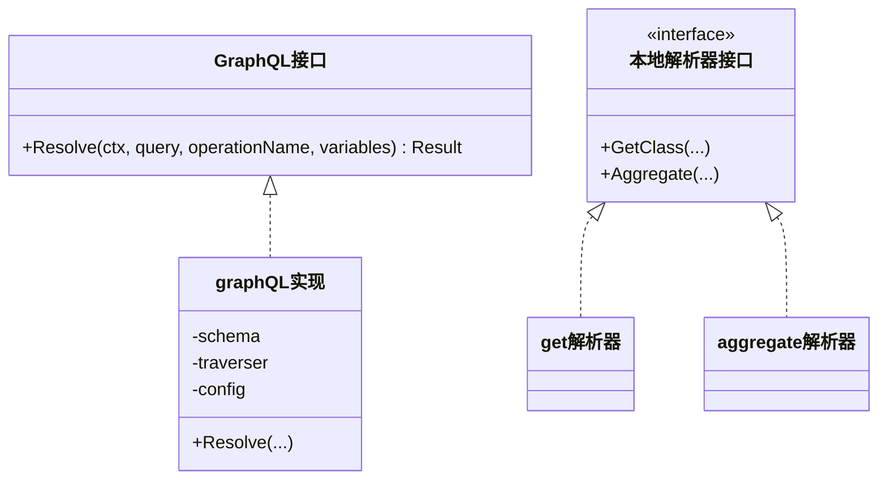
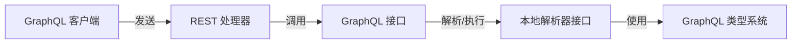

# GraphQL API 端点

<cite>
**本文引用的文件**
- [adapters/handlers/graphql/schema.go](file://adapters/handlers/graphql/schema.go)
- [adapters/handlers/graphql/local/resolver.go](file://adapters/handlers/graphql/local/resolver.go)
- [adapters/handlers/graphql/local/get/resolver.go](file://adapters/handlers/graphql/local/get/resolver.go)
- [adapters/handlers/graphql/local/aggregate/resolver.go](file://adapters/handlers/graphql/local/aggregate/resolver.go)
- [adapters/handlers/graphql/local/common_filters/graphql_types.go](file://adapters/handlers/graphql/local/common_filters/graphql_types.go)
- [adapters/handlers/graphql/local/common_filters/filters_types.go](file://adapters/handlers/graphql/local/common_filters/filters_types.go)
- [adapters/handlers/graphql/local/common_filters/targets.go](file://adapters/handlers/graphql/local/common_filters/targets.go)
- [adapters/handlers/graphql/graphiql/graphiql.go](file://adapters/handlers/graphql/graphiql/graphiql.go)
- [adapters/handlers/rest/handlers_graphql.go](file://adapters/handlers/rest/handlers_graphql.go)
- [adapters/handlers/rest/operations/graphql/graphql_batch.go](file://adapters/handlers/rest/operations/graphql/graphql_batch.go)
- [client/graphql/graphql_client.go](file://client/graphql/graphql_client.go)
- [client/graphql/graphql_post_parameters.go](file://client/graphql/graphql_post_parameters.go)
- [client/graphql/graphql_post_responses.go](file://client/graphql/graphql_post_responses.go)
- [client/graphql/graphql_batch_parameters.go](file://client/graphql/graphql_batch_parameters.go)
- [client/graphql/graphql_batch_responses.go](file://client/graphql/graphql_batch_responses.go)
- [entities/models/graph_q_l_query.go](file://entities/models/graph_q_l_query.go)
- [entities/models/graph_q_l_error.go](file://entities/models/graph_q_l_error.go)
- [openapi-specs/schema.json](file://openapi-specs/schema.json)
- [test/acceptance/batch_request_endpoints/graphql_test.go](file://test/acceptance/batch_request_endpoints/graphql_test.go)
- [test/helper/graphql/graphql_helper.go](file://test/helper/graphql/graphql_helper.go)
</cite>

## 目录
1. [简介](#简介)
2. [项目结构](#项目结构)
3. [核心组件](#核心组件)
4. [架构总览](#架构总览)
5. [详细组件分析](#详细组件分析)
6. [依赖关系分析](#依赖关系分析)
7. [性能考量](#性能考量)
8. [故障排查指南](#故障排查指南)
9. [结论](#结论)
10. [附录](#附录)

## 简介
本文件为 Weaviate 的 GraphQL API 端点提供权威规范文档，覆盖查询、变更（在本仓库中以查询为主）、以及订阅能力的现状与使用方式。Weaviate 当前通过 GraphQL 提供两类主要能力：
- 查询：本地类查询与聚合查询
- 图形界面：GraphiQL 内置浏览器端 IDE

同时，REST 层提供 /v1/graphql 与 /v1/graphql/batch 两个端点，分别用于单次查询与批量查询。订阅能力在当前仓库未发现实现，因此不纳入本规范。

## 项目结构
GraphQL 能力由以下层次构成：
- REST 层：暴露 /v1/graphql 与 /v1/graphql/batch 端点，负责鉴权、参数解析、错误码映射与响应封装
- GraphQL 核心层：构建 GraphQL Schema，调用本地解析器执行查询
- 本地解析器：实现 get 与 aggregate 两类 GraphQL 字段解析逻辑
- GraphiQL：内置浏览器端 IDE，支持基本的查询、变量与认证头传递

图表来源
- [adapters/handlers/rest/handlers_graphql.go](file://adapters/handlers/rest/handlers_graphql.go#L51-L206)
- [adapters/handlers/graphql/schema.go](file://adapters/handlers/graphql/schema.go#L52-L84)
- [adapters/handlers/graphql/local/resolver.go](file://adapters/handlers/graphql/local/resolver.go#L19-L23)
- [adapters/handlers/graphql/graphiql/graphiql.go](file://adapters/handlers/graphql/graphiql/graphiql.go#L36-L96)

章节来源
- [adapters/handlers/rest/handlers_graphql.go](file://adapters/handlers/rest/handlers_graphql.go#L51-L206)
- [adapters/handlers/graphql/schema.go](file://adapters/handlers/graphql/schema.go#L52-L84)
- [adapters/handlers/graphql/local/resolver.go](file://adapters/handlers/graphql/local/resolver.go#L19-L23)
- [adapters/handlers/graphql/graphiql/graphiql.go](file://adapters/handlers/graphql/graphiql/graphiql.go#L36-L96)

## 核心组件
- GraphQL 接口与实现
  - GraphQL 接口定义了 Resolve 方法，接收查询字符串、可选的操作名与变量，并返回 GraphQL 结果对象
  - graphQL 实现负责构建 Schema 并在运行时执行查询
- 本地解析器接口
  - get.Resolver：提供本地类查询能力
  - aggregate.Resolver：提供聚合查询能力
- GraphQL 类型系统扩展
  - 自定义标量与输入类型，用于向量、权重等特殊参数的序列化与反序列化
- GraphiQL
  - 内置浏览器端 IDE，支持查询、变量与认证头传递

章节来源
- [adapters/handlers/graphql/schema.go](file://adapters/handlers/graphql/schema.go#L39-L84)
- [adapters/handlers/graphql/local/resolver.go](file://adapters/handlers/graphql/local/resolver.go#L19-L23)
- [adapters/handlers/graphql/local/get/resolver.go](file://adapters/handlers/graphql/local/get/resolver.go#L21-L30)
- [adapters/handlers/graphql/local/aggregate/resolver.go](file://adapters/handlers/graphql/local/aggregate/resolver.go#L39-L50)
- [adapters/handlers/graphql/local/common_filters/graphql_types.go](file://adapters/handlers/graphql/local/common_filters/graphql_types.go#L23-L79)
- [adapters/handlers/graphql/local/common_filters/filters_types.go](file://adapters/handlers/graphql/local/common_filters/filters_types.go#L57-L148)
- [adapters/handlers/graphql/local/common_filters/targets.go](file://adapters/handlers/graphql/local/common_filters/targets.go#L45-L103)
- [adapters/handlers/graphql/graphiql/graphiql.go](file://adapters/handlers/graphql/graphiql/graphiql.go#L36-L96)

## 架构总览
GraphQL 查询从 REST 层进入，经过鉴权与参数校验后，交由 GraphQL 核心执行。核心层将查询解析为 AST，按字段分派到本地解析器，最终返回统一的 GraphQL 响应模型。

图表来源
- [adapters/handlers/rest/handlers_graphql.go](file://adapters/handlers/rest/handlers_graphql.go#L60-L154)
- [adapters/handlers/graphql/schema.go](file://adapters/handlers/graphql/schema.go#L71-L84)

章节来源
- [adapters/handlers/rest/handlers_graphql.go](file://adapters/handlers/rest/handlers_graphql.go#L60-L154)
- [adapters/handlers/graphql/schema.go](file://adapters/handlers/graphql/schema.go#L71-L84)

## 详细组件分析

### REST 端点与请求/响应模型
- 单次查询
  - 路径：/v1/graphql
  - 方法：POST
  - 请求体：GraphQLQuery（包含 query、operationName、variables）
  - 响应：GraphQLResponse（包含 data 与 errors）
  - 错误码：401、403、422、500
- 批量查询
  - 路径：/v1/graphql/batch
  - 方法：POST
  - 请求体：GraphQLQuery 数组
  - 响应：GraphQLResponse 数组，保持原始顺序
  - 错误码：403、422、500

章节来源
- [openapi-specs/schema.json](file://openapi-specs/schema.json#L7437-L7480)
- [adapters/handlers/rest/operations/graphql/graphql_batch.go](file://adapters/handlers/rest/operations/graphql/graphql_batch.go#L45-L84)
- [client/graphql/graphql_post_parameters.go](file://client/graphql/graphql_post_parameters.go)
- [client/graphql/graphql_post_responses.go](file://client/graphql/graphql_post_responses.go#L204-L250)
- [client/graphql/graphql_batch_parameters.go](file://client/graphql/graphql_batch_parameters.go)
- [client/graphql/graphql_batch_responses.go](file://client/graphql/graphql_batch_responses.go#L322-L362)
- [entities/models/graph_q_l_query.go](file://entities/models/graph_q_l_query.go#L26-L39)

### GraphQL 查询执行流程
- 鉴权：单次查询要求读取集合元数据权限；批量查询要求读取所有集合权限
- 参数校验：空 query 视为 422；变量类型需为 map[string]interface{}
- 执行：调用 graphQL.Resolve，传入上下文、查询、操作名与变量
- 响应：将 GraphQL Result 序列化为 GraphQLResponse

图表来源
- [adapters/handlers/rest/handlers_graphql.go](file://adapters/handlers/rest/handlers_graphql.go#L60-L154)

章节来源
- [adapters/handlers/rest/handlers_graphql.go](file://adapters/handlers/rest/handlers_graphql.go#L60-L154)

### GraphQL 类型系统与自定义标量
- 向量标量（Vector）：支持一维/多维浮点数组，用于 nearVector/nearObject 等参数
- 文本/整数/浮点/布尔输入类型：扩展为可接受标量或数组
- 权重标量（Weights）：支持对象形式的键值映射，值可为数字或数组

章节来源
- [adapters/handlers/graphql/local/common_filters/graphql_types.go](file://adapters/handlers/graphql/local/common_filters/graphql_types.go#L23-L79)
- [adapters/handlers/graphql/local/common_filters/filters_types.go](file://adapters/handlers/graphql/local/common_filters/filters_types.go#L57-L148)
- [adapters/handlers/graphql/local/common_filters/targets.go](file://adapters/handlers/graphql/local/common_filters/targets.go#L45-L103)

### 本地解析器：查询与聚合
- get.Resolver
  - 职责：执行本地类查询，返回对象列表
  - 关键参数：上下文、主体、GetParams
- aggregate.Resolver
  - 职责：执行聚合查询，返回聚合结果
  - 支持参数：过滤、分组、限制、对象限制、近邻搜索、混合检索、模块参数、租户等
  - 对象限制（objectLimit）仅在 nearObject/nearVector/hybrid/模块参数存在时允许

图表来源
- [adapters/handlers/graphql/schema.go](file://adapters/handlers/graphql/schema.go#L39-L84)
- [adapters/handlers/graphql/local/resolver.go](file://adapters/handlers/graphql/local/resolver.go#L19-L23)
- [adapters/handlers/graphql/local/get/resolver.go](file://adapters/handlers/graphql/local/get/resolver.go#L21-L30)
- [adapters/handlers/graphql/local/aggregate/resolver.go](file://adapters/handlers/graphql/local/aggregate/resolver.go#L39-L50)

章节来源
- [adapters/handlers/graphql/local/get/resolver.go](file://adapters/handlers/graphql/local/get/resolver.go#L21-L30)
- [adapters/handlers/graphql/local/aggregate/resolver.go](file://adapters/handlers/graphql/local/aggregate/resolver.go#L52-L193)

### GraphiQL 使用与调试
- 访问路径：当请求 /v1/graphql 且方法为 GET 时，返回 GraphiQL 页面
- 认证：Basic Auth，用户名作为 X-API-KEY，密码作为 X-API-TOKEN
- 变量：支持通过 URL query 参数传递 variables（会被解析并格式化）
- 调试建议：
  - 使用 GraphiQL 的查询编辑器与变量面板
  - 通过浏览器 Network 面板观察请求头与响应体
  - 注意变量类型必须为 map[string]interface{}，否则批量查询会返回 422

章节来源
- [adapters/handlers/graphql/graphiql/graphiql.go](file://adapters/handlers/graphql/graphiql/graphiql.go#L36-L96)
- [adapters/handlers/rest/handlers_graphql.go](file://adapters/handlers/rest/handlers_graphql.go#L156-L206)
- [test/acceptance/batch_request_endpoints/graphql_test.go](file://test/acceptance/batch_request_endpoints/graphql_test.go#L65-L67)

### 批量查询行为与顺序保证
- 批量查询内部使用 goroutine 并发执行各子请求
- 结果通过通道收集并按原始请求索引恢复顺序
- 空 query 或变量类型不匹配会返回带错误信息的 GraphQLResponse，而非抛出 HTTP 错误头

章节来源
- [adapters/handlers/rest/handlers_graphql.go](file://adapters/handlers/rest/handlers_graphql.go#L156-L206)
- [adapters/handlers/rest/handlers_graphql.go](file://adapters/handlers/rest/handlers_graphql.go#L208-L292)
- [test/acceptance/batch_request_endpoints/graphql_test.go](file://test/acceptance/batch_request_endpoints/graphql_test.go#L35-L67)

## 依赖关系分析
- REST 层依赖 GraphQL 核心接口进行查询执行
- GraphQL 核心依赖本地解析器接口完成具体业务逻辑
- 本地解析器依赖过滤与类型系统模块
- 客户端库提供参数与响应模型，便于集成

图表来源
- [adapters/handlers/rest/handlers_graphql.go](file://adapters/handlers/rest/handlers_graphql.go#L108-L122)
- [adapters/handlers/graphql/schema.go](file://adapters/handlers/graphql/schema.go#L71-L84)
- [adapters/handlers/graphql/local/resolver.go](file://adapters/handlers/graphql/local/resolver.go#L19-L23)
- [client/graphql/graphql_client.go](file://client/graphql/graphql_client.go#L119-L136)

章节来源
- [adapters/handlers/rest/handlers_graphql.go](file://adapters/handlers/rest/handlers_graphql.go#L108-L122)
- [adapters/handlers/graphql/schema.go](file://adapters/handlers/graphql/schema.go#L71-L84)
- [adapters/handlers/graphql/local/resolver.go](file://adapters/handlers/graphql/local/resolver.go#L19-L23)
- [client/graphql/graphql_client.go](file://client/graphql/graphql_client.go#L119-L136)

## 性能考量
- 批量查询通过并发 goroutine 提升吞吐，但需注意资源占用与限流策略
- 聚合查询中的 objectLimit 仅在特定条件下允许，避免无界扫描
- GraphiQL 在浏览器端渲染，建议在生产环境谨慎启用

## 故障排查指南
- 常见错误与定位
  - 401/403：鉴权失败，检查 API Key 与角色权限
  - 422：请求格式正确但语义错误，如空 query、变量类型不符
  - 500：服务器内部错误，查看日志与监控指标
- GraphQL 错误模型
  - 错误包含消息、位置与原始错误链，便于定位问题
- 调试建议
  - 使用 GraphiQL 进行交互式调试
  - 通过客户端库的错误响应获取详细信息
  - 批量查询时关注每个子请求的错误项，确保顺序一致性

章节来源
- [adapters/handlers/rest/handlers_graphql.go](file://adapters/handlers/rest/handlers_graphql.go#L60-L154)
- [adapters/handlers/rest/handlers_graphql.go](file://adapters/handlers/rest/handlers_graphql.go#L156-L206)
- [entities/models/graph_q_l_error.go](file://entities/models/graph_q_l_error.go#L135-L150)
- [test/helper/graphql/graphql_helper.go](file://test/helper/graphql/graphql_helper.go#L72-L106)

## 结论
Weaviate 的 GraphQL API 以 REST 为入口，结合本地解析器提供类查询与聚合能力，并内置 GraphiQL 便于调试。当前版本未提供订阅功能，事务处理以单次查询为单位，批量查询通过并发提升性能并保持结果顺序。建议在生产环境中合理配置鉴权与限流，充分利用 GraphiQL 与错误模型进行开发与排障。

## 附录

### 端点与状态码对照
- /v1/graphql
  - 200：成功返回 GraphQLResponse
  - 401：未授权或无效凭证
  - 403：禁止访问
  - 422：请求语法正确但语义错误
  - 500：服务器内部错误
- /v1/graphql/batch
  - 200：成功返回 GraphQLResponse 数组
  - 403：禁止访问
  - 422：请求为空或变量类型不匹配
  - 500：服务器内部错误

章节来源
- [openapi-specs/schema.json](file://openapi-specs/schema.json#L7437-L7480)
- [client/graphql/graphql_post_responses.go](file://client/graphql/graphql_post_responses.go#L204-L250)
- [client/graphql/graphql_batch_responses.go](file://client/graphql/graphql_batch_responses.go#L322-L362)