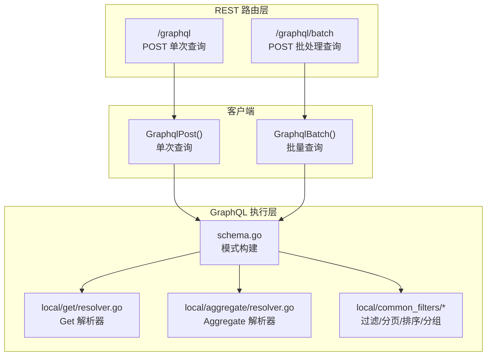
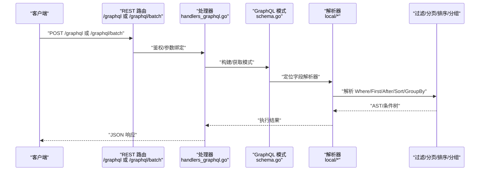
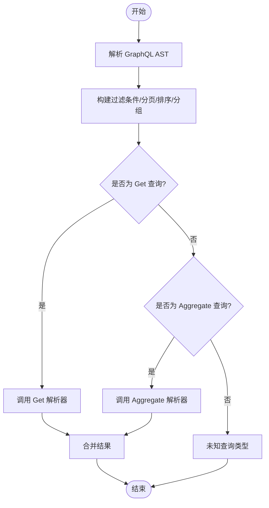
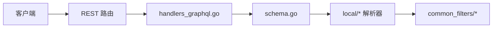

# GraphQL 端点

<cite>
**本文引用的文件**
- [adapters/handlers/rest/operations/graphql/graphql_batch.go](file://adapters/handlers/rest/operations/graphql/graphql_batch.go)
- [adapters/handlers/rest/operations/graphql/graphql_post.go](file://adapters/handlers/rest/operations/graphql/graphql_post.go)
- [client/graphql/graphql_client.go](file://client/graphql/graphql_client.go)
- [client/graphql/graphql_post_parameters.go](file://client/graphql/graphql_post_parameters.go)
- [client/graphql/graphql_batch_parameters.go](file://client/graphql/graphql_batch_parameters.go)
- [entities/models/graph_q_l_query.go](file://entities/models/graph_q_l_query.go)
- [entities/models/graph_q_l_queries.go](file://entities/models/graph_q_l_queries.go)
- [adapters/handlers/graphql/descriptions/filters.go](file://adapters/handlers/graphql/descriptions/filters.go)
- [adapters/handlers/graphql/descriptions/aggregate.go](file://adapters/handlers/graphql/descriptions/aggregate.go)
- [adapters/handlers/graphql/descriptions/get.go](file://adapters/handlers/graphql/descriptions/get.go)
- [adapters/handlers/rest/handlers_graphql.go](file://adapters/handlers/rest/handlers_graphql.go)
- [adapters/handlers/graphql/local/get/resolver.go](file://adapters/handlers/graphql/local/get/resolver.go)
- [adapters/handlers/graphql/local/aggregate/resolver.go](file://adapters/handlers/graphql/local/aggregate/resolver.go)
- [adapters/handlers/graphql/local/common_filters/graphql_types.go](file://adapters/handlers/graphql/local/common_filters/graphql_types.go)
- [adapters/handlers/graphql/local/common_filters/filters.go](file://adapters/handlers/graphql/local/common_filters/filters.go)
- [adapters/handlers/graphql/local/common_filters/parse_filters_into_ast.go](file://adapters/handlers/graphql/local/common_filters/parse_filters_into_ast.go)
- [adapters/handlers/graphql/local/explore/concepts_resolver.go](file://adapters/handlers/graphql/local/explore/concepts_resolver.go)
- [adapters/handlers/graphql/schema.go](file://adapters/handlers/graphql/schema.go)
</cite>

## 目录
1. [简介](#简介)
2. [项目结构](#项目结构)
3. [核心组件](#核心组件)
4. [架构总览](#架构总览)
5. [详细组件分析](#详细组件分析)
6. [依赖关系分析](#依赖关系分析)
7. [性能考量](#性能考量)
8. [故障排查指南](#故障排查指南)
9. [结论](#结论)
10. [附录](#附录)

## 简介
本文件系统性梳理 Weaviate 的 GraphQL REST API 端点，覆盖单次查询与批处理查询的端点设计、请求/响应模型、GraphQL 查询语法要点（字段选择、过滤条件、分页与排序、聚合）、批处理优势与错误处理机制，并给出与 REST 的差异、适用场景与性能建议。文档同时提供面向开发者的调用流程图与面向用户的使用指引。

## 项目结构
GraphQL 相关实现主要分布在以下位置：
- REST 层路由与参数绑定：adapters/handlers/rest/operations/graphql
- 客户端封装：client/graphql
- GraphQL 模型定义：entities/models
- GraphQL 描述与能力：adapters/handlers/graphql/descriptions
- GraphQL 解析与执行：adapters/handlers/graphql/local/*
- GraphQL 架构与模式：adapters/handlers/graphql/schema.go

图表来源
- [adapters/handlers/rest/operations/graphql/graphql_post.go](file://adapters/handlers/rest/operations/graphql/graphql_post.go#L1-L120)
- [adapters/handlers/rest/operations/graphql/graphql_batch.go](file://adapters/handlers/rest/operations/graphql/graphql_batch.go#L1-L120)
- [client/graphql/graphql_client.go](file://client/graphql/graphql_client.go#L1-L137)
- [adapters/handlers/graphql/schema.go](file://adapters/handlers/graphql/schema.go#L1-L200)
- [adapters/handlers/graphql/local/get/resolver.go](file://adapters/handlers/graphql/local/get/resolver.go#L1-L200)
- [adapters/handlers/graphql/local/aggregate/resolver.go](file://adapters/handlers/graphql/local/aggregate/resolver.go#L1-L200)
- [adapters/handlers/graphql/local/common_filters/filters.go](file://adapters/handlers/graphql/local/common_filters/filters.go#L1-L200)

章节来源
- [adapters/handlers/rest/operations/graphql/graphql_post.go](file://adapters/handlers/rest/operations/graphql/graphql_post.go#L1-L120)
- [adapters/handlers/rest/operations/graphql/graphql_batch.go](file://adapters/handlers/rest/operations/graphql/graphql_batch.go#L1-L120)
- [client/graphql/graphql_client.go](file://client/graphql/graphql_client.go#L1-L137)
- [adapters/handlers/graphql/schema.go](file://adapters/handlers/graphql/schema.go#L1-L200)

## 核心组件
- REST 路由与处理器
  - /graphql: 单次 GraphQL 查询入口，负责鉴权、参数绑定与响应返回。
  - /graphql/batch: 批量 GraphQL 查询入口，支持一次请求提交多个查询对象。
- 客户端 API
  - GraphqlPost(GraphqlPostParams): 发送单个 GraphQL 查询。
  - GraphqlBatch(GraphqlBatchParams): 发送 GraphQL 查询数组。
- GraphQL 模型
  - GraphQLQuery: 包含 query、operationName、variables。
  - GraphQLQueries: GraphQLQuery 数组，用于批处理。
- GraphQL 描述与能力
  - filters.go、aggregate.go、get.go 提供字段与参数的描述信息，便于生成文档与校验。

章节来源
- [adapters/handlers/rest/operations/graphql/graphql_post.go](file://adapters/handlers/rest/operations/graphql/graphql_post.go#L1-L120)
- [adapters/handlers/rest/operations/graphql/graphql_batch.go](file://adapters/handlers/rest/operations/graphql/graphql_batch.go#L1-L120)
- [client/graphql/graphql_client.go](file://client/graphql/graphql_client.go#L1-L137)
- [client/graphql/graphql_post_parameters.go](file://client/graphql/graphql_post_parameters.go#L1-L165)
- [client/graphql/graphql_batch_parameters.go](file://client/graphql/graphql_batch_parameters.go#L1-L165)
- [entities/models/graph_q_l_query.go](file://entities/models/graph_q_l_query.go#L1-L68)
- [entities/models/graph_q_l_queries.go](file://entities/models/graph_q_l_queries.go#L1-L85)
- [adapters/handlers/graphql/descriptions/filters.go](file://adapters/handlers/graphql/descriptions/filters.go#L1-L155)
- [adapters/handlers/graphql/descriptions/aggregate.go](file://adapters/handlers/graphql/descriptions/aggregate.go#L1-L84)
- [adapters/handlers/graphql/descriptions/get.go](file://adapters/handlers/graphql/descriptions/get.go#L1-L51)

## 架构总览
GraphQL 在 Weaviate 中通过 REST 路由进入，经由客户端封装后交由 GraphQL 模式与解析器执行。过滤、分页、排序、分组等能力在本地解析器中实现，并通过公共过滤模块统一解析与转换。

图表来源
- [adapters/handlers/rest/operations/graphql/graphql_post.go](file://adapters/handlers/rest/operations/graphql/graphql_post.go#L1-L120)
- [adapters/handlers/rest/operations/graphql/graphql_batch.go](file://adapters/handlers/rest/operations/graphql/graphql_batch.go#L1-L120)
- [adapters/handlers/rest/handlers_graphql.go](file://adapters/handlers/rest/handlers_graphql.go#L1-L200)
- [adapters/handlers/graphql/schema.go](file://adapters/handlers/graphql/schema.go#L1-L200)
- [adapters/handlers/graphql/local/get/resolver.go](file://adapters/handlers/graphql/local/get/resolver.go#L1-L200)
- [adapters/handlers/graphql/local/aggregate/resolver.go](file://adapters/handlers/graphql/local/aggregate/resolver.go#L1-L200)
- [adapters/handlers/graphql/local/common_filters/filters.go](file://adapters/handlers/graphql/local/common_filters/filters.go#L1-L200)

## 详细组件分析

### REST 路由与处理器
- /graphql
  - 方法：POST
  - 功能：执行单个 GraphQL 查询
  - 鉴权与参数绑定：通过中间件完成，随后调用处理器
  - 响应：根据处理器返回结果进行序列化
- /graphql/batch
  - 方法：POST
  - 功能：执行多个 GraphQL 查询（数组）
  - 优势：减少网络往返，提高吞吐
  - 错误处理：单条查询失败不影响其他查询（视具体实现）

章节来源
- [adapters/handlers/rest/operations/graphql/graphql_post.go](file://adapters/handlers/rest/operations/graphql/graphql_post.go#L1-L120)
- [adapters/handlers/rest/operations/graphql/graphql_batch.go](file://adapters/handlers/rest/operations/graphql/graphql_batch.go#L1-L120)

### 客户端封装
- GraphqlPost(GraphqlPostParams)
  - 参数：Body(models.GraphQLQuery)，可设置超时、上下文、HTTP 客户端
  - 返回：GraphqlPostOK 或错误
- GraphqlBatch(GraphqlBatchParams)
  - 参数：Body(models.GraphQLQueries)
  - 返回：GraphqlBatchOK 或错误

章节来源
- [client/graphql/graphql_client.go](file://client/graphql/graphql_client.go#L1-L137)
- [client/graphql/graphql_post_parameters.go](file://client/graphql/graphql_post_parameters.go#L1-L165)
- [client/graphql/graphql_batch_parameters.go](file://client/graphql/graphql_batch_parameters.go#L1-L165)

### GraphQL 查询模型
- GraphQLQuery
  - 字段：query、operationName、variables
  - 用途：承载单个查询及其变量
- GraphQLQueries
  - 类型：[]*GraphQLQuery
  - 用途：承载批量查询数组

章节来源
- [entities/models/graph_q_l_query.go](file://entities/models/graph_q_l_query.go#L1-L68)
- [entities/models/graph_q_l_queries.go](file://entities/models/graph_q_l_queries.go#L1-L85)

### GraphQL 语法与字段选择
- 字段选择
  - 支持在类级别选择属性、向量、元数据、嵌套引用等
  - 可按需裁剪返回字段，降低带宽与处理开销
- 过滤条件
  - Where 子句支持多种运算符与值类型（整数、浮点、布尔、字符串、文本、日期、地理范围等）
  - 支持多字段路径、关键字权重、近似匹配等高级过滤
- 分页与排序
  - First/After 控制分页游标
  - Sort 支持升序/降序
- 分组与聚合
  - GroupBy 支持按属性分组
  - 聚合函数：均值、求和、中位数、众数、最小值、最大值、计数、分组键

章节来源
- [adapters/handlers/graphql/descriptions/filters.go](file://adapters/handlers/graphql/descriptions/filters.go#L1-L155)
- [adapters/handlers/graphql/descriptions/aggregate.go](file://adapters/handlers/graphql/descriptions/aggregate.go#L1-L84)
- [adapters/handlers/graphql/descriptions/get.go](file://adapters/handlers/graphql/descriptions/get.go#L1-L51)

### 执行流程与解析器
- 模式构建
  - schema.go 负责构建 GraphQL 模式，注册查询根与字段
- Get 解析器
  - local/get/resolver.go 负责处理 Get 查询，结合过滤、分页、排序、分组
- Aggregate 解析器
  - local/aggregate/resolver.go 负责处理 Aggregate 查询，支持多聚合函数
- 公共过滤模块
  - local/common_filters/* 将 GraphQL AST 转换为内部查询结构，统一处理 Where、GroupBy、Sort、First/After 等

图表来源
- [adapters/handlers/graphql/schema.go](file://adapters/handlers/graphql/schema.go#L1-L200)
- [adapters/handlers/graphql/local/get/resolver.go](file://adapters/handlers/graphql/local/get/resolver.go#L1-L200)
- [adapters/handlers/graphql/local/aggregate/resolver.go](file://adapters/handlers/graphql/local/aggregate/resolver.go#L1-L200)
- [adapters/handlers/graphql/local/common_filters/parse_filters_into_ast.go](file://adapters/handlers/graphql/local/common_filters/parse_filters_into_ast.go#L1-L200)

### 批处理查询（/graphql/batch）优势与错误处理
- 优势
  - 减少 TCP 连接与握手次数，降低网络开销
  - 合理组织多个相关查询，提升应用侧吞吐
- 错误处理
  - 单条查询失败不应影响其他查询的执行（取决于具体实现策略）
  - 建议对每条查询独立记录错误，以便定位问题

章节来源
- [adapters/handlers/rest/operations/graphql/graphql_batch.go](file://adapters/handlers/rest/operations/graphql/graphql_batch.go#L1-L120)
- [client/graphql/graphql_client.go](file://client/graphql/graphql_client.go#L1-L137)

### GraphQL 与 REST 的区别、适用场景与性能考虑
- 区别
  - GraphQL：声明式字段选择、强类型模式、内省能力；REST：资源导向、固定端点与方法
- 适用场景
  - GraphQL 更适合复杂查询、多实体关联、按需裁剪字段的场景
  - REST 更适合简单 CRUD、明确资源边界与版本演进的场景
- 性能考虑
  - GraphQL 可减少过度获取与多次往返，但需要合理限制查询复杂度与深度
  - 批处理端点适合高频、低延迟的查询组合

## 依赖关系分析
- 路由到处理器
  - /graphql → handlers_graphql.go → GraphQL 模式与解析器
  - /graphql/batch → handlers_graphql.go → 批量执行
- 客户端到服务端
  - GraphqlPost/GraphqlBatch → REST 路由 → 处理器 → 解析器 → 过滤模块
- 模式与解析器
  - schema.go 注册字段 → local/* 解析器 → common_filters 统一处理

图表来源
- [adapters/handlers/rest/handlers_graphql.go](file://adapters/handlers/rest/handlers_graphql.go#L1-L200)
- [adapters/handlers/graphql/schema.go](file://adapters/handlers/graphql/schema.go#L1-L200)
- [adapters/handlers/graphql/local/get/resolver.go](file://adapters/handlers/graphql/local/get/resolver.go#L1-L200)
- [adapters/handlers/graphql/local/aggregate/resolver.go](file://adapters/handlers/graphql/local/aggregate/resolver.go#L1-L200)
- [adapters/handlers/graphql/local/common_filters/filters.go](file://adapters/handlers/graphql/local/common_filters/filters.go#L1-L200)

章节来源
- [adapters/handlers/rest/handlers_graphql.go](file://adapters/handlers/rest/handlers_graphql.go#L1-L200)
- [adapters/handlers/graphql/schema.go](file://adapters/handlers/graphql/schema.go#L1-L200)

## 性能考量
- 查询复杂度控制
  - 限制嵌套层级与返回数量，避免 N+1 与过深遍历
- 批处理优化
  - 合理分组查询，减少网络往返；注意单次请求体大小限制
- 缓存策略
  - 对稳定查询结果进行缓存（如热点聚合），结合 ETag/Last-Modified
- 过滤与索引
  - 利用 Where 条件与索引字段，减少扫描范围
- 分页与游标
  - 使用 After/First 与 Cursor API，避免深层偏移

## 故障排查指南
- 常见错误类型
  - 参数校验失败：检查 GraphQLQuery 结构与变量类型
  - 认证失败：确认鉴权头与权限
  - 查询超时：调整请求超时或拆分查询
- 排查步骤
  - 单独验证 /graphql 端点，确认基本可用
  - 使用 /graphql/batch 逐条回退，定位失败查询
  - 检查过滤条件是否命中索引，必要时简化 Where 条件
  - 关注聚合与分组的内存占用，避免过大分组

章节来源
- [adapters/handlers/rest/operations/graphql/graphql_post.go](file://adapters/handlers/rest/operations/graphql/graphql_post.go#L1-L120)
- [adapters/handlers/rest/operations/graphql/graphql_batch.go](file://adapters/handlers/rest/operations/graphql/graphql_batch.go#L1-L120)
- [adapters/handlers/graphql/descriptions/filters.go](file://adapters/handlers/graphql/descriptions/filters.go#L1-L155)

## 结论
Weaviate 的 GraphQL REST 端点提供了灵活、强大的查询能力，结合批处理端点可在保证性能的同时满足复杂业务需求。通过合理的字段选择、过滤与分页策略，以及对聚合与分组的谨慎使用，可以显著提升查询效率与用户体验。建议在生产环境中配合缓存与复杂度限制策略，确保稳定性与可维护性。

## 附录

### 请求/响应示例（路径参考）
- 单次查询
  - 请求体：参见 GraphQLQuery 模型
  - 响应体：参见 GraphqlPostOK（客户端封装）
  - 参考路径：
    - [client/graphql/graphql_post_parameters.go](file://client/graphql/graphql_post_parameters.go#L1-L165)
    - [entities/models/graph_q_l_query.go](file://entities/models/graph_q_l_query.go#L1-L68)
- 批量查询
  - 请求体：参见 GraphQLQueries 模型
  - 响应体：参见 GraphqlBatchOK（客户端封装）
  - 参考路径：
    - [client/graphql/graphql_batch_parameters.go](file://client/graphql/graphql_batch_parameters.go#L1-L165)
    - [entities/models/graph_q_l_queries.go](file://entities/models/graph_q_l_queries.go#L1-L85)

### GraphQL 查询要点清单
- 字段选择：仅请求所需字段
- 过滤条件：优先使用索引字段，避免全表扫描
- 分页与排序：使用 First/After 与 Sort
- 聚合与分组：合理设置 GroupBy，避免过大分组
- 变量传递：通过 variables 传参，避免拼接字符串

章节来源
- [adapters/handlers/graphql/descriptions/filters.go](file://adapters/handlers/graphql/descriptions/filters.go#L1-L155)
- [adapters/handlers/graphql/descriptions/aggregate.go](file://adapters/handlers/graphql/descriptions/aggregate.go#L1-L84)
- [adapters/handlers/graphql/descriptions/get.go](file://adapters/handlers/graphql/descriptions/get.go#L1-L51)