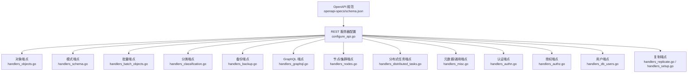
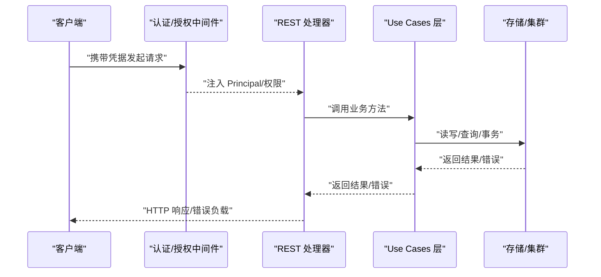
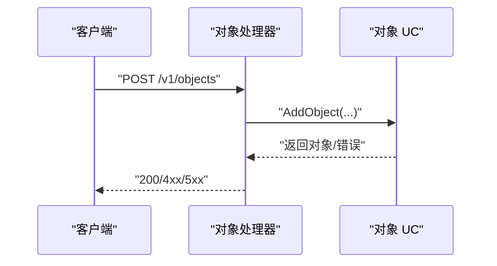
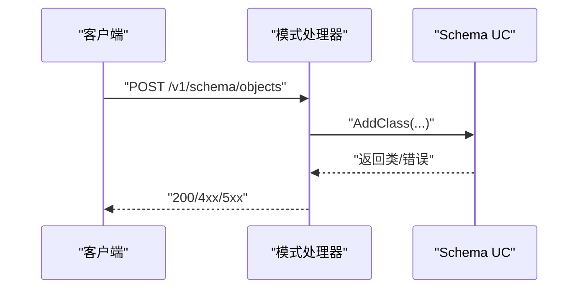
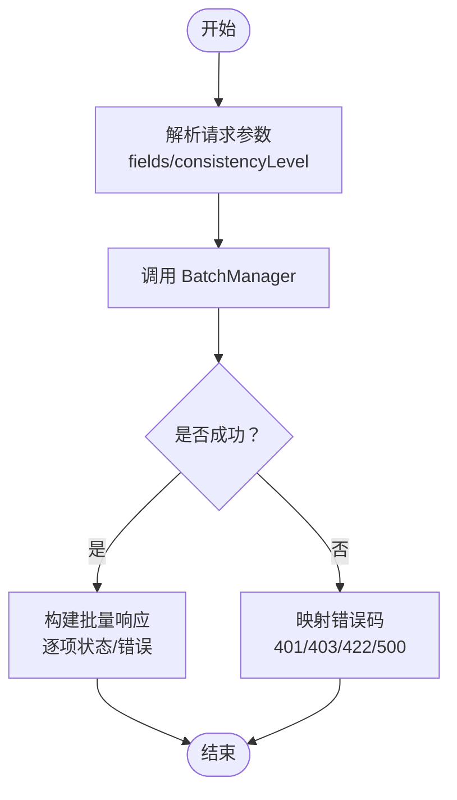
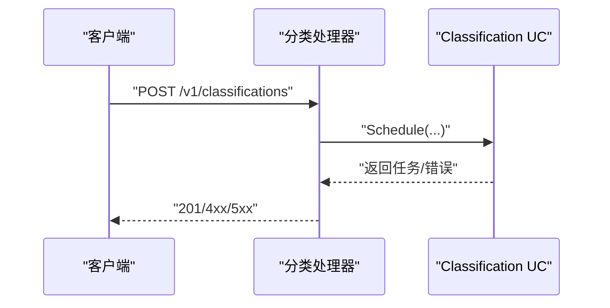
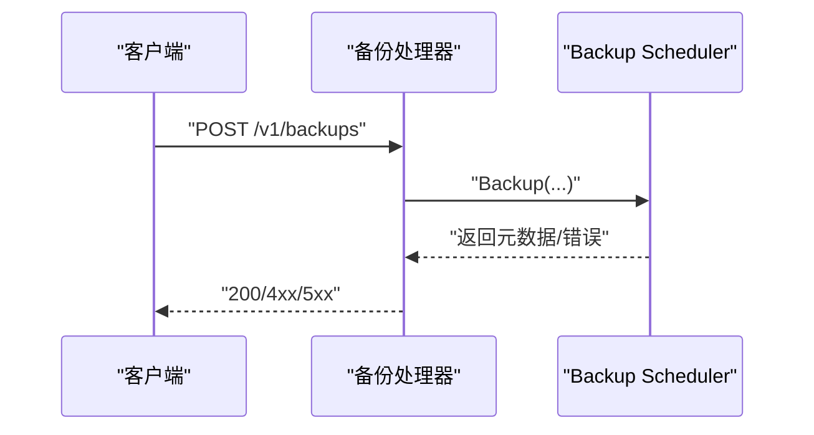
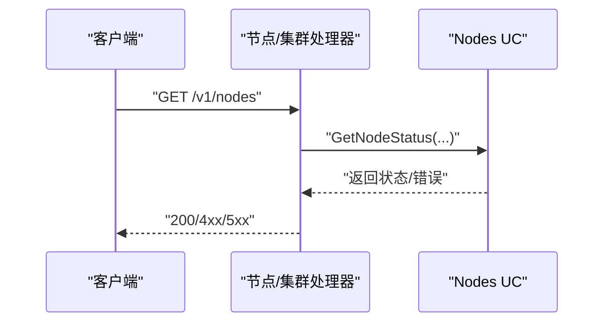
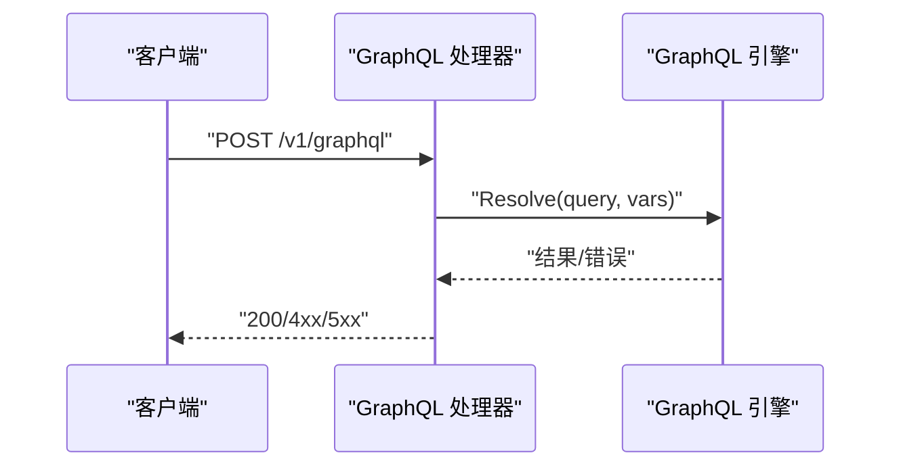
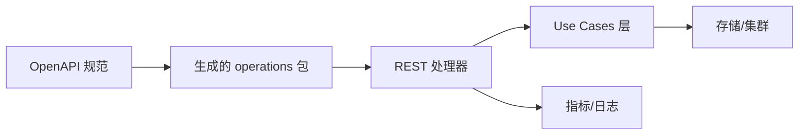

# REST API 端点

<cite>
**本文引用的文件**
- [openapi 规范 schema.json](file://openapi-specs/schema.json)
- [REST 对象处理器 handlers_objects.go](file://adapters/handlers/rest/handlers_objects.go)
- [REST 模式处理器 handlers_schema.go](file://adapters/handlers/rest/handlers_schema.go)
- [REST 批量处理器 handlers_batch_objects.go](file://adapters/handlers/rest/handlers_batch_objects.go)
- [REST 分类处理器 handlers_classification.go](file://adapters/handlers/rest/handlers_classification.go)
- [REST 备份处理器 handlers_backup.go](file://adapters/handlers/rest/handlers_backup.go)
- [REST GraphQL 处理器 handlers_graphql.go](file://adapters/handlers/rest/handlers_graphql.go)
- [REST 节点与集群处理器 handlers_nodes.go](file://adapters/handlers/rest/handlers_nodes.go)
- [REST 分布式任务处理器 handlers_distributed_tasks.go](file://adapters/handlers/rest/handlers_distributed_tasks.go)
- [REST 元数据与通用处理器 handlers_misc.go](file://adapters/handlers/rest/handlers_misc.go)
- [REST 认证处理器 handlers_authn.go](file://adapters/handlers/rest/handlers_authn.go)
- [REST 复制处理器 handlers_replicate.go](file://adapters/handlers/rest/replication/handlers_replicate.go)
- [REST 复制设置处理器 handlers_setup.go](file://adapters/handlers/rest/replication/handlers_setup.go)
- [REST 授权处理器 handlers_authz.go](file://adapters/handlers/rest/authz/handlers_authz.go)
- [REST 用户处理器 handlers_db_users.go](file://adapters/handlers/rest/db_users/handlers_db_users.go)
</cite>

## 目录
1. [简介](#简介)
2. [项目结构](#项目结构)
3. [核心组件](#核心组件)
4. [架构总览](#架构总览)
5. [详细组件分析](#详细组件分析)
6. [依赖关系分析](#依赖关系分析)
7. [性能考量](#性能考量)
8. [故障排查指南](#故障排查指南)
9. [结论](#结论)
10. [附录](#附录)

## 简介
本文件为 Weaviate 的 REST API 端点权威参考，覆盖对象管理、模式管理、批量操作、分类、备份、授权、用户管理、节点与集群、复制、分布式任务、GraphQL、元数据与健康检查等全部端点。内容基于仓库中的 OpenAPI 规范与各处理器实现，提供每个端点的 HTTP 方法、URL 模式、请求参数、响应格式、错误码、认证与权限控制、速率限制策略、使用场景与最佳实践，并辅以流程图与时序图帮助理解。

## 项目结构
Weaviate 的 REST API 由 OpenAPI 规范驱动，处理器位于 adapters/handlers/rest 下，按功能域拆分：
- 对象：objects
- 模式：schema
- 批量：batch
- 分类：classifications
- 备份：backups
- GraphQL：graphql
- 节点与集群：nodes/cluster
- 分布式任务：distributed_tasks
- 元数据与通用：meta/well-known
- 认证与授权：authn/authz
- 用户：users
- 复制：replication

图表来源
- [openapi 规范 schema.json](file://openapi-specs/schema.json#L1-L100)
- [REST 对象处理器 handlers_objects.go](file://adapters/handlers/rest/handlers_objects.go#L614-L658)
- [REST 模式处理器 handlers_schema.go](file://adapters/handlers/rest/handlers_schema.go#L361-L390)
- [REST 批量处理器 handlers_batch_objects.go](file://adapters/handlers/rest/handlers_batch_objects.go#L276-L285)
- [REST 分类处理器 handlers_classification.go](file://adapters/handlers/rest/handlers_classification.go#L28-L77)
- [REST 备份处理器 handlers_backup.go](file://adapters/handlers/rest/handlers_backup.go#L363-L378)
- [REST GraphQL 处理器 handlers_graphql.go](file://adapters/handlers/rest/handlers_graphql.go#L51-L206)
- [REST 节点与集群处理器 handlers_nodes.go](file://adapters/handlers/rest/handlers_nodes.go#L126-L139)
- [REST 分布式任务处理器 handlers_distributed_tasks.go](file://adapters/handlers/rest/handlers_distributed_tasks.go#L29-L35)
- [REST 元数据与通用处理器 handlers_misc.go](file://adapters/handlers/rest/handlers_misc.go#L29-L131)
- [REST 认证处理器 handlers_authn.go](file://adapters/handlers/rest/handlers_authn.go#L34-L39)
- [REST 复制处理器 handlers_replicate.go](file://adapters/handlers/rest/replication/handlers_replicate.go)
- [REST 复制设置处理器 handlers_setup.go](file://adapters/handlers/rest/replication/handlers_setup.go)
- [REST 授权处理器 handlers_authz.go](file://adapters/handlers/rest/authz/handlers_authz.go)
- [REST 用户处理器 handlers_db_users.go](file://adapters/handlers/rest/db_users/handlers_db_users.go)

章节来源
- [openapi 规范 schema.json](file://openapi-specs/schema.json#L1-L100)
- [REST 对象处理器 handlers_objects.go](file://adapters/handlers/rest/handlers_objects.go#L614-L658)
- [REST 模式处理器 handlers_schema.go](file://adapters/handlers/rest/handlers_schema.go#L361-L390)
- [REST 批量处理器 handlers_batch_objects.go](file://adapters/handlers/rest/handlers_batch_objects.go#L276-L285)
- [REST 分类处理器 handlers_classification.go](file://adapters/handlers/rest/handlers_classification.go#L28-L77)
- [REST 备份处理器 handlers_backup.go](file://adapters/handlers/rest/handlers_backup.go#L363-L378)
- [REST GraphQL 处理器 handlers_graphql.go](file://adapters/handlers/rest/handlers_graphql.go#L51-L206)
- [REST 节点与集群处理器 handlers_nodes.go](file://adapters/handlers/rest/handlers_nodes.go#L126-L139)
- [REST 分布式任务处理器 handlers_distributed_tasks.go](file://adapters/handlers/rest/handlers_distributed_tasks.go#L29-L35)
- [REST 元数据与通用处理器 handlers_misc.go](file://adapters/handlers/rest/handlers_misc.go#L29-L131)
- [REST 认证处理器 handlers_authn.go](file://adapters/handlers/rest/handlers_authn.go#L34-L39)
- [REST 复制处理器 handlers_replicate.go](file://adapters/handlers/rest/replication/handlers_replicate.go)
- [REST 复制设置处理器 handlers_setup.go](file://adapters/handlers/rest/replication/handlers_setup.go)
- [REST 授权处理器 handlers_authz.go](file://adapters/handlers/rest/authz/handlers_authz.go)
- [REST 用户处理器 handlers_db_users.go](file://adapters/handlers/rest/db_users/handlers_db_users.go)

## 核心组件
- REST 服务器与中间件：负责路由、认证、日志、指标统计与错误转换。
- OpenAPI 规范：定义端点、路径、参数、模型与响应结构。
- 各领域处理器：objects、schema、batch、classifications、backups、graphql、nodes、distributed_tasks、authn/authz、users、replication。
- 使用用例层：objects、schema、backup、classification、nodes、distributedtask、replication 等 UC 层封装业务逻辑与权限校验。

章节来源
- [openapi 规范 schema.json](file://openapi-specs/schema.json#L1-L100)
- [REST 对象处理器 handlers_objects.go](file://adapters/handlers/rest/handlers_objects.go#L36-L77)
- [REST 模式处理器 handlers_schema.go](file://adapters/handlers/rest/handlers_schema.go#L31-L34)
- [REST 批量处理器 handlers_batch_objects.go](file://adapters/handlers/rest/handlers_batch_objects.go#L31-L34)
- [REST 分类处理器 handlers_classification.go](file://adapters/handlers/rest/handlers_classification.go#L28-L30)
- [REST 备份处理器 handlers_backup.go](file://adapters/handlers/rest/handlers_backup.go#L30-L34)
- [REST GraphQL 处理器 handlers_graphql.go](file://adapters/handlers/rest/handlers_graphql.go#L47-L49)
- [REST 节点与集群处理器 handlers_nodes.go](file://adapters/handlers/rest/handlers_nodes.go#L34-L37)
- [REST 分布式任务处理器 handlers_distributed_tasks.go](file://adapters/handlers/rest/handlers_distributed_tasks.go#L29-L35)
- [REST 元数据与通用处理器 handlers_misc.go](file://adapters/handlers/rest/handlers_misc.go#L29-L32)
- [REST 认证处理器 handlers_authn.go](file://adapters/handlers/rest/handlers_authn.go#L28-L32)
- [REST 复制处理器 handlers_replicate.go](file://adapters/handlers/rest/replication/handlers_replicate.go)
- [REST 复制设置处理器 handlers_setup.go](file://adapters/handlers/rest/replication/handlers_setup.go)
- [REST 授权处理器 handlers_authz.go](file://adapters/handlers/rest/authz/handlers_authz.go)
- [REST 用户处理器 handlers_db_users.go](file://adapters/handlers/rest/db_users/handlers_db_users.go)

## 架构总览
下图展示 REST API 的端到端调用链：客户端请求经认证与授权后，进入对应处理器，调用 usecases 层完成业务处理，最终返回响应或错误。

图表来源
- [REST 对象处理器 handlers_objects.go](file://adapters/handlers/rest/handlers_objects.go#L79-L116)
- [REST 模式处理器 handlers_schema.go](file://adapters/handlers/rest/handlers_schema.go#L36-L56)
- [REST 批量处理器 handlers_batch_objects.go](file://adapters/handlers/rest/handlers_batch_objects.go#L43-L99)
- [REST 分类处理器 handlers_classification.go](file://adapters/handlers/rest/handlers_classification.go#L57-L76)
- [REST 备份处理器 handlers_backup.go](file://adapters/handlers/rest/handlers_backup.go#L96-L131)
- [REST GraphQL 处理器 handlers_graphql.go](file://adapters/handlers/rest/handlers_graphql.go#L60-L154)
- [REST 节点与集群处理器 handlers_nodes.go](file://adapters/handlers/rest/handlers_nodes.go#L39-L56)
- [REST 分布式任务处理器 handlers_distributed_tasks.go](file://adapters/handlers/rest/handlers_distributed_tasks.go#L41-L52)
- [REST 元数据与通用处理器 handlers_misc.go](file://adapters/handlers/rest/handlers_misc.go#L33-L55)
- [REST 认证处理器 handlers_authn.go](file://adapters/handlers/rest/handlers_authn.go#L41-L86)
- [REST 复制处理器 handlers_replicate.go](file://adapters/handlers/rest/replication/handlers_replicate.go)
- [REST 复制设置处理器 handlers_setup.go](file://adapters/handlers/rest/replication/handlers_setup.go)
- [REST 授权处理器 handlers_authz.go](file://adapters/handlers/rest/authz/handlers_authz.go)
- [REST 用户处理器 handlers_db_users.go](file://adapters/handlers/rest/db_users/handlers_db_users.go)

## 详细组件分析

### 对象管理端点（CRUD 与引用）
- 基础路径：/v1/objects
- 支持方法：GET、HEAD、POST、PUT、PATCH、DELETE；以及引用相关 POST/PUT/DELETE
- 关键参数：className、id、tenant、consistencyLevel、include、node、where 等
- 响应：成功返回对象或空；引用操作返回 OK；删除返回 NoContent
- 错误：401/403/404/422/500，依据具体错误类型映射
- 示例：创建对象返回 200 并包含对象属性与 API 链接扩展；批量创建返回每条结果的状态与错误

图表来源
- [REST 对象处理器 handlers_objects.go](file://adapters/handlers/rest/handlers_objects.go#L79-L116)
- [REST 对象处理器 handlers_objects.go](file://adapters/handlers/rest/handlers_objects.go#L362-L400)
- [REST 对象处理器 handlers_objects.go](file://adapters/handlers/rest/handlers_objects.go#L439-L478)
- [REST 对象处理器 handlers_objects.go](file://adapters/handlers/rest/handlers_objects.go#L480-L612)

章节来源
- [REST 对象处理器 handlers_objects.go](file://adapters/handlers/rest/handlers_objects.go#L79-L116)
- [REST 对象处理器 handlers_objects.go](file://adapters/handlers/rest/handlers_objects.go#L146-L216)
- [REST 对象处理器 handlers_objects.go](file://adapters/handlers/rest/handlers_objects.go#L218-L323)
- [REST 对象处理器 handlers_objects.go](file://adapters/handlers/rest/handlers_objects.go#L325-L360)
- [REST 对象处理器 handlers_objects.go](file://adapters/handlers/rest/handlers_objects.go#L362-L400)
- [REST 对象处理器 handlers_objects.go](file://adapters/handlers/rest/handlers_objects.go#L439-L478)
- [REST 对象处理器 handlers_objects.go](file://adapters/handlers/rest/handlers_objects.go#L480-L612)

### 模式管理端点（类、属性、分片、多租户）
- 基础路径：/v1/schema
- 支持方法：GET/POST/PUT/DELETE 类；GET/POST/PUT/DELETE 属性；GET/PUT 分片状态；GET/POST/PUT/DELETE 多租户
- 关键参数：className、tenant、consistencyLevel、status
- 响应：返回类定义、属性、分片状态、租户集合或单个租户
- 错误：401/403/404/422/500

图表来源
- [REST 模式处理器 handlers_schema.go](file://adapters/handlers/rest/handlers_schema.go#L36-L56)
- [REST 模式处理器 handlers_schema.go](file://adapters/handlers/rest/handlers_schema.go#L167-L195)
- [REST 模式处理器 handlers_schema.go](file://adapters/handlers/rest/handlers_schema.go#L221-L241)
- [REST 模式处理器 handlers_schema.go](file://adapters/handlers/rest/handlers_schema.go#L287-L306)
- [REST 模式处理器 handlers_schema.go](file://adapters/handlers/rest/handlers_schema.go#L308-L339)

章节来源
- [REST 模式处理器 handlers_schema.go](file://adapters/handlers/rest/handlers_schema.go#L36-L56)
- [REST 模式处理器 handlers_schema.go](file://adapters/handlers/rest/handlers_schema.go#L84-L108)
- [REST 模式处理器 handlers_schema.go](file://adapters/handlers/rest/handlers_schema.go#L167-L195)
- [REST 模式处理器 handlers_schema.go](file://adapters/handlers/rest/handlers_schema.go#L197-L219)
- [REST 模式处理器 handlers_schema.go](file://adapters/handlers/rest/handlers_schema.go#L221-L241)
- [REST 模式处理器 handlers_schema.go](file://adapters/handlers/rest/handlers_schema.go#L243-L263)
- [REST 模式处理器 handlers_schema.go](file://adapters/handlers/rest/handlers_schema.go#L265-L285)
- [REST 模式处理器 handlers_schema.go](file://adapters/handlers/rest/handlers_schema.go#L287-L306)
- [REST 模式处理器 handlers_schema.go](file://adapters/handlers/rest/handlers_schema.go#L308-L339)
- [REST 模式处理器 handlers_schema.go](file://adapters/handlers/rest/handlers_schema.go#L341-L359)

### 批量操作端点（对象与引用）
- 基础路径：/v1/batch
- 支持方法：POST 创建对象、POST 创建引用、POST 删除对象
- 关键参数：fields、consistencyLevel、match、dryRun、output
- 响应：批量对象返回每条结果状态与错误；批量引用返回每条引用结果状态与错误；批量删除返回匹配数、成功/失败计数与可选对象详情

图表来源
- [REST 批量处理器 handlers_batch_objects.go](file://adapters/handlers/rest/handlers_batch_objects.go#L43-L99)
- [REST 批量处理器 handlers_batch_objects.go](file://adapters/handlers/rest/handlers_batch_objects.go#L124-L157)
- [REST 批量处理器 handlers_batch_objects.go](file://adapters/handlers/rest/handlers_batch_objects.go#L186-L221)

章节来源
- [REST 批量处理器 handlers_batch_objects.go](file://adapters/handlers/rest/handlers_batch_objects.go#L43-L99)
- [REST 批量处理器 handlers_batch_objects.go](file://adapters/handlers/rest/handlers_batch_objects.go#L124-L157)
- [REST 批量处理器 handlers_batch_objects.go](file://adapters/handlers/rest/handlers_batch_objects.go#L186-L221)
- [REST 批量处理器 handlers_batch_objects.go](file://adapters/handlers/rest/handlers_batch_objects.go#L223-L274)

### 分类端点
- 基础路径：/v1/classifications
- 支持方法：GET 获取分类任务、POST 触发分类任务
- 关键参数：id、params
- 响应：返回分类任务状态或创建成功后的任务信息
- 错误：401/403/404/400

图表来源
- [REST 分类处理器 handlers_classification.go](file://adapters/handlers/rest/handlers_classification.go#L57-L76)

章节来源
- [REST 分类处理器 handlers_classification.go](file://adapters/handlers/rest/handlers_classification.go#L28-L77)

### 备份端点
- 基础路径：/v1/backups
- 支持方法：POST 创建备份、GET/POST 创建状态、POST 恢复、GET/POST 恢复状态、POST 取消备份、POST 取消恢复、GET 列表
- 关键参数：backend、id、bucket、path、config、include/exclude、nodeMapping、overwriteAlias
- 响应：返回备份元数据、状态、大小、时间戳等
- 错误：401/403/404/422/500

图表来源
- [REST 备份处理器 handlers_backup.go](file://adapters/handlers/rest/handlers_backup.go#L96-L131)
- [REST 备份处理器 handlers_backup.go](file://adapters/handlers/rest/handlers_backup.go#L133-L176)
- [REST 备份处理器 handlers_backup.go](file://adapters/handlers/rest/handlers_backup.go#L178-L231)
- [REST 备份处理器 handlers_backup.go](file://adapters/handlers/rest/handlers_backup.go#L233-L273)
- [REST 备份处理器 handlers_backup.go](file://adapters/handlers/rest/handlers_backup.go#L275-L304)
- [REST 备份处理器 handlers_backup.go](file://adapters/handlers/rest/handlers_backup.go#L306-L335)
- [REST 备份处理器 handlers_backup.go](file://adapters/handlers/rest/handlers_backup.go#L337-L361)

章节来源
- [REST 备份处理器 handlers_backup.go](file://adapters/handlers/rest/handlers_backup.go#L96-L131)
- [REST 备份处理器 handlers_backup.go](file://adapters/handlers/rest/handlers_backup.go#L133-L176)
- [REST 备份处理器 handlers_backup.go](file://adapters/handlers/rest/handlers_backup.go#L178-L231)
- [REST 备份处理器 handlers_backup.go](file://adapters/handlers/rest/handlers_backup.go#L233-L273)
- [REST 备份处理器 handlers_backup.go](file://adapters/handlers/rest/handlers_backup.go#L275-L304)
- [REST 备份处理器 handlers_backup.go](file://adapters/handlers/rest/handlers_backup.go#L306-L335)
- [REST 备份处理器 handlers_backup.go](file://adapters/handlers/rest/handlers_backup.go#L337-L361)

### 授权端点（RBAC）
- 基础路径：/v1/roles、/v1/groups、/v1/users/{user}/roles、/v1/groups/{group}/roles
- 支持方法：GET/POST/PUT/DELETE 角色；GET/POST/PUT/DELETE 组；GET/POST/PUT/DELETE 用户角色分配
- 关键参数：roleName、permission、resource、scope、user/group
- 响应：返回角色列表、组列表、用户/组的角色映射
- 错误：401/403/404/422/500

章节来源
- [REST 授权处理器 handlers_authz.go](file://adapters/handlers/rest/authz/handlers_authz.go)

### 用户管理端点
- 基础路径：/v1/users
- 支持方法：GET own info、GET 用户信息、POST 创建、PUT 更新、DELETE 删除、POST 激活/停用、POST 旋转 API Key、GET 列举
- 关键参数：userId、userType、active、apiKey
- 响应：返回用户信息、自身信息、API Key 签发
- 错误：401/403/404/422/500

章节来源
- [REST 用户处理器 handlers_db_users.go](file://adapters/handlers/rest/db_users/handlers_db_users.go)

### 节点与集群端点
- 基础路径：/v1/nodes、/v1/cluster/statistics
- 支持方法：GET 节点状态（全部/按类/按分片）、GET 集群统计
- 关键参数：className、shardName、output（verbose/minimal）
- 响应：返回节点状态、统计信息、同步状态
- 错误：401/403/404/422/500

图表来源
- [REST 节点与集群处理器 handlers_nodes.go](file://adapters/handlers/rest/handlers_nodes.go#L39-L56)
- [REST 节点与集群处理器 handlers_nodes.go](file://adapters/handlers/rest/handlers_nodes.go#L58-L80)
- [REST 节点与集群处理器 handlers_nodes.go](file://adapters/handlers/rest/handlers_nodes.go#L82-L106)

章节来源
- [REST 节点与集群处理器 handlers_nodes.go](file://adapters/handlers/rest/handlers_nodes.go#L39-L56)
- [REST 节点与集群处理器 handlers_nodes.go](file://adapters/handlers/rest/handlers_nodes.go#L58-L80)
- [REST 节点与集群处理器 handlers_nodes.go](file://adapters/handlers/rest/handlers_nodes.go#L82-L106)

### 复制端点
- 基础路径：/v1/replication
- 支持方法：POST 复制、GET/POST 复制详情、POST 应用缩放计划、POST 取消复制、GET 列举复制、DELETE 删除复制、GET 集合分片状态
- 关键参数：collection、shard、scalePlan、replica
- 响应：返回复制状态、缩放计划、分片状态
- 错误：401/403/404/422/500

章节来源
- [REST 复制处理器 handlers_replicate.go](file://adapters/handlers/rest/replication/handlers_replicate.go)
- [REST 复制设置处理器 handlers_setup.go](file://adapters/handlers/rest/replication/handlers_setup.go)

### 分布式任务端点
- 基础路径：/v1/distributed_tasks
- 支持方法：GET 列举任务
- 关键参数：无
- 响应：返回任务列表
- 错误：401/403/500

章节来源
- [REST 分布式任务处理器 handlers_distributed_tasks.go](file://adapters/handlers/rest/handlers_distributed_tasks.go#L41-L52)

### GraphQL 端点
- 基础路径：/v1/graphql
- 支持方法：POST 单次查询、POST 批量查询
- 关键参数：query、operationName、variables
- 响应：返回 GraphQL 数据或错误数组
- 错误：401/403/422/500

图表来源
- [REST GraphQL 处理器 handlers_graphql.go](file://adapters/handlers/rest/handlers_graphql.go#L60-L154)
- [REST GraphQL 处理器 handlers_graphql.go](file://adapters/handlers/rest/handlers_graphql.go#L156-L205)

章节来源
- [REST GraphQL 处理器 handlers_graphql.go](file://adapters/handlers/rest/handlers_graphql.go#L60-L154)
- [REST GraphQL 处理器 handlers_graphql.go](file://adapters/handlers/rest/handlers_graphql.go#L156-L205)

### 元数据与健康检查端点
- 基础路径：/v1/meta、/v1/.well-known/live、/v1/.well-known/ready、/v1/.well-known/openid-configuration、/
- 支持方法：GET
- 响应：返回版本、主机名、模块元数据、健康状态、OIDC 配置链接
- 错误：404（当 OIDC 未启用时）

章节来源
- [REST 元数据与通用处理器 handlers_misc.go](file://adapters/handlers/rest/handlers_misc.go#L33-L55)
- [REST 元数据与通用处理器 handlers_misc.go](file://adapters/handlers/rest/handlers_misc.go#L57-L79)
- [REST 元数据与通用处理器 handlers_misc.go](file://adapters/handlers/rest/handlers_misc.go#L81-L130)

### 认证端点
- 基础路径：/v1/users/@me
- 支持方法：GET 自身信息（含角色与组）
- 响应：返回用户名、组、角色列表
- 错误：401/500

章节来源
- [REST 认证处理器 handlers_authn.go](file://adapters/handlers/rest/handlers_authn.go#L41-L86)

## 依赖关系分析
- OpenAPI 规范驱动端点定义与模型，处理器通过生成的 operations 包对接。
- 处理器依赖 usecases 层完成业务逻辑与权限校验。
- 错误统一转换为 ErrorResponse 或特定响应体。
- 指标与日志通过 Prometheus 与 logrus 统一采集。

图表来源
- [openapi 规范 schema.json](file://openapi-specs/schema.json#L1-L100)
- [REST 对象处理器 handlers_objects.go](file://adapters/handlers/rest/handlers_objects.go#L36-L77)
- [REST 模式处理器 handlers_schema.go](file://adapters/handlers/rest/handlers_schema.go#L31-L34)
- [REST 批量处理器 handlers_batch_objects.go](file://adapters/handlers/rest/handlers_batch_objects.go#L31-L34)
- [REST 分类处理器 handlers_classification.go](file://adapters/handlers/rest/handlers_classification.go#L28-L30)
- [REST 备份处理器 handlers_backup.go](file://adapters/handlers/rest/handlers_backup.go#L30-L34)
- [REST GraphQL 处理器 handlers_graphql.go](file://adapters/handlers/rest/handlers_graphql.go#L47-L49)
- [REST 节点与集群处理器 handlers_nodes.go](file://adapters/handlers/rest/handlers_nodes.go#L34-L37)
- [REST 分布式任务处理器 handlers_distributed_tasks.go](file://adapters/handlers/rest/handlers_distributed_tasks.go#L29-L35)
- [REST 元数据与通用处理器 handlers_misc.go](file://adapters/handlers/rest/handlers_misc.go#L29-L32)
- [REST 认证处理器 handlers_authn.go](file://adapters/handlers/rest/handlers_authn.go#L28-L32)
- [REST 复制处理器 handlers_replicate.go](file://adapters/handlers/rest/replication/handlers_replicate.go)
- [REST 复制设置处理器 handlers_setup.go](file://adapters/handlers/rest/replication/handlers_setup.go)
- [REST 授权处理器 handlers_authz.go](file://adapters/handlers/rest/authz/handlers_authz.go)
- [REST 用户处理器 handlers_db_users.go](file://adapters/handlers/rest/db_users/handlers_db_users.go)

## 性能考量
- 批量端点：建议合并小请求为批量，减少网络开销与并发竞争。
- 复制一致性：在高写入场景谨慎设置一致性级别，避免阻塞。
- GraphQL：避免过深嵌套与大结果集，合理使用 variables 与分页。
- 指标监控：利用 Prometheus 指标观察请求总量、错误分布与慢查询。

## 故障排查指南
- 401 未认证：检查 Authorization 头或 OIDC 配置。
- 403 权限不足：确认角色与权限范围，特别是对集合、租户、备份、用户等资源的操作。
- 404 资源不存在：核对 id、className、tenant 是否正确。
- 422 语义错误：检查请求体结构、字段类型与约束。
- 500 服务器错误：查看日志定位具体 UC 层异常。

章节来源
- [REST 对象处理器 handlers_objects.go](file://adapters/handlers/rest/handlers_objects.go#L94-L106)
- [REST 模式处理器 handlers_schema.go](file://adapters/handlers/rest/handlers_schema.go#L44-L51)
- [REST 批量处理器 handlers_batch_objects.go](file://adapters/handlers/rest/handlers_batch_objects.go#L74-L90)
- [REST 分类处理器 handlers_classification.go](file://adapters/handlers/rest/handlers_classification.go#L37-L44)
- [REST 备份处理器 handlers_backup.go](file://adapters/handlers/rest/handlers_backup.go#L117-L126)
- [REST GraphQL 处理器 handlers_graphql.go](file://adapters/handlers/rest/handlers_graphql.go#L67-L75)
- [REST 节点与集群处理器 handlers_nodes.go](file://adapters/handlers/rest/handlers_nodes.go#L108-L124)
- [REST 分布式任务处理器 handlers_distributed_tasks.go](file://adapters/handlers/rest/handlers_distributed_tasks.go#L44-L48)
- [REST 元数据与通用处理器 handlers_misc.go](file://adapters/handlers/rest/handlers_misc.go#L60-L61)
- [REST 认证处理器 handlers_authn.go](file://adapters/handlers/rest/handlers_authn.go#L42-L43)
- [REST 复制处理器 handlers_replicate.go](file://adapters/handlers/rest/replication/handlers_replicate.go)
- [REST 复制设置处理器 handlers_setup.go](file://adapters/handlers/rest/replication/handlers_setup.go)
- [REST 授权处理器 handlers_authz.go](file://adapters/handlers/rest/authz/handlers_authz.go)
- [REST 用户处理器 handlers_db_users.go](file://adapters/handlers/rest/db_users/handlers_db_users.go)

## 结论
本文档系统梳理了 Weaviate REST API 的全部端点，结合 OpenAPI 规范与实现细节，提供了权威的参考与最佳实践指导。集成开发者可据此快速定位端点、理解参数与响应、设计错误处理与安全策略，并结合指标与日志进行运维优化。

## 附录
- 认证机制：支持数据库用户与 OIDC；OIDC 配置可通过 /.well-known/openid-configuration 获取。
- 权限控制：RBAC 角色与权限模型，细粒度控制集合、租户、数据、备份、用户、节点等资源。
- 速率限制：仓库未内置全局速率限制策略，建议在网关或反向代理层实施。