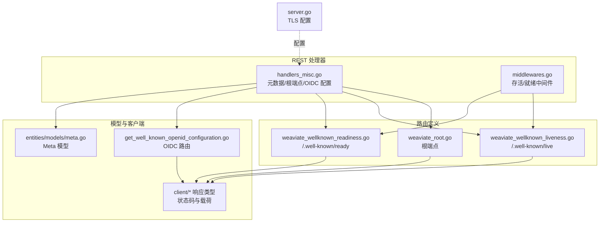
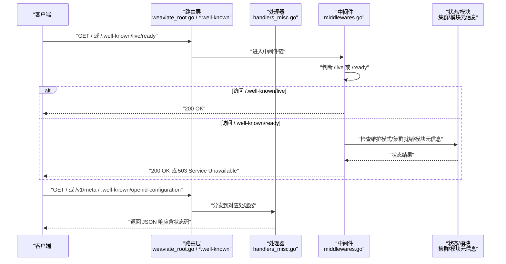
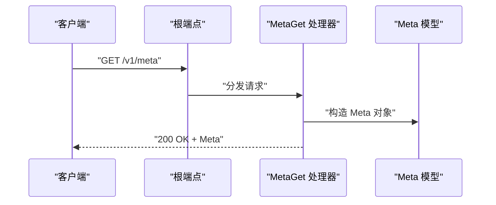
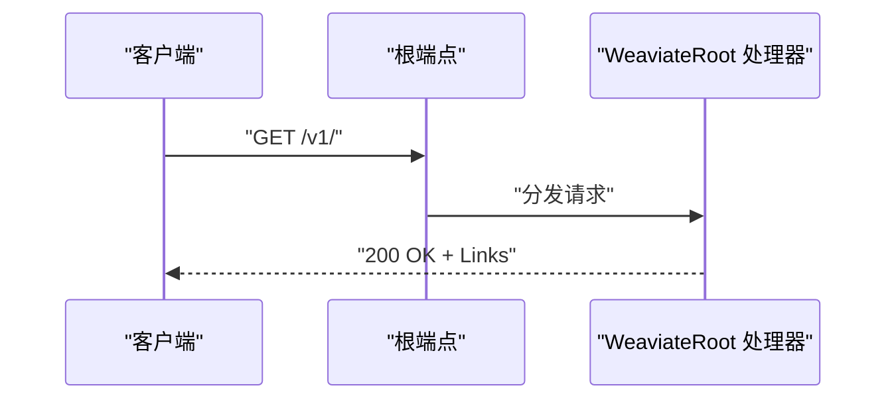
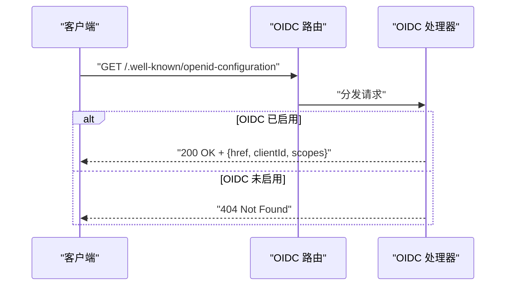
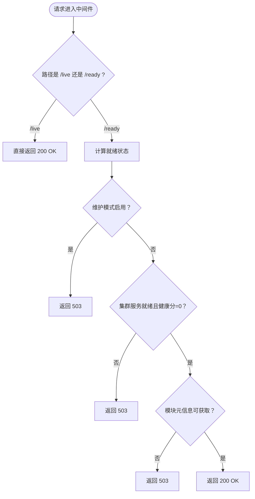
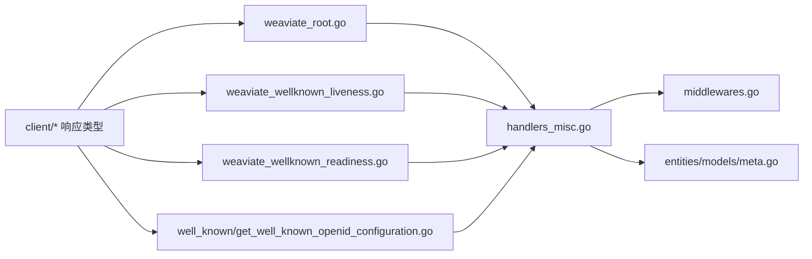

# 元数据与健康检查端点

<cite>
**本文引用的文件**
- [handlers_misc.go](file://adapters/handlers/rest/handlers_misc.go)
- [middlewares.go](file://adapters/handlers/rest/middlewares.go)
- [weaviate_root.go](file://adapters/handlers/rest/operations/weaviate_root.go)
- [weaviate_wellknown_liveness.go](file://adapters/handlers/rest/operations/weaviate_wellknown_liveness.go)
- [weaviate_wellknown_readiness.go](file://adapters/handlers/rest/operations/weaviate_wellknown_readiness.go)
- [meta.go](file://entities/models/meta.go)
- [get_well_known_openid_configuration.go](file://adapters/handlers/rest/operations/well_known/get_well_known_openid_configuration.go)
- [get_well_known_openid_configuration_responses.go](file://adapters/handlers/rest/operations/well_known/get_well_known_openid_configuration_responses.go)
- [get_well_known_openid_configuration_responses.go](file://client/well_known/get_well_known_openid_configuration_responses.go)
- [weaviate_root_responses.go](file://client/operations/weaviate_root_responses.go)
- [weaviate_wellknown_liveness_responses.go](file://client/operations/weaviate_wellknown_liveness_responses.go)
- [weaviate_wellknown_readiness_responses.go](file://client/operations/weaviate_wellknown_readiness_responses.go)
- [server.go](file://adapters/handlers/rest/server.go)
</cite>

## 目录
1. [简介](#简介)
2. [项目结构](#项目结构)
3. [核心组件](#核心组件)
4. [架构总览](#架构总览)
5. [详细组件分析](#详细组件分析)
6. [依赖关系分析](#依赖关系分析)
7. [性能考量](#性能考量)
8. [故障排查指南](#故障排查指南)
9. [结论](#结论)
10. [附录](#附录)

## 简介
本文件聚焦 Weaviate 的“元数据查询”“OpenID Connect 根端点”“根端点”以及“健康检查（存活/就绪）”REST API 端点，系统性说明以下内容：
- 元数据查询：返回系统版本、主机名、模块元信息、gRPC 最大消息大小等
- OpenID Connect 配置：暴露 /.well-known/openid-configuration，包含重定向地址、客户端 ID、作用域
- 根端点：返回可用 API 链接集合，便于发现 REST API
- 健康检查：存活检查（/.well-known/live）与就绪检查（/.well-known/ready），用于容器编排与自动化部署
- 请求/响应示例：提供端点路径、方法、状态码与典型负载字段说明
- 监控与运维：结合中间件逻辑与 TLS 配置，给出监控集成与故障检测建议

## 项目结构
与元数据与健康检查相关的核心文件分布于 REST 处理器、模型定义与客户端响应类型中：
- REST 处理器与中间件：handlers_misc.go、middlewares.go
- 根端点与健康检查路由：weaviate_root.go、weaviate_wellknown_liveness.go、weaviate_wellknown_readiness.go
- 模型定义：entities/models/meta.go
- OIDC 配置端点：operations 层与 client 层的响应类型
- 服务器 TLS 配置：adapters/handlers/rest/server.go

**图表来源**
- [handlers_misc.go](file://adapters/handlers/rest/handlers_misc.go#L29-L131)
- [middlewares.go](file://adapters/handlers/rest/middlewares.go#L233-L260)
- [weaviate_root.go](file://adapters/handlers/rest/operations/weaviate_root.go#L50-L89)
- [weaviate_wellknown_liveness.go](file://adapters/handlers/rest/operations/weaviate_wellknown_liveness.go#L45-L55)
- [weaviate_wellknown_readiness.go](file://adapters/handlers/rest/operations/weaviate_wellknown_readiness.go#L45-L55)
- [meta.go](file://entities/models/meta.go#L26-L42)
- [get_well_known_openid_configuration.go](file://adapters/handlers/rest/operations/well_known/get_well_known_openid_configuration.go#L60-L102)
- [server.go](file://adapters/handlers/rest/server.go#L276-L301)

**章节来源**
- [handlers_misc.go](file://adapters/handlers/rest/handlers_misc.go#L29-L131)
- [middlewares.go](file://adapters/handlers/rest/middlewares.go#L233-L260)
- [weaviate_root.go](file://adapters/handlers/rest/operations/weaviate_root.go#L50-L89)
- [weaviate_wellknown_liveness.go](file://adapters/handlers/rest/operations/weaviate_wellknown_liveness.go#L45-L55)
- [weaviate_wellknown_readiness.go](file://adapters/handlers/rest/operations/weaviate_wellknown_readiness.go#L45-L55)
- [meta.go](file://entities/models/meta.go#L26-L42)
- [get_well_known_openid_configuration.go](file://adapters/handlers/rest/operations/well_known/get_well_known_openid_configuration.go#L60-L102)
- [server.go](file://adapters/handlers/rest/server.go#L276-L301)

## 核心组件
- 元数据端点（/v1/meta）
  - 返回字段：主机名、版本、模块元信息、gRPC 最大消息大小
  - 来源：handlers_misc.go 中的 MetaGet 处理器
- 根端点（/v1/）
  - 返回：可用 API 链接集合（含 schema、objects、classifications、live/ready、openid-configuration 等）
  - 来源：weaviate_root.go 与 handlers_misc.go
- OIDC 配置端点（/.well-known/openid-configuration）
  - 当启用 OIDC 时，返回 href、clientId、scopes；未启用则 404
  - 来源：handlers_misc.go 中的 WellKnown OIDC 处理器
- 健康检查
  - 存活检查（/.well-known/live）：始终返回 200（中间件直接写入状态码）
  - 就绪检查（/.well-known/ready）：根据集群就绪状态、维护模式与模块元信息获取结果返回 200 或 503

**章节来源**
- [handlers_misc.go](file://adapters/handlers/rest/handlers_misc.go#L33-L55)
- [handlers_misc.go](file://adapters/handlers/rest/handlers_misc.go#L81-L130)
- [handlers_misc.go](file://adapters/handlers/rest/handlers_misc.go#L57-L79)
- [middlewares.go](file://adapters/handlers/rest/middlewares.go#L233-L260)
- [weaviate_root.go](file://adapters/handlers/rest/operations/weaviate_root.go#L50-L89)
- [meta.go](file://entities/models/meta.go#L26-L42)

## 架构总览
下图展示从客户端到处理器再到中间件的整体调用链，以及健康检查的判定逻辑。

**图表来源**
- [weaviate_root.go](file://adapters/handlers/rest/operations/weaviate_root.go#L62-L89)
- [weaviate_wellknown_liveness.go](file://adapters/handlers/rest/operations/weaviate_wellknown_liveness.go#L57-L84)
- [weaviate_wellknown_readiness.go](file://adapters/handlers/rest/operations/weaviate_wellknown_readiness.go#L57-L84)
- [handlers_misc.go](file://adapters/handlers/rest/handlers_misc.go#L33-L55)
- [handlers_misc.go](file://adapters/handlers/rest/handlers_misc.go#L57-L79)
- [middlewares.go](file://adapters/handlers/rest/middlewares.go#L233-L260)

## 详细组件分析

### 元数据端点（/v1/meta）
- 方法与路径：GET /v1/meta
- 成功响应：200 OK
- 响应体字段（来自模型定义）：
  - hostname：主机名
  - version：服务版本
  - modules：模块元信息（字典）
  - grpcMaxMessageSize：gRPC 最大消息大小（字节）
- 错误场景：
  - 获取模块元信息失败：500 Internal Server Error
- 实现要点：
  - 组装响应体并返回
  - 模块元信息来源于模块提供者（若存在）

**图表来源**
- [handlers_misc.go](file://adapters/handlers/rest/handlers_misc.go#L33-L55)
- [meta.go](file://entities/models/meta.go#L26-L42)

**章节来源**
- [handlers_misc.go](file://adapters/handlers/rest/handlers_misc.go#L33-L55)
- [meta.go](file://entities/models/meta.go#L26-L42)

### 根端点（/v1/）
- 方法与路径：GET /v1/
- 成功响应：200 OK
- 响应体字段：
  - links：数组，包含多个链接对象，每个对象包含 name、href、documentationHref
- 用途：帮助发现其他端点（如 /v1/meta、/v1/schema、/v1/objects、/v1/classifications、/.well-known/live、/.well-known/ready、/.well-known/openid-configuration）

**图表来源**
- [weaviate_root.go](file://adapters/handlers/rest/operations/weaviate_root.go#L62-L89)
- [handlers_misc.go](file://adapters/handlers/rest/handlers_misc.go#L81-L130)

**章节来源**
- [weaviate_root.go](file://adapters/handlers/rest/operations/weaviate_root.go#L50-L89)
- [handlers_misc.go](file://adapters/handlers/rest/handlers_misc.go#L81-L130)
- [weaviate_root_responses.go](file://client/operations/weaviate_root_responses.go#L120-L152)

### OpenID Connect 配置端点（/.well-known/openid-configuration）
- 方法与路径：GET /.well-known/openid-configuration
- 启用 OIDC 时：
  - 成功响应：200 OK
  - 响应体字段：
    - href：OIDC 发行者地址
    - clientId：OAuth 客户端 ID
    - scopes：所需 OAuth 作用域列表
- 未启用 OIDC 时：
  - 响应：404 Not Found
- 错误场景：
  - 内部错误：500 Internal Server Error（例如 URL 拼接失败）

**图表来源**
- [handlers_misc.go](file://adapters/handlers/rest/handlers_misc.go#L57-L79)
- [get_well_known_openid_configuration.go](file://adapters/handlers/rest/operations/well_known/get_well_known_openid_configuration.go#L60-L102)
- [get_well_known_openid_configuration_responses.go](file://adapters/handlers/rest/operations/well_known/get_well_known_openid_configuration_responses.go#L86-L117)
- [get_well_known_openid_configuration_responses.go](file://client/well_known/get_well_known_openid_configuration_responses.go#L36-L108)

**章节来源**
- [handlers_misc.go](file://adapters/handlers/rest/handlers_misc.go#L57-L79)
- [get_well_known_openid_configuration.go](file://adapters/handlers/rest/operations/well_known/get_well_known_openid_configuration.go#L60-L102)
- [get_well_known_openid_configuration_responses.go](file://adapters/handlers/rest/operations/well_known/get_well_known_openid_configuration_responses.go#L86-L117)
- [get_well_known_openid_configuration_responses.go](file://client/well_known/get_well_known_openid_configuration_responses.go#L36-L108)

### 健康检查端点
- 存活检查（/.well-known/live）
  - 方法与路径：GET /.well-known/live
  - 行为：中间件直接返回 200 OK，不进行业务校验
- 就绪检查（/.well-known/ready）
  - 方法与路径：GET /.well-known/ready
  - 行为：根据以下条件决定状态码
    - 若节点处于维护模式：503
    - 若集群服务未就绪或集群健康分为非零：503
    - 若模块元信息获取失败：503
    - 否则：200 OK

**图表来源**
- [middlewares.go](file://adapters/handlers/rest/middlewares.go#L233-L260)

**章节来源**
- [weaviate_wellknown_liveness.go](file://adapters/handlers/rest/operations/weaviate_wellknown_liveness.go#L45-L55)
- [weaviate_wellknown_readiness.go](file://adapters/handlers/rest/operations/weaviate_wellknown_readiness.go#L45-L55)
- [middlewares.go](file://adapters/handlers/rest/middlewares.go#L233-L260)
- [weaviate_wellknown_liveness_responses.go](file://client/operations/weaviate_wellknown_liveness_responses.go#L83-L99)
- [weaviate_wellknown_readiness_responses.go](file://client/operations/weaviate_wellknown_readiness_responses.go#L31-L67)

## 依赖关系分析
- 路由与处理器
  - 根端点与健康检查路由在 operations 层定义，处理器在 handlers_misc.go 中实现
  - OIDC 配置路由同样在 operations 层定义，处理器在 handlers_misc.go 中实现
- 中间件
  - addLiveAndReadyness 在中间件层统一处理 /live 与 /ready 的状态码
- 模型与客户端
  - Meta 模型定义了元数据响应结构
  - 客户端响应类型明确了各端点的状态码与载荷

**图表来源**
- [weaviate_root.go](file://adapters/handlers/rest/operations/weaviate_root.go#L50-L89)
- [weaviate_wellknown_liveness.go](file://adapters/handlers/rest/operations/weaviate_wellknown_liveness.go#L45-L55)
- [weaviate_wellknown_readiness.go](file://adapters/handlers/rest/operations/weaviate_wellknown_readiness.go#L45-L55)
- [get_well_known_openid_configuration.go](file://adapters/handlers/rest/operations/well_known/get_well_known_openid_configuration.go#L60-L102)
- [handlers_misc.go](file://adapters/handlers/rest/handlers_misc.go#L29-L131)
- [middlewares.go](file://adapters/handlers/rest/middlewares.go#L233-L260)
- [meta.go](file://entities/models/meta.go#L26-L42)

**章节来源**
- [handlers_misc.go](file://adapters/handlers/rest/handlers_misc.go#L29-L131)
- [middlewares.go](file://adapters/handlers/rest/middlewares.go#L233-L260)
- [meta.go](file://entities/models/meta.go#L26-L42)

## 性能考量
- 健康检查中间件直接返回状态码，避免额外业务逻辑开销，适合高频探测
- 元数据端点仅组装少量静态配置与模块元信息，通常为低延迟
- OIDC 配置端点在未启用 OIDC 时快速返回 404，避免不必要的后端调用
- TLS 配置在服务器启动阶段完成，对运行时请求无显著影响

[本节为通用指导，无需列出具体文件来源]

## 故障排查指南
- 404 Not Found（OIDC 配置）
  - 现象：访问 /.well-known/openid-configuration 返回 404
  - 可能原因：未启用 OIDC
  - 处理建议：确认配置中已启用 OIDC 并正确设置发行者地址、客户端 ID 与作用域
- 500 Internal Server Error（元数据）
  - 现象：/v1/meta 返回 500
  - 可能原因：模块元信息获取失败
  - 处理建议：检查模块状态与网络连通性，重试或查看日志
- 503 Service Unavailable（就绪检查）
  - 现象：/.well-known/ready 返回 503
  - 可能原因：维护模式开启、集群未就绪、集群健康分非零、模块元信息获取失败
  - 处理建议：检查集群状态、模块加载情况与健康评分；退出维护模式后重试
- TLS 配置问题
  - 现象：HTTPS 连接失败或证书验证错误
  - 可能原因：证书/密钥路径错误、CA 证书格式不正确、客户端需验证证书
  - 处理建议：核对 server.go 中的 TLS 配置参数，确保文件存在且格式正确

**章节来源**
- [get_well_known_openid_configuration_responses.go](file://adapters/handlers/rest/operations/well_known/get_well_known_openid_configuration_responses.go#L86-L117)
- [handlers_misc.go](file://adapters/handlers/rest/handlers_misc.go#L39-L44)
- [middlewares.go](file://adapters/handlers/rest/middlewares.go#L244-L253)
- [server.go](file://adapters/handlers/rest/server.go#L276-L301)

## 结论
Weaviate 的元数据与健康检查端点设计简洁明确：
- 元数据端点提供系统关键信息，便于运维与自动化
- 根端点作为 API 发现入口，提升可观测性与易用性
- OIDC 配置端点支持标准认证流程，未启用时优雅降级
- 健康检查端点通过中间件实现高效判定，适配容器编排与自动扩缩容场景
结合 TLS 配置与中间件策略，可满足生产环境的监控、部署与故障检测需求。

[本节为总结性内容，无需列出具体文件来源]

## 附录

### 请求/响应示例（字段说明）
- GET /v1/meta
  - 成功：200 OK，响应体字段：hostname、version、modules、grpcMaxMessageSize
- GET /v1/
  - 成功：200 OK，响应体字段：links（数组），每项包含 name、href、documentationHref
- GET /.well-known/openid-configuration
  - 启用 OIDC：200 OK，响应体字段：href、clientId、scopes
  - 未启用 OIDC：404 Not Found
  - 异常：500 Internal Server Error（例如 URL 拼接失败）
- GET /.well-known/live
  - 成功：200 OK（中间件直接返回）
- GET /.well-known/ready
  - 成功：200 OK
  - 未就绪：503 Service Unavailable

**章节来源**
- [handlers_misc.go](file://adapters/handlers/rest/handlers_misc.go#L33-L55)
- [handlers_misc.go](file://adapters/handlers/rest/handlers_misc.go#L81-L130)
- [handlers_misc.go](file://adapters/handlers/rest/handlers_misc.go#L57-L79)
- [middlewares.go](file://adapters/handlers/rest/middlewares.go#L233-L260)
- [weaviate_root_responses.go](file://client/operations/weaviate_root_responses.go#L120-L152)
- [get_well_known_openid_configuration_responses.go](file://client/well_known/get_well_known_openid_configuration_responses.go#L36-L108)
- [weaviate_wellknown_liveness_responses.go](file://client/operations/weaviate_wellknown_liveness_responses.go#L83-L99)
- [weaviate_wellknown_readiness_responses.go](file://client/operations/weaviate_wellknown_readiness_responses.go#L31-L67)