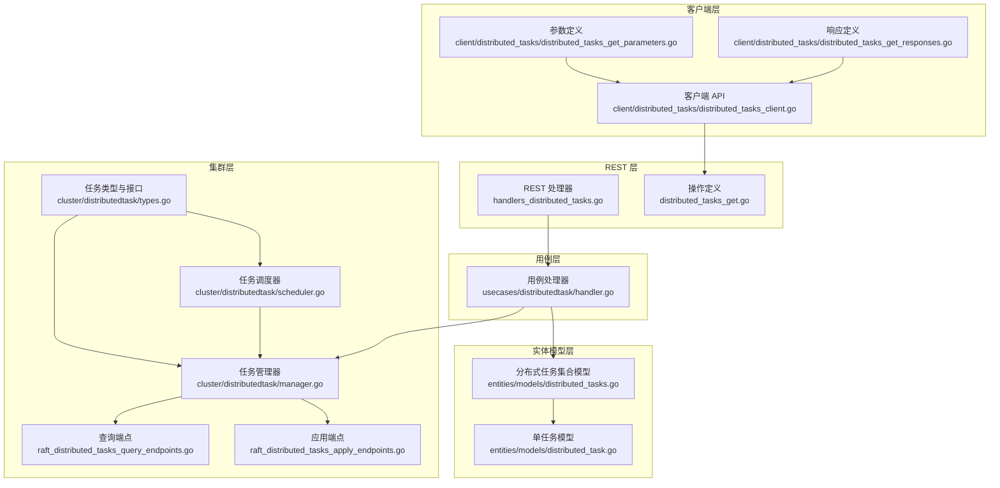
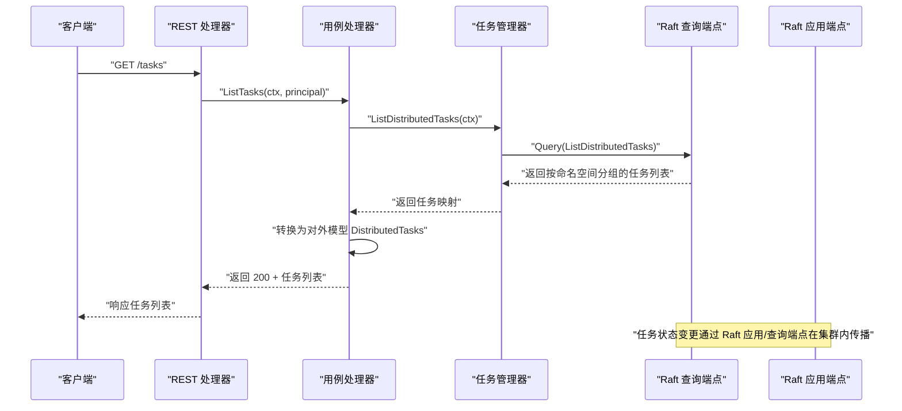
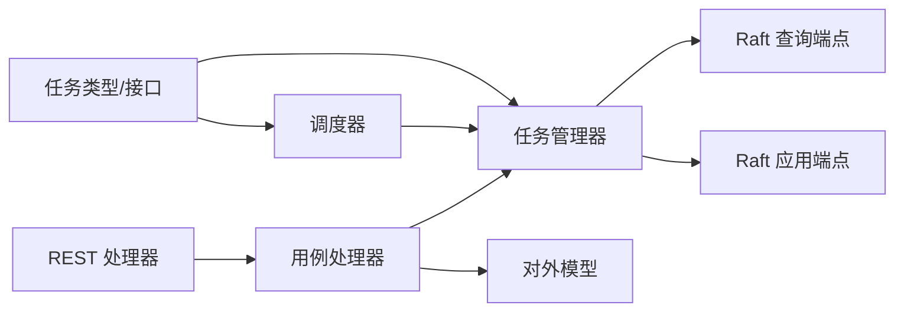

# 分布式任务端点

<cite>
**本文引用的文件**
- [handlers_distributed_tasks.go](file://adapters/handlers/rest/handlers_distributed_tasks.go)
- [distributed_tasks_get.go](file://adapters/handlers/rest/operations/distributed_tasks/distributed_tasks_get.go)
- [distributed_tasks_get_parameters.go](file://client/distributed_tasks/distributed_tasks_get_parameters.go)
- [distributed_tasks_get_responses.go](file://client/distributed_tasks/distributed_tasks_get_responses.go)
- [distributed_tasks_client.go](file://client/distributed_tasks/distributed_tasks_client.go)
- [raft_distributed_tasks_query_endpoints.go](file://cluster/raft_distributed_tasks_query_endpoints.go)
- [raft_distributed_tasks_apply_endpoints.go](file://cluster/raft_distributed_tasks_apply_endpoints.go)
- [types.go](file://cluster/distributedtask/types.go)
- [manager.go](file://cluster/distributedtask/manager.go)
- [scheduler.go](file://cluster/distributedtask/scheduler.go)
- [handler.go](file://usecases/distributedtask/handler.go)
- [distributed_tasks.go](file://entities/models/distributed_tasks.go)
- [distributed_task.go](file://entities/models/distributed_task.go)
</cite>

## 目录
1. [简介](#简介)
2. [项目结构](#项目结构)
3. [核心组件](#核心组件)
4. [架构总览](#架构总览)
5. [详细组件分析](#详细组件分析)
6. [依赖关系分析](#依赖关系分析)
7. [性能考量](#性能考量)
8. [故障排除指南](#故障排除指南)
9. [结论](#结论)
10. [附录](#附录)

## 简介
本文件面向 Weaviate 的分布式任务 REST API 端点，系统性阐述“任务查询”端点的功能与用法，覆盖任务类型、状态管理、进度跟踪、调度与执行监控、结果获取、生命周期管理、超时与清理策略以及最佳实践与故障排除建议。读者可据此在集群环境中对分布式任务进行统一查询与治理。

## 项目结构
分布式任务查询端点由以下层次组成：
- REST 层：注册路由、参数绑定、鉴权与响应封装
- 用例层：权限校验、数据转换与模型映射
- 集群层：任务列表聚合、查询与应用命令（Raft）
- 实体模型层：对外暴露的数据模型定义
- 客户端层：SDK 对外 API 的生成代码

图表来源
- [handlers_distributed_tasks.go](file://adapters/handlers/rest/handlers_distributed_tasks.go#L29-L52)
- [distributed_tasks_get.go](file://adapters/handlers/rest/operations/distributed_tasks/distributed_tasks_get.go#L46-L82)
- [handler.go](file://usecases/distributedtask/handler.go#L38-L81)
- [raft_distributed_tasks_query_endpoints.go](file://cluster/raft_distributed_tasks_query_endpoints.go#L23-L38)
- [raft_distributed_tasks_apply_endpoints.go](file://cluster/raft_distributed_tasks_apply_endpoints.go#L23-L119)
- [manager.go](file://cluster/distributedtask/manager.go#L171-L198)
- [scheduler.go](file://cluster/distributedtask/scheduler.go#L110-L158)
- [types.go](file://cluster/distributedtask/types.go#L20-L124)
- [distributed_tasks.go](file://entities/models/distributed_tasks.go#L28-L62)
- [distributed_task.go](file://entities/models/distributed_task.go#L28-L58)
- [distributed_tasks_client.go](file://client/distributed_tasks/distributed_tasks_client.go#L52-L86)
- [distributed_tasks_get_parameters.go](file://client/distributed_tasks/distributed_tasks_get_parameters.go#L30-L140)
- [distributed_tasks_get_responses.go](file://client/distributed_tasks/distributed_tasks_get_responses.go#L34-L124)

章节来源
- [handlers_distributed_tasks.go](file://adapters/handlers/rest/handlers_distributed_tasks.go#L29-L52)
- [distributed_tasks_get.go](file://adapters/handlers/rest/operations/distributed_tasks/distributed_tasks_get.go#L46-L82)
- [handler.go](file://usecases/distributedtask/handler.go#L38-L81)
- [raft_distributed_tasks_query_endpoints.go](file://cluster/raft_distributed_tasks_query_endpoints.go#L23-L38)
- [raft_distributed_tasks_apply_endpoints.go](file://cluster/raft_distributed_tasks_apply_endpoints.go#L23-L119)
- [manager.go](file://cluster/distributedtask/manager.go#L171-L198)
- [scheduler.go](file://cluster/distributedtask/scheduler.go#L110-L158)
- [types.go](file://cluster/distributedtask/types.go#L20-L124)
- [distributed_tasks.go](file://entities/models/distributed_tasks.go#L28-L62)
- [distributed_task.go](file://entities/models/distributed_task.go#L28-L58)
- [distributed_tasks_client.go](file://client/distributed_tasks/distributed_tasks_client.go#L52-L86)
- [distributed_tasks_get_parameters.go](file://client/distributed_tasks/distributed_tasks_get_parameters.go#L30-L140)
- [distributed_tasks_get_responses.go](file://client/distributed_tasks/distributed_tasks_get_responses.go#L34-L124)

## 核心组件
- REST 路由与处理器
  - 注册 GET /tasks 查询端点，绑定参数并调用用例处理器
  - 统一处理鉴权失败与内部错误的响应
- 用例处理器
  - 执行鉴权检查（READ 权限到集群资源）
  - 将集群侧任务列表转换为对外模型 DistributedTasks
- 集群任务管理
  - 任务类型与状态枚举、任务描述符、任务结构体
  - 任务管理器负责增删改查、快照/恢复、清理策略
  - 调度器周期扫描任务，启动/终止本地执行，触发清理
  - Raft 应用/查询端点用于跨节点同步任务状态
- 模型与客户端
  - 对外模型 DistributedTasks 与 DistributedTask
  - 客户端 SDK 提供参数化请求与响应解析

章节来源
- [handlers_distributed_tasks.go](file://adapters/handlers/rest/handlers_distributed_tasks.go#L29-L52)
- [distributed_tasks_get.go](file://adapters/handlers/rest/operations/distributed_tasks/distributed_tasks_get.go#L46-L82)
- [handler.go](file://usecases/distributedtask/handler.go#L38-L81)
- [types.go](file://cluster/distributedtask/types.go#L61-L124)
- [manager.go](file://cluster/distributedtask/manager.go#L25-L272)
- [scheduler.go](file://cluster/distributedtask/scheduler.go#L29-L338)
- [raft_distributed_tasks_query_endpoints.go](file://cluster/raft_distributed_tasks_query_endpoints.go#L23-L38)
- [raft_distributed_tasks_apply_endpoints.go](file://cluster/raft_distributed_tasks_apply_endpoints.go#L23-L119)
- [distributed_tasks.go](file://entities/models/distributed_tasks.go#L28-L62)
- [distributed_task.go](file://entities/models/distributed_task.go#L28-L58)
- [distributed_tasks_client.go](file://client/distributed_tasks/distributed_tasks_client.go#L52-L86)
- [distributed_tasks_get_parameters.go](file://client/distributed_tasks/distributed_tasks_get_parameters.go#L30-L140)
- [distributed_tasks_get_responses.go](file://client/distributed_tasks/distributed_tasks_get_responses.go#L34-L124)

## 架构总览
分布式任务查询端点的调用链路如下：

图表来源
- [handlers_distributed_tasks.go](file://adapters/handlers/rest/handlers_distributed_tasks.go#L41-L51)
- [handler.go](file://usecases/distributedtask/handler.go#L38-L81)
- [manager.go](file://cluster/distributedtask/manager.go#L171-L198)
- [raft_distributed_tasks_query_endpoints.go](file://cluster/raft_distributed_tasks_query_endpoints.go#L23-L38)
- [raft_distributed_tasks_apply_endpoints.go](file://cluster/raft_distributed_tasks_apply_endpoints.go#L23-L119)

## 详细组件分析

### REST 层：任务查询端点
- 路由定义与参数绑定
  - 使用 Swagger 生成的处理器，绑定空参数，直接透传上下文
- 鉴权与错误处理
  - 鉴权失败返回 403
  - 其他错误返回 500 并携带错误载荷
- 响应封装
  - 成功返回 200 + DistributedTasks

章节来源
- [distributed_tasks_get.go](file://adapters/handlers/rest/operations/distributed_tasks/distributed_tasks_get.go#L46-L82)
- [handlers_distributed_tasks.go](file://adapters/handlers/rest/handlers_distributed_tasks.go#L41-L51)
- [distributed_tasks_get_responses.go](file://client/distributed_tasks/distributed_tasks_get_responses.go#L34-L124)

### 用例层：任务查询处理器
- 权限控制
  - 必须具备集群 READ 权限
- 数据转换
  - 将集群侧任务映射为对外模型
  - 将任务负载（payload）解析为通用 JSON 对象
  - 将完成节点列表排序以保证确定性

章节来源
- [handler.go](file://usecases/distributedtask/handler.go#L38-L81)
- [distributed_tasks.go](file://entities/models/distributed_tasks.go#L28-L62)
- [distributed_task.go](file://entities/models/distributed_task.go#L28-L58)

### 集群层：任务类型与状态
- 任务状态
  - STARTED：部分或全部节点仍在运行
  - FINISHED：所有节点成功完成
  - CANCELLED：用户取消
  - FAILED：某个节点发生不可重试错误，其他节点停止
- 任务结构
  - 包含命名空间、任务描述符、负载、状态、时间戳、错误信息、完成节点集合等
- 接口
  - TasksLister：列出任务
  - TaskCompletionRecorder：记录节点完成/失败
  - TaskCleaner：清理任务
  - Provider：提供者接口，负责本地任务启动/清理

章节来源
- [types.go](file://cluster/distributedtask/types.go#L61-L124)

### 集群层：任务管理器
- 功能
  - 添加任务、记录节点完成/失败、取消任务、清理任务
  - 列表查询、序列化/反序列化、快照/恢复
- 清理策略
  - 仅允许在任务达到终态且超过 TTL 后清理
  - 仍运行中的任务禁止清理

章节来源
- [manager.go](file://cluster/distributedtask/manager.go#L55-L198)
- [manager.go](file://cluster/distributedtask/manager.go#L200-L272)

### 集群层：任务调度器
- 周期扫描
  - 按命名空间扫描任务，过滤 STARTED 且本地未完成的任务
- 本地执行
  - 调用 Provider 启动任务，保存句柄；若任务不再 STARTED，则终止本地执行
- 清理流程
  - 达到 TTL 后提交清理请求；本地无对应任务时清理本地状态

章节来源
- [scheduler.go](file://cluster/distributedtask/scheduler.go#L110-L158)
- [scheduler.go](file://cluster/distributedtask/scheduler.go#L195-L282)

### 集群层：Raft 查询与应用端点
- 查询端点
  - 列出分布式任务，返回按命名空间分组的任务数组
- 应用端点
  - 添加任务、记录节点完成/失败、取消任务、清理任务
  - 通过 Raft Apply 流水线在集群内一致传播

章节来源
- [raft_distributed_tasks_query_endpoints.go](file://cluster/raft_distributed_tasks_query_endpoints.go#L23-L38)
- [raft_distributed_tasks_apply_endpoints.go](file://cluster/raft_distributed_tasks_apply_endpoints.go#L23-L119)

### 实体模型层：对外数据模型
- DistributedTasks
  - 映射为“命名空间 -> 任务数组”的结构
- DistributedTask
  - 字段包含 id、version、status、error、startedAt、finishedAt、finishedNodes、payload

章节来源
- [distributed_tasks.go](file://entities/models/distributed_tasks.go#L28-L62)
- [distributed_task.go](file://entities/models/distributed_task.go#L28-L58)

### 客户端层：SDK 使用
- 客户端方法
  - DistributedTasksGet：向 /tasks 发起 GET 请求
- 参数与响应
  - 支持设置超时、上下文、HTTP 客户端
  - 响应码 200 返回 DistributedTasks；403/500 返回错误载荷

章节来源
- [distributed_tasks_client.go](file://client/distributed_tasks/distributed_tasks_client.go#L52-L86)
- [distributed_tasks_get_parameters.go](file://client/distributed_tasks/distributed_tasks_get_parameters.go#L30-L140)
- [distributed_tasks_get_responses.go](file://client/distributed_tasks/distributed_tasks_get_responses.go#L34-L124)

## 依赖关系分析
- 组件耦合
  - REST 层仅依赖用例层；用例层依赖集群任务接口；集群层通过 Raft 与存储交互
- 关键依赖链
  - REST → 用例处理器 → 任务管理器 → Raft 查询/应用
- 可能的循环依赖
  - 当前结构清晰，未发现循环依赖

图表来源
- [handlers_distributed_tasks.go](file://adapters/handlers/rest/handlers_distributed_tasks.go#L29-L52)
- [handler.go](file://usecases/distributedtask/handler.go#L38-L81)
- [manager.go](file://cluster/distributedtask/manager.go#L171-L198)
- [scheduler.go](file://cluster/distributedtask/scheduler.go#L110-L158)
- [types.go](file://cluster/distributedtask/types.go#L20-L124)
- [raft_distributed_tasks_query_endpoints.go](file://cluster/raft_distributed_tasks_query_endpoints.go#L23-L38)
- [raft_distributed_tasks_apply_endpoints.go](file://cluster/raft_distributed_tasks_apply_endpoints.go#L23-L119)

## 性能考量
- 调度周期
  - 调度器按固定 tick 间隔扫描任务，可根据集群规模与任务数量调整 tick 间隔
- 并发与锁
  - 管理器使用互斥锁保护任务状态，避免竞态；注意在高并发场景下尽量减少持有锁的时间
- 序列化开销
  - 列表查询与快照均涉及 JSON 序列化，建议控制任务负载大小与数量
- 指标监控
  - 调度器导出每命名空间运行中任务数指标，便于容量规划与告警

章节来源
- [scheduler.go](file://cluster/distributedtask/scheduler.go#L62-L108)
- [manager.go](file://cluster/distributedtask/manager.go#L25-L53)

## 故障排除指南
- 常见错误与处理
  - 403 未授权：确认访问凭据与权限是否具备集群 READ 权限
  - 500 内部错误：检查服务日志，定位用例层或集群层异常
- 任务状态异常
  - 任务仍运行但未被本地执行：检查调度器是否正确启动、Provider 是否注册
  - 任务已完成但未清理：确认 TTL 已到达，等待调度器清理或手动触发清理
- 清理失败
  - 仍在运行的任务无法清理：先等待任务结束或取消
  - TTL 未到：等待 TTL 到达后自动清理
  - 版本不匹配：确保清理请求版本号与当前任务版本一致

章节来源
- [distributed_tasks_get_responses.go](file://client/distributed_tasks/distributed_tasks_get_responses.go#L126-L192)
- [manager.go](file://cluster/distributedtask/manager.go#L145-L169)
- [scheduler.go](file://cluster/distributedtask/scheduler.go#L248-L264)

## 结论
Weaviate 的分布式任务查询端点通过清晰的分层设计实现了从 REST 到集群的一致性访问。用例层负责鉴权与模型转换，集群层通过管理器与调度器保障任务生命周期的正确性，Raft 确保跨节点一致性。结合指标与日志，可在生产环境稳定地进行任务治理与故障排查。

## 附录

### API 规范与示例（路径引用）
- 请求
  - 方法：GET
  - 路径：/tasks
  - 认证：需要具备集群 READ 权限
  - 参数：无（Swagger 生成的参数对象为空）
- 成功响应
  - 200 OK：返回 DistributedTasks
- 错误响应
  - 403 Forbidden：未授权或凭据无效
  - 500 Internal Server Error：服务器内部错误，返回错误载荷

章节来源
- [distributed_tasks_get.go](file://adapters/handlers/rest/operations/distributed_tasks/distributed_tasks_get.go#L46-L82)
- [distributed_tasks_get_parameters.go](file://client/distributed_tasks/distributed_tasks_get_parameters.go#L30-L140)
- [distributed_tasks_get_responses.go](file://client/distributed_tasks/distributed_tasks_get_responses.go#L34-L124)
- [distributed_tasks_client.go](file://client/distributed_tasks/distributed_tasks_client.go#L52-L86)