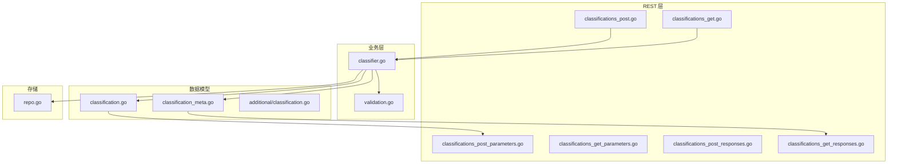
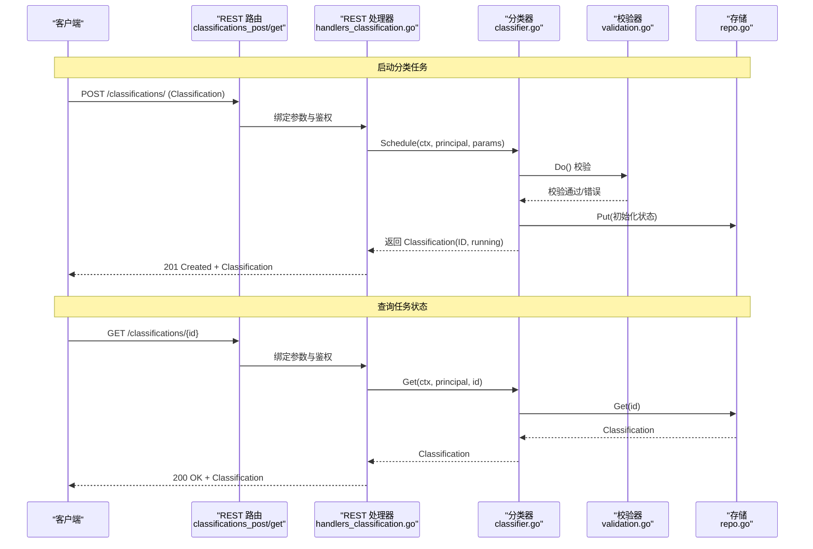
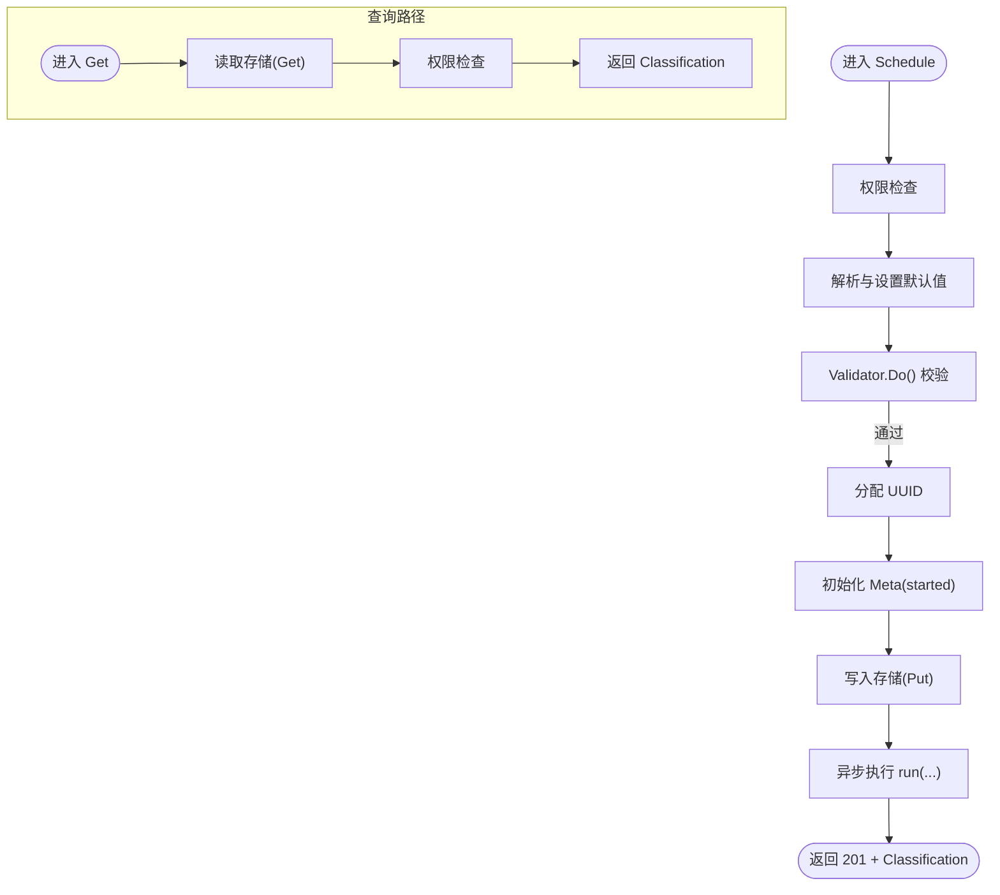
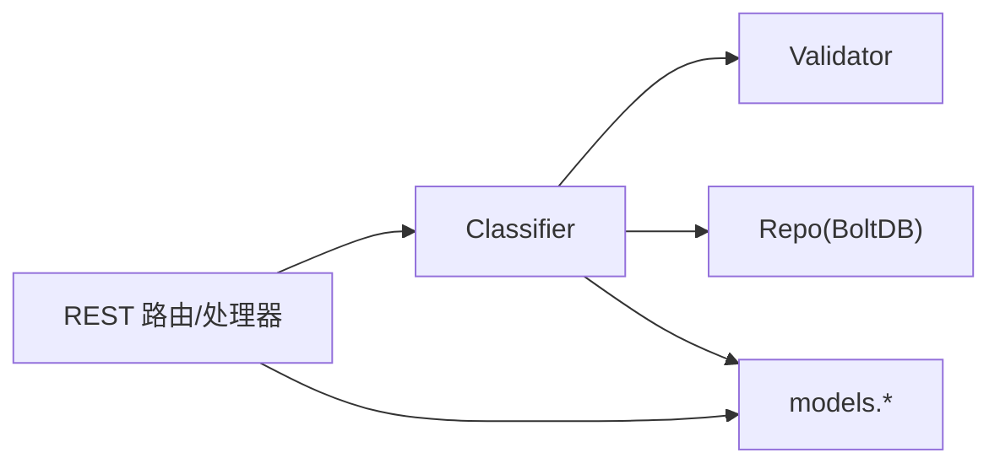

# 分类端点

<cite>
**本文引用的文件**
- [handlers_classification.go](file://adapters/handlers/rest/handlers_classification.go)
- [classifications_get.go](file://adapters/handlers/rest/operations/classifications/classifications_get.go)
- [classifications_post.go](file://adapters/handlers/rest/operations/classifications/classifications_post.go)
- [classifications_get_parameters.go](file://adapters/handlers/rest/operations/classifications/classifications_get_parameters.go)
- [classifications_post_parameters.go](file://adapters/handlers/rest/operations/classifications/classifications_post_parameters.go)
- [classifications_get_responses.go](file://adapters/handlers/rest/operations/classifications/classifications_get_responses.go)
- [classifications_post_responses.go](file://adapters/handlers/rest/operations/classifications/classifications_post_responses.go)
- [classifier.go](file://usecases/classification/classifier.go)
- [validation.go](file://usecases/classification/validation.go)
- [classification.go](file://entities/models/classification.go)
- [classification_meta.go](file://entities/models/classification_meta.go)
- [classification.go](file://entities/additional/classification.go)
- [repo.go](file://adapters/repos/classifications/repo.go)
- [schema.json](file://openapi-specs/schema.json)
</cite>

## 目录
1. [简介](#简介)
2. [项目结构](#项目结构)
3. [核心组件](#核心组件)
4. [架构总览](#架构总览)
5. [详细组件分析](#详细组件分析)
6. [依赖关系分析](#依赖关系分析)
7. [性能考虑](#性能考虑)
8. [故障排查指南](#故障排查指南)
9. [结论](#结论)
10. [附录：REST API 规范与示例](#附录rest-api-规范与示例)

## 简介
本文件面向 Weaviate 的“分类”REST API，系统性梳理两类端点：
- POST /classifications/：提交并启动一个分类任务，返回任务 ID 与初始状态
- GET /classifications/{id}：根据任务 ID 查询分类任务的进度与最终结果

Weaviate 支持多种分类算法类型（如 KNN 分类、上下文分类、零样本分类），并通过可插拔模块化能力扩展更多算法。分类任务是异步执行的，客户端通过轮询或订阅机制跟踪进度，并在完成后获取结果。

## 项目结构
围绕分类端点的关键目录与文件如下：
- REST 层：路由与处理器
  - adapters/handlers/rest/operations/classifications/*：Swagger 生成的参数与响应类型
  - adapters/handlers/rest/handlers_classification.go：REST 处理器绑定分类服务
- 业务层：分类器与校验
  - usecases/classification/classifier.go：分类器核心逻辑（调度、运行、状态）
  - usecases/classification/validation.go：分类配置与算法约束校验
- 数据模型：请求/响应与元信息
  - entities/models/classification*.go：分类请求体、过滤器、元信息等
  - entities/additional/classification.go：对象检索时附加的分类信息
- 存储：分类任务持久化
  - adapters/repos/classifications/repo.go：分类任务状态存储（BoltDB）

图表来源
- [classifications_post.go](file://adapters/handlers/rest/operations/classifications/classifications_post.go#L40-L84)
- [classifications_get.go](file://adapters/handlers/rest/operations/classifications/classifications_get.go#L40-L84)
- [handlers_classification.go](file://adapters/handlers/rest/handlers_classification.go#L28-L77)
- [classifier.go](file://usecases/classification/classifier.go#L151-L189)
- [validation.go](file://usecases/classification/validation.go#L42-L73)
- [classification.go](file://entities/models/classification.go#L29-L71)
- [classification_meta.go](file://entities/models/classification_meta.go#L28-L54)
- [repo.go](file://adapters/repos/classifications/repo.go#L31-L63)

章节来源
- [handlers_classification.go](file://adapters/handlers/rest/handlers_classification.go#L28-L77)
- [classifications_post.go](file://adapters/handlers/rest/operations/classifications/classifications_post.go#L40-L84)
- [classifications_get.go](file://adapters/handlers/rest/operations/classifications/classifications_get.go#L40-L84)
- [classifier.go](file://usecases/classification/classifier.go#L151-L189)
- [validation.go](file://usecases/classification/validation.go#L42-L73)
- [classification.go](file://entities/models/classification.go#L29-L71)
- [classification_meta.go](file://entities/models/classification_meta.go#L28-L54)
- [repo.go](file://adapters/repos/classifications/repo.go#L31-L63)

## 核心组件
- REST 路由与处理器
  - POST /classifications/：接收 Classification 请求体，校验后调度分类任务，返回 201 与 Classification 对象（含 ID、状态、元信息）
  - GET /classifications/{id}：按 ID 获取分类任务详情；若未找到返回 404
- 分类器（Classifier）
  - 解析与设置默认值（如算法类型、KNN 参数）
  - 校验过滤器（sourceWhere/trainingSetWhere/targetWhere）与属性类型
  - 分配唯一 ID，写入存储，异步执行分类
  - 提供 Get 接口用于查询任务状态与结果
- 校验器（Validator）
  - 校验类名存在、属性存在且类型匹配
  - 针对不同算法类型施加过滤器与属性约束
- 模型与响应
  - Classification：请求体与响应体的核心结构
  - ClassificationMeta：任务元信息（开始/完成时间、成功/失败计数）
  - additional.Classification：对象检索时附加的分类信息字段

章节来源
- [handlers_classification.go](file://adapters/handlers/rest/handlers_classification.go#L28-L77)
- [classifier.go](file://usecases/classification/classifier.go#L151-L189)
- [validation.go](file://usecases/classification/validation.go#L42-L73)
- [classification.go](file://entities/models/classification.go#L29-L71)
- [classification_meta.go](file://entities/models/classification_meta.go#L28-L54)
- [classification.go](file://entities/additional/classification.go#L16-L22)

## 架构总览
下图展示从 HTTP 请求到分类执行与状态查询的整体流程：

图表来源
- [classifications_post.go](file://adapters/handlers/rest/operations/classifications/classifications_post.go#L40-L84)
- [classifications_get.go](file://adapters/handlers/rest/operations/classifications/classifications_get.go#L40-L84)
- [handlers_classification.go](file://adapters/handlers/rest/handlers_classification.go#L28-L77)
- [classifier.go](file://usecases/classification/classifier.go#L151-L189)
- [validation.go](file://usecases/classification/validation.go#L42-L73)
- [repo.go](file://adapters/repos/classifications/repo.go#L31-L63)

## 详细组件分析

### REST 路由与参数
- POST /classifications/
  - 请求体：Classification（必填）
  - 成功响应：201 Created + Classification（包含 ID、状态、元信息）
  - 错误响应：400（参数/校验错误）、403（权限不足）、500（内部错误）
- GET /classifications/{id}
  - 路径参数：id（UUID）
  - 成功响应：200 OK + Classification
  - 错误响应：401（未认证）、403（权限不足）、404（任务不存在）、500（内部错误）

章节来源
- [classifications_post.go](file://adapters/handlers/rest/operations/classifications/classifications_post.go#L40-L84)
- [classifications_get.go](file://adapters/handlers/rest/operations/classifications/classifications_get.go#L40-L84)
- [classifications_post_parameters.go](file://adapters/handlers/rest/operations/classifications/classifications_post_parameters.go#L31-L53)
- [classifications_get_parameters.go](file://adapters/handlers/rest/operations/classifications/classifications_get_parameters.go#L27-L49)
- [classifications_post_responses.go](file://adapters/handlers/rest/operations/classifications/classifications_post_responses.go#L27-L70)
- [classifications_get_responses.go](file://adapters/handlers/rest/operations/classifications/classifications_get_responses.go#L27-L70)

### 分类器与生命周期
- 调度（Schedule）
  - 权限检查：UPDATE 元数据
  - 解析与设置默认值（算法类型、KNN 参数）
  - 校验（Validator.Do）
  - 分配 UUID，初始化状态为 running，写入存储
  - 异步执行 run（后台 goroutine）
- 查询（Get）
  - 读取存储中的 Classification
  - 权限检查：READ 元数据
  - 返回任务状态与结果（若已完成）

图表来源
- [classifier.go](file://usecases/classification/classifier.go#L151-L189)
- [validation.go](file://usecases/classification/validation.go#L42-L73)
- [repo.go](file://adapters/repos/classifications/repo.go#L31-L63)

章节来源
- [classifier.go](file://usecases/classification/classifier.go#L151-L189)
- [handlers_classification.go](file://adapters/handlers/rest/handlers_classification.go#L57-L76)

### 校验规则与算法约束
- 基本要求
  - class 必填，且存在于模式中
  - basedOnProperties 至少一项，当前仅支持单个文本属性
  - classifyProperties 至少一项，必须为引用类型
- 算法类型约束
  - KNN
    - 支持 sourceWhere 与 trainingSetWhere
    - 不允许设置 targetWhere
  - 上下文分类（text2vec-contextionary-contextual）
    - 不使用训练集，不允许设置 trainingSetWhere
    - 可用 targetWhere 限制候选目标集合
  - 零样本分类（zeroshot）
    - 使用模块化提供者解析设置
- 过滤器校验
  - 对 sourceWhere、trainingSetWhere、targetWhere 进行语法与语义校验（基于模式与权限）

章节来源
- [validation.go](file://usecases/classification/validation.go#L53-L172)
- [classifier.go](file://usecases/classification/classifier.go#L224-L244)

### 数据模型与字段说明
- Classification
  - 关键字段：class、type、basedOnProperties、classifyProperties、filters、settings、status、meta、id、error
  - 状态枚举：running、completed、failed
- ClassificationFilters
  - 字段：sourceWhere、trainingSetWhere、targetWhere
  - 用途：限定待分类对象、训练集、候选目标
- ClassificationMeta
  - 字段：started、completed、count、countFailed、countSucceeded
- additional.Classification
  - 对象检索时附加的分类信息字段（如 basedOn、classifiedFields、scope 等）

章节来源
- [classification.go](file://entities/models/classification.go#L29-L71)
- [classification.go](file://entities/models/classification.go#L262-L275)
- [classification_meta.go](file://entities/models/classification_meta.go#L28-L54)
- [classification.go](file://entities/additional/classification.go#L16-L22)

### 存储与持久化
- 使用 BoltDB 将分类任务状态持久化
- 提供 Put/Get 接口，保存 Classification 结构
- 存储路径：baseDir/classifications.db

章节来源
- [repo.go](file://adapters/repos/classifications/repo.go#L31-L63)

## 依赖关系分析
- REST 层依赖业务层（Classifier）
- Classifier 依赖校验器（Validator）、存储（Repo）、模块提供者（ModulesProvider）
- 模型（models.*）被 REST、业务层与存储共同使用
- 过滤器解析依赖 filterext 与 schema 校验

图表来源
- [handlers_classification.go](file://adapters/handlers/rest/handlers_classification.go#L28-L77)
- [classifier.go](file://usecases/classification/classifier.go#L59-L89)
- [validation.go](file://usecases/classification/validation.go#L28-L40)
- [repo.go](file://adapters/repos/classifications/repo.go#L31-L63)
- [classification.go](file://entities/models/classification.go#L29-L71)

章节来源
- [handlers_classification.go](file://adapters/handlers/rest/handlers_classification.go#L28-L77)
- [classifier.go](file://usecases/classification/classifier.go#L59-L89)
- [validation.go](file://usecases/classification/validation.go#L28-L40)
- [repo.go](file://adapters/repos/classifications/repo.go#L31-L63)
- [classification.go](file://entities/models/classification.go#L29-L71)

## 性能考虑
- 异步执行：分类任务在后台 goroutine 中运行，避免阻塞请求线程
- 过滤器限制：通过 filters 限制搜索范围（sourceWhere/trainingSetWhere/targetWhere），减少计算量
- KNN 参数：合理设置 k 值，过大增加计算与内存开销，过小可能不稳定
- 模块化算法：选择适合的算法与向量化模块，平衡准确率与延迟
- 并发与资源：结合集群与分片策略，确保向量检索与聚合操作的吞吐

## 故障排查指南
- 400 错误（参数/校验失败）
  - 检查 class 是否存在、属性是否正确、算法类型与过滤器组合是否符合约束
- 403 错误（权限不足）
  - 确认用户对目标类具有 UPDATE（启动）或 READ（查询）权限
- 404 错误（任务不存在）
  - 确认传入的 id 是否正确，或任务是否已过期清理
- 任务卡在 running
  - 检查 filters 是否过于严格导致无候选对象
  - 查看日志定位具体模块执行问题
- 结果异常
  - 对于 KNN，确认 trainingSetWhere 是否覆盖足够类别
  - 对于上下文/零样本，确认 targetWhere 与模块配置是否正确

章节来源
- [handlers_classification.go](file://adapters/handlers/rest/handlers_classification.go#L33-L54)
- [validation.go](file://usecases/classification/validation.go#L53-L172)
- [classifier.go](file://usecases/classification/classifier.go#L224-L244)

## 结论
Weaviate 的分类 REST API 提供了统一的任务式接口，支持多种算法与灵活的过滤控制。通过严格的参数校验与异步执行机制，既能满足生产环境的稳定性需求，又便于扩展新的分类算法。建议在实际部署中结合业务场景合理设置过滤器与参数，并建立完善的监控与告警体系。

## 附录：REST API 规范与示例

### 端点一览
- POST /classifications/
  - 请求体：Classification
  - 成功：201 Created + Classification
  - 错误：400、403、500
- GET /classifications/{id}
  - 路径参数：id（UUID）
  - 成功：200 OK + Classification
  - 错误：401、403、404、500

章节来源
- [classifications_post.go](file://adapters/handlers/rest/operations/classifications/classifications_post.go#L40-L84)
- [classifications_get.go](file://adapters/handlers/rest/operations/classifications/classifications_get.go#L40-L84)
- [classifications_post_responses.go](file://adapters/handlers/rest/operations/classifications/classifications_post_responses.go#L27-L70)
- [classifications_get_responses.go](file://adapters/handlers/rest/operations/classifications/classifications_get_responses.go#L27-L70)

### 请求/响应字段说明
- Classification
  - class：要分类的目标类名
  - type：算法类型（默认 knn；可选 text2vec-contextionary-contextual 或 zeroshot）
  - basedOnProperties：用于分类的文本属性列表（当前仅支持单个）
  - classifyProperties：要设置的引用属性列表
  - filters：过滤器对象（sourceWhere、trainingSetWhere、targetWhere）
  - settings：算法特定设置（如 KNN 的 k）
  - status：任务状态（running/completed/failed）
  - meta：任务元信息（started/completed/count 等）
  - id：任务唯一标识
  - error：失败时的错误信息
- ClassificationMeta
  - started/completed：任务起止时间
  - count/countFailed/countSucceeded：统计计数

章节来源
- [classification.go](file://entities/models/classification.go#L29-L71)
- [classification_meta.go](file://entities/models/classification_meta.go#L28-L54)
- [schema.json](file://openapi-specs/schema.json#L3045-L3078)

### 算法与配置要点
- KNN
  - 适用：需要显式训练集的场景
  - 关键：trainingSetWhere 限制训练集；k 为邻域大小
- 上下文分类（text2vec-contextionary-contextual）
  - 适用：无需显式训练集，直接基于上下文相似度
  - 关键：targetWhere 限制候选目标；classifyProperties 仅支持单一目标类
- 零样本分类（zeroshot）
  - 适用：无需显式训练集，依赖模块化向量化
  - 关键：由模块提供者解析 settings

章节来源
- [validation.go](file://usecases/classification/validation.go#L75-L93)
- [validation.go](file://usecases/classification/validation.go#L184-L198)
- [classifier.go](file://usecases/classification/classifier.go#L288-L335)
- [schema.json](file://openapi-specs/schema.json#L3045-L3078)

### 生命周期与取消
- 生命周期
  - 启动：POST /classifications/ 返回 running
  - 进行中：GET /classifications/{id} 返回 running，可多次轮询
  - 完成：GET 返回 completed，携带 meta 与结果
  - 失败：GET 返回 failed，携带 error
- 取消机制
  - 当前实现未提供显式的取消端点；可通过外部调度在应用层控制任务生命周期

章节来源
- [handlers_classification.go](file://adapters/handlers/rest/handlers_classification.go#L57-L76)
- [classifier.go](file://usecases/classification/classifier.go#L151-L189)
- [classification.go](file://entities/models/classification.go#L64-L71)

### 示例（请求/响应路径）
- 启动 KNN 分类
  - 请求：POST /classifications/（body：Classification，type=knn，basedOnProperties=["description"]，classifyProperties=["inCountry"]，filters.trainingSetWhere=...）
  - 响应：201 + Classification（status=running，id=...）
- 查询任务
  - 请求：GET /classifications/{id}
  - 响应：200 + Classification（可能为 running 或 completed，completed 时包含 meta 与统计）
- 失败场景
  - 请求：POST /classifications/（参数不合法）
  - 响应：400 + ErrorResponse

章节来源
- [classifications_post.go](file://adapters/handlers/rest/operations/classifications/classifications_post.go#L40-L84)
- [classifications_get.go](file://adapters/handlers/rest/operations/classifications/classifications_get.go#L40-L84)
- [classifications_post_responses.go](file://adapters/handlers/rest/operations/classifications/classifications_post_responses.go#L72-L115)
- [classifications_get_responses.go](file://adapters/handlers/rest/operations/classifications/classifications_get_responses.go#L72-L140)