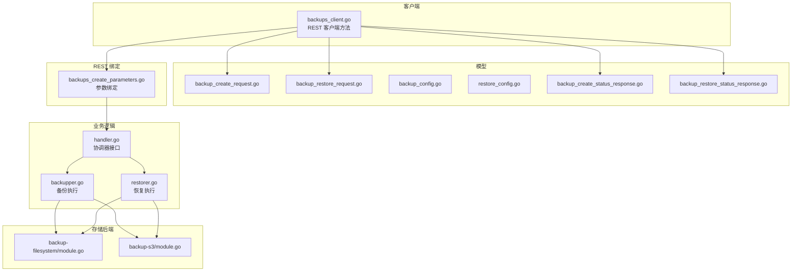
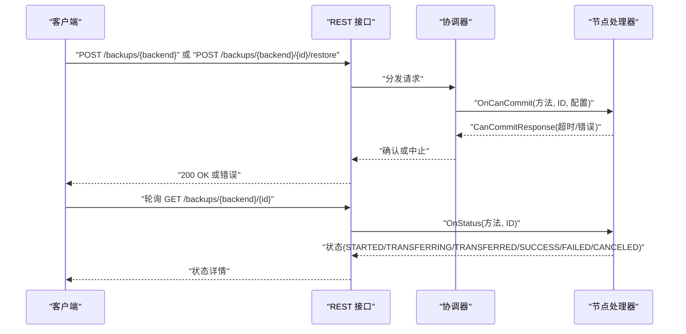
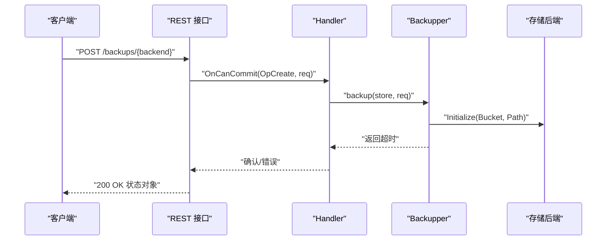
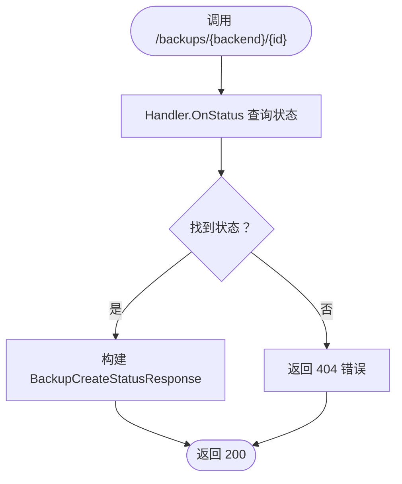
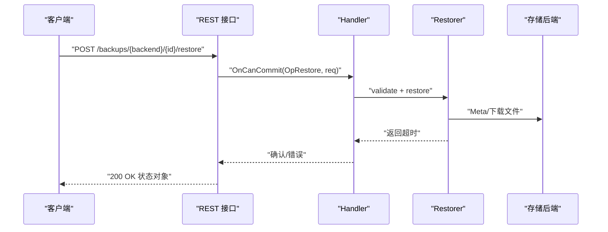
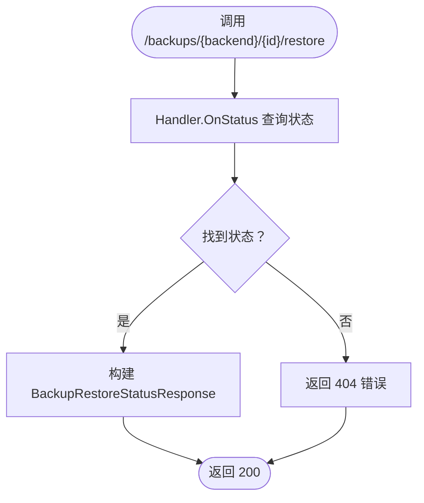
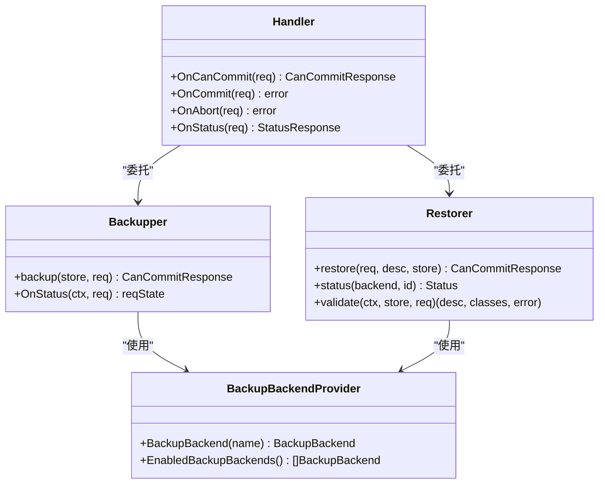

# 备份恢复端点

<cite>
**本文引用的文件**
- [client/backups/backups_client.go](file://client/backups/backups_client.go)
- [client/backups/backups_create_parameters.go](file://adapters/handlers/rest/operations/backups/backups_create_parameters.go)
- [client/backups/backups_create_status_responses.go](file://client/backups/backups_create_status_responses.go)
- [client/backups/backups_restore_status_responses.go](file://client/backups/backups_restore_status_responses.go)
- [entities/models/backup_create_request.go](file://entities/models/backup_create_request.go)
- [entities/models/backup_restore_request.go](file://entities/models/backup_restore_request.go)
- [entities/models/backup_config.go](file://entities/models/backup_config.go)
- [entities/models/restore_config.go](file://entities/models/restore_config.go)
- [entities/models/backup_create_status_response.go](file://entities/models/backup_create_status_response.go)
- [entities/models/backup_restore_status_response.go](file://entities/models/backup_restore_status_response.go)
- [usecases/backup/handler.go](file://usecases/backup/handler.go)
- [usecases/backup/backupper.go](file://usecases/backup/backupper.go)
- [usecases/backup/restorer.go](file://usecases/backup/restorer.go)
- [modules/backup-filesystem/module.go](file://modules/backup-filesystem/module.go)
- [modules/backup-s3/module.go](file://modules/backup-s3/module.go)
</cite>

## 目录
1. [简介](#简介)
2. [项目结构](#项目结构)
3. [核心组件](#核心组件)
4. [架构总览](#架构总览)
5. [详细组件分析](#详细组件分析)
6. [依赖关系分析](#依赖关系分析)
7. [性能考量](#性能考量)
8. [故障排查指南](#故障排查指南)
9. [结论](#结论)
10. [附录：REST API 定义与示例](#附录rest-api-定义与示例)

## 简介
本文件系统性梳理 Weaviate 备份与恢复 REST API 的端点、数据模型、异步执行机制、进度跟踪、存储后端集成与传输参数，并提供最佳实践与故障处理建议。读者可据此完成备份创建、状态查询、列表获取、取消操作、恢复启动、恢复状态查询与恢复取消等完整流程。

## 项目结构
围绕备份恢复功能，关键模块分布如下：
- 客户端封装：REST 客户端方法与响应类型（client/backups）
- 请求/响应模型：备份创建、恢复、状态等模型（entities/models）
- REST 参数绑定：路径与请求体参数解析（adapters/handlers/rest/operations/backups）
- 业务处理器：备份/恢复的协调、状态管理与执行（usecases/backup）
- 存储后端：文件系统与 S3 后端模块（modules/backup-*）

图表来源
- [client/backups/backups_client.go](file://client/backups/backups_client.go#L1-L352)
- [adapters/handlers/rest/operations/backups/backups_create_parameters.go](file://adapters/handlers/rest/operations/backups/backups_create_parameters.go#L1-L121)
- [entities/models/backup_create_request.go](file://entities/models/backup_create_request.go#L1-L125)
- [entities/models/backup_restore_request.go](file://entities/models/backup_restore_request.go#L1-L128)
- [entities/models/backup_config.go](file://entities/models/backup_config.go#L1-L169)
- [entities/models/restore_config.go](file://entities/models/restore_config.go#L1-L201)
- [entities/models/backup_create_status_response.go](file://entities/models/backup_create_status_response.go#L1-L184)
- [entities/models/backup_restore_status_response.go](file://entities/models/backup_restore_status_response.go#L1-L141)
- [usecases/backup/handler.go](file://usecases/backup/handler.go#L1-L309)
- [usecases/backup/backupper.go](file://usecases/backup/backupper.go#L1-L152)
- [usecases/backup/restorer.go](file://usecases/backup/restorer.go#L1-L348)
- [modules/backup-filesystem/module.go](file://modules/backup-filesystem/module.go#L1-L134)
- [modules/backup-s3/module.go](file://modules/backup-s3/module.go#L1-L108)

章节来源
- [client/backups/backups_client.go](file://client/backups/backups_client.go#L1-L352)
- [adapters/handlers/rest/operations/backups/backups_create_parameters.go](file://adapters/handlers/rest/operations/backups/backups_create_parameters.go#L1-L121)

## 核心组件
- 备份创建端点：POST /backups/{backend}
- 备份状态查询端点：GET /backups/{backend}/{id}
- 备份列表端点：GET /backups/{backend}
- 备份取消端点：DELETE /backups/{backend}/{id}
- 恢复启动端点：POST /backups/{backend}/{id}/restore
- 恢复状态查询端点：GET /backups/{backend}/{id}/restore
- 恢复取消端点：DELETE /backups/{backend}/{id}/restore

上述端点均通过 HTTPS 提供服务，支持 JSON/YAML 响应格式；客户端库提供了对应的方法封装与响应类型。

章节来源
- [client/backups/backups_client.go](file://client/backups/backups_client.go#L66-L346)

## 架构总览
备份/恢复采用“协调器-节点”两阶段提交模式：
- 第一阶段（CanCommit）：各节点验证请求合法性、初始化上传/下载通道，返回超时时间
- 第二阶段（Commit）：协调器确认后，节点开始实际备份/恢复工作
- 进度与状态：节点在内存中维护当前操作状态，可通过状态端点查询

图表来源
- [usecases/backup/handler.go](file://usecases/backup/handler.go#L150-L264)
- [usecases/backup/backupper.go](file://usecases/backup/backupper.go#L84-L151)
- [usecases/backup/restorer.go](file://usecases/backup/restorer.go#L65-L145)

## 详细组件分析

### 备份创建端点
- 方法与路径：POST /backups/{backend}
- 请求体：BackupCreateRequest
  - id：备份标识（URL 安全，仅允许小写字母、数字、下划线、连字符）
  - include/exclude：指定包含/排除的集合（二者互斥）
  - config：BackupConfig（压缩级别、CPU 百分比、桶/路径等）
- 响应：200 OK 返回状态对象（包含 backend、startedAt、status 等），或 500 内部错误

图表来源
- [client/backups/backups_client.go](file://client/backups/backups_client.go#L107-L141)
- [adapters/handlers/rest/operations/backups/backups_create_parameters.go](file://adapters/handlers/rest/operations/backups/backups_create_parameters.go#L44-L59)
- [usecases/backup/handler.go](file://usecases/backup/handler.go#L150-L207)
- [usecases/backup/backupper.go](file://usecases/backup/backupper.go#L84-L151)

章节来源
- [client/backups/backups_client.go](file://client/backups/backups_client.go#L102-L141)
- [adapters/handlers/rest/operations/backups/backups_create_parameters.go](file://adapters/handlers/rest/operations/backups/backups_create_parameters.go#L44-L59)
- [entities/models/backup_create_request.go](file://entities/models/backup_create_request.go#L27-L43)
- [entities/models/backup_config.go](file://entities/models/backup_config.go#L29-L54)

### 备份状态查询端点
- 方法与路径：GET /backups/{backend}/{id}
- 响应：BackupCreateStatusResponse
  - status：STARTED、TRANSFERRING、TRANSFERRED、SUCCESS、FAILED、CANCELED
  - startedAt/completedAt：时间戳
  - error：失败原因
  - size/path/backend/id：备份元信息

图表来源
- [client/backups/backups_client.go](file://client/backups/backups_client.go#L148-L182)
- [usecases/backup/handler.go](file://usecases/backup/handler.go#L234-L264)
- [entities/models/backup_create_status_response.go](file://entities/models/backup_create_status_response.go#L29-L60)

章节来源
- [client/backups/backups_client.go](file://client/backups/backups_client.go#L143-L182)
- [entities/models/backup_create_status_response.go](file://entities/models/backup_create_status_response.go#L29-L60)

### 备份列表端点
- 方法与路径：GET /backups/{backend}
- 响应：数组项为 BackupListResponseItems0（包含 id/status 等）
- 实现：后端模块 AllBackups 列举本地或远端备份目录中的全局元数据文件

章节来源
- [client/backups/backups_client.go](file://client/backups/backups_client.go#L189-L223)
- [modules/backup-filesystem/module.go](file://modules/backup-filesystem/module.go#L83-L116)

### 备份取消端点
- 方法与路径：DELETE /backups/{backend}/{id}
- 行为：取消进行中的备份任务（由 Handler/Backupper 协调）

章节来源
- [client/backups/backups_client.go](file://client/backups/backups_client.go#L66-L100)
- [usecases/backup/handler.go](file://usecases/backup/handler.go#L221-L232)

### 恢复启动端点
- 方法与路径：POST /backups/{backend}/{id}/restore
- 请求体：BackupRestoreRequest
  - include/exclude：目标集合过滤
  - node_mapping：节点名映射（跨环境恢复）
  - overwriteAlias：冲突时覆盖别名
  - config：RestoreConfig（桶/路径、CPU 百分比、用户/角色恢复选项）
- 响应：200 OK 返回状态对象（包含 backend、status 等）

图表来源
- [client/backups/backups_client.go](file://client/backups/backups_client.go#L230-L264)
- [usecases/backup/handler.go](file://usecases/backup/handler.go#L150-L207)
- [usecases/backup/restorer.go](file://usecases/backup/restorer.go#L65-L145)

章节来源
- [client/backups/backups_client.go](file://client/backups/backups_client.go#L225-L264)
- [entities/models/backup_restore_request.go](file://entities/models/backup_restore_request.go#L27-L46)
- [entities/models/restore_config.go](file://entities/models/restore_config.go#L29-L55)

### 恢复状态查询端点
- 方法与路径：GET /backups/{backend}/{id}/restore
- 响应：BackupRestoreStatusResponse
  - status：STARTED、TRANSFERRING、TRANSFERRED、SUCCESS、FAILED、CANCELED
  - error：失败原因
  - backend/id/path：备份元信息

图表来源
- [client/backups/backups_client.go](file://client/backups/backups_client.go#L312-L346)
- [usecases/backup/handler.go](file://usecases/backup/handler.go#L234-L264)
- [entities/models/backup_restore_status_response.go](file://entities/models/backup_restore_status_response.go#L29-L49)

章节来源
- [client/backups/backups_client.go](file://client/backups/backups_client.go#L308-L346)
- [entities/models/backup_restore_status_response.go](file://entities/models/backup_restore_status_response.go#L29-L49)

### 恢复取消端点
- 方法与路径：DELETE /backups/{backend}/{id}/restore
- 行为：取消进行中的恢复任务（由 Handler/Restorer 协调）

章节来源
- [client/backups/backups_client.go](file://client/backups/backups_client.go#L271-L305)
- [usecases/backup/handler.go](file://usecases/backup/handler.go#L221-L232)

### 数据模型与配置

#### 备份创建请求模型 BackupCreateRequest
- 字段
  - id：备份标识（必填）
  - include/exclude：集合选择（二者互斥）
  - config：BackupConfig（压缩级别、CPU 百分比、桶/路径等）

章节来源
- [entities/models/backup_create_request.go](file://entities/models/backup_create_request.go#L27-L43)
- [entities/models/backup_config.go](file://entities/models/backup_config.go#L29-L54)

#### 备份恢复请求模型 BackupRestoreRequest
- 字段
  - include/exclude：集合选择
  - node_mapping：节点名映射
  - overwriteAlias：是否覆盖别名
  - config：RestoreConfig（桶/路径、CPU 百分比、用户/角色恢复选项）

章节来源
- [entities/models/backup_restore_request.go](file://entities/models/backup_restore_request.go#L27-L46)
- [entities/models/restore_config.go](file://entities/models/restore_config.go#L29-L55)

#### 状态响应模型
- BackupCreateStatusResponse：包含 backend、startedAt、completedAt、status、error、size、path、id
- BackupRestoreStatusResponse：包含 backend、error、id、path、status

章节来源
- [entities/models/backup_create_status_response.go](file://entities/models/backup_create_status_response.go#L29-L60)
- [entities/models/backup_restore_status_response.go](file://entities/models/backup_restore_status_response.go#L29-L49)

## 依赖关系分析
- Handler 作为协调器入口，委托 backupper 与 restorer 执行具体操作
- backupper/restore 在第一阶段返回超时，第二阶段由协调器确认后执行
- 存储后端通过 BackupBackendProvider 注入，支持文件系统与 S3 等

图表来源
- [usecases/backup/handler.go](file://usecases/backup/handler.go#L74-L109)
- [usecases/backup/backupper.go](file://usecases/backup/backupper.go#L28-L52)
- [usecases/backup/restorer.go](file://usecases/backup/restorer.go#L34-L53)

章节来源
- [usecases/backup/handler.go](file://usecases/backup/handler.go#L45-L109)
- [usecases/backup/backupper.go](file://usecases/backup/backupper.go#L28-L52)
- [usecases/backup/restorer.go](file://usecases/backup/restorer.go#L34-L53)

## 性能考量
- 压缩与 CPU 利用
  - 备份/恢复均支持压缩级别与 CPU 百分比配置，用于平衡吞吐与资源占用
  - 建议根据网络带宽与集群负载调整 CPU 百分比，避免过度竞争导致延迟上升
- 并发与分片
  - 节点内部通过同步通道协调分片操作，确保一致性与顺序性
- 传输优化
  - 使用 HTTPS 保障传输安全
  - 对于大备份，建议优先使用 S3 等云存储以获得更好的网络与可靠性

章节来源
- [entities/models/backup_config.go](file://entities/models/backup_config.go#L37-L54)
- [entities/models/restore_config.go](file://entities/models/restore_config.go#L37-L55)
- [usecases/backup/backupper.go](file://usecases/backup/backupper.go#L115-L147)
- [usecases/backup/restorer.go](file://usecases/backup/restorer.go#L229-L246)

## 故障排查指南
- 常见错误与状态
  - FAILED：表示备份/恢复过程中出现错误，需查看 error 字段定位问题
  - CANCELED：表示被取消，通常由客户端主动取消或检测到上下文取消
  - 404：状态查询找不到对应备份/恢复任务
- 常见原因
  - 身份认证/授权失败
  - 后端模块未启用或配置不正确
  - 目标集合已存在（恢复场景）
  - 节点数量或节点名不匹配（跨集群恢复）
  - 网络异常或存储不可达
- 建议步骤
  - 先检查状态端点，确认当前阶段与错误信息
  - 若处于 TRANSFERRING/TRANSFERRED，可等待完成或尝试取消后重试
  - 如需跨环境恢复，确保 node_mapping 与 overwriteAlias 正确设置
  - 检查后端模块（文件系统/S3）配置与权限

章节来源
- [client/backups/backups_create_status_responses.go](file://client/backups/backups_create_status_responses.go#L88-L120)
- [client/backups/backups_restore_status_responses.go](file://client/backups/backups_restore_status_responses.go#L312-L349)
- [usecases/backup/restorer.go](file://usecases/backup/restorer.go#L248-L263)

## 结论
Weaviate 的备份/恢复 REST API 通过清晰的端点划分与两阶段提交机制，实现了对备份创建、状态查询、列表获取、取消以及恢复启动、状态查询与取消的完整覆盖。结合多后端支持与可调的传输参数，可在不同环境中实现高效、可靠的备份与恢复。建议在生产环境中配合自动化脚本与监控告警，确保备份策略的可审计与可回溯。

## 附录：REST API 定义与示例

### 端点一览
- 创建备份
  - 方法：POST
  - 路径：/backups/{backend}
  - 请求体：BackupCreateRequest
  - 成功：200 OK，响应体：BackupCreateStatusResponse
  - 失败：500 内部错误，响应体：ErrorResponse
- 备份状态查询
  - 方法：GET
  - 路径：/backups/{backend}/{id}
  - 成功：200 OK，响应体：BackupCreateStatusResponse
  - 失败：404 未找到
- 备份列表
  - 方法：GET
  - 路径：/backups/{backend}
  - 成功：200 OK，响应体：数组（每项包含 id/status）
- 备份取消
  - 方法：DELETE
  - 路径：/backups/{backend}/{id}
  - 成功：204 No Content
- 启动恢复
  - 方法：POST
  - 路径：/backups/{backend}/{id}/restore
  - 请求体：BackupRestoreRequest
  - 成功：200 OK，响应体：BackupRestoreStatusResponse
- 恢复状态查询
  - 方法：GET
  - 路径：/backups/{backend}/{id}/restore
  - 成功：200 OK，响应体：BackupRestoreStatusResponse
  - 失败：404 未找到
- 恢复取消
  - 方法：DELETE
  - 路径：/backups/{backend}/{id}/restore
  - 成功：204 No Content

章节来源
- [client/backups/backups_client.go](file://client/backups/backups_client.go#L66-L346)
- [client/backups/backups_create_status_responses.go](file://client/backups/backups_create_status_responses.go#L88-L120)
- [client/backups/backups_restore_status_responses.go](file://client/backups/backups_restore_status_responses.go#L312-L349)

### 请求/响应字段说明（节选）
- BackupCreateRequest
  - id：备份标识（必填）
  - include/exclude：集合选择（二者互斥）
  - config：BackupConfig（压缩级别、CPU 百分比、桶/路径）
- BackupRestoreRequest
  - include/exclude：集合选择
  - node_mapping：节点名映射
  - overwriteAlias：是否覆盖别名
  - config：RestoreConfig（桶/路径、CPU 百分比、用户/角色恢复选项）
- BackupCreateStatusResponse
  - status：STARTED/TRANSFERRING/TRANSFERRED/SUCCESS/FAILED/CANCELED
  - startedAt/completedAt：时间戳
  - error：错误信息
  - size/path/backend/id：备份元信息
- BackupRestoreStatusResponse
  - status：STARTED/TRANSFERRING/TRANSFERRED/SUCCESS/FAILED/CANCELED
  - error：错误信息
  - backend/id/path：备份元信息

章节来源
- [entities/models/backup_create_request.go](file://entities/models/backup_create_request.go#L27-L43)
- [entities/models/backup_restore_request.go](file://entities/models/backup_restore_request.go#L27-L46)
- [entities/models/backup_create_status_response.go](file://entities/models/backup_create_status_response.go#L29-L60)
- [entities/models/backup_restore_status_response.go](file://entities/models/backup_restore_status_response.go#L29-L49)

### 存储后端集成
- 文件系统后端
  - 模块：backup-filesystem
  - 特点：本地文件系统，适合单机或共享存储
  - 关键能力：列出所有备份、生成 HomeDir、提供元信息
- S3 后端
  - 模块：backup-s3
  - 特点：云存储，支持自定义 Endpoint/Bucket/Path/SSL
  - 关键能力：初始化客户端、提供元信息

章节来源
- [modules/backup-filesystem/module.go](file://modules/backup-filesystem/module.go#L30-L122)
- [modules/backup-s3/module.go](file://modules/backup-s3/module.go#L25-L100)