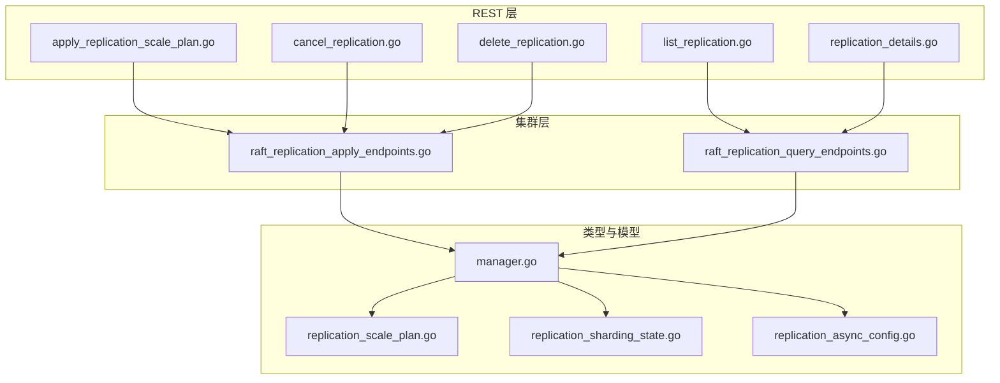
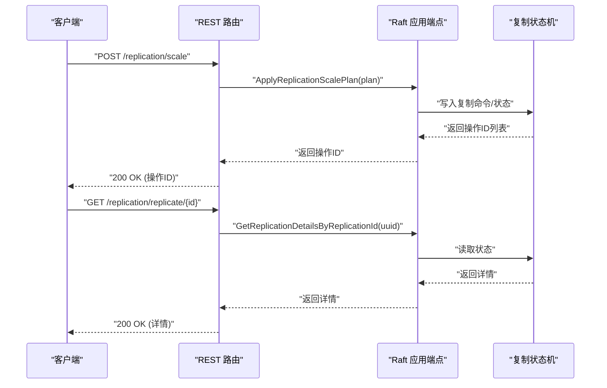
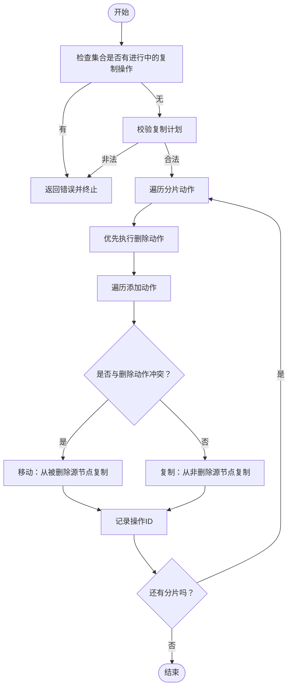
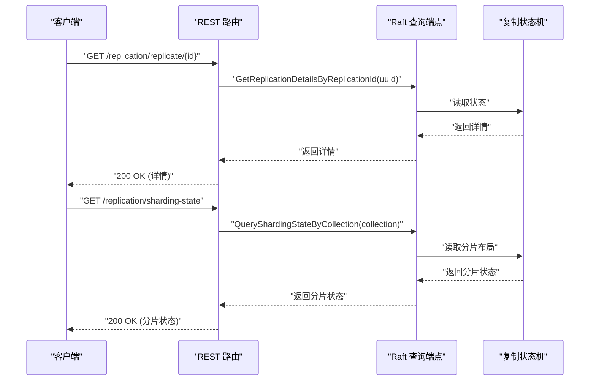
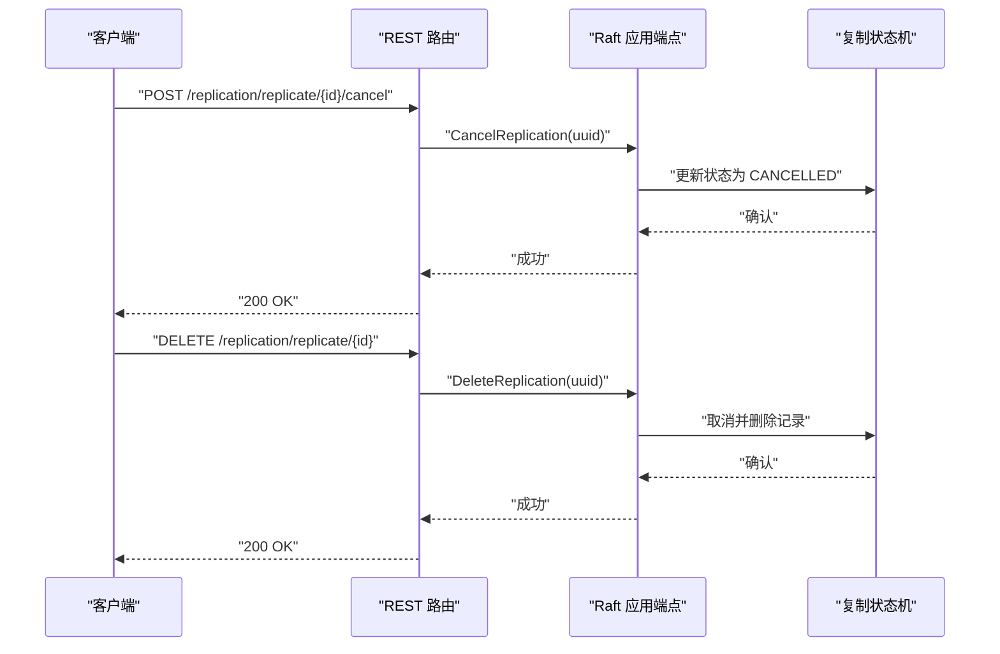
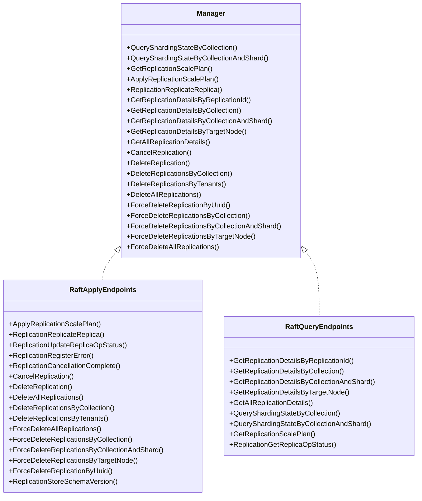

# 复制管理端点

<cite>
**本文引用的文件**
- [raft_replication_apply_endpoints.go](file://cluster/raft_replication_apply_endpoints.go)
- [raft_replication_query_endpoints.go](file://cluster/raft_replication_query_endpoints.go)
- [manager.go](file://cluster/replication/types/manager.go)
- [apply_replication_scale_plan.go](file://adapters/handlers/rest/operations/replication/apply_replication_scale_plan.go)
- [cancel_replication.go](file://adapters/handlers/rest/operations/replication/cancel_replication.go)
- [delete_replication.go](file://adapters/handlers/rest/operations/replication/delete_replication.go)
- [list_replication.go](file://adapters/handlers/rest/operations/replication/list_replication.go)
- [replication_details.go](file://adapters/handlers/rest/operations/replication/replication_details.go)
- [replication_scale_plan.go](file://entities/models/replication_scale_plan.go)
- [replication_sharding_state.go](file://entities/models/replication_sharding_state.go)
- [replication_async_config.go](file://entities/models/replication_async_config.go)
- [replication.go](file://adapters/clients/replication.go)
- [replica_replication/fast/not_implemented_test.go](file://test/acceptance/replication/replica_replication/fast/not_implemented_test.go)
</cite>

## 目录
1. [简介](#简介)
2. [项目结构](#项目结构)
3. [核心组件](#核心组件)
4. [架构总览](#架构总览)
5. [详细组件分析](#详细组件分析)
6. [依赖关系分析](#依赖关系分析)
7. [性能考量](#性能考量)
8. [故障排除指南](#故障排除指南)
9. [结论](#结论)
10. [附录：REST API 定义与示例](#附录rest-api-定义与示例)

## 简介
本文件系统性梳理 Weaviate 的复制管理 REST API 端点，覆盖复制计划生成与应用、复制状态查询、复制详情获取、复制取消与删除等全生命周期管理能力。文档同时解释复制配置（异步复制参数）、副本管理策略、状态监控与故障恢复机制，并给出复制拓扑管理、动态扩缩容与负载均衡的实践建议。

## 项目结构
围绕复制管理的关键代码分布在以下模块：
- REST 层：定义并分发复制相关的 HTTP 路由与处理器
- 集群层：通过 Raft 执行复制操作的申请与查询
- 类型与接口：统一的复制管理器接口与状态模型
- 客户端与测试：OpenAPI 生成的客户端与行为验证

图表来源
- [apply_replication_scale_plan.go](file://adapters/handlers/rest/operations/replication/apply_replication_scale_plan.go#L45-L51)
- [cancel_replication.go](file://adapters/handlers/rest/operations/replication/cancel_replication.go#L45-L51)
- [delete_replication.go](file://adapters/handlers/rest/operations/replication/delete_replication.go#L45-L51)
- [list_replication.go](file://adapters/handlers/rest/operations/replication/list_replication.go#L45-L51)
- [replication_details.go](file://adapters/handlers/rest/operations/replication/replication_details.go#L45-L51)
- [raft_replication_apply_endpoints.go](file://cluster/raft_replication_apply_endpoints.go#L29-L121)
- [raft_replication_query_endpoints.go](file://cluster/raft_replication_query_endpoints.go#L26-L175)
- [manager.go](file://cluster/replication/types/manager.go#L21-L165)
- [replication_scale_plan.go](file://entities/models/replication_scale_plan.go#L28-L45)
- [replication_sharding_state.go](file://entities/models/replication_sharding_state.go#L28-L38)
- [replication_async_config.go](file://entities/models/replication_async_config.go#L26-L72)

章节来源
- [apply_replication_scale_plan.go](file://adapters/handlers/rest/operations/replication/apply_replication_scale_plan.go#L45-L51)
- [raft_replication_apply_endpoints.go](file://cluster/raft_replication_apply_endpoints.go#L29-L121)
- [raft_replication_query_endpoints.go](file://cluster/raft_replication_query_endpoints.go#L26-L175)
- [manager.go](file://cluster/replication/types/manager.go#L21-L165)
- [replication_scale_plan.go](file://entities/models/replication_scale_plan.go#L28-L45)
- [replication_sharding_state.go](file://entities/models/replication_sharding_state.go#L28-L38)
- [replication_async_config.go](file://entities/models/replication_async_config.go#L26-L72)

## 核心组件
- 复制管理器接口：统一暴露复制计划生成、应用、状态查询、取消、删除与强制删除等能力
- 申请端点（Raft）：负责执行复制操作、更新状态、注册错误、取消完成标记、删除操作等
- 查询端点（Raft）：提供按 ID、集合、分片、目标节点、全部等维度的复制详情与分片状态查询
- 模型与配置：复制计划、分片状态、异步复制配置等数据结构

章节来源
- [manager.go](file://cluster/replication/types/manager.go#L21-L165)
- [raft_replication_apply_endpoints.go](file://cluster/raft_replication_apply_endpoints.go#L29-L121)
- [raft_replication_query_endpoints.go](file://cluster/raft_replication_query_endpoints.go#L26-L175)
- [replication_scale_plan.go](file://entities/models/replication_scale_plan.go#L28-L45)
- [replication_sharding_state.go](file://entities/models/replication_sharding_state.go#L28-L38)
- [replication_async_config.go](file://entities/models/replication_async_config.go#L26-L72)

## 架构总览
复制管理端点在 REST 层接收请求后，委托到集群层的 Raft 实现，最终通过 FSM（有限状态机）跟踪复制操作的状态流转。查询端点直接从 FSM 读取当前状态；申请端点将命令写入 Raft 日志并触发状态变更。

图表来源
- [apply_replication_scale_plan.go](file://adapters/handlers/rest/operations/replication/apply_replication_scale_plan.go#L45-L51)
- [replication_details.go](file://adapters/handlers/rest/operations/replication/replication_details.go#L45-L51)
- [raft_replication_apply_endpoints.go](file://cluster/raft_replication_apply_endpoints.go#L29-L121)
- [raft_replication_query_endpoints.go](file://cluster/raft_replication_query_endpoints.go#L26-L56)

## 详细组件分析

### 复制计划生成与应用
- 功能要点
  - 生成复制扩缩容计划：按集合与目标复制因子生成每个分片的添加/移除节点清单
  - 应用复制计划：对每个分片执行“移动”或“复制”操作，必要时先删除旧副本再添加新副本
  - 并发与约束：同一集合内不可同时存在进行中的复制操作；源节点不可重复使用（除移动场景）
- 关键流程
  - 校验与清理：检查集合是否存在进行中且未完成的操作；失败时回滚已创建的子操作
  - 计划校验：确保节点不自复制、不同时既加又删、源节点使用规则正确
  - 执行：逐分片逐目标节点执行添加/移动或删除操作，返回操作ID列表

图表来源
- [raft_replication_apply_endpoints.go](file://cluster/raft_replication_apply_endpoints.go#L29-L121)

章节来源
- [raft_replication_apply_endpoints.go](file://cluster/raft_replication_apply_endpoints.go#L29-L121)
- [replication_scale_plan.go](file://entities/models/replication_scale_plan.go#L28-L45)

### 复制状态查询与详情
- 支持的查询维度
  - 按操作ID查询单条详情
  - 按集合、分片、目标节点查询多条详情
  - 查询全部复制详情
  - 查询分片状态（集合级/分片级）
- 返回内容
  - 复制详情包含状态、错误历史、起始时间、进度等
  - 分片状态包含集合名与各分片的副本节点映射

图表来源
- [replication_details.go](file://adapters/handlers/rest/operations/replication/replication_details.go#L45-L51)
- [list_replication.go](file://adapters/handlers/rest/operations/replication/list_replication.go#L45-L51)
- [raft_replication_query_endpoints.go](file://cluster/raft_replication_query_endpoints.go#L26-L175)
- [replication_sharding_state.go](file://entities/models/replication_sharding_state.go#L28-L38)

章节来源
- [raft_replication_query_endpoints.go](file://cluster/raft_replication_query_endpoints.go#L26-L175)
- [replication_sharding_state.go](file://entities/models/replication_sharding_state.go#L28-L38)

### 复制取消与删除
- 取消（Cancel）
  - 停止正在进行的复制操作，清理目标节点资源，进入 CANCELLED 状态
  - 不可恢复，但保留记录用于审计
- 删除（Delete）
  - 若操作处于进行中，先取消再清理并彻底删除记录
  - 提供按集合、租户、目标节点、UUID 等多种粒度的删除与强制删除

图表来源
- [cancel_replication.go](file://adapters/handlers/rest/operations/replication/cancel_replication.go#L45-L51)
- [delete_replication.go](file://adapters/handlers/rest/operations/replication/delete_replication.go#L45-L51)
- [raft_replication_apply_endpoints.go](file://cluster/raft_replication_apply_endpoints.go#L215-L265)

章节来源
- [raft_replication_apply_endpoints.go](file://cluster/raft_replication_apply_endpoints.go#L215-L265)

### 复制配置与一致性
- 异步复制配置项
  - 活跃节点检查频率、差异批次大小、每节点差异计算超时、运行频率、传播频率、哈希树高度、日志频率、最大工作线程数、预传播阶段超时、传播批次大小、传播并发、传播延迟、传播上限、传播超时
- 一致性与性能权衡
  - 更高的传播并发与批次可能提升吞吐但增加网络与存储压力
  - 合理设置频率与超时可平衡实时性与资源占用
  - 哈希树高度影响差异计算复杂度与准确性

章节来源
- [replication_async_config.go](file://entities/models/replication_async_config.go#L26-L72)

### 复制拓扑管理与动态扩缩容
- 通过复制计划模型定义每个分片的“添加/移除”节点映射
- 支持移动（MOVE）与复制（COPY）两种传输类型
- 在同一集合内禁止同时存在进行中的复制操作，避免竞争与数据不一致

章节来源
- [replication_scale_plan.go](file://entities/models/replication_scale_plan.go#L28-L45)
- [raft_replication_apply_endpoints.go](file://cluster/raft_replication_apply_endpoints.go#L29-L121)

## 依赖关系分析
- REST 层依赖集群层的 Raft 实现，后者通过 FSM 维护状态
- 管理器接口抽象了查询与应用两类能力，便于替换实现
- 模型层提供跨层的数据契约，保证请求/响应格式稳定

图表来源
- [manager.go](file://cluster/replication/types/manager.go#L21-L165)
- [raft_replication_apply_endpoints.go](file://cluster/raft_replication_apply_endpoints.go#L29-L121)
- [raft_replication_query_endpoints.go](file://cluster/raft_replication_query_endpoints.go#L26-L175)

章节来源
- [manager.go](file://cluster/replication/types/manager.go#L21-L165)
- [raft_replication_apply_endpoints.go](file://cluster/raft_replication_apply_endpoints.go#L29-L121)
- [raft_replication_query_endpoints.go](file://cluster/raft_replication_query_endpoints.go#L26-L175)

## 性能考量
- 批处理与并发
  - 合理设置传播批次大小与并发度，避免网络拥塞与磁盘抖动
  - 差异计算的哈希树高度影响 CPU 占用，需结合数据规模调优
- 超时与重试
  - 差异计算与传播超时应根据网络与硬件条件调整
  - 日志频率不宜过高，以免 IO 抖动
- 资源隔离
  - 在高负载场景下限制最大工作线程数与传播并发，防止抢占主业务

## 故障排除指南
- 常见错误与处理
  - 操作不存在：查询或删除时若找不到对应操作，返回“未找到”
  - 取消/删除不可能：当操作已处于终态或不满足取消/删除条件时，返回相应错误
  - 计划非法：当复制计划违反约束（如自复制、同时加删、源节点重复使用等），返回错误并终止
- 行为验证
  - 测试用例覆盖了复制详情、删除复制、取消复制、列出复制等端点在禁用场景下的“未实现”行为

章节来源
- [raft_replication_apply_endpoints.go](file://cluster/raft_replication_apply_endpoints.go#L215-L265)
- [raft_replication_query_endpoints.go](file://cluster/raft_replication_query_endpoints.go#L43-L47)
- [replica_replication/fast/not_implemented_test.go](file://test/acceptance/replication/replica_replication/fast/not_implemented_test.go#L87-L105)

## 结论
Weaviate 的复制管理端点以清晰的 REST 接口与统一的复制管理器为核心，结合 Raft 的强一致性和 FSM 的状态追踪，提供了从计划生成、应用执行、状态查询到取消删除的完整闭环。通过异步复制配置与严格的计划校验，可在保障数据一致性的同时实现灵活的动态扩缩容与拓扑优化。

## 附录：REST API 定义与示例

### 端点一览
- POST /replication/scale
  - 功能：应用复制扩缩容计划
  - 请求体：复制计划模型
  - 响应：操作ID列表
- GET /replication/replicate/{id}
  - 功能：获取复制操作详情
  - 响应：复制详情（含状态、错误历史等）
- GET /replication/replicate/list
  - 功能：列出复制操作（可按集合/分片/节点过滤）
  - 响应：复制详情列表
- POST /replication/replicate/{id}/cancel
  - 功能：取消复制操作
  - 响应：成功
- DELETE /replication/replicate/{id}
  - 功能：删除复制操作（若进行中则先取消）
  - 响应：成功
- GET /replication/sharding-state
  - 功能：查询集合/分片的分片状态
  - 响应：分片状态模型

章节来源
- [apply_replication_scale_plan.go](file://adapters/handlers/rest/operations/replication/apply_replication_scale_plan.go#L45-L51)
- [replication_details.go](file://adapters/handlers/rest/operations/replication/replication_details.go#L45-L51)
- [list_replication.go](file://adapters/handlers/rest/operations/replication/list_replication.go#L45-L51)
- [cancel_replication.go](file://adapters/handlers/rest/operations/replication/cancel_replication.go#L45-L51)
- [delete_replication.go](file://adapters/handlers/rest/operations/replication/delete_replication.go#L45-L51)
- [raft_replication_query_endpoints.go](file://cluster/raft_replication_query_endpoints.go#L177-L240)

### 数据模型与配置
- 复制计划模型
  - 字段：集合名、计划ID、分片级添加/移除动作映射
  - 约束：不可自复制、不可同时加删、源节点使用规则
- 分片状态模型
  - 字段：集合名、分片与副本节点映射
- 异步复制配置模型
  - 字段：活跃节点检查频率、差异批次大小、每节点差异超时、运行频率、传播频率、哈希树高度、日志频率、最大工作线程数、预传播超时、传播批次大小、传播并发、传播延迟、传播上限、传播超时

章节来源
- [replication_scale_plan.go](file://entities/models/replication_scale_plan.go#L28-L45)
- [replication_sharding_state.go](file://entities/models/replication_sharding_state.go#L28-L38)
- [replication_async_config.go](file://entities/models/replication_async_config.go#L26-L72)

### 错误处理与行为验证
- 当复制详情、删除复制、取消复制、列出复制等端点在禁用场景下，客户端会收到“未实现”错误
- 典型错误类型：未找到、取消/删除不可能、计划非法等

章节来源
- [replica_replication/fast/not_implemented_test.go](file://test/acceptance/replication/replica_replication/fast/not_implemented_test.go#L87-L105)
- [raft_replication_query_endpoints.go](file://cluster/raft_replication_query_endpoints.go#L43-L47)
- [raft_replication_apply_endpoints.go](file://cluster/raft_replication_apply_endpoints.go#L215-L265)