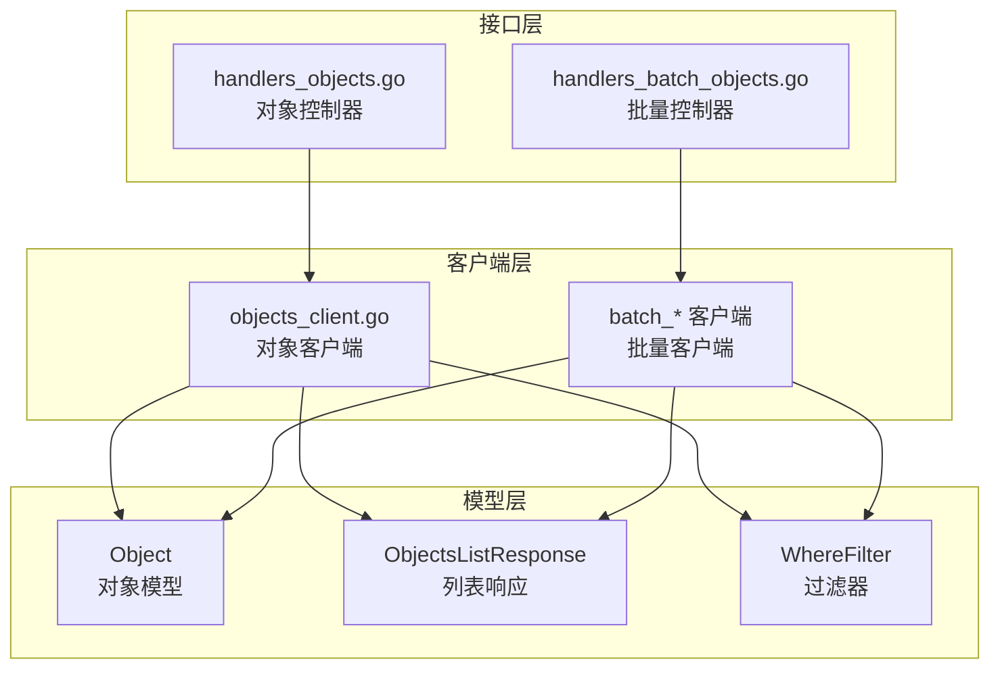
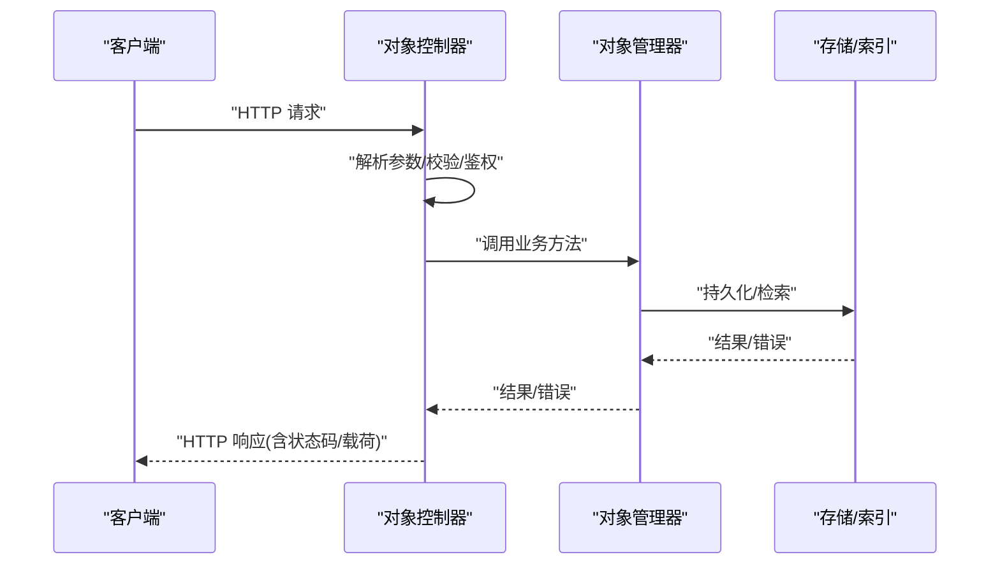
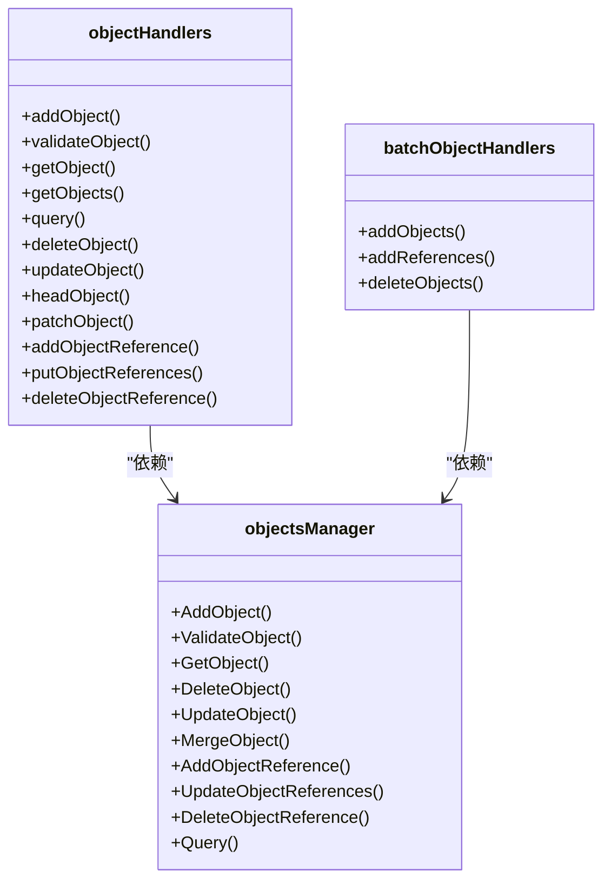

# 对象管理端点

<cite>
**本文档引用的文件**
- [handlers_objects.go](file://adapters/handlers/rest/handlers_objects.go)
- [handlers_batch_objects.go](file://adapters/handlers/rest/handlers_batch_objects.go)
- [schema.json](file://openapi-specs/schema.json)
- [object.go](file://entities/models/object.go)
- [objects_list_response.go](file://entities/models/objects_list_response.go)
- [objects_get_response.go](file://entities/models/objects_get_response.go)
- [objects_list_parameters.go](file://adapters/handlers/rest/operations/objects/objects_list_parameters.go)
- [objects_list_responses.go](file://client/objects/objects_list_responses.go)
- [objects_client.go](file://client/objects/objects_client.go)
- [batch_objects_create_parameters.go](file://client/batch/batch_objects_create_parameters.go)
- [batch_objects_create_responses.go](file://client/batch/batch_objects_create_responses.go)
- [batch_objects_delete_parameters.go](file://client/batch/batch_objects_delete_parameters.go)
- [batch_objects_delete_responses.go](file://client/batch/batch_objects_delete_responses.go)
- [batch_references_create_parameters.go](file://client/batch/batch_references_create_parameters.go)
- [batch_references_create_responses.go](file://client/batch/batch_references_create_responses.go)
</cite>

## 目录
1. [简介](#简介)
2. [项目结构](#项目结构)
3. [核心组件](#核心组件)
4. [架构总览](#架构总览)
5. [详细组件分析](#详细组件分析)
6. [依赖分析](#依赖分析)
7. [性能考虑](#性能考虑)
8. [故障排查指南](#故障排查指南)
9. [结论](#结论)
10. [附录](#附录)

## 简介
本文件系统性梳理 Weaviate 的对象管理 REST API，覆盖两类端点族：
- 类级别对象端点：以 objects_class_* 命名，通常需要指定类名（class）和对象 ID
- 通用对象端点：以 objects_* 命名，支持跨类查询与列表

内容包括：
- 每个端点的 HTTP 方法、URL 模式、请求参数、响应格式与错误处理
- 引用关系管理、批量操作、条件查询与过滤机制
- 认证要求、权限控制与一致性/节点参数
- 最佳实践、性能优化与常见使用模式

## 项目结构
Weaviate 的对象管理 REST 层由三层组成：
- 接口层（Handlers）：REST 控制器实现，解析请求、调用业务层、封装响应
- 客户端层（Client）：OpenAPI 生成的 Go 客户端，提供类型安全的请求/响应模型
- 数据模型层（Entities/Models）：对象、列表响应、批量删除等模型定义

**图表来源**
- [handlers_objects.go](file://adapters/handlers/rest/handlers_objects.go#L1-L800)
- [handlers_batch_objects.go](file://adapters/handlers/rest/handlers_batch_objects.go#L1-L315)
- [object.go](file://entities/models/object.go#L1-L239)
- [objects_list_response.go](file://entities/models/objects_list_response.go#L1-L188)
- [schema.json](file://openapi-specs/schema.json#L2738-L2781)

**章节来源**
- [handlers_objects.go](file://adapters/handlers/rest/handlers_objects.go#L1-L800)
- [handlers_batch_objects.go](file://adapters/handlers/rest/handlers_batch_objects.go#L1-L315)
- [schema.json](file://openapi-specs/schema.json#L2738-L2781)

## 核心组件
- 对象控制器：负责单对象增删改查、头信息查询、引用关系维护、校验与查询
- 批量控制器：负责批量创建对象、批量创建引用、批量删除对象
- 模型与过滤：统一的对象模型、列表响应模型、Where 过滤器模型
- 客户端：OpenAPI 自动生成的类型化客户端，便于集成

关键职责划分：
- 解析与校验：路径参数、查询参数、请求体
- 权限与一致性：鉴权主体注入、一致性/节点参数解析
- 错误映射：用户错误、权限错误、多租户错误、服务端错误
- 响应扩展：属性中引用链接补全

**章节来源**
- [handlers_objects.go](file://adapters/handlers/rest/handlers_objects.go#L36-L77)
- [handlers_batch_objects.go](file://adapters/handlers/rest/handlers_batch_objects.go#L31-L34)
- [object.go](file://entities/models/object.go#L28-L63)
- [objects_list_response.go](file://entities/models/objects_list_response.go#L28-L41)

## 架构总览
REST 端点在接口层被注册后，统一通过控制器方法处理，控制器再委托给 usecases/objects 业务层完成具体逻辑。

**图表来源**
- [handlers_objects.go](file://adapters/handlers/rest/handlers_objects.go#L79-L116)
- [handlers_objects.go](file://adapters/handlers/rest/handlers_objects.go#L218-L266)
- [handlers_objects.go](file://adapters/handlers/rest/handlers_objects.go#L325-L360)

## 详细组件分析

### 类级别对象端点（objects_class_*）

- 对象创建（POST /v1/objects/{class}/{id}）
  - 方法：POST
  - 路径参数：class（类名）、id（UUID）
  - 查询参数：consistencyLevel、nodeName（可选）
  - 请求体：对象模型（包含 class、properties、向量等）
  - 成功响应：201 Created，返回对象
  - 错误：400/422/403/500（无效输入、多租户、权限不足、服务器错误）
  - 关键实现：[addObject](file://adapters/handlers/rest/handlers_objects.go#L79-L116)

- 对象校验（POST /v1/objects/{class}/{id}/validate）
  - 方法：POST
  - 路径参数：同上
  - 请求体：对象模型
  - 成功响应：204 No Content
  - 错误：422/403/500
  - 关键实现：[validateObject](file://adapters/handlers/rest/handlers_objects.go#L118-L144)

- 对象获取（GET /v1/objects/{class}/{id}）
  - 方法：GET
  - 路径参数：同上
  - 查询参数：include（附加元信息）、consistencyLevel、nodeName、tenant（可选）
  - 成功响应：200 OK，返回对象（属性中的引用链接会被补全）
  - 错误：404/422/403/500
  - 关键实现：[getObject](file://adapters/handlers/rest/handlers_objects.go#L146-L216)

- 对象存在性检查（HEAD /v1/objects/{class}/{id}）
  - 方法：HEAD
  - 路径参数：同上
  - 查询参数：consistencyLevel、tenant
  - 成功响应：204 No Content 或 404 Not Found
  - 错误：422/403/500
  - 关键实现：[headObject](file://adapters/handlers/rest/handlers_objects.go#L402-L437)

- 对象更新（PUT /v1/objects/{class}/{id}）
  - 方法：PUT
  - 路径参数：同上
  - 查询参数：consistencyLevel
  - 请求体：对象模型（仅需变更字段）
  - 成功响应：200 OK，返回更新后的对象
  - 错误：422/403/500
  - 关键实现：[updateObject](file://adapters/handlers/rest/handlers_objects.go#L362-L400)

- 对象补丁更新（PATCH /v1/objects/{class}/{id}）
  - 方法：PATCH
  - 路径参数：同上
  - 查询参数：consistencyLevel
  - 请求体：对象模型（仅需变更字段）
  - 成功响应：204 No Content
  - 错误：404/422/403/500
  - 关键实现：[patchObject](file://adapters/handlers/rest/handlers_objects.go#L439-L478)

- 对象删除（DELETE /v1/objects/{class}/{id}）
  - 方法：DELETE
  - 路径参数：同上
  - 查询参数：consistencyLevel
  - 成功响应：204 No Content
  - 错误：404/422/403/500
  - 关键实现：[deleteObject](file://adapters/handlers/rest/handlers_objects.go#L325-L360)

- 引用关系管理（类级别）
  - 添加引用（POST /v1/objects/{class}/{id}/references/{propertyName}）
    - 请求体：单个引用（SingleRef）
    - 成功响应：200 OK
    - 错误：404/422/403/500
    - 关键实现：[addObjectReference](file://adapters/handlers/rest/handlers_objects.go#L480-L523)
  - 更新引用（PUT /v1/objects/{class}/{id}/references/{propertyName}）
    - 请求体：引用数组（MultipleRef）
    - 成功响应：200 OK
    - 错误：404/422/403/500
    - 关键实现：[putObjectReferences](file://adapters/handlers/rest/handlers_objects.go#L525-L568)
  - 删除引用（DELETE /v1/objects/{class}/{id}/references/{propertyName}）
    - 请求体：单个引用（SingleRef）
    - 成功响应：204 No Content
    - 错误：404/422/403/500
    - 关键实现：[deleteObjectReference](file://adapters/handlers/rest/handlers_objects.go#L570-L612)

- 列表与查询（类级别）
  - GET /v1/objects?class={class}&limit={n}&offset={o}&sort={s}&order={asc|desc}&after={cursor}&include=...
    - 成功响应：200 OK，ObjectsListResponse
    - 错误：403/422/500
    - 关键实现：[getObjects](file://adapters/handlers/rest/handlers_objects.go#L218-L266)
  - GET /v1/objects?class={class}&...（带过滤/排序/分页）
    - 成功响应：200 OK，ObjectsListResponse
    - 错误：403/404/422/500
    - 关键实现：[query](file://adapters/handlers/rest/handlers_objects.go#L268-L323)

- 通用对象端点（兼容旧版，已标记为弃用）
  - GET /v1/objects/{id}、HEAD /v1/objects/{id}、PATCH/PUT/DELETE 同上类级别路径
  - 关键实现：[getObjectDeprecated 等](file://adapters/handlers/rest/handlers_objects.go#L660-L757)

请求/响应模型与过滤器
- 对象模型：包含 class、id、properties、向量、附加信息等
  - 参考：[Object](file://entities/models/object.go#L28-L63)
- 列表响应：objects 数组、totalResults、deprecations
  - 参考：[ObjectsListResponse](file://entities/models/objects_list_response.go#L28-L41)
- Where 过滤器：支持 And/Or/Equal/Like/NotEqual/GreaterThan 等操作符
  - 参考：[WhereFilter](file://openapi-specs/schema.json#L3096-L3199)

**章节来源**
- [handlers_objects.go](file://adapters/handlers/rest/handlers_objects.go#L79-L116)
- [handlers_objects.go](file://adapters/handlers/rest/handlers_objects.go#L118-L144)
- [handlers_objects.go](file://adapters/handlers/rest/handlers_objects.go#L146-L216)
- [handlers_objects.go](file://adapters/handlers/rest/handlers_objects.go#L218-L266)
- [handlers_objects.go](file://adapters/handlers/rest/handlers_objects.go#L268-L323)
- [handlers_objects.go](file://adapters/handlers/rest/handlers_objects.go#L325-L360)
- [handlers_objects.go](file://adapters/handlers/rest/handlers_objects.go#L362-L400)
- [handlers_objects.go](file://adapters/handlers/rest/handlers_objects.go#L439-L478)
- [handlers_objects.go](file://adapters/handlers/rest/handlers_objects.go#L480-L523)
- [handlers_objects.go](file://adapters/handlers/rest/handlers_objects.go#L525-L568)
- [handlers_objects.go](file://adapters/handlers/rest/handlers_objects.go#L570-L612)
- [handlers_objects.go](file://adapters/handlers/rest/handlers_objects.go#L660-L757)
- [object.go](file://entities/models/object.go#L28-L63)
- [objects_list_response.go](file://entities/models/objects_list_response.go#L28-L41)
- [schema.json](file://openapi-specs/schema.json#L3096-L3199)

### 批量对象端点（batch_*）

- 批量创建对象（POST /v1/batch/objects）
  - 请求体：objects（对象数组）、fields（返回字段）
  - 成功响应：200 OK，每条对象包含 result.status 与 errors（如有）
  - 错误：403/422/500
  - 关键实现：[addObjects](file://adapters/handlers/rest/handlers_batch_objects.go#L36-L99)

- 批量创建引用（POST /v1/batch/references）
  - 请求体：引用数组（from/to/tenant）
  - 成功响应：200 OK，每条引用包含 result.status 与 errors（如有）
  - 错误：403/422/500
  - 关键实现：[addReferences](file://adapters/handlers/rest/handlers_batch_objects.go#L124-L157)

- 批量删除对象（POST /v1/batch/objects/delete）
  - 请求体：match.class、match.where、output、deletionTimeUnixMilli、dryRun
  - 成功响应：200 OK，包含匹配数、成功数、失败数、对象结果列表
  - 错误：422/403/500
  - 关键实现：[deleteObjects](file://adapters/handlers/rest/handlers_batch_objects.go#L186-L221)

请求/响应模型
- 批量对象响应：ObjectsGetResponse（含 result.status 与 errors）
  - 参考：[ObjectsGetResponseAO2Result](file://entities/models/objects_get_response.go#L256-L267)
- 批量引用响应：BatchReferenceResponse（含 result.status 与 errors）
  - 参考：[BatchReferenceResponse](file://openapi-specs/schema.json#L2659-L2687)
- 批量删除响应：BatchDeleteResponse（包含 match、results、deletionTime 等）
  - 参考：[BatchDeleteResponse](file://openapi-specs/schema.json#L2859-L2952)

**章节来源**
- [handlers_batch_objects.go](file://adapters/handlers/rest/handlers_batch_objects.go#L36-L99)
- [handlers_batch_objects.go](file://adapters/handlers/rest/handlers_batch_objects.go#L124-L157)
- [handlers_batch_objects.go](file://adapters/handlers/rest/handlers_batch_objects.go#L186-L221)
- [objects_get_response.go](file://entities/models/objects_get_response.go#L256-L267)
- [schema.json](file://openapi-specs/schema.json#L2659-L2687)
- [schema.json](file://openapi-specs/schema.json#L2859-L2952)

### 引用关系管理
- 单个引用（SingleRef）：beacon/href/class/schema
- 批量引用（BatchReference）：from/to/tenant
- 引用元信息（ReferenceMetaClassification）：分类统计信息
- 引用链接补全：接口层会为属性中的引用补全 href 链接

参考模型
- [SingleRef](file://openapi-specs/schema.json#L2546-L2572)
- [BatchReference](file://openapi-specs/schema.json#L2639-L2657)
- [ReferenceMetaClassification](file://openapi-specs/schema.json#L2581-L2637)

**章节来源**
- [handlers_objects.go](file://adapters/handlers/rest/handlers_objects.go#L759-L795)
- [schema.json](file://openapi-specs/schema.json#L2546-L2572)
- [schema.json](file://openapi-specs/schema.json#L2639-L2657)
- [schema.json](file://openapi-specs/schema.json#L2581-L2637)

### 条件查询与过滤
- WhereFilter 支持 And/Or/Equal/Like/NotEqual/GreaterThan 等操作符
- 支持数值、文本、布尔、日期、数组等值类型
- 与列表端点结合使用，实现复杂筛选

参考定义
- [WhereFilter](file://openapi-specs/schema.json#L3096-L3199)

**章节来源**
- [schema.json](file://openapi-specs/schema.json#L3096-L3199)

## 依赖分析
- 控制器依赖：
  - 对象管理器（objectsManager）：封装 AddObject、ValidateObject、GetObject、DeleteObject、UpdateObject、MergeObject、AddObjectReference、UpdateObjectReferences、DeleteObjectReference、Query 等
  - 模块提供者（ModulesProvider）：用于扩展附加属性
- 客户端依赖：
  - OpenAPI 生成的参数与响应类型，确保类型安全
- 模型依赖：
  - Object、ObjectsListResponse、WhereFilter 等

**图表来源**
- [handlers_objects.go](file://adapters/handlers/rest/handlers_objects.go#L36-L77)
- [handlers_batch_objects.go](file://adapters/handlers/rest/handlers_batch_objects.go#L31-L34)

**章节来源**
- [handlers_objects.go](file://adapters/handlers/rest/handlers_objects.go#L36-L77)
- [handlers_batch_objects.go](file://adapters/handlers/rest/handlers_batch_objects.go#L31-L34)

## 性能考虑
- 批量优先：对大量对象操作优先使用批量端点，减少网络往返与事务开销
- 分页与游标：列表端点支持 limit/offset/after，合理设置避免一次性拉取过多
- 选择性返回：通过 include 与 fields 控制返回字段，降低序列化与传输成本
- 一致性与节点参数：在强一致需求与性能之间平衡 consistencyLevel 与 nodeName
- 过滤下推：尽量在请求侧使用 WhereFilter，减少服务端二次筛选

[本节为通用指导，不直接分析具体文件]

## 故障排查指南
常见错误与定位要点：
- 400 Bad Request：请求参数格式错误（如 UUID 格式、limit/offset 类型）
  - 参考：[objects_list_parameters.go](file://adapters/handlers/rest/operations/objects/objects_list_parameters.go#L198-L243)
- 403 Forbidden：权限不足（RBAC/授权）
  - 参考：控制器中对 authzerrors.Forbidden 的分支
- 404 Not Found：对象不存在
  - 参考：控制器中对 uco.ErrNotFound 的分支
- 422 Unprocessable Entity：语义错误（如多租户配置、无效输入）
  - 参考：控制器中对 uco.ErrInvalidUserInput/ErrMultiTenancy 的分支
- 500 Internal Server Error：服务端异常
  - 参考：默认分支返回 500

日志与指标：
- 控制器使用指标记录成功/错误计数，便于监控与告警
- 批量端点对用户错误与服务器错误进行区分记录

**章节来源**
- [handlers_objects.go](file://adapters/handlers/rest/handlers_objects.go#L79-L116)
- [handlers_objects.go](file://adapters/handlers/rest/handlers_objects.go#L218-L266)
- [handlers_objects.go](file://adapters/handlers/rest/handlers_objects.go#L325-L360)
- [handlers_objects.go](file://adapters/handlers/rest/handlers_objects.go#L362-L400)
- [handlers_objects.go](file://adapters/handlers/rest/handlers_objects.go#L439-L478)
- [handlers_objects.go](file://adapters/handlers/rest/handlers_objects.go#L480-L523)
- [handlers_objects.go](file://adapters/handlers/rest/handlers_objects.go#L525-L568)
- [handlers_objects.go](file://adapters/handlers/rest/handlers_objects.go#L570-L612)
- [handlers_batch_objects.go](file://adapters/handlers/rest/handlers_batch_objects.go#L36-L99)
- [handlers_batch_objects.go](file://adapters/handlers/rest/handlers_batch_objects.go#L124-L157)
- [handlers_batch_objects.go](file://adapters/handlers/rest/handlers_batch_objects.go#L186-L221)
- [objects_list_parameters.go](file://adapters/handlers/rest/operations/objects/objects_list_parameters.go#L198-L243)

## 结论
Weaviate 的对象管理 REST API 提供了完善的 CRUD、引用关系与批量操作能力，并通过 OpenAPI 客户端与模型保证类型安全。通过合理使用过滤、分页与批量端点，可在保证一致性的同时获得良好性能。权限控制与错误处理策略清晰，便于在生产环境中稳定运行。

[本节为总结性内容，不直接分析具体文件]

## 附录

### 端点一览与示例字段说明
- 对象创建
  - 请求体字段：class、properties、向量（可选）、tenant（可选）
  - 响应字段：同请求体（含 id、creationTimeUnix、lastUpdateTimeUnix）
  - 参考：[Object](file://entities/models/object.go#L28-L63)
- 列表响应
  - 字段：objects（对象数组）、totalResults、deprecations
  - 参考：[ObjectsListResponse](file://entities/models/objects_list_response.go#L28-L41)
- 批量删除响应
  - 字段：match、output、deletionTimeUnixMilli、results（包含 matches、limit、successful、failed、objects）
  - 参考：[BatchDeleteResponse](file://openapi-specs/schema.json#L2859-L2952)

**章节来源**
- [object.go](file://entities/models/object.go#L28-L63)
- [objects_list_response.go](file://entities/models/objects_list_response.go#L28-L41)
- [schema.json](file://openapi-specs/schema.json#L2859-L2952)