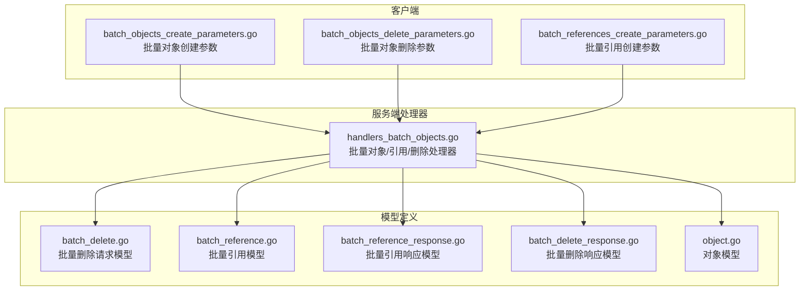
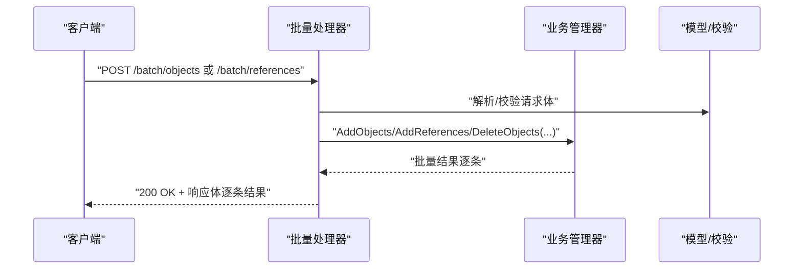
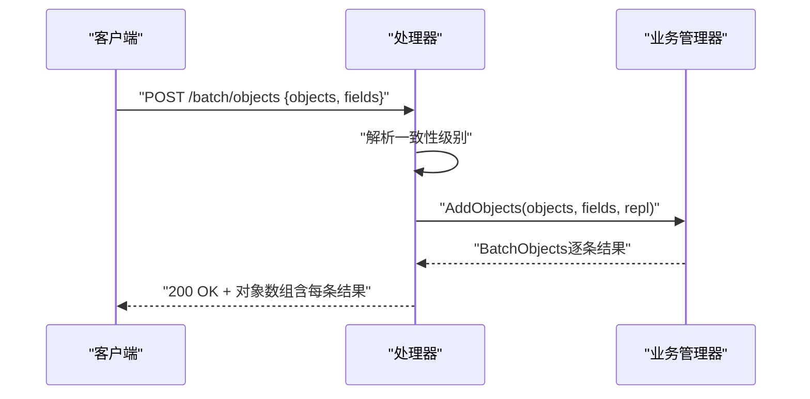
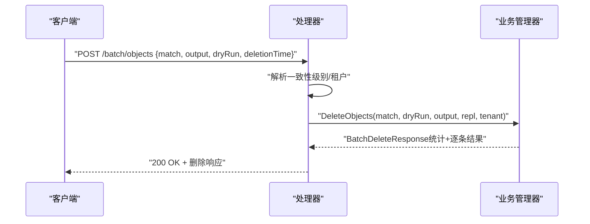
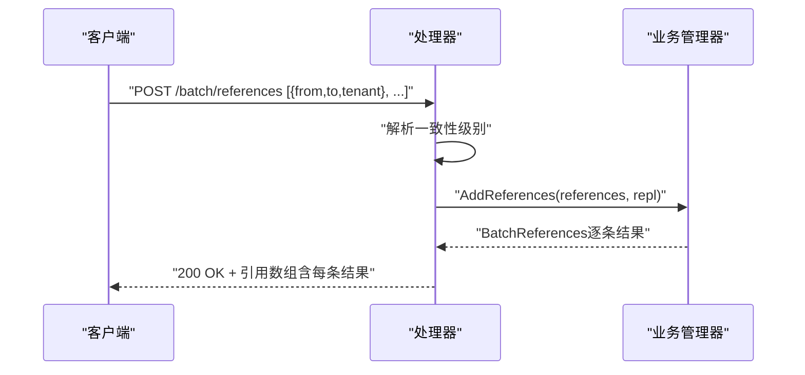
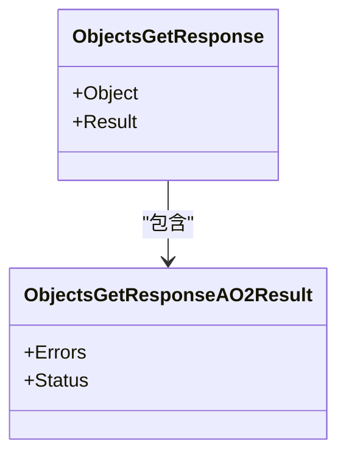
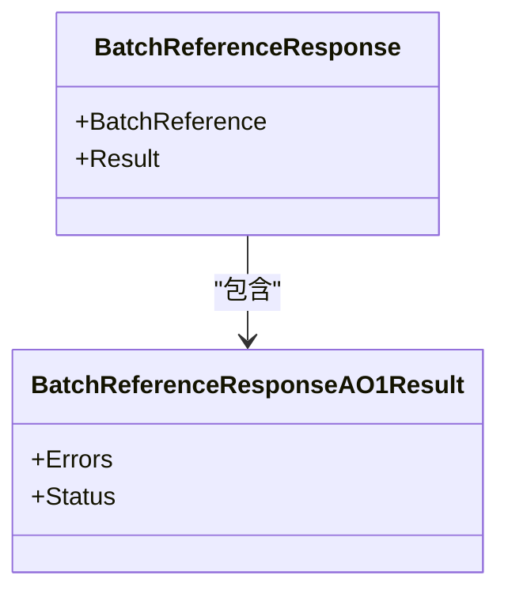
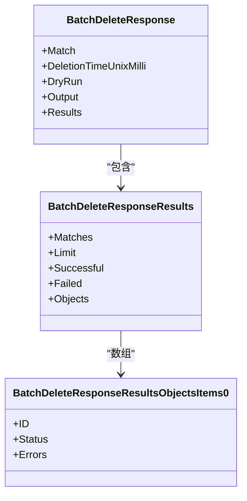
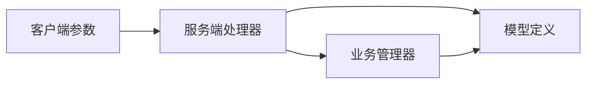

# 批量操作端点

<cite>
**本文档引用的文件**
- [handlers_batch_objects.go](file://adapters/handlers/rest/handlers_batch_objects.go)
- [batch_objects_create_parameters.go](file://client/batch/batch_objects_create_parameters.go)
- [batch_objects_delete_parameters.go](file://client/batch/batch_objects_delete_parameters.go)
- [batch_references_create_parameters.go](file://client/batch/batch_references_create_parameters.go)
- [batch_objects_create_responses.go](file://adapters/handlers/rest/operations/batch/batch_objects_create_responses.go)
- [batch_objects_delete_responses.go](file://adapters/handlers/rest/operations/batch/batch_objects_delete_responses.go)
- [batch_references_create_responses.go](file://adapters/handlers/rest/operations/batch/batch_references_create_responses.go)
- [batch_objects_create_responses.go](file://client/batch/batch_objects_create_responses.go)
- [batch_references_create_responses.go](file://client/batch/batch_references_create_responses.go)
- [batch_delete.go](file://entities/models/batch_delete.go)
- [batch_reference.go](file://entities/models/batch_reference.go)
- [batch_reference_response.go](file://entities/models/batch_reference_response.go)
- [batch_delete_response.go](file://entities/models/batch_delete_response.go)
- [object.go](file://entities/models/object.go)
- [concurrent_batches_test.go](file://test/acceptance/stress_tests/concurrent_batches_test.go)
- [panics_middleware.go](file://adapters/handlers/rest/panics_middleware.go)
- [transactions_write.go](file://usecases/cluster/transactions_write.go)
</cite>

## 目录
1. [简介](#简介)
2. [项目结构](#项目结构)
3. [核心组件](#核心组件)
4. [架构总览](#架构总览)
5. [详细组件分析](#详细组件分析)
6. [依赖关系分析](#依赖关系分析)
7. [性能考量](#性能考量)
8. [故障排查指南](#故障排查指南)
9. [结论](#结论)
10. [附录](#附录)

## 简介
本文件系统性阐述 Weaviate 的批量操作 REST API 端点，覆盖以下能力：
- 批量对象创建：一次请求提交多个对象，返回逐条结果与错误
- 批量对象删除：按过滤条件批量删除或预演（Dry Run）
- 批量引用创建：一次请求提交多条跨对象引用关系

内容包括：
- 请求/响应格式与字段语义
- 错误处理与状态码映射
- 性能优势、事务与一致性控制、回滚机制
- 批量大小限制、超时与并发控制
- 最佳实践、性能优化与故障恢复策略
- 与单对象操作的差异与选型建议

## 项目结构
批量操作端点由客户端参数定义、服务端处理器与模型定义三部分协作完成：
- 客户端参数与调用封装：定义请求体、查询参数（如一致性级别）、HTTP 客户端与超时等
- 服务端处理器：解析请求、调用业务层、生成带逐条结果的响应
- 模型定义：请求体与响应体的数据结构、枚举与校验规则

**图表来源**
- [handlers_batch_objects.go](file://adapters/handlers/rest/handlers_batch_objects.go#L31-L315)
- [batch_objects_create_parameters.go](file://client/batch/batch_objects_create_parameters.go#L73-L90)
- [batch_objects_delete_parameters.go](file://client/batch/batch_objects_delete_parameters.go#L75-L98)
- [batch_references_create_parameters.go](file://client/batch/batch_references_create_parameters.go#L75-L92)
- [batch_delete.go](file://entities/models/batch_delete.go#L27-L43)
- [batch_reference.go](file://entities/models/batch_reference.go#L28-L45)
- [batch_reference_response.go](file://entities/models/batch_reference_response.go#L29-L37)
- [batch_delete_response.go](file://entities/models/batch_delete_response.go#L30-L49)
- [object.go](file://entities/models/object.go#L28-L63)

**章节来源**
- [handlers_batch_objects.go](file://adapters/handlers/rest/handlers_batch_objects.go#L31-L315)
- [batch_objects_create_parameters.go](file://client/batch/batch_objects_create_parameters.go#L73-L90)
- [batch_objects_delete_parameters.go](file://client/batch/batch_objects_delete_parameters.go#L75-L98)
- [batch_references_create_parameters.go](file://client/batch/batch_references_create_parameters.go#L75-L92)

## 核心组件
- 批量对象创建
  - 端点：POST /v1/batch/objects
  - 请求体：包含对象数组与可选字段列表
  - 响应：逐条对象结果，包含状态与错误信息
  - 关键参数：一致性级别（consistency_level）等
- 批量对象删除
  - 端点：POST /v1/batch/objects
  - 请求体：匹配条件、输出模式、是否 Dry Run、时间戳等
  - 响应：统计与逐条对象结果（含状态/错误）
- 批量引用创建
  - 端点：POST /v1/batch/references
  - 请求体：引用数组（来源/目标/租户等）
  - 响应：逐条引用结果，包含状态与错误信息

**章节来源**
- [handlers_batch_objects.go](file://adapters/handlers/rest/handlers_batch_objects.go#L36-L99)
- [handlers_batch_objects.go](file://adapters/handlers/rest/handlers_batch_objects.go#L124-L157)
- [handlers_batch_objects.go](file://adapters/handlers/rest/handlers_batch_objects.go#L186-L221)
- [batch_objects_create_parameters.go](file://client/batch/batch_objects_create_parameters.go#L73-L90)
- [batch_objects_delete_parameters.go](file://client/batch/batch_objects_delete_parameters.go#L75-L98)
- [batch_references_create_parameters.go](file://client/batch/batch_references_create_parameters.go#L75-L92)

## 架构总览
批量操作在服务端的处理流程如下：

**图表来源**
- [handlers_batch_objects.go](file://adapters/handlers/rest/handlers_batch_objects.go#L36-L99)
- [handlers_batch_objects.go](file://adapters/handlers/rest/handlers_batch_objects.go#L124-L157)
- [handlers_batch_objects.go](file://adapters/handlers/rest/handlers_batch_objects.go#L186-L221)

## 详细组件分析

### 批量对象创建（/batch/objects）
- 请求格式
  - Body：对象数组与字段列表
  - 查询参数：一致性级别（consistency_level）
  - 可选：HTTP 超时、上下文、自定义 HTTP 客户端
- 响应格式
  - 成功：200 OK，返回对象数组，每项包含对象与结果（状态/错误）
  - 错误：400/403/422/500，错误体包含错误信息
- 处理逻辑要点
  - 解析一致性级别，进行复制/一致性控制
  - 调用业务层批量创建，逐条记录结果与错误
  - 统计成功/失败并返回

**图表来源**
- [handlers_batch_objects.go](file://adapters/handlers/rest/handlers_batch_objects.go#L36-L99)
- [batch_objects_create_parameters.go](file://client/batch/batch_objects_create_parameters.go#L73-L90)

**章节来源**
- [handlers_batch_objects.go](file://adapters/handlers/rest/handlers_batch_objects.go#L36-L99)
- [batch_objects_create_parameters.go](file://client/batch/batch_objects_create_parameters.go#L73-L90)
- [batch_objects_create_responses.go](file://adapters/handlers/rest/operations/batch/batch_objects_create_responses.go#L263-L278)
- [batch_objects_create_responses.go](file://client/batch/batch_objects_create_responses.go#L169-L204)

### 批量对象删除（/batch/objects）
- 请求格式
  - Body：匹配条件（类名+过滤器）、输出模式（minimal/verbose）、Dry Run、时间戳
  - 查询参数：一致性级别（consistency_level）、租户（tenant）
- 响应格式
  - 成功：200 OK，返回匹配数、成功数、失败数、逐条对象结果（状态/错误）
  - 错误：400/403/422/500
- 处理逻辑要点
  - 支持 Dry Run 预演，不实际删除
  - 输出模式控制是否返回成功/预演对象
  - 逐条记录状态并统计

**图表来源**
- [handlers_batch_objects.go](file://adapters/handlers/rest/handlers_batch_objects.go#L186-L221)
- [batch_objects_delete_parameters.go](file://client/batch/batch_objects_delete_parameters.go#L75-L98)
- [batch_delete.go](file://entities/models/batch_delete.go#L27-L43)

**章节来源**
- [handlers_batch_objects.go](file://adapters/handlers/rest/handlers_batch_objects.go#L186-L221)
- [batch_objects_delete_parameters.go](file://client/batch/batch_objects_delete_parameters.go#L75-L98)
- [batch_delete.go](file://entities/models/batch_delete.go#L27-L43)
- [batch_delete_response.go](file://entities/models/batch_delete_response.go#L30-L49)

### 批量引用创建（/batch/references）
- 请求格式
  - Body：引用数组（from/to/tenant），from 必须为长形式 beacon 风格 URI
  - 查询参数：一致性级别（consistency_level）
- 响应格式
  - 成功：200 OK，返回引用数组，每项包含引用与结果（状态/错误）
  - 错误：400/403/422/500
- 处理逻辑要点
  - 校验 URI 格式
  - 逐条创建引用并记录结果

**图表来源**
- [handlers_batch_objects.go](file://adapters/handlers/rest/handlers_batch_objects.go#L124-L157)
- [batch_references_create_parameters.go](file://client/batch/batch_references_create_parameters.go#L75-L92)
- [batch_reference.go](file://entities/models/batch_reference.go#L28-L45)

**章节来源**
- [handlers_batch_objects.go](file://adapters/handlers/rest/handlers_batch_objects.go#L124-L157)
- [batch_references_create_parameters.go](file://client/batch/batch_references_create_parameters.go#L75-L92)
- [batch_reference.go](file://entities/models/batch_reference.go#L28-L45)
- [batch_reference_response.go](file://entities/models/batch_reference_response.go#L29-L37)

### 数据模型与响应结构

#### 批量对象创建响应模型
- 每个对象包含：
  - Object：创建后的对象
  - Result：包含状态与错误
- 状态枚举：SUCCESS/FAILED

**图表来源**
- [handlers_batch_objects.go](file://adapters/handlers/rest/handlers_batch_objects.go#L101-L122)
- [object.go](file://entities/models/object.go#L28-L63)

**章节来源**
- [handlers_batch_objects.go](file://adapters/handlers/rest/handlers_batch_objects.go#L101-L122)
- [object.go](file://entities/models/object.go#L28-L63)

#### 批量引用创建响应模型
- 每个引用包含：
  - BatchReference：原始引用（from/to/tenant）
  - Result：包含状态与错误
- 状态枚举：SUCCESS/FAILED

**图表来源**
- [handlers_batch_objects.go](file://adapters/handlers/rest/handlers_batch_objects.go#L159-L184)
- [batch_reference_response.go](file://entities/models/batch_reference_response.go#L29-L37)

**章节来源**
- [handlers_batch_objects.go](file://adapters/handlers/rest/handlers_batch_objects.go#L159-L184)
- [batch_reference_response.go](file://entities/models/batch_reference_response.go#L29-L37)

#### 批量删除响应模型
- 包含：
  - Match：匹配条件
  - DeletionTimeUnixMilli：删除时间
  - DryRun：是否预演
  - Output：输出模式
  - Results：统计与逐条对象结果
- 逐条对象状态枚举：SUCCESS/DRYRUN/FAILED

**图表来源**
- [handlers_batch_objects.go](file://adapters/handlers/rest/handlers_batch_objects.go#L223-L274)
- [batch_delete_response.go](file://entities/models/batch_delete_response.go#L30-L49)
- [batch_delete_response.go](file://entities/models/batch_delete_response.go#L269-L288)
- [batch_delete_response.go](file://entities/models/batch_delete_response.go#L382-L397)

**章节来源**
- [handlers_batch_objects.go](file://adapters/handlers/rest/handlers_batch_objects.go#L223-L274)
- [batch_delete_response.go](file://entities/models/batch_delete_response.go#L30-L49)
- [batch_delete_response.go](file://entities/models/batch_delete_response.go#L269-L288)
- [batch_delete_response.go](file://entities/models/batch_delete_response.go#L382-L397)

## 依赖关系分析
- 客户端参数与服务端处理器通过统一的 OpenAPI 运行时绑定
- 处理器依赖业务管理器执行具体操作，并将逐条结果封装为标准响应
- 模型定义确保请求/响应的结构化与可验证性

**图表来源**
- [handlers_batch_objects.go](file://adapters/handlers/rest/handlers_batch_objects.go#L31-L34)
- [batch_objects_create_parameters.go](file://client/batch/batch_objects_create_parameters.go#L73-L90)
- [batch_objects_delete_parameters.go](file://client/batch/batch_objects_delete_parameters.go#L75-L98)
- [batch_references_create_parameters.go](file://client/batch/batch_references_create_parameters.go#L75-L92)

**章节来源**
- [handlers_batch_objects.go](file://adapters/handlers/rest/handlers_batch_objects.go#L31-L34)
- [batch_objects_create_parameters.go](file://client/batch/batch_objects_create_parameters.go#L73-L90)
- [batch_objects_delete_parameters.go](file://client/batch/batch_objects_delete_parameters.go#L75-L98)
- [batch_references_create_parameters.go](file://client/batch/batch_references_create_parameters.go#L75-L92)

## 性能考量
- 性能优势
  - 减少网络往返与连接开销，提升吞吐
  - 服务器端可进行批内优化（索引/写入合并）
- 并发与限流
  - 测试显示高并发批量请求可稳定工作，但需结合集群规模与资源
  - 模块侧存在速率限制与并发批次统计，有助于避免过载
- 超时与一致性
  - 客户端/服务器超时需一致，避免“仅服务器超时”导致的 I/O 超时
  - 一致性级别影响复制确认数量，平衡一致性与可用性
- 批量大小
  - 建议根据集群规模与资源分批，避免单次过大导致内存与锁竞争
- 回滚与事务
  - 写入事务具备开始/提交/过期/并发冲突保护，保障一致性边界内的原子性

**章节来源**
- [concurrent_batches_test.go](file://test/acceptance/stress_tests/concurrent_batches_test.go#L59-L94)
- [panics_middleware.go](file://adapters/handlers/rest/panics_middleware.go#L97-L104)
- [transactions_write.go](file://usecases/cluster/transactions_write.go#L324-L449)

## 故障排查指南
- 常见错误与处理
  - 400 Bad Request：请求语法错误，检查请求体与参数
  - 403 Forbidden：权限不足，检查鉴权与授权
  - 422 Unprocessable Entity：语义错误（如非法输入、多租户问题），修正后重试
  - 500 Internal Server Error：服务器内部错误，查看日志并重试
- 排查步骤
  - 确认请求体结构与字段类型（UUID、URI、过滤器）
  - 检查一致性级别与租户参数
  - 使用 Dry Run 验证匹配条件与输出
  - 观察逐条结果中的错误字段定位失败原因
- 超时与并发
  - 若出现 I/O 超时，调整客户端/服务器超时配置，或减小批量规模
  - 高并发场景下关注模块速率限制与并发批次统计

**章节来源**
- [handlers_batch_objects.go](file://adapters/handlers/rest/handlers_batch_objects.go#L73-L91)
- [handlers_batch_objects.go](file://adapters/handlers/rest/handlers_batch_objects.go#L138-L152)
- [handlers_batch_objects.go](file://adapters/handlers/rest/handlers_batch_objects.go#L203-L216)
- [batch_objects_create_responses.go](file://client/batch/batch_objects_create_responses.go#L194-L204)
- [batch_references_create_responses.go](file://client/batch/batch_references_create_responses.go#L316-L334)
- [panics_middleware.go](file://adapters/handlers/rest/panics_middleware.go#L97-L104)

## 结论
批量操作端点通过一次请求承载多条操作，显著降低网络开销并提升吞吐。服务端逐条返回结果与错误，便于精细化观测与重试。配合一致性级别、租户与 Dry Run 等特性，可在保证正确性的前提下灵活适配不同场景。生产使用中建议结合集群规模与资源进行分批、限流与超时调优，并利用事务与回滚机制保障一致性边界内的原子性。

## 附录

### 与单对象操作的差异与选型建议
- 差异
  - 单对象：每次请求仅处理一个对象/引用，适合实时、低延迟场景
  - 批量：一次请求处理多个对象/引用，适合高吞吐、离线导入、批处理
- 选型建议
  - 导入/迁移：优先批量，减少网络与锁竞争
  - 实时写入：优先单对象，便于即时反馈与细粒度控制
  - 混合策略：大体量导入用批量，增量更新用单对象

[无章节来源（概念性总结）]