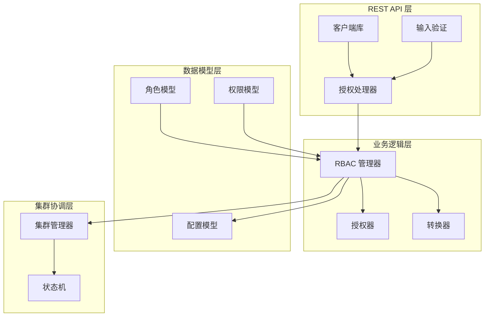
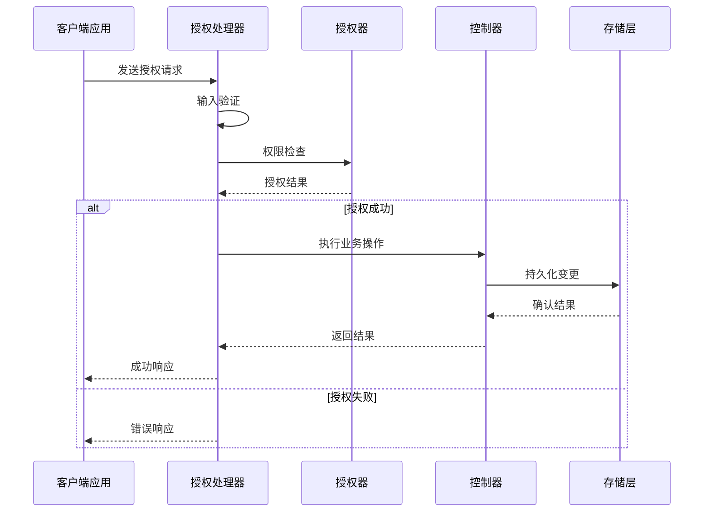
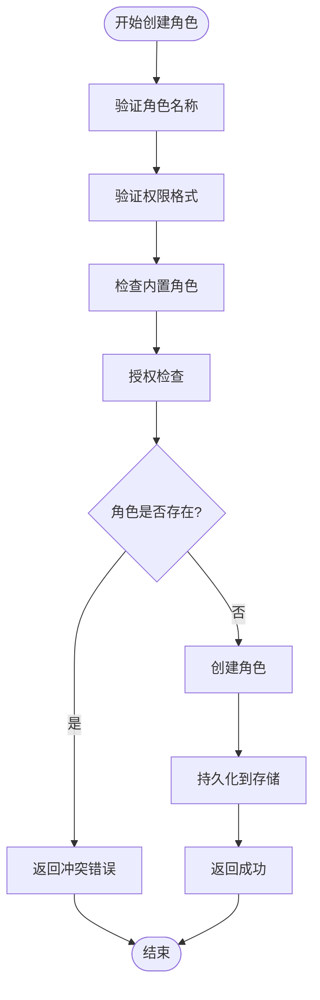
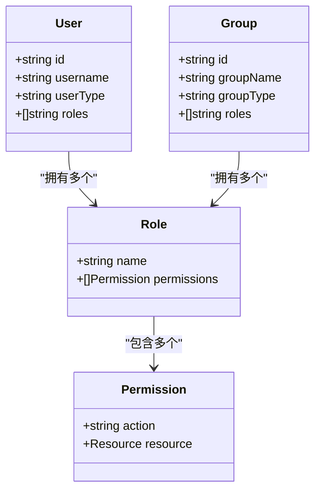
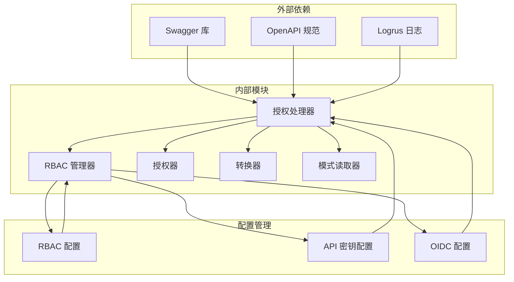

# 授权管理端点

<cite>
**本文档引用的文件**
- [handlers_authz.go](file://adapters/handlers/rest/authz/handlers_authz.go)
- [authz_client.go](file://client/authz/authz_client.go)
- [validation.go](file://adapters/handlers/rest/authz/validation.go)
- [manager.go](file://cluster/rbac/manager.go)
- [config.go](file://usecases/auth/authorization/rbac/rbacconf/config.go)
- [role.go](file://entities/models/role.go)
- [permission.go](file://entities/models/permission.go)
- [handlers_authz_create_role_test.go](file://adapters/handlers/rest/authz/handlers_authz_create_role_test.go)
- [handlers_authz_add_permission_test.go](file://adapters/handlers/rest/authz/handlers_authz_add_permission_test.go)
- [handlers_authz_assign_roles_test.go](file://adapters/handlers/rest/authz/handlers_authz_assign_roles_test.go)
- [handlers_authz_revoke_roles_test.go](file://adapters/handlers/rest/authz/handlers_authz_revoke_roles_test.go)
- [handlers_authz_get_roles_test.go](file://adapters/handlers/rest/authz/handlers_authz_get_roles_test.go)
- [handlers_authz_test.go](file://adapters/handlers/rest/authz/handlers_authz_test.go)
</cite>

## 目录
1. [简介](#简介)
2. [项目结构](#项目结构)
3. [核心组件](#核心组件)
4. [架构概览](#架构概览)
5. [详细组件分析](#详细组件分析)
6. [依赖关系分析](#依赖关系分析)
7. [性能考虑](#性能考虑)
8. [故障排除指南](#故障排除指南)
9. [结论](#结论)

## 简介

Weaviate 的授权管理 REST API 端点提供了完整的基于角色的访问控制（RBAC）系统，支持角色管理、权限分配、用户组管理和权限检查功能。该系统实现了细粒度的权限控制，允许管理员精确控制用户对数据库资源的访问权限。

本系统的核心特性包括：
- 角色创建、删除、查询和权限分配
- 用户与角色、用户组与角色的关系管理
- 动态权限更新和权限验证
- 支持多租户环境下的权限控制
- 完整的审计日志和错误处理机制

## 项目结构

**图表来源**
- [handlers_authz.go](file://adapters/handlers/rest/authz/handlers_authz.go#L65-L102)
- [manager.go](file://cluster/rbac/manager.go#L31-L40)

**章节来源**
- [handlers_authz.go](file://adapters/handlers/rest/authz/handlers_authz.go#L1-L1237)
- [manager.go](file://cluster/rbac/manager.go#L1-L300)

## 核心组件

### 授权处理器 (authZHandlers)

授权处理器是 REST API 的核心入口点，负责处理所有授权相关的 HTTP 请求。它实现了以下主要功能：

- **角色管理端点**：创建、删除、查询角色
- **权限管理端点**：添加、移除权限
- **用户管理端点**：分配、撤销角色给用户
- **组管理端点**：分配、撤销角色给用户组
- **权限验证端点**：检查角色是否具有特定权限

每个处理器都包含完整的输入验证、权限检查和错误处理逻辑。

**章节来源**
- [handlers_authz.go](file://adapters/handlers/rest/authz/handlers_authz.go#L49-L102)

### RBAC 管理器

RBAC 管理器负责协调整个授权系统的操作，包括：

- 角色和权限的持久化存储
- 用户和组的角色映射管理
- 权限验证和授权决策
- 集群范围内的状态同步

**章节来源**
- [manager.go](file://cluster/rbac/manager.go#L31-L40)

### 数据模型

系统使用标准化的数据模型来表示授权实体：

- **角色模型**：包含角色名称和权限列表
- **权限模型**：定义具体的访问权限规则
- **配置模型**：管理 RBAC 系统的全局配置

**章节来源**
- [role.go](file://entities/models/role.go#L29-L41)
- [permission.go](file://entities/models/permission.go#L1062-L1070)

## 架构概览

**图表来源**
- [handlers_authz.go](file://adapters/handlers/rest/authz/handlers_authz.go#L128-L178)
- [manager.go](file://cluster/rbac/manager.go#L157-L201)

## 详细组件分析

### 角色管理系统

#### 角色创建流程

**图表来源**
- [handlers_authz.go](file://adapters/handlers/rest/authz/handlers_authz.go#L128-L178)
- [handlers_authz_create_role_test.go](file://adapters/handlers/rest/authz/handlers_authz_create_role_test.go#L31-L135)

#### 角色权限管理

角色权限管理支持动态添加和移除权限，同时确保权限的一致性和有效性：

- **权限验证**：使用正则表达式验证集合、租户等资源标识符
- **权限转换**：将模型权限转换为内部策略格式
- **权限检查**：实时验证用户是否具有所需权限

**章节来源**
- [handlers_authz.go](file://adapters/handlers/rest/authz/handlers_authz.go#L180-L279)
- [validation.go](file://adapters/handlers/rest/authz/validation.go#L22-L87)

### 用户和组管理

#### 用户角色分配

用户角色分配支持多种用户类型和认证方式：

**图表来源**
- [handlers_authz.go](file://adapters/handlers/rest/authz/handlers_authz.go#L450-L556)
- [handlers_authz.go](file://adapters/handlers/rest/authz/handlers_authz.go#L702-L761)

#### 组角色管理

系统支持基于组的权限管理，特别适用于基于 OIDC 组织的场景：

- **组类型验证**：仅支持 OIDC 组类型
- **根组保护**：防止对根组进行不安全的操作
- **批量操作**：支持一次为多个用户分配或撤销角色

**章节来源**
- [handlers_authz.go](file://adapters/handlers/rest/authz/handlers_authz.go#L504-L556)
- [handlers_authz_assign_roles_test.go](file://adapters/handlers/rest/authz/handlers_authz_assign_roles_test.go#L81-L218)

### 权限验证系统

#### 权限作用域机制

系统实现了灵活的权限作用域机制：

- **全范围作用域 (ALL)**：用户可以管理任何角色
- **匹配作用域 (MATCH)**：用户只能管理与其自身权限匹配的角色
- **动态权限检查**：在创建新角色时验证用户是否具备所需权限

**章节来源**
- [handlers_authz.go](file://adapters/handlers/rest/authz/handlers_authz.go#L104-L126)
- [handlers_authz_test.go](file://adapters/handlers/rest/authz/handlers_authz_test.go#L28-L242)

### 客户端接口

#### API 端点定义

客户端库提供了完整的 API 端点定义：

| 端点 | 方法 | 描述 |
|------|------|------|
| `/authz/roles` | POST | 创建新角色 |
| `/authz/roles/{id}` | GET/DELETE | 获取或删除角色 |
| `/authz/roles/{id}/add-permissions` | POST | 添加权限到角色 |
| `/authz/roles/{id}/remove-permissions` | POST | 从角色移除权限 |
| `/authz/roles/{id}/has-permission` | POST | 检查角色是否具有权限 |
| `/authz/users/{id}/assign` | POST | 分配角色给用户 |
| `/authz/users/{id}/revoke` | POST | 从用户撤销角色 |
| `/authz/groups/{id}/assign` | POST | 分配角色给组 |
| `/authz/groups/{id}/revoke` | POST | 从组撤销角色 |

**章节来源**
- [authz_client.go](file://client/authz/authz_client.go#L88-L800)

## 依赖关系分析

**图表来源**
- [handlers_authz.go](file://adapters/handlers/rest/authz/handlers_authz.go#L14-L40)
- [config.go](file://usecases/auth/authorization/rbac/rbacconf/config.go#L16-L24)

**章节来源**
- [handlers_authz.go](file://adapters/handlers/rest/authz/handlers_authz.go#L1-L1237)
- [config.go](file://usecases/auth/authorization/rbac/rbacconf/config.go#L1-L31)

## 性能考虑

### 缓存策略

系统采用多层缓存机制来优化性能：

- **权限缓存**：已验证的权限结果会被缓存以避免重复计算
- **角色缓存**：常用角色信息存储在内存中
- **配置缓存**：RBAC 配置信息定期刷新

### 并发处理

- **无锁数据结构**：使用并发安全的数据结构减少锁竞争
- **批量操作**：支持批量角色分配和撤销操作
- **异步处理**：长时间运行的操作采用异步处理模式

### 资源管理

- **连接池**：数据库连接使用连接池管理
- **内存优化**：使用对象池减少垃圾回收压力
- **监控指标**：提供详细的性能监控指标

## 故障排除指南

### 常见错误类型

#### 权限相关错误

| 错误类型 | 状态码 | 描述 | 解决方案 |
|----------|--------|------|----------|
| Forbidden | 403 | 用户没有执行操作的权限 | 检查用户角色和权限配置 |
| Not Found | 404 | 请求的角色或用户不存在 | 验证资源 ID 的正确性 |
| Bad Request | 400 | 请求参数无效 | 检查请求格式和必填字段 |
| Conflict | 409 | 资源已存在 | 删除现有资源或使用不同名称 |

#### 配置相关错误

- **角色名称无效**：检查角色名称是否符合命名规范
- **权限格式错误**：验证权限字符串的格式
- **用户不存在**：确认用户在系统中已注册

### 调试技巧

1. **启用详细日志**：查看授权处理器的日志输出
2. **检查权限链**：验证用户、角色、权限之间的关系
3. **验证配置**：确认 RBAC 配置的正确性
4. **测试最小化场景**：创建简单的测试用例隔离问题

**章节来源**
- [handlers_authz_create_role_test.go](file://adapters/handlers/rest/authz/handlers_authz_create_role_test.go#L169-L328)
- [handlers_authz_add_permission_test.go](file://adapters/handlers/rest/authz/handlers_authz_add_permission_test.go#L149-L269)

## 结论

Weaviate 的授权管理 REST API 端点提供了一个完整、灵活且高性能的 RBAC 系统。该系统通过以下关键特性确保了安全性、可扩展性和易用性：

- **细粒度权限控制**：支持按集合、租户等维度的精确权限控制
- **动态权限管理**：支持实时添加、移除和更新权限
- **多用户类型支持**：兼容数据库用户和 OIDC 用户
- **完整的审计功能**：提供详细的操作日志和权限跟踪
- **高可用设计**：支持集群部署和状态同步

通过合理配置和使用这些端点，管理员可以构建安全可靠的访问控制体系，满足各种复杂的权限管理需求。