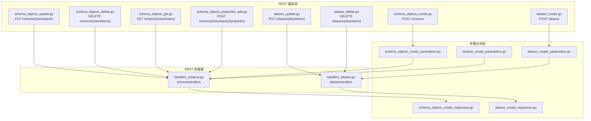
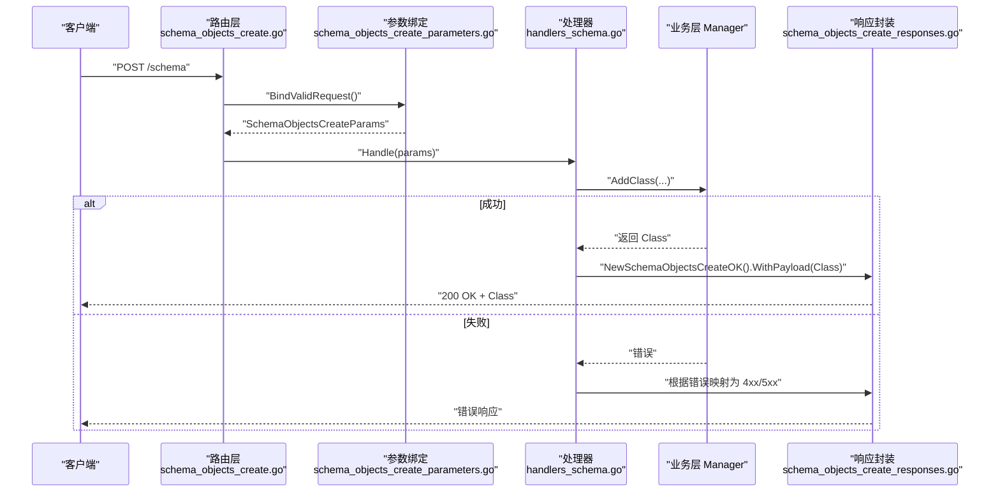
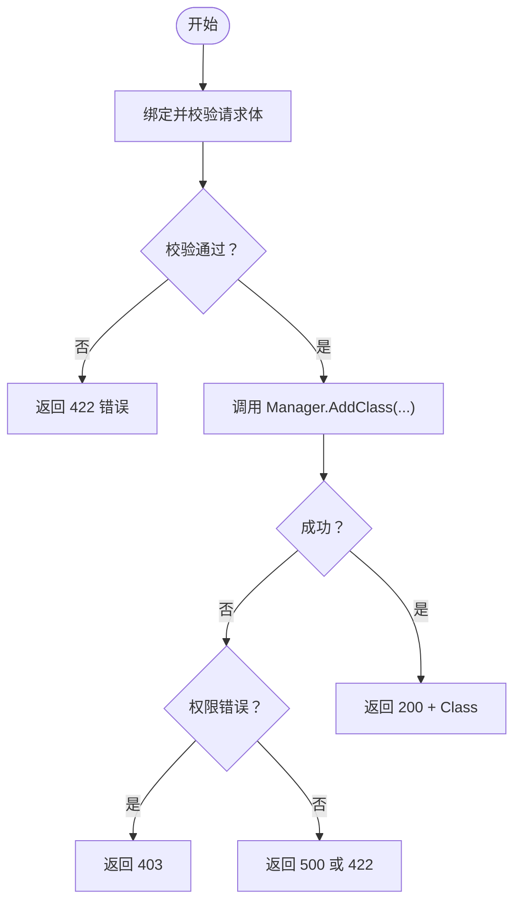
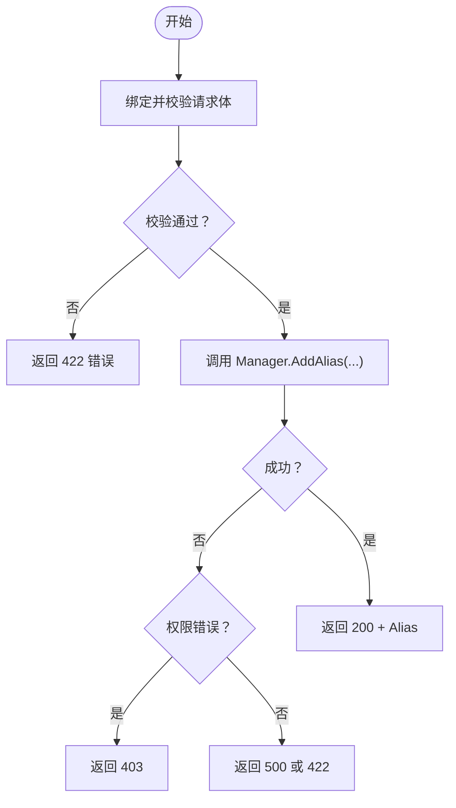
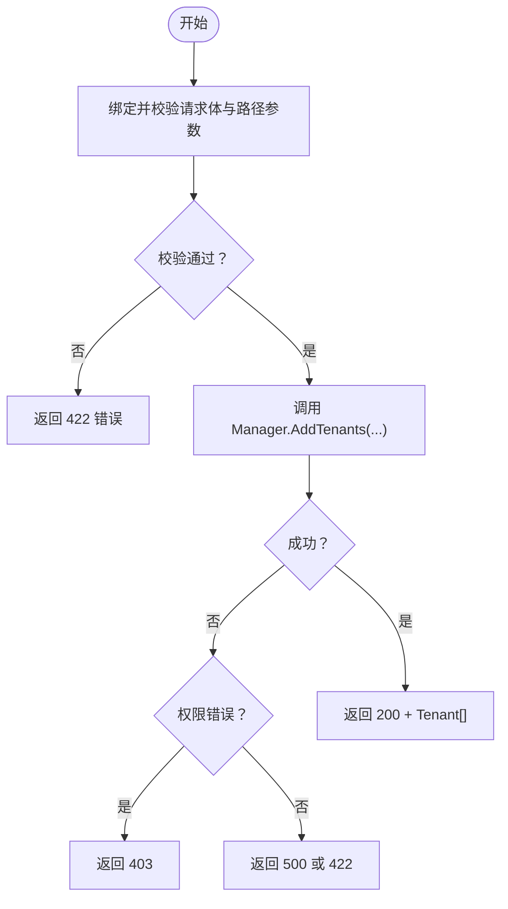
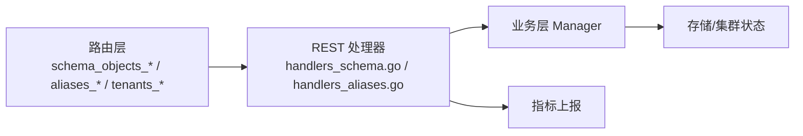

# 模式管理端点

<cite>
**本文引用的文件**
- [handlers_schema.go](file://adapters/handlers/rest/handlers_schema.go)
- [handlers_aliases.go](file://adapters/handlers/rest/handlers_aliases.go)
- [schema_objects_create.go](file://adapters/handlers/rest/operations/schema/schema_objects_create.go)
- [schema_objects_update.go](file://adapters/handlers/rest/operations/schema/schema_objects_update.go)
- [schema_objects_delete.go](file://adapters/handlers/rest/operations/schema/schema_objects_delete.go)
- [schema_objects_get.go](file://adapters/handlers/rest/operations/schema/schema_objects_get.go)
- [schema_objects_properties_add.go](file://adapters/handlers/rest/operations/schema/schema_objects_properties_add.go)
- [aliases_create.go](file://adapters/handlers/rest/operations/schema/aliases_create.go)
- [aliases_update.go](file://adapters/handlers/rest/operations/schema/aliases_update.go)
- [aliases_delete.go](file://adapters/handlers/rest/operations/schema/aliases_delete.go)
- [schema_objects_create_parameters.go](file://adapters/handlers/rest/operations/schema/schema_objects_create_parameters.go)
- [schema_objects_create_responses.go](file://adapters/handlers/rest/operations/schema/schema_objects_create_responses.go)
- [aliases_create_parameters.go](file://adapters/handlers/rest/operations/schema/aliases_create_parameters.go)
- [aliases_create_responses.go](file://adapters/handlers/rest/operations/schema/aliases_create_responses.go)
- [tenants_create_parameters.go](file://adapters/handlers/rest/operations/schema/tenants_create_parameters.go)
- [weaviatapi.go](file://adapters/handlers/rest/operations/weaviate_api.go)
</cite>

## 目录
1. [简介](#简介)
2. [项目结构](#项目结构)
3. [核心组件](#核心组件)
4. [架构总览](#架构总览)
5. [详细组件分析](#详细组件分析)
6. [依赖关系分析](#依赖关系分析)
7. [性能考量](#性能考量)
8. [故障排除指南](#故障排除指南)
9. [结论](#结论)
10. [附录](#附录)

## 简介
本文件系统化梳理 Weaviate 的模式管理 REST API，覆盖以下三大领域：
- 集合（Class）管理：创建、删除、更新、获取、属性追加与分片状态管理
- 别名（Alias）管理：创建、删除、更新、查询
- 多租户（Tenant）管理：创建、删除、更新、查询、存在性检查

文档提供端点清单、请求/响应模型、错误码映射、典型使用流程、性能与兼容性建议以及排障要点，帮助开发者与运维人员高效、安全地进行模式演进。

## 项目结构
Weaviate 的 REST 层采用“路由生成 + 参数绑定 + 处理器”三层结构：
- 路由与处理器注册：在路由层声明端点与方法，绑定到具体处理器
- 参数与响应：通过 Swagger 生成的参数/响应类型，完成请求体校验与响应封装
- 业务处理：REST 层调用 usecases/schema 的 Manager 完成实际逻辑

图表来源
- [schema_objects_create.go](file://adapters/handlers/rest/operations/schema/schema_objects_create.go#L45-L51)
- [schema_objects_update.go](file://adapters/handlers/rest/operations/schema/schema_objects_update.go#L45-L51)
- [schema_objects_delete.go](file://adapters/handlers/rest/operations/schema/schema_objects_delete.go#L45-L51)
- [schema_objects_get.go](file://adapters/handlers/rest/operations/schema/schema_objects_get.go#L45-L51)
- [schema_objects_properties_add.go](file://adapters/handlers/rest/operations/schema/schema_objects_properties_add.go#L45-L51)
- [aliases_create.go](file://adapters/handlers/rest/operations/schema/aliases_create.go#L45-L51)
- [aliases_update.go](file://adapters/handlers/rest/operations/schema/aliases_update.go#L48-L54)
- [aliases_delete.go](file://adapters/handlers/rest/operations/schema/aliases_delete.go#L45-L51)
- [schema_objects_create_parameters.go](file://adapters/handlers/rest/operations/schema/schema_objects_create_parameters.go#L31-L53)
- [schema_objects_create_responses.go](file://adapters/handlers/rest/operations/schema/schema_objects_create_responses.go#L27-L70)
- [aliases_create_parameters.go](file://adapters/handlers/rest/operations/schema/aliases_create_parameters.go#L31-L53)
- [aliases_create_responses.go](file://adapters/handlers/rest/operations/schema/aliases_create_responses.go#L27-L70)
- [tenants_create_parameters.go](file://adapters/handlers/rest/operations/schema/tenants_create_parameters.go#L31-L58)
- [handlers_schema.go](file://adapters/handlers/rest/handlers_schema.go#L36-L56)
- [handlers_aliases.go](file://adapters/handlers/rest/handlers_aliases.go#L87-L106)

章节来源
- [weaviatapi.go](file://adapters/handlers/rest/operations/weaviate_api.go#L1434-L1460)

## 核心组件
- schemaHandlers：封装集合与多租户相关端点的业务处理，统一错误码映射与指标上报
- aliasesHandlers：封装别名相关端点的业务处理，统一错误码映射与指标上报
- 参数/响应生成器：基于 Swagger 规范生成的参数绑定与响应封装类型，确保请求体校验与标准响应格式

章节来源
- [handlers_schema.go](file://adapters/handlers/rest/handlers_schema.go#L31-L34)
- [handlers_aliases.go](file://adapters/handlers/rest/handlers_aliases.go#L30-L33)

## 架构总览
REST 层负责路由、鉴权、参数绑定与响应封装；业务层由 usecases/schema 的 Manager 执行具体逻辑。处理器根据返回值选择合适的 HTTP 状态码，并在必要时返回错误载荷。

图表来源
- [schema_objects_create.go](file://adapters/handlers/rest/operations/schema/schema_objects_create.go#L57-L83)
- [schema_objects_create_parameters.go](file://adapters/handlers/rest/operations/schema/schema_objects_create_parameters.go#L59-L95)
- [handlers_schema.go](file://adapters/handlers/rest/handlers_schema.go#L36-L56)
- [schema_objects_create_responses.go](file://adapters/handlers/rest/operations/schema/schema_objects_create_responses.go#L27-L70)

## 详细组件分析

### 集合（Class）管理

- 端点与用途
  - POST /schema：创建新集合（Class）
  - PUT /schema/{className}：更新现有集合配置（不新增属性）
  - DELETE /schema/{className}：删除集合及其全部数据
  - GET /schema/{className}：获取单个集合定义
  - POST /schema/{className}/properties：向现有集合追加属性
  - GET /schema/{className}/shards：查询分片状态
  - PUT /schema/{className}/shards/{shardName}：更新指定分片状态

- 请求/响应与参数
  - 创建集合
    - 请求体：Class 定义（必填）
    - 响应：200 返回创建成功的 Class；422 表示无效定义；403/500 表示权限或内部错误
  - 更新集合
    - 路径参数：className
    - 请求体：ObjectClass（仅可修改可变配置）
    - 响应：200 返回更新后的 Class；404 表示集合不存在；422/403/500 对应错误
  - 删除集合
    - 路径参数：className
    - 响应：200 表示成功；403/400 对应权限或错误
  - 获取集合
    - 路径参数：className
    - 响应：200 返回 Class；404 表示不存在；403/500 对应权限或内部错误
  - 追加属性
    - 路径参数：className
    - 请求体：属性定义（支持数组与嵌套属性）
    - 响应：200 返回属性定义；422/403 对应错误
  - 分片状态
    - 查询：GET /schema/{className}/shards（可选 tenant 查询参数）
    - 更新：PUT /schema/{className}/shards/{shardName}（请求体含 status）

- 错误码映射（节选）
  - 401 未授权
  - 403 禁止访问
  - 404 未找到
  - 422 请求不可处理（参数/模型校验失败）
  - 500 内部服务器错误

- 典型流程图（创建集合）

图表来源
- [schema_objects_create.go](file://adapters/handlers/rest/operations/schema/schema_objects_create.go#L57-L83)
- [schema_objects_create_parameters.go](file://adapters/handlers/rest/operations/schema/schema_objects_create_parameters.go#L59-L95)
- [handlers_schema.go](file://adapters/handlers/rest/handlers_schema.go#L36-L56)
- [schema_objects_create_responses.go](file://adapters/handlers/rest/operations/schema/schema_objects_create_responses.go#L142-L185)

章节来源
- [schema_objects_create.go](file://adapters/handlers/rest/operations/schema/schema_objects_create.go#L45-L51)
- [schema_objects_update.go](file://adapters/handlers/rest/operations/schema/schema_objects_update.go#L45-L51)
- [schema_objects_delete.go](file://adapters/handlers/rest/operations/schema/schema_objects_delete.go#L45-L51)
- [schema_objects_get.go](file://adapters/handlers/rest/operations/schema/schema_objects_get.go#L45-L51)
- [schema_objects_properties_add.go](file://adapters/handlers/rest/operations/schema/schema_objects_properties_add.go#L45-L51)
- [schema_objects_create_parameters.go](file://adapters/handlers/rest/operations/schema/schema_objects_create_parameters.go#L31-L53)
- [schema_objects_create_responses.go](file://adapters/handlers/rest/operations/schema/schema_objects_create_responses.go#L27-L70)
- [handlers_schema.go](file://adapters/handlers/rest/handlers_schema.go#L58-L146)

### 别名（Alias）管理

- 端点与用途
  - POST /aliases：创建别名，将别名指向某个集合
  - PUT /aliases/{aliasName}：更新别名目标集合
  - DELETE /aliases/{aliasName}：删除别名
  - GET /aliases：列出所有别名
  - GET /aliases/{aliasName}：查询特定别名的映射

- 请求/响应与参数
  - 创建别名
    - 请求体：Alias（包含 alias 名称与目标 class）
    - 响应：200 返回创建的 Alias；422 表示无效请求；403/500 对应权限或内部错误
  - 更新别名
    - 路径参数：aliasName
    - 请求体：AliasesUpdateBody（包含新的 class）
    - 响应：200 返回更新后的别名映射；404 表示别名不存在；422/403 对应错误
  - 删除别名
    - 路径参数：aliasName
    - 响应：204 表示删除成功；404 表示不存在；403/422 对应错误
  - 查询别名
    - GET /aliases：返回 AliasResponse（包含别名列表）
    - GET /aliases/{aliasName}：返回具体别名映射；404 表示不存在；403/500 对应权限或内部错误

- 错误码映射（节选）
  - 401 未授权
  - 403 禁止访问
  - 404 未找到
  - 422 请求不可处理
  - 500 内部服务器错误

- 流程图（创建别名）

图表来源
- [aliases_create.go](file://adapters/handlers/rest/operations/schema/aliases_create.go#L57-L83)
- [aliases_create_parameters.go](file://adapters/handlers/rest/operations/schema/aliases_create_parameters.go#L59-L95)
- [handlers_aliases.go](file://adapters/handlers/rest/handlers_aliases.go#L87-L106)
- [aliases_create_responses.go](file://adapters/handlers/rest/operations/schema/aliases_create_responses.go#L27-L70)

章节来源
- [aliases_create.go](file://adapters/handlers/rest/operations/schema/aliases_create.go#L45-L51)
- [aliases_update.go](file://adapters/handlers/rest/operations/schema/aliases_update.go#L48-L54)
- [aliases_delete.go](file://adapters/handlers/rest/operations/schema/aliases_delete.go#L45-L51)
- [aliases_create_parameters.go](file://adapters/handlers/rest/operations/schema/aliases_create_parameters.go#L31-L53)
- [aliases_create_responses.go](file://adapters/handlers/rest/operations/schema/aliases_create_responses.go#L27-L70)
- [handlers_aliases.go](file://adapters/handlers/rest/handlers_aliases.go#L35-L150)

### 多租户（Tenant）管理

- 端点与用途
  - POST /schema/{className}/tenants：批量创建多租户
  - PUT /schema/{className}/tenants：批量更新多租户
  - DELETE /schema/{className}/tenants：批量删除多租户
  - GET /schema/{className}/tenants：列出多租户
  - GET /schema/{className}/tenants/{tenantName}：查询单个租户
  - HEAD /schema/{className}/tenants/{tenantName}：检查租户是否存在

- 请求/响应与参数
  - 创建租户
    - 路径参数：className
    - 请求体：Tenant 数组（每个元素包含名称等元信息）
    - 响应：200 返回创建的 Tenant 列表；422 表示无效请求；403/500 对应权限或内部错误
  - 更新租户
    - 路径参数：className
    - 请求体：Tenant 数组
    - 响应：200 返回更新后的 Tenant 列表；422/403 对应错误
  - 删除租户
    - 路径参数：className
    - 查询参数：tenants（逗号分隔的租户名列表）
    - 响应：200 表示成功；422/403 对应错误
  - 查询租户
    - GET /schema/{className}/tenants：返回 Tenant 列表；422/403 对应错误
    - GET /schema/{className}/tenants/{tenantName}：返回单个 Tenant；404 表示不存在；422/403 对应错误
  - 存在性检查
    - HEAD /schema/{className}/tenants/{tenantName}：200 表示存在；404 表示不存在；422/403 对应错误

- 错误码映射（节选）
  - 401 未授权
  - 403 禁止访问
  - 404 未找到
  - 422 请求不可处理
  - 500 内部服务器错误

- 流程图（创建租户）

图表来源
- [tenants_create_parameters.go](file://adapters/handlers/rest/operations/schema/tenants_create_parameters.go#L64-L107)
- [handlers_schema.go](file://adapters/handlers/rest/handlers_schema.go#L221-L241)

章节来源
- [handlers_schema.go](file://adapters/handlers/rest/handlers_schema.go#L221-L359)
- [tenants_create_parameters.go](file://adapters/handlers/rest/operations/schema/tenants_create_parameters.go#L31-L58)

## 依赖关系分析
- 路由到处理器
  - 各端点在路由层声明后，通过 NewXxx 方法创建处理器实例，并在 API 注册阶段绑定到具体 HandlerFunc
- 处理器到业务层
  - REST 层处理器统一调用 usecases/schema 的 Manager，按需传入 Principal 与上下文
- 错误处理与指标
  - 统一错误映射：权限错误映射为 403，资源不存在映射为 404，模型/参数错误映射为 422，其他内部错误映射为 500
  - 指标上报：对每类端点维护独立的请求计数指标，区分用户错误与系统错误

图表来源
- [handlers_schema.go](file://adapters/handlers/rest/handlers_schema.go#L361-L390)
- [handlers_aliases.go](file://adapters/handlers/rest/handlers_aliases.go#L152-L164)

章节来源
- [weaviatapi.go](file://adapters/handlers/rest/operations/weaviate_api.go#L1434-L1460)
- [handlers_schema.go](file://adapters/handlers/rest/handlers_schema.go#L361-L390)
- [handlers_aliases.go](file://adapters/handlers/rest/handlers_aliases.go#L152-L164)

## 性能考量
- 批量操作优先：多租户端点支持批量创建/更新/删除，减少往返次数
- 并发一致性：集合更新与租户操作均支持一致性参数，避免读写竞态
- 分片状态：通过分片状态查询与更新接口，可在大规模部署中精细控制数据分布
- 指标监控：REST 层为 schema/aliases 独立维护请求计数指标，便于定位热点与异常

## 故障排除指南
- 401 未授权：确认鉴权凭据有效且具备相应权限
- 403 禁止访问：检查角色/策略是否允许执行该操作
- 404 未找到：确认集合/别名/租户名称拼写正确，或先创建再操作
- 422 请求不可处理：核对请求体结构与字段约束（如 Class/Property/Alias/Tenant 的必填项与命名规范）
- 500 内部服务器错误：查看日志与指标，确认集群健康与磁盘空间

章节来源
- [schema_objects_create_responses.go](file://adapters/handlers/rest/operations/schema/schema_objects_create_responses.go#L72-L185)
- [aliases_create_responses.go](file://adapters/handlers/rest/operations/schema/aliases_create_responses.go#L72-L185)
- [handlers_schema.go](file://adapters/handlers/rest/handlers_schema.go#L44-L52)

## 结论
Weaviate 的模式管理 REST API 提供了从集合、别名到多租户的全链路管理能力。通过严格的参数校验、清晰的错误码映射与可观测性指标，开发者可以安全、可控地进行模式演进。建议在生产环境遵循最小权限原则、使用批量操作提升效率，并结合一致性参数与分片状态接口保障数据一致性与性能。

## 附录

### 端点一览与请求/响应要点
- 集合管理
  - POST /schema：请求体为 Class；响应 200 返回 Class；常见错误 403/422/500
  - PUT /schema/{className}：请求体为 ObjectClass；响应 200 返回更新后的 Class；常见错误 404/422/403/500
  - DELETE /schema/{className}：无请求体；响应 200；常见错误 403/400
  - GET /schema/{className}：响应 200 返回 Class；常见错误 403/500/404
  - POST /schema/{className}/properties：请求体为属性定义；响应 200 返回属性定义；常见错误 422/403
  - GET /schema/{className}/shards：响应 200 返回分片状态；常见错误 403/404
  - PUT /schema/{className}/shards/{shardName}：请求体含 status；响应 200 返回更新体；常见错误 422/403
- 别名管理
  - POST /aliases：请求体为 Alias；响应 200 返回 Alias；常见错误 422/403/500
  - PUT /aliases/{aliasName}：请求体为 AliasesUpdateBody；响应 200 返回别名映射；常见错误 404/422/403
  - DELETE /aliases/{aliasName}：响应 204；常见错误 404/403/422
  - GET /aliases：响应 200 返回 AliasResponse；常见错误 403/500
  - GET /aliases/{aliasName}：响应 200 返回别名映射；常见错误 404/403/500
- 多租户管理
  - POST /schema/{className}/tenants：请求体为 Tenant[]；响应 200 返回 Tenant[]；常见错误 422/403/500
  - PUT /schema/{className}/tenants：请求体为 Tenant[]；响应 200 返回更新后的 Tenant[]
  - DELETE /schema/{className}/tenants：查询参数 tenants；响应 200
  - GET /schema/{className}/tenants：响应 200 返回 Tenant[]
  - GET /schema/{className}/tenants/{tenantName}：响应 200 返回 Tenant；常见错误 404/422/403
  - HEAD /schema/{className}/tenants/{tenantName}：200 存在；404 不存在

章节来源
- [schema_objects_create.go](file://adapters/handlers/rest/operations/schema/schema_objects_create.go#L45-L51)
- [schema_objects_update.go](file://adapters/handlers/rest/operations/schema/schema_objects_update.go#L45-L51)
- [schema_objects_delete.go](file://adapters/handlers/rest/operations/schema/schema_objects_delete.go#L45-L51)
- [schema_objects_get.go](file://adapters/handlers/rest/operations/schema/schema_objects_get.go#L45-L51)
- [schema_objects_properties_add.go](file://adapters/handlers/rest/operations/schema/schema_objects_properties_add.go#L45-L51)
- [aliases_create.go](file://adapters/handlers/rest/operations/schema/aliases_create.go#L45-L51)
- [aliases_update.go](file://adapters/handlers/rest/operations/schema/aliases_update.go#L48-L54)
- [aliases_delete.go](file://adapters/handlers/rest/operations/schema/aliases_delete.go#L45-L51)
- [handlers_schema.go](file://adapters/handlers/rest/handlers_schema.go#L221-L359)
- [handlers_aliases.go](file://adapters/handlers/rest/handlers_aliases.go#L35-L150)