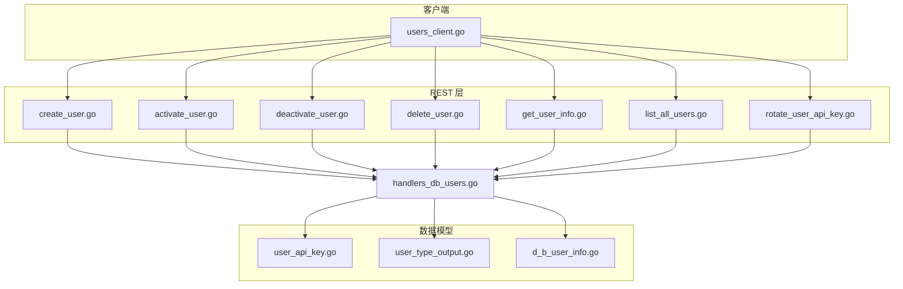
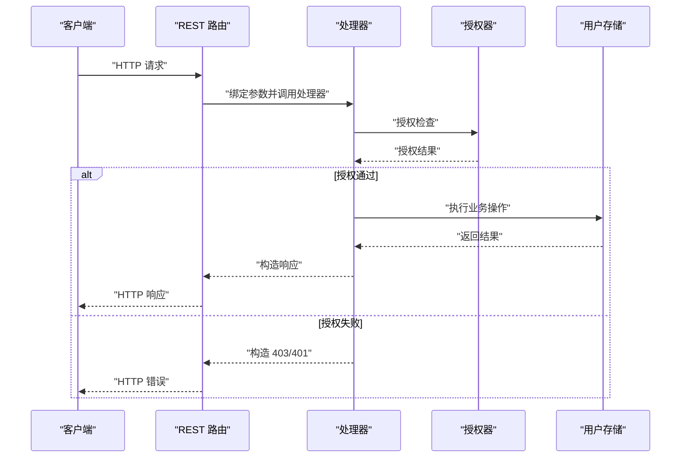
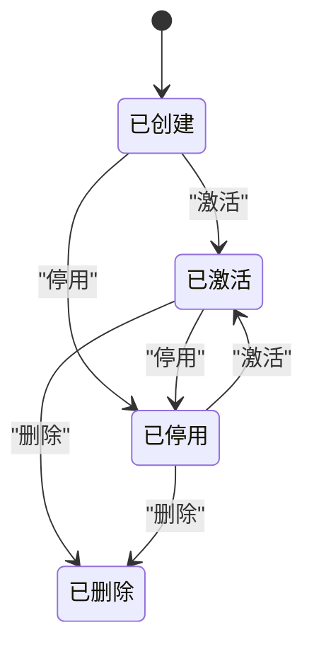
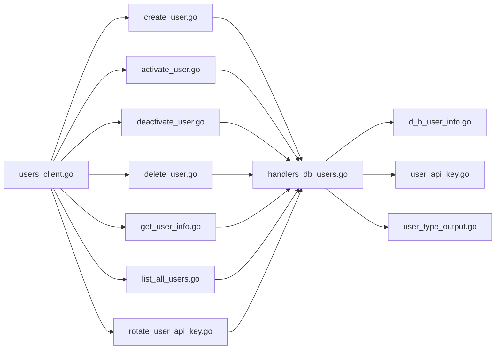

# 用户管理端点

<cite>
**本文引用的文件**
- [handlers_db_users.go](file://adapters/handlers/rest/db_users/handlers_db_users.go)
- [users_client.go](file://client/users/users_client.go)
- [create_user.go](file://adapters/handlers/rest/operations/users/create_user.go)
- [activate_user.go](file://adapters/handlers/rest/operations/users/activate_user.go)
- [deactivate_user.go](file://adapters/handlers/rest/operations/users/deactivate_user.go)
- [delete_user.go](file://adapters/handlers/rest/operations/users/delete_user.go)
- [get_user_info.go](file://adapters/handlers/rest/operations/users/get_user_info.go)
- [list_all_users.go](file://adapters/handlers/rest/operations/users/list_all_users.go)
- [rotate_user_api_key.go](file://adapters/handlers/rest/operations/users/rotate_user_api_key.go)
- [user_api_key.go](file://entities/models/user_api_key.go)
- [user_type_output.go](file://entities/models/user_type_output.go)
- [d_b_user_info.go](file://entities/models/d_b_user_info.go)
- [users_test.go](file://test/acceptance/authz/users_test.go)
- [schema.json](file://openapi-specs/schema.json)
</cite>

## 目录
1. [简介](#简介)
2. [项目结构](#项目结构)
3. [核心组件](#核心组件)
4. [架构总览](#架构总览)
5. [详细组件分析](#详细组件分析)
6. [依赖关系分析](#依赖关系分析)
7. [性能考量](#性能考量)
8. [故障排除指南](#故障排除指南)
9. [结论](#结论)
10. [附录](#附录)

## 简介
本文件系统性梳理 Weaviate 的“用户管理”REST API 端点，覆盖数据库用户（db user）的全生命周期管理：创建、激活、停用、删除、信息查询、API 密钥轮换；并解释用户状态管理、权限继承与安全设置，以及信息获取、隐私保护与访问控制机制。文档同时提供请求/响应要点、最佳实践、安全策略与常见问题排查建议。

## 项目结构
用户管理相关代码主要分布在以下位置：
- REST 操作定义与路由：adapters/handlers/rest/operations/users/*.go
- REST 处理器实现：adapters/handlers/rest/db_users/handlers_db_users.go
- 客户端封装：client/users/*.go
- 数据模型：entities/models/*.go
- OpenAPI 规范：openapi-specs/schema.json
- 接口测试：test/acceptance/authz/users_test.go

图表来源
- [handlers_db_users.go](file://adapters/handlers/rest/db_users/handlers_db_users.go#L70-L92)
- [create_user.go](file://adapters/handlers/rest/operations/users/create_user.go#L50-L56)
- [activate_user.go](file://adapters/handlers/rest/operations/users/activate_user.go#L45-L51)
- [deactivate_user.go](file://adapters/handlers/rest/operations/users/deactivate_user.go#L48-L54)
- [delete_user.go](file://adapters/handlers/rest/operations/users/delete_user.go#L45-L51)
- [get_user_info.go](file://adapters/handlers/rest/operations/users/get_user_info.go#L45-L51)
- [list_all_users.go](file://adapters/handlers/rest/operations/users/list_all_users.go#L45-L51)
- [rotate_user_api_key.go](file://adapters/handlers/rest/operations/users/rotate_user_api_key.go#L45-L51)
- [users_client.go](file://client/users/users_client.go#L26-L61)

章节来源
- [handlers_db_users.go](file://adapters/handlers/rest/db_users/handlers_db_users.go#L70-L92)
- [create_user.go](file://adapters/handlers/rest/operations/users/create_user.go#L50-L56)
- [users_client.go](file://client/users/users_client.go#L26-L61)

## 核心组件
- REST 路由与处理器
  - 创建用户、激活、停用、删除、查询详情、列出所有用户、轮换 API 密钥等均在处理器中实现，并通过授权中间件进行访问控制。
- 客户端封装
  - 提供统一的 Go 客户端方法，映射到各 REST 端点，包含参数校验与错误处理。
- 数据模型
  - 用户 API 密钥、用户类型输出、数据库用户信息等模型定义了请求/响应结构与验证规则。

章节来源
- [handlers_db_users.go](file://adapters/handlers/rest/db_users/handlers_db_users.go#L94-L164)
- [users_client.go](file://client/users/users_client.go#L44-L58)
- [user_api_key.go](file://entities/models/user_api_key.go#L28-L36)
- [user_type_output.go](file://entities/models/user_type_output.go#L28-L52)
- [d_b_user_info.go](file://entities/models/d_b_user_info.go#L51-L62)

## 架构总览
用户管理端点遵循“OpenAPI 定义 → REST 路由 → 处理器 → 授权/过滤 → 数据层”的调用链路。处理器负责：
- 参数校验与格式化
- 授权检查（基于角色与权限）
- 资源过滤（仅返回可读范围内的用户）
- 最近使用时间聚合（跨节点）
- 返回标准化响应模型

图表来源
- [handlers_db_users.go](file://adapters/handlers/rest/db_users/handlers_db_users.go#L195-L249)
- [create_user.go](file://adapters/handlers/rest/operations/users/create_user.go#L62-L89)
- [users_client.go](file://client/users/users_client.go#L109-L143)

## 详细组件分析

### 端点概览与行为
- 创建用户
  - 方法：POST
  - 路径：/users/db/{user_id}
  - 行为：校验用户名格式与唯一性，生成 API 密钥与哈希，持久化用户信息；支持导入静态密钥（仅根用户）。
- 激活用户
  - 方法：POST
  - 路径：/users/db/{user_id}/activate
  - 行为：将已停用用户重新激活。
- 停用用户
  - 方法：POST
  - 路径：/users/db/{user_id}/deactivate
  - 行为：停用用户，可选撤销当前 API 密钥。
- 删除用户
  - 方法：DELETE
  - 路径：/users/db/{user_id}
  - 行为：删除用户，禁止删除当前登录用户；若用户有角色则先撤销。
- 查询用户信息
  - 方法：GET
  - 路径：/users/db/{user_id}
  - 行为：返回用户状态、类型、角色列表；根用户可见部分敏感信息。
- 列出所有用户
  - 方法：GET
  - 路径：/users/db
  - 行为：返回可读范围内的用户列表，支持包含最近使用时间与角色汇总。
- 轮换 API 密钥
  - 方法：POST
  - 路径：/users/db/{user_id}/rotate-key
  - 行为：生成新密钥并替换旧密钥，保持用户标识不变。

章节来源
- [handlers_db_users.go](file://adapters/handlers/rest/db_users/handlers_db_users.go#L314-L386)
- [handlers_db_users.go](file://adapters/handlers/rest/db_users/handlers_db_users.go#L543-L578)
- [handlers_db_users.go](file://adapters/handlers/rest/db_users/handlers_db_users.go#L496-L541)
- [handlers_db_users.go](file://adapters/handlers/rest/db_users/handlers_db_users.go#L452-L494)
- [handlers_db_users.go](file://adapters/handlers/rest/db_users/handlers_db_users.go#L195-L249)
- [handlers_db_users.go](file://adapters/handlers/rest/db_users/handlers_db_users.go#L94-L164)
- [handlers_db_users.go](file://adapters/handlers/rest/db_users/handlers_db_users.go#L388-L423)
- [users_client.go](file://client/users/users_client.go#L109-L143)
- [users_client.go](file://client/users/users_client.go#L145-L184)
- [users_client.go](file://client/users/users_client.go#L186-L225)
- [users_client.go](file://client/users/users_client.go#L227-L266)
- [users_client.go](file://client/users/users_client.go#L314-L348)
- [users_client.go](file://client/users/users_client.go#L355-L389)

### 访问控制与权限继承
- 授权检查
  - 所有端点均在处理器内进行授权检查，依据操作动作与资源范围判断是否允许。
- 资源过滤
  - 列表与查询端点会根据 RBAC 配置对用户进行过滤，确保只返回授权范围内可见的用户。
- 根用户特权
  - 根用户可导入静态密钥、查看敏感信息（如 API 密钥前缀）、查看环境变量创建的用户。
- 禁止操作
  - 不可自停用自身；不可删除当前用户；不可对根用户或管理员名单用户执行某些操作。

章节来源
- [handlers_db_users.go](file://adapters/handlers/rest/db_users/handlers_db_users.go#L195-L249)
- [handlers_db_users.go](file://adapters/handlers/rest/db_users/handlers_db_users.go#L94-L164)
- [handlers_db_users.go](file://adapters/handlers/rest/db_users/handlers_db_users.go#L496-L541)
- [handlers_db_users.go](file://adapters/handlers/rest/db_users/handlers_db_users.go#L452-L494)
- [handlers_db_users.go](file://adapters/handlers/rest/db_users/handlers_db_users.go#L314-L386)

### 用户状态管理与生命周期
- 状态字段
  - active：布尔值，表示用户是否处于激活状态。
  - dbUserType：枚举，取值包括 db_user、db_env_user、oidc。
  - roles：字符串数组，列出用户所属角色名称。
  - createdAt/lastUsedAt：时间戳，用于审计与合规。
- 生命周期流程
  - 创建 → 激活/停用 → 轮换密钥 → 删除（或长期停用）

图表来源
- [handlers_db_users.go](file://adapters/handlers/rest/db_users/handlers_db_users.go#L496-L541)
- [handlers_db_users.go](file://adapters/handlers/rest/db_users/handlers_db_users.go#L543-L578)
- [handlers_db_users.go](file://adapters/handlers/rest/db_users/handlers_db_users.go#L452-L494)

### 权限与安全设置
- 用户名校验
  - 名称长度与字符集受限，防止注入与越权。
- API 密钥轮换
  - 新密钥生成后立即生效，旧密钥失效；用户标识保持不变。
- 最近使用时间
  - 跨节点聚合最近使用时间，容忍部分节点请求失败，避免阻塞主流程。
- 静态用户与环境变量用户
  - 环境变量创建的用户类型为 db_env_user；静态用户导入时需根用户身份。

章节来源
- [handlers_db_users.go](file://adapters/handlers/rest/db_users/handlers_db_users.go#L68-L68)
- [handlers_db_users.go](file://adapters/handlers/rest/db_users/handlers_db_users.go#L251-L312)
- [handlers_db_users.go](file://adapters/handlers/rest/db_users/handlers_db_users.go#L314-L386)
- [handlers_db_users.go](file://adapters/handlers/rest/db_users/handlers_db_users.go#L388-L423)

### 请求/响应要点与示例说明
- 创建用户
  - 请求体支持导入静态密钥与指定创建时间（实验性），响应返回完整 API 密钥。
  - 参考：[CreateUserBody](file://adapters/handlers/rest/operations/users/create_user.go#L91-L102)，[UserAPIKey](file://entities/models/user_api_key.go#L28-L36)
- 查询用户信息
  - 响应包含 active、dbUserType、roles、createdAt、lastUsedAt 等字段。
  - 参考：[DBUserInfo](file://entities/models/d_b_user_info.go#L51-L62)，[UserTypeOutput](file://entities/models/user_type_output.go#L28-L52)
- 列出所有用户
  - 支持 includeLastUsedTime 查询参数；根用户可见更多细节。
  - 参考：[ListAllUsers](file://adapters/handlers/rest/operations/users/list_all_users.go#L45-L51)
- 轮换 API 密钥
  - 成功后返回新密钥；旧密钥立即失效。
  - 参考：[RotateUserAPIKey](file://adapters/handlers/rest/operations/users/rotate_user_api_key.go#L45-L51)

章节来源
- [create_user.go](file://adapters/handlers/rest/operations/users/create_user.go#L91-L102)
- [user_api_key.go](file://entities/models/user_api_key.go#L28-L36)
- [d_b_user_info.go](file://entities/models/d_b_user_info.go#L51-L62)
- [user_type_output.go](file://entities/models/user_type_output.go#L28-L52)
- [list_all_users.go](file://adapters/handlers/rest/operations/users/list_all_users.go#L45-L51)
- [rotate_user_api_key.go](file://adapters/handlers/rest/operations/users/rotate_user_api_key.go#L45-L51)

### 批量操作与审计日志
- 批量能力
  - 列表端点支持一次性获取多个用户的简要信息，便于批量展示与筛选。
- 审计要点
  - createdAt/lastUsedAt 字段可用于审计追踪；根用户可查看更详细信息。
  - 删除前自动撤销角色，避免遗留权限。

章节来源
- [handlers_db_users.go](file://adapters/handlers/rest/db_users/handlers_db_users.go#L94-L164)
- [handlers_db_users.go](file://adapters/handlers/rest/db_users/handlers_db_users.go#L452-L494)

### 测试与行为验证
- 权限与访问控制
  - 测试覆盖了无权限调用被拒绝、根用户特权、按用户过滤等场景。
- 用户生命周期
  - 测试覆盖了创建、停用/激活、轮换密钥、删除等关键路径。
- 过滤与匹配
  - 支持基于通配符的角色权限匹配，限制对特定用户集合的操作。

章节来源
- [users_test.go](file://test/acceptance/authz/users_test.go#L385-L400)
- [users_test.go](file://test/acceptance/authz/users_test.go#L401-L413)
- [users_test.go](file://test/acceptance/authz/users_test.go#L635-L680)

## 依赖关系分析
- 组件耦合
  - REST 路由与处理器强绑定，客户端通过统一接口调用。
  - 处理器依赖授权器与用户存储接口，保证职责分离。
- 外部依赖
  - OpenAPI 规范定义端点契约；测试依赖真实集群环境。
- 循环依赖
  - 未发现循环依赖迹象；模块边界清晰。

图表来源
- [users_client.go](file://client/users/users_client.go#L26-L61)
- [create_user.go](file://adapters/handlers/rest/operations/users/create_user.go#L50-L56)
- [handlers_db_users.go](file://adapters/handlers/rest/db_users/handlers_db_users.go#L70-L92)
- [d_b_user_info.go](file://entities/models/d_b_user_info.go#L51-L62)
- [user_api_key.go](file://entities/models/user_api_key.go#L28-L36)
- [user_type_output.go](file://entities/models/user_type_output.go#L28-L52)

## 性能考量
- 最近使用时间聚合
  - 并发向各节点请求最近使用时间，超时控制与异步更新避免阻塞主流程。
- 节点间一致性
  - 当某节点记录最新时间时，其他节点会异步更新，减少抖动。
- 密钥生成冲突处理
  - 用户标识碰撞概率极低，若发生则重试上限控制，避免死锁。

章节来源
- [handlers_db_users.go](file://adapters/handlers/rest/db_users/handlers_db_users.go#L251-L312)
- [handlers_db_users.go](file://adapters/handlers/rest/db_users/handlers_db_users.go#L425-L450)

## 故障排除指南
- 常见错误与原因
  - 401/403：认证失败或权限不足；检查令牌与角色。
  - 404：用户不存在；确认用户 ID 是否正确。
  - 409：状态冲突（如重复激活/停用）；检查当前状态。
  - 422：请求语义错误（如用户名不合法）；修正参数。
  - 5xx：服务器内部错误；查看日志并重试。
- 典型问题定位
  - 无法轮换密钥：确认用户存在且非静态用户；检查 db user 管理开关。
  - 无法删除用户：确认不是当前登录用户；检查是否存在角色。
  - 无权限查看用户：确认具备 READ 用户权限或为根用户。

章节来源
- [schema.json](file://openapi-specs/schema.json#L5313-L5353)
- [handlers_db_users.go](file://adapters/handlers/rest/db_users/handlers_db_users.go#L388-L423)
- [handlers_db_users.go](file://adapters/handlers/rest/db_users/handlers_db_users.go#L452-L494)

## 结论
Weaviate 的用户管理端点提供了完善的数据库用户生命周期管理能力，结合严格的授权与资源过滤机制，确保在多租户与分布式环境下仍能安全可控地管理用户与权限。通过 API 密钥轮换、审计字段与根用户特权设计，既满足日常运维需求，也兼顾安全与合规要求。

## 附录

### 端点对照表
- 创建用户：POST /users/db/{user_id}
- 激活用户：POST /users/db/{user_id}/activate
- 停用用户：POST /users/db/{user_id}/deactivate
- 删除用户：DELETE /users/db/{user_id}
- 查询用户信息：GET /users/db/{user_id}
- 列出所有用户：GET /users/db
- 轮换 API 密钥：POST /users/db/{user_id}/rotate-key

章节来源
- [users_client.go](file://client/users/users_client.go#L109-L143)
- [users_client.go](file://client/users/users_client.go#L145-L184)
- [users_client.go](file://client/users/users_client.go#L186-L225)
- [users_client.go](file://client/users/users_client.go#L227-L266)
- [users_client.go](file://client/users/users_client.go#L314-L348)
- [users_client.go](file://client/users/users_client.go#L355-L389)