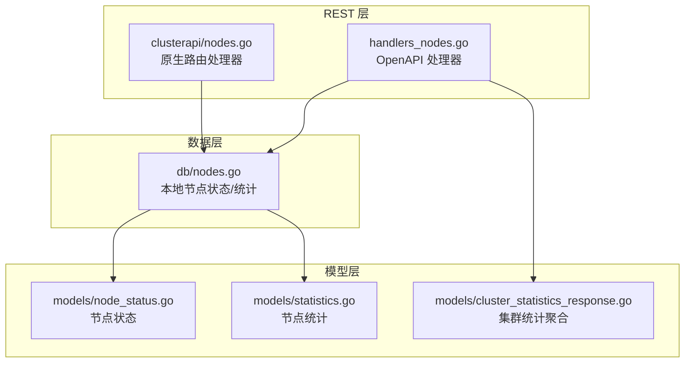
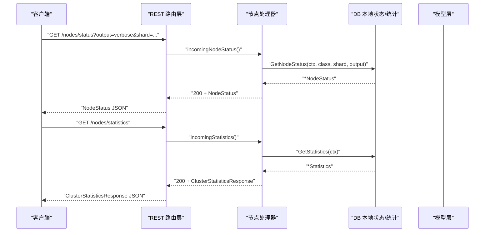
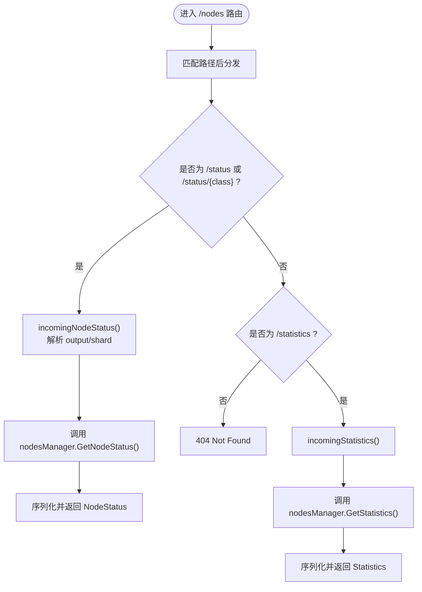
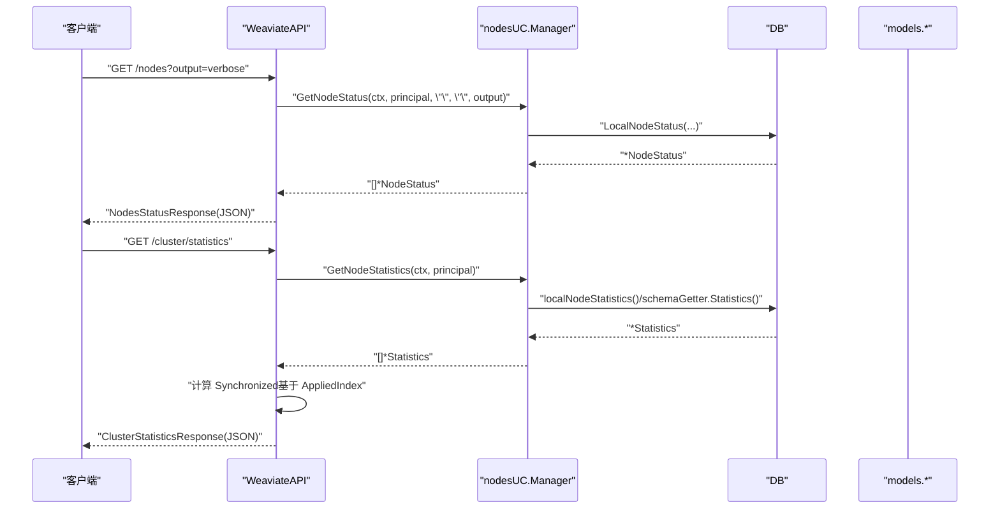
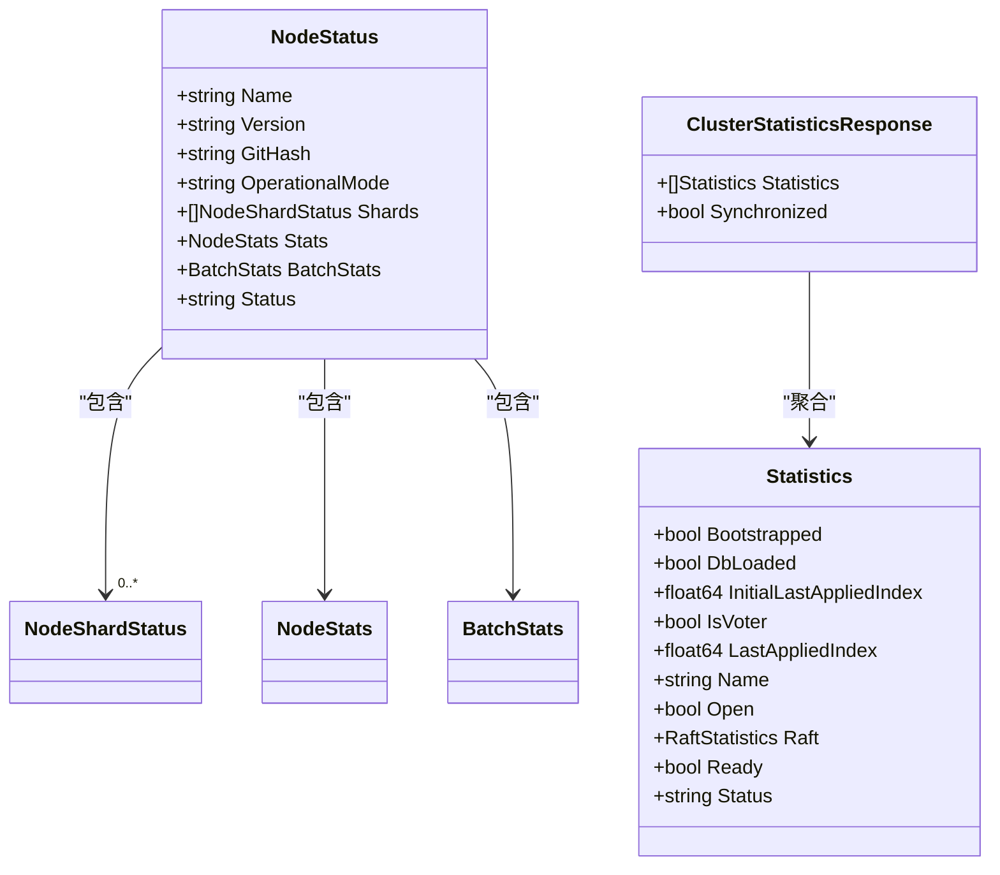
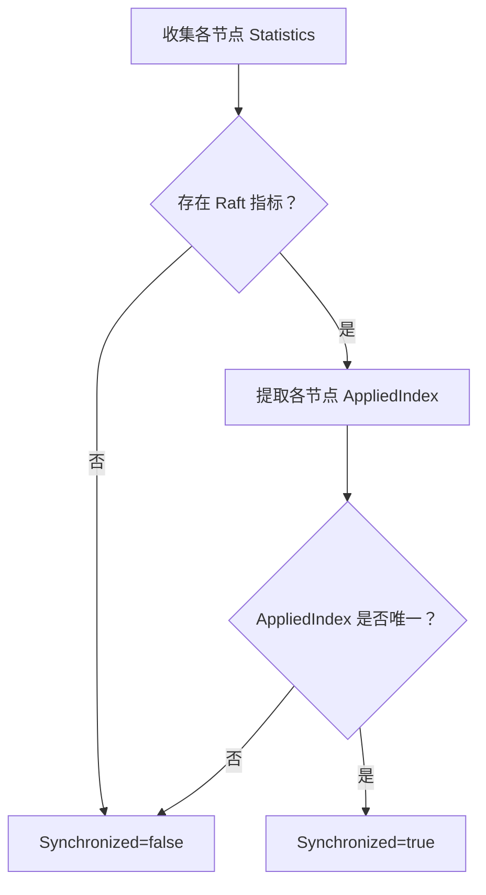
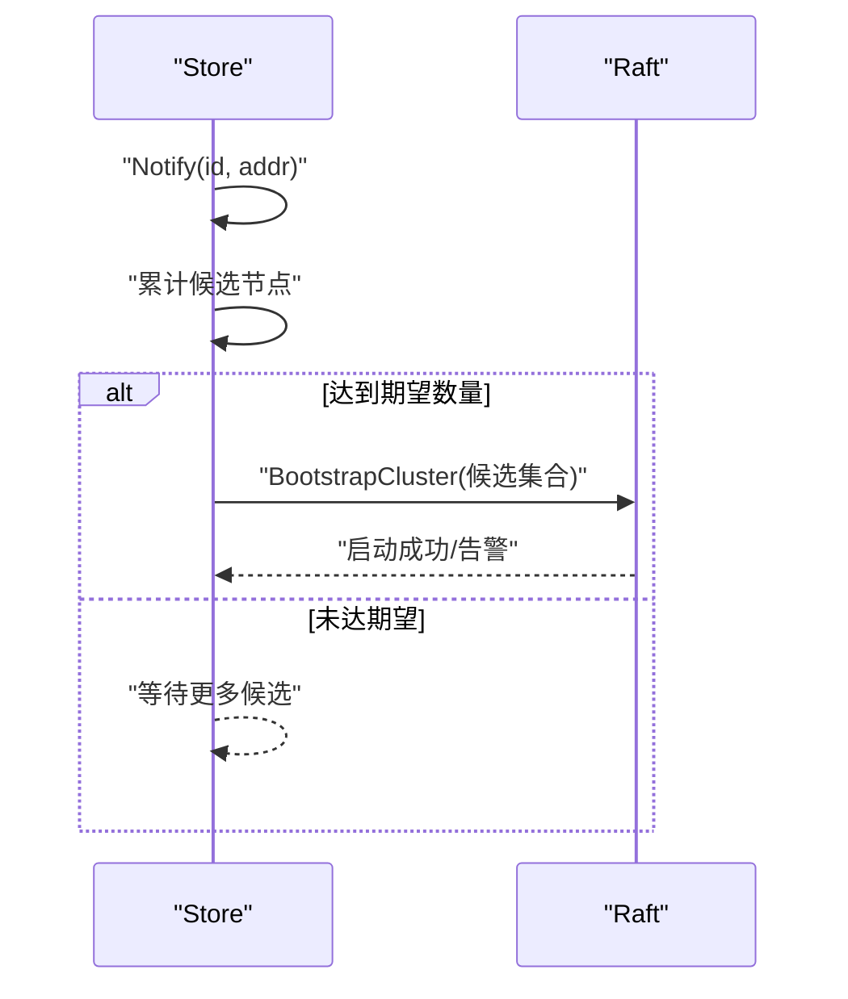
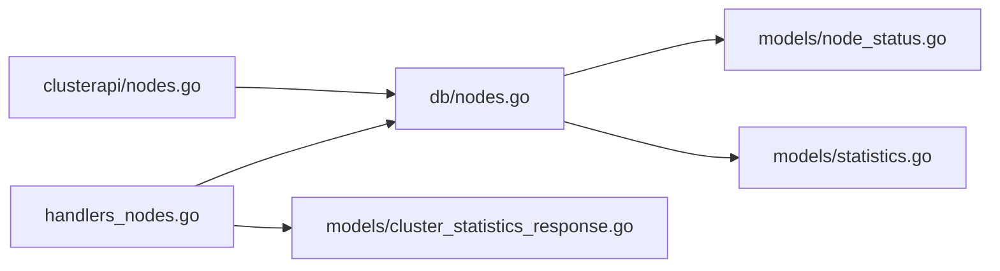

# 集群节点端点

<cite>
**本文引用的文件**
- [adapters/handlers/rest/clusterapi/nodes.go](file://adapters/handlers/rest/clusterapi/nodes.go)
- [adapters/handlers/rest/handlers_nodes.go](file://adapters/handlers/rest/handlers_nodes.go)
- [adapters/repos/db/nodes.go](file://adapters/repos/db/nodes.go)
- [entities/models/node_status.go](file://entities/models/node_status.go)
- [entities/models/node_stats.go](file://entities/models/node_stats.go)
- [entities/models/batch_stats.go](file://entities/models/batch_stats.go)
- [entities/models/statistics.go](file://entities/models/statistics.go)
- [entities/models/cluster_statistics_response.go](file://entities/models/cluster_statistics_response.go)
- [client/cluster/cluster_get_statistics_responses.go](file://client/cluster/cluster_get_statistics_responses.go)
- [cluster/store_cluster_rpc.go](file://cluster/store_cluster_rpc.go)
</cite>

## 目录
1. [简介](#简介)
2. [项目结构](#项目结构)
3. [核心组件](#核心组件)
4. [架构总览](#架构总览)
5. [详细组件分析](#详细组件分析)
6. [依赖关系分析](#依赖关系分析)
7. [性能考量](#性能考量)
8. [故障排查指南](#故障排查指南)
9. [结论](#结论)
10. [附录：请求与响应示例](#附录请求与响应示例)

## 简介
本文件系统性梳理 Weaviate 集群节点管理的 REST API 端点，覆盖以下能力：
- 节点信息查询：单节点状态、按类过滤的节点状态、节点统计信息
- 集群统计与健康：全节点统计聚合、Raft 同步一致性判断
- 节点角色与模式：OperationalMode（读写/只写/只读/扩展）等
- 负载与性能指标：对象数量、分片数量、批处理队列长度与速率
- 故障检测与诊断：节点状态枚举、健康评分、Raft 指标
- 集群拓扑与动态调整：引导与加入、节点发现与配置变更

## 项目结构
Weaviate 的集群节点端点由两套实现共同提供：
- OpenAPI 生成的 REST 处理器：面向客户端 SDK 的标准接口
- 原生 HTTP 路由处理器：直接处理 /nodes 与 /cluster/statistics 请求

图表来源
- [adapters/handlers/rest/clusterapi/nodes.go](file://adapters/handlers/rest/clusterapi/nodes.go#L51-L77)
- [adapters/handlers/rest/handlers_nodes.go](file://adapters/handlers/rest/handlers_nodes.go#L39-L106)
- [adapters/repos/db/nodes.go](file://adapters/repos/db/nodes.go#L87-L122)
- [entities/models/node_status.go](file://entities/models/node_status.go#L30-L60)
- [entities/models/statistics.go](file://entities/models/statistics.go#L29-L73)
- [entities/models/cluster_statistics_response.go](file://entities/models/cluster_statistics_response.go#L28-L38)

章节来源
- [adapters/handlers/rest/clusterapi/nodes.go](file://adapters/handlers/rest/clusterapi/nodes.go#L47-L78)
- [adapters/handlers/rest/handlers_nodes.go](file://adapters/handlers/rest/handlers_nodes.go#L126-L139)

## 核心组件
- 原生路由节点端点
  - GET /nodes/status 或 /nodes/status/{className}
  - GET /nodes/statistics
- OpenAPI 节点端点
  - GET /nodes
  - GET /nodes/{className}
  - GET /cluster/statistics

这些端点返回统一的数据模型：
- 节点状态：包含节点名、版本、Git Hash、OperationalMode、Shards、Stats、BatchStats、Status
- 节点统计：包含 Raft 统计、健康状态、是否已引导、是否开放等
- 集群统计：所有节点的统计集合与 Synchronized 标志

章节来源
- [adapters/handlers/rest/clusterapi/nodes.go](file://adapters/handlers/rest/clusterapi/nodes.go#L51-L77)
- [adapters/handlers/rest/handlers_nodes.go](file://adapters/handlers/rest/handlers_nodes.go#L39-L106)
- [entities/models/node_status.go](file://entities/models/node_status.go#L30-L60)
- [entities/models/statistics.go](file://entities/models/statistics.go#L29-L73)
- [entities/models/cluster_statistics_response.go](file://entities/models/cluster_statistics_response.go#L28-L38)

## 架构总览
下图展示从客户端到数据层的调用链路与关键决策点。

图表来源
- [adapters/handlers/rest/clusterapi/nodes.go](file://adapters/handlers/rest/clusterapi/nodes.go#L80-L146)
- [adapters/handlers/rest/handlers_nodes.go](file://adapters/handlers/rest/handlers_nodes.go#L39-L106)
- [adapters/repos/db/nodes.go](file://adapters/repos/db/nodes.go#L87-L122)

## 详细组件分析

### 原生路由节点端点
- 路径与方法
  - GET /nodes/status 或 /nodes/status/{className}
  - GET /nodes/statistics
- 查询参数
  - output：输出级别（如 minimal/verbose）
  - shard：可选，按分片过滤
- 返回
  - 节点状态 JSON 或节点统计 JSON
- 错误处理
  - 方法不支持：405
  - 路径不存在：404
  - 参数错误：400
  - 序列化失败：500

图表来源
- [adapters/handlers/rest/clusterapi/nodes.go](file://adapters/handlers/rest/clusterapi/nodes.go#L51-L77)
- [adapters/handlers/rest/clusterapi/nodes.go](file://adapters/handlers/rest/clusterapi/nodes.go#L80-L146)

章节来源
- [adapters/handlers/rest/clusterapi/nodes.go](file://adapters/handlers/rest/clusterapi/nodes.go#L51-L77)
- [adapters/handlers/rest/clusterapi/nodes.go](file://adapters/handlers/rest/clusterapi/nodes.go#L80-L146)

### OpenAPI 节点端点
- 端点
  - GET /nodes
  - GET /nodes/{className}
  - GET /cluster/statistics
- 输出
  - /nodes 与 /nodes/{className} 返回 NodesStatusResponse（包含多个节点状态）
  - /cluster/statistics 返回 ClusterStatisticsResponse（包含各节点统计与 Synchronized 标志）

图表来源
- [adapters/handlers/rest/handlers_nodes.go](file://adapters/handlers/rest/handlers_nodes.go#L39-L106)
- [adapters/repos/db/nodes.go](file://adapters/repos/db/nodes.go#L311-L338)

章节来源
- [adapters/handlers/rest/handlers_nodes.go](file://adapters/handlers/rest/handlers_nodes.go#L39-L106)
- [adapters/repos/db/nodes.go](file://adapters/repos/db/nodes.go#L311-L338)

### 数据模型与字段语义
- 节点状态 NodeStatus
  - 名称、版本、Git Hash、OperationalMode、Shards、Stats、BatchStats、Status
- 节点统计 Statistics
  - Raft 统计、健康状态、是否已引导、是否开放、领导者信息等
- 集群统计聚合 ClusterStatisticsResponse
  - 所有节点统计数组与 Synchronized 标志（用于判断 Raft 同步一致性）

图表来源
- [entities/models/node_status.go](file://entities/models/node_status.go#L30-L60)
- [entities/models/statistics.go](file://entities/models/statistics.go#L29-L73)
- [entities/models/cluster_statistics_response.go](file://entities/models/cluster_statistics_response.go#L28-L38)

章节来源
- [entities/models/node_status.go](file://entities/models/node_status.go#L30-L60)
- [entities/models/statistics.go](file://entities/models/statistics.go#L29-L73)
- [entities/models/cluster_statistics_response.go](file://entities/models/cluster_statistics_response.go#L28-L38)

### 节点角色识别与负载指标
- 角色识别
  - OperationalMode：ReadWrite / WriteOnly / ReadOnly / ScaleOut
- 负载与性能
  - NodeStats：对象总数、分片数量（verbose 输出）
  - BatchStats：批处理队列长度、每秒处理速率
- 健康状态
  - NodeStatus.Status / Statistics.Status：HEALTHY / UNHEALTHY / UNAVAILABLE / TIMEOUT
  - 集群健康评分：影响节点状态与统计结果

章节来源
- [entities/models/node_status.go](file://entities/models/node_status.go#L44-L56)
- [entities/models/node_stats.go](file://entities/models/node_stats.go#L26-L36)
- [entities/models/batch_stats.go](file://entities/models/batch_stats.go#L26-L36)
- [adapters/repos/db/nodes.go](file://adapters/repos/db/nodes.go#L92-L122)

### 集群健康与同步一致性
- 健康判定
  - 基于集群健康评分与 Raft 指标综合评估
- 同步一致性
  - 通过比较各节点 Raft.AppliedIndex 判断是否一致
  - ClusterStatisticsResponse.Synchronized 为 true 表示一致

图表来源
- [adapters/handlers/rest/handlers_nodes.go](file://adapters/handlers/rest/handlers_nodes.go#L88-L102)
- [entities/models/statistics.go](file://entities/models/statistics.go#L64-L65)

章节来源
- [adapters/handlers/rest/handlers_nodes.go](file://adapters/handlers/rest/handlers_nodes.go#L88-L102)

### 集群拓扑与动态调整
- 引导与加入
  - 通过 Store.Notify 收集候选节点，达到期望数量后 BootstrapCluster
- 节点发现
  - 基于配置与候选集合进行 Raft 配置更新
- 动态调整
  - 通过 Raft 配置变更实现节点增删与角色调整

图表来源
- [cluster/store_cluster_rpc.go](file://cluster/store_cluster_rpc.go#L53-L102)

章节来源
- [cluster/store_cluster_rpc.go](file://cluster/store_cluster_rpc.go#L53-L102)

## 依赖关系分析
- 路由层依赖数据层以获取节点状态与统计
- 数据层依赖 schemaGetter 获取统计与健康评分，并构造 NodeStatus/Statistics
- 模型层定义了统一的响应结构，确保前后端契约稳定

图表来源
- [adapters/handlers/rest/clusterapi/nodes.go](file://adapters/handlers/rest/clusterapi/nodes.go#L80-L146)
- [adapters/handlers/rest/handlers_nodes.go](file://adapters/handlers/rest/handlers_nodes.go#L39-L106)
- [adapters/repos/db/nodes.go](file://adapters/repos/db/nodes.go#L87-L122)
- [entities/models/node_status.go](file://entities/models/node_status.go#L30-L60)
- [entities/models/statistics.go](file://entities/models/statistics.go#L29-L73)
- [entities/models/cluster_statistics_response.go](file://entities/models/cluster_statistics_response.go#L28-L38)

章节来源
- [adapters/handlers/rest/clusterapi/nodes.go](file://adapters/handlers/rest/clusterapi/nodes.go#L80-L146)
- [adapters/handlers/rest/handlers_nodes.go](file://adapters/handlers/rest/handlers_nodes.go#L39-L106)
- [adapters/repos/db/nodes.go](file://adapters/repos/db/nodes.go#L87-L122)

## 性能考量
- 输出粒度控制
  - 使用 output=minimal/verbose 控制返回字段规模，避免 verbose 下大量分片明细带来的传输与解析开销
- 批处理队列监控
  - 关注 BatchStats.queueLength 与 ratePerSecond，过高的排队长度或过低的速率可能指示写入压力或资源瓶颈
- 分片数量与对象数
  - NodeStats.objectCount 与 shardCount 反映负载分布，有助于定位热点分片
- Raft 同步一致性
  - Synchronized=false 时应优先排查网络分区、落后节点或 Raft 配置变更未完成

## 故障排查指南
- 常见错误码
  - 400：参数无效（如 output 不合法）
  - 401/403：认证/授权失败
  - 422：语义校验失败
  - 500：服务内部错误
- 健康状态异常
  - NodeStatus.Status / Statistics.Status 非 HEALTHY 时，检查日志与 Raft 指标
- 同步不一致
  - Synchronized=false：核对各节点 AppliedIndex 是否一致，排查落后节点
- 引导问题
  - Store.Notify 未触发 Bootstrap：确认候选节点数量与地址配置

章节来源
- [client/cluster/cluster_get_statistics_responses.go](file://client/cluster/cluster_get_statistics_responses.go#L35-L69)

## 结论
Weaviate 的集群节点端点提供了统一、可扩展的节点与集群视图，结合 OperationalMode、BatchStats、NodeStats 与 Raft 统计，能够支撑运维侧的健康监控、负载分析与故障定位。通过合理选择输出粒度与关注关键指标，可在大规模集群中实现高效可观测与快速排障。

## 附录：请求与响应示例

- GET /nodes/status
  - 请求参数：output（可选），shard（可选）
  - 响应体：NodeStatus（包含名称、版本、Git Hash、OperationalMode、Shards、Stats、BatchStats、Status）
  - 示例字段参考
    - 名称与版本：参见 [entities/models/node_status.go](file://entities/models/node_status.go#L41-L59)
    - 分片与统计：参见 [entities/models/node_status.go](file://entities/models/node_status.go#L48-L52)
    - 批处理统计：参见 [entities/models/batch_stats.go](file://entities/models/batch_stats.go#L26-L36)

- GET /nodes/status/{className}
  - 请求参数：output（可选），shard（可选）
  - 响应体：NodeStatus（按类过滤）

- GET /nodes
  - 请求参数：output（可选）
  - 响应体：NodesStatusResponse（包含多个节点状态）

- GET /nodes/{className}
  - 请求参数：output（可选），shard（可选）
  - 响应体：NodesStatusResponse（按类过滤）

- GET /cluster/statistics
  - 请求参数：无
  - 响应体：ClusterStatisticsResponse（包含 statistics 数组与 Synchronized 标志）
  - 示例字段参考
    - statistics 数组：参见 [entities/models/cluster_statistics_response.go](file://entities/models/cluster_statistics_response.go#L34-L37)
    - Synchronized：参见 [adapters/handlers/rest/handlers_nodes.go](file://adapters/handlers/rest/handlers_nodes.go#L99-L102)

- Raft 统计与健康
  - Statistics.Raft 包含 AppliedIndex、CommitIndex、State、Term 等
  - 健康状态枚举：参见 [entities/models/statistics.go](file://entities/models/statistics.go#L70-L72)
  - 节点状态枚举：参见 [entities/models/node_status.go](file://entities/models/node_status.go#L54-L56)

- 错误响应
  - 401/403/422/500 的语义与载荷：参见 [client/cluster/cluster_get_statistics_responses.go](file://client/cluster/cluster_get_statistics_responses.go#L35-L69)