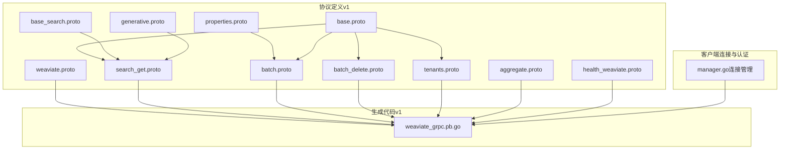
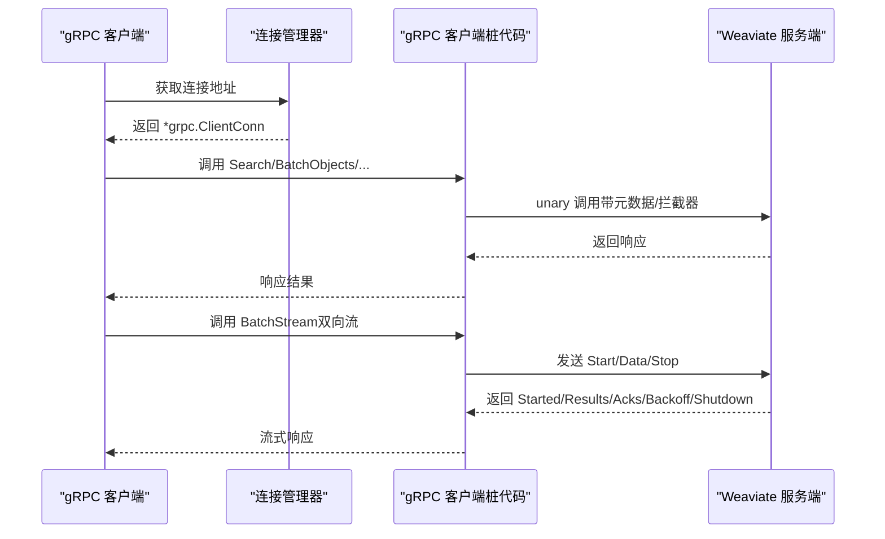
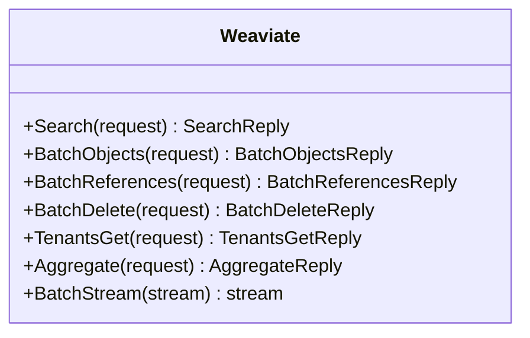
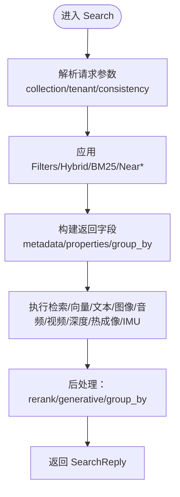
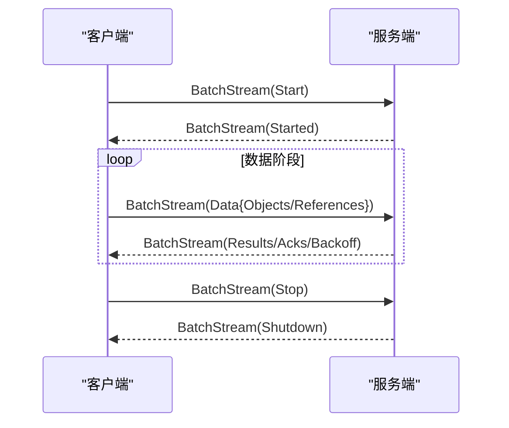
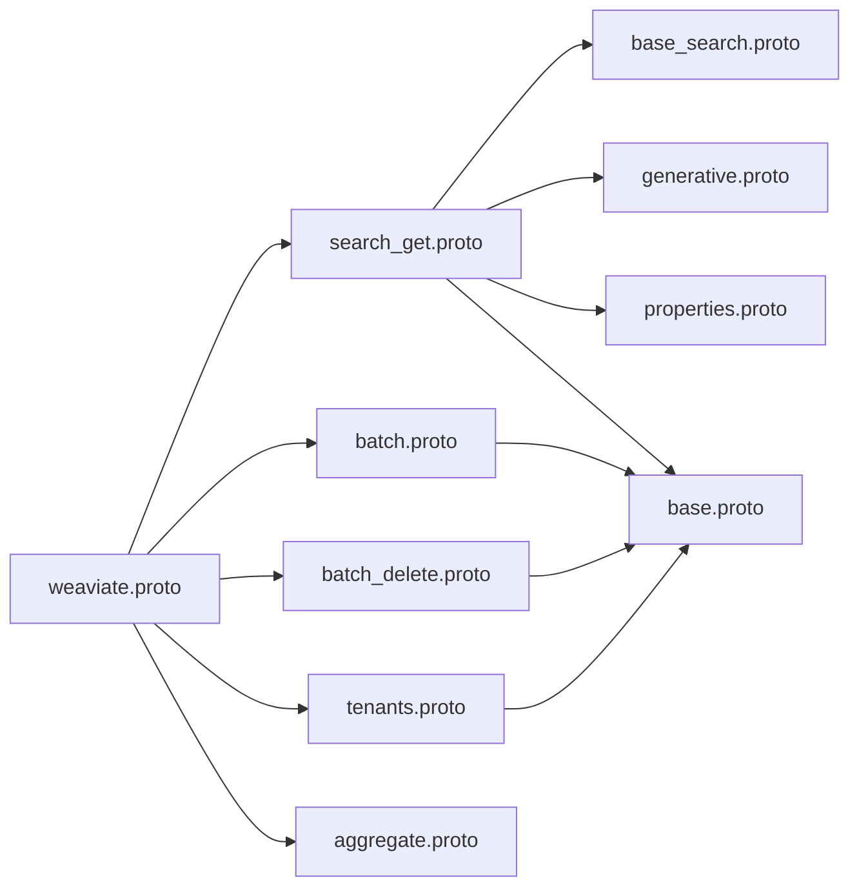

# gRPC API 端点

<cite>
**本文引用的文件**
- [batch.proto（v1）](file://grpc/proto/v1/batch.proto)
- [search_get.proto（v1）](file://grpc/proto/v1/search_get.proto)
- [weaviate.proto（v1）](file://grpc/proto/v1/weaviate.proto)
- [base.proto（v1）](file://grpc/proto/v1/base.proto)
- [base_search.proto（v1）](file://grpc/proto/v1/base_search.proto)
- [generative.proto（v1）](file://grpc/proto/v1/generative.proto)
- [properties.proto（v1）](file://grpc/proto/v1/properties.proto)
- [batch_delete.proto（v1）](file://grpc/proto/v1/batch_delete.proto)
- [tenants.proto（v1）](file://grpc/proto/v1/tenants.proto)
- [health_weaviate.proto（v1）](file://grpc/proto/v1/health_weaviate.proto)
- [weaviate_grpc.pb.go（v1）](file://grpc/generated/protocol/v1/weaviate_grpc.pb.go)
- [manager.go（连接管理）](file://grpc/conn/manager.go)
</cite>

## 目录
1. [简介](#简介)
2. [项目结构](#项目结构)
3. [核心组件](#核心组件)
4. [架构总览](#架构总览)
5. [详细组件分析](#详细组件分析)
6. [依赖关系分析](#依赖关系分析)
7. [性能考量](#性能考量)
8. [故障排查指南](#故障排查指南)
9. [结论](#结论)
10. [附录：调用示例与迁移指南](#附录调用示例与迁移指南)

## 简介
本文件为 Weaviate 的 gRPC API 端点提供权威规范文档，覆盖 v0 与 v1 版本的服务差异、Protocol Buffers 消息定义、字段编号与版本兼容性、双向流式通信与单次调用/流式响应的使用场景、认证机制与拦截器、以及与 REST API 的性能对比与适用场景。文档同时给出高并发下的最佳实践与迁移指南，帮助集成开发者快速、正确地使用 Weaviate 的 gRPC 接口。

## 项目结构
Weaviate 的 gRPC 协议定义位于 grpc/proto/v1，生成的 Go 客户端与服务端桩代码位于 grpc/generated/protocol/v1；连接管理与认证拦截器位于 grpc/conn。

**图表来源**
- [weaviate.proto（v1）](file://grpc/proto/v1/weaviate.proto#L1-L24)
- [weaviate_grpc.pb.go（v1）](file://grpc/generated/protocol/v1/weaviate_grpc.pb.go#L1-L342)
- [manager.go（连接管理）](file://grpc/conn/manager.go#L1-L385)

**章节来源**
- [weaviate.proto（v1）](file://grpc/proto/v1/weaviate.proto#L1-L24)
- [weaviate_grpc.pb.go（v1）](file://grpc/generated/protocol/v1/weaviate_grpc.pb.go#L1-L342)
- [manager.go（连接管理）](file://grpc/conn/manager.go#L1-L385)

## 核心组件
- Weaviate 服务（v1）：提供 Search、BatchObjects、BatchReferences、BatchDelete、TenantsGet、Aggregate 与 BatchStream 共 7 个 RPC 方法。
- 基础类型与搜索能力：ConsistencyLevel、Filters、Near* 搜索族、Targets、Hybrid、向量多态等。
- 批处理与流式批处理：BatchObjects、BatchReferences、BatchDelete 与 BatchStream（双向流）。
- 聚合与生成式检索：Aggregate、GenerativeSearch 及各提供商参数。
- 多租户：TenantsGet 请求与响应。
- 健康检查：WeaviateHealthCheckRequest/Response（兼容 Google 健康检查枚举）。
- 连接管理与认证：连接池、空闲回收、Basic 认证拦截器（Unary 与 Stream）。

**章节来源**
- [weaviate.proto（v1）](file://grpc/proto/v1/weaviate.proto#L15-L23)
- [base.proto（v1）](file://grpc/proto/v1/base.proto#L10-L15)
- [base_search.proto（v1）](file://grpc/proto/v1/base_search.proto#L75-L159)
- [generative.proto（v1）](file://grpc/proto/v1/generative.proto#L11-L32)
- [batch_delete.proto（v1）](file://grpc/proto/v1/batch_delete.proto#L11-L26)
- [tenants.proto（v1）](file://grpc/proto/v1/tenants.proto#L26-L47)
- [health_weaviate.proto（v1）](file://grpc/proto/v1/health_weaviate.proto#L46-L60)
- [weaviate_grpc.pb.go（v1）](file://grpc/generated/protocol/v1/weaviate_grpc.pb.go#L18-L38)
- [manager.go（连接管理）](file://grpc/conn/manager.go#L336-L384)

## 架构总览
Weaviate 的 gRPC 服务通过 Protocol Buffers 定义接口契约，生成强类型的客户端与服务端桩代码。客户端通过连接管理器复用连接、设置超时回收策略，并可注入 Basic 认证拦截器。服务端实现 WeaviateServer 接口，支持 Unary 与双向流式方法。

**图表来源**
- [weaviate_grpc.pb.go（v1）](file://grpc/generated/protocol/v1/weaviate_grpc.pb.go#L28-L120)
- [manager.go（连接管理）](file://grpc/conn/manager.go#L75-L102)
- [weaviate.proto（v1）](file://grpc/proto/v1/weaviate.proto#L22-L22)

## 详细组件分析

### Weaviate 服务（v1）与 RPC 方法
- Search：全文/混合/向量/引用等多模态检索，支持分页、排序、聚合、生成式增强与 rerank。
- BatchObjects：批量写入对象，支持一致性级别与多向量。
- BatchReferences：批量创建引用。
- BatchDelete：按过滤条件批量删除，支持一致性级别与租户。
- TenantsGet：获取多租户状态。
- Aggregate：按属性进行聚合统计，支持分组与限制。
- BatchStream：双向流式批处理，支持 Start/Data/Stop 与回压通知。

**图表来源**
- [weaviate.proto（v1）](file://grpc/proto/v1/weaviate.proto#L15-L23)

**章节来源**
- [weaviate.proto（v1）](file://grpc/proto/v1/weaviate.proto#L15-L23)
- [weaviate_grpc.pb.go（v1）](file://grpc/generated/protocol/v1/weaviate_grpc.pb.go#L28-L120)

### 搜索与查询（SearchRequest/SearchReply）
- 查询参数：collection、tenant、consistency_level、limit/offset/after、sort_by、filters、hybrid/bm25/near_*、near_* 搜索族、metadata/properties 请求体、group_by、generative/rerank。
- 结果：took、results、group_by_results、generative_grouped_results。

**图表来源**
- [search_get.proto（v1）](file://grpc/proto/v1/search_get.proto#L14-L55)
- [base_search.proto（v1）](file://grpc/proto/v1/base_search.proto#L48-L159)
- [generative.proto（v1）](file://grpc/proto/v1/generative.proto#L11-L32)

**章节来源**
- [search_get.proto（v1）](file://grpc/proto/v1/search_get.proto#L14-L189)
- [base_search.proto（v1）](file://grpc/proto/v1/base_search.proto#L1-L166)
- [generative.proto（v1）](file://grpc/proto/v1/generative.proto#L1-L368)

### 批处理与流式批处理（BatchObjects/BatchReferences/BatchDelete/BatchStream）
- BatchObjects/BatchReferences：单次调用，返回错误索引与耗时。
- BatchDelete：支持 verbose/dry_run，返回 took、失败数、匹配数、成功数与对象级错误。
- BatchStream：双向流，消息类型包含 Start/Data/Stop，Data 包含 Objects/References，响应类型包含 Results/Acks/Backoff/ShuttingDown/Shutdown/OutOfMemory。

**图表来源**
- [batch.proto（v1）](file://grpc/proto/v1/batch.proto#L22-L89)
- [batch_delete.proto（v1）](file://grpc/proto/v1/batch_delete.proto#L11-L26)

**章节来源**
- [batch.proto（v1）](file://grpc/proto/v1/batch.proto#L12-L157)
- [batch_delete.proto（v1）](file://grpc/proto/v1/batch_delete.proto#L11-L33)

### 基础类型与向量/数组
- ConsistencyLevel：ONE/QUORUM/ALL。
- Filters：支持等值、范围、逻辑组合、地理位置、数组包含/全包含/无交集、否定等。
- 向量多态：Vectors 支持单/多向量与字节编码，Near* 搜索支持 targets/vector_for_targets/vectors。
- 数组属性：NumberArrayProperties/IntArrayProperties/TextArrayProperties/BooleanArrayProperties/ObjectProperties/ObjectArrayProperties/空列表标识。

**章节来源**
- [base.proto（v1）](file://grpc/proto/v1/base.proto#L10-L15)
- [base.proto（v1）](file://grpc/proto/v1/base.proto#L78-L144)
- [base_search.proto（v1）](file://grpc/proto/v1/base_search.proto#L32-L86)
- [properties.proto（v1）](file://grpc/proto/v1/properties.proto#L11-L95)

### 聚合（Aggregate）
- 支持整型/数值/文本/布尔/日期/引用聚合，可 group_by，可限制对象/结果数量，支持 near_* 与 hybrid 等筛选。
- 返回 Single/Grouped 两种结果结构，包含计数、均值、中位数、众数、最值、TopN 等。

**章节来源**
- [aggregate.proto（v1）](file://grpc/proto/v1/aggregate.proto#L12-L206)

### 多租户（TenantsGet）
- 请求支持按名称列表或扩展参数；响应包含 took 与租户列表，每个租户含活动状态。

**章节来源**
- [tenants.proto（v1）](file://grpc/proto/v1/tenants.proto#L26-L47)

### 健康检查（WeaviateHealthCheck）
- 与标准 Google 健康检查兼容，返回 UNKNOWN/SERVING/NOT_SERVING。

**章节来源**
- [health_weaviate.proto（v1）](file://grpc/proto/v1/health_weaviate.proto#L46-L60)

## 依赖关系分析
- v1 服务通过 weaviate.proto 聚合多个子模块（search_get、batch、batch_delete、tenants、aggregate），并在 weaviate_grpc.pb.go 中注册服务描述与处理器。
- 基础类型（base.proto）被 search_get、batch、batch_delete 广泛复用。
- 生成代码与协议定义一一对应，确保字段编号与消息结构稳定。

**图表来源**
- [weaviate.proto（v1）](file://grpc/proto/v1/weaviate.proto#L5-L9)
- [search_get.proto（v1）](file://grpc/proto/v1/search_get.proto#L5-L8)
- [batch.proto（v1）](file://grpc/proto/v1/batch.proto#L5-L6)
- [batch_delete.proto（v1）](file://grpc/proto/v1/batch_delete.proto#L5-L5)
- [tenants.proto（v1）](file://grpc/proto/v1/tenants.proto#L3-L3)
- [aggregate.proto（v1）](file://grpc/proto/v1/aggregate.proto#L5-L6)

**章节来源**
- [weaviate.proto（v1）](file://grpc/proto/v1/weaviate.proto#L1-L24)
- [weaviate_grpc.pb.go（v1）](file://grpc/generated/protocol/v1/weaviate_grpc.pb.go#L300-L341)

## 性能考量
- gRPC 相比 REST 的优势
  - 更低的序列化开销与更小的消息体积（Protocol Buffers）。
  - 复用 TCP 连接，减少握手与 TLS 开销。
  - 流式传输适合高吞吐批处理（BatchStream）。
  - 双向流支持服务端回压（Backoff/Acks）与优雅关闭（ShuttingDown/Shutdown）。
- 连接管理
  - 连接池上限与空闲回收，避免资源泄露。
  - 单飞（singleflight）拨号，避免重复连接。
- 最佳实践
  - 使用连接管理器统一配置 DialOption 与拦截器。
  - 对高并发场景启用连接复用与合理的超时策略。
  - 批量操作优先使用 BatchStream 以获得更好的吞吐与反馈。

[本节为通用指导，不直接分析具体文件]

## 故障排查指南
- 连接问题
  - 检查连接池上限与空闲超时设置，确认是否触发回收。
  - 关注连接拒绝（无过期可用）与关闭异常日志。
- 认证问题
  - 确认 Basic 认证头已注入到元数据中。
  - 拦截器在 Unary 与 Stream 场景均生效。
- 流式批处理
  - 关注 Backoff 通知以调整批次大小。
  - OutOfMemory 通知用于识别失败对象（uuid/beacon）。
  - 正确处理 Started/ShuttingDown/Shutdown 生命周期事件。

**章节来源**
- [manager.go（连接管理）](file://grpc/conn/manager.go#L121-L170)
- [manager.go（连接管理）](file://grpc/conn/manager.go#L244-L300)
- [manager.go（连接管理）](file://grpc/conn/manager.go#L336-L384)
- [batch.proto（v1）](file://grpc/proto/v1/batch.proto#L45-L89)

## 结论
Weaviate 的 v1 gRPC API 提供了完备的检索、批处理、聚合与多租户能力，并通过双向流式批处理实现高吞吐与可控回压。结合连接管理与认证拦截器，可在生产环境中实现稳定、高性能的集成。建议在高并发与大规模批处理场景优先采用 gRPC，并配合 BatchStream 与一致性级别策略提升整体性能与可靠性。

[本节为总结，不直接分析具体文件]

## 附录：调用示例与迁移指南

### v0 与 v1 的主要差异
- v0 的 batch.proto 与 search_get.proto 仅定义了空消息体，表明 v0 未提供完整实现；v1 引入了完整的消息定义与 RPC。
- v1 新增：
  - 批处理与流式批处理（BatchObjects/BatchReferences/BatchDelete/BatchStream）。
  - 搜索增强（Hybrid/BM25/Near*、GroupBy、Rerank、Generative）。
  - 聚合（Aggregate）与多租户（TenantsGet）。
  - 健康检查（WeaviateHealthCheck）。
  - ConsistencyLevel、Filters、向量多态、数组属性等基础类型。

迁移建议
- 将 v0 的空消息替换为 v1 的完整消息定义。
- 从单次调用逐步迁移到 BatchStream 以提升吞吐。
- 使用 ConsistencyLevel 控制一致性与性能权衡。
- 利用健康检查与流式回压优化稳定性。

**章节来源**
- [batch.proto（v0）](file://grpc/proto/v0/batch.proto#L1-L13)
- [search_get.proto（v0）](file://grpc/proto/v0/search_get.proto#L1-L13)
- [batch.proto（v1）](file://grpc/proto/v1/batch.proto#L12-L157)
- [search_get.proto（v1）](file://grpc/proto/v1/search_get.proto#L14-L189)
- [weaviate.proto（v1）](file://grpc/proto/v1/weaviate.proto#L15-L23)

### 字段编号与版本兼容性
- 字段编号在 v1 中已稳定，新增字段采用新编号，保留旧字段（如 near_* 的 vector_bytes/vectors 字段）以兼容。
- 枚举与消息命名遵循 v1 命名空间，避免与 v0 冲突。
- 建议客户端与服务端均使用 v1 协议，避免跨版本混用导致的兼容性问题。

**章节来源**
- [base_search.proto（v1）](file://grpc/proto/v1/base_search.proto#L32-L86)
- [properties.proto（v1）](file://grpc/proto/v1/properties.proto#L46-L80)
- [base.proto（v1）](file://grpc/proto/v1/base.proto#L146-L156)

### gRPC 客户端调用示例（路径指引）
- 同步调用（Unary）
  - Search：[weaviate_grpc.pb.go（v1）](file://grpc/generated/protocol/v1/weaviate_grpc.pb.go#L49-L57)
  - BatchObjects：[weaviate_grpc.pb.go（v1）](file://grpc/generated/protocol/v1/weaviate_grpc.pb.go#L59-L67)
  - BatchReferences：[weaviate_grpc.pb.go（v1）](file://grpc/generated/protocol/v1/weaviate_grpc.pb.go#L69-L77)
  - BatchDelete：[weaviate_grpc.pb.go（v1）](file://grpc/generated/protocol/v1/weaviate_grpc.pb.go#L79-L87)
  - TenantsGet：[weaviate_grpc.pb.go（v1）](file://grpc/generated/protocol/v1/weaviate_grpc.pb.go#L89-L97)
  - Aggregate：[weaviate_grpc.pb.go（v1）](file://grpc/generated/protocol/v1/weaviate_grpc.pb.go#L99-L107)
- 异步调用（双向流）
  - BatchStream：[weaviate_grpc.pb.go（v1）](file://grpc/generated/protocol/v1/weaviate_grpc.pb.go#L109-L117)
- 认证与拦截器
  - Basic 认证头构造：[manager.go（连接管理）](file://grpc/conn/manager.go#L336-L339)
  - Unary 拦截器：[manager.go（连接管理）](file://grpc/conn/manager.go#L341-L362)
  - Stream 拦截器：[manager.go（连接管理）](file://grpc/conn/manager.go#L364-L384)

### gRPC 与 REST 的性能对比与适用场景
- 性能对比
  - 序列化：gRPC 使用 Protocol Buffers，体积更小、解析更快。
  - 连接：gRPC 复用连接，减少握手与 TLS 开销。
  - 流式：gRPC 流式传输更适合高吞吐批处理与实时反馈。
- 适用场景
  - 高并发写入与检索：优先 gRPC（尤其是 BatchStream）。
  - 实时交互与可视化：REST 更易调试与集成。
  - 跨语言/跨平台 SDK：gRPC 生成代码更一致，REST 文档更通用。

[本节为通用指导，不直接分析具体文件]