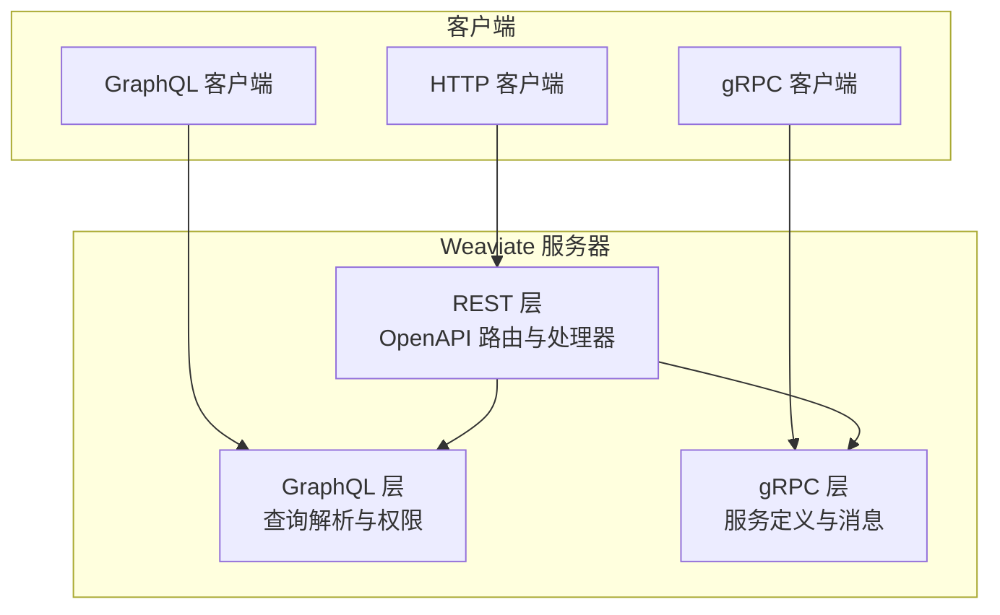
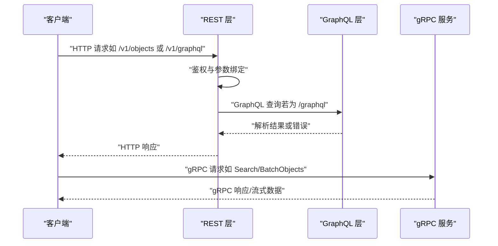
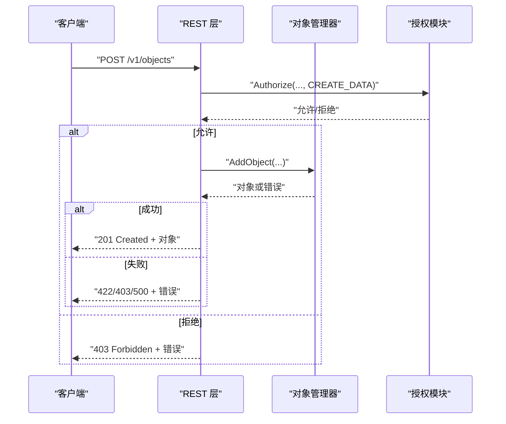
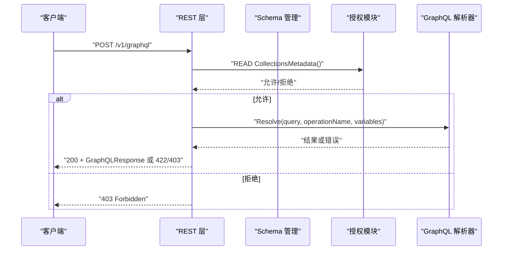
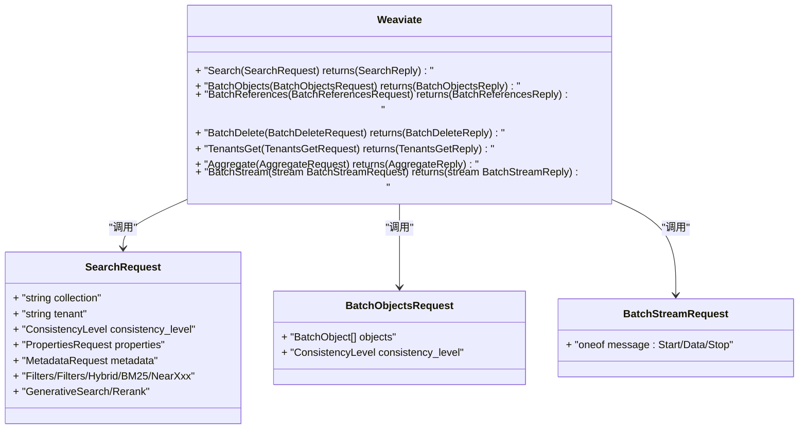
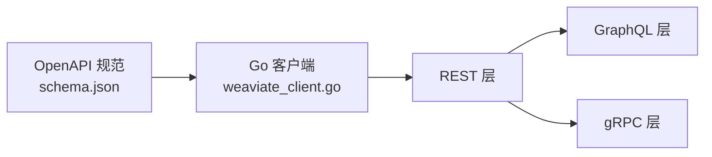

# 端点规范

<cite>
**本文引用的文件**   
- [openapi 规范 schema.json](file://openapi-specs/schema.json)
- [REST 配置入口 configure_weaviate.go](file://adapters/handlers/rest/configure_weaviate.go)
- [REST 对象处理器 handlers_objects.go](file://adapters/handlers/rest/handlers_objects.go)
- [REST GraphQL 处理器 handlers_graphql.go](file://adapters/handlers/rest/handlers_graphql.go)
- [REST GraphQL POST 路由生成文件 graphql_post.go](file://adapters/handlers/rest/operations/graphql/graphql_post.go)
- [REST 对象创建路由生成文件 objects_create.go](file://adapters/handlers/rest/operations/objects/objects_create.go)
- [gRPC v1 服务定义 weaviate.proto](file://grpc/proto/v1/weaviate.proto)
- [gRPC v0 服务定义 weaviate.proto](file://grpc/proto/v0/weaviate.proto)
- [gRPC v1 搜索请求与响应 search_get.proto](file://grpc/proto/v1/search_get.proto)
- [gRPC v1 批量请求与响应 batch.proto](file://grpc/proto/v1/batch.proto)
- [Go 客户端入口 weaviate_client.go](file://client/weaviate_client.go)
</cite>

## 目录
1. [简介](#简介)
2. [项目结构](#项目结构)
3. [核心组件](#核心组件)
4. [架构总览](#架构总览)
5. [详细组件分析](#详细组件分析)
6. [依赖关系分析](#依赖关系分析)
7. [性能考量](#性能考量)
8. [故障排查指南](#故障排查指南)
9. [结论](#结论)
10. [附录](#附录)

## 简介
本文件为 Weaviate 的 API 端点规范文档，覆盖以下三类接口：
- REST API：基于 OpenAPI 规范，提供对象、批量、模式、集群、用户与权限等资源的 HTTP 接口。
- GraphQL API：通过 /v1/graphql 提供单次与批处理查询能力，并内置权限校验。
- gRPC API：提供 v0 与 v1 版本的服务定义，涵盖搜索、批量写入、聚合与租户管理等。

文档将从端点结构、请求/响应模型、认证与授权、错误处理、版本与兼容性、性能与重试等方面进行系统化说明，并给出流程图与时序图帮助理解。

## 项目结构
Weaviate 的 API 层主要由三部分组成：
- REST 层：基于 go-swagger 生成的路由与处理器，位于 adapters/handlers/rest。
- GraphQL 层：在 REST 层之上封装 GraphQL 查询解析与权限校验。
- gRPC 层：以 .proto 定义服务契约，位于 grpc/proto。

**图表来源**
- [REST 配置入口 configure_weaviate.go](file://adapters/handlers/rest/configure_weaviate.go#L1-L42)
- [REST 对象处理器 handlers_objects.go](file://adapters/handlers/rest/handlers_objects.go#L1-L200)
- [REST GraphQL 处理器 handlers_graphql.go](file://adapters/handlers/rest/handlers_graphql.go#L1-L200)
- [gRPC v1 服务定义 weaviate.proto](file://grpc/proto/v1/weaviate.proto#L1-L24)
- [gRPC v0 服务定义 weaviate.proto](file://grpc/proto/v0/weaviate.proto#L1-L16)

**章节来源**
- [REST 配置入口 configure_weaviate.go](file://adapters/handlers/rest/configure_weaviate.go#L1-L42)

## 核心组件
- REST OpenAPI 规范：定义了基础路径、消费类型、通用模型（如错误、GraphQL 请求/响应、权限模型等）。
- REST 对象与 GraphQL 处理器：实现具体业务逻辑、鉴权与错误映射。
- gRPC 服务与消息：定义 v0/v1 的服务方法与消息格式，支持流式批量写入与多向量返回。

**章节来源**
- [openapi 规范 schema.json](file://openapi-specs/schema.json#L1-L800)
- [REST 对象处理器 handlers_objects.go](file://adapters/handlers/rest/handlers_objects.go#L1-L200)
- [REST GraphQL 处理器 handlers_graphql.go](file://adapters/handlers/rest/handlers_graphql.go#L1-L200)
- [gRPC v1 服务定义 weaviate.proto](file://grpc/proto/v1/weaviate.proto#L1-L24)
- [gRPC v0 服务定义 weaviate.proto](file://grpc/proto/v0/weaviate.proto#L1-L16)

## 架构总览
下图展示了 REST 与 GraphQL 的典型调用链路，以及与 gRPC 的关系。

**图表来源**
- [REST GraphQL 处理器 handlers_graphql.go](file://adapters/handlers/rest/handlers_graphql.go#L51-L154)
- [gRPC v1 服务定义 weaviate.proto](file://grpc/proto/v1/weaviate.proto#L15-L23)

## 详细组件分析

### REST API：对象创建（POST /v1/objects）
- HTTP 方法与 URL：POST /v1/objects
- 认证与权限：需要具备创建数据的权限；处理器内部会根据错误类型映射为 422/403/500。
- 请求体：对象模型（属性、向量、引用等），遵循 OpenAPI 定义。
- 响应：
  - 201：成功创建对象，返回对象内容。
  - 422：输入校验失败或多租户错误。
  - 403：无权限。
  - 500：其他内部错误。
- 兼容性与注意：
  - 单对象创建；批量导入请使用 /v1/batch/objects。
  - 若存在同 ID 对象则创建失败（非幂等）。

**图表来源**
- [REST 对象处理器 handlers_objects.go](file://adapters/handlers/rest/handlers_objects.go#L79-L116)
- [REST 对象创建路由生成文件 objects_create.go](file://adapters/handlers/rest/operations/objects/objects_create.go#L46-L51)

**章节来源**
- [REST 对象处理器 handlers_objects.go](file://adapters/handlers/rest/handlers_objects.go#L79-L116)
- [REST 对象创建路由生成文件 objects_create.go](file://adapters/handlers/rest/operations/objects/objects_create.go#L46-L51)

### REST API：GraphQL 查询（POST /v1/graphql）
- HTTP 方法与 URL：POST /v1/graphql
- 功能：执行单个 GraphQL 查询；支持变量与操作名。
- 权限：
  - 至少需要读取集合元数据的权限（用于内省）。
  - 可按查询进一步授权。
- 请求体：GraphQLQuery（query、operationName、variables）。
- 响应：
  - 200：返回 GraphQLResponse（data 与可选 errors）。
  - 422：请求无效（空 query、无法序列化等）。
  - 403：无权限。
- 批处理：另有 /v1/graphql/batch 端点，支持并发执行多个子查询。

**图表来源**
- [REST GraphQL 处理器 handlers_graphql.go](file://adapters/handlers/rest/handlers_graphql.go#L51-L154)
- [REST GraphQL POST 路由生成文件 graphql_post.go](file://adapters/handlers/rest/operations/graphql/graphql_post.go#L46-L51)

**章节来源**
- [REST GraphQL 处理器 handlers_graphql.go](file://adapters/handlers/rest/handlers_graphql.go#L51-L154)
- [REST GraphQL POST 路由生成文件 graphql_post.go](file://adapters/handlers/rest/operations/graphql/graphql_post.go#L46-L51)

### gRPC API：v1 服务
- 服务名称：Weaviate（v1）
- 主要方法：
  - Search：向量检索、混合检索、BM25、近邻搜索、分组、排序、聚合等。
  - BatchObjects：批量写入对象。
  - BatchReferences：批量写入引用。
  - BatchDelete：批量删除。
  - TenantsGet：租户信息获取。
  - Aggregate：聚合统计。
  - BatchStream：流式批量对象/引用写入，支持启动、数据、停止、回压与确认。
- 消息要点：
  - ConsistencyLevel：一致性级别。
  - Properties/Metadata 请求：选择返回的属性与元信息。
  - Filters/Hybrid/BM25/NearXxx：多种检索方式。
  - Generative/Rerank：生成式增强与重排。
  - GroupBy：按字段分组返回。

**图表来源**
- [gRPC v1 服务定义 weaviate.proto](file://grpc/proto/v1/weaviate.proto#L15-L23)
- [gRPC v1 搜索请求与响应 search_get.proto](file://grpc/proto/v1/search_get.proto#L14-L55)
- [gRPC v1 批量请求与响应 batch.proto](file://grpc/proto/v1/batch.proto#L12-L43)

**章节来源**
- [gRPC v1 服务定义 weaviate.proto](file://grpc/proto/v1/weaviate.proto#L1-L24)
- [gRPC v1 搜索请求与响应 search_get.proto](file://grpc/proto/v1/search_get.proto#L1-L189)
- [gRPC v1 批量请求与响应 batch.proto](file://grpc/proto/v1/batch.proto#L1-L157)

### gRPC API：v0 服务
- 服务名称：Weaviate（v0）
- 方法：
  - Search：向量检索、批量对象。
  - BatchObjects：批量对象写入。
- 适用场景：早期客户端或兼容需求。

**章节来源**
- [gRPC v0 服务定义 weaviate.proto](file://grpc/proto/v0/weaviate.proto#L1-L16)

### 认证与授权
- REST：
  - GraphQL：至少需要读取集合元数据的权限；根据查询进一步授权。
  - 对象创建：需要创建数据权限；错误映射到 422/403/500。
- 权限模型与资源：
  - 权限包含 action 与资源范围（collections、tenants、data、users、roles、replicate、aliases 等）。
  - 资源支持通配符“*”或正则表达式匹配。

**章节来源**
- [REST GraphQL 处理器 handlers_graphql.go](file://adapters/handlers/rest/handlers_graphql.go#L60-L76)
- [REST 对象处理器 handlers_objects.go](file://adapters/handlers/rest/handlers_objects.go#L94-L106)
- [openapi 规范 schema.json](file://openapi-specs/schema.json#L129-L354)

### 错误处理与响应格式
- REST：
  - GraphQL：返回 GraphQLResponse（data 与 errors 数组）。
  - 通用错误：ErrorResponse（数组 message）。
- gRPC：
  - 批量写入返回 BatchError（index + error）。
  - 流式批量支持 OutOfMemory、Backoff、Acks、Results 等状态消息。

**章节来源**
- [openapi 规范 schema.json](file://openapi-specs/schema.json#L604-L702)
- [gRPC v1 批量请求与响应 batch.proto](file://grpc/proto/v1/batch.proto#L138-L156)

### 版本控制与兼容性
- REST 基础路径：/v1。
- gRPC：
  - v1：当前推荐版本，功能完整，包含流式批量与多向量。
  - v0：保留兼容性。
- OpenAPI 定义中包含弃用标记与迁移提示，建议优先采用 v1。

**章节来源**
- [Go 客户端入口 weaviate_client.go](file://client/weaviate_client.go#L44-L51)
- [gRPC v1 服务定义 weaviate.proto](file://grpc/proto/v1/weaviate.proto#L1-L24)
- [gRPC v0 服务定义 weaviate.proto](file://grpc/proto/v0/weaviate.proto#L1-L16)

## 依赖关系分析
- REST 与 GraphQL：
  - REST 层负责鉴权与参数绑定，GraphQL 层负责查询解析与权限细化。
- REST 与 gRPC：
  - 二者共享底层数据与权限模型；gRPC 更适合高吞吐与低延迟场景。
- OpenAPI 与 Go 客户端：
  - Go 客户端默认 Host/BasePath/Schemes 与 OpenAPI 元信息一致。

**图表来源**
- [openapi 规范 schema.json](file://openapi-specs/schema.json#L1-L10)
- [Go 客户端入口 weaviate_client.go](file://client/weaviate_client.go#L44-L51)

**章节来源**
- [openapi 规范 schema.json](file://openapi-specs/schema.json#L1-L10)
- [Go 客户端入口 weaviate_client.go](file://client/weaviate_client.go#L44-L51)

## 性能考量
- REST 批量导入：建议使用 /v1/batch/objects 替代多次 /v1/objects 请求，以降低开销。
- GraphQL 并发：/v1/graphql/batch 支持并发执行多个子查询，提升吞吐。
- gRPC 流式批量：BatchStream 支持 Start/Data/Stop 流式传输，配合 Backoff/Acks 实现背压与确认。
- 速率限制：模块组件中存在对请求/令牌的限制与预算控制，避免突发流量导致过载。

**章节来源**
- [REST 对象处理器 handlers_objects.go](file://adapters/handlers/rest/handlers_objects.go#L46-L50)
- [REST GraphQL 处理器 handlers_graphql.go](file://adapters/handlers/rest/handlers_graphql.go#L156-L200)
- [gRPC v1 批量请求与响应 batch.proto](file://grpc/proto/v1/batch.proto#L22-L89)

## 故障排查指南
- GraphQL：
  - 空 query 返回 422；无法序列化返回 422；无权限返回 403。
- REST 对象：
  - 输入校验失败返回 422；无权限返回 403；其他错误返回 500。
- gRPC：
  - 流式批量出现 OutOfMemory：减少批次大小或释放内存。
  - Backoff：根据返回的 batch_size 调整发送速率。
  - Acks：确认已接收的对象/引用，避免重复提交。

**章节来源**
- [REST GraphQL 处理器 handlers_graphql.go](file://adapters/handlers/rest/handlers_graphql.go#L92-L100)
- [REST 对象处理器 handlers_objects.go](file://adapters/handlers/rest/handlers_objects.go#L94-L106)
- [gRPC v1 批量请求与响应 batch.proto](file://grpc/proto/v1/batch.proto#L56-L88)

## 结论
Weaviate 的 API 体系以 /v1 为基础，结合 REST、GraphQL 与 gRPC，覆盖从检索、写入到聚合与流式处理的全场景需求。REST 与 GraphQL 提供易用的 HTTP 接口，gRPC 则满足高吞吐与低延迟场景。权限模型与 OpenAPI 规范确保了接口的一致性与可维护性。建议在生产环境中优先采用 v1 gRPC 与 /v1/batch/objects，配合合理的速率限制与重试策略，获得最佳性能与稳定性。

## 附录
- 常用端点速览
  - REST
    - POST /v1/objects：创建对象
    - POST /v1/graphql：GraphQL 单次查询
    - POST /v1/graphql/batch：GraphQL 批量查询
  - gRPC v1
    - Weaviate.Search：检索与聚合
    - Weaviate.BatchObjects：批量写入对象
    - Weaviate.BatchReferences：批量写入引用
    - Weaviate.BatchDelete：批量删除
    - Weaviate.TenantsGet：租户信息
    - Weaviate.Aggregate：聚合
    - Weaviate.BatchStream：流式批量写入