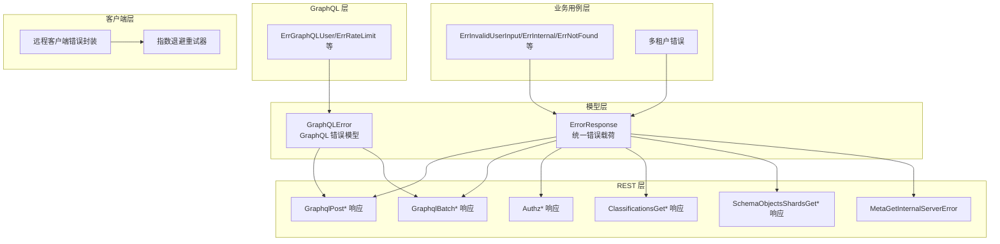
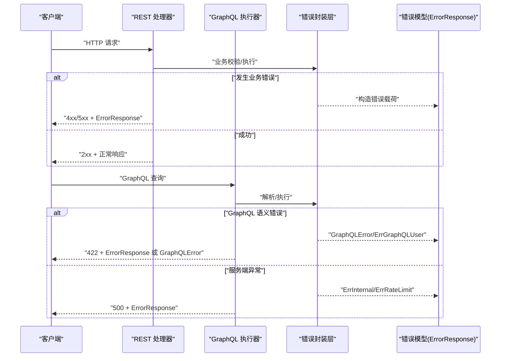
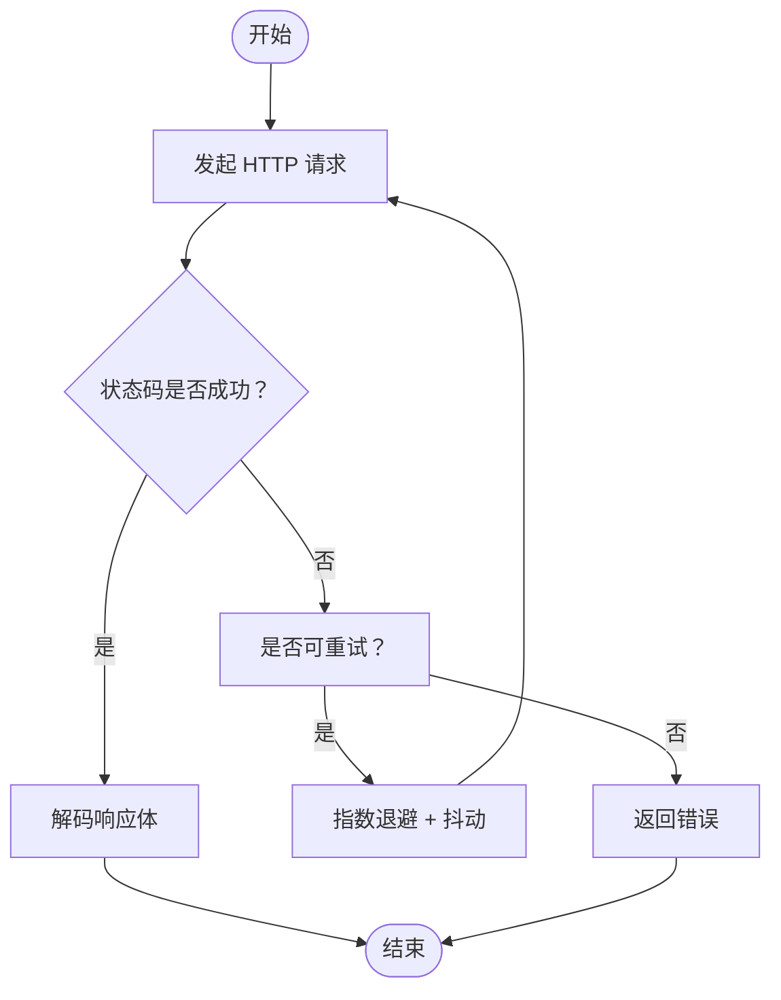
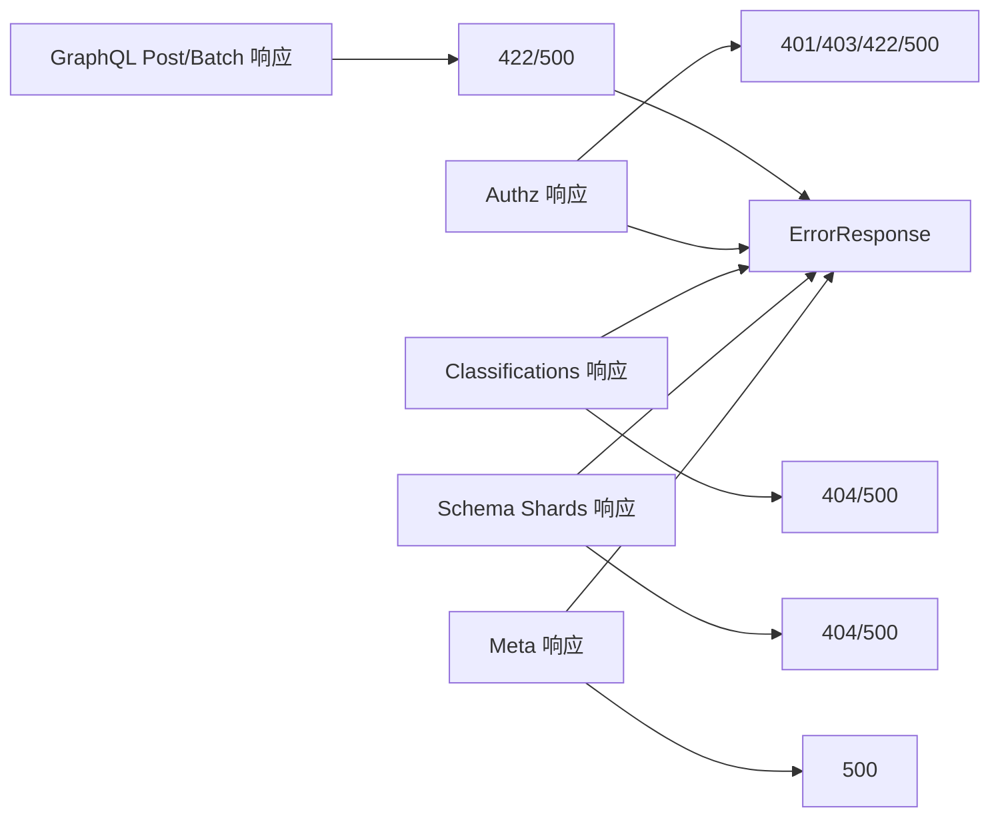

# 错误码参考

<cite>
**本文引用的文件**
- [entities/errors/errors_http.go](file://entities/errors/errors_http.go)
- [entities/errors/errors_remote_client.go](file://entities/errors/errors_remote_client.go)
- [entities/errors/errors_graphql.go](file://entities/errors/errors_graphql.go)
- [entities/errors/errors_multitenancy.go](file://entities/errors/errors_multitenancy.go)
- [entities/errors/transient.go](file://entities/errors/transient.go)
- [entities/errors/error_group_wrapper.go](file://entities/errors/error_group_wrapper.go)
- [entities/errors/go_wrapper.go](file://entities/errors/go_wrapper.go)
- [adapters/handlers/rest/helpers.go](file://adapters/handlers/rest/helpers.go)
- [adapters/handlers/rest/panics_middleware.go](file://adapters/handlers/rest/panics_middleware.go)
- [adapters/handlers/rest/operations/graphql/graphql_post_responses.go](file://adapters/handlers/rest/operations/graphql/graphql_post_responses.go)
- [adapters/handlers/rest/operations/graphql/graphql_batch_responses.go](file://adapters/handlers/rest/operations/graphql/graphql_batch_responses.go)
- [adapters/handlers/rest/operations/authz/add_permissions_responses.go](file://adapters/handlers/rest/operations/authz/add_permissions_responses.go)
- [adapters/handlers/rest/operations/authz/has_permission_responses.go](file://adapters/handlers/rest/operations/authz/has_permission_responses.go)
- [adapters/handlers/rest/operations/classifications/classifications_get_responses.go](file://adapters/handlers/rest/operations/classifications/classifications_get_responses.go)
- [adapters/handlers/rest/operations/schema/schema_objects_shards_get_responses.go](file://adapters/handlers/rest/operations/schema/schema_objects_shards_get_responses.go)
- [client/meta/meta_get_responses.go](file://client/meta/meta_get_responses.go)
- [client/authz/add_permissions_responses.go](file://client/authz/add_permissions_responses.go)
- [client/authz/has_permission_responses.go](file://client/authz/has_permission_responses.go)
- [client/schema/schema_objects_shards_get_responses.go](file://client/schema/schema_objects_shards_get_responses.go)
- [adapters/clients/client.go](file://adapters/clients/client.go)
- [adapters/clients/replication.go](file://adapters/clients/replication.go)
- [usecases/objects/errors.go](file://usecases/objects/errors.go)
- [usecases/objects/validation/properties_validation.go](file://usecases/objects/validation/properties_validation.go)
- [usecases/replica/coordinator.go](file://usecases/replica/coordinator.go)
- [entities/models/error_response.go](file://entities/models/error_response.go)
- [entities/models/graph_q_l_error.go](file://entities/models/graph_q_l_error.go)
</cite>

## 目录
1. [简介](#简介)
2. [项目结构与错误体系定位](#项目结构与错误体系定位)
3. [核心组件与错误模型](#核心组件与错误模型)
4. [架构总览](#架构总览)
5. [详细组件分析](#详细组件分析)
6. [依赖关系分析](#依赖关系分析)
7. [性能与可靠性考量](#性能与可靠性考量)
8. [故障排查指南](#故障排查指南)
9. [结论](#结论)
10. [附录：编码规范与命名约定](#附录编码规范与命名约定)

## 简介
本参考文档系统性梳理 Weaviate 的错误码体系，覆盖：
- HTTP 错误码分类与典型场景（4xx 客户端错误、5xx 服务器错误）
- 业务错误类型（数据验证、权限、多租户、配置等）
- GraphQL 错误处理与传播路径
- 远程客户端错误处理与重试策略
- 错误信息的统一模型与响应格式
- 编码规范、命名约定、本地化与国际化支持建议
- 最佳实践与调试技巧

## 项目结构与错误体系定位
Weaviate 的错误处理横跨多个层次：
- 模型层：统一的错误响应模型
- REST 层：REST 响应对象与状态码映射
- GraphQL 层：查询执行错误封装
- 业务用例层：领域错误类型与包装
- 客户端层：远程调用错误与指数退避重试
- 并发与容错：错误组与 panic 恢复

**图表来源**
- [entities/models/error_response.go](file://entities/models/error_response.go#L28-L35)
- [entities/models/graph_q_l_error.go](file://entities/models/graph_q_l_error.go#L135-L145)
- [adapters/handlers/rest/operations/graphql/graphql_post_responses.go](file://adapters/handlers/rest/operations/graphql/graphql_post_responses.go#L152-L195)
- [adapters/handlers/rest/operations/graphql/graphql_batch_responses.go](file://adapters/handlers/rest/operations/graphql/graphql_batch_responses.go#L151-L194)
- [adapters/handlers/rest/operations/authz/add_permissions_responses.go](file://adapters/handlers/rest/operations/authz/add_permissions_responses.go#L103-L238)
- [adapters/handlers/rest/operations/authz/has_permission_responses.go](file://adapters/handlers/rest/operations/authz/has_permission_responses.go#L150-L273)
- [adapters/handlers/rest/operations/classifications/classifications_get_responses.go](file://adapters/handlers/rest/operations/classifications/classifications_get_responses.go#L142-L181)
- [adapters/handlers/rest/operations/schema/schema_objects_shards_get_responses.go](file://adapters/handlers/rest/operations/schema/schema_objects_shards_get_responses.go#L178-L216)
- [client/meta/meta_get_responses.go](file://client/meta/meta_get_responses.go#L272-L312)
- [entities/errors/errors_graphql.go](file://entities/errors/errors_graphql.go#L19-L66)
- [usecases/objects/errors.go](file://usecases/objects/errors.go#L64-L116)
- [entities/errors/errors_remote_client.go](file://entities/errors/errors_remote_client.go#L18-L72)
- [adapters/clients/client.go](file://adapters/clients/client.go#L65-L128)

**章节来源**
- [entities/models/error_response.go](file://entities/models/error_response.go#L28-L35)
- [adapters/handlers/rest/operations/graphql/graphql_post_responses.go](file://adapters/handlers/rest/operations/graphql/graphql_post_responses.go#L152-L195)
- [adapters/handlers/rest/operations/graphql/graphql_batch_responses.go](file://adapters/handlers/rest/operations/graphql/graphql_batch_responses.go#L151-L194)
- [adapters/handlers/rest/operations/authz/add_permissions_responses.go](file://adapters/handlers/rest/operations/authz/add_permissions_responses.go#L103-L238)
- [adapters/handlers/rest/operations/authz/has_permission_responses.go](file://adapters/handlers/rest/operations/authz/has_permission_responses.go#L150-L273)
- [adapters/handlers/rest/operations/classifications/classifications_get_responses.go](file://adapters/handlers/rest/operations/classifications/classifications_get_responses.go#L142-L181)
- [adapters/handlers/rest/operations/schema/schema_objects_shards_get_responses.go](file://adapters/handlers/rest/operations/schema/schema_objects_shards_get_responses.go#L178-L216)
- [client/meta/meta_get_responses.go](file://client/meta/meta_get_responses.go#L272-L312)

## 核心组件与错误模型
- 统一错误响应模型
  - 结构：包含一个错误条目数组，每个条目含消息字段
  - 用途：REST 响应体中的标准错误载荷
- GraphQL 错误模型
  - 包含位置、消息等字段，用于语义错误定位
- 业务错误类型
  - 用户输入无效、内部错误、未找到、上下文过期、多租户错误等
- 远程客户端错误
  - 请求打开失败、发送失败、状态码异常、反序列化失败等
- 传输中临时性错误
  - 内存不足、内存映射不足等可重试场景

**章节来源**
- [entities/models/error_response.go](file://entities/models/error_response.go#L28-L35)
- [entities/models/graph_q_l_error.go](file://entities/models/graph_q_l_error.go#L135-L145)
- [entities/errors/errors_http.go](file://entities/errors/errors_http.go#L14-L63)
- [entities/errors/errors_remote_client.go](file://entities/errors/errors_remote_client.go#L18-L72)
- [entities/errors/transient.go](file://entities/errors/transient.go#L19-L38)

## 架构总览
下图展示了从请求到错误响应的关键流转，以及 GraphQL 与 REST 的错误处理差异。

**图表来源**
- [adapters/handlers/rest/operations/graphql/graphql_post_responses.go](file://adapters/handlers/rest/operations/graphql/graphql_post_responses.go#L152-L195)
- [adapters/handlers/rest/operations/graphql/graphql_batch_responses.go](file://adapters/handlers/rest/operations/graphql/graphql_batch_responses.go#L151-L194)
- [entities/errors/errors_graphql.go](file://entities/errors/errors_graphql.go#L19-L66)
- [entities/models/error_response.go](file://entities/models/error_response.go#L28-L35)
- [entities/models/graph_q_l_error.go](file://entities/models/graph_q_l_error.go#L135-L145)

## 详细组件分析

### HTTP 错误码分类与典型场景
- 4xx 客户端错误
  - 401 未授权：认证失败或令牌缺失
  - 403 禁止：权限不足
  - 404 未找到：资源不存在
  - 422 语义不可处理：请求语法正确但语义错误（如 GraphQL 422）
- 5xx 服务器错误
  - 500 内部错误：服务端异常，返回 ErrorResponse 以提供更详细信息
- 典型响应类
  - GraphQL Post/Batch：422 语义错误；500 服务器错误
  - 授权相关：401/403/422/500
  - 分类任务：404/500
  - Schema 分片状态：404/500
  - Meta：500

**章节来源**
- [adapters/handlers/rest/operations/graphql/graphql_post_responses.go](file://adapters/handlers/rest/operations/graphql/graphql_post_responses.go#L152-L195)
- [adapters/handlers/rest/operations/graphql/graphql_batch_responses.go](file://adapters/handlers/rest/operations/graphql/graphql_batch_responses.go#L151-L194)
- [adapters/handlers/rest/operations/authz/add_permissions_responses.go](file://adapters/handlers/rest/operations/authz/add_permissions_responses.go#L103-L238)
- [adapters/handlers/rest/operations/authz/has_permission_responses.go](file://adapters/handlers/rest/operations/authz/has_permission_responses.go#L150-L273)
- [adapters/handlers/rest/operations/classifications/classifications_get_responses.go](file://adapters/handlers/rest/operations/classifications/classifications_get_responses.go#L142-L181)
- [adapters/handlers/rest/operations/schema/schema_objects_shards_get_responses.go](file://adapters/handlers/rest/operations/schema/schema_objects_shards_get_responses.go#L178-L216)
- [client/meta/meta_get_responses.go](file://client/meta/meta_get_responses.go#L272-L312)

### 业务错误码与场景
- 数据验证错误
  - 参考属性验证常量，包含引用格式、URI 合法性、参数缺失等提示
- 权限错误
  - 未授权/禁止/语义错误/服务器错误均有对应响应类
- 配置错误
  - 通过 GraphQL/REST 返回 422 或 500，并携带 ErrorResponse
- 多租户错误
  - 租户未激活/未找到等场景，使用 IsTenantNotFound 判定
- 内部错误
  - ErrInternal/ErrNotFound/ErrUnprocessable/ErrContextExpired 等

**章节来源**
- [usecases/objects/validation/properties_validation.go](file://usecases/objects/validation/properties_validation.go#L27-L40)
- [usecases/objects/errors.go](file://usecases/objects/errors.go#L64-L116)
- [entities/errors/errors_http.go](file://entities/errors/errors_http.go#L14-L63)
- [entities/errors/errors_multitenancy.go](file://entities/errors/errors_multitenancy.go#L18-L25)

### GraphQL 错误处理与传播
- GraphQL 用户错误与速率限制
  - ErrGraphQLUser：封装原始错误、操作类型、类名
  - ErrRateLimit：统一 429 提示
- GraphQL 响应
  - 422：语义错误（如变量校验失败、查询结构问题）
  - 500：服务端异常
  - 错误模型支持 GraphQLError 位置信息，便于前端定位

**章节来源**
- [entities/errors/errors_graphql.go](file://entities/errors/errors_graphql.go#L19-L66)
- [adapters/handlers/rest/operations/graphql/graphql_post_responses.go](file://adapters/handlers/rest/operations/graphql/graphql_post_responses.go#L152-L195)
- [adapters/handlers/rest/operations/graphql/graphql_batch_responses.go](file://adapters/handlers/rest/operations/graphql/graphql_batch_responses.go#L151-L194)
- [entities/models/graph_q_l_error.go](file://entities/models/graph_q_l_error.go#L135-L145)

### 远程客户端错误处理与重试
- 远程客户端错误封装
  - 打开请求失败、发送失败、状态码异常、反序列化失败
- 重试策略
  - 指数退避 + 抖动，最大尝试次数限制
  - 仅对 500、429、503 等进行自动重试
  - 成功状态码范围：100–226

**图表来源**
- [adapters/clients/client.go](file://adapters/clients/client.go#L65-L128)
- [adapters/clients/replication.go](file://adapters/clients/replication.go#L447-L451)

**章节来源**
- [entities/errors/errors_remote_client.go](file://entities/errors/errors_remote_client.go#L18-L72)
- [adapters/clients/client.go](file://adapters/clients/client.go#L65-L128)
- [adapters/clients/replication.go](file://adapters/clients/replication.go#L447-L451)

### 并发与容错：错误组与 panic 恢复
- 错误组包装器
  - 支持并发任务收集首个非空错误、可选栈跟踪、可取消上下文
- GoWrapper
  - 在 goroutine 中捕获 panic，记录日志并上报，避免进程崩溃

**章节来源**
- [entities/errors/error_group_wrapper.go](file://entities/errors/error_group_wrapper.go#L28-L136)
- [entities/errors/go_wrapper.go](file://entities/errors/go_wrapper.go#L25-L61)
- [adapters/handlers/rest/panics_middleware.go](file://adapters/handlers/rest/panics_middleware.go#L36-L50)

### REST 错误响应构建
- 统一错误响应对象构造函数
  - 支持多消息聚合为 ErrorResponse
  - 单错误转 ErrorResponse

**章节来源**
- [adapters/handlers/rest/helpers.go](file://adapters/handlers/rest/helpers.go#L20-L39)

## 依赖关系分析
- REST 响应类与状态码
  - GraphQL Post/Batch：422/500
  - 授权相关：401/403/422/500
  - 分类任务：404/500
  - Schema 分片状态：404/500
  - Meta：500
- 错误模型
  - ErrorResponse 作为所有 REST 错误的标准载荷
  - GraphQLError 用于 GraphQL 场景

**图表来源**
- [adapters/handlers/rest/operations/graphql/graphql_post_responses.go](file://adapters/handlers/rest/operations/graphql/graphql_post_responses.go#L152-L195)
- [adapters/handlers/rest/operations/graphql/graphql_batch_responses.go](file://adapters/handlers/rest/operations/graphql/graphql_batch_responses.go#L151-L194)
- [adapters/handlers/rest/operations/authz/add_permissions_responses.go](file://adapters/handlers/rest/operations/authz/add_permissions_responses.go#L103-L238)
- [adapters/handlers/rest/operations/authz/has_permission_responses.go](file://adapters/handlers/rest/operations/authz/has_permission_responses.go#L150-L273)
- [adapters/handlers/rest/operations/classifications/classifications_get_responses.go](file://adapters/handlers/rest/operations/classifications/classifications_get_responses.go#L142-L181)
- [adapters/handlers/rest/operations/schema/schema_objects_shards_get_responses.go](file://adapters/handlers/rest/operations/schema/schema_objects_shards_get_responses.go#L178-L216)
- [client/meta/meta_get_responses.go](file://client/meta/meta_get_responses.go#L272-L312)
- [entities/models/error_response.go](file://entities/models/error_response.go#L28-L35)

**章节来源**
- [entities/models/error_response.go](file://entities/models/error_response.go#L28-L35)

## 性能与可靠性考量
- 指数退避与抖动
  - 降低雪崩风险，提升网络波动下的稳定性
- 最大尝试次数与最大耗时
  - 防止无限重试导致资源耗尽
- 仅对特定状态码重试
  - 避免对 4xx 客户端错误进行无意义重试
- 并发安全
  - 错误组与 panic 恢复确保服务在异常情况下仍可继续运行

**章节来源**
- [adapters/clients/client.go](file://adapters/clients/client.go#L111-L124)
- [adapters/clients/replication.go](file://adapters/clients/replication.go#L447-L451)
- [entities/errors/error_group_wrapper.go](file://entities/errors/error_group_wrapper.go#L114-L136)
- [entities/errors/go_wrapper.go](file://entities/errors/go_wrapper.go#L25-L61)

## 故障排查指南
- GraphQL 422 语义错误
  - 检查变量类型、查询结构、权限与租户状态
  - 使用 GraphQLError 的位置信息定位字段
- GraphQL 500 服务器错误
  - 查看 ErrorResponse 详情，结合服务端日志与栈跟踪
- REST 401/403
  - 校验认证凭据与角色权限，确认授权策略
- REST 404
  - 资源不存在或路径错误，核对类名/ID/分片状态
- REST 500
  - 服务端异常，查看 ErrorResponse 与服务端日志
- 远程调用失败
  - 观察是否触发指数退避重试；检查网络连通性与目标节点健康
- 多租户错误
  - 使用 IsTenantNotFound 判定租户状态，确保租户已激活

**章节来源**
- [adapters/handlers/rest/operations/graphql/graphql_post_responses.go](file://adapters/handlers/rest/operations/graphql/graphql_post_responses.go#L152-L195)
- [adapters/handlers/rest/operations/graphql/graphql_batch_responses.go](file://adapters/handlers/rest/operations/graphql/graphql_batch_responses.go#L151-L194)
- [adapters/handlers/rest/operations/authz/add_permissions_responses.go](file://adapters/handlers/rest/operations/authz/add_permissions_responses.go#L103-L238)
- [adapters/handlers/rest/operations/authz/has_permission_responses.go](file://adapters/handlers/rest/operations/authz/has_permission_responses.go#L150-L273)
- [adapters/handlers/rest/operations/classifications/classifications_get_responses.go](file://adapters/handlers/rest/operations/classifications/classifications_get_responses.go#L142-L181)
- [adapters/handlers/rest/operations/schema/schema_objects_shards_get_responses.go](file://adapters/handlers/rest/operations/schema/schema_objects_shards_get_responses.go#L178-L216)
- [client/meta/meta_get_responses.go](file://client/meta/meta_get_responses.go#L272-L312)
- [entities/errors/errors_remote_client.go](file://entities/errors/errors_remote_client.go#L18-L72)
- [entities/errors/errors_multitenancy.go](file://entities/errors/errors_multitenancy.go#L18-L25)

## 结论
Weaviate 的错误码体系以统一的错误模型为基础，结合 REST 与 GraphQL 的差异化处理，形成清晰的客户端/服务器错误分类与传播路径。通过指数退避重试、错误组与 panic 恢复等机制，系统在高并发与复杂网络环境下具备良好的稳定性与可观测性。建议在集成与运维中遵循本文的编码规范与最佳实践，以获得一致且可预期的错误体验。

## 附录：编码规范与命名约定
- 错误类型命名
  - 业务错误：ErrXxx（如 ErrInvalidUserInput、ErrInternal、ErrNotFound）
  - GraphQL 错误：ErrGraphQLUser、ErrRateLimit、ErrLockConnector
  - 远程客户端错误：ErrOpenHttpRequest、ErrSendHttpRequest、ErrUnexpectedStatusCode、ErrUnmarshalBody
  - 多租户错误：ErrTenantNotFound、ErrTenantNotActive
- 错误构造函数
  - NewErrXxx(err)：用于包装底层错误
  - NewErrXxx(format, args...)：用于格式化消息
- REST 响应类命名
  - GraphqlPostUnprocessableEntity、GraphqlPostInternalServerError
  - AddPermissionsUnauthorized、AddPermissionsForbidden、AddPermissionsUnprocessableEntity、AddPermissionsInternalServerError
  - ClassificationsGetNotFound、ClassificationsGetInternalServerError
  - SchemaObjectsShardsGetNotFound、SchemaObjectsShardsGetInternalServerError
  - MetaGetInternalServerError
- 错误载荷
  - 统一使用 ErrorResponse；GraphQL 场景可使用 GraphQLError
- 重试策略
  - 仅对 500、429、503 等进行自动重试
  - 指数退避 + 抖动，设置最大尝试次数与最大耗时
- 本地化与国际化
  - 当前错误消息以英文为主；建议在应用层对 ErrorResponse.Message 进行本地化映射，保持与前端/SDK 的一致性

**章节来源**
- [usecases/objects/errors.go](file://usecases/objects/errors.go#L64-L116)
- [entities/errors/errors_graphql.go](file://entities/errors/errors_graphql.go#L19-L66)
- [entities/errors/errors_remote_client.go](file://entities/errors/errors_remote_client.go#L18-L72)
- [entities/errors/errors_multitenancy.go](file://entities/errors/errors_multitenancy.go#L18-L25)
- [adapters/handlers/rest/operations/graphql/graphql_post_responses.go](file://adapters/handlers/rest/operations/graphql/graphql_post_responses.go#L152-L195)
- [adapters/handlers/rest/operations/graphql/graphql_batch_responses.go](file://adapters/handlers/rest/operations/graphql/graphql_batch_responses.go#L151-L194)
- [adapters/handlers/rest/operations/authz/add_permissions_responses.go](file://adapters/handlers/rest/operations/authz/add_permissions_responses.go#L103-L238)
- [adapters/handlers/rest/operations/authz/has_permission_responses.go](file://adapters/handlers/rest/operations/authz/has_permission_responses.go#L150-L273)
- [adapters/handlers/rest/operations/classifications/classifications_get_responses.go](file://adapters/handlers/rest/operations/classifications/classifications_get_responses.go#L142-L181)
- [adapters/handlers/rest/operations/schema/schema_objects_shards_get_responses.go](file://adapters/handlers/rest/operations/schema/schema_objects_shards_get_responses.go#L178-L216)
- [client/meta/meta_get_responses.go](file://client/meta/meta_get_responses.go#L272-L312)
- [adapters/clients/client.go](file://adapters/clients/client.go#L111-L124)
- [adapters/clients/replication.go](file://adapters/clients/replication.go#L447-L451)