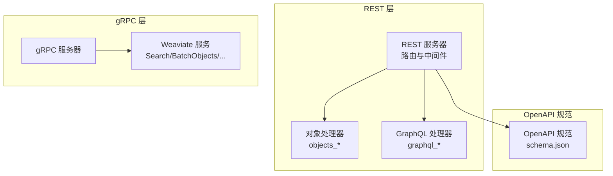
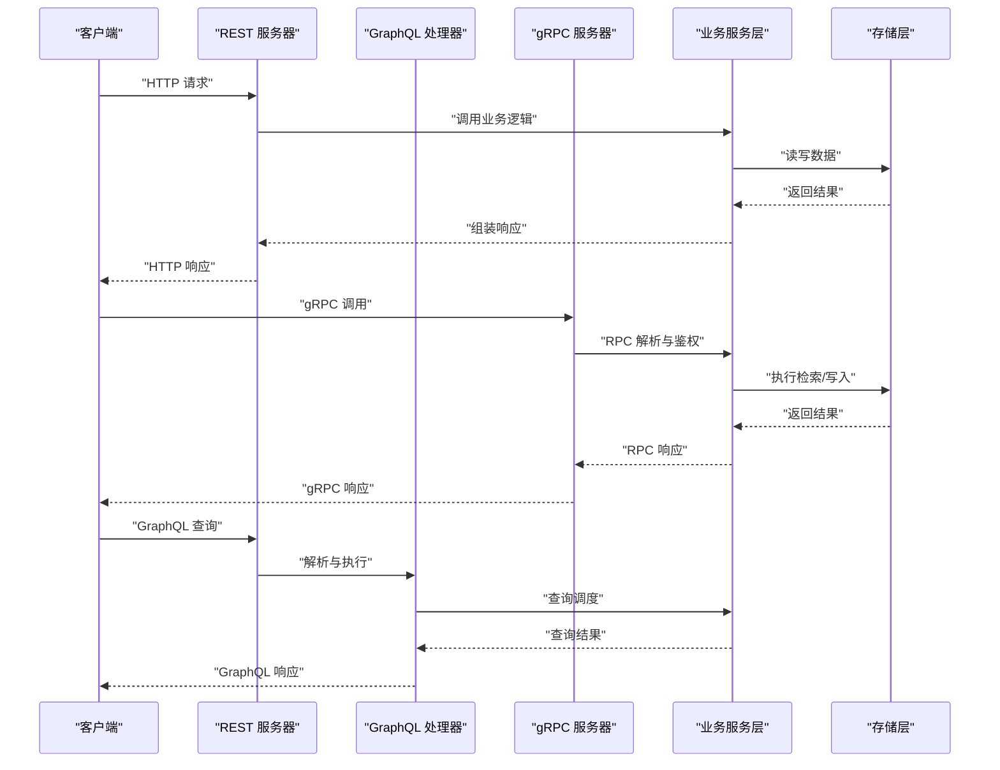
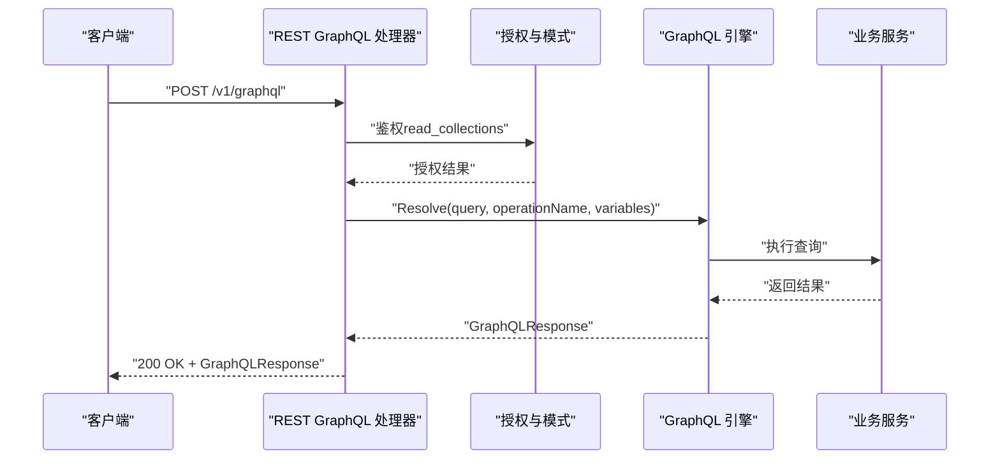
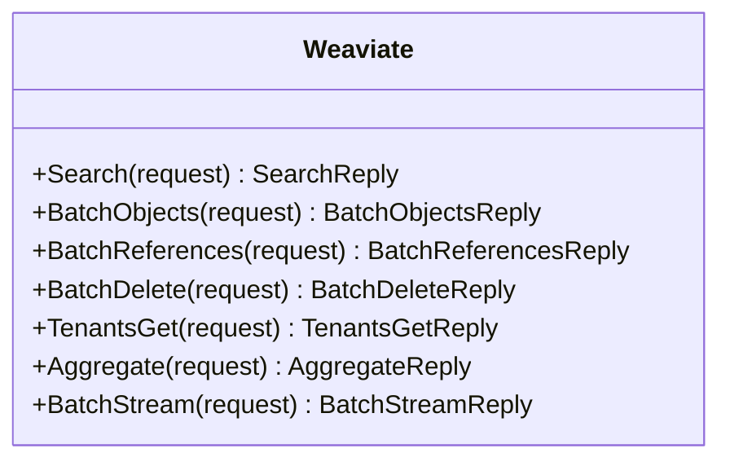
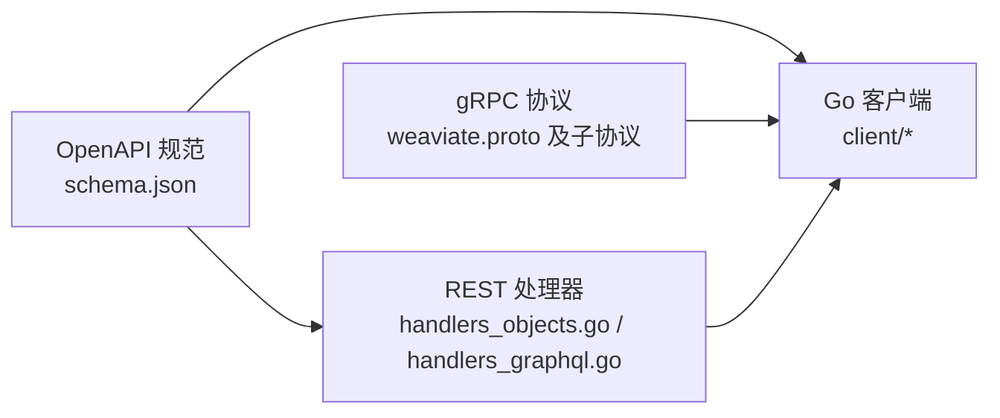

# API 接口文档

<cite>
**本文引用的文件**
- [openapi 规范 schema.json](file://openapi-specs/schema.json)
- [REST 对象处理器 handlers_objects.go](file://adapters/handlers/rest/handlers_objects.go)
- [REST GraphQL 处理器 handlers_graphql.go](file://adapters/handlers/rest/handlers_graphql.go)
- [gRPC v1 协议 weaviate.proto](file://grpc/proto/v1/weaviate.proto)
- [gRPC v1 批处理协议 batch.proto](file://grpc/proto/v1/batch.proto)
- [gRPC v1 搜索协议 search_get.proto](file://grpc/proto/v1/search_get.proto)
- [gRPC v1 聚合协议 aggregate.proto](file://grpc/proto/v1/aggregate.proto)
- [gRPC v1 租户协议 tenants.proto](file://grpc/proto/v1/tenants.proto)
- [gRPC v1 基础协议 base.proto](file://grpc/proto/v1/base.proto)
- [gRPC v1 基础搜索协议 base_search.proto](file://grpc/proto/v1/base_search.proto)
- [gRPC v1 生成式协议 generative.proto](file://grpc/proto/v1/generative.proto)
- [gRPC v1 健康检查协议 health_weaviate.proto](file://grpc/proto/v1/health_weaviate.proto)
- [gRPC v1 属性协议 properties.proto](file://grpc/proto/v1/properties.proto)
- [gRPC v1 批量删除协议 batch_delete.proto](file://grpc/proto/v1/batch_delete.proto)
- [gRPC v1 批流协议 batch_stream.proto](file://grpc/proto/v1/batch_stream.proto)
- [gRPC 客户端生成目录结构](file://client/)
- [OpenAPI 规范扩展脚本 extendresponses.js](file://openapi-specs/extendresponses.js)
</cite>

## 目录
1. [简介](#简介)
2. [项目结构](#项目结构)
3. [核心组件](#核心组件)
4. [架构总览](#架构总览)
5. [详细组件分析](#详细组件分析)
6. [依赖关系分析](#依赖关系分析)
7. [性能考量](#性能考量)
8. [故障排查指南](#故障排查指南)
9. [结论](#结论)
10. [附录](#附录)

## 简介
本文件为 Weaviate 的 API 接口技术参考，覆盖以下三类接口：
- REST API：基于 OpenAPI 规范的资源化接口，涵盖对象 CRUD、批量操作、分类、备份、集群与节点状态等。
- GraphQL API：支持单次查询与批量查询，具备权限控制与并发执行能力。
- gRPC API：高性能流式与非流式 RPC 接口，覆盖检索、聚合、批量写入、租户管理等。

文档同时提供版本管理、兼容性与迁移建议、速率限制与安全策略、性能优化、客户端集成与测试调试方法，帮助 API 开发者与集成工程师高效落地。

## 项目结构
Weaviate 的 API 实现主要分布在以下模块：
- REST 层：位于 adapters/handlers/rest，负责路由、中间件、鉴权与业务编排。
- GraphQL 层：位于 adapters/handlers/rest/handlers_graphql.go，封装 GraphQL 查询解析与执行。
- gRPC 层：位于 grpc/proto/v1，定义服务契约；客户端位于 client/，包含各功能域的参数与响应模型。
- OpenAPI 规范：位于 openapi-specs/schema.json，统一描述 REST API 的数据模型与错误响应。

**图表来源**
- [REST 对象处理器 handlers_objects.go](file://adapters/handlers/rest/handlers_objects.go#L1-L200)
- [REST GraphQL 处理器 handlers_graphql.go](file://adapters/handlers/rest/handlers_graphql.go#L1-L200)
- [gRPC v1 协议 weaviate.proto](file://grpc/proto/v1/weaviate.proto#L1-L24)
- [openapi 规范 schema.json](file://openapi-specs/schema.json#L1-L120)

**章节来源**
- [REST 对象处理器 handlers_objects.go](file://adapters/handlers/rest/handlers_objects.go#L1-L200)
- [REST GraphQL 处理器 handlers_graphql.go](file://adapters/handlers/rest/handlers_graphql.go#L1-L200)
- [gRPC v1 协议 weaviate.proto](file://grpc/proto/v1/weaviate.proto#L1-L24)
- [openapi 规范 schema.json](file://openapi-specs/schema.json#L1-L120)

## 核心组件
- REST 对象接口：提供对象的创建、读取、更新、删除、校验、列表与引用管理等。
- REST GraphQL 接口：提供单次与批量 GraphQL 查询，支持并发执行与权限控制。
- gRPC Weaviate 服务：提供 Search、BatchObjects、BatchReferences、BatchDelete、TenantsGet、Aggregate、BatchStream 等 RPC。
- OpenAPI 数据模型：统一的错误响应、元信息、权限与角色模型、集合与属性配置等。

**章节来源**
- [REST 对象处理器 handlers_objects.go](file://adapters/handlers/rest/handlers_objects.go#L79-L144)
- [REST GraphQL 处理器 handlers_graphql.go](file://adapters/handlers/rest/handlers_graphql.go#L60-L154)
- [gRPC v1 协议 weaviate.proto](file://grpc/proto/v1/weaviate.proto#L15-L23)
- [openapi 规范 schema.json](file://openapi-specs/schema.json#L604-L702)

## 架构总览
Weaviate 的 API 架构由三层组成：
- 表示层（REST/gRPC）：接收请求，进行鉴权与参数解析。
- 业务层：调用 usecases 与 entities 层完成数据访问与业务逻辑。
- 存储层：通过存储引擎与索引实现数据持久化与检索。

**图表来源**
- [REST 对象处理器 handlers_objects.go](file://adapters/handlers/rest/handlers_objects.go#L79-L116)
- [REST GraphQL 处理器 handlers_graphql.go](file://adapters/handlers/rest/handlers_graphql.go#L60-L154)
- [gRPC v1 协议 weaviate.proto](file://grpc/proto/v1/weaviate.proto#L15-L23)

## 详细组件分析

### REST API 端点参考

#### 对象管理
- 创建对象
  - 方法与路径：POST /v1/objects
  - 认证：需具备创建数据权限
  - 请求体：对象模型（含属性与向量）
  - 成功响应：201 Created，返回创建的对象
  - 错误响应：422 Unprocessable Entity（输入校验失败）、403 Forbidden（权限不足）、500 Internal Server Error
- 读取对象
  - 方法与路径：GET /v1/objects/{className}/{id}
  - 参数：include（附加属性）、consistencyLevel、nodeName、tenant
  - 成功响应：200 OK，返回对象
  - 错误响应：404 Not Found、403 Forbidden、422 Unprocessable Entity
- 更新对象
  - 方法与路径：PUT /v1/objects/{className}/{id}
  - 请求体：对象模型（全量替换）
  - 成功响应：200 OK，返回更新后的对象
- 部分更新对象
  - 方法与路径：PATCH /v1/objects/{className}/{id}
  - 请求体：JSON Patch 或合并补丁
  - 成功响应：200 OK，返回更新后的对象
- 删除对象
  - 方法与路径：DELETE /v1/objects/{className}/{id}
  - 成功响应：204 No Content
- 列表对象
  - 方法与路径：GET /v1/objects
  - 参数：limit、offset、sort、order、after、tenant
  - 成功响应：200 OK，返回对象列表
- 校验对象
  - 方法与路径：POST /v1/objects/validate
  - 成功响应：200 OK（无内容）

**章节来源**
- [REST 对象处理器 handlers_objects.go](file://adapters/handlers/rest/handlers_objects.go#L79-L144)
- [REST 对象处理器 handlers_objects.go](file://adapters/handlers/rest/handlers_objects.go#L146-L200)

#### GraphQL API
- 单次查询
  - 方法与路径：POST /v1/graphql
  - 请求体：GraphQLQuery（query、operationName、variables）
  - 成功响应：200 OK，返回 GraphQLResponse（data 与可选 errors）
  - 错误响应：422 Unprocessable Entity（查询为空或解析失败）、403 Forbidden（权限不足）
- 批量查询
  - 方法与路径：POST /v1/graphql/batch
  - 请求体：GraphQLQueries（数组）
  - 并发执行：每个查询独立 goroutine，结果按原序返回
  - 成功响应：200 OK，返回 GraphQLResponses 数组

**图表来源**
- [REST GraphQL 处理器 handlers_graphql.go](file://adapters/handlers/rest/handlers_graphql.go#L60-L154)

**章节来源**
- [REST GraphQL 处理器 handlers_graphql.go](file://adapters/handlers/rest/handlers_graphql.go#L60-L154)
- [REST GraphQL 处理器 handlers_graphql.go](file://adapters/handlers/rest/handlers_graphql.go#L156-L200)

#### 批量与分类
- 批量对象创建
  - 方法与路径：POST /v1/batch/objects
  - 请求体：批量对象数组
  - 成功响应：200 OK，返回批量统计与结果
- 批量对象删除
  - 方法与路径：DELETE /v1/batch/objects
  - 请求体：批量删除条件
  - 成功响应：200 OK，返回批量删除结果
- 分类
  - 方法与路径：POST /v1/classifications
  - 请求体：分类配置
  - 成功响应：200 OK，返回分类任务状态

**章节来源**
- [REST 对象处理器 handlers_objects.go](file://adapters/handlers/rest/handlers_objects.go#L79-L116)

#### 元信息与健康检查
- 元信息
  - 方法与路径：GET /v1/meta
  - 返回：版本、模块信息、gRPC 最大消息大小等
- 健康检查
  - 方法与路径：GET /v1/.well-known/live、GET /v1/.well-known/ready
  - 返回：服务存活与就绪状态

**章节来源**
- [openapi 规范 schema.json](file://openapi-specs/schema.json#L893-L915)
- [REST GraphQL 处理器 handlers_graphql.go](file://adapters/handlers/rest/handlers_graphql.go#L60-L154)

### GraphQL 查询语法与字段定义
- 查询语法
  - 支持标准 GraphQL 查询、变量与操作名
  - 支持嵌套字段、聚合与过滤
- 字段定义
  - 基于集合（class）与属性（property）定义
  - 支持多向量命名空间与附加属性
- 批处理
  - 批量查询通过 /v1/graphql/batch 并发执行，提升吞吐

**章节来源**
- [openapi 规范 schema.json](file://openapi-specs/schema.json#L651-L702)
- [REST GraphQL 处理器 handlers_graphql.go](file://adapters/handlers/rest/handlers_graphql.go#L156-L200)

### gRPC API 服务定义与客户端使用

#### 服务与方法
- Weaviate 服务
  - Search：向量检索
  - BatchObjects：批量对象写入
  - BatchReferences：批量引用写入
  - BatchDelete：批量删除
  - TenantsGet：租户信息获取
  - Aggregate：聚合查询
  - BatchStream：流式批量写入

**图表来源**
- [gRPC v1 协议 weaviate.proto](file://grpc/proto/v1/weaviate.proto#L15-L23)

**章节来源**
- [gRPC v1 协议 weaviate.proto](file://grpc/proto/v1/weaviate.proto#L1-L24)

#### 客户端使用
- Go 客户端
  - 位于 client/ 目录，按功能域划分（batch、graphql、meta、nodes、objects、schema、users 等）
  - 每个功能域包含参数与响应模型，便于类型安全调用
- 其他语言
  - 通过 protobuf 编译生成对应语言客户端，遵循 v1 协议

**章节来源**
- [gRPC v1 批处理协议 batch.proto](file://grpc/proto/v1/batch.proto)
- [gRPC v1 搜索协议 search_get.proto](file://grpc/proto/v1/search_get.proto)
- [gRPC v1 聚合协议 aggregate.proto](file://grpc/proto/v1/aggregate.proto)
- [gRPC v1 租户协议 tenants.proto](file://grpc/proto/v1/tenants.proto)
- [gRPC v1 基础协议 base.proto](file://grpc/proto/v1/base.proto)
- [gRPC v1 基础搜索协议 base_search.proto](file://grpc/proto/v1/base_search.proto)
- [gRPC v1 生成式协议 generative.proto](file://grpc/proto/v1/generative.proto)
- [gRPC v1 健康检查协议 health_weaviate.proto](file://grpc/proto/v1/health_weaviate.proto)
- [gRPC v1 属性协议 properties.proto](file://grpc/proto/v1/properties.proto)
- [gRPC v1 批量删除协议 batch_delete.proto](file://grpc/proto/v1/batch_delete.proto)
- [gRPC v1 批流协议 batch_stream.proto](file://grpc/proto/v1/batch_stream.proto)

### 请求/响应示例与错误处理策略
- 错误响应模型
  - REST 通用错误：包含 error 数组，每项含 message
  - GraphQL 错误：包含 locations、message、path
- 示例路径
  - REST 错误响应模型定义：[openapi 规范 schema.json](file://openapi-specs/schema.json#L604-L620)
  - GraphQL 错误模型定义：[openapi 规范 schema.json](file://openapi-specs/schema.json#L621-L650)
  - GraphQL 响应模型定义：[openapi 规范 schema.json](file://openapi-specs/schema.json#L676-L702)

**章节来源**
- [openapi 规范 schema.json](file://openapi-specs/schema.json#L604-L702)

### API 版本管理、向后兼容与迁移
- 版本基线
  - OpenAPI basePath 为 /v1，表明当前 API 版本为 v1
- 向后兼容
  - 新增字段采用可选策略，避免破坏既有客户端
  - 保留旧字段并在 deprecations 中标注
- 迁移建议
  - 使用 deprecations 字段识别废弃与移除版本，提前调整客户端
  - 逐步从旧端点迁移到新端点（如从 /v1/objects 迁移到 /v1/batch/objects）

**章节来源**
- [openapi 规范 schema.json](file://openapi-specs/schema.json#L1-L3)
- [openapi 规范 schema.json](file://openapi-specs/schema.json#L548-L603)

## 依赖关系分析

**图表来源**
- [openapi 规范 schema.json](file://openapi-specs/schema.json#L1-L120)
- [REST 对象处理器 handlers_objects.go](file://adapters/handlers/rest/handlers_objects.go#L1-L200)
- [REST GraphQL 处理器 handlers_graphql.go](file://adapters/handlers/rest/handlers_graphql.go#L1-L200)
- [gRPC v1 协议 weaviate.proto](file://grpc/proto/v1/weaviate.proto#L1-L24)

**章节来源**
- [openapi 规范 schema.json](file://openapi-specs/schema.json#L1-L120)
- [REST 对象处理器 handlers_objects.go](file://adapters/handlers/rest/handlers_objects.go#L1-L200)
- [REST GraphQL 处理器 handlers_graphql.go](file://adapters/handlers/rest/handlers_graphql.go#L1-L200)
- [gRPC v1 协议 weaviate.proto](file://grpc/proto/v1/weaviate.proto#L1-L24)

## 性能考量
- REST
  - 使用 include 参数精确选择附加属性，减少序列化开销
  - 合理设置 limit/offset 与排序，避免大偏移扫描
- GraphQL
  - 批量查询并发执行，充分利用 CPU 与网络带宽
  - 控制查询深度与字段数量，避免过深嵌套导致高延迟
- gRPC
  - 使用 BatchStream 进行流式批量写入，降低 RTT
  - 根据 gRPC 最大消息大小合理分包
  - 使用压缩与连接复用（取决于具体实现）

[本节为通用性能建议，不直接分析特定文件]

## 故障排查指南
- 常见错误码
  - 403 Forbidden：权限不足（需具备相应 action 与资源范围）
  - 422 Unprocessable Entity：输入校验失败或查询无效
  - 404 Not Found：对象不存在
  - 500 Internal Server Error：服务内部异常
- GraphQL 错误定位
  - 检查 errors.locations 中的行列号，定位语法或语义问题
- REST 错误响应
  - 查看响应体中的 error 数组，逐条定位问题

**章节来源**
- [REST 对象处理器 handlers_objects.go](file://adapters/handlers/rest/handlers_objects.go#L94-L107)
- [REST GraphQL 处理器 handlers_graphql.go](file://adapters/handlers/rest/handlers_graphql.go#L92-L100)
- [openapi 规范 schema.json](file://openapi-specs/schema.json#L604-L620)
- [openapi 规范 schema.json](file://openapi-specs/schema.json#L621-L650)

## 结论
Weaviate 提供了统一的 REST 与 GraphQL 接口以及高性能的 gRPC 通道，满足从易用到极致性能的不同场景需求。通过 OpenAPI 规范与完善的错误模型，开发者可以快速集成并稳定运行。建议在生产环境中结合速率限制、鉴权与监控策略，配合批量与流式接口实现最佳性能。

[本节为总结性内容，不直接分析特定文件]

## 附录

### API 端点一览（摘要）
- REST
  - /v1/objects：对象 CRUD、列表、校验
  - /v1/graphql：GraphQL 单次查询
  - /v1/graphql/batch：GraphQL 批量查询
  - /v1/batch/objects：批量对象写入/删除
  - /v1/meta：元信息
  - /.well-known/live、/.well-known/ready：健康检查
- gRPC
  - Weaviate.Search、BatchObjects、BatchReferences、BatchDelete、TenantsGet、Aggregate、BatchStream

**章节来源**
- [REST 对象处理器 handlers_objects.go](file://adapters/handlers/rest/handlers_objects.go#L79-L144)
- [REST GraphQL 处理器 handlers_graphql.go](file://adapters/handlers/rest/handlers_graphql.go#L60-L154)
- [gRPC v1 协议 weaviate.proto](file://grpc/proto/v1/weaviate.proto#L15-L23)

### 客户端集成与最佳实践
- 优先使用 OpenAPI 生成的客户端（如 Go client），确保类型安全
- GraphQL 批量查询用于高吞吐场景
- gRPC 流式批量写入用于大规模导入
- 设置合理的超时与重试策略，结合指数退避

[本节为通用实践建议，不直接分析特定文件]

### API 测试方法与调试工具
- 使用 OpenAPI 规范进行契约测试
- 通过 /.well-known/live 与 /.well-known/ready 进行健康探测
- 使用 GraphQL Playground 或 Postman 验证查询
- gRPC 可使用 grpcurl 或自定义客户端进行验证

[本节为通用测试建议，不直接分析特定文件]