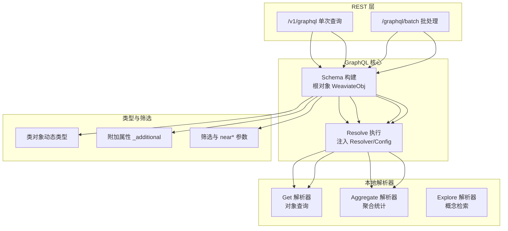
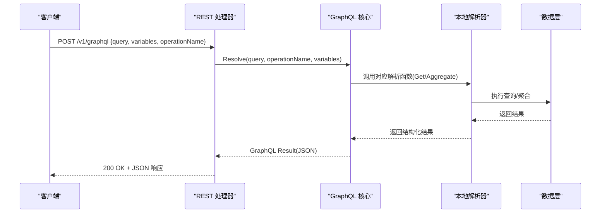
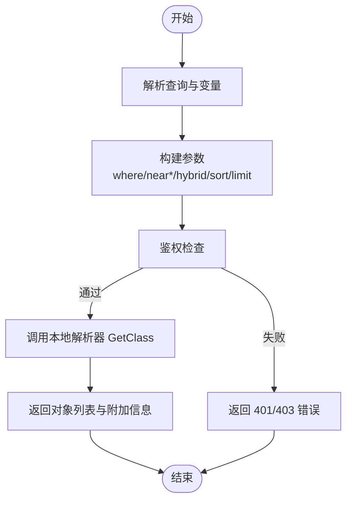
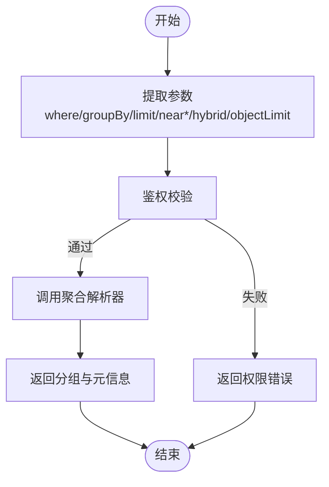
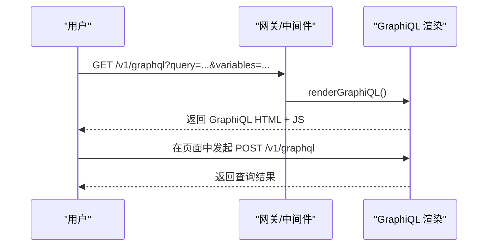
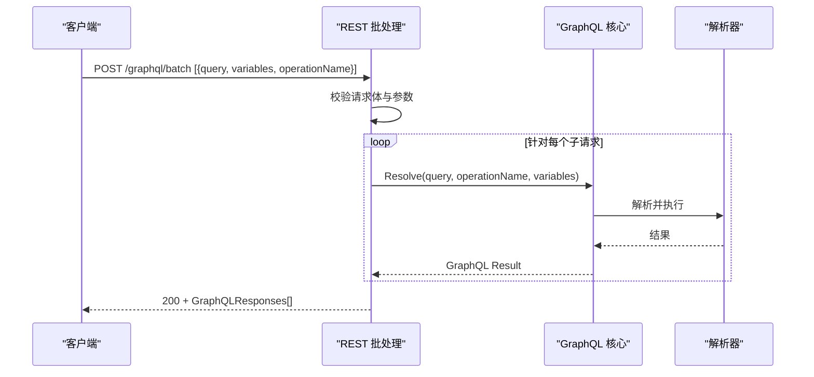
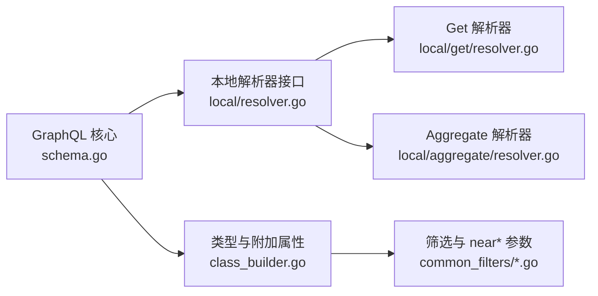

# GraphQL API

<cite>
**本文引用的文件**
- [adapters/handlers/graphql/schema.go](file://adapters/handlers/graphql/schema.go)
- [adapters/handlers/graphql/local/resolver.go](file://adapters/handlers/graphql/local/resolver.go)
- [adapters/handlers/graphql/local/get/resolver.go](file://adapters/handlers/graphql/local/get/resolver.go)
- [adapters/handlers/graphql/local/aggregate/resolver.go](file://adapters/handlers/graphql/local/aggregate/resolver.go)
- [adapters/handlers/graphql/local/get/class_builder.go](file://adapters/handlers/graphql/local/get/class_builder.go)
- [adapters/handlers/graphql/local/aggregate/aggregate.go](file://adapters/handlers/graphql/local/aggregate/aggregate.go)
- [adapters/handlers/graphql/descriptions/rootQuery.go](file://adapters/handlers/graphql/descriptions/rootQuery.go)
- [adapters/handlers/graphql/graphiql/graphiql.go](file://adapters/handlers/graphql/graphiql/graphiql.go)
- [adapters/handlers/rest/operations/graphql/graphql_batch.go](file://adapters/handlers/rest/operations/graphql/graphql_batch.go)
- [adapters/handlers/rest/operations/graphql/graphql_batch_parameters.go](file://adapters/handlers/rest/operations/graphql/graphql_batch_parameters.go)
- [adapters/handlers/rest/operations/graphql/graphql_batch_responses.go](file://adapters/handlers/rest/operations/graphql/graphql_batch_responses.go)
- [adapters/handlers/rest/handlers_graphql.go](file://adapters/handlers/rest/handlers_graphql.go)
- [entities/errors/errors_graphql.go](file://entities/errors/errors_graphql.go)
- [adapters/handlers/graphql/local/common_filters/filters_types.go](file://adapters/handlers/graphql/local/common_filters/filters_types.go)
- [test/acceptance/batch_request_endpoints/graphql_test.go](file://test/acceptance/batch_request_endpoints/graphql_test.go)
- [test/acceptance_with_go_client/object_property_tests/graphql_test.go](file://test/acceptance_with_go_client/object_property_tests/graphql_test.go)
</cite>

## 目录
1. [简介](#简介)
2. [项目结构](#项目结构)
3. [核心组件](#核心组件)
4. [架构总览](#架构总览)
5. [详细组件分析](#详细组件分析)
6. [依赖关系分析](#依赖关系分析)
7. [性能考量](#性能考量)
8. [故障排查指南](#故障排查指南)
9. [结论](#结论)
10. [附录](#附录)

## 简介
本文件为 Weaviate 的 GraphQL API 技术参考与最佳实践指南，覆盖查询（Query）、聚合（Aggregate）与探索（Explore）能力，以及批处理请求、GraphiQL 调试界面使用、变量与参数传递、内联/命名片段、指令等 GraphQL 特性在 Weaviate 中的具体用法与限制。文档同时提供复杂查询示例思路、性能优化建议与常见问题排查方法，帮助 GraphQL 开发者高效构建应用。

## 项目结构
GraphQL 能力由“REST 入口 + GraphQL 核心 + 本地解析器 + 类型与筛选构建”四层组成：
- REST 层：暴露 /v1/graphql 单次与 /graphql/batch 批处理端点，负责鉴权、参数绑定与响应封装。
- GraphQL 核心：构建根 Schema，注入 Resolver 与配置上下文，统一执行查询。
- 本地解析器：按类生成 GraphQL 字段、附加属性、分组与聚合逻辑。
- 类型与筛选：根据数据库 Schema 动态生成 GraphQL 类型、输入对象与筛选器。

图表来源
- [adapters/handlers/graphql/schema.go](file://adapters/handlers/graphql/schema.go#L86-L122)
- [adapters/handlers/graphql/local/get/class_builder.go](file://adapters/handlers/graphql/local/get/class_builder.go#L118-L161)
- [adapters/handlers/graphql/local/aggregate/aggregate.go](file://adapters/handlers/graphql/local/aggregate/aggregate.go#L34-L59)

章节来源
- [adapters/handlers/graphql/schema.go](file://adapters/handlers/graphql/schema.go#L45-L84)
- [adapters/handlers/graphql/local/resolver.go](file://adapters/handlers/graphql/local/resolver.go#L19-L24)

## 核心组件
- GraphQL 接口与执行
  - GraphQL 接口定义了 Resolve 方法，接收查询字符串、可选操作名与变量映射，并返回 GraphQL 结果。
  - 根对象 WeaviateObj 注入 Resolver 与 Config，作为每次查询的上下文根。
- 本地解析器接口
  - 组合 Get 与 Aggregate 解析器接口，分别处理对象查询与聚合统计。
- 类型与附加属性
  - 类对象动态生成字段，支持标量、嵌套对象、引用与附加属性（如 id、vector、score、explainScore、group 等）。
- 筛选与 near* 参数
  - 支持 where 筛选、nearVector、nearObject、hybrid、groupby、limit、objectLimit 等参数；部分参数对使用场景有限制（例如 objectLimit 需配合 near<Media> 或 hybrid）。

章节来源
- [adapters/handlers/graphql/schema.go](file://adapters/handlers/graphql/schema.go#L40-L84)
- [adapters/handlers/graphql/local/resolver.go](file://adapters/handlers/graphql/local/resolver.go#L19-L24)
- [adapters/handlers/graphql/local/get/class_builder.go](file://adapters/handlers/graphql/local/get/class_builder.go#L178-L206)
- [adapters/handlers/graphql/local/aggregate/resolver.go](file://adapters/handlers/graphql/local/aggregate/resolver.go#L106-L180)

## 架构总览
GraphQL 请求从 REST 入口进入，经 Schema 构建后交由 Resolver 执行，Resolver 再调用底层数据访问与模块能力完成查询或聚合。

图表来源
- [adapters/handlers/graphql/schema.go](file://adapters/handlers/graphql/schema.go#L71-L84)
- [adapters/handlers/rest/handlers_graphql.go](file://adapters/handlers/rest/handlers_graphql.go#L217-L252)

## 详细组件分析

### 查询（Query）能力
- 可查询的类来自数据库 Schema，每个类在 GraphQL 中以同名字段暴露。
- 支持的字段
  - 类属性：根据数据类型生成标量、数组、嵌套对象或引用字段。
  - 附加属性（_additional）：id、vector、vectors、certainty、distance、score、explainScore、group、creationTimeUnix、lastUpdateTimeUnix、isConsistent 等。
- 筛选与排序
  - where 输入对象按类属性生成，支持多值、范围、嵌套路径等。
  - nearVector、nearObject、hybrid 等向量/混合检索参数。
  - sort、limit、cursor、group、groupObjectLimit 等。
- 示例思路
  - 获取指定类的若干对象，选择部分属性与 _additional.id。
  - 使用 where 过滤属性，结合 nearObject/nearVector 提升语义相关性。
  - 对嵌套对象字段进行选择（如 json{firstName lastName phoneNumber{input}}）。

图表来源
- [adapters/handlers/graphql/local/get/class_builder.go](file://adapters/handlers/graphql/local/get/class_builder.go#L118-L161)
- [adapters/handlers/graphql/local/common_filters/filters_types.go](file://adapters/handlers/graphql/local/common_filters/filters_types.go#L49-L85)

章节来源
- [adapters/handlers/graphql/local/get/class_builder.go](file://adapters/handlers/graphql/local/get/class_builder.go#L118-L206)
- [adapters/handlers/graphql/local/common_filters/filters_types.go](file://adapters/handlers/graphql/local/common_filters/filters_types.go#L49-L85)
- [test/acceptance_with_go_client/object_property_tests/graphql_test.go](file://test/acceptance_with_go_client/object_property_tests/graphql_test.go#L88-L129)

### 聚合（Aggregate）能力
- 聚合入口为 Aggregate 类字段，针对每个类返回聚合结果列表。
- 支持的参数
  - where：类属性筛选。
  - groupBy：按属性路径分组。
  - limit：顶层限制。
  - nearVector/nearObject：向量近邻约束。
  - hybrid：混合检索参数。
  - objectLimit：与 near<Media>/hybrid 等配合使用，限制每组对象数量。
- 返回结构
  - 每个分组包含 groupedBy 与 meta.count，以及按属性计算的聚合指标（如 min/max/sum/count/topOccurrences 等）。

图表来源
- [adapters/handlers/graphql/local/aggregate/resolver.go](file://adapters/handlers/graphql/local/aggregate/resolver.go#L62-L193)
- [adapters/handlers/graphql/local/aggregate/aggregate.go](file://adapters/handlers/graphql/local/aggregate/aggregate.go#L113-L154)

章节来源
- [adapters/handlers/graphql/local/aggregate/resolver.go](file://adapters/handlers/graphql/local/aggregate/resolver.go#L42-L193)
- [adapters/handlers/graphql/local/aggregate/aggregate.go](file://adapters/handlers/graphql/local/aggregate/aggregate.go#L113-L199)

### 探索（Explore）能力
- Explore 提供跨对象的概念检索，常用于语义相似度查找。
- 参数与返回结构由 Explore 子模块实现，通常包含向量空间中的相似对象集合与评分。

章节来源
- [adapters/handlers/graphql/local/explore/concepts.go](file://adapters/handlers/graphql/local/explore/concepts.go#L1-L200)

### GraphQL 特性与语法要点
- 内联片段与命名片段
  - 可通过片段复用字段选择，提升查询复用性与可维护性。
- 指令
  - 常见指令如 @include 与 @skip 可用于条件性包含字段。
- 变量与操作名
  - 变量通过 variables 映射传入，操作名用于多查询文档中区分具体操作。
- 附加属性（_additional）
  - 常用字段包括 id、vector、certainty、distance、score、explainScore、group、creationTimeUnix、lastUpdateTimeUnix、isConsistent 等。

章节来源
- [adapters/handlers/graphql/local/get/class_builder.go](file://adapters/handlers/graphql/local/get/class_builder.go#L178-L206)

### GraphiQL 界面使用与调试
- 访问方式
  - 当请求路径为 /v1/graphql 且方法为 GET 时，若满足条件会渲染 GraphiQL 页面。
- 认证
  - 需要 Basic Auth，用户名作为 X-API-KEY，密码作为 X-API-TOKEN。
- 调试技巧
  - 在 GraphiQL 中编辑 query、variables 与 operationName，实时查看响应。
  - 利用浏览器开发者工具观察网络请求与响应体，定位语法与权限问题。

图表来源
- [adapters/handlers/graphql/graphiql/graphiql.go](file://adapters/handlers/graphql/graphiql/graphiql.go#L36-L96)

章节来源
- [adapters/handlers/graphql/graphiql/graphiql.go](file://adapters/handlers/graphql/graphiql/graphiql.go#L36-L96)

### 批处理（Batch）功能
- 端点
  - POST /graphql/batch，请求体为 GraphQLQueries 数组，响应体为 GraphQLResponses 数组。
- 行为
  - 对每个子查询独立解析与执行，保持顺序并返回对应结果。
  - 若单条请求为空或变量类型不正确，返回 422 并包含错误信息。
- 响应状态码
  - 200：成功
  - 401：未授权
  - 403：禁止
  - 422：请求不可处理（语法或语义错误）
  - 500：内部服务器错误

图表来源
- [adapters/handlers/rest/operations/graphql/graphql_batch.go](file://adapters/handlers/rest/operations/graphql/graphql_batch.go#L45-L84)
- [adapters/handlers/rest/operations/graphql/graphql_batch_parameters.go](file://adapters/handlers/rest/operations/graphql/graphql_batch_parameters.go#L31-L95)
- [adapters/handlers/rest/operations/graphql/graphql_batch_responses.go](file://adapters/handlers/rest/operations/graphql/graphql_batch_responses.go#L27-L73)
- [adapters/handlers/rest/handlers_graphql.go](file://adapters/handlers/rest/handlers_graphql.go#L217-L252)

章节来源
- [adapters/handlers/rest/operations/graphql/graphql_batch.go](file://adapters/handlers/rest/operations/graphql/graphql_batch.go#L45-L84)
- [adapters/handlers/rest/operations/graphql/graphql_batch_parameters.go](file://adapters/handlers/rest/operations/graphql/graphql_batch_parameters.go#L31-L95)
- [adapters/handlers/rest/operations/graphql/graphql_batch_responses.go](file://adapters/handlers/rest/operations/graphql/graphql_batch_responses.go#L27-L73)
- [test/acceptance/batch_request_endpoints/graphql_test.go](file://test/acceptance/batch_request_endpoints/graphql_test.go#L35-L67)

## 依赖关系分析
- GraphQL 核心依赖本地解析器接口，解析器再依赖底层数据访问与模块能力。
- 类型系统依赖数据库 Schema，动态生成对象、输入对象与枚举。
- 筛选器与 near* 参数由公共过滤模块统一解析与授权。

图表来源
- [adapters/handlers/graphql/schema.go](file://adapters/handlers/graphql/schema.go#L86-L122)
- [adapters/handlers/graphql/local/resolver.go](file://adapters/handlers/graphql/local/resolver.go#L19-L24)
- [adapters/handlers/graphql/local/get/class_builder.go](file://adapters/handlers/graphql/local/get/class_builder.go#L118-L161)
- [adapters/handlers/graphql/local/common_filters/filters_types.go](file://adapters/handlers/graphql/local/common_filters/filters_types.go#L49-L85)

章节来源
- [adapters/handlers/graphql/schema.go](file://adapters/handlers/graphql/schema.go#L86-L122)
- [adapters/handlers/graphql/local/resolver.go](file://adapters/handlers/graphql/local/resolver.go#L19-L24)

## 性能考量
- 合理使用 limit 与 groupBy
  - 限制返回数量与分组规模，避免一次性返回过多数据。
- near* 与 hybrid 的使用边界
  - objectLimit 仅在 nearVector/nearObject 或 hybrid 场景下有效，避免无效参数导致额外开销。
- 批处理
  - 将多个查询合并为一次请求，减少网络往返与连接开销。
- 附加属性的选择
  - 仅选择需要的 _additional 字段，避免不必要的向量或解释信息传输。

章节来源
- [adapters/handlers/graphql/local/aggregate/resolver.go](file://adapters/handlers/graphql/local/aggregate/resolver.go#L177-L180)
- [adapters/handlers/rest/operations/graphql/graphql_batch.go](file://adapters/handlers/rest/operations/graphql/graphql_batch.go#L45-L84)

## 故障排查指南
- 常见错误类型
  - GraphQL 用户错误：包装原始错误，包含查询类型与类名，便于定位。
  - 速率限制：返回 429。
  - 锁定连接器错误：并发访问冲突导致的锁错误。
- 批处理错误
  - 空查询或变量类型不正确时返回 422，并在错误消息中包含状态码与提示。
- 调试建议
  - 使用 GraphiQL 验证语法与权限。
  - 检查请求头（Authorization/X-API-KEY/X-API-TOKEN）与请求体格式。
  - 关注响应中的 Errors 字段，逐条定位问题。

章节来源
- [entities/errors/errors_graphql.go](file://entities/errors/errors_graphql.go#L19-L67)
- [adapters/handlers/rest/handlers_graphql.go](file://adapters/handlers/rest/handlers_graphql.go#L217-L252)

## 结论
Weaviate 的 GraphQL API 通过清晰的分层设计与动态类型生成，提供了强大的对象查询、聚合统计与概念检索能力。结合批处理与 GraphiQL 调试工具，开发者可以高效地构建复杂查询与聚合任务。遵循本文的最佳实践与排错建议，可在保证性能的同时获得稳定可靠的查询体验。

## 附录
- 查询示例思路
  - 获取对象：选择类名字段，限定属性与 _additional.id。
  - 嵌套对象：选择嵌套字段路径，如 json{firstName lastName}。
  - 过滤与相似度：使用 where 与 nearObject/nearVector。
  - 聚合：按 groupBy 分组，选择 meta.count 与其他聚合指标。
- 批处理示例思路
  - 将多个独立查询放入数组，确保每条查询包含 query、variables、operationName（如有），并在响应中按顺序匹配结果。