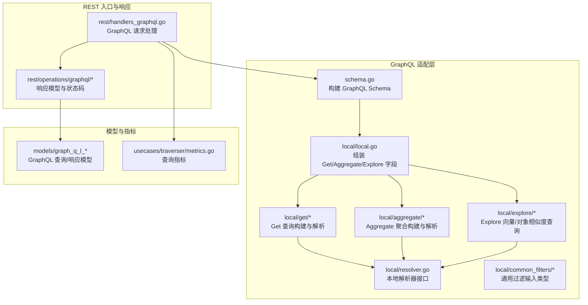
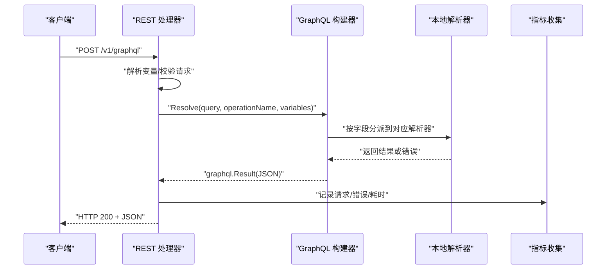
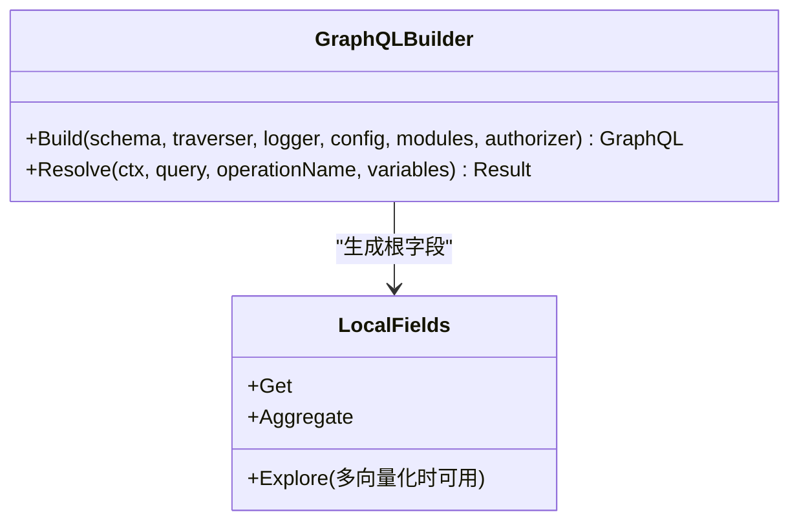
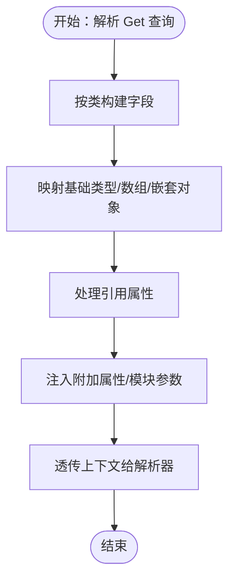
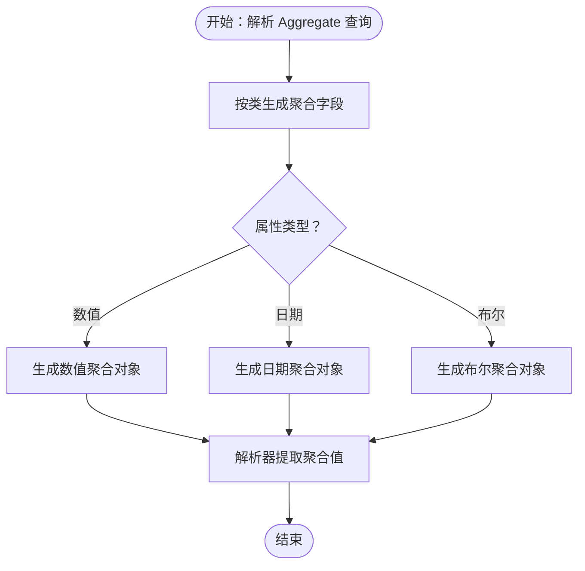
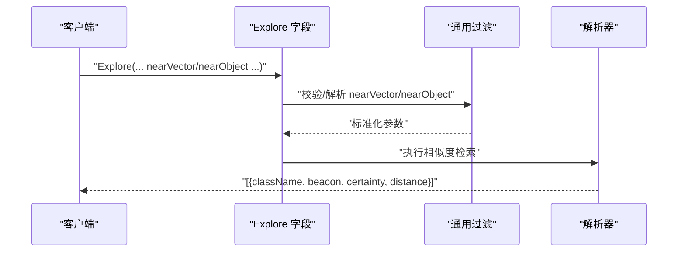
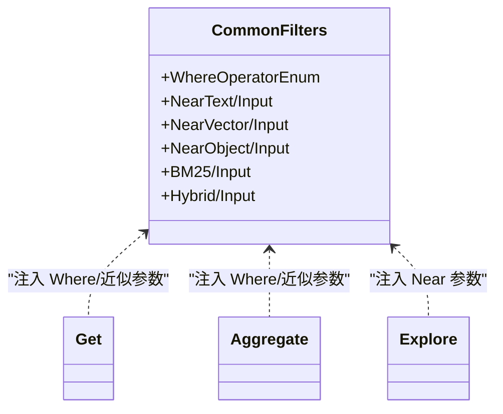
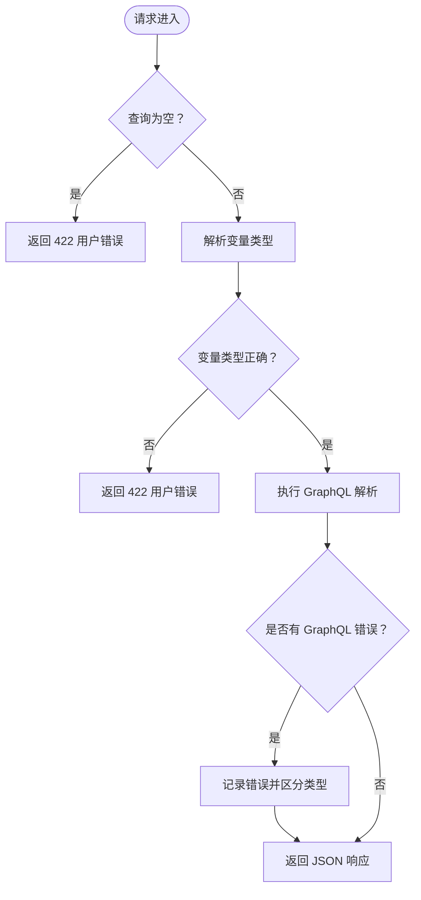
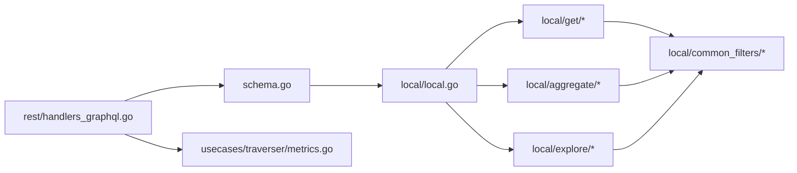

# GraphQL API

<cite>
**本文引用的文件**
- [adapters/handlers/graphql/schema.go](file://adapters/handlers/graphql/schema.go)
- [adapters/handlers/graphql/local/local.go](file://adapters/handlers/graphql/local/local.go)
- [adapters/handlers/graphql/local/resolver.go](file://adapters/handlers/graphql/local/resolver.go)
- [adapters/handlers/graphql/local/get/get.go](file://adapters/handlers/graphql/local/get/get.go)
- [adapters/handlers/graphql/local/get/class_builder_fields.go](file://adapters/handlers/graphql/local/get/class_builder_fields.go)
- [adapters/handlers/graphql/local/get/class_builder_nested.go](file://adapters/handlers/graphql/local/get/class_builder_nested.go)
- [adapters/handlers/graphql/local/aggregate/aggregate.go](file://adapters/handlers/graphql/local/aggregate/aggregate.go)
- [adapters/handlers/graphql/local/aggregate/properties.go](file://adapters/handlers/graphql/local/aggregate/properties.go)
- [adapters/handlers/graphql/local/aggregate/explore_argument.go](file://adapters/handlers/graphql/local/aggregate/explore_argument.go)
- [adapters/handlers/graphql/local/explore/concepts.go](file://adapters/handlers/graphql/local/explore/concepts.go)
- [adapters/handlers/graphql/local/common_filters/filters_types.go](file://adapters/handlers/graphql/local/common_filters/filters_types.go)
- [adapters/handlers/graphql/descriptions/rootQuery.go](file://adapters/handlers/graphql/descriptions/rootQuery.go)
- [adapters/handlers/graphql/descriptions/introspect.go](file://adapters/handlers/graphql/descriptions/introspect.go)
- [adapters/handlers/graphql/utils/helper_objects.go](file://adapters/handlers/graphql/utils/helper_objects.go)
- [adapters/handlers/rest/handlers_graphql.go](file://adapters/handlers/rest/handlers_graphql.go)
- [adapters/handlers/rest/operations/graphql/graphql_post_responses.go](file://adapters/handlers/rest/operations/graphql/graphql_post_responses.go)
- [adapters/handlers/rest/operations/graphql/graphql_batch_responses.go](file://adapters/handlers/rest/operations/graphql/graphql_batch_responses.go)
- [entities/models/graph_q_l_queries.go](file://entities/models/graph_q_l_queries.go)
- [entities/models/graph_q_l_responses.go](file://entities/models/graph_q_l_responses.go)
- [usecases/traverser/metrics.go](file://usecases/traverser/metrics.go)
- [usecases/modulecomponents/arguments/nearText/graphql_argument.go](file://usecases/modulecomponents/arguments/nearText/graphql_argument.go)
- [test/acceptance/batch_request_endpoints/graphql_test.go](file://test/acceptance/batch_request_endpoints/graphql_test.go)
</cite>

## 目录
1. [简介](#简介)
2. [项目结构](#项目结构)
3. [核心组件](#核心组件)
4. [架构总览](#架构总览)
5. [详细组件分析](#详细组件分析)
6. [依赖关系分析](#依赖关系分析)
7. [性能考量](#性能考量)
8. [故障排查指南](#故障排查指南)
9. [结论](#结论)
10. [附录](#附录)

## 简介
本文件为 Weaviate GraphQL API 的权威接口文档，覆盖查询端点、Schema 类型系统、参数与过滤、聚合查询、内省与片段、变量与指令、批量查询、缓存策略、错误处理与性能优化等主题。Weaviate 的 GraphQL 实现通过动态构建 Schema，将数据库中的类与属性映射到 GraphQL 字段，并在执行时由本地解析器完成数据获取与聚合。

## 项目结构
GraphQL 相关代码主要位于适配层的 GraphQL 处理器与本地解析器中，配合 REST 层的请求入口与响应封装，以及模块化能力（如 nearText、Explore 等）对查询进行扩展。

**图表来源**
- [adapters/handlers/graphql/schema.go](file://adapters/handlers/graphql/schema.go#L86-L122)
- [adapters/handlers/graphql/local/local.go](file://adapters/handlers/graphql/local/local.go#L26-L58)
- [adapters/handlers/graphql/local/resolver.go](file://adapters/handlers/graphql/local/resolver.go#L19-L23)
- [adapters/handlers/rest/handlers_graphql.go](file://adapters/handlers/rest/handlers_graphql.go#L217-L356)
- [adapters/handlers/rest/operations/graphql/graphql_post_responses.go](file://adapters/handlers/rest/operations/graphql/graphql_post_responses.go#L158-L195)
- [adapters/handlers/rest/operations/graphql/graphql_batch_responses.go](file://adapters/handlers/rest/operations/graphql/graphql_batch_responses.go#L151-L194)
- [entities/models/graph_q_l_queries.go](file://entities/models/graph_q_l_queries.go#L53-L84)
- [entities/models/graph_q_l_responses.go](file://entities/models/graph_q_l_responses.go#L53-L84)
- [usecases/traverser/metrics.go](file://usecases/traverser/metrics.go#L58-L135)

**章节来源**
- [adapters/handlers/graphql/schema.go](file://adapters/handlers/graphql/schema.go#L52-L84)
- [adapters/handlers/graphql/local/local.go](file://adapters/handlers/graphql/local/local.go#L26-L58)

## 核心组件
- GraphQL 构建器：从数据库 Schema 动态生成 GraphQL Schema，并注入根查询对象。
- 本地解析器接口：统一 Get、Aggregate、Explore 的解析职责。
- Get 查询：按类构建字段、支持嵌套对象、数组、引用、附加属性与模块能力。
- Aggregate 聚合：按数值/日期/布尔等类型生成聚合子对象与解析器。
- Explore 概念检索：支持 nearVector/nearObject 参数，返回类名、信标、确定性与距离。
- 通用过滤：为 Get/Aggregate/Explore 提供 Where 过滤、BM25、hybrid、nearX 等输入类型。
- REST 入口：接收 GraphQL 请求，解析变量，调用 Resolve 并返回 JSON 响应。
- 错误与指标：区分用户错误与服务端错误，记录指标并输出标准化错误响应。

**章节来源**
- [adapters/handlers/graphql/schema.go](file://adapters/handlers/graphql/schema.go#L40-L84)
- [adapters/handlers/graphql/local/resolver.go](file://adapters/handlers/graphql/local/resolver.go#L19-L23)
- [adapters/handlers/graphql/local/get/get.go](file://adapters/handlers/graphql/local/get/get.go#L36-L64)
- [adapters/handlers/graphql/local/aggregate/aggregate.go](file://adapters/handlers/graphql/local/aggregate/aggregate.go#L42-L88)
- [adapters/handlers/graphql/local/explore/concepts.go](file://adapters/handlers/graphql/local/explore/concepts.go#L30-L59)
- [adapters/handlers/rest/handlers_graphql.go](file://adapters/handlers/rest/handlers_graphql.go#L217-L356)

## 架构总览
GraphQL 查询从 REST 入口进入，经由 GraphQL 构建器生成 Schema，随后由本地解析器执行具体逻辑（Get/Aggregate/Explore），最终返回 JSON 结果。错误与指标贯穿整个流程。

**图表来源**
- [adapters/handlers/rest/handlers_graphql.go](file://adapters/handlers/rest/handlers_graphql.go#L217-L356)
- [adapters/handlers/graphql/schema.go](file://adapters/handlers/graphql/schema.go#L71-L84)
- [usecases/traverser/metrics.go](file://usecases/traverser/metrics.go#L73-L135)

## 详细组件分析

### GraphQL Schema 与根查询
- 根对象名称为“WeaviateObj”，包含 Get、Aggregate（以及多向量化时可选的 Explore）字段。
- Schema 在运行时动态构建，内部通过 panic 捕获与 Sentry 记录错误，保证 Schema 构建失败时可被上层感知。
- 描述信息来自独立的描述常量文件，便于统一维护。

**图表来源**
- [adapters/handlers/graphql/schema.go](file://adapters/handlers/graphql/schema.go#L52-L84)
- [adapters/handlers/graphql/local/local.go](file://adapters/handlers/graphql/local/local.go#L26-L58)
- [adapters/handlers/graphql/descriptions/rootQuery.go](file://adapters/handlers/graphql/descriptions/rootQuery.go#L15-L29)

**章节来源**
- [adapters/handlers/graphql/schema.go](file://adapters/handlers/graphql/schema.go#L86-L122)
- [adapters/handlers/graphql/local/local.go](file://adapters/handlers/graphql/local/local.go#L26-L58)
- [adapters/handlers/graphql/descriptions/rootQuery.go](file://adapters/handlers/graphql/descriptions/rootQuery.go#L15-L29)

### Get 查询：字段选择、嵌套与引用
- Get 字段按数据库类动态生成，每个类对应一个对象类型，包含该类的所有属性字段。
- 支持基本类型、数组、嵌套对象、UUID/日期等特殊类型映射；引用属性以对象形式返回。
- 附加属性与模块能力（如 nearText、rerank 等）通过模块提供者注入到 Get 查询中。
- Get 解析器本身不执行查询，仅透传上下文给后续解析链。

**图表来源**
- [adapters/handlers/graphql/local/get/get.go](file://adapters/handlers/graphql/local/get/get.go#L36-L64)
- [adapters/handlers/graphql/local/get/class_builder_fields.go](file://adapters/handlers/graphql/local/get/class_builder_fields.go#L85-L143)
- [adapters/handlers/graphql/local/get/class_builder_nested.go](file://adapters/handlers/graphql/local/get/class_builder_nested.go#L44-L87)

**章节来源**
- [adapters/handlers/graphql/local/get/get.go](file://adapters/handlers/graphql/local/get/get.go#L36-L64)
- [adapters/handlers/graphql/local/get/class_builder_fields.go](file://adapters/handlers/graphql/local/get/class_builder_fields.go#L85-L143)
- [adapters/handlers/graphql/local/get/class_builder_nested.go](file://adapters/handlers/graphql/local/get/class_builder_nested.go#L44-L87)

### 聚合查询：数值/日期/布尔聚合
- 聚合字段按类生成，针对数值/日期/布尔等类型分别构建聚合对象。
- 解析器从聚合结果中提取对应属性值，缺失属性会返回错误。
- nearVector/nearObject 参数在聚合查询中同样可用，用于限定搜索空间。

**图表来源**
- [adapters/handlers/graphql/local/aggregate/aggregate.go](file://adapters/handlers/graphql/local/aggregate/aggregate.go#L42-L88)
- [adapters/handlers/graphql/local/aggregate/properties.go](file://adapters/handlers/graphql/local/aggregate/properties.go#L432-L478)
- [adapters/handlers/graphql/local/aggregate/explore_argument.go](file://adapters/handlers/graphql/local/aggregate/explore_argument.go#L19-L25)

**章节来源**
- [adapters/handlers/graphql/local/aggregate/aggregate.go](file://adapters/handlers/graphql/local/aggregate/aggregate.go#L42-L88)
- [adapters/handlers/graphql/local/aggregate/properties.go](file://adapters/handlers/graphql/local/aggregate/properties.go#L432-L478)
- [adapters/handlers/graphql/local/aggregate/explore_argument.go](file://adapters/handlers/graphql/local/aggregate/explore_argument.go#L19-L25)

### Explore 概念检索：向量/对象相似度
- Explore 返回包含类名、信标、确定性与距离的对象列表。
- 支持 nearVector 与 nearObject 参数，可指定 certainty/distance 与 targetVectors。
- 参数类型通过通用过滤模块定义，确保类型安全与一致性。

**图表来源**
- [adapters/handlers/graphql/local/explore/concepts.go](file://adapters/handlers/graphql/local/explore/concepts.go#L30-L59)
- [adapters/handlers/graphql/local/explore/concepts.go](file://adapters/handlers/graphql/local/explore/concepts.go#L129-L196)
- [adapters/handlers/graphql/local/common_filters/filters_types.go](file://adapters/handlers/graphql/local/common_filters/filters_types.go#L49-L148)

**章节来源**
- [adapters/handlers/graphql/local/explore/concepts.go](file://adapters/handlers/graphql/local/explore/concepts.go#L30-L59)
- [adapters/handlers/graphql/local/common_filters/filters_types.go](file://adapters/handlers/graphql/local/common_filters/filters_types.go#L49-L148)

### 通用过滤与输入类型
- 为 Where 过滤、BM25、hybrid、nearText/nearVector/nearObject 等提供动态输入类型。
- 输入标量支持单值与数组，解析时自动处理类型转换与校验。
- nearText 参数在 Get/Aggregate/Explore 中分别以不同前缀命名，避免冲突。

**图表来源**
- [adapters/handlers/graphql/local/common_filters/filters_types.go](file://adapters/handlers/graphql/local/common_filters/filters_types.go#L49-L148)
- [usecases/modulecomponents/arguments/nearText/graphql_argument.go](file://usecases/modulecomponents/arguments/nearText/graphql_argument.go#L23-L46)

**章节来源**
- [adapters/handlers/graphql/local/common_filters/filters_types.go](file://adapters/handlers/graphql/local/common_filters/filters_types.go#L49-L148)
- [usecases/modulecomponents/arguments/nearText/graphql_argument.go](file://usecases/modulecomponents/arguments/nearText/graphql_argument.go#L23-L46)

### 内省、片段、变量与指令
- 内省：通过标准 GraphQL 内省字段（如 __schema、__type、__typename）获取类型信息与文档描述。
- 片段：可复用字段集合，减少重复选择，提升查询效率。
- 变量：在请求体中传递变量并在查询中引用，便于批量与缓存场景。
- 指令：支持内置指令（如 @include/@skip），可按条件控制字段选择。

[本节为概念性说明，不直接分析具体源码文件]

### 批量 GraphQL 查询与缓存
- 批量查询：REST 层接收多个 GraphQL 请求，逐个执行并保持顺序一致，错误与成功混合返回。
- 缓存建议：基于查询字符串与变量的哈希进行缓存；对稳定查询（如聚合统计）可采用短期缓存；对向量检索类查询建议禁用缓存或加入时间戳/随机后缀。

**章节来源**
- [test/acceptance/batch_request_endpoints/graphql_test.go](file://test/acceptance/batch_request_endpoints/graphql_test.go#L35-L67)
- [adapters/handlers/rest/handlers_graphql.go](file://adapters/handlers/rest/handlers_graphql.go#L217-L356)

### 错误处理机制
- 用户错误：语法错误、字段不存在、参数非法等，返回 422 并携带错误详情。
- 服务端错误：内部异常、panic 恢复、Sentry 记录，返回 500。
- 指标记录：区分用户错误、服务端错误与成功请求，按类名与查询类型统计。

**图表来源**
- [adapters/handlers/rest/handlers_graphql.go](file://adapters/handlers/rest/handlers_graphql.go#L217-L356)
- [adapters/handlers/rest/operations/graphql/graphql_post_responses.go](file://adapters/handlers/rest/operations/graphql/graphql_post_responses.go#L158-L195)
- [adapters/handlers/rest/operations/graphql/graphql_batch_responses.go](file://adapters/handlers/rest/operations/graphql/graphql_batch_responses.go#L151-L194)

**章节来源**
- [adapters/handlers/rest/handlers_graphql.go](file://adapters/handlers/rest/handlers_graphql.go#L217-L356)
- [adapters/handlers/rest/operations/graphql/graphql_post_responses.go](file://adapters/handlers/rest/operations/graphql/graphql_post_responses.go#L158-L195)
- [adapters/handlers/rest/operations/graphql/graphql_batch_responses.go](file://adapters/handlers/rest/operations/graphql/graphql_batch_responses.go#L151-L194)

## 依赖关系分析
- GraphQL 构建器依赖本地字段装配器与模块提供者，后者决定是否暴露 Explore。
- Get/Aggregate/Explore 共同依赖通用过滤模块与授权器。
- REST 层负责请求解析、变量校验与响应封装，同时对接指标系统。

**图表来源**
- [adapters/handlers/graphql/schema.go](file://adapters/handlers/graphql/schema.go#L86-L122)
- [adapters/handlers/graphql/local/local.go](file://adapters/handlers/graphql/local/local.go#L26-L58)
- [adapters/handlers/rest/handlers_graphql.go](file://adapters/handlers/rest/handlers_graphql.go#L217-L356)

**章节来源**
- [adapters/handlers/graphql/local/local.go](file://adapters/handlers/graphql/local/local.go#L26-L58)
- [adapters/handlers/graphql/local/common_filters/filters_types.go](file://adapters/handlers/graphql/local/common_filters/filters_types.go#L49-L148)

## 性能考量
- 查询计数与耗时：Get/Aggregate 查询均通过指标系统记录请求数量与耗时，支持按类名与查询类型聚合。
- 批量请求：REST 层顺序执行多个请求，注意避免过长队列导致延迟。
- 缓存策略：对稳定聚合与静态查询启用短期缓存；对向量检索与实时查询禁用缓存。
- 过滤与排序：尽量使用索引友好过滤（如 Where + 排序字段），避免全表扫描。
- 字段裁剪：仅选择所需字段，减少序列化开销。

**章节来源**
- [usecases/traverser/metrics.go](file://usecases/traverser/metrics.go#L58-L135)
- [adapters/handlers/rest/handlers_graphql.go](file://adapters/handlers/rest/handlers_graphql.go#L358-L401)

## 故障排查指南
- 422 用户错误：检查查询语法、字段拼写、变量类型与 Where 条件。
- 500 服务端错误：查看日志与 Sentry 记录，定位 panic 或模块异常。
- 批量请求顺序：确认每个子请求的错误与成功响应一一对应。
- 指标核对：通过指标页面确认用户错误与服务端错误比例，定位热点问题。

**章节来源**
- [adapters/handlers/rest/handlers_graphql.go](file://adapters/handlers/rest/handlers_graphql.go#L358-L401)
- [test/acceptance/batch_request_endpoints/graphql_test.go](file://test/acceptance/batch_request_endpoints/graphql_test.go#L35-L67)

## 结论
Weaviate 的 GraphQL API 通过动态 Schema 与模块化能力，提供了灵活且强大的查询接口。结合 REST 批量执行、内省与片段、变量与指令，以及完善的错误与指标体系，能够满足从简单检索到复杂聚合与向量相似度探索的多种场景。建议在生产环境中合理使用缓存与字段裁剪，并通过指标持续监控查询性能与稳定性。

## 附录
- GraphQL 与 REST 的区别与优势
  - GraphQL：精确字段选择、强类型、内省、一次性获取多资源；REST：语义明确、广泛兼容、缓存友好。
  - Weaviate 的 GraphQL 更适合复杂嵌套与多类关联查询，REST 则更适合简单 CRUD 与批量任务。
- 最佳实践
  - 使用片段减少重复字段。
  - 将稳定查询结果缓存，向量检索类查询避免缓存。
  - 优先使用 Where + 排序字段，减少客户端二次处理。
  - 对批量请求保持顺序一致性，便于错误定位。
- 调试技巧
  - 使用内省字段快速了解类型与字段描述。
  - 逐步缩小查询范围，先验证语法再添加过滤与排序。
  - 关注指标面板，识别慢查询与错误高峰。

[本节为概念性总结，不直接分析具体源码文件]