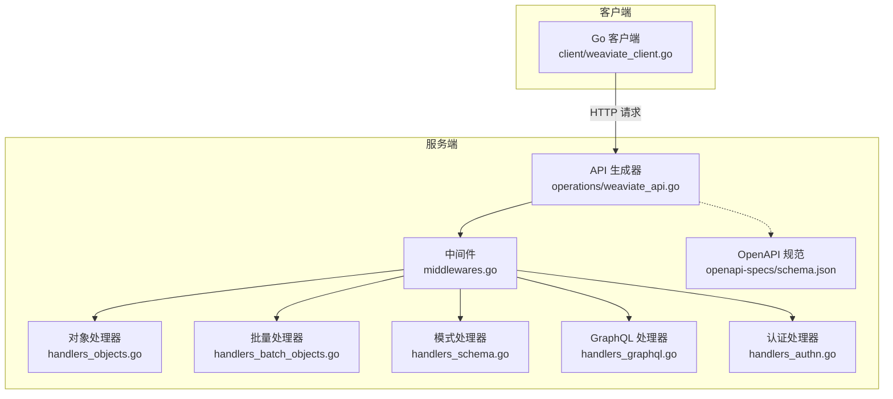
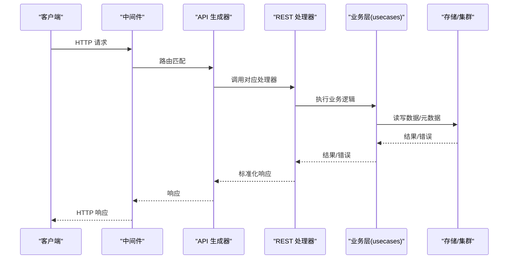
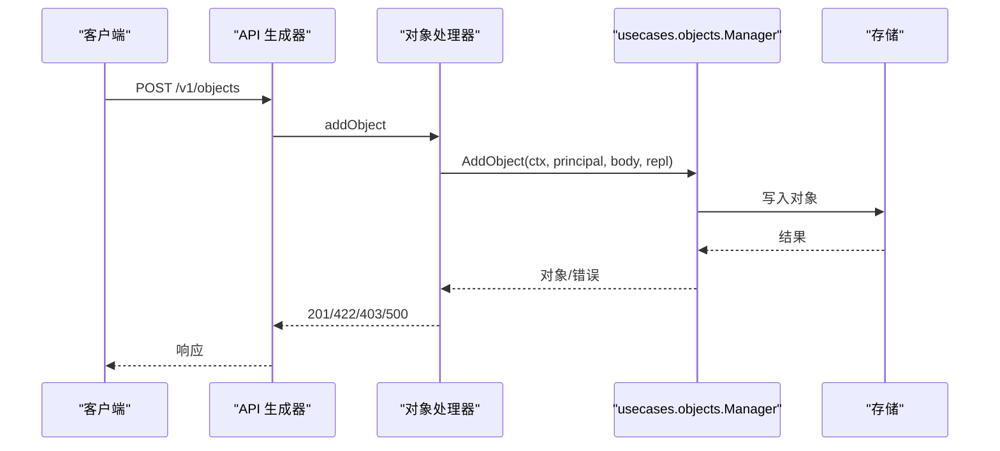
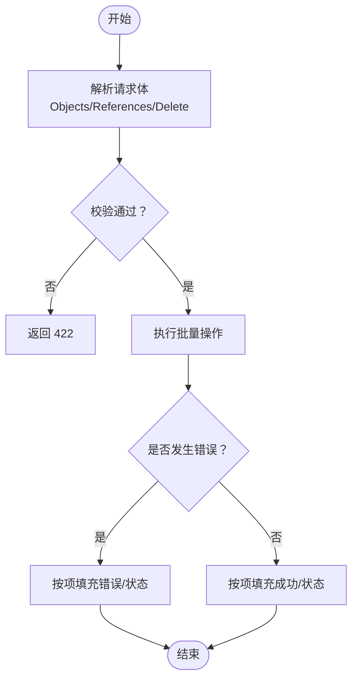
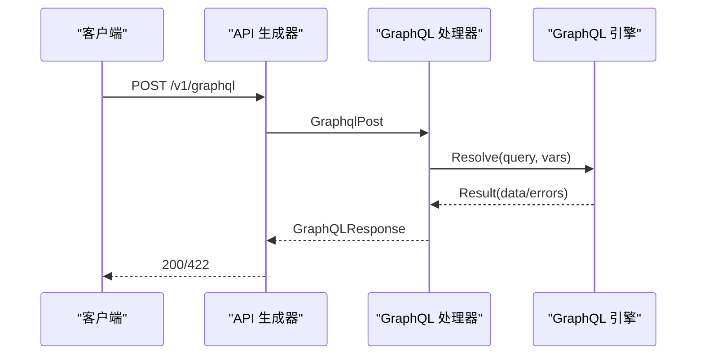
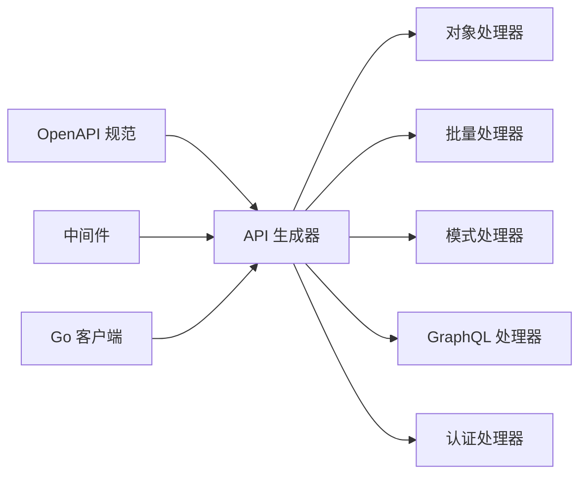

# REST API

<cite>
**本文引用的文件**
- [openapi 规范 schema.json](file://openapi-specs/schema.json)
- [Weaviate API 生成器 weaviate_api.go](file://adapters/handlers/rest/operations/weaviate_api.go)
- [对象处理器 handlers_objects.go](file://adapters/handlers/rest/handlers_objects.go)
- [批量对象处理器 handlers_batch_objects.go](file://adapters/handlers/rest/handlers_batch_objects.go)
- [模式处理器 handlers_schema.go](file://adapters/handlers/rest/handlers_schema.go)
- [GraphQL 处理器 handlers_graphql.go](file://adapters/handlers/rest/handlers_graphql.go)
- [认证处理器 handlers_authn.go](file://adapters/handlers/rest/handlers_authn.go)
- [中间件 middlewares.go](file://adapters/handlers/rest/middlewares.go)
- [通用错误与帮助 helpers.go](file://adapters/handlers/rest/helpers.go)
- [Go 客户端入口 weaviate_client.go](file://client/weaviate_client.go)
</cite>

## 目录
1. [简介](#简介)
2. [项目结构](#项目结构)
3. [核心组件](#核心组件)
4. [架构总览](#架构总览)
5. [详细组件分析](#详细组件分析)
6. [依赖关系分析](#依赖关系分析)
7. [性能考虑](#性能考虑)
8. [故障排查指南](#故障排查指南)
9. [结论](#结论)
10. [附录](#附录)

## 简介
本文件为 Weaviate 的 REST API 技术参考与集成指南，覆盖对象管理（CRUD）、批量操作、模式管理、GraphQL 查询、认证与授权、分页/过滤/排序/聚合、错误处理与状态码、性能优化与最佳实践等内容。文档基于仓库中的 OpenAPI 规范与后端实现，确保接口定义与实际行为一致。

## 项目结构
Weaviate 的 REST API 由以下关键模块组成：
- OpenAPI 规范：定义了端点、参数、请求/响应模型与错误格式
- REST 处理器：对象、批量、模式、GraphQL、认证等业务逻辑
- 中间件：CORS、日志、监控、健康检查、只读/扩缩容模式限制等
- 客户端：自动生成的 Go 客户端，便于集成

**图表来源**
- [中间件 middlewares.go](file://adapters/handlers/rest/middlewares.go#L93-L137)
- [对象处理器 handlers_objects.go](file://adapters/handlers/rest/handlers_objects.go#L614-L658)
- [批量对象处理器 handlers_batch_objects.go](file://adapters/handlers/rest/handlers_batch_objects.go#L276-L285)
- [模式处理器 handlers_schema.go](file://adapters/handlers/rest/handlers_schema.go#L361-L390)
- [GraphQL 处理器 handlers_graphql.go](file://adapters/handlers/rest/handlers_graphql.go#L51-L206)
- [认证处理器 handlers_authn.go](file://adapters/handlers/rest/handlers_authn.go#L34-L87)
- [Weaviate API 生成器 weaviate_api.go](file://adapters/handlers/rest/operations/weaviate_api.go#L51-L372)
- [openapi 规范 schema.json](file://openapi-specs/schema.json#L1-L800)

**章节来源**
- [中间件 middlewares.go](file://adapters/handlers/rest/middlewares.go#L93-L137)
- [Weaviate API 生成器 weaviate_api.go](file://adapters/handlers/rest/operations/weaviate_api.go#L51-L372)

## 核心组件
- 对象管理（CRUD）
  - 单对象：创建、读取、更新、删除、存在性检查、校验
  - 批量：批量创建、批量删除、批量引用创建
  - 引用：单对象引用增删改
- 模式管理
  - 类：创建、更新、删除、查询
  - 属性：新增属性
  - 租户：创建、更新、删除、查询、存在性检查
  - 分片：查询/更新分片状态
  - 模式导出
- GraphQL
  - 单次查询与批处理查询
  - 鉴权要求与错误处理
- 认证与授权
  - API Key、Bearer Token（OIDC/OAuth2）
  - RBAC 角色与权限解析
- 中间件与运行时
  - CORS、日志、监控、健康检查、只读/扩缩容模式限制、模块路由注入

**章节来源**
- [对象处理器 handlers_objects.go](file://adapters/handlers/rest/handlers_objects.go#L79-L478)
- [批量对象处理器 handlers_batch_objects.go](file://adapters/handlers/rest/handlers_batch_objects.go#L43-L221)
- [模式处理器 handlers_schema.go](file://adapters/handlers/rest/handlers_schema.go#L36-L359)
- [GraphQL 处理器 handlers_graphql.go](file://adapters/handlers/rest/handlers_graphql.go#L60-L205)
- [认证处理器 handlers_authn.go](file://adapters/handlers/rest/handlers_authn.go#L41-L86)
- [中间件 middlewares.go](file://adapters/handlers/rest/middlewares.go#L93-L285)

## 架构总览
REST API 的调用链路如下：
- 客户端通过 HTTP 发送请求
- 中间件统一处理 CORS、日志、监控、健康检查、只读/扩缩容模式限制、模块路由
- API 生成器根据 OpenAPI 规范绑定路由与处理器
- 处理器调用 usecases 层完成业务逻辑，并返回标准化响应或错误

**图表来源**
- [中间件 middlewares.go](file://adapters/handlers/rest/middlewares.go#L93-L137)
- [Weaviate API 生成器 weaviate_api.go](file://adapters/handlers/rest/operations/weaviate_api.go#L51-L372)
- [对象处理器 handlers_objects.go](file://adapters/handlers/rest/handlers_objects.go#L79-L116)
- [GraphQL 处理器 handlers_graphql.go](file://adapters/handlers/rest/handlers_graphql.go#L119-L153)

## 详细组件分析

### 对象管理（CRUD 与引用）
- 端点与方法
  - 创建对象：POST /v1/objects
  - 校验对象：POST /v1/objects/validate
  - 读取对象：GET /v1/objects/{className}/{id}
  - 列表/查询：GET /v1/objects 或带类名查询
  - 更新对象：PUT /v1/objects/{className}/{id}
  - 合并更新：PATCH /v1/objects/{className}/{id}
  - 删除对象：DELETE /v1/objects/{className}/{id}
  - 存在性检查：HEAD /v1/objects/{className}/{id}
  - 引用：
    - 新增：POST /v1/objects/{className}/{id}/references/{propertyName}
    - 替换：PUT /v1/objects/{className}/{id}/references/{propertyName}
    - 删除：DELETE /v1/objects/{className}/{id}/references/{propertyName}
- 关键参数
  - ConsistencyLevel、NodeName（一致性/节点选择）
  - Tenant（多租户）
  - Include（附加属性/模块参数）
- 响应与状态码
  - 成功：200/201/204
  - 语义错误：422
  - 权限不足：403
  - 未找到：404
  - 服务器错误：500
- 错误处理
  - 统一错误模型：ErrorResponse
  - 区分用户错误与服务端错误，记录指标

**图表来源**
- [对象处理器 handlers_objects.go](file://adapters/handlers/rest/handlers_objects.go#L79-L116)
- [Weaviate API 生成器 weaviate_api.go](file://adapters/handlers/rest/operations/weaviate_api.go#L259-L295)

**章节来源**
- [对象处理器 handlers_objects.go](file://adapters/handlers/rest/handlers_objects.go#L79-L478)
- [Weaviate API 生成器 weaviate_api.go](file://adapters/handlers/rest/operations/weaviate_api.go#L259-L295)

### 批量操作
- 端点与方法
  - 批量创建对象：POST /v1/batch/objects
  - 批量删除对象：POST /v1/batch/objects/delete
  - 批量创建引用：POST /v1/batch/references
- 关键参数
  - Fields（返回字段）
  - Match/Where（删除条件）
  - DeletionTimeUnixMilli/DryRun/Output（删除选项）
  - ConsistencyLevel
- 响应
  - 批量创建：每条结果含 Status/Errors
  - 批量删除：汇总统计与逐项结果（支持 Output=verbose/minimal）

**图表来源**
- [批量对象处理器 handlers_batch_objects.go](file://adapters/handlers/rest/handlers_batch_objects.go#L43-L221)

**章节来源**
- [批量对象处理器 handlers_batch_objects.go](file://adapters/handlers/rest/handlers_batch_objects.go#L43-L221)

### 模式管理
- 端点与方法
  - 创建类：POST /v1/schema
  - 更新类：PUT /v1/schema/{className}
  - 删除类：DELETE /v1/schema/{className}
  - 查询类：GET /v1/schema/{className}
  - 导出模式：GET /v1/schema
  - 新增属性：POST /v1/schema/{className}/properties
  - 分片状态：GET /v1/schema/{className}/shards
  - 更新分片状态：PUT /v1/schema/{className}/shards/{shardName}
  - 租户：
    - 创建：POST /v1/schema/{className}/tenants
    - 更新：PUT /v1/schema/{className}/tenants
    - 删除：DELETE /v1/schema/{className}/tenants
    - 查询：GET /v1/schema/{className}/tenants
    - 单个：GET /v1/schema/{className}/tenants/{tenantName}
    - 存在性：GET /v1/schema/{className}/tenants/{tenantName}/exists
- 关键参数
  - Consistency（一致性级别）
  - Tenant（多租户）
- 响应与状态码
  - 成功：200/201/204
  - 未找到：404
  - 语义错误：422
  - 权限不足：403
  - 服务器错误：500

**章节来源**
- [模式处理器 handlers_schema.go](file://adapters/handlers/rest/handlers_schema.go#L36-L359)

### GraphQL 查询
- 端点与方法
  - 单次查询：POST /v1/graphql
  - 批量查询：POST /v1/graphql/batch
- 鉴权
  - 单次查询：至少需要 read_collections 权限（因内省）
  - 批量查询：需要对所有集合的读取权限
- 请求体
  - query、operationName、variables
- 响应
  - GraphQLResponse：data 或 errors
  - 批量：按原顺序返回各子请求结果
- 错误处理
  - 语法/语义错误：422
  - 无 GraphQL 提供者：422
  - 指标区分用户错误与服务端错误

**图表来源**
- [GraphQL 处理器 handlers_graphql.go](file://adapters/handlers/rest/handlers_graphql.go#L60-L154)

**章节来源**
- [GraphQL 处理器 handlers_graphql.go](file://adapters/handlers/rest/handlers_graphql.go#L60-L205)

### 认证与授权
- 认证方式
  - API Key：请求头 Authorization: Bearer <key> 或特定 X-API-Key/X-API-Token（兼容）
  - Bearer Token：OAuth2/OIDC
- 授权
  - RBAC：角色-权限映射，控制器查询用户/组的角色与权限
  - 作用域：collections/data/nodes/users/roles/tenants/replicate/aliases 等
- 自身信息
  - GET /v1/users/me：返回用户名、组、角色列表（启用 RBAC 时）

**章节来源**
- [中间件 middlewares.go](file://adapters/handlers/rest/middlewares.go#L93-L137)
- [认证处理器 handlers_authn.go](file://adapters/handlers/rest/handlers_authn.go#L41-L86)

### 高级功能
- 分页
  - GET /v1/objects 支持 offset/limit
- 过滤
  - 通过 GraphQL Where/Explore/Autocut 等能力（见 GraphQL 处理器）
- 排序
  - GET /v1/objects 支持 sort/order
- 聚合
  - GraphQL 聚合/聚合扩展（Aggregate/Group 等）
- 多租户
  - Tenant 参数贯穿对象与模式操作
- 一致性
  - ConsistencyLevel、NodeName 控制读写一致性与节点选择

**章节来源**
- [对象处理器 handlers_objects.go](file://adapters/handlers/rest/handlers_objects.go#L218-L323)
- [GraphQL 处理器 handlers_graphql.go](file://adapters/handlers/rest/handlers_graphql.go#L119-L153)

## 依赖关系分析
- API 生成器绑定各业务处理器
- 处理器依赖 usecases 层（对象、模式、GraphQL、认证等）
- 中间件贯穿全局，提供横切能力
- 客户端基于 OpenAPI 规范自动生成

**图表来源**
- [Weaviate API 生成器 weaviate_api.go](file://adapters/handlers/rest/operations/weaviate_api.go#L51-L372)
- [中间件 middlewares.go](file://adapters/handlers/rest/middlewares.go#L93-L137)
- [Go 客户端入口 weaviate_client.go](file://client/weaviate_client.go#L56-L99)

**章节来源**
- [Weaviate API 生成器 weaviate_api.go](file://adapters/handlers/rest/operations/weaviate_api.go#L51-L372)
- [Go 客户端入口 weaviate_client.go](file://client/weaviate_client.go#L56-L99)

## 性能考虑
- 监控与指标
  - Prometheus 指标：请求总量、耗时、请求体/响应体大小、批量耗时
  - 批量对象 POST 特别记录批量耗时与请求体大小
- 批处理优先
  - 使用批量端点减少往返与开销
- 一致性与可用性
  - 合理设置 ConsistencyLevel，在延迟与一致性间权衡
- 只读/扩缩容模式
  - 中间件在只读/写入受限场景下直接拒绝写请求，避免无效负载
- CORS 与预检
  - 正确配置 AllowMethods/AllowHeaders/AllowOrigin，减少浏览器预检失败

**章节来源**
- [中间件 middlewares.go](file://adapters/handlers/rest/middlewares.go#L178-L198)
- [中间件 middlewares.go](file://adapters/handlers/rest/middlewares.go#L200-L212)
- [中间件 middlewares.go](file://adapters/handlers/rest/middlewares.go#L262-L285)

## 故障排查指南
- 常见错误与状态码
  - 403 Forbidden：权限不足（RBAC）
  - 422 Unprocessable Entity：请求格式正确但语义错误（如非法输入、多租户问题）
  - 404 Not Found：资源不存在
  - 500 Internal Server Error：服务器内部错误
- 错误模型
  - ErrorResponse：统一错误数组，包含 message
- 日志与追踪
  - 中间件记录请求方法与 URL
  - Sentry 可选接入，OpenTelemetry 可选追踪
- 健康检查
  - /v1/.well-known/live：存活
  - /v1/.well-known/ready：就绪（考虑维护模式、集群健康、模块元数据）

**章节来源**
- [通用错误与帮助 helpers.go](file://adapters/handlers/rest/helpers.go#L20-L40)
- [中间件 middlewares.go](file://adapters/handlers/rest/middlewares.go#L165-L176)
- [中间件 middlewares.go](file://adapters/handlers/rest/middlewares.go#L233-L260)

## 结论
Weaviate 的 REST API 以 OpenAPI 为核心，结合中间件与处理器实现了高可扩展、可观测、安全可控的向量数据库接口。通过对象/批量/模式/GraphQL 四大能力与完善的认证授权体系，开发者可以快速构建从检索增强到多租户隔离的各类应用。建议优先采用批量端点、合理设置一致性级别、在只读/扩缩容模式下遵循白名单策略，并利用监控与日志进行持续优化。

## 附录

### OpenAPI 基础信息
- 基础路径：/v1
- 默认媒体类型：application/json
- 支持媒体类型：application/json、application/yaml
- 客户端默认 Host/BasePath/Schemes 可在 Go 客户端中配置

**章节来源**
- [openapi 规范 schema.json](file://openapi-specs/schema.json#L1-L10)
- [Go 客户端入口 weaviate_client.go](file://client/weaviate_client.go#L44-L55)