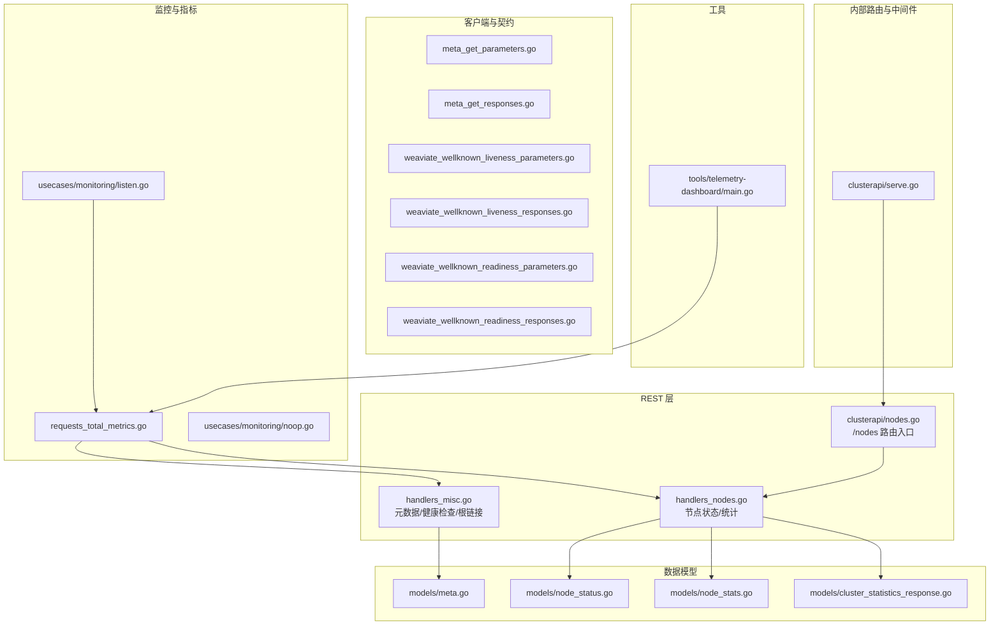
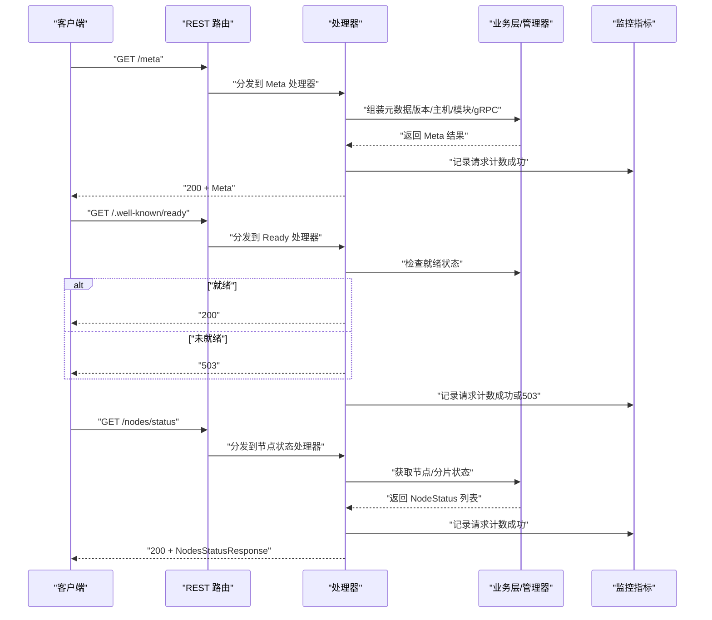
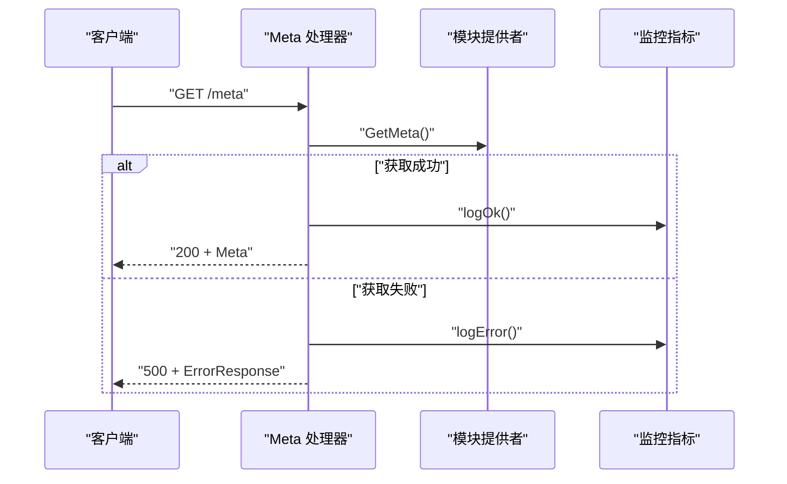
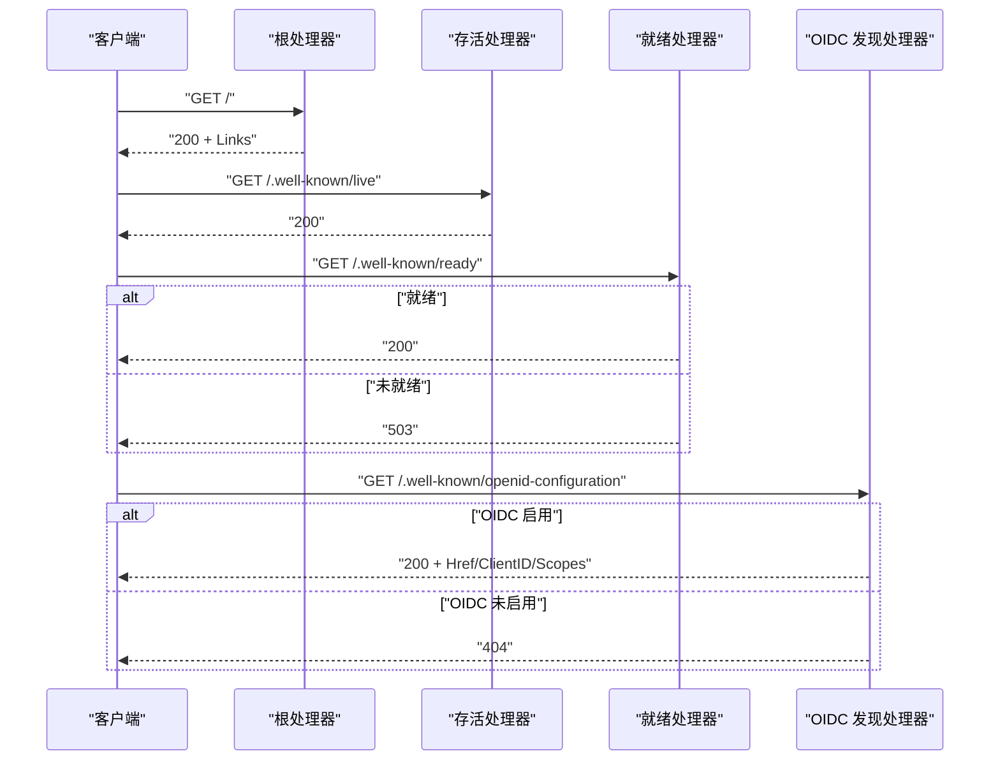
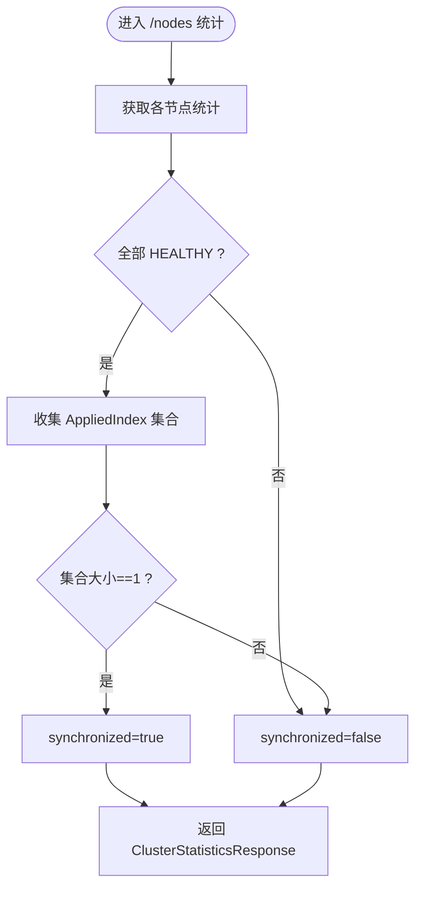
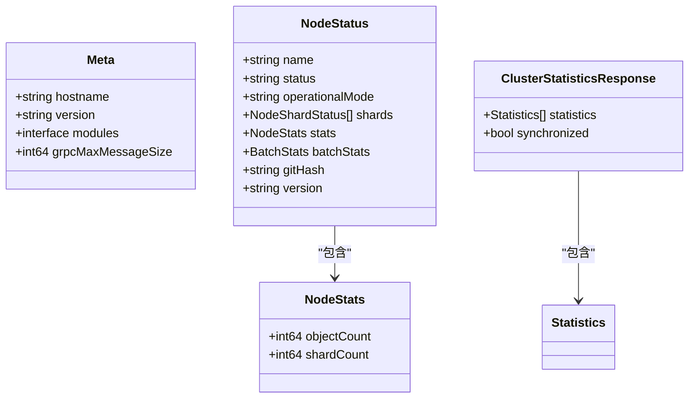
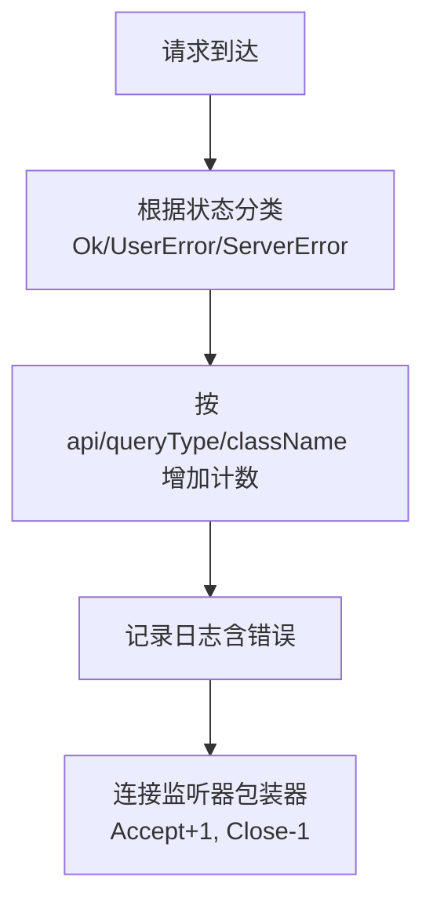
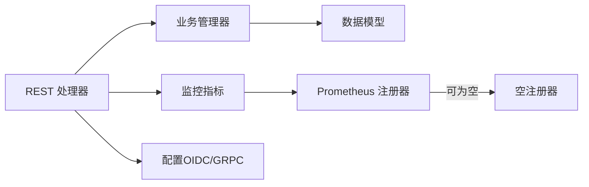

# 元数据与健康检查 API

<cite>
**本文引用的文件**
- [handlers_misc.go](file://adapters/handlers/rest/handlers_misc.go)
- [meta_get_parameters.go](file://client/meta/meta_get_parameters.go)
- [meta_get_responses.go](file://client/meta/meta_get_responses.go)
- [weaviate_wellknown_liveness_parameters.go](file://client/operations/weaviate_wellknown_liveness_parameters.go)
- [weaviate_wellknown_liveness_responses.go](file://client/operations/weaviate_wellknown_liveness_responses.go)
- [weaviate_wellknown_readiness_parameters.go](file://client/operations/weaviate_wellknown_readiness_parameters.go)
- [weaviate_wellknown_readiness_responses.go](file://client/operations/weaviate_wellknown_readiness_responses.go)
- [handlers_nodes.go](file://adapters/handlers/rest/handlers_nodes.go)
- [nodes.go](file://adapters/handlers/rest/clusterapi/nodes.go)
- [meta.go](file://entities/models/meta.go)
- [node_status.go](file://entities/models/node_status.go)
- [node_stats.go](file://entities/models/node_stats.go)
- [cluster_statistics_response.go](file://entities/models/cluster_statistics_response.go)
- [requests_total_metrics.go](file://adapters/handlers/rest/requests_total_metrics.go)
- [listen.go](file://usecases/monitoring/listen.go)
- [noop.go](file://usecases/monitoring/noop.go)
- [serve.go](file://adapters/handlers/rest/clusterapi/serve.go)
- [main.go](file://tools/telemetry-dashboard/main.go)
</cite>

## 目录
1. [简介](#简介)
2. [项目结构](#项目结构)
3. [核心组件](#核心组件)
4. [架构总览](#架构总览)
5. [详细组件分析](#详细组件分析)
6. [依赖关系分析](#依赖关系分析)
7. [性能考量](#性能考量)
8. [故障排查指南](#故障排查指南)
9. [结论](#结论)
10. [附录](#附录)

## 简介
本文件面向 Weaviate 的“元数据与健康检查 API”，系统性梳理以下能力：
- 元数据查询：版本、主机名、模块信息、gRPC 最大消息尺寸等
- 健康检查：根路径链接、就绪检查、存活检查、OIDC 发现端点
- 节点状态与集群统计：节点状态查询、分片统计、Raft 同步一致性判断
- 监控与指标：请求计数、连接数、错误分类、Prometheus 集成
- 运维与告警：错误诊断、日志字段、告警触发建议
- 外部系统对接：指标导出、仪表盘集成、客户端调用方式

## 项目结构
围绕元数据与健康检查 API 的关键文件组织如下：
- REST 层处理器：元数据、健康检查、节点状态与统计
- Swagger 客户端参数与响应类型：统一的请求/响应契约
- 数据模型：Meta、NodeStatus、NodeStats、ClusterStatisticsResponse
- 监控与指标：请求计数、连接监听器包装、空注册器
- 内部集群路由与中间件：独立的 /v1/cluster 路由处理
- 工具：遥测仪表盘（用于展示与聚合）

**图表来源**
- [handlers_misc.go](file://adapters/handlers/rest/handlers_misc.go#L29-L131)
- [handlers_nodes.go](file://adapters/handlers/rest/handlers_nodes.go#L34-L139)
- [nodes.go](file://adapters/handlers/rest/clusterapi/nodes.go#L47-L146)
- [meta_get_parameters.go](file://client/meta/meta_get_parameters.go#L30-L77)
- [meta_get_responses.go](file://client/meta/meta_get_responses.go#L74-L175)
- [weaviate_wellknown_liveness_parameters.go](file://client/operations/weaviate_wellknown_liveness_parameters.go#L30-L77)
- [weaviate_wellknown_liveness_responses.go](file://client/operations/weaviate_wellknown_liveness_responses.go#L83-L99)
- [weaviate_wellknown_readiness_parameters.go](file://client/operations/weaviate_wellknown_readiness_parameters.go#L30-L77)
- [weaviate_wellknown_readiness_responses.go](file://client/operations/weaviate_wellknown_readiness_responses.go#L31-L67)
- [meta.go](file://entities/models/meta.go#L26-L42)
- [node_status.go](file://entities/models/node_status.go#L30-L60)
- [node_stats.go](file://entities/models/node_stats.go#L26-L36)
- [cluster_statistics_response.go](file://entities/models/cluster_statistics_response.go#L28-L38)
- [requests_total_metrics.go](file://adapters/handlers/rest/requests_total_metrics.go#L74-L123)
- [listen.go](file://usecases/monitoring/listen.go#L21-L54)
- [noop.go](file://usecases/monitoring/noop.go#L16-L25)
- [serve.go](file://adapters/handlers/rest/clusterapi/serve.go#L210-L248)
- [main.go](file://tools/telemetry-dashboard/main.go#L153-L181)

**章节来源**
- [handlers_misc.go](file://adapters/handlers/rest/handlers_misc.go#L29-L131)
- [handlers_nodes.go](file://adapters/handlers/rest/handlers_nodes.go#L34-L139)
- [nodes.go](file://adapters/handlers/rest/clusterapi/nodes.go#L47-L146)
- [meta_get_parameters.go](file://client/meta/meta_get_parameters.go#L30-L77)
- [meta_get_responses.go](file://client/meta/meta_get_responses.go#L74-L175)
- [weaviate_wellknown_liveness_parameters.go](file://client/operations/weaviate_wellknown_liveness_parameters.go#L30-L77)
- [weaviate_wellknown_liveness_responses.go](file://client/operations/weaviate_wellknown_liveness_responses.go#L83-L99)
- [weaviate_wellknown_readiness_parameters.go](file://client/operations/weaviate_wellknown_readiness_parameters.go#L30-L77)
- [weaviate_wellknown_readiness_responses.go](file://client/operations/weaviate_wellknown_readiness_responses.go#L31-L67)
- [meta.go](file://entities/models/meta.go#L26-L42)
- [node_status.go](file://entities/models/node_status.go#L30-L60)
- [node_stats.go](file://entities/models/node_stats.go#L26-L36)
- [cluster_statistics_response.go](file://entities/models/cluster_statistics_response.go#L28-L38)
- [requests_total_metrics.go](file://adapters/handlers/rest/requests_total_metrics.go#L74-L123)
- [listen.go](file://usecases/monitoring/listen.go#L21-L54)
- [noop.go](file://usecases/monitoring/noop.go#L16-L25)
- [serve.go](file://adapters/handlers/rest/clusterapi/serve.go#L210-L248)
- [main.go](file://tools/telemetry-dashboard/main.go#L153-L181)

## 核心组件
- 元数据端点
  - 方法与路径：GET /meta
  - 功能：返回主机名、版本、模块元信息、gRPC 最大消息尺寸
  - 认证：需要有效凭据；未授权返回 401；权限不足返回 403；内部错误返回 500
- 健康检查端点
  - 根链接：GET / 返回链接集合，包含 .well-known 子资源
  - 存活检查：GET /.well-known/live，成功返回 200
  - 就绪检查：GET /.well-known/ready，成功返回 200；不可用时返回 503
  - OIDC 发现：GET /.well-known/openid-configuration，按配置返回重定向或 404
- 节点状态与集群统计
  - 节点状态：GET /nodes/status 或 /nodes/status/{className}，支持输出级别（最小/详细）
  - 分片状态：GET /nodes/status/{className}?shard={shardName}
  - 集群统计：GET /nodes/statistics，返回各节点统计与 Raft 同步一致性标记
- 模型与数据
  - Meta：hostname、version、modules、grpcMaxMessageSize
  - NodeStatus：name、status、operationalMode、shards、stats、batchStats、gitHash、version
  - NodeStats：objectCount、shardCount
  - ClusterStatisticsResponse：statistics[]、synchronized
- 监控与指标
  - 请求计数：按 API、查询类型、结果类别（成功/用户错误/服务错误）统计
  - 连接计数：监听器包装器对活跃连接进行增减
  - 空注册器：在禁用监控时避免副作用
- 内部路由
  - /v1/cluster 路由通过独立中间件拦截并转交到 Raft 路由器

**章节来源**
- [handlers_misc.go](file://adapters/handlers/rest/handlers_misc.go#L33-L131)
- [handlers_nodes.go](file://adapters/handlers/rest/handlers_nodes.go#L39-L106)
- [nodes.go](file://adapters/handlers/rest/clusterapi/nodes.go#L51-L146)
- [meta_get_responses.go](file://client/meta/meta_get_responses.go#L74-L175)
- [weaviate_wellknown_liveness_responses.go](file://client/operations/weaviate_wellknown_liveness_responses.go#L83-L99)
- [weaviate_wellknown_readiness_responses.go](file://client/operations/weaviate_wellknown_readiness_responses.go#L31-L67)
- [meta.go](file://entities/models/meta.go#L26-L42)
- [node_status.go](file://entities/models/node_status.go#L30-L60)
- [node_stats.go](file://entities/models/node_stats.go#L26-L36)
- [cluster_statistics_response.go](file://entities/models/cluster_statistics_response.go#L28-L38)
- [requests_total_metrics.go](file://adapters/handlers/rest/requests_total_metrics.go#L74-L123)
- [listen.go](file://usecases/monitoring/listen.go#L21-L54)
- [noop.go](file://usecases/monitoring/noop.go#L16-L25)
- [serve.go](file://adapters/handlers/rest/clusterapi/serve.go#L234-L248)

## 架构总览
下图展示了从客户端到处理器、再到业务层与监控系统的整体流程。

**图表来源**
- [handlers_misc.go](file://adapters/handlers/rest/handlers_misc.go#L33-L131)
- [handlers_nodes.go](file://adapters/handlers/rest/handlers_nodes.go#L39-L106)
- [requests_total_metrics.go](file://adapters/handlers/rest/requests_total_metrics.go#L74-L123)

## 详细组件分析

### 元数据查询（/meta）
- 端点定义
  - 方法：GET
  - 路径：/meta
  - 认证：需要有效凭据；未授权/权限不足/内部错误分别返回 401/403/500
- 响应模型
  - 字段：hostname、version、modules、grpcMaxMessageSize
- 客户端参数
  - 支持设置超时、上下文、自定义 HTTP 客户端
- 错误处理
  - 模块元信息获取失败时返回 500，并记录服务错误指标

**图表来源**
- [handlers_misc.go](file://adapters/handlers/rest/handlers_misc.go#L33-L55)
- [meta_get_parameters.go](file://client/meta/meta_get_parameters.go#L30-L77)
- [meta_get_responses.go](file://client/meta/meta_get_responses.go#L74-L175)
- [meta.go](file://entities/models/meta.go#L26-L42)
- [requests_total_metrics.go](file://adapters/handlers/rest/requests_total_metrics.go#L74-L123)

**章节来源**
- [handlers_misc.go](file://adapters/handlers/rest/handlers_misc.go#L33-L55)
- [meta_get_parameters.go](file://client/meta/meta_get_parameters.go#L30-L77)
- [meta_get_responses.go](file://client/meta/meta_get_responses.go#L74-L175)
- [meta.go](file://entities/models/meta.go#L26-L42)
- [requests_total_metrics.go](file://adapters/handlers/rest/requests_total_metrics.go#L74-L123)

### 健康检查（根链接、存活、就绪、OIDC）
- 根链接（/）
  - 返回链接集合，包含 .well-known 子资源与文档链接
- 存活检查（/.well-known/live）
  - 方法：GET
  - 成功：200
- 就绪检查（/.well-known/ready）
  - 方法：GET
  - 成功：200；未就绪：503
- OIDC 发现（/.well-known/openid-configuration）
  - 当启用 OIDC 时返回重定向链接与客户端 ID/作用域
  - 未启用时返回 404

**图表来源**
- [handlers_misc.go](file://adapters/handlers/rest/handlers_misc.go#L81-L131)
- [weaviate_wellknown_liveness_parameters.go](file://client/operations/weaviate_wellknown_liveness_parameters.go#L30-L77)
- [weaviate_wellknown_liveness_responses.go](file://client/operations/weaviate_wellknown_liveness_responses.go#L83-L99)
- [weaviate_wellknown_readiness_parameters.go](file://client/operations/weaviate_wellknown_readiness_parameters.go#L30-L77)
- [weaviate_wellknown_readiness_responses.go](file://client/operations/weaviate_wellknown_readiness_responses.go#L31-L67)

**章节来源**
- [handlers_misc.go](file://adapters/handlers/rest/handlers_misc.go#L81-L131)
- [weaviate_wellknown_liveness_parameters.go](file://client/operations/weaviate_wellknown_liveness_parameters.go#L30-L77)
- [weaviate_wellknown_liveness_responses.go](file://client/operations/weaviate_wellknown_liveness_responses.go#L83-L99)
- [weaviate_wellknown_readiness_parameters.go](file://client/operations/weaviate_wellknown_readiness_parameters.go#L30-L77)
- [weaviate_wellknown_readiness_responses.go](file://client/operations/weaviate_wellknown_readiness_responses.go#L31-L67)

### 节点状态与集群统计（/nodes）
- 节点状态
  - GET /nodes/status
  - GET /nodes/status/{className}
  - GET /nodes/status/{className}?shard={shardName}
  - 输出级别：支持解析输出参数，最小/详细
- 集群统计
  - GET /nodes/statistics
  - 统计各节点的健康状态与 Raft AppliedIndex
  - 若所有节点的 AppliedIndex 相同，则标记 synchronized=true

**图表来源**
- [handlers_nodes.go](file://adapters/handlers/rest/handlers_nodes.go#L82-L106)
- [nodes.go](file://adapters/handlers/rest/clusterapi/nodes.go#L122-L146)
- [cluster_statistics_response.go](file://entities/models/cluster_statistics_response.go#L28-L38)

**章节来源**
- [handlers_nodes.go](file://adapters/handlers/rest/handlers_nodes.go#L39-L106)
- [nodes.go](file://adapters/handlers/rest/clusterapi/nodes.go#L51-L146)
- [cluster_statistics_response.go](file://entities/models/cluster_statistics_response.go#L28-L38)

### 数据模型与复杂度
- Meta
  - 字段：hostname、version、modules、grpcMaxMessageSize
  - 复杂度：构造 O(1)，序列化 O(1)
- NodeStatus
  - 字段：name、status、operationalMode、shards[]、stats、batchStats、gitHash、version
  - 复杂度：验证 O(n)（n 为 shards 数量），序列化 O(1)
- NodeStats
  - 字段：objectCount、shardCount
  - 复杂度：O(1)
- ClusterStatisticsResponse
  - 字段：statistics[]、synchronized
  - 复杂度：O(m)（m 为节点数量），同步性判断 O(m)

**图表来源**
- [meta.go](file://entities/models/meta.go#L26-L42)
- [node_status.go](file://entities/models/node_status.go#L30-L60)
- [node_stats.go](file://entities/models/node_stats.go#L26-L36)
- [cluster_statistics_response.go](file://entities/models/cluster_statistics_response.go#L28-L38)

**章节来源**
- [meta.go](file://entities/models/meta.go#L26-L42)
- [node_status.go](file://entities/models/node_status.go#L30-L60)
- [node_stats.go](file://entities/models/node_stats.go#L26-L36)
- [cluster_statistics_response.go](file://entities/models/cluster_statistics_response.go#L28-L38)

### 监控与指标
- 请求计数
  - 类别：Ok、UserError、ServerError
  - 维度：api、queryType、className
- 连接计数
  - 包装标准 Listener，在 Accept 时递增，在 Close 时递减
- 空注册器
  - 在禁用监控时使用，避免副作用

**图表来源**
- [requests_total_metrics.go](file://adapters/handlers/rest/requests_total_metrics.go#L74-L123)
- [listen.go](file://usecases/monitoring/listen.go#L21-L54)
- [noop.go](file://usecases/monitoring/noop.go#L16-L25)

**章节来源**
- [requests_total_metrics.go](file://adapters/handlers/rest/requests_total_metrics.go#L74-L123)
- [listen.go](file://usecases/monitoring/listen.go#L21-L54)
- [noop.go](file://usecases/monitoring/noop.go#L16-L25)

### 内部集群路由与中间件
- /v1/cluster 路由通过正则匹配拦截
- 使用独立的 Raft 路由器处理集群内部请求
- 静态路由标签用于监控“路由基数”统计

**章节来源**
- [serve.go](file://adapters/handlers/rest/clusterapi/serve.go#L210-L248)

### 外部监控系统对接
- 遥测仪表盘
  - 接收 POST /telemetry，解析 JSON 并缓存
  - 提供 /dashboard 页面展示汇总信息
- 建议
  - 将 /metrics 导出端点接入 Prometheus
  - 使用静态路由标签与连接计数指标辅助容量规划
  - 将就绪/存活探针纳入容器编排健康检查

**章节来源**
- [main.go](file://tools/telemetry-dashboard/main.go#L153-L181)

## 依赖关系分析
- 组件耦合
  - 处理器依赖业务管理器（节点状态、统计）
  - 监控指标通过统一接口记录，降低耦合
- 直接依赖
  - 元数据：模块提供者
  - 节点状态：verbosity 解析、错误分类
  - 健康检查：配置中的 OIDC 开关
- 外部依赖
  - Prometheus 注册器（可为空实现）
  - 日志库（记录错误与调试信息）

**图表来源**
- [handlers_misc.go](file://adapters/handlers/rest/handlers_misc.go#L29-L131)
- [handlers_nodes.go](file://adapters/handlers/rest/handlers_nodes.go#L126-L139)
- [requests_total_metrics.go](file://adapters/handlers/rest/requests_total_metrics.go#L74-L123)
- [noop.go](file://usecases/monitoring/noop.go#L16-L25)

**章节来源**
- [handlers_misc.go](file://adapters/handlers/rest/handlers_misc.go#L29-L131)
- [handlers_nodes.go](file://adapters/handlers/rest/handlers_nodes.go#L126-L139)
- [requests_total_metrics.go](file://adapters/handlers/rest/requests_total_metrics.go#L74-L123)
- [noop.go](file://usecases/monitoring/noop.go#L16-L25)

## 性能考量
- 元数据端点
  - 读取配置与模块元信息，复杂度低；建议缓存模块信息以减少重复计算
- 节点状态与统计
  - 统计列表遍历 O(n)，分片数量较多时注意批量查询优化
  - 同步性判断仅比较 AppliedIndex，时间复杂度 O(n)
- 监控
  - 请求计数与连接计数均为 O(1) 操作，开销极小
  - 在高并发场景下，建议使用连接池与合理的超时配置

## 故障排查指南
- 常见错误与定位
  - 401 未授权：检查认证头或密钥
  - 403 权限不足：确认 RBAC 角色与权限
  - 500 服务器错误：查看日志字段 action=“requests_total”，定位具体 API 与类名
  - 503 就绪检查失败：检查节点状态与同步性，确认 Raft AppliedIndex 是否一致
- 日志字段
  - requests_total：api、query_type、class_name、error
  - panic 恢复：记录 panic 原因与堆栈
- 建议
  - 将就绪探针与存活探针结合使用，先存活后就绪
  - 对 /nodes/statistics 的 synchronized=false 情况进行告警
  - 使用连接计数指标评估连接压力

**章节来源**
- [requests_total_metrics.go](file://adapters/handlers/rest/requests_total_metrics.go#L99-L109)
- [handlers_nodes.go](file://adapters/handlers/rest/handlers_nodes.go#L108-L124)

## 结论
Weaviate 的元数据与健康检查 API 提供了清晰、可运维的系统视图与健康保障能力。通过统一的模型与监控指标，能够快速定位问题并进行容量与稳定性优化。建议在生产环境中结合就绪/存活探针、连接计数与同步性指标，构建完善的告警体系。

## 附录
- 客户端调用要点
  - 设置合适的超时与上下文
  - 对就绪检查区分 200/503，实现幂等重试
  - 对 /nodes 状态查询使用输出参数控制粒度
- 指标导出与仪表盘
  - 将请求计数与连接计数暴露为 Prometheus 指标
  - 可参考遥测仪表盘的 JSON 结构进行扩展