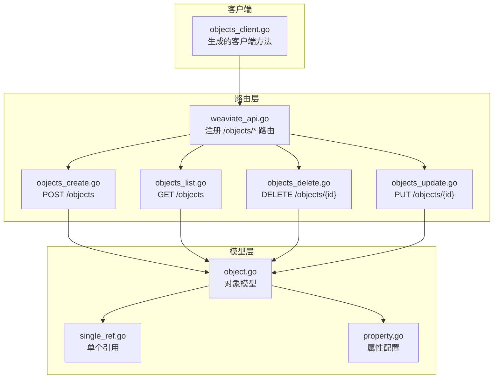
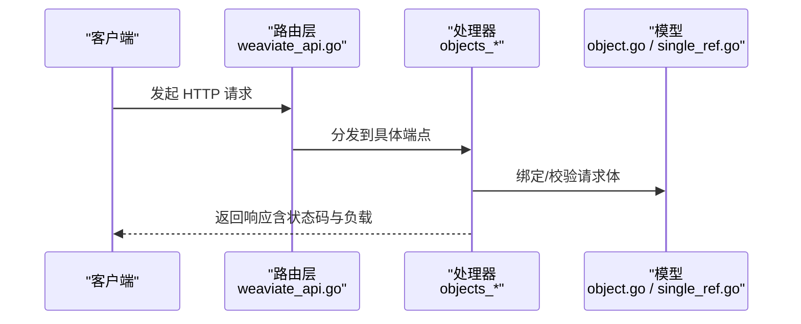
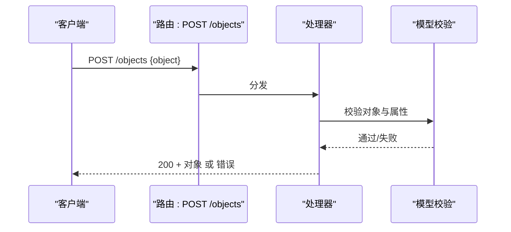
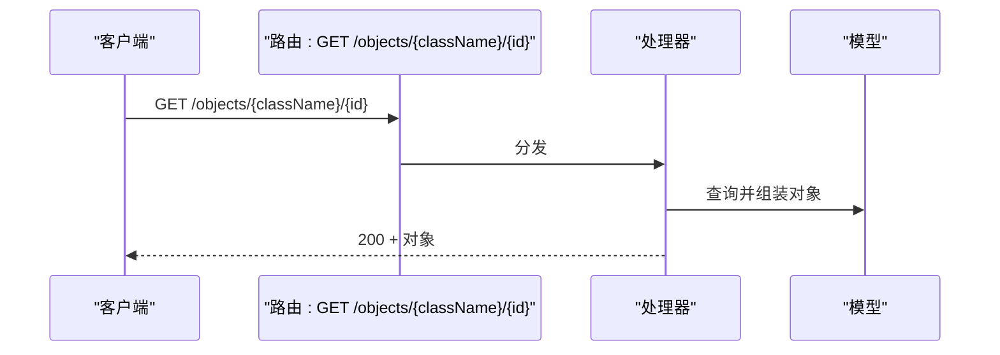
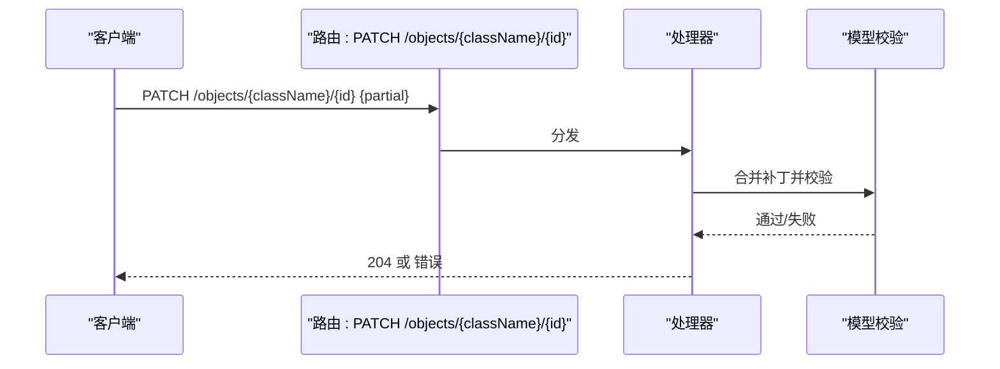
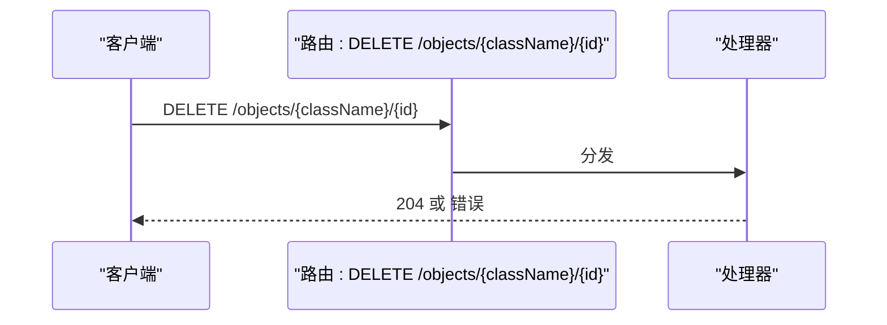
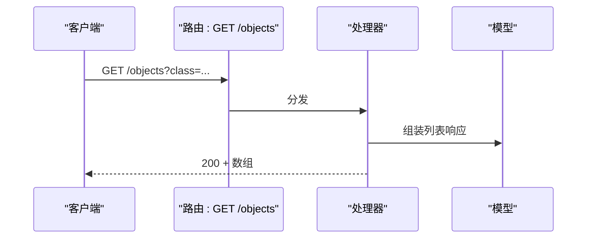
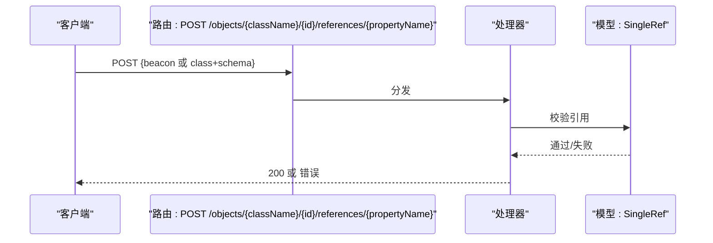
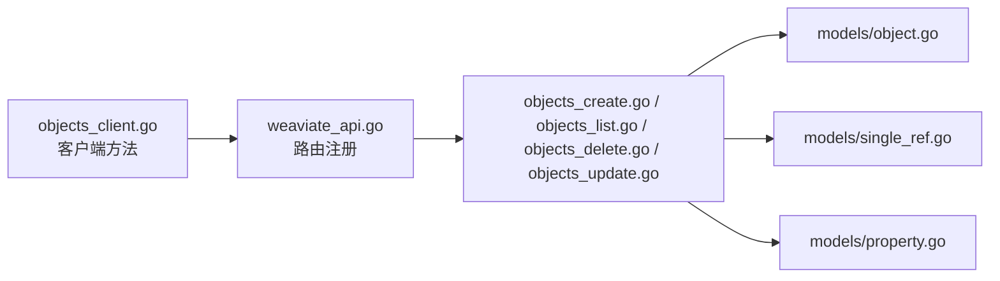

# 对象管理 API

<cite>
**本文档引用的文件**
- [objects_client.go](file://client/objects/objects_client.go)
- [objects_create.go](file://adapters/handlers/rest/operations/objects/objects_create.go)
- [objects_list.go](file://adapters/handlers/rest/operations/objects/objects_list.go)
- [objects_delete.go](file://adapters/handlers/rest/operations/objects/objects_delete.go)
- [objects_update.go](file://adapters/handlers/rest/operations/objects/objects_update.go)
- [weaviate_api.go](file://adapters/handlers/rest/operations/weaviate_api.go)
- [object.go](file://entities/models/object.go)
- [single_ref.go](file://entities/models/single_ref.go)
- [property.go](file://entities/models/property.go)
- [objects_list_responses.go](file://client/objects/objects_list_responses.go)
- [add_test.go](file://test/acceptance/actions/add_test.go)
- [setup_test.go](file://test/acceptance/classifications/setup_test.go)
</cite>

## 目录
1. [简介](#简介)
2. [项目结构](#项目结构)
3. [核心组件](#核心组件)
4. [架构总览](#架构总览)
5. [详细组件分析](#详细组件分析)
6. [依赖分析](#依赖分析)
7. [性能考虑](#性能考虑)
8. [故障排查指南](#故障排查指南)
9. [结论](#结论)
10. [附录](#附录)

## 简介
本文件为 Weaviate 对象管理 API 的权威接口文档，覆盖对象的完整 CRUD 生命周期：创建、读取、更新、删除；以及引用关系的增删改；并包含批量导入、条件查询、过滤器、错误处理与状态码、性能优化与最佳实践等。文档以仓库中的生成客户端、路由注册与模型定义为依据，确保与实际实现一致。

## 项目结构
Weaviate 的对象管理 API 由三部分组成：
- 路由层：REST 路由在服务启动时注册到统一的 API 分发器中，映射到具体处理器。
- 客户端层：基于 OpenAPI/Swagger 生成的对象 API 客户端，封装了所有端点、参数与响应类型。
- 模型层：对象、属性、引用等数据模型及其校验逻辑。

图表来源
- [weaviate_api.go](file://adapters/handlers/rest/operations/weaviate_api.go#L1310-L1362)
- [objects_create.go](file://adapters/handlers/rest/operations/objects/objects_create.go#L45-L84)
- [objects_list.go](file://adapters/handlers/rest/operations/objects/objects_list.go#L45-L84)
- [objects_delete.go](file://adapters/handlers/rest/operations/objects/objects_delete.go#L45-L84)
- [objects_update.go](file://adapters/handlers/rest/operations/objects/objects_update.go#L45-L84)
- [object.go](file://entities/models/object.go#L28-L63)
- [single_ref.go](file://entities/models/single_ref.go#L28-L50)
- [property.go](file://entities/models/property.go#L30-L65)

章节来源
- [weaviate_api.go](file://adapters/handlers/rest/operations/weaviate_api.go#L1310-L1362)
- [objects_create.go](file://adapters/handlers/rest/operations/objects/objects_create.go#L45-L84)
- [objects_list.go](file://adapters/handlers/rest/operations/objects/objects_list.go#L45-L84)
- [objects_delete.go](file://adapters/handlers/rest/operations/objects/objects_delete.go#L45-L84)
- [objects_update.go](file://adapters/handlers/rest/operations/objects/objects_update.go#L45-L84)
- [object.go](file://entities/models/object.go#L28-L63)
- [single_ref.go](file://entities/models/single_ref.go#L28-L50)
- [property.go](file://entities/models/property.go#L30-L65)

## 核心组件
- 对象模型（Object）
  - 字段：类名、ID、属性、附加信息、向量/多向量、租户、时间戳等。
  - 校验：UUID 格式、向量/多向量结构等。
- 引用模型（SingleRef）
  - 支持“直接引用”（beacon）与“概念引用”（class + schema），并包含分类元信息。
- 属性模型（Property）
  - 数据类型、索引策略（过滤、倒排、范围过滤、可搜索）、分词方式等。

章节来源
- [object.go](file://entities/models/object.go#L28-L63)
- [single_ref.go](file://entities/models/single_ref.go#L28-L50)
- [property.go](file://entities/models/property.go#L30-L65)

## 架构总览
对象管理 API 的调用链路如下：

图表来源
- [weaviate_api.go](file://adapters/handlers/rest/operations/weaviate_api.go#L1310-L1362)
- [object.go](file://entities/models/object.go#L28-L63)
- [single_ref.go](file://entities/models/single_ref.go#L28-L50)

## 详细组件分析

### 1) 创建对象（POST /objects）
- 方法与路径
  - 方法：POST
  - 路径：/objects
- 请求体
  - 必填：对象属性（键值对，遵循集合属性定义）
  - 可选：class、tenant、vector、vectors、additional 等
- 响应
  - 成功：200 OK，返回完整对象
  - 失败：典型错误如 400（参数/校验失败）、422（语义校验）、409（冲突，若 ID 已存在）
- 特性
  - 首次创建时会进行对象与属性的校验
  - 批量导入请使用 /batch/objects 端点以获得更高吞吐

图表来源
- [objects_create.go](file://adapters/handlers/rest/operations/objects/objects_create.go#L45-L84)
- [objects_client.go](file://client/objects/objects_client.go#L413-L452)
- [object.go](file://entities/models/object.go#L65-L89)

章节来源
- [objects_create.go](file://adapters/handlers/rest/operations/objects/objects_create.go#L45-L84)
- [objects_client.go](file://client/objects/objects_client.go#L413-L452)
- [object.go](file://entities/models/object.go#L65-L89)

### 2) 读取对象（GET /objects/{id} 与 GET /objects/{className}/{id}）
- 方法与路径
  - GET /objects/{id}（已弃用）
  - GET /objects/{className}/{id}（推荐）
- 查询参数
  - 无必需查询参数；可通过额外选项控制返回内容（如向量、附加信息）
- 响应
  - 成功：200 OK，返回对象
  - 失败：404 Not Found（不存在）

图表来源
- [weaviate_api.go](file://adapters/handlers/rest/operations/weaviate_api.go#L1310-L1325)
- [objects_client.go](file://client/objects/objects_client.go#L126-L165)

章节来源
- [weaviate_api.go](file://adapters/handlers/rest/operations/weaviate_api.go#L1310-L1325)
- [objects_client.go](file://client/objects/objects_client.go#L126-L165)

### 3) 更新对象（PUT /objects/{id} 与 PATCH /objects/{id}，以及推荐的 /{className}/{id} 变体）
- 方法与路径
  - PUT /objects/{id}（已弃用）：整包替换
  - PATCH /objects/{id}（已弃用）：合并补丁
  - 推荐：PUT /objects/{className}/{id} 与 PATCH /objects/{className}/{id}
- 行为
  - PUT：要求提供完整对象定义
  - PATCH：仅更新提供的字段，保留其他不变
- 响应
  - 成功：204 No Content（无主体）
  - 失败：404（不存在）、400/422（校验失败）

图表来源
- [weaviate_api.go](file://adapters/handlers/rest/operations/weaviate_api.go#L1318-L1325)
- [objects_client.go](file://client/objects/objects_client.go#L208-L247)

章节来源
- [weaviate_api.go](file://adapters/handlers/rest/operations/weaviate_api.go#L1318-L1325)
- [objects_client.go](file://client/objects/objects_client.go#L208-L247)

### 4) 删除对象（DELETE /objects/{id} 与 DELETE /objects/{className}/{id}）
- 方法与路径
  - DELETE /objects/{id}（已弃用）
  - DELETE /objects/{className}/{id}（推荐）
- 响应
  - 成功：204 No Content
  - 失败：404 Not Found

图表来源
- [weaviate_api.go](file://adapters/handlers/rest/operations/weaviate_api.go#L1325-L1334)
- [objects_client.go](file://client/objects/objects_client.go#L85-L124)

章节来源
- [weaviate_api.go](file://adapters/handlers/rest/operations/weaviate_api.go#L1325-L1334)
- [objects_client.go](file://client/objects/objects_client.go#L85-L124)

### 5) 列表对象（GET /objects）
- 方法与路径
  - GET /objects
- 查询参数
  - class：指定集合名称（必填，否则返回空列表）
  - 其他：分页、排序、过滤（见下节）
- 响应
  - 成功：200 OK，返回对象数组
  - 失败：400/422（参数或校验错误）

图表来源
- [objects_list.go](file://adapters/handlers/rest/operations/objects/objects_list.go#L45-L84)
- [objects_client.go](file://client/objects/objects_client.go#L577-L616)
- [objects_list_responses.go](file://client/objects/objects_list_responses.go#L84-L130)

章节来源
- [objects_list.go](file://adapters/handlers/rest/operations/objects/objects_list.go#L45-L84)
- [objects_client.go](file://client/objects/objects_client.go#L577-L616)
- [objects_list_responses.go](file://client/objects/objects_list_responses.go#L84-L130)

### 6) 引用关系管理（POST/PATCH/PUT/DELETE /objects/{className}/{id}/references/{propertyName}）
- 方法与路径
  - POST：新增引用
  - PUT：替换某属性的所有引用
  - DELETE：删除某属性的一个引用
- 请求体
  - 单个引用（SingleRef）或引用数组
- 响应
  - 成功：200/204
  - 失败：400/422（引用格式/目标不合法）、404（对象或目标不存在）

图表来源
- [weaviate_api.go](file://adapters/handlers/rest/operations/weaviate_api.go#L1329-L1337)
- [objects_client.go](file://client/objects/objects_client.go#L290-L329)
- [single_ref.go](file://entities/models/single_ref.go#L28-L50)

章节来源
- [weaviate_api.go](file://adapters/handlers/rest/operations/weaviate_api.go#L1329-L1337)
- [objects_client.go](file://client/objects/objects_client.go#L290-L329)
- [single_ref.go](file://entities/models/single_ref.go#L28-L50)

### 7) 条件查询与过滤器
- 过滤器
  - 使用 Where 过滤器进行精确匹配、范围查询等
  - 结合集合属性的索引策略（过滤、倒排、范围过滤、可搜索）决定可用性
- 排序与分页
  - 支持分页游标与排序字段
- 示例参考
  - 测试用例展示了对象创建与获取流程，可用于理解请求/响应结构

章节来源
- [property.go](file://entities/models/property.go#L30-L65)
- [add_test.go](file://test/acceptance/actions/add_test.go#L49-L88)
- [setup_test.go](file://test/acceptance/classifications/setup_test.go#L352-L409)

### 8) 对象结构与属性定义
- 对象结构
  - class、id、properties、tenant、vector、vectors、additional、时间戳等
- 属性定义
  - dataType、indexFilterable、indexSearchable、tokenization、nestedProperties 等
- 引用关系
  - 支持直接引用（beacon）与概念引用（class + schema）

章节来源
- [object.go](file://entities/models/object.go#L28-L63)
- [property.go](file://entities/models/property.go#L30-L65)
- [single_ref.go](file://entities/models/single_ref.go#L28-L50)

### 9) 批量对象操作
- 端点：/batch/objects（不在当前对象模块中，但与对象管理强相关）
- 优势：显著优于多次单对象请求的吞吐与延迟
- 适用场景：大规模导入、迁移、重算向量

章节来源
- [objects_client.go](file://client/objects/objects_client.go#L413-L452)

## 依赖分析
- 路由到处理器
  - 统一在 weaviate_api.go 中注册 /objects/* 路由，并绑定到具体处理器
- 客户端到服务端
  - objects_client.go 将每个端点映射为独立方法，包含路径、方法、媒体类型与参数/响应读取器
- 模型到校验
  - object.go、single_ref.go、property.go 提供结构化定义与上下文校验

图表来源
- [weaviate_api.go](file://adapters/handlers/rest/operations/weaviate_api.go#L1310-L1362)
- [objects_create.go](file://adapters/handlers/rest/operations/objects/objects_create.go#L45-L84)
- [objects_list.go](file://adapters/handlers/rest/operations/objects/objects_list.go#L45-L84)
- [objects_delete.go](file://adapters/handlers/rest/operations/objects/objects_delete.go#L45-L84)
- [objects_update.go](file://adapters/handlers/rest/operations/objects/objects_update.go#L45-L84)
- [object.go](file://entities/models/object.go#L28-L63)
- [single_ref.go](file://entities/models/single_ref.go#L28-L50)
- [property.go](file://entities/models/property.go#L30-L65)
- [objects_client.go](file://client/objects/objects_client.go#L413-L452)

章节来源
- [weaviate_api.go](file://adapters/handlers/rest/operations/weaviate_api.go#L1310-L1362)
- [objects_client.go](file://client/objects/objects_client.go#L413-L452)

## 性能考虑
- 优先使用 /batch/objects 进行大批量导入
- 合理设置属性索引策略（filterable/searchable/range）以平衡查询性能与写入开销
- 控制返回字段大小（避免不必要的向量/附加信息）
- 使用 HEAD /objects/{className}/{id} 快速判断存在性，减少数据传输

## 故障排查指南
- 常见状态码
  - 200/204：成功
  - 400：请求参数/格式错误
  - 404：对象或引用不存在
  - 409：ID 冲突（POST 创建时）
  - 422：语义校验失败（属性/引用/向量）
- 常见错误场景
  - 引用 beacon 不符合 weaviate://localhost/<uuid> 格式
  - 属性类型与集合定义不匹配
  - 缺少必要字段（如 class、id）
- 定位手段
  - 查看响应体中的错误详情
  - 使用 GET /objects/{className}/{id} 核对对象是否存在
  - 使用 HEAD /objects/{className}/{id} 快速确认

章节来源
- [objects_list_responses.go](file://client/objects/objects_list_responses.go#L84-L130)
- [objects_client.go](file://client/objects/objects_client.go#L413-L452)

## 结论
Weaviate 对象管理 API 提供了完备的 CRUD 与引用关系管理能力。通过推荐的 /objects/{className}/{id} 端点与批量导入机制，可在保证数据一致性的同时获得更高的吞吐与更低的延迟。结合属性索引策略与最小化响应体，可进一步优化查询与写入性能。

## 附录
- 请求/响应示例参考
  - 基本对象创建与获取：参见测试用例
  - 复杂对象（含引用、向量、多值属性）：参见测试用例与模型定义

章节来源
- [add_test.go](file://test/acceptance/actions/add_test.go#L49-L88)
- [setup_test.go](file://test/acceptance/classifications/setup_test.go#L352-L409)
- [object.go](file://entities/models/object.go#L28-L63)
- [single_ref.go](file://entities/models/single_ref.go#L28-L50)
- [property.go](file://entities/models/property.go#L30-L65)