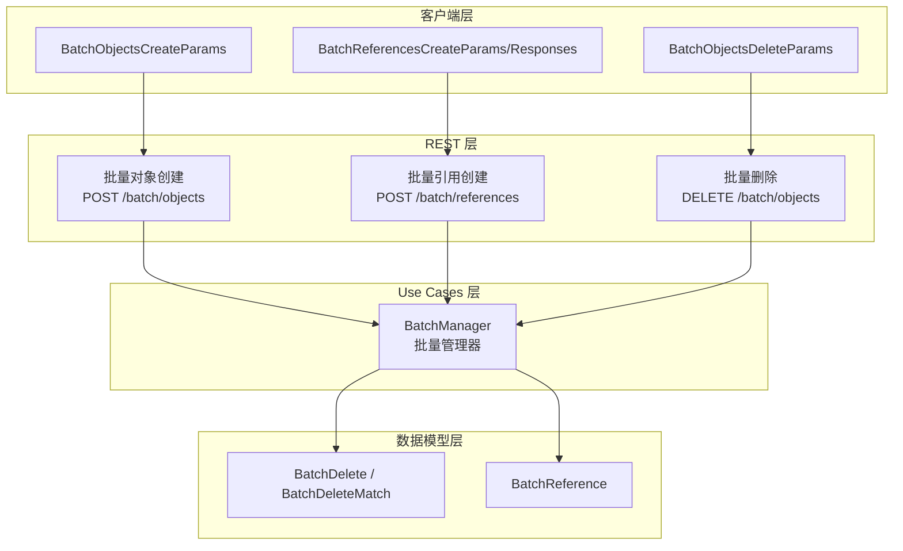
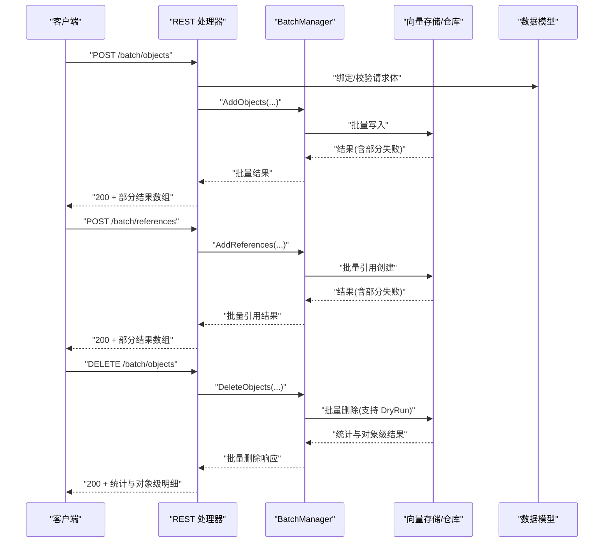
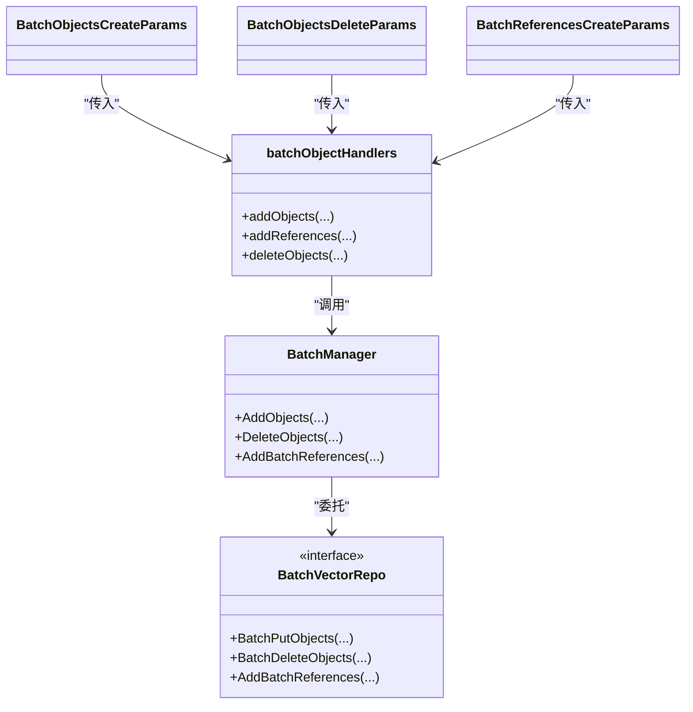

# 批量操作 API

<cite>
**本文引用的文件**
- [handlers_batch_objects.go](file://adapters/handlers/rest/handlers_batch_objects.go)
- [batch_objects_create.go](file://adapters/handlers/rest/operations/batch/batch_objects_create.go)
- [batch_objects_delete.go](file://adapters/handlers/rest/operations/batch/batch_objects_delete.go)
- [batch_references_create.go](file://adapters/handlers/rest/operations/batch/batch_references_create.go)
- [batch_objects_create_parameters.go](file://client/batch/batch_objects_create_parameters.go)
- [batch_objects_delete_parameters.go](file://client/batch/batch_objects_delete_parameters.go)
- [batch_references_create_responses.go](file://adapters/handlers/rest/operations/batch/batch_references_create_responses.go)
- [batch_objects_create_responses.go](file://adapters/handlers/rest/operations/batch/batch_objects_create_responses.go)
- [batch_objects_delete_responses.go](file://adapters/handlers/rest/operations/batch/batch_objects_delete_responses.go)
- [batch_delete.go](file://entities/models/batch_delete.go)
- [batch_reference.go](file://entities/models/batch_reference.go)
- [batch_client.go](file://client/batch/batch_client.go)
- [batch_manager.go](file://usecases/objects/batch_manager.go)
- [batch_journey_test.go](file://test/acceptance/batch_request_endpoints/batch_journey_test.go)
- [batch_delete_test.go](file://test/acceptance/batch_request_endpoints/batch_delete_test.go)
- [batch_references_test.go](file://test/acceptance/grpc/batch_references_test.go)
- [batch.proto](file://grpc/proto/v1/batch.proto)
- [batch_queues_test.go](file://adapters/handlers/grpc/v1/batch/queues_test.go)
</cite>

## 目录
1. [简介](#简介)
2. [项目结构](#项目结构)
3. [核心组件](#核心组件)
4. [架构总览](#架构总览)
5. [详细组件分析](#详细组件分析)
6. [依赖关系分析](#依赖关系分析)
7. [性能考量](#性能考量)
8. [故障排查指南](#故障排查指南)
9. [结论](#结论)
10. [附录：接口规范与示例](#附录接口规范与示例)

## 简介
本文件面向 Weaviate 的批量操作 API，系统化梳理批量对象创建、批量删除、批量引用创建三个端点的接口定义、请求/响应结构、事务性与错误处理机制、部分失败处理策略、并发与性能特性，并提供可直接对照源码路径的完整示例与最佳实践建议。

## 项目结构
Weaviate 的批量 API 由以下层次组成：
- REST 层：路由与处理器，负责请求绑定、鉴权、调用 usecase 层并返回响应。
- Use Cases 层：批量管理器封装批量写入、删除、引用创建等业务逻辑。
- 数据模型层：定义批量请求与响应的数据结构。
- 客户端层：生成的 OpenAPI 客户端，封装参数与响应读取。
- 测试与验收：覆盖批量导入、引用创建、删除等端到端场景。

图表来源
- [handlers_batch_objects.go](file://adapters/handlers/rest/handlers_batch_objects.go#L36-L285)
- [batch_manager.go](file://usecases/objects/batch_manager.go#L29-L78)
- [batch_delete.go](file://entities/models/batch_delete.go#L27-L219)
- [batch_reference.go](file://entities/models/batch_reference.go#L28-L111)
- [batch_objects_create_parameters.go](file://client/batch/batch_objects_create_parameters.go#L66-L195)
- [batch_objects_delete_parameters.go](file://client/batch/batch_objects_delete_parameters.go#L68-L233)
- [batch_references_create_responses.go](file://adapters/handlers/rest/operations/batch/batch_references_create_responses.go#L46-L95)

章节来源
- [handlers_batch_objects.go](file://adapters/handlers/rest/handlers_batch_objects.go#L276-L285)
- [batch_manager.go](file://usecases/objects/batch_manager.go#L29-L78)

## 核心组件
- 批量管理器（BatchManager）：统一编排批量写入、批量删除、批量引用创建，负责鉴权、模式校验、复制一致性、模块扩展等。
- REST 处理器：将 HTTP 请求转换为 usecase 输入，处理错误映射与指标上报。
- 数据模型：定义批量请求体与响应体结构，如批量删除匹配条件、批量引用条目等。
- 客户端参数：封装请求体、查询参数（如 consistency_level、tenant）与读取响应。

章节来源
- [batch_manager.go](file://usecases/objects/batch_manager.go#L29-L78)
- [handlers_batch_objects.go](file://adapters/handlers/rest/handlers_batch_objects.go#L36-L285)
- [batch_delete.go](file://entities/models/batch_delete.go#L27-L219)
- [batch_reference.go](file://entities/models/batch_reference.go#L28-L111)
- [batch_objects_create_parameters.go](file://client/batch/batch_objects_create_parameters.go#L66-L195)
- [batch_objects_delete_parameters.go](file://client/batch/batch_objects_delete_parameters.go#L68-L233)

## 架构总览
批量 API 的典型调用链如下：

图表来源
- [handlers_batch_objects.go](file://adapters/handlers/rest/handlers_batch_objects.go#L36-L285)
- [batch_manager.go](file://usecases/objects/batch_manager.go#L41-L53)
- [batch_objects_create.go](file://adapters/handlers/rest/operations/batch/batch_objects_create.go#L52-L91)
- [batch_references_create.go](file://adapters/handlers/rest/operations/batch/batch_references_create.go#L45-L84)
- [batch_objects_delete.go](file://adapters/handlers/rest/operations/batch/batch_objects_delete.go#L45-L84)

## 详细组件分析

### 批量对象创建（POST /batch/objects）
- HTTP 方法与 URL：POST /batch/objects
- 请求体结构：包含 objects 数组与可选 fields 字段控制返回范围
- 关键行为：
  - 支持按 UUID 幂等更新（存在即覆盖）
  - 支持 consistency_level 查询参数控制复制一致性
  - 返回数组，每个元素包含对象与该对象的结果状态与错误
- 错误映射：
  - 400：请求体不合法
  - 403：权限不足
  - 422：用户输入或多租户校验失败
  - 500：其他内部错误
- 响应结构：数组项包含对象与 result.status/result.errors

章节来源
- [batch_objects_create.go](file://adapters/handlers/rest/operations/batch/batch_objects_create.go#L52-L91)
- [handlers_batch_objects.go](file://adapters/handlers/rest/handlers_batch_objects.go#L36-L99)
- [batch_objects_create_parameters.go](file://client/batch/batch_objects_create_parameters.go#L66-L195)
- [batch_objects_create_responses.go](file://adapters/handlers/rest/operations/batch/batch_objects_create_responses.go#L46-L95)

### 批量引用创建（POST /batch/references）
- HTTP 方法与 URL：POST /batch/references
- 请求体结构：数组，每项包含 from/to URI 以及可选 tenant
- 关键行为：
  - 支持跨类/同类引用
  - 支持 consistency_level 控制复制一致性
  - 返回数组，每项包含引用与 result.status/result.errors
- 错误映射：
  - 400：请求体不合法
  - 403：权限不足
  - 422：用户输入或多租户校验失败
  - 500：其他内部错误

章节来源
- [batch_references_create.go](file://adapters/handlers/rest/operations/batch/batch_references_create.go#L45-L84)
- [handlers_batch_objects.go](file://adapters/handlers/rest/handlers_batch_objects.go#L124-L184)
- [batch_references_create_responses.go](file://adapters/handlers/rest/operations/batch/batch_references_create_responses.go#L46-L95)
- [batch_reference.go](file://entities/models/batch_reference.go#L28-L111)

### 批量删除（DELETE /batch/objects）
- HTTP 方法与 URL：DELETE /batch/objects
- 请求体结构：包含 match.class、match.where、dryRun、output 等
- 关键行为：
  - 支持基于 where 过滤的批量删除
  - 支持 dryRun 预演（不实际删除）
  - 支持 consistency_level、tenant
  - 返回统计信息与对象级结果（按 verbosity 输出）
- 错误映射：
  - 400：请求体不合法
  - 403：权限不足
  - 422：用户输入或多租户校验失败
  - 500：其他内部错误

章节来源
- [batch_objects_delete.go](file://adapters/handlers/rest/operations/batch/batch_objects_delete.go#L45-L84)
- [handlers_batch_objects.go](file://adapters/handlers/rest/handlers_batch_objects.go#L186-L274)
- [batch_objects_delete_parameters.go](file://client/batch/batch_objects_delete_parameters.go#L68-L233)
- [batch_delete.go](file://entities/models/batch_delete.go#L27-L219)

### 响应与部分失败处理
- 对象创建与引用创建：每个条目独立返回 result.status 与 result.errors；成功/失败混合时，整体返回 200，但需逐项检查状态
- 批量删除：返回总体统计（matches、successful、failed）与对象级明细（按 verbosity 输出）

章节来源
- [handlers_batch_objects.go](file://adapters/handlers/rest/handlers_batch_objects.go#L101-L122)
- [handlers_batch_objects.go](file://adapters/handlers/rest/handlers_batch_objects.go#L159-L184)
- [handlers_batch_objects.go](file://adapters/handlers/rest/handlers_batch_objects.go#L223-L274)

### 事务性与一致性
- 批量操作在单次请求内按顺序处理，但未声明“跨对象/跨引用”的原子性语义；部分失败是预期行为
- 可通过 consistency_level 控制复制一致性级别，影响成功判定与可见性

章节来源
- [handlers_batch_objects.go](file://adapters/handlers/rest/handlers_batch_objects.go#L49-L56)
- [handlers_batch_objects.go](file://adapters/handlers/rest/handlers_batch_objects.go#L127-L133)
- [handlers_batch_objects.go](file://adapters/handlers/rest/handlers_batch_objects.go#L189-L195)

## 依赖关系分析
- REST 处理器依赖 usecase 层的 BatchManager
- BatchManager 依赖向量/存储仓库接口进行批量写入/删除/引用创建
- 客户端参数与响应类型来自 OpenAPI 生成代码，确保与服务端契约一致

图表来源
- [batch_manager.go](file://usecases/objects/batch_manager.go#L29-L78)
- [handlers_batch_objects.go](file://adapters/handlers/rest/handlers_batch_objects.go#L31-L34)
- [batch_objects_create_parameters.go](file://client/batch/batch_objects_create_parameters.go#L73-L90)
- [batch_objects_delete_parameters.go](file://client/batch/batch_objects_delete_parameters.go#L75-L98)

章节来源
- [batch_manager.go](file://usecases/objects/batch_manager.go#L29-L78)
- [handlers_batch_objects.go](file://adapters/handlers/rest/handlers_batch_objects.go#L31-L34)

## 性能考量
- 批处理吞吐：批量 API 显著优于逐条请求，减少网络往返与序列化开销
- 复制一致性：提高 consistency_level 会增加确认延迟与资源消耗
- 干运行（DryRun）：删除前可用 dryRun 预估影响范围与数量
- 并发控制：REST 层对批量请求进行指标统计与错误分类，避免放大错误传播
- gRPC 批处理自适应：内部队列与批大小自适应逻辑可根据处理时间动态调整批大小，提升稳定性

章节来源
- [handlers_batch_objects.go](file://adapters/handlers/rest/handlers_batch_objects.go#L297-L314)
- [batch_queues_test.go](file://adapters/handlers/grpc/v1/batch/queues_test.go#L21-L41)
- [batch.proto](file://grpc/proto/v1/batch.proto#L129-L156)

## 故障排查指南
- 常见错误码与原因
  - 400：请求体不合法（字段缺失、格式错误）
  - 403：权限不足（无访问目标集合/租户）
  - 422：输入校验失败（属性类型、过滤器非法、多租户状态异常）
  - 500：服务器内部错误（存储/网络异常等）
- 排查步骤
  - 检查请求体是否符合模型定义（对象属性、引用 URI 格式）
  - 确认 consistency_level 与集群/副本配置匹配
  - 使用 dryRun 验证匹配范围与数量
  - 查看响应中对象级 result.status/result.errors，定位具体失败项
- 指标与日志
  - REST 层对成功/失败进行指标上报，便于定位异常趋势

章节来源
- [handlers_batch_objects.go](file://adapters/handlers/rest/handlers_batch_objects.go#L73-L91)
- [handlers_batch_objects.go](file://adapters/handlers/rest/handlers_batch_objects.go#L138-L152)
- [handlers_batch_objects.go](file://adapters/handlers/rest/handlers_batch_objects.go#L203-L216)
- [batch_objects_create_responses.go](file://adapters/handlers/rest/operations/batch/batch_objects_create_responses.go#L46-L95)
- [batch_references_create_responses.go](file://adapters/handlers/rest/operations/batch/batch_references_create_responses.go#L46-L95)
- [batch_objects_delete_responses.go](file://adapters/handlers/rest/operations/batch/batch_objects_delete_responses.go#L46-L95)

## 结论
Weaviate 的批量 API 提供了高吞吐、细粒度失败反馈的批量写入、引用创建与删除能力。通过 consistency_level 与 dryRun 等参数，可在一致性、可见性与安全性之间取得平衡。建议在生产环境中结合干运行预演、分批提交与重试策略，以获得稳定与可观测的批量导入体验。

## 附录：接口规范与示例

### 接口一览
- 批量对象创建
  - 方法与路径：POST /batch/objects
  - 请求体：objects 数组、可选 fields
  - 查询参数：consistency_level
  - 响应：数组，每项包含对象与 result.status/result.errors
- 批量引用创建
  - 方法与路径：POST /batch/references
  - 请求体：数组，每项包含 from/to URI、可选 tenant
  - 查询参数：consistency_level
  - 响应：数组，每项包含引用与 result.status/result.errors
- 批量删除
  - 方法与路径：DELETE /batch/objects
  - 请求体：match.class、match.where、dryRun、output
  - 查询参数：consistency_level、tenant
  - 响应：统计与对象级明细

章节来源
- [batch_objects_create.go](file://adapters/handlers/rest/operations/batch/batch_objects_create.go#L52-L91)
- [batch_references_create.go](file://adapters/handlers/rest/operations/batch/batch_references_create.go#L45-L84)
- [batch_objects_delete.go](file://adapters/handlers/rest/operations/batch/batch_objects_delete.go#L45-L84)

### 示例：批量插入、批量删除、批量引用创建
- 批量插入
  - 步骤：构造 BatchObjectsCreateBody，填充 objects 数组，调用 BatchObjectsCreate
  - 参考路径：[批量导入端到端示例](file://test/acceptance/batch_request_endpoints/batch_journey_test.go#L58-L70)
- 批量引用创建
  - 步骤：构造 BatchReference 数组，填充 from/to URI，调用 BatchReferencesCreate
  - 参考路径：[批量引用端到端示例](file://test/acceptance/batch_request_endpoints/batch_journey_test.go#L72-L91)，[gRPC 批量引用示例](file://test/acceptance/grpc/batch_references_test.go#L59-L83)
- 批量删除
  - 步骤：构造 models.BatchDelete，设置 match.where，可选 dryRun，调用 BatchObjectsDelete
  - 参考路径：[批量删除端到端示例](file://test/acceptance/batch_request_endpoints/batch_delete_test.go#L31-L46)，[删除流程验证](file://test/acceptance/batch_request_endpoints/batch_delete_test.go#L168-L277)

章节来源
- [batch_journey_test.go](file://test/acceptance/batch_request_endpoints/batch_journey_test.go#L58-L91)
- [batch_delete_test.go](file://test/acceptance/batch_request_endpoints/batch_delete_test.go#L31-L46)
- [batch_references_test.go](file://test/acceptance/grpc/batch_references_test.go#L59-L83)

### 最佳实践
- 分批提交：根据集群规模与资源预留，将大批量拆分为多个较小批次
- 使用 dryRun：在生产删除前先 dryRun，核对匹配数量与对象列表
- 选择合适 consistency_level：在一致性与延迟间权衡
- 监控与重试：关注响应中的对象级错误，针对可重试错误进行幂等重试
- 幂等写入：利用 UUID 幂等覆盖特性，简化重复导入

章节来源
- [handlers_batch_objects.go](file://adapters/handlers/rest/handlers_batch_objects.go#L57-L58)
- [batch_delete.go](file://entities/models/batch_delete.go#L35-L43)