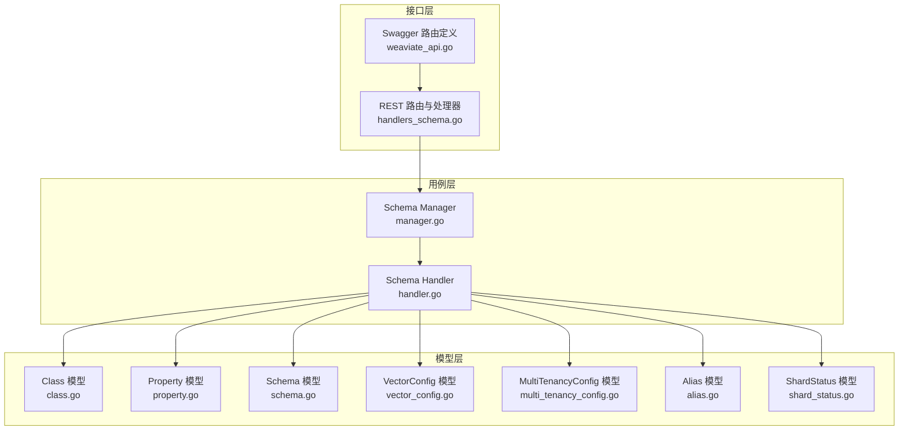
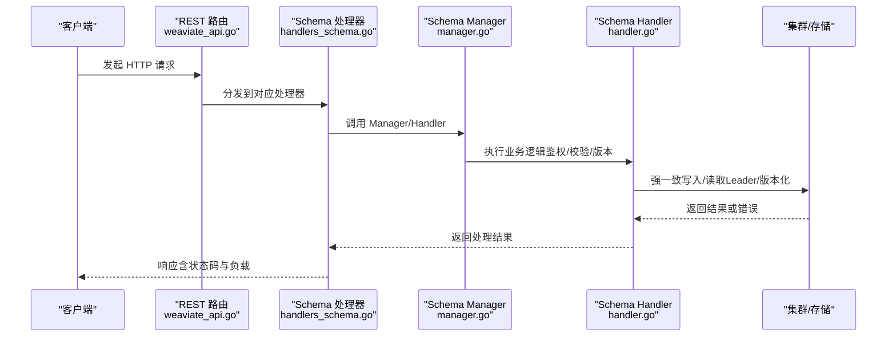
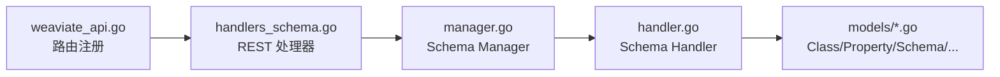

# 模式管理 API

<cite>
**本文引用的文件**
- [adapters/handlers/rest/handlers_schema.go](file://adapters/handlers/rest/handlers_schema.go)
- [adapters/handlers/rest/operations/schema/schema_objects_delete.go](file://adapters/handlers/rest/operations/schema/schema_objects_delete.go)
- [adapters/handlers/rest/operations/schema/schema_objects_properties_add.go](file://adapters/handlers/rest/operations/schema/schema_objects_properties_add.go)
- [adapters/handlers/rest/operations/schema/schema_objects_update.go](file://adapters/handlers/rest/operations/schema/schema_objects_update.go)
- [adapters/handlers/rest/operations/weaviate_api.go](file://adapters/handlers/rest/operations/weaviate_api.go)
- [entities/models/class.go](file://entities/models/class.go)
- [entities/models/property.go](file://entities/models/property.go)
- [entities/models/schema.go](file://entities/models/schema.go)
- [entities/models/vector_config.go](file://entities/models/vector_config.go)
- [entities/models/multi_tenancy_config.go](file://entities/models/multi_tenancy_config.go)
- [entities/models/alias.go](file://entities/models/alias.go)
- [entities/models/shard_status.go](file://entities/models/shard_status.go)
- [usecases/schema/manager.go](file://usecases/schema/manager.go)
- [usecases/schema/handler.go](file://usecases/schema/handler.go)
- [entities/schema/validation.go](file://entities/schema/validation.go)
- [openapi-specs/schema.json](file://openapi-specs/schema.json)
- [cluster/proto/api/schema_requests.go](file://cluster/proto/api/schema_requests.go)
</cite>

## 目录
1. [简介](#简介)
2. [项目结构](#项目结构)
3. [核心组件](#核心组件)
4. [架构总览](#架构总览)
5. [详细组件分析](#详细组件分析)
6. [依赖关系分析](#依赖关系分析)
7. [性能考量](#性能考量)
8. [故障排查指南](#故障排查指南)
9. [结论](#结论)
10. [附录](#附录)

## 简介
本文件为 Weaviate 模式管理 API 的权威接口文档，覆盖集合（Class）的创建、更新、删除、查询，以及属性添加、分片状态查询与更新、多租户管理、别名管理等能力。文档同时阐述模式配置项、数据类型与向量化设置、权限与一致性模型、版本控制与迁移策略，并提供可操作的最佳实践与性能优化建议。

## 项目结构
Weaviate 的模式管理 API 由三层协作实现：
- 接口层：REST 路由与处理器，负责将 HTTP 请求映射到 usecase 层。
- 用例层：schema Manager/Handler，负责一致性读写、权限校验、集群交互与版本控制。
- 数据模型层：OpenAPI 生成的 models，定义 Class、Property、Schema、VectorConfig、MultiTenancyConfig、Alias、ShardStatus 等。

图表来源
- [adapters/handlers/rest/handlers_schema.go](file://adapters/handlers/rest/handlers_schema.go#L361-L390)
- [adapters/handlers/rest/operations/weaviate_api.go](file://adapters/handlers/rest/operations/weaviate_api.go#L1434-L1460)
- [usecases/schema/manager.go](file://usecases/schema/manager.go#L37-L51)
- [usecases/schema/handler.go](file://usecases/schema/handler.go#L131-L155)
- [entities/models/class.go](file://entities/models/class.go#L29-L72)
- [entities/models/property.go](file://entities/models/property.go#L30-L65)
- [entities/models/schema.go](file://entities/models/schema.go#L29-L43)
- [entities/models/vector_config.go](file://entities/models/vector_config.go#L26-L39)
- [entities/models/multi_tenancy_config.go](file://entities/models/multi_tenancy_config.go#L26-L39)
- [entities/models/alias.go](file://entities/models/alias.go#L26-L36)
- [entities/models/shard_status.go](file://entities/models/shard_status.go#L26-L33)

章节来源
- [adapters/handlers/rest/handlers_schema.go](file://adapters/handlers/rest/handlers_schema.go#L361-L390)
- [adapters/handlers/rest/operations/weaviate_api.go](file://adapters/handlers/rest/operations/weaviate_api.go#L1434-L1460)
- [usecases/schema/manager.go](file://usecases/schema/manager.go#L37-L51)
- [usecases/schema/handler.go](file://usecases/schema/handler.go#L131-L155)

## 核心组件
- REST 处理器：封装对 schema Manager 的调用，统一错误码与指标上报。
- Schema Manager：聚合验证器、存储、授权、集群状态，提供强一致读写与版本控制。
- Schema Handler：面向 API 的职责分离，负责鉴权、过滤、别名解析、分片状态查询与更新。
- 数据模型：Class/Property/Schema/VectorConfig/MultiTenancyConfig/Alias/ShardStatus 等，承载配置与约束校验。

章节来源
- [adapters/handlers/rest/handlers_schema.go](file://adapters/handlers/rest/handlers_schema.go#L31-L56)
- [usecases/schema/manager.go](file://usecases/schema/manager.go#L37-L51)
- [usecases/schema/handler.go](file://usecases/schema/handler.go#L131-L155)
- [entities/models/class.go](file://entities/models/class.go#L29-L72)
- [entities/models/property.go](file://entities/models/property.go#L30-L65)
- [entities/models/schema.go](file://entities/models/schema.go#L29-L43)
- [entities/models/vector_config.go](file://entities/models/vector_config.go#L26-L39)
- [entities/models/multi_tenancy_config.go](file://entities/models/multi_tenancy_config.go#L26-L39)
- [entities/models/alias.go](file://entities/models/alias.go#L26-L36)
- [entities/models/shard_status.go](file://entities/models/shard_status.go#L26-L33)

## 架构总览
下图展示模式管理 API 的关键调用链：REST 路由 → 处理器 → Manager/Handler → 集群一致性写入/读取 → 返回响应。

图表来源
- [adapters/handlers/rest/operations/weaviate_api.go](file://adapters/handlers/rest/operations/weaviate_api.go#L1434-L1460)
- [adapters/handlers/rest/handlers_schema.go](file://adapters/handlers/rest/handlers_schema.go#L361-L390)
- [usecases/schema/manager.go](file://usecases/schema/manager.go#L208-L231)
- [usecases/schema/handler.go](file://usecases/schema/handler.go#L158-L190)

## 详细组件分析

### 集合（Class）管理
- 创建集合
  - 方法与路径：POST /schema/{className}
  - 请求体：Class 对象（包含名称、描述、属性、索引/复制/分片/向量配置等）
  - 成功响应：200 OK，返回创建后的 Class
  - 错误响应：422 Unprocessable Entity（校验失败/权限不足），403 Forbidden（权限不足）
- 更新集合
  - 方法与路径：PUT /schema/{className}
  - 请求体：Class 对象（仅允许更新可变配置，不支持改名或增删属性）
  - 成功响应：200 OK，返回更新后的 Class
  - 错误响应：404 Not Found（类不存在），422 Unprocessable Entity（校验失败/权限不足），403 Forbidden（权限不足）
- 删除集合
  - 方法与路径：DELETE /schema/{className}
  - 行为：删除集合定义及其中所有对象数据
  - 成功响应：200 OK
  - 错误响应：403 Forbidden（权限不足），400 Bad Request（权限不足/其他错误）
- 查询集合
  - 方法与路径：GET /schema/{className}
  - 参数：consistency（是否强一致读）
  - 成功响应：200 OK，返回 Class；未找到：404 Not Found
  - 错误响应：403 Forbidden（权限不足），500 InternalServerError（内部错误）

章节来源
- [adapters/handlers/rest/operations/schema/schema_objects_delete.go](file://adapters/handlers/rest/operations/schema/schema_objects_delete.go#L46-L51)
- [adapters/handlers/rest/operations/schema/schema_objects_update.go](file://adapters/handlers/rest/operations/schema/schema_objects_update.go#L46-L51)
- [adapters/handlers/rest/handlers_schema.go](file://adapters/handlers/rest/handlers_schema.go#L36-L56)
- [adapters/handlers/rest/handlers_schema.go](file://adapters/handlers/rest/handlers_schema.go#L58-L82)
- [adapters/handlers/rest/handlers_schema.go](file://adapters/handlers/rest/handlers_schema.go#L110-L125)
- [adapters/handlers/rest/handlers_schema.go](file://adapters/handlers/rest/handlers_schema.go#L84-L108)
- [adapters/handlers/rest/operations/weaviate_api.go](file://adapters/handlers/rest/operations/weaviate_api.go#L1434-L1441)

### 属性管理
- 添加属性
  - 方法与路径：POST /schema/{className}/properties
  - 请求体：Property 数组（支持嵌套属性）
  - 成功响应：200 OK，返回新增属性
  - 错误响应：422 Unprocessable Entity（校验失败/权限不足），403 Forbidden（权限不足）

章节来源
- [adapters/handlers/rest/operations/schema/schema_objects_properties_add.go](file://adapters/handlers/rest/operations/schema/schema_objects_properties_add.go#L46-L51)
- [adapters/handlers/rest/handlers_schema.go](file://adapters/handlers/rest/handlers_schema.go#L127-L146)

### 分片状态管理
- 查询分片状态
  - 方法与路径：GET /schema/{className}/shards
  - 参数：tenant（可选）
  - 成功响应：200 OK，返回 ShardStatusList
  - 错误响应：404 Not Found（类/分片不存在），403 Forbidden（权限不足）
- 更新分片状态
  - 方法与路径：PUT /schema/{className}/shards/{shardName}
  - 请求体：ShardStatus（如 READY/CLOSED 等）
  - 成功响应：200 OK，返回 ShardStatus
  - 错误响应：422 Unprocessable Entity（无效更新），404 Not Found（类/分片不存在），403 Forbidden（权限不足）

章节来源
- [adapters/handlers/rest/handlers_schema.go](file://adapters/handlers/rest/handlers_schema.go#L167-L195)
- [adapters/handlers/rest/handlers_schema.go](file://adapters/handlers/rest/handlers_schema.go#L197-L219)
- [openapi-specs/schema.json](file://openapi-specs/schema.json#L7985-L8026)

### 多租户管理
- 创建租户
  - 方法与路径：POST /schema/{className}/tenants
  - 请求体：Tenant 数组
  - 成功响应：200 OK，返回 Tenant 列表
  - 错误响应：422 Unprocessable Entity（校验失败/权限不足），403 Forbidden（权限不足）
- 更新租户
  - 方法与路径：PUT /schema/{className}/tenants
  - 请求体：Tenant 数组（支持批量更新状态）
  - 成功响应：200 OK，返回更新后的 Tenant 列表
  - 错误响应：422 Unprocessable Entity（校验失败/权限不足），403 Forbidden（权限不足）
- 删除租户
  - 方法与路径：DELETE /schema/{className}/tenants
  - 请求体：Tenant 名称数组
  - 成功响应：200 OK
  - 错误响应：422 Unprocessable Entity（校验失败/权限不足），403 Forbidden（权限不足）
- 获取租户列表
  - 方法与路径：GET /schema/{className}/tenants
  - 参数：consistency（是否强一致读）
  - 成功响应：200 OK，返回 Tenant 列表
  - 错误响应：422 Unprocessable Entity（权限不足），403 Forbidden（权限不足）
- 获取单个租户
  - 方法与路径：GET /schema/{className}/tenants/{tenantName}
  - 参数：consistency（是否强一致读）
  - 成功响应：200 OK，返回 Tenant
  - 错误响应：404 Not Found（租户不存在），422 Unprocessable Entity（权限不足），403 Forbidden（权限不足）
- 租户存在性检查
  - 方法与路径：HEAD /schema/{className}/tenants/{tenantName}
  - 参数：consistency（是否强一致读）
  - 成功响应：200 OK；不存在：404 Not Found
  - 错误响应：422 Unprocessable Entity（权限不足），403 Forbidden（权限不足）

章节来源
- [adapters/handlers/rest/handlers_schema.go](file://adapters/handlers/rest/handlers_schema.go#L221-L241)
- [adapters/handlers/rest/handlers_schema.go](file://adapters/handlers/rest/handlers_schema.go#L243-L263)
- [adapters/handlers/rest/handlers_schema.go](file://adapters/handlers/rest/handlers_schema.go#L265-L285)
- [adapters/handlers/rest/handlers_schema.go](file://adapters/handlers/rest/handlers_schema.go#L287-L306)
- [adapters/handlers/rest/handlers_schema.go](file://adapters/handlers/rest/handlers_schema.go#L308-L339)
- [adapters/handlers/rest/handlers_schema.go](file://adapters/handlers/rest/handlers_schema.go#L341-L359)
- [adapters/handlers/rest/operations/weaviate_api.go](file://adapters/handlers/rest/operations/weaviate_api.go#L1442-L1460)

### 别名管理
- 创建别名
  - 方法与路径：POST /schema/aliases
  - 请求体：Alias（alias, class）
  - 成功响应：200 OK
  - 错误响应：422 Unprocessable Entity（校验失败/权限不足），403 Forbidden（权限不足）
- 更新别名
  - 方法与路径：PUT /schema/aliases
  - 请求体：Alias（支持替换映射）
  - 成功响应：200 OK
  - 错误响应：422 Unprocessable Entity（校验失败/权限不足），403 Forbidden（权限不足）
- 删除别名
  - 方法与路径：DELETE /schema/aliases
  - 请求体：alias 字符串
  - 成功响应：200 OK
  - 错误响应：422 Unprocessable Entity（校验失败/权限不足），403 Forbidden（权限不足）
- 获取别名
  - 方法与路径：GET /schema/aliases
  - 参数：alias/class（可选）
  - 成功响应：200 OK，返回 Alias 列表
  - 错误响应：422 Unprocessable Entity（权限不足），403 Forbidden（权限不足）
- 获取别名指向的类
  - 方法与路径：GET /schema/aliases/{alias}
  - 成功响应：200 OK，返回 Alias
  - 错误响应：404 Not Found（别名不存在），403 Forbidden（权限不足）

章节来源
- [openapi-specs/schema.json](file://openapi-specs/schema.json#L8028-L8030)
- [usecases/schema/handler.go](file://usecases/schema/handler.go#L256-L273)
- [cluster/proto/api/schema_requests.go](file://cluster/proto/api/schema_requests.go#L121-L135)

### 模式导出
- 导出完整模式
  - 方法与路径：GET /schema
  - 参数：consistency（是否强一致读）
  - 成功响应：200 OK，返回 Schema（包含 classes）
  - 错误响应：403 Forbidden（权限不足）

章节来源
- [adapters/handlers/rest/handlers_schema.go](file://adapters/handlers/rest/handlers_schema.go#L148-L165)

### 数据模型与配置要点
- Class
  - 关键字段：class、description、properties、invertedIndexConfig、replicationConfig、shardingConfig、vectorizer/vectorIndexType/vectorIndexConfig/vectorConfig、multiTenancyConfig、objectTtlConfig、moduleConfig
  - 校验：对 properties、invertedIndexConfig、replicationConfig、vectorConfig 进行逐项校验
- Property
  - 关键字段：name、dataType、description、indexFilterable/indexSearchable/indexRangeFilters、tokenization、nestedProperties、moduleConfig
  - 校验：tokenization 枚举值校验、嵌套属性递归校验
- Schema
  - 关键字段：classes、maintainer/name
  - 校验：classes 逐项校验
- VectorConfig
  - 关键字段：vectorIndexType、vectorIndexConfig、vectorizer
- MultiTenancyConfig
  - 关键字段：enabled、autoTenantActivation、autoTenantCreation
- Alias
  - 关键字段：alias、class
- ShardStatus
  - 关键字段：status

章节来源
- [entities/models/class.go](file://entities/models/class.go#L29-L72)
- [entities/models/class.go](file://entities/models/class.go#L74-L106)
- [entities/models/property.go](file://entities/models/property.go#L30-L65)
- [entities/models/property.go](file://entities/models/property.go#L67-L83)
- [entities/models/schema.go](file://entities/models/schema.go#L29-L43)
- [entities/models/vector_config.go](file://entities/models/vector_config.go#L26-L39)
- [entities/models/multi_tenancy_config.go](file://entities/models/multi_tenancy_config.go#L26-L39)
- [entities/models/alias.go](file://entities/models/alias.go#L26-L36)
- [entities/models/shard_status.go](file://entities/models/shard_status.go#L26-L33)

### 版本控制与一致性
- 强一致读写：通过 SchemaManager 在 Leader 节点执行，确保 schema 与分片状态最新。
- 版本号：QueryClassVersions 提供类版本映射；UpdateTenants/AddTenants 等操作返回版本号用于等待同步。
- 乐观读：SchemaReader 支持本地最终一致读，适合非关键路径；强一致读用于敏感场景。
- 租户状态：OptimisticTenantStatus 允许本地快速判断，必要时回退到 Leader 校验，避免热点路径的额外开销。

章节来源
- [usecases/schema/handler.go](file://usecases/schema/handler.go#L192-L223)
- [usecases/schema/handler.go](file://usecases/schema/handler.go#L295-L309)
- [usecases/schema/manager.go](file://usecases/schema/manager.go#L295-L321)
- [cluster/proto/api/schema_requests.go](file://cluster/proto/api/schema_requests.go#L112-L119)

### 模式验证规则与约束
- 类名/别名：长度限制、字符集限制、正则匹配
- 租户名：长度限制、字符集限制、正则匹配
- 属性名：长度限制、GraphQL 合法标识符
- 嵌套属性名：GraphQL 合法标识符
- 保留属性名：_additional、_id、id 不可使用
- Tokenization 枚举值限定
- 复制/倒排索引/向量配置的上下文校验

章节来源
- [entities/schema/validation.go](file://entities/schema/validation.go#L19-L54)
- [entities/schema/validation.go](file://entities/schema/validation.go#L56-L96)
- [entities/schema/validation.go](file://entities/schema/validation.go#L98-L133)
- [entities/schema/validation.go](file://entities/schema/validation.go#L135-L167)
- [entities/models/property.go](file://entities/models/property.go#L154-L172)

### 错误处理机制
- 权限错误：403 Forbidden
- 参数/校验错误：422 Unprocessable Entity
- 资源不存在：404 Not Found
- 其他错误：根据具体场景返回 4xx/5xx
- 指标上报：schemaRequestsTotal 统计每类请求的成功/用户错误/系统错误

章节来源
- [adapters/handlers/rest/handlers_schema.go](file://adapters/handlers/rest/handlers_schema.go#L44-L51)
- [adapters/handlers/rest/handlers_schema.go](file://adapters/handlers/rest/handlers_schema.go#L66-L77)
- [adapters/handlers/rest/handlers_schema.go](file://adapters/handlers/rest/handlers_schema.go#L114-L121)
- [adapters/handlers/rest/handlers_schema.go](file://adapters/handlers/rest/handlers_schema.go#L134-L141)
- [adapters/handlers/rest/handlers_schema.go](file://adapters/handlers/rest/handlers_schema.go#L205-L212)
- [adapters/handlers/rest/handlers_schema.go](file://adapters/handlers/rest/handlers_schema.go#L348-L356)

### 模式操作示例（步骤级）
- 创建集合
  - 步骤：构造 Class（含 properties/vectorConfig/multiTenancyConfig 等），发送 POST /schema/{className}
  - 结果：200 OK 返回 Class
- 添加属性
  - 步骤：准备 Property 数组，发送 POST /schema/{className}/properties
  - 结果：200 OK 返回新增属性
- 更新集合配置
  - 步骤：准备更新后的 Class（仅可变配置），发送 PUT /schema/{className}
  - 结果：200 OK 返回更新后的 Class
- 查询集合
  - 步骤：GET /schema/{className}?consistency=true/false
  - 结果：200 OK 返回 Class 或 404
- 删除集合
  - 步骤：DELETE /schema/{className}
  - 结果：200 OK（注意：会删除全部数据）
- 分片状态查询/更新
  - 步骤：GET /schema/{className}/shards?tenant=xxx；PUT /schema/{className}/shards/{shardName}
  - 结果：200 OK 返回状态
- 多租户管理
  - 步骤：POST/PUT/DELETE /schema/{className}/tenants；GET /schema/{className}/tenants；HEAD /schema/{className}/tenants/{tenantName}
  - 结果：按需返回 200 OK 或 404
- 别名管理
  - 步骤：POST/PUT/DELETE /schema/aliases；GET /schema/aliases；GET /schema/aliases/{alias}
  - 结果：200 OK

章节来源
- [adapters/handlers/rest/operations/schema/schema_objects_delete.go](file://adapters/handlers/rest/operations/schema/schema_objects_delete.go#L46-L51)
- [adapters/handlers/rest/operations/schema/schema_objects_properties_add.go](file://adapters/handlers/rest/operations/schema/schema_objects_properties_add.go#L46-L51)
- [adapters/handlers/rest/operations/schema/schema_objects_update.go](file://adapters/handlers/rest/operations/schema/schema_objects_update.go#L46-L51)
- [adapters/handlers/rest/handlers_schema.go](file://adapters/handlers/rest/handlers_schema.go#L84-L108)
- [adapters/handlers/rest/handlers_schema.go](file://adapters/handlers/rest/handlers_schema.go#L167-L195)
- [adapters/handlers/rest/handlers_schema.go](file://adapters/handlers/rest/handlers_schema.go#L197-L219)
- [adapters/handlers/rest/handlers_schema.go](file://adapters/handlers/rest/handlers_schema.go#L221-L241)
- [adapters/handlers/rest/handlers_schema.go](file://adapters/handlers/rest/handlers_schema.go#L287-L306)
- [adapters/handlers/rest/handlers_schema.go](file://adapters/handlers/rest/handlers_schema.go#L341-L359)
- [openapi-specs/schema.json](file://openapi-specs/schema.json#L8028-L8030)

### 最佳实践与迁移策略
- 配置优先级
  - 使用 vectorConfig（命名向量）替代旧版 vectorizer/vectorIndexType/vectorIndexConfig 组合（自 v1.24 起）
  - 多租户启用前明确 autoTenantActivation/autoTenantCreation 策略
- 向后兼容
  - 旧版字段仍被解析，但建议逐步迁移到 vectorConfig
  - 属性 tokenization 变更需谨慎评估倒排索引重建成本
- 迁移策略
  - 小步快跑：先在测试环境验证 schema 变更，再灰度到生产
  - 使用强一致读（consistency=true）进行关键变更前后核验
  - 大规模属性变更建议在低峰时段执行
- 性能优化
  - 合理设置 invertedIndexConfig.indexFilterable/indexSearchable，减少不必要的倒排索引
  - 控制属性数量与嵌套深度，降低磁盘与内存占用
  - 使用多租户时开启 autoTenantActivation，减少跨节点查找延迟

章节来源
- [entities/models/class.go](file://entities/models/class.go#L61-L72)
- [entities/models/property.go](file://entities/models/property.go#L41-L51)
- [usecases/schema/manager.go](file://usecases/schema/manager.go#L295-L321)

## 依赖关系分析
- REST 路由与处理器绑定：weaviate_api.go 将 HTTP 方法与路径映射到 schema 操作处理器。
- 处理器依赖 Manager/Handler：统一鉴权、校验、版本控制与集群交互。
- Handler 依赖 SchemaManager/SchemaReader：前者负责强一致写入/读取，后者负责本地最终一致读取与别名解析。
- 模型层提供严格的字段校验与枚举约束，保障 API 输入质量。

图表来源
- [adapters/handlers/rest/operations/weaviate_api.go](file://adapters/handlers/rest/operations/weaviate_api.go#L1434-L1460)
- [adapters/handlers/rest/handlers_schema.go](file://adapters/handlers/rest/handlers_schema.go#L361-L390)
- [usecases/schema/manager.go](file://usecases/schema/manager.go#L37-L51)
- [usecases/schema/handler.go](file://usecases/schema/handler.go#L131-L155)

章节来源
- [adapters/handlers/rest/operations/weaviate_api.go](file://adapters/handlers/rest/operations/weaviate_api.go#L1434-L1460)
- [adapters/handlers/rest/handlers_schema.go](file://adapters/handlers/rest/handlers_schema.go#L361-L390)
- [usecases/schema/manager.go](file://usecases/schema/manager.go#L37-L51)
- [usecases/schema/handler.go](file://usecases/schema/handler.go#L131-L155)

## 性能考量
- 读路径
  - 优先使用 SchemaReader 的本地读取，避免跨节点一致性带来的延迟
  - 对于关键路径（如租户状态判断），使用 OptimisticTenantStatus 减少 Leader 查找
- 写路径
  - 集群写入通过 Raft 保证一致性，避免在高并发下阻塞
  - 批量租户操作（AddTenants/UpdateTenants/DeleteTenants）建议合并请求
- 存储与索引
  - 合理选择倒排索引与搜索索引开关，平衡查询性能与存储开销
  - 多租户场景下，尽量减少冷热租户混布，提升命中率

[本节为通用指导，无需特定文件来源]

## 故障排查指南
- 403 Forbidden：检查权限策略与 RBAC 角色，确认对 collections/shards 的访问范围
- 422 Unprocessable Entity：检查请求体字段是否符合模型校验（如 tokenization 枚举、属性名合法性）
- 404 Not Found：确认类名/租户名/分片名是否存在；若使用别名，确认别名映射正确
- 租户状态异常：使用 GET /schema/{className}/tenants/{tenantName} 核对状态；必要时通过 HEAD /schema/{className}/tenants/{tenantName} 快速判断
- 分片状态异常：使用 GET /schema/{className}/shards 查询状态；如需修复，使用 PUT /schema/{className}/shards/{shardName} 更新状态

章节来源
- [adapters/handlers/rest/handlers_schema.go](file://adapters/handlers/rest/handlers_schema.go#L44-L51)
- [adapters/handlers/rest/handlers_schema.go](file://adapters/handlers/rest/handlers_schema.go#L66-L77)
- [adapters/handlers/rest/handlers_schema.go](file://adapters/handlers/rest/handlers_schema.go#L114-L121)
- [adapters/handlers/rest/handlers_schema.go](file://adapters/handlers/rest/handlers_schema.go#L134-L141)
- [adapters/handlers/rest/handlers_schema.go](file://adapters/handlers/rest/handlers_schema.go#L205-L212)
- [adapters/handlers/rest/handlers_schema.go](file://adapters/handlers/rest/handlers_schema.go#L348-L356)

## 结论
Weaviate 的模式管理 API 以清晰的分层架构实现了强一致与最终一致的混合读写模型，结合严格的模型校验与权限控制，既满足复杂场景下的多租户与分片管理需求，又提供了良好的扩展性与可维护性。遵循本文档的配置建议与最佳实践，可在保证数据安全与一致性的前提下，获得更优的性能表现。

[本节为总结性内容，无需特定文件来源]

## 附录
- OpenAPI 规范中关于分片状态更新的响应定义与错误码
- 集群协议中的别名与分片状态查询请求/响应结构

章节来源
- [openapi-specs/schema.json](file://openapi-specs/schema.json#L7985-L8026)
- [cluster/proto/api/schema_requests.go](file://cluster/proto/api/schema_requests.go#L121-L135)