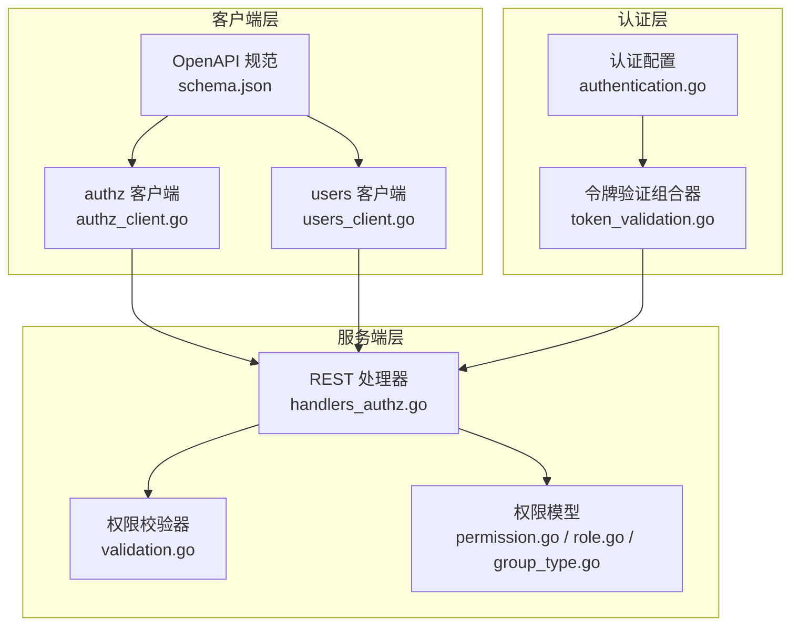
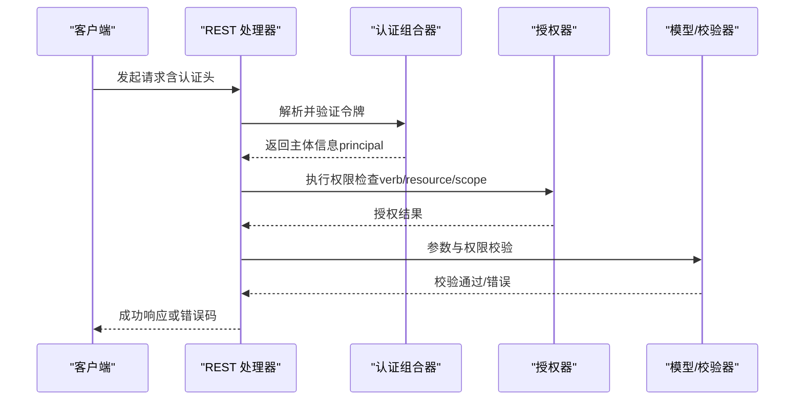
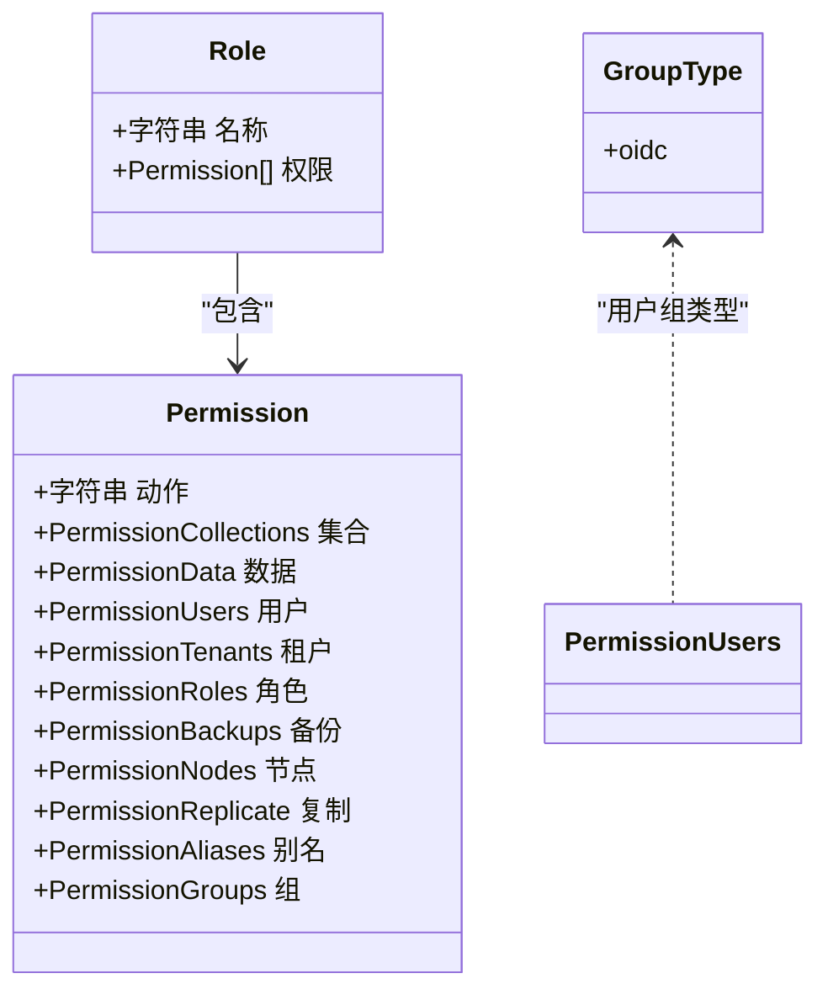
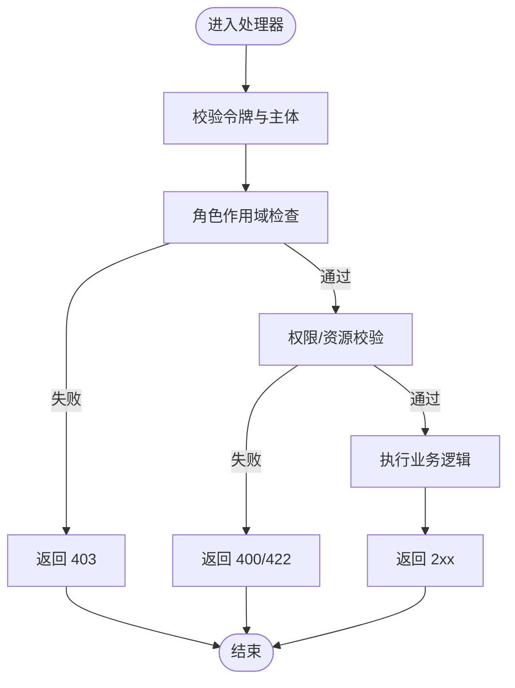
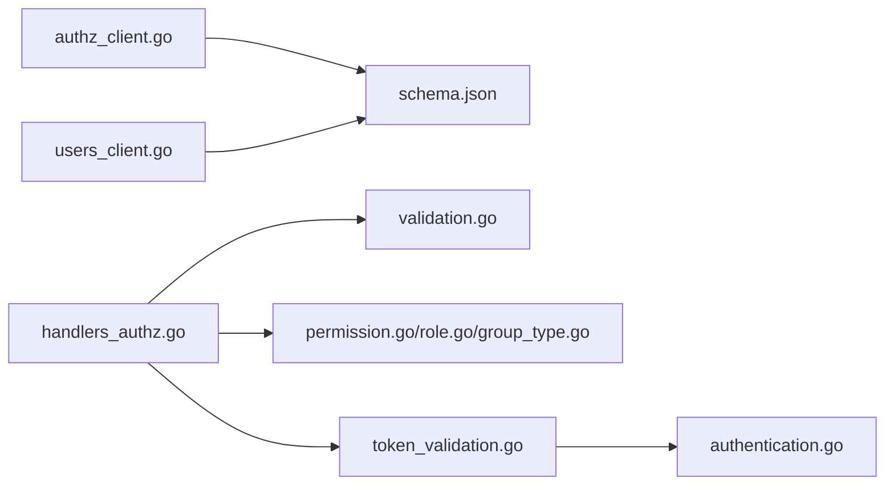

# 认证授权 API

<cite>
**本文引用的文件**
- [adapters/handlers/rest/authz/handlers_authz.go](file://adapters/handlers/rest/authz/handlers_authz.go)
- [adapters/handlers/rest/authz/validation.go](file://adapters/handlers/rest/authz/validation.go)
- [client/authz/authz_client.go](file://client/authz/authz_client.go)
- [client/users/users_client.go](file://client/users/users_client.go)
- [openapi-specs/schema.json](file://openapi-specs/schema.json)
- [entities/models/permission.go](file://entities/models/permission.go)
- [entities/models/role.go](file://entities/models/role.go)
- [entities/models/group_type.go](file://entities/models/group_type.go)
- [test/acceptance/authz/users_test.go](file://test/acceptance/authz/users_test.go)
- [usecases/auth/authentication/composer/token_validation.go](file://usecases/auth/authentication/composer/token_validation.go)
- [usecases/config/authentication.go](file://usecases/config/authentication.go)
- [client/authz/get_users_for_role_responses.go](file://client/authz/get_users_for_role_responses.go)
- [client/authz/get_roles_for_user_responses.go](file://client/authz/get_roles_for_user_responses.go)
- [client/authz/get_roles_responses.go](file://client/authz/get_roles_responses.go)
- [client/users/rotate_user_api_key_parameters.go](file://client/users/rotate_user_api_key_parameters.go)
- [client/users/rotate_user_api_key_responses.go](file://client/users/rotate_user_api_key_responses.go)
</cite>

## 目录
1. [简介](#简介)
2. [项目结构](#项目结构)
3. [核心组件](#核心组件)
4. [架构总览](#架构总览)
5. [详细组件分析](#详细组件分析)
6. [依赖分析](#依赖分析)
7. [性能考虑](#性能考虑)
8. [故障排除指南](#故障排除指南)
9. [结论](#结论)
10. [附录](#附录)

## 简介
本文件面向 Weaviate 的认证授权 API，系统性梳理 RBAC 授权、用户管理、角色管理与组管理的 REST 接口，覆盖 HTTP 方法、URL 模式、请求参数、响应状态码与错误载荷，并结合源码中的 OpenAPI 规范与客户端生成器，给出权威的接口定义与实现依据。同时，文档解释认证方法（API Key、OIDC/OpenID Connect）、会话与令牌管理、权限验证机制、权限模型与继承关系、动态权限更新、数据库用户与动态用户管理、权限审计与最佳实践，并提供集成与排障建议。

## 项目结构
Weaviate 的认证授权能力由以下层次构成：
- OpenAPI 规范：定义了所有认证授权端点的路径、方法、参数与响应。
- 客户端生成器：基于 OpenAPI 生成 Go 客户端，封装请求构造与响应解析。
- 服务端处理器：REST 层将 OpenAPI 路由映射到业务控制器，执行权限校验与资源过滤。
- 权限模型与验证：权限动作、资源范围、作用域与匹配规则在模型与校验器中定义。
- 认证组合器：根据配置选择 API Key 或 OIDC 验证策略，或动态判定令牌类型。

**图表来源**
- [openapi-specs/schema.json](file://openapi-specs/schema.json#L5348-L5500)
- [client/authz/authz_client.go](file://client/authz/authz_client.go#L88-L800)
- [client/users/users_client.go](file://client/users/users_client.go#L109-L395)
- [adapters/handlers/rest/authz/handlers_authz.go](file://adapters/handlers/rest/authz/handlers_authz.go#L128-L761)
- [adapters/handlers/rest/authz/validation.go](file://adapters/handlers/rest/authz/validation.go#L22-L87)
- [entities/models/permission.go](file://entities/models/permission.go#L29-L261)
- [entities/models/role.go](file://entities/models/role.go#L29-L95)
- [entities/models/group_type.go](file://entities/models/group_type.go#L28-L86)
- [usecases/auth/authentication/composer/token_validation.go](file://usecases/auth/authentication/composer/token_validation.go#L36-L69)
- [usecases/config/authentication.go](file://usecases/config/authentication.go#L46-L83)

**章节来源**
- [openapi-specs/schema.json](file://openapi-specs/schema.json#L5348-L5500)
- [client/authz/authz_client.go](file://client/authz/authz_client.go#L88-L800)
- [client/users/users_client.go](file://client/users/users_client.go#L109-L395)
- [adapters/handlers/rest/authz/handlers_authz.go](file://adapters/handlers/rest/authz/handlers_authz.go#L128-L761)
- [adapters/handlers/rest/authz/validation.go](file://adapters/handlers/rest/authz/validation.go#L22-L87)
- [entities/models/permission.go](file://entities/models/permission.go#L29-L261)
- [entities/models/role.go](file://entities/models/role.go#L29-L95)
- [entities/models/group_type.go](file://entities/models/group_type.go#L28-L86)
- [usecases/auth/authentication/composer/token_validation.go](file://usecases/auth/authentication/composer/token_validation.go#L36-L69)
- [usecases/config/authentication.go](file://usecases/config/authentication.go#L46-L83)

## 核心组件
- 认证授权 REST 处理器：负责路由注册、权限校验、资源过滤、日志审计与错误处理。
- 权限模型与校验：定义权限动作枚举、资源范围与正则校验，确保权限声明合法。
- OpenAPI 客户端：自动生成的 Go 客户端封装请求构建、序列化与响应读取。
- 认证组合器：根据配置选择 API Key 或 OIDC 验证策略，支持动态判定令牌类型。

**章节来源**
- [adapters/handlers/rest/authz/handlers_authz.go](file://adapters/handlers/rest/authz/handlers_authz.go#L128-L761)
- [adapters/handlers/rest/authz/validation.go](file://adapters/handlers/rest/authz/validation.go#L22-L87)
- [client/authz/authz_client.go](file://client/authz/authz_client.go#L88-L800)
- [client/users/users_client.go](file://client/users/users_client.go#L109-L395)
- [usecases/auth/authentication/composer/token_validation.go](file://usecases/auth/authentication/composer/token_validation.go#L36-L69)

## 架构总览
Weaviate 的认证授权采用“配置驱动 + 组合器 + REST 处理器”的分层设计：
- 配置层：启用 API Key、OIDC、匿名访问等认证方式。
- 组合器层：根据令牌形态与配置选择验证策略，提取主体信息（principal）。
- REST 层：对每个端点进行权限检查与资源过滤，调用控制器完成业务逻辑。
- 模型层：统一的权限模型与校验规则保证权限声明的合法性与一致性。

**图表来源**
- [usecases/auth/authentication/composer/token_validation.go](file://usecases/auth/authentication/composer/token_validation.go#L36-L69)
- [adapters/handlers/rest/authz/handlers_authz.go](file://adapters/handlers/rest/authz/handlers_authz.go#L104-L126)
- [adapters/handlers/rest/authz/validation.go](file://adapters/handlers/rest/authz/validation.go#L22-L87)

## 详细组件分析

### 认证方法与令牌管理
- API Key：静态 API Key 可用于数据库用户认证；当 OIDC 启用时，API Key 优先于 OIDC 进行验证。
- OIDC/OpenID Connect：支持从令牌中提取用户名与组信息，配置包含 Issuer、ClientID、Scopes、JWKS 等。
- 动态判定：若无法解析为 JWT，则按 API Key 方式验证；否则按 OIDC 方式验证。
- 匿名访问：可配置允许未携带认证信息的请求以匿名身份访问（仅影响认证，不影响授权）。

**章节来源**
- [usecases/config/authentication.go](file://usecases/config/authentication.go#L46-L83)
- [usecases/auth/authentication/composer/token_validation.go](file://usecases/auth/authentication/composer/token_validation.go#L36-L69)

### 权限模型与继承
- 权限动作：涵盖备份、集群、数据、节点、角色、集合、用户、租户、复制、别名、组等动作枚举。
- 资源范围：每类动作可限定集合、租户、别名等范围，支持通配符与正则表达式。
- 角色与内置角色：角色由权限集合组成；存在内置角色，不可删除或覆盖。
- 继承与匹配：支持“全部匹配”和“匹配角色”两种作用域，用于创建/更新角色时的权限上限控制。

**图表来源**
- [entities/models/permission.go](file://entities/models/permission.go#L29-L261)
- [entities/models/role.go](file://entities/models/role.go#L29-L95)
- [entities/models/group_type.go](file://entities/models/group_type.go#L28-L86)

**章节来源**
- [entities/models/permission.go](file://entities/models/permission.go#L29-L261)
- [entities/models/role.go](file://entities/models/role.go#L29-L95)
- [adapters/handlers/rest/authz/handlers_authz.go](file://adapters/handlers/rest/authz/handlers_authz.go#L104-L126)

### RBAC 角色管理端点
- 创建角色
  - 方法与路径：POST /authz/roles
  - 请求体：名称与权限数组
  - 响应：201 Created、400/403/409/500
- 获取角色列表
  - 方法与路径：GET /authz/roles
  - 查询参数：includeFullRoles（是否返回权限详情）
  - 响应：200 OK、401/403/500
- 获取单个角色
  - 方法与路径：GET /authz/roles/{id}
  - 响应：200 OK、401/403/404/500
- 删除角色
  - 方法与路径：DELETE /authz/roles/{id}
  - 响应：204 No Content、400/403/500
- 添加权限
  - 方法与路径：POST /authz/roles/{id}/add-permissions
  - 请求体：权限数组
  - 响应：200 OK、400/403/404/500
- 移除权限
  - 方法与路径：POST /authz/roles/{id}/remove-permissions
  - 请求体：权限数组
  - 响应：200 OK、400/403/404/500
- 检查权限
  - 方法与路径：POST /authz/roles/{id}/has-permission
  - 请求体：权限对象
  - 响应：200 OK、400/403/500

**章节来源**
- [openapi-specs/schema.json](file://openapi-specs/schema.json#L5348-L5500)
- [client/authz/authz_client.go](file://client/authz/authz_client.go#L211-L245)
- [client/authz/authz_client.go](file://client/authz/authz_client.go#L416-L450)
- [client/authz/authz_client.go](file://client/authz/authz_client.go#L375-L410)
- [client/authz/authz_client.go](file://client/authz/authz_client.go#L252-L286)
- [client/authz/authz_client.go](file://client/authz/authz_client.go#L88-L122)
- [client/authz/authz_client.go](file://client/authz/authz_client.go#L703-L737)
- [client/authz/authz_client.go](file://client/authz/authz_client.go#L698-L737)
- [client/authz/authz_client.go](file://client/authz/authz_client.go#L662-L696)

### RBAC 用户与组管理端点
- 获取用户的角色
  - 方法与路径：GET /authz/users/{id}/roles/{userType}
  - 查询参数：includeFullRoles
  - 响应：200 OK、400/401/403/404/422/500
- 分配角色给用户
  - 方法与路径：POST /authz/users/{id}/assign
  - 请求体：roles 数组、userType
  - 响应：200 OK、400/401/403/404/500
- 撤销用户的角色
  - 方法与路径：POST /authz/users/{id}/revoke
  - 请求体：roles 数组
  - 响应：200 OK、400/401/403/404/500
- 获取角色下的用户
  - 方法与路径：GET /authz/roles/{id}/user-assignments
  - 响应：200 OK、401/403/500
- 获取组的角色
  - 方法与路径：GET /authz/groups/{id}/roles/{groupType}
  - 响应：200 OK、400/401/403/500
- 分配角色给组
  - 方法与路径：POST /authz/groups/{id}/assign
  - 请求体：roles 数组、groupType
  - 响应：200 OK、400/401/403/404/500
- 撤销组的角色
  - 方法与路径：POST /authz/groups/{id}/revoke
  - 请求体：roles 数组
  - 响应：200 OK、400/401/403/404/500
- 获取组列表
  - 方法与路径：GET /authz/groups/{groupType}
  - 响应：200 OK、400/401/403/500

**章节来源**
- [openapi-specs/schema.json](file://openapi-specs/schema.json#L5348-L5500)
- [client/authz/authz_client.go](file://client/authz/authz_client.go#L498-L532)
- [client/authz/authz_client.go](file://client/authz/authz_client.go#L170-L204)
- [client/authz/authz_client.go](file://client/authz/authz_client.go#L785-L800)
- [client/authz/authz_client.go](file://client/authz/authz_client.go#L580-L614)
- [client/authz/authz_client.go](file://client/authz/authz_client.go#L457-L491)
- [client/authz/authz_client.go](file://client/authz/authz_client.go#L129-L163)
- [client/authz/authz_client.go](file://client/authz/authz_client.go#L744-L778)
- [client/authz/authz_client.go](file://client/authz/authz_client.go#L293-L327)

### 数据库用户与动态用户管理端点
- 创建用户
  - 方法与路径：POST /users/db/{user_id}
  - 响应：201 Created、400/401/403/409/500
- 获取用户信息
  - 方法与路径：GET /users/db/{user_id}
  - 响应：200 OK、401/403/404/500
- 获取当前用户信息
  - 方法与路径：GET /users/own-info
  - 响应：200 OK、401/403/500
- 列出所有用户
  - 方法与路径：GET /users/db
  - 响应：200 OK、401/403/500
- 激活/停用用户
  - 方法与路径：POST /users/db/{user_id}/activate、POST /users/db/{user_id}/deactivate
  - 响应：200 OK、400/401/403/404/500
- 删除用户
  - 方法与路径：DELETE /users/db/{user_id}
  - 响应：204 No Content、400/401/403/404/500
- 旋转 API Key
  - 方法与路径：POST /users/db/{user_id}/rotate-key
  - 响应：200 OK、400/401/403/404/422/500

**章节来源**
- [openapi-specs/schema.json](file://openapi-specs/schema.json#L5348-L5500)
- [client/users/users_client.go](file://client/users/users_client.go#L109-L143)
- [client/users/users_client.go](file://client/users/users_client.go#L273-L307)
- [client/users/users_client.go](file://client/users/users_client.go#L232-L266)
- [client/users/users_client.go](file://client/users/users_client.go#L314-L348)
- [client/users/users_client.go](file://client/users/users_client.go#L68-L102)
- [client/users/users_client.go](file://client/users/users_client.go#L150-L184)
- [client/users/users_client.go](file://client/users/users_client.go#L191-L225)
- [client/users/users_client.go](file://client/users/users_client.go#L355-L389)

### 权限验证流程与错误处理
- 角色作用域检查：创建/更新角色时，要求操作者具备“全部匹配”或“匹配角色”的权限，并进一步校验授予的权限不得超出自身。
- 资源过滤：读取角色列表与用户角色时，根据授权器过滤不可见资源。
- 错误响应：401 未认证、403 禁止、404 未找到、409 冲突、422 语义错误、500 内部错误。

**图表来源**
- [adapters/handlers/rest/authz/handlers_authz.go](file://adapters/handlers/rest/authz/handlers_authz.go#L104-L126)
- [adapters/handlers/rest/authz/handlers_authz.go](file://adapters/handlers/rest/authz/handlers_authz.go#L312-L375)
- [adapters/handlers/rest/authz/validation.go](file://adapters/handlers/rest/authz/validation.go#L22-L87)

**章节来源**
- [adapters/handlers/rest/authz/handlers_authz.go](file://adapters/handlers/rest/authz/handlers_authz.go#L104-L126)
- [adapters/handlers/rest/authz/handlers_authz.go](file://adapters/handlers/rest/authz/handlers_authz.go#L312-L375)
- [adapters/handlers/rest/authz/validation.go](file://adapters/handlers/rest/authz/validation.go#L22-L87)

### 授权操作示例（无代码片段）
- 创建角色：使用管理员密钥调用创建角色端点，传入名称与权限数组。
- 分配角色给用户：使用管理员密钥调用分配角色端点，指定用户 ID、userType 与 roles。
- 权限授予：通过添加权限端点向角色追加权限，或移除权限端点撤销权限。
- 组管理：通过组分配/撤销端点为 OIDC 组授予或撤销角色。
- 用户 API Key 旋转：使用管理员密钥调用旋转 API Key 端点，生成新密钥并替换旧密钥。

**章节来源**
- [test/acceptance/authz/users_test.go](file://test/acceptance/authz/users_test.go#L166-L200)
- [client/authz/authz_client.go](file://client/authz/authz_client.go#L211-L245)
- [client/authz/authz_client.go](file://client/authz/authz_client.go#L170-L204)
- [client/authz/authz_client.go](file://client/authz/authz_client.go#L703-L737)
- [client/authz/authz_client.go](file://client/authz/authz_client.go#L457-L491)
- [client/users/users_client.go](file://client/users/users_client.go#L355-L389)

## 依赖分析
- 处理器依赖授权器与控制器，控制器依赖模型转换与策略过滤。
- 客户端依赖 OpenAPI 规范生成，规范定义了端点、参数与响应。
- 认证组合器依赖配置，动态选择 API Key 或 OIDC 验证策略。

**图表来源**
- [client/authz/authz_client.go](file://client/authz/authz_client.go#L88-L800)
- [client/users/users_client.go](file://client/users/users_client.go#L109-L395)
- [openapi-specs/schema.json](file://openapi-specs/schema.json#L5348-L5500)
- [adapters/handlers/rest/authz/handlers_authz.go](file://adapters/handlers/rest/authz/handlers_authz.go#L128-L761)
- [adapters/handlers/rest/authz/validation.go](file://adapters/handlers/rest/authz/validation.go#L22-L87)
- [usecases/auth/authentication/composer/token_validation.go](file://usecases/auth/authentication/composer/token_validation.go#L36-L69)
- [usecases/config/authentication.go](file://usecases/config/authentication.go#L46-L83)

**章节来源**
- [client/authz/authz_client.go](file://client/authz/authz_client.go#L88-L800)
- [client/users/users_client.go](file://client/users/users_client.go#L109-L395)
- [openapi-specs/schema.json](file://openapi-specs/schema.json#L5348-L5500)
- [adapters/handlers/rest/authz/handlers_authz.go](file://adapters/handlers/rest/authz/handlers_authz.go#L128-L761)
- [adapters/handlers/rest/authz/validation.go](file://adapters/handlers/rest/authz/validation.go#L22-L87)
- [usecases/auth/authentication/composer/token_validation.go](file://usecases/auth/authentication/composer/token_validation.go#L36-L69)
- [usecases/config/authentication.go](file://usecases/config/authentication.go#L46-L83)

## 性能考虑
- 权限校验与资源过滤：在读取角色列表与用户角色时，使用授权器与过滤器减少无效数据传输。
- 日志审计：处理器记录关键操作字段，便于追踪与审计，但需注意日志级别与敏感信息脱敏。
- 并发与缓存：权限查询与用户存在性检查应避免重复调用，必要时引入本地缓存降低延迟。

[本节为通用指导，无需特定文件引用]

## 故障排除指南
- 401 未认证：确认已正确设置认证头（API Key 或 OIDC），且认证配置已启用。
- 403 禁止：检查主体是否具备相应 verb/resource/scope 权限；对于角色创建/更新，确认权限不得超过自身。
- 404 未找到：确认用户、角色或组是否存在；注意 userType/groupType 是否正确。
- 409 冲突：例如创建已存在的角色；先清理再重试。
- 422 语义错误：检查权限声明中的集合/租户/别名等范围是否符合正则校验。
- 500 内部错误：查看服务器日志定位具体异常；确认控制器调用链与模型转换是否正确。

**章节来源**
- [client/authz/get_users_for_role_responses.go](file://client/authz/get_users_for_role_responses.go#L263-L304)
- [client/authz/get_roles_for_user_responses.go](file://client/authz/get_roles_for_user_responses.go#L265-L306)
- [client/authz/get_roles_responses.go](file://client/authz/get_roles_responses.go#L214-L260)
- [client/users/rotate_user_api_key_responses.go](file://client/users/rotate_user_api_key_responses.go#L132-L534)

## 结论
Weaviate 的认证授权 API 以 OpenAPI 为核心，结合客户端生成器与 REST 处理器，提供了完善的 RBAC 能力。通过明确的权限模型、严格的校验与作用域控制、灵活的认证方式与动态令牌判定，系统既满足细粒度访问控制需求，又保持良好的可维护性与扩展性。建议在生产环境中启用最小权限原则、定期轮换 API Key、审慎授予角色创建/更新权限，并配合审计日志进行合规监控。

[本节为总结性内容，无需特定文件引用]

## 附录

### 安全最佳实践
- 最小权限：仅授予完成任务所需的最小权限集合。
- 密钥轮换：定期旋转数据库用户的 API Key，避免长期暴露。
- 令牌管理：OIDC 令牌应设置合理过期时间与刷新策略；API Key 应限制使用范围与有效期。
- 审计与监控：开启日志审计，记录关键授权事件；建立告警机制检测异常访问模式。

[本节为通用指导，无需特定文件引用]

### 集成指南
- 选择认证方式：根据部署场景启用 API Key 或 OIDC；如需匿名访问，谨慎配置匿名策略。
- 使用客户端：通过 OpenAPI 生成的客户端发起请求，确保正确设置认证头与请求体。
- 权限设计：围绕集合、租户、用户、角色等资源维度设计权限，避免过度宽泛的通配符。

[本节为通用指导，无需特定文件引用]