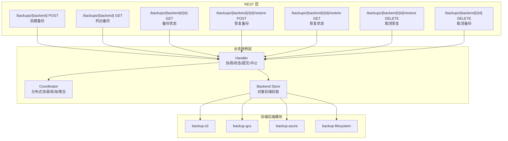
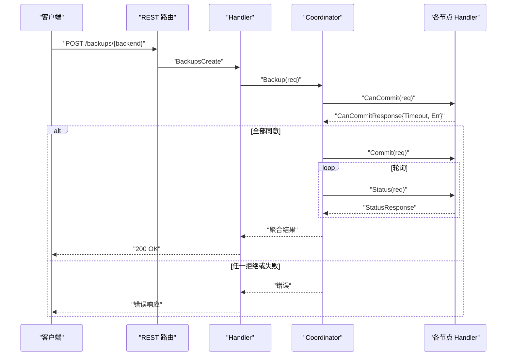
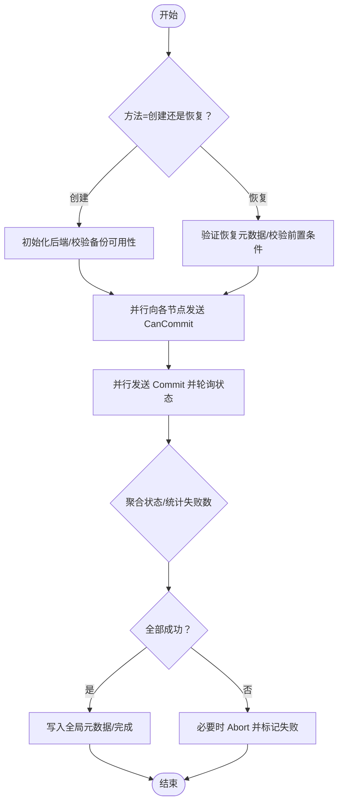
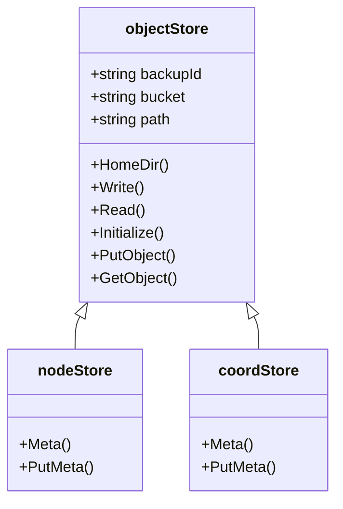
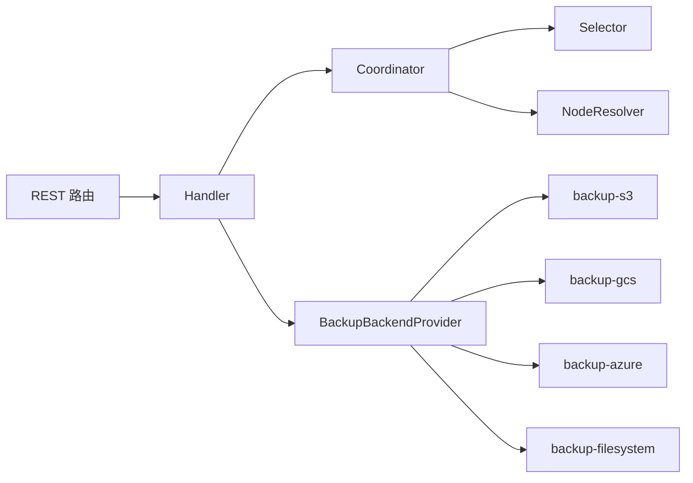

# 集群备份 API

<cite>
**本文引用的文件**
- [usecases/backup/handler.go](file://usecases/backup/handler.go)
- [usecases/backup/coordinator.go](file://usecases/backup/coordinator.go)
- [usecases/backup/backend.go](file://usecases/backup/backend.go)
- [client/backups/backups_client.go](file://client/backups/backups_client.go)
- [adapters/handlers/rest/operations/backups/backups_create.go](file://adapters/handlers/rest/operations/backups/backups_create.go)
- [adapters/handlers/rest/operations/backups/backups_list.go](file://adapters/handlers/rest/operations/backups/backups_list.go)
- [adapters/handlers/rest/operations/backups/backups_restore.go](file://adapters/handlers/rest/operations/backups/backups_restore.go)
- [adapters/handlers/rest/operations/backups/backups_restore_status.go](file://adapters/handlers/rest/operations/backups/backups_restore_status.go)
- [adapters/handlers/rest/operations/backups/backups_restore_cancel.go](file://adapters/handlers/rest/operations/backups/backups_restore_cancel.go)
- [adapters/handlers/rest/operations/backups/backups_cancel.go](file://adapters/handlers/rest/operations/backups/backups_cancel.go)
- [adapters/handlers/rest/operations/weaviate_api.go](file://adapters/handlers/rest/operations/weaviate_api.go)
- [entities/models/backup_create_request.go](file://entities/models/backup_create_request.go)
- [entities/models/backup_restore_request.go](file://entities/models/backup_restore_request.go)
- [entities/models/backup_config.go](file://entities/models/backup_config.go)
- [entities/models/restore_config.go](file://entities/models/restore_config.go)
- [modules/backup-s3/module.go](file://modules/backup-s3/module.go)
- [modules/backup-gcs/module.go](file://modules/backup-gcs/module.go)
- [modules/backup-filesystem/module.go](file://modules/backup-filesystem/module.go)
- [modules/backup-azure/module.go](file://modules/backup-azure/module.go)
- [adapters/clients/client.go](file://adapters/clients/client.go)
</cite>

## 目录
1. [简介](#简介)
2. [项目结构](#项目结构)
3. [核心组件](#核心组件)
4. [架构总览](#架构总览)
5. [详细组件分析](#详细组件分析)
6. [依赖关系分析](#依赖关系分析)
7. [性能考量](#性能考量)
8. [故障排除指南](#故障排除指南)
9. [结论](#结论)
10. [附录](#附录)

## 简介
本文件为 Weaviate 集群备份 API 的权威接口文档，覆盖备份与恢复全流程：创建备份、查询备份状态、恢复备份、取消备份；详述备份策略（压缩、并发、分片）、备份存储后端配置、集群状态监控、进度跟踪、错误处理与重试机制、完整性校验与回滚策略，并提供最佳实践与性能优化建议。

## 项目结构
Weaviate 的备份能力由“REST 层”“业务用例层”“存储后端模块”三层构成：
- REST 层：定义并路由各备份相关 HTTP 接口（创建、列表、状态、恢复、取消）。
- 业务用例层：协调分布式备份/恢复（coordinator），执行备份/恢复（handler/backupper/restorer），封装对象存储读写（backend）。
- 存储后端模块：提供 S3、GCS、Azure、本地文件系统等后端实现。

图表来源
- [adapters/handlers/rest/operations/weaviate_api.go](file://adapters/handlers/rest/operations/weaviate_api.go#L1134-L1160)
- [usecases/backup/handler.go](file://usecases/backup/handler.go#L74-L109)
- [usecases/backup/coordinator.go](file://usecases/backup/coordinator.go#L93-L136)
- [usecases/backup/backend.go](file://usecases/backup/backend.go#L61-L92)
- [modules/backup-s3/module.go](file://modules/backup-s3/module.go#L25-L40)
- [modules/backup-gcs/module.go](file://modules/backup-gcs/module.go#L24-L37)
- [modules/backup-azure/module.go](file://modules/backup-azure/module.go#L24-L37)
- [modules/backup-filesystem/module.go](file://modules/backup-filesystem/module.go#L30-L34)

章节来源
- [adapters/handlers/rest/operations/weaviate_api.go](file://adapters/handlers/rest/operations/weaviate_api.go#L1134-L1160)
- [usecases/backup/handler.go](file://usecases/backup/handler.go#L74-L109)
- [usecases/backup/coordinator.go](file://usecases/backup/coordinator.go#L93-L136)
- [usecases/backup/backend.go](file://usecases/backup/backend.go#L61-L92)

## 核心组件
- Handler：接收 REST 请求，调用 backupper 或 restorer 执行备份/恢复，负责状态查询与提交/中止。
- Coordinator：在多节点集群上协调分布式备份/恢复，管理参与者状态、超时、重试、聚合结果。
- Backend Store：抽象对象存储访问（上传/下载/初始化/元数据），屏蔽具体后端差异。
- 各存储后端模块：S3/GCS/Azure/本地文件系统，提供初始化、路径拼接、列举等能力。

章节来源
- [usecases/backup/handler.go](file://usecases/backup/handler.go#L74-L109)
- [usecases/backup/coordinator.go](file://usecases/backup/coordinator.go#L93-L136)
- [usecases/backup/backend.go](file://usecases/backup/backend.go#L61-L92)
- [modules/backup-s3/module.go](file://modules/backup-s3/module.go#L70-L89)
- [modules/backup-gcs/module.go](file://modules/backup-gcs/module.go#L74-L94)
- [modules/backup-azure/module.go](file://modules/backup-azure/module.go#L74-L94)
- [modules/backup-filesystem/module.go](file://modules/backup-filesystem/module.go#L62-L73)

## 架构总览
备份/恢复流程分为“创建备份”和“恢复备份”两条主线，均通过 Handler 协调 Coordinator 完成分布式协作，并通过 Backend Store 访问后端存储。

图表来源
- [adapters/handlers/rest/operations/backups/backups_create.go](file://adapters/handlers/rest/operations/backups/backups_create.go#L45-L51)
- [usecases/backup/handler.go](file://usecases/backup/handler.go#L151-L207)
- [usecases/backup/coordinator.go](file://usecases/backup/coordinator.go#L472-L545)

## 详细组件分析

### REST 接口定义与行为
- 创建备份
  - 方法与路径：POST /backups/{backend}
  - 请求体：BackupCreateRequest（支持 include/exclude、id、config）
  - 响应：成功返回 200 OK
- 列出备份
  - 方法与路径：GET /backups/{backend}
  - 响应：返回所有备份的 ID 与状态
- 备份状态
  - 方法与路径：GET /backups/{backend}/{id}
  - 响应：返回备份的开始时间、完成时间、状态、错误信息、大小
- 恢复备份
  - 方法与路径：POST /backups/{backend}/{id}/restore
  - 请求体：BackupRestoreRequest（支持 include/exclude、node_mapping、overwriteAlias、config）
  - 响应：成功返回 200 OK
- 恢复状态
  - 方法与路径：GET /backups/{backend}/{id}/restore
  - 响应：返回恢复阶段、状态、错误信息
- 取消恢复
  - 方法与路径：DELETE /backups/{backend}/{id}/restore
  - 响应：成功返回 204 No Content
- 取消备份
  - 方法与路径：DELETE /backups/{backend}/{id}
  - 响应：成功返回 204 No Content

章节来源
- [adapters/handlers/rest/operations/backups/backups_create.go](file://adapters/handlers/rest/operations/backups/backups_create.go#L45-L51)
- [adapters/handlers/rest/operations/backups/backups_list.go](file://adapters/handlers/rest/operations/backups/backups_list.go#L46-L50)
- [adapters/handlers/rest/operations/backups/backups_restore.go](file://adapters/handlers/rest/operations/backups/backups_restore.go#L46-L50)
- [adapters/handlers/rest/operations/backups/backups_restore_status.go](file://adapters/handlers/rest/operations/backups/backups_restore_status.go#L46-L50)
- [adapters/handlers/rest/operations/backups/backups_restore_cancel.go](file://adapters/handlers/rest/operations/backups/backups_restore_cancel.go#L46-L50)
- [adapters/handlers/rest/operations/backups/backups_cancel.go](file://adapters/handlers/rest/operations/backups/backups_cancel.go#L46-L50)
- [adapters/handlers/rest/operations/weaviate_api.go](file://adapters/handlers/rest/operations/weaviate_api.go#L1134-L1160)

### 请求体模型与参数
- BackupCreateRequest
  - id：备份标识（仅允许小写字母、数字、下划线、连字符）
  - include/exclude：选择要包含/排除的集合
  - config：BackupConfig（可选）
- BackupRestoreRequest
  - include/exclude：选择要包含/排除的集合
  - node_mapping：节点名映射（用于跨环境恢复）
  - overwriteAlias：是否覆盖别名冲突
  - config：RestoreConfig（可选）
- BackupConfig / RestoreConfig
  - Bucket/Endpoint/Path：后端桶/端点/路径
  - CPUPercentage：CPU 使用百分比（1%-80%）
  - CompressionLevel：压缩等级（含 zstd 选项）

章节来源
- [entities/models/backup_create_request.go](file://entities/models/backup_create_request.go#L27-L43)
- [entities/models/backup_restore_request.go](file://entities/models/backup_restore_request.go#L27-L46)
- [entities/models/backup_config.go](file://entities/models/backup_config.go#L29-L54)
- [entities/models/restore_config.go](file://entities/models/restore_config.go#L29-L55)

### Handler 与 Coordinator 工作流
- Handler.OnCanCommit：根据方法（create/restore）决定初始化后端、校验备份可用性、执行备份或验证恢复元数据并触发恢复。
- Handler.OnCommit/OnAbort：分别在协调器确认/中止时执行提交或清理。
- Handler.OnStatus：查询当前备份/恢复状态。
- Coordinator.Backup/Restore：分组按节点发送 CanCommit，收集 CanCommitResponse；随后 Commit 并轮询 Status，聚合结果；对失败节点进行重试或标记失败；最终写入全局元数据。

图表来源
- [usecases/backup/handler.go](file://usecases/backup/handler.go#L151-L207)
- [usecases/backup/coordinator.go](file://usecases/backup/coordinator.go#L162-L234)
- [usecases/backup/coordinator.go](file://usecases/backup/coordinator.go#L237-L378)
- [usecases/backup/coordinator.go](file://usecases/backup/coordinator.go#L472-L545)
- [usecases/backup/coordinator.go](file://usecases/backup/coordinator.go#L548-L784)

章节来源
- [usecases/backup/handler.go](file://usecases/backup/handler.go#L151-L264)
- [usecases/backup/coordinator.go](file://usecases/backup/coordinator.go#L162-L234)
- [usecases/backup/coordinator.go](file://usecases/backup/coordinator.go#L237-L378)
- [usecases/backup/coordinator.go](file://usecases/backup/coordinator.go#L472-L784)

### 对象存储与分块传输
- Backend Store 封装了后端的 Initialize、PutObject/GetObject、Write/Read、HomeDir 等能力。
- 备份时按分片/分块压缩打包，使用并发写入后端；恢复时按类/分块解压并落盘。
- 支持压缩级别与 CPU 百分比配置，以平衡吞吐与资源占用。

图表来源
- [usecases/backup/backend.go](file://usecases/backup/backend.go#L61-L92)
- [usecases/backup/backend.go](file://usecases/backup/backend.go#L120-L172)

章节来源
- [usecases/backup/backend.go](file://usecases/backup/backend.go#L61-L172)

### 存储后端配置
- S3：环境变量 BACKUP_S3_ENDPOINT、BACKUP_S3_BUCKET、BACKUP_S3_USE_SSL、BACKUP_S3_PATH
- GCS：环境变量 BACKUP_GCS_BUCKET、BACKUP_GCS_PATH
- Azure：环境变量 BACKUP_AZURE_CONTAINER、BACKUP_AZURE_PATH
- 文件系统：环境变量 BACKUP_FILESYSTEM_PATH

章节来源
- [modules/backup-s3/module.go](file://modules/backup-s3/module.go#L25-L40)
- [modules/backup-gcs/module.go](file://modules/backup-gcs/module.go#L24-L37)
- [modules/backup-azure/module.go](file://modules/backup-azure/module.go#L24-L37)
- [modules/backup-filesystem/module.go](file://modules/backup-filesystem/module.go#L30-L34)

### 并发与超时控制
- 并发连接上限：_MaxNumberConns
- 超时设置：
  - CanCommit：_TimeoutCanCommit
  - 查询状态：_TimeoutQueryStatus
  - 下一轮轮询间隔：_NextRoundPeriod
  - 节点失联判定：_TimeoutNodeDown
- 提交阶段采用指数退避与最大尝试次数控制重试。

章节来源
- [usecases/backup/coordinator.go](file://usecases/backup/coordinator.go#L48-L56)
- [usecases/backup/coordinator.go](file://usecases/backup/coordinator.go#L548-L784)
- [adapters/clients/client.go](file://adapters/clients/client.go#L93-L129)

### 增量备份与版本兼容
- 备份版本：2.1 支持压缩；1.0 不压缩。
- 元数据文件：节点侧 backup.json，协调器侧 backup_config.json/restore_config.json。
- 跨版本兼容：读取旧版 backup.json 并转换为分布式描述。

章节来源
- [usecases/backup/handler.go](file://usecases/backup/handler.go#L29-L38)
- [usecases/backup/backend.go](file://usecases/backup/backend.go#L128-L172)

### 完整性校验与恢复验证
- 备份完成后写入元数据，记录预压缩字节数与状态。
- 恢复前验证目标集群节点数量、集合不存在、节点名匹配等前置条件。
- 恢复阶段分为“准备/下载/最终化/模式应用”，每个阶段有指标观测。

章节来源
- [usecases/backup/backend.go](file://usecases/backup/backend.go#L208-L311)
- [usecases/backup/coordinator.go](file://usecases/backup/coordinator.go#L237-L378)
- [usecases/backup/coordinator.go](file://usecases/backup/coordinator.go#L380-L386)

### 回滚策略
- 恢复过程中若检测到外部取消（存储中标记 CANCELLING/CANCELLED）或内部取消，将标记为 Cancelled 并停止后续阶段。
- 失败状态下不自动回滚，需用户重新发起恢复或删除目标集合后重试。

章节来源
- [usecases/backup/coordinator.go](file://usecases/backup/coordinator.go#L294-L328)
- [usecases/backup/coordinator.go](file://usecases/backup/coordinator.go#L560-L604)

## 依赖关系分析
- REST 路由注册与 Handler 绑定。
- Handler 依赖 Coordinator、BackupBackendProvider、Schema 管理、RBAC/Dynamic User 快照源。
- Coordinator 依赖 Selector（类到节点分组）、NodeResolver（节点主机解析）、BackupBackendProvider。
- Backend Store 依赖具体后端模块（S3/GCS/Azure/FileSystem）。

图表来源
- [adapters/handlers/rest/operations/weaviate_api.go](file://adapters/handlers/rest/operations/weaviate_api.go#L1134-L1160)
- [usecases/backup/handler.go](file://usecases/backup/handler.go#L84-L109)
- [usecases/backup/coordinator.go](file://usecases/backup/coordinator.go#L114-L136)
- [modules/backup-s3/module.go](file://modules/backup-s3/module.go#L70-L89)
- [modules/backup-gcs/module.go](file://modules/backup-gcs/module.go#L74-L94)
- [modules/backup-azure/module.go](file://modules/backup-azure/module.go#L74-L94)
- [modules/backup-filesystem/module.go](file://modules/backup-filesystem/module.go#L62-L73)

章节来源
- [adapters/handlers/rest/operations/weaviate_api.go](file://adapters/handlers/rest/operations/weaviate_api.go#L1134-L1160)
- [usecases/backup/handler.go](file://usecases/backup/handler.go#L84-L109)
- [usecases/backup/coordinator.go](file://usecases/backup/coordinator.go#L114-L136)

## 性能考量
- 压缩与 CPU 百分比：通过 BackupConfig/RestoreConfig 的 CPUPercentage 控制并发写入/解压的 CPU 占用，范围 1%-80%。
- 分块与并发：按分片/分块压缩并行上传/下载，提升吞吐；并发连接数受_maxNumberConns限制。
- 超时与退避：合理设置 CanCommit/QueryStatus/NextRound 超时，避免长时间阻塞；提交阶段使用指数退避与最大尝试次数。
- 存储带宽：优先使用就近地域的后端，减少网络抖动；S3/GCS/Azure 建议开启 SSL 与合适的 Endpoint。

章节来源
- [entities/models/backup_config.go](file://entities/models/backup_config.go#L37-L54)
- [entities/models/restore_config.go](file://entities/models/restore_config.go#L37-L55)
- [usecases/backup/backend.go](file://usecases/backup/backend.go#L38-L48)
- [usecases/backup/coordinator.go](file://usecases/backup/coordinator.go#L48-L56)
- [usecases/backup/coordinator.go](file://usecases/backup/coordinator.go#L548-L784)

## 故障排除指南
- 常见错误
  - 未知操作：当 Method 非 create/restore 时返回错误。
  - 节点拒绝参与：CanCommit 返回 Err 或 Timeout 为 0。
  - 元数据未找到：读取全局/节点元数据失败。
  - 节点可能离线：超过 _TimeoutNodeDown 未响应则标记失败。
- 重试与取消
  - Handler 内部使用指数退避重试；提交阶段失败会触发 Abort。
  - 用户可通过取消接口终止备份/恢复；协调器会检查存储中的 CANCELLING/CANCELLED 状态。
- 日志与指标
  - Coordinator 观测恢复阶段耗时；上传/下载阶段有 Prometheus 指标。

章节来源
- [usecases/backup/handler.go](file://usecases/backup/handler.go#L209-L232)
- [usecases/backup/coordinator.go](file://usecases/backup/coordinator.go#L441-L468)
- [usecases/backup/coordinator.go](file://usecases/backup/coordinator.go#L560-L604)
- [usecases/backup/coordinator.go](file://usecases/backup/coordinator.go#L380-L386)
- [adapters/clients/client.go](file://adapters/clients/client.go#L93-L129)

## 结论
Weaviate 集群备份 API 通过 REST 接口与业务用例层协同，实现了跨节点的分布式备份/恢复能力。其具备完善的并发控制、超时与重试机制、多后端支持、状态可观测与元数据持久化，满足生产环境对可靠性与性能的要求。建议在生产中结合后端带宽与 CPU 配置，合理设置压缩与并发参数，并建立定期校验与回滚演练流程。

## 附录

### 接口一览表
- 创建备份
  - 方法：POST
  - 路径：/backups/{backend}
  - 请求体：BackupCreateRequest
  - 响应：200 OK
- 列出备份
  - 方法：GET
  - 路径：/backups/{backend}
  - 响应：备份列表（ID、状态）
- 备份状态
  - 方法：GET
  - 路径：/backups/{backend}/{id}
  - 响应：状态详情（开始/完成时间、状态、错误、大小）
- 恢复备份
  - 方法：POST
  - 路径：/backups/{backend}/{id}/restore
  - 请求体：BackupRestoreRequest
  - 响应：200 OK
- 恢复状态
  - 方法：GET
  - 路径：/backups/{backend}/{id}/restore
  - 响应：恢复状态详情
- 取消恢复
  - 方法：DELETE
  - 路径：/backups/{backend}/{id}/restore
  - 响应：204 No Content
- 取消备份
  - 方法：DELETE
  - 路径：/backups/{backend}/{id}
  - 响应：204 No Content

章节来源
- [adapters/handlers/rest/operations/backups/backups_create.go](file://adapters/handlers/rest/operations/backups/backups_create.go#L45-L51)
- [adapters/handlers/rest/operations/backups/backups_list.go](file://adapters/handlers/rest/operations/backups/backups_list.go#L46-L50)
- [adapters/handlers/rest/operations/backups/backups_restore.go](file://adapters/handlers/rest/operations/backups/backups_restore.go#L46-L50)
- [adapters/handlers/rest/operations/backups/backups_restore_status.go](file://adapters/handlers/rest/operations/backups/backups_restore_status.go#L46-L50)
- [adapters/handlers/rest/operations/backups/backups_restore_cancel.go](file://adapters/handlers/rest/operations/backups/backups_restore_cancel.go#L46-L50)
- [adapters/handlers/rest/operations/backups/backups_cancel.go](file://adapters/handlers/rest/operations/backups/backups_cancel.go#L46-L50)
- [adapters/handlers/rest/operations/weaviate_api.go](file://adapters/handlers/rest/operations/weaviate_api.go#L1134-L1160)

### 客户端库集成要点
- Client 生成的 Go 客户端已内置各端点的请求构造与响应读取。
- 建议在高延迟网络场景启用指数退避与合理的超时设置。

章节来源
- [client/backups/backups_client.go](file://client/backups/backups_client.go#L107-L141)
- [client/backups/backups_client.go](file://client/backups/backups_client.go#L230-L264)
- [adapters/clients/client.go](file://adapters/clients/client.go#L93-L129)