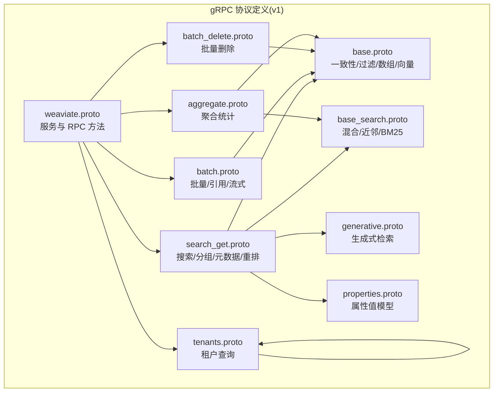
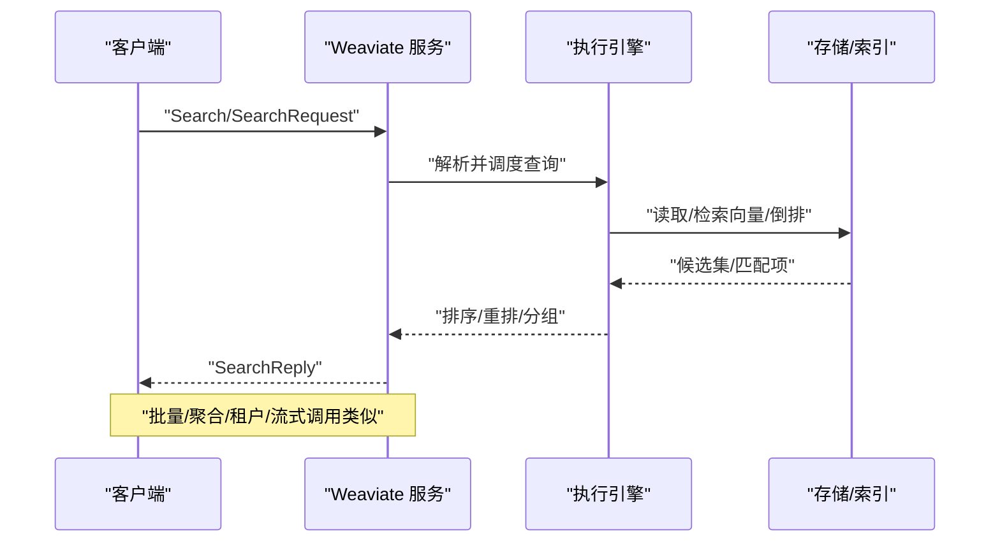
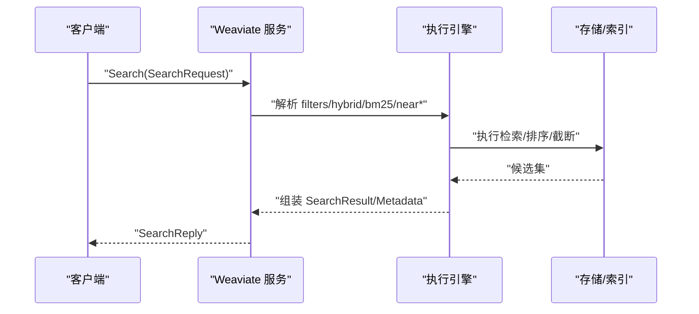
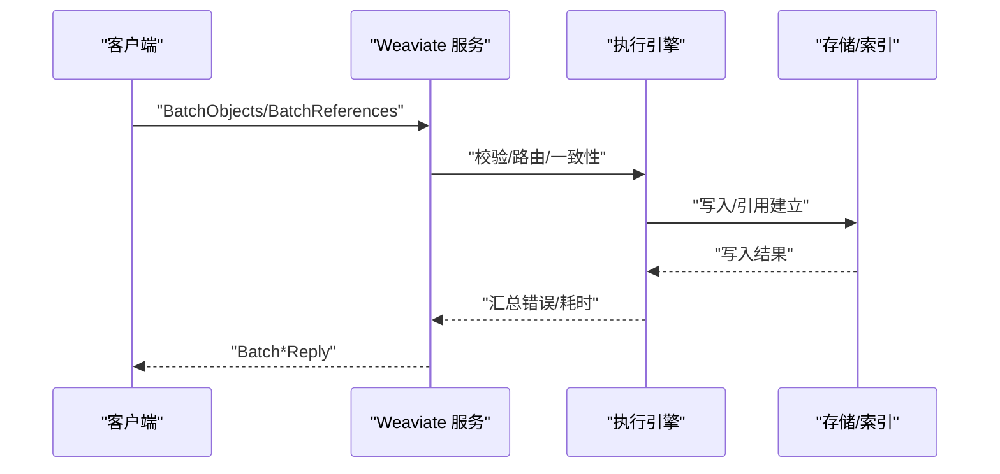
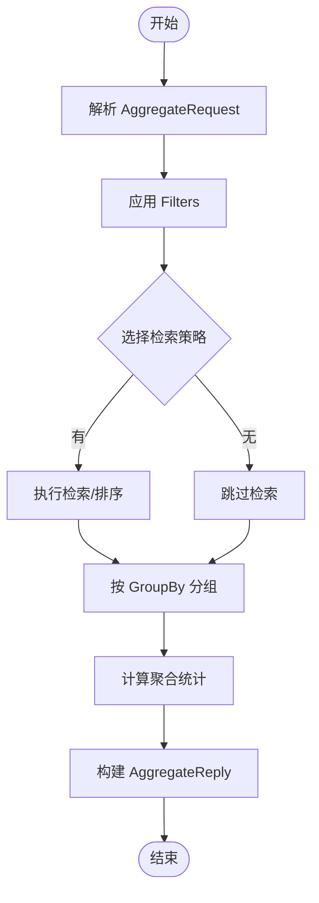
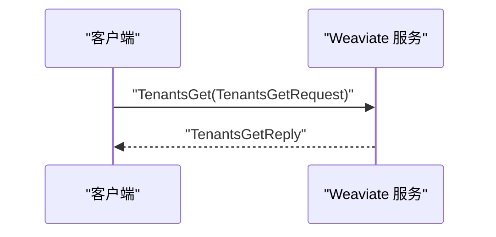
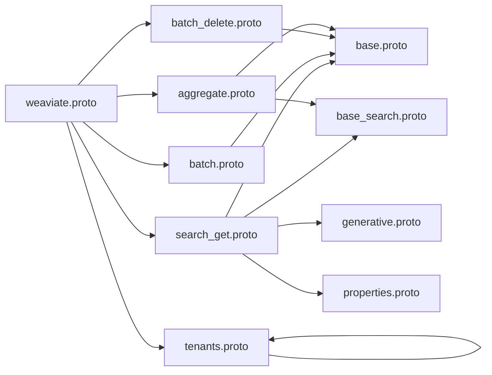
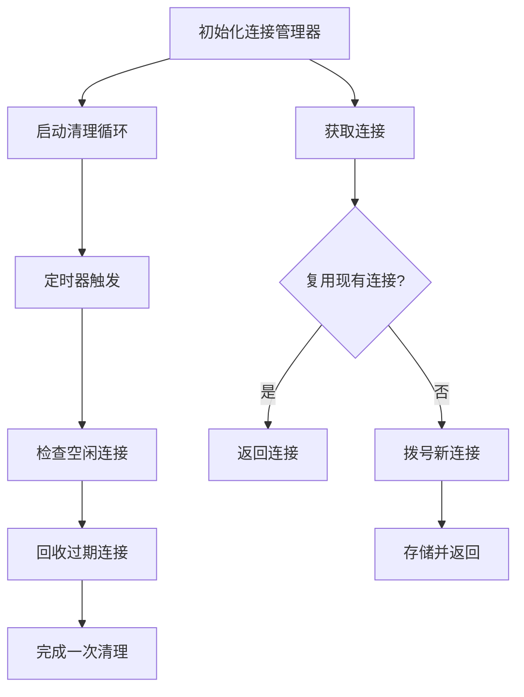

# gRPC API

<cite>
**本文引用的文件**
- [grpc/proto/v1/weaviate.proto](file://grpc/proto/v1/weaviate.proto)
- [grpc/proto/v1/search_get.proto](file://grpc/proto/v1/search_get.proto)
- [grpc/proto/v1/batch.proto](file://grpc/proto/v1/batch.proto)
- [grpc/proto/v1/batch_delete.proto](file://grpc/proto/v1/batch_delete.proto)
- [grpc/proto/v1/aggregate.proto](file://grpc/proto/v1/aggregate.proto)
- [grpc/proto/v1/tenants.proto](file://grpc/proto/v1/tenants.proto)
- [grpc/proto/v1/base.proto](file://grpc/proto/v1/base.proto)
- [grpc/proto/v1/base_search.proto](file://grpc/proto/v1/base_search.proto)
- [grpc/proto/v1/generative.proto](file://grpc/proto/v1/generative.proto)
- [grpc/proto/v1/properties.proto](file://grpc/proto/v1/properties.proto)
- [grpc/conn/manager.go](file://grpc/conn/manager.go)
</cite>

## 目录
1. [简介](#简介)
2. [项目结构](#项目结构)
3. [核心组件](#核心组件)
4. [架构总览](#架构总览)
5. [详细组件分析](#详细组件分析)
6. [依赖关系分析](#依赖关系分析)
7. [性能考虑](#性能考虑)
8. [故障排查指南](#故障排查指南)
9. [结论](#结论)
10. [附录](#附录)

## 简介
本文件为 Weaviate 的 gRPC API 技术参考与集成指南，覆盖服务定义、消息类型、字段约束与验证规则，以及搜索、批量、聚合、向量检索、租户管理等关键能力。文档同时解释 gRPC 特性（如流式传输、双向流、超时控制）与连接管理、负载均衡、故障转移等高级主题，并提供性能优化策略、多语言客户端使用建议、错误码与异常处理机制、监控与调试方法。

## 项目结构
Weaviate 的 gRPC API 定义位于 grpc/proto/v1 目录，采用按版本与功能域分层组织：
- 根服务：weaviate.proto 定义 Weaviate 服务及 RPC 方法
- 功能模块：search_get.proto（搜索）、batch.proto（批量对象/引用/流式）、batch_delete.proto（批量删除）、aggregate.proto（聚合）、tenants.proto（租户）
- 基础类型：base.proto（一致性级别、数组属性、过滤器、向量等）、base_search.proto（混合检索、近邻检索、BM25 等）、generative.proto（生成式检索与提供商配置）、properties.proto（属性值模型）

图表来源
- [grpc/proto/v1/weaviate.proto](file://grpc/proto/v1/weaviate.proto#L1-L24)
- [grpc/proto/v1/search_get.proto](file://grpc/proto/v1/search_get.proto#L1-L189)
- [grpc/proto/v1/batch.proto](file://grpc/proto/v1/batch.proto#L1-L157)
- [grpc/proto/v1/batch_delete.proto](file://grpc/proto/v1/batch_delete.proto#L1-L33)
- [grpc/proto/v1/aggregate.proto](file://grpc/proto/v1/aggregate.proto#L1-L206)
- [grpc/proto/v1/tenants.proto](file://grpc/proto/v1/tenants.proto#L1-L48)
- [grpc/proto/v1/base.proto](file://grpc/proto/v1/base.proto#L1-L157)
- [grpc/proto/v1/base_search.proto](file://grpc/proto/v1/base_search.proto#L1-L166)
- [grpc/proto/v1/generative.proto](file://grpc/proto/v1/generative.proto#L1-L368)
- [grpc/proto/v1/properties.proto](file://grpc/proto/v1/properties.proto#L1-L95)

章节来源
- [grpc/proto/v1/weaviate.proto](file://grpc/proto/v1/weaviate.proto#L1-L24)

## 核心组件
- Weaviate 服务：提供 Search、BatchObjects、BatchReferences、BatchDelete、TenantsGet、Aggregate、BatchStream 等 RPC
- 搜索组件：SearchRequest/SearchReply 支持过滤、混合检索、近邻检索、BM25、分组、元数据、重排与生成式结果
- 批量组件：BatchObjects/BatchReferences/BatchDelete 提供高吞吐写入与删除；BatchStream 支持流式批量
- 聚合组件：AggregateRequest/AggregateReply 支持按属性或分组聚合统计
- 租户组件：TenantsGetRequest/TenantsGetReply 支持租户列表与活动状态查询
- 基础类型：ConsistencyLevel、Filters、Vectors、Near*、Hybrid、Targets 等

章节来源
- [grpc/proto/v1/weaviate.proto](file://grpc/proto/v1/weaviate.proto#L15-L23)
- [grpc/proto/v1/search_get.proto](file://grpc/proto/v1/search_get.proto#L14-L55)
- [grpc/proto/v1/batch.proto](file://grpc/proto/v1/batch.proto#L12-L89)
- [grpc/proto/v1/batch_delete.proto](file://grpc/proto/v1/batch_delete.proto#L11-L33)
- [grpc/proto/v1/aggregate.proto](file://grpc/proto/v1/aggregate.proto#L12-L103)
- [grpc/proto/v1/tenants.proto](file://grpc/proto/v1/tenants.proto#L26-L48)
- [grpc/proto/v1/base.proto](file://grpc/proto/v1/base.proto#L10-L157)
- [grpc/proto/v1/base_search.proto](file://grpc/proto/v1/base_search.proto#L11-L166)
- [grpc/proto/v1/generative.proto](file://grpc/proto/v1/generative.proto#L11-L368)
- [grpc/proto/v1/properties.proto](file://grpc/proto/v1/properties.proto#L11-L95)

## 架构总览
Weaviate gRPC 服务通过统一入口 Weaviate 服务暴露多种能力，客户端可按需选择同步或流式调用。基础类型在多个模块复用，确保协议一致性与扩展性。

图表来源
- [grpc/proto/v1/weaviate.proto](file://grpc/proto/v1/weaviate.proto#L15-L23)
- [grpc/proto/v1/search_get.proto](file://grpc/proto/v1/search_get.proto#L14-L55)
- [grpc/proto/v1/batch.proto](file://grpc/proto/v1/batch.proto#L12-L89)
- [grpc/proto/v1/batch_delete.proto](file://grpc/proto/v1/batch_delete.proto#L11-L33)
- [grpc/proto/v1/aggregate.proto](file://grpc/proto/v1/aggregate.proto#L12-L103)
- [grpc/proto/v1/tenants.proto](file://grpc/proto/v1/tenants.proto#L26-L48)

## 详细组件分析

### Weaviate 服务与 RPC 方法
- Search：全文/向量混合检索、近邻检索、BM25、分组、元数据、重排、生成式结果
- BatchObjects：批量创建对象，支持一致性级别
- BatchReferences：批量创建引用，支持一致性级别
- BatchDelete：基于过滤条件的批量删除，支持一致性级别与干跑/详细模式
- TenantsGet：租户列表查询，支持指定租户名
- Aggregate：按属性或分组进行聚合统计
- BatchStream：流式批量，支持 Start/Data/Stop 三类消息与回压通知

章节来源
- [grpc/proto/v1/weaviate.proto](file://grpc/proto/v1/weaviate.proto#L15-L23)

### 搜索组件（SearchRequest/SearchReply）
- 请求参数
  - collection：必填
  - tenant、consistency_level：可选
  - properties/metadata：返回字段控制
  - limit/offset/autocut/after/sort_by：结果控制
  - filters：过滤条件树
  - hybrid_search/bm25_search/near_*：检索策略
  - generative/rerank：生成式与重排
- 响应
  - took：耗时
  - results：匹配结果集合
  - group_by_results：分组结果
  - generative_grouped_results：分组生成式结果

图表来源
- [grpc/proto/v1/search_get.proto](file://grpc/proto/v1/search_get.proto#L14-L119)
- [grpc/proto/v1/base_search.proto](file://grpc/proto/v1/base_search.proto#L48-L166)
- [grpc/proto/v1/generative.proto](file://grpc/proto/v1/generative.proto#L11-L368)

章节来源
- [grpc/proto/v1/search_get.proto](file://grpc/proto/v1/search_get.proto#L14-L189)

### 批量组件（BatchObjects/BatchReferences/BatchDelete/BatchStream）
- BatchObjectsRequest
  - objects：批量对象列表
  - consistency_level：一致性级别
  - 对象属性：uuid、vector/vector_bytes、properties、collection、tenant、vectors
- BatchReferencesRequest
  - references：批量引用列表
  - consistency_level：一致性级别
- BatchDeleteRequest
  - collection/filters/verbose/dry_run/consistency_level/tenant
- BatchStream
  - Start/Stop/Data（Objects/References）
  - 回压/内存压力通知：Backoff/OutOfMemory
  - 结果确认：Acks/Results（Errors/Successes）

图表来源
- [grpc/proto/v1/batch.proto](file://grpc/proto/v1/batch.proto#L12-L157)
- [grpc/proto/v1/batch_delete.proto](file://grpc/proto/v1/batch_delete.proto#L11-L33)

章节来源
- [grpc/proto/v1/batch.proto](file://grpc/proto/v1/batch.proto#L12-L157)
- [grpc/proto/v1/batch_delete.proto](file://grpc/proto/v1/batch_delete.proto#L11-L33)

### 聚合组件（AggregateRequest/AggregateReply）
- 聚合类型：整型、数值、文本、布尔、日期、引用
- 分组：GroupBy（按属性分组）
- 过滤与检索：filters/search（hybrid/near_vector/near_object/near_text 等）
- 返回：single_result/grouped_results，包含各属性统计与对象计数

图表来源
- [grpc/proto/v1/aggregate.proto](file://grpc/proto/v1/aggregate.proto#L12-L206)
- [grpc/proto/v1/base_search.proto](file://grpc/proto/v1/base_search.proto#L48-L166)

章节来源
- [grpc/proto/v1/aggregate.proto](file://grpc/proto/v1/aggregate.proto#L12-L206)

### 租户组件（TenantsGet）
- TenantsGetRequest：collection 必填，params 可选（TenantNames）
- TenantsGetReply：took + tenants（name + activity_status）

图表来源
- [grpc/proto/v1/tenants.proto](file://grpc/proto/v1/tenants.proto#L26-L48)

章节来源
- [grpc/proto/v1/tenants.proto](file://grpc/proto/v1/tenants.proto#L26-L48)

### 基础类型与验证规则
- ConsistencyLevel：ONE/QUORUM/ALL 等
- Filters：支持等值、比较、逻辑组合、地理范围、包含/不包含、LIKE、IS NULL 等
- Vectors：支持单/多向量，使用 vector_bytes 存储二进制向量
- 数组属性：NumberArrayProperties/IntArrayProperties/TextArrayProperties/BooleanArrayProperties/ObjectProperties/ObjectArrayProperties，支持空列表与字节数组编码
- 属性值模型：Properties/Value/ListValue，支持数值、布尔、对象、列表、日期、UUID、GeoCoordinate、PhoneNumber、Null 等

章节来源
- [grpc/proto/v1/base.proto](file://grpc/proto/v1/base.proto#L10-L157)
- [grpc/proto/v1/properties.proto](file://grpc/proto/v1/properties.proto#L11-L95)

### 检索与生成式（Hybrid/Near*/BM25 与 Generative）
- Hybrid：融合文本检索与向量检索，支持相对分数/排序融合、BM25 操作符、目标向量与权重
- NearVector/NearObject/NearTextSearch/NearImageSearch/NearAudioSearch/NearVideoSearch/NearDepthSearch/NearThermalSearch/NearIMUSearch：支持 certainty/distance、targets、vector_for_targets、vectors
- GenerativeSearch：支持单组提示与分组任务，内含多家提供商配置与调试开关

章节来源
- [grpc/proto/v1/base_search.proto](file://grpc/proto/v1/base_search.proto#L48-L166)
- [grpc/proto/v1/generative.proto](file://grpc/proto/v1/generative.proto#L11-L368)

## 依赖关系分析
- weaviate.proto 作为聚合入口，导入各子模块 proto
- search_get.proto 依赖 base.proto、base_search.proto、generative.proto、properties.proto
- batch/aggregate/tenants 均依赖 base.proto
- base_search 依赖 base.proto
- generative 依赖 base.proto
- properties 依赖 google.protobuf.struct

图表来源
- [grpc/proto/v1/weaviate.proto](file://grpc/proto/v1/weaviate.proto#L5-L10)
- [grpc/proto/v1/search_get.proto](file://grpc/proto/v1/search_get.proto#L5-L9)
- [grpc/proto/v1/batch.proto](file://grpc/proto/v1/batch.proto#L5-L7)
- [grpc/proto/v1/batch_delete.proto](file://grpc/proto/v1/batch_delete.proto#L5)
- [grpc/proto/v1/aggregate.proto](file://grpc/proto/v1/aggregate.proto#L5-L6)
- [grpc/proto/v1/tenants.proto](file://grpc/proto/v1/tenants.proto#L1-L48)
- [grpc/proto/v1/base.proto](file://grpc/proto/v1/base.proto#L4)
- [grpc/proto/v1/base_search.proto](file://grpc/proto/v1/base_search.proto#L5)
- [grpc/proto/v1/generative.proto](file://grpc/proto/v1/generative.proto#L5)
- [grpc/proto/v1/properties.proto](file://grpc/proto/v1/properties.proto#L5)

## 性能考虑
- 向量存储与传输
  - 使用 vector_bytes 存储二进制向量，减少序列化开销
  - 多向量场景使用 Vectors 列表，避免重复字段
- 批量与流式
  - 批量写入优先使用 BatchObjects/BatchReferences
  - 流式批量 BatchStream 支持 Start/Data/Stop，配合 Backoff/OutOfMemory 实现背压
- 过滤与检索
  - 合理使用 Filters 与 near_* 参数，避免全表扫描
  - Hybrid 中合理设置 alpha 与融合方式，平衡文本与向量贡献
- 元数据与属性
  - 仅请求必要 metadata/properties，降低网络与解析成本
- 连接与会话
  - 使用连接管理器（见下节）控制最大连接数、空闲清理与超时
- 并发与一致性
  - 通过 consistency_level 控制写入一致性，权衡延迟与可靠性

[本节为通用性能指导，无需列出具体文件来源]

## 故障排查指南
- 连接问题
  - 检查地址可达性与认证头（BasicAuth）
  - 使用连接管理器的超时与清理机制，避免连接泄漏
- 写入失败
  - 关注 Batch*Reply 中的错误索引与错误信息
  - 在 BatchStream 中留意 OutOfMemory/Backoff 消息，调整批量大小
- 查询异常
  - 检查 Filters 语法与字段类型是否匹配
  - 验证向量维度与编码格式（vector_bytes）
- 聚合异常
  - 确认聚合属性类型与 GroupBy 配置
- 生成式结果
  - 检查提供商配置与调试开关，关注元数据中的用量统计

章节来源
- [grpc/conn/manager.go](file://grpc/conn/manager.go#L336-L385)
- [grpc/proto/v1/batch.proto](file://grpc/proto/v1/batch.proto#L63-L89)

## 结论
Weaviate 的 gRPC API 以清晰的服务边界与强大的基础类型支撑，覆盖从检索、批量、聚合到生成式与租户管理的完整场景。通过合理的连接管理、批量策略与向量编码，可在保证一致性的同时实现高吞吐与低延迟。建议在生产环境结合监控指标与日志进行持续优化与故障定位。

[本节为总结性内容，无需列出具体文件来源]

## 附录

### gRPC 方法与消息概览
- Search
  - 请求：SearchRequest（collection/tenant/consistency_level/properties/metadata/limit/offset/autocut/after/sort_by/filters/hybrid/bm25/near*/generative/rerank）
  - 响应：SearchReply（took/results/group_by_results/generative_grouped_results）
- BatchObjects
  - 请求：BatchObjectsRequest（objects/consistency_level）
  - 响应：BatchObjectsReply（took/errors）
- BatchReferences
  - 请求：BatchReferencesRequest（references/consistency_level）
  - 响应：BatchReferencesReply（took/errors）
- BatchDelete
  - 请求：BatchDeleteRequest（collection/filters/verbose/dry_run/consistency_level/tenant）
  - 响应：BatchDeleteReply（took/failed/matches/successful/objects）
- TenantsGet
  - 请求：TenantsGetRequest（collection/params(names)）
  - 响应：TenantsGetReply（took/tenants）
- Aggregate
  - 请求：AggregateRequest（collection/tenant/objects_count/aggregations/object_limit/group_by/limit/filters/search）
  - 响应：AggregateReply（took/result(single_result/grouped_results)）
- BatchStream
  - 请求流：BatchStreamRequest（Start/Data(objects/references)/Stop）
  - 响应流：BatchStreamReply（Started/ShuttingDown/Shutdown/Backoff/Acks/Results/OutOfMemory）

章节来源
- [grpc/proto/v1/weaviate.proto](file://grpc/proto/v1/weaviate.proto#L15-L23)
- [grpc/proto/v1/search_get.proto](file://grpc/proto/v1/search_get.proto#L14-L119)
- [grpc/proto/v1/batch.proto](file://grpc/proto/v1/batch.proto#L12-L157)
- [grpc/proto/v1/batch_delete.proto](file://grpc/proto/v1/batch_delete.proto#L11-L33)
- [grpc/proto/v1/aggregate.proto](file://grpc/proto/v1/aggregate.proto#L12-L206)
- [grpc/proto/v1/tenants.proto](file://grpc/proto/v1/tenants.proto#L26-L48)

### gRPC 特性与高级主题
- 流式传输与双向流
  - BatchStream 为双向流，支持 Start/Data/Stop 与回压通知
- 超时控制
  - 连接管理器支持超时清理与空闲回收
- 认证与拦截器
  - 提供 BasicAuth 头构造与 Unary/Stream 拦截器
- 负载均衡与故障转移
  - 建议在客户端侧结合 gRPC 负载均衡策略与重试机制

章节来源
- [grpc/proto/v1/batch.proto](file://grpc/proto/v1/batch.proto#L22-L89)
- [grpc/conn/manager.go](file://grpc/conn/manager.go#L336-L385)

### 连接管理与资源控制
- 连接池与并发
  - 最大连接数限制、空闲超时、清理循环
- 资源回收
  - 按最久未使用策略回收旧连接，避免内存泄漏
- 关闭流程
  - 原子关闭标志、后台清理协程、优雅关闭所有连接

图表来源
- [grpc/conn/manager.go](file://grpc/conn/manager.go#L289-L300)
- [grpc/conn/manager.go](file://grpc/conn/manager.go#L104-L170)

章节来源
- [grpc/conn/manager.go](file://grpc/conn/manager.go#L56-L334)

### 多语言客户端使用要点（建议）
- Go
  - 使用官方生成的 gRPC 客户端 stub，设置超时与拦截器，复用连接
- Python
  - 使用 grpcio，注意向量字段使用 bytes 类型，合理设置 channel_options
- Java
  - 使用 Protobuf 和 grpc-java，注意向量编码与异步调用
- 通用
  - 统一使用 vector_bytes 传递向量
  - 批量/流式场景下实现背压与重试策略

[本节为通用实践建议，无需列出具体文件来源]

### 错误码与异常处理机制
- gRPC 状态码
  - 语义化错误：InvalidArgument、NotFound、AlreadyExists、DeadlineExceeded、ResourceExhausted、Unavailable 等
- Weaviate 特定错误
  - 批量写入错误包含索引与错误详情
  - 流式批量中 OutOfMemory/Backoff 用于指示系统压力
- 建议
  - 区分可重试与不可重试错误
  - 对 ResourceExhausted 实施指数退避与限流

[本节为通用指导，无需列出具体文件来源]

### 监控、日志与调试
- 连接管理指标
  - 连接创建/复用/关闭/驱逐/打开数量等
- 日志
  - 记录拨号失败、清理失败、认证头设置等关键事件
- 调试
  - 启用 BasicAuth 调试输出与生成式提供商调试开关

章节来源
- [grpc/conn/manager.go](file://grpc/conn/manager.go#L31-L49)