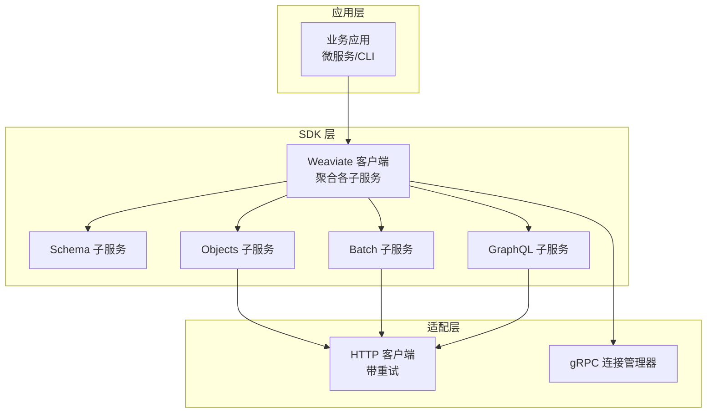
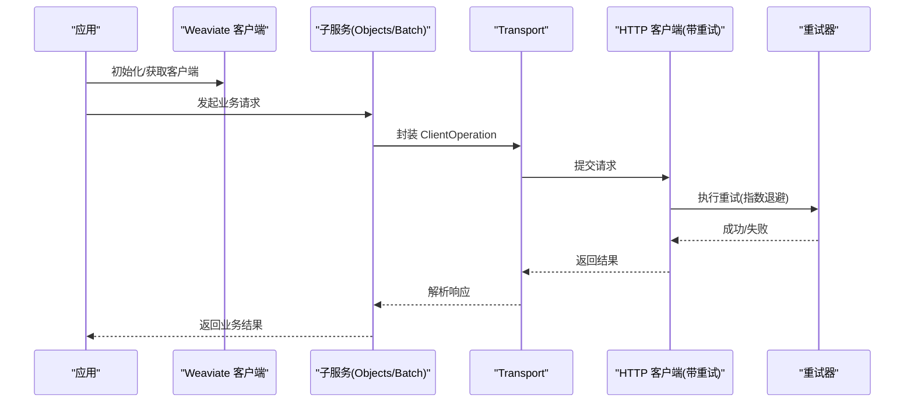
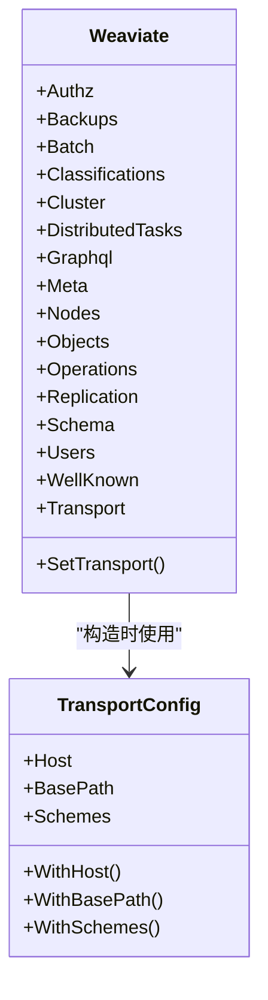
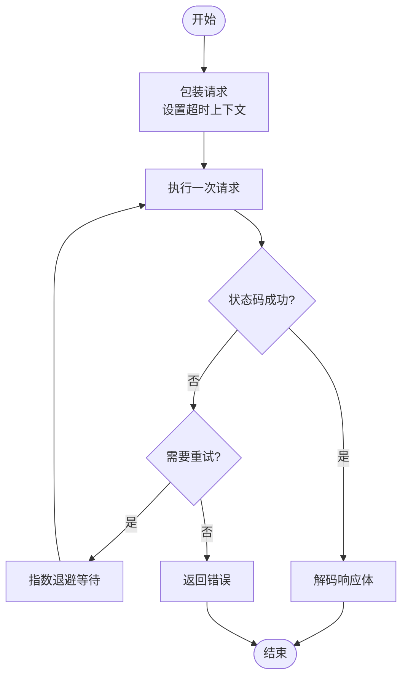
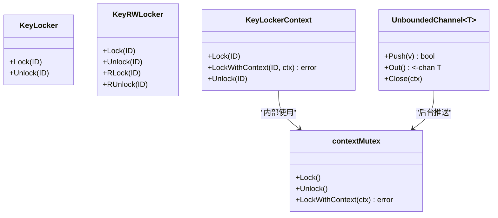
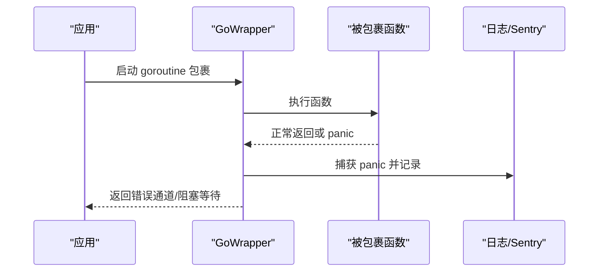
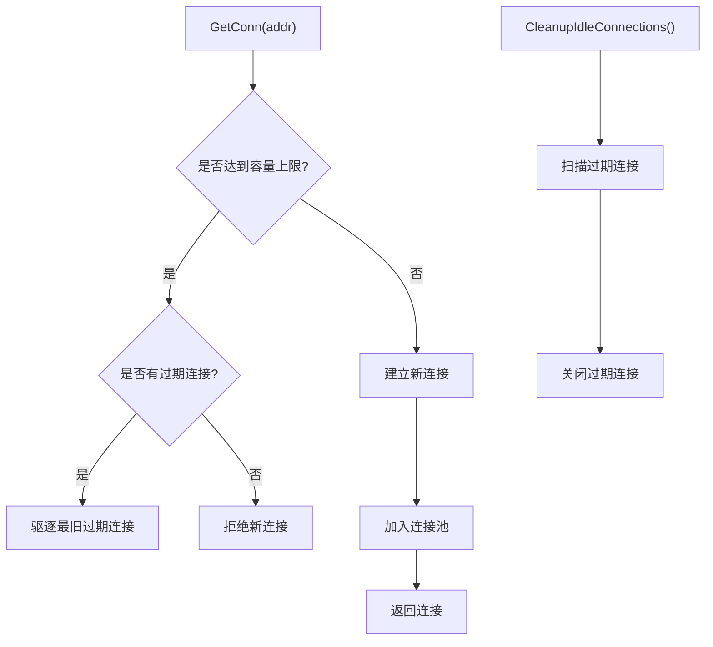
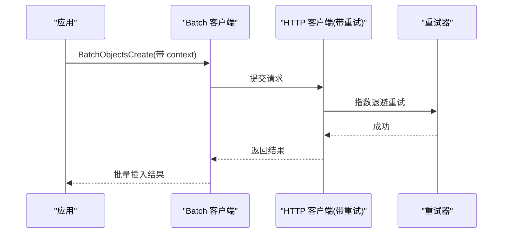
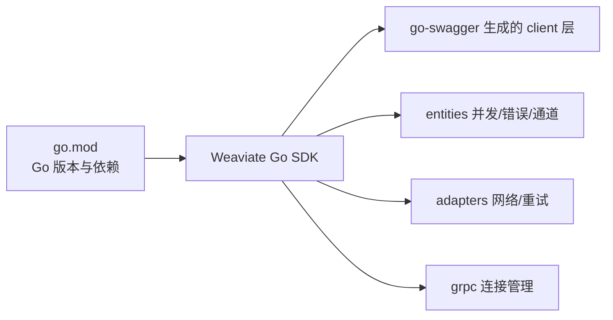

# Go SDK

<cite>
**本文引用的文件**
- [go.mod](file://go.mod)
- [README.md](file://README.md)
- [client/weaviate_client.go](file://client/weaviate_client.go)
- [client/batch/batch_client.go](file://client/batch/batch_client.go)
- [client/objects/objects_client.go](file://client/objects/objects_client.go)
- [adapters/clients/client.go](file://adapters/clients/client.go)
- [entities/sync/sync.go](file://entities/sync/sync.go)
- [adapters/repos/db/vector/common/unbounded_channel.go](file://adapters/repos/db/vector/common/unbounded_channel.go)
- [entities/errors/go_wrapper.go](file://entities/errors/go_wrapper.go)
- [grpc/conn/manager.go](file://grpc/conn/manager.go)
- [example/basic_weaviate_test.go](file://example/basic_weaviate_test.go)
</cite>

## 目录
1. [简介](#简介)
2. [项目结构](#项目结构)
3. [核心组件](#核心组件)
4. [架构总览](#架构总览)
5. [详细组件分析](#详细组件分析)
6. [依赖关系分析](#依赖关系分析)
7. [性能考量](#性能考量)
8. [故障排查指南](#故障排查指南)
9. [结论](#结论)
10. [附录](#附录)

## 简介
本文件为 Weaviate Go SDK 的完整使用文档，面向 Go 开发者，聚焦高并发场景下的最佳实践。内容覆盖：
- 导入与初始化：默认客户端与自定义配置
- 并发特性：goroutine、channel、context 上下文管理
- 错误处理与 panic 恢复、资源管理
- 并发安全操作示例：批量插入、并行查询
- 性能优化：连接池、超时、重试策略
- 微服务架构使用模式

## 项目结构
Weaviate Go SDK 采用模块化分层组织：
- client 层：按 API 功能拆分（schema、objects、batch、graphql 等），统一由 Weaviate 客户端聚合
- adapters 层：适配器与底层网络、gRPC 连接管理
- entities 层：通用并发同步、错误封装、通道等基础设施
- example：示例测试，展示基本用法与批量插入

图表来源
- [client/weaviate_client.go](file://client/weaviate_client.go#L140-L194)
- [client/batch/batch_client.go](file://client/batch/batch_client.go#L26-L51)
- [client/objects/objects_client.go](file://client/objects/objects_client.go#L26-L83)
- [adapters/clients/client.go](file://adapters/clients/client.go#L26-L91)
- [grpc/conn/manager.go](file://grpc/conn/manager.go#L166-L232)

章节来源
- [client/weaviate_client.go](file://client/weaviate_client.go#L41-L194)
- [client/batch/batch_client.go](file://client/batch/batch_client.go#L26-L180)
- [client/objects/objects_client.go](file://client/objects/objects_client.go#L26-L868)
- [adapters/clients/client.go](file://adapters/clients/client.go#L26-L129)
- [grpc/conn/manager.go](file://grpc/conn/manager.go#L166-L232)

## 核心组件
- Weaviate 客户端聚合：统一创建与传输配置，聚合各子服务（schema、objects、batch、graphql 等）
- HTTP 客户端与重试：封装 HTTP 请求，提供指数退避重试与上下文超时
- 并发同步：KeyLocker/KeyRWLocker、KeyLockerContext、contextMutex，支持按键粒度并发控制
- 无界通道：UnboundedChannel，用于后台消费与背压
- 错误与 panic 恢复：GoWrapper 系列，提供 goroutine 内 panic 恢复与日志上报
- gRPC 连接管理：连接池、容量限制、空闲清理、生命周期管理

章节来源
- [client/weaviate_client.go](file://client/weaviate_client.go#L140-L194)
- [adapters/clients/client.go](file://adapters/clients/client.go#L26-L129)
- [entities/sync/sync.go](file://entities/sync/sync.go#L20-L228)
- [adapters/repos/db/vector/common/unbounded_channel.go](file://adapters/repos/db/vector/common/unbounded_channel.go#L49-L122)
- [entities/errors/go_wrapper.go](file://entities/errors/go_wrapper.go#L25-L62)
- [grpc/conn/manager.go](file://grpc/conn/manager.go#L166-L232)

## 架构总览
Weaviate Go SDK 的调用链路如下：
- 应用通过 Weaviate 客户端发起请求
- 子服务将请求封装为 runtime.ClientOperation，交由 Transport 提交
- HTTP 适配器负责实际发送请求，并在失败时进行指数退避重试
- gRPC 连接管理器负责连接池与生命周期
- 并发同步与通道组件保障内部高并发场景下的线程安全与背压

图表来源
- [client/weaviate_client.go](file://client/weaviate_client.go#L74-L99)
- [client/objects/objects_client.go](file://client/objects/objects_client.go#L582-L616)
- [adapters/clients/client.go](file://adapters/clients/client.go#L65-L91)

## 详细组件分析

### Weaviate 客户端与初始化
- 默认客户端：提供默认 HTTP 客户端与默认主机、路径、协议
- 自定义配置：通过 TransportConfig 设置 Host/BasePath/Schemes；支持 WithHost/WithBasePath/WithSchemes
- 传输层注入：SetTransport 可替换底层 Transport，实现全局切换

图表来源
- [client/weaviate_client.go](file://client/weaviate_client.go#L140-L194)

章节来源
- [client/weaviate_client.go](file://client/weaviate_client.go#L41-L118)
- [client/weaviate_client.go](file://client/weaviate_client.go#L119-L194)

### HTTP 客户端与重试机制
- retryClient：封装 do/doWithCustomMarshaller，支持自定义序列化与成功码判断
- retryer：指数退避，最大间隔与最大尝试时间受控，避免无限重试
- successCode：定义成功状态码范围

图表来源
- [adapters/clients/client.go](file://adapters/clients/client.go#L31-L91)

章节来源
- [adapters/clients/client.go](file://adapters/clients/client.go#L26-L129)

### 并发同步与通道
- KeyLocker/KeyRWLocker：按键（ID）加锁，支持读写分离
- KeyLockerContext：支持带 context 的加锁，取消即失败
- contextMutex：基于 channel 的互斥锁，支持 LockWithContext
- UnboundedChannel：无界缓冲通道，支持关闭与背压，后台 goroutine 推送

图表来源
- [entities/sync/sync.go](file://entities/sync/sync.go#L20-L228)
- [adapters/repos/db/vector/common/unbounded_channel.go](file://adapters/repos/db/vector/common/unbounded_channel.go#L49-L122)

章节来源
- [entities/sync/sync.go](file://entities/sync/sync.go#L20-L228)
- [adapters/repos/db/vector/common/unbounded_channel.go](file://adapters/repos/db/vector/common/unbounded_channel.go#L49-L122)

### 错误处理与 panic 恢复
- GoWrapper/GowithErrorCh/GowithBlock：在 goroutine 中包裹函数，捕获 panic，记录日志并可返回错误通道
- DISABLE_RECOVERY_ON_PANIC：环境变量控制是否恢复 panic
- Sentry 集成：panic 恢复后上报

图表来源
- [entities/errors/go_wrapper.go](file://entities/errors/go_wrapper.go#L25-L62)

章节来源
- [entities/errors/go_wrapper.go](file://entities/errors/go_wrapper.go#L25-L62)

### gRPC 连接管理
- 连接池：按地址缓存连接，支持容量限制
- 清理循环：定期扫描并关闭超时未使用的连接
- 关闭连接：支持按地址关闭并更新指标

图表来源
- [grpc/conn/manager.go](file://grpc/conn/manager.go#L166-L232)

章节来源
- [grpc/conn/manager.go](file://grpc/conn/manager.go#L166-L232)

### 并发安全的批量与查询示例
- 批量插入：使用 BatchObjectsCreate，结合 context 超时与重试策略
- 并行查询：使用 ObjectsClassGet/ObjectsList，配合 KeyLockerContext 控制键级并发
- 无界通道：后台消费批量结果，避免主线程阻塞

图表来源
- [client/batch/batch_client.go](file://client/batch/batch_client.go#L58-L92)
- [adapters/clients/client.go](file://adapters/clients/client.go#L65-L91)

章节来源
- [client/batch/batch_client.go](file://client/batch/batch_client.go#L58-L180)
- [client/objects/objects_client.go](file://client/objects/objects_client.go#L131-L165)
- [adapters/clients/client.go](file://adapters/clients/client.go#L31-L91)

### 微服务架构使用模式
- 多实例共享：每个服务实例持有独立 Weaviate 客户端，必要时共享连接池（如 gRPC）
- 超时与重试：为不同服务设置合理超时与重试策略，避免级联故障
- 错误隔离：使用 GoWrapper 包裹异步任务，防止 panic 影响主流程
- 并发控制：使用 KeyLockerContext 对热点键进行并发控制，避免争用

章节来源
- [client/weaviate_client.go](file://client/weaviate_client.go#L140-L194)
- [entities/errors/go_wrapper.go](file://entities/errors/go_wrapper.go#L25-L62)
- [entities/sync/sync.go](file://entities/sync/sync.go#L126-L176)

## 依赖关系分析
- go.mod 指定 Go 版本与第三方依赖，包含 HTTP 客户端、gRPC、backoff、日志、指标等
- SDK 通过 go-swagger 生成的 client 层对接 Weaviate API
- 并发与通道能力来自 entities 层，网络与连接管理来自 adapters 与 grpc 层

图表来源
- [go.mod](file://go.mod#L1-L274)
- [client/weaviate_client.go](file://client/weaviate_client.go#L19-L39)

章节来源
- [go.mod](file://go.mod#L1-L274)
- [client/weaviate_client.go](file://client/weaviate_client.go#L19-L39)

## 性能考量
- 连接池与容量：gRPC 连接管理器支持容量限制与空闲清理，避免资源耗尽
- 超时与重试：HTTP 客户端使用指数退避，避免雪崩效应；合理设置超时与最大重试次数
- 并发控制：使用 KeyLocker/KeyRWLocker/KeyLockerContext 控制热点键并发，减少争用
- 无界通道：UnboundedChannel 作为背压缓冲，避免阻塞主流程
- 批量优先：批量插入优于单条插入，减少网络往返与解析开销

章节来源
- [grpc/conn/manager.go](file://grpc/conn/manager.go#L166-L232)
- [adapters/clients/client.go](file://adapters/clients/client.go#L93-L129)
- [entities/sync/sync.go](file://entities/sync/sync.go#L20-L114)
- [adapters/repos/db/vector/common/unbounded_channel.go](file://adapters/repos/db/vector/common/unbounded_channel.go#L49-L122)
- [client/batch/batch_client.go](file://client/batch/batch_client.go#L58-L92)

## 故障排查指南
- 连接失败与超时：检查 TransportConfig 与上下文超时；确认重试策略是否生效
- panic 恢复：启用 GoWrapper 包裹 goroutine；通过 DISABLE_RECOVERY_ON_PANIC 控制是否恢复
- 并发死锁：核对 KeyLockerContext 的加解锁配对；避免在锁内进行阻塞 IO
- gRPC 连接问题：检查连接池容量与空闲清理；确认关闭流程与指标

章节来源
- [adapters/clients/client.go](file://adapters/clients/client.go#L31-L91)
- [entities/errors/go_wrapper.go](file://entities/errors/go_wrapper.go#L25-L62)
- [entities/sync/sync.go](file://entities/sync/sync.go#L149-L176)
- [grpc/conn/manager.go](file://grpc/conn/manager.go#L166-L232)

## 结论
Weaviate Go SDK 提供了完善的客户端抽象、强大的并发控制与稳健的错误处理机制。通过合理的超时、重试与连接池配置，以及按键粒度的并发控制，可在高并发与微服务场景中稳定运行。建议优先使用批量接口、合理设置超时与重试、在 goroutine 中使用 GoWrapper 包裹以提升健壮性。

## 附录
- 示例测试展示了基本连接、类管理、批量插入与错误处理流程，可作为快速上手参考

章节来源
- [example/basic_weaviate_test.go](file://example/basic_weaviate_test.go#L14-L118)