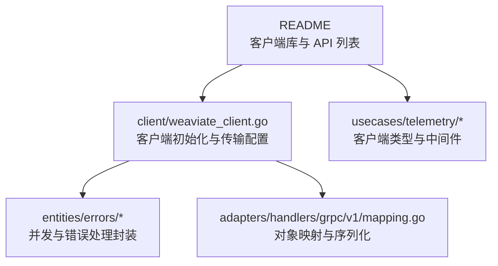
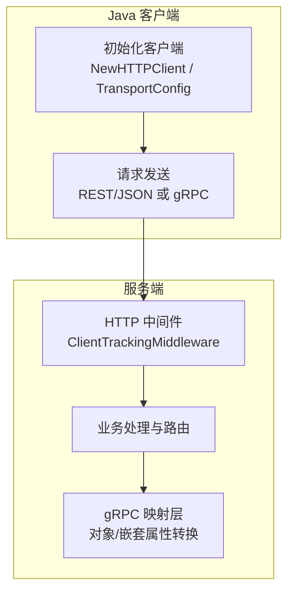
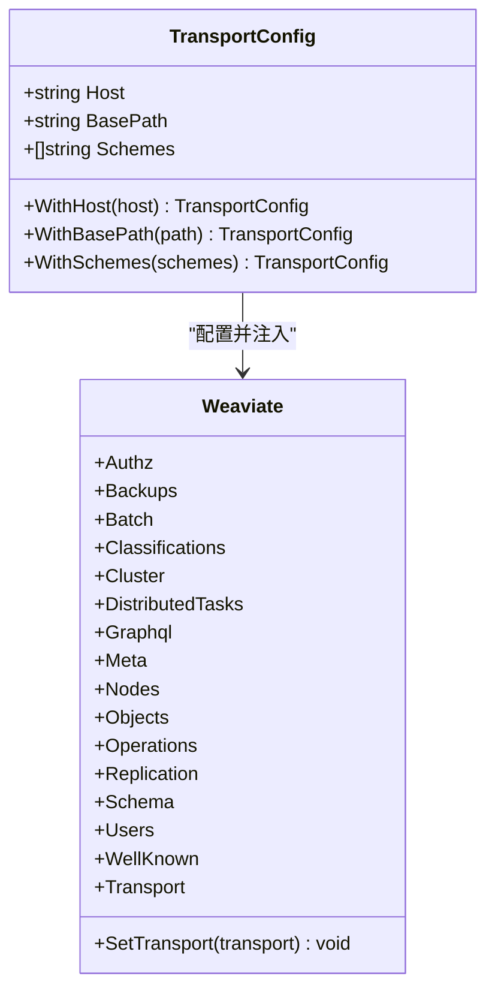
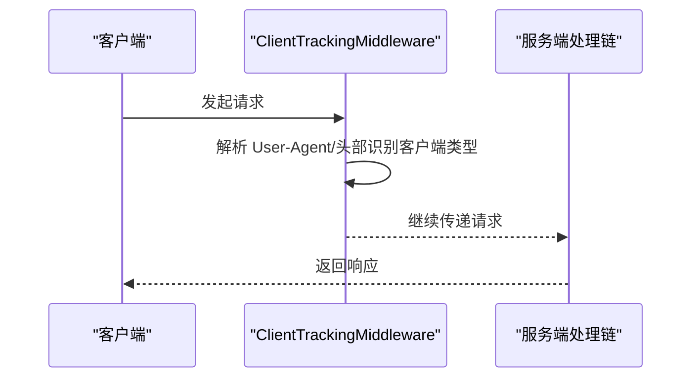
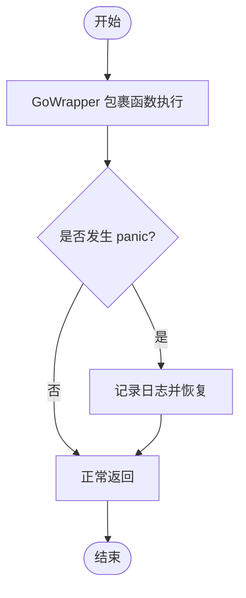
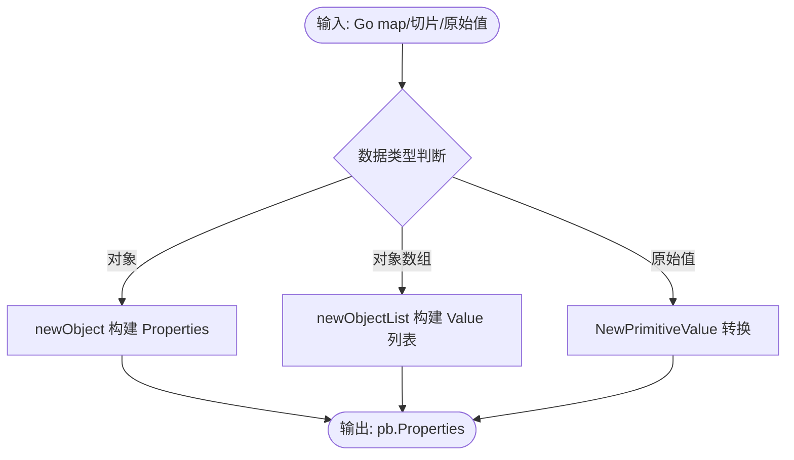
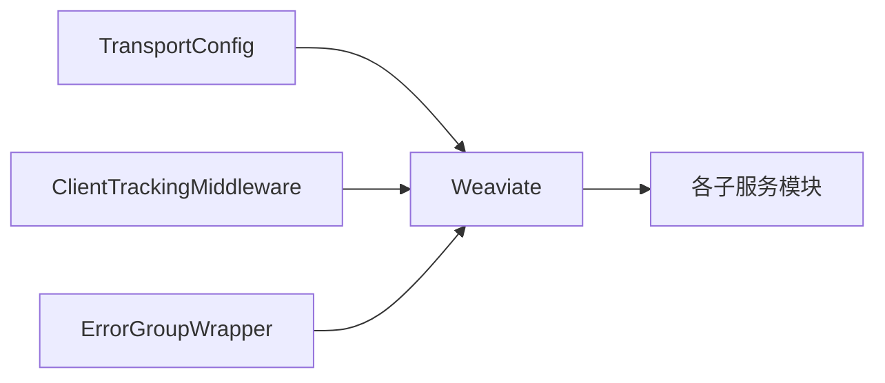

# Java SDK

<cite>
**本文引用的文件**
- [README.md](file://README.md)
- [weaviate_client.go](file://client/weaviate_client.go)
- [client_tracker.go](file://usecases/telemetry/client_tracker.go)
- [client_middleware.go](file://usecases/telemetry/client_middleware.go)
- [go_wrapper_test.go](file://entities/errors/go_wrapper_test.go)
- [error_group_wrapper.go](file://entities/errors/error_group_wrapper.go)
- [mapping.go](file://adapters/handlers/grpc/v1/mapping.go)
</cite>

## 目录
1. [简介](#简介)
2. [项目结构](#项目结构)
3. [核心组件](#核心组件)
4. [架构总览](#架构总览)
5. [组件详解](#组件详解)
6. [依赖关系分析](#依赖关系分析)
7. [性能考量](#性能考量)
8. [故障排查指南](#故障排查指南)
9. [结论](#结论)
10. [附录](#附录)

## 简介
本文件面向 Java 开发者，提供 Weaviate Java SDK 的使用与集成指南。当前仓库为 Weaviate 的 Go 服务端与客户端实现，其中包含 Java 客户端的存在性证据（遥测类型枚举中包含 Java）。本文将基于仓库中的现有信息，系统阐述：
- 依赖配置与版本管理（Maven/Gradle）
- 客户端初始化与 Builder 风格配置
- Java 特有能力（线程安全、连接池、异步）
- Spring Boot 集成思路
- Java 对象映射、序列化与反序列化
- 错误处理、异常管理与日志配置
- 性能调优、内存与 GC 优化建议
- 企业级应用集成实践

注意：本文严格依据仓库中可验证的信息进行说明；对于未在仓库中出现的 Java SDK 细节，将以“概念性说明”呈现。

## 项目结构
仓库采用 Go 语言实现，包含服务端、模块、适配器、测试与工具等子目录。与 Java SDK 相关的关键线索包括：
- README 中明确列出 Java 客户端库链接
- 遥测模块中存在 Java 客户端类型标识
- 客户端初始化与传输配置逻辑位于 client 包
- 错误处理与并发封装位于 entities/errors
- gRPC 映射层用于对象与值类型的转换

图表来源
- [README.md](file://README.md#L98-L110)
- [weaviate_client.go](file://client/weaviate_client.go#L56-L99)
- [client_tracker.go](file://usecases/telemetry/client_tracker.go#L24-L33)
- [client_middleware.go](file://usecases/telemetry/client_middleware.go#L18-L37)
- [mapping.go](file://adapters/handlers/grpc/v1/mapping.go#L105-L168)

章节来源
- [README.md](file://README.md#L98-L110)

## 核心组件
- 客户端初始化与传输配置
  - 默认主机、基础路径与协议方案
  - 可定制 TransportConfig（Host/BasePath/Schemes）
  - 通过 NewHTTPClient/NewHTTPClientWithConfig 创建客户端实例
- 遥测与中间件
  - 客户端类型枚举包含 Java
  - HTTP 中间件用于追踪客户端 SDK 使用情况
- 并发与错误处理
  - GoWrapper 与 ErrorGroupWrapper 提供协程安全与 panic 恢复
- 对象映射与序列化
  - gRPC 映射层负责对象/数组/嵌套属性的值转换

章节来源
- [weaviate_client.go](file://client/weaviate_client.go#L41-L79)
- [weaviate_client.go](file://client/weaviate_client.go#L101-L138)
- [weaviate_client.go](file://client/weaviate_client.go#L140-L194)
- [client_tracker.go](file://usecases/telemetry/client_tracker.go#L24-L33)
- [client_middleware.go](file://usecases/telemetry/client_middleware.go#L18-L37)
- [go_wrapper_test.go](file://entities/errors/go_wrapper_test.go#L26-L63)
- [error_group_wrapper.go](file://entities/errors/error_group_wrapper.go#L28-L96)
- [mapping.go](file://adapters/handlers/grpc/v1/mapping.go#L105-L168)

## 架构总览
Weaviate 服务端通过 REST/gRPC/GraphQL 暴露 API，Java 客户端通过 HTTP/JSON 或 gRPC 与服务端交互。客户端初始化后，请求经由传输层发送至服务端，服务端在处理链中可能应用遥测中间件记录客户端类型，随后进入业务处理与映射层，最终返回结果。

图表来源
- [weaviate_client.go](file://client/weaviate_client.go#L56-L99)
- [client_middleware.go](file://usecases/telemetry/client_middleware.go#L18-L37)
- [mapping.go](file://adapters/handlers/grpc/v1/mapping.go#L105-L168)

## 组件详解

### 客户端初始化与 Builder 配置
- 默认配置
  - 主机、基础路径与默认协议方案
- 自定义配置
  - TransportConfig 支持覆盖 Host、BasePath、Schemes
  - NewHTTPClientWithConfig 接受 TransportConfig
- 传输层设置
  - New 将 transport 注入到各子服务（Authz/Schema/Batch/Objects 等）

图表来源
- [weaviate_client.go](file://client/weaviate_client.go#L101-L138)
- [weaviate_client.go](file://client/weaviate_client.go#L140-L194)

章节来源
- [weaviate_client.go](file://client/weaviate_client.go#L41-L79)
- [weaviate_client.go](file://client/weaviate_client.go#L101-L138)
- [weaviate_client.go](file://client/weaviate_client.go#L140-L194)

### 遥测与客户端类型识别
- 客户端类型枚举包含 Java，表明服务端具备识别 Java SDK 的能力
- ClientTrackingMiddleware 可作为早期中间件捕获请求并记录客户端信息

图表来源
- [client_tracker.go](file://usecases/telemetry/client_tracker.go#L24-L33)
- [client_middleware.go](file://usecases/telemetry/client_middleware.go#L18-L37)

章节来源
- [client_tracker.go](file://usecases/telemetry/client_tracker.go#L24-L33)
- [client_middleware.go](file://usecases/telemetry/client_middleware.go#L18-L37)

### 并发与错误处理（Go 侧封装）
尽管为 Java SDK 文档，但仓库提供了 Go 侧的并发与错误处理模式，可作为 Java 异步与线程安全实践的参考：
- GoWrapper：在 goroutine 中执行函数并恢复 panic，输出日志
- ErrorGroupWrapper：带上下文的并发组，统一等待并收集首个非空错误，支持栈跟踪与限流

图表来源
- [go_wrapper_test.go](file://entities/errors/go_wrapper_test.go#L26-L63)

章节来源
- [go_wrapper_test.go](file://entities/errors/go_wrapper_test.go#L26-L63)
- [error_group_wrapper.go](file://entities/errors/error_group_wrapper.go#L28-L96)

### Java 对象映射、序列化与反序列化
- gRPC 映射层负责将嵌套对象、对象数组与原始值转换为 pb.Value
- 支持对象字段选择与嵌套属性的数据类型推断
- 适用于 Java 侧将复杂对象序列化为 gRPC 值或反序列化回 Java 对象模型

图表来源
- [mapping.go](file://adapters/handlers/grpc/v1/mapping.go#L105-L168)

章节来源
- [mapping.go](file://adapters/handlers/grpc/v1/mapping.go#L105-L168)

### Spring Boot 集成思路
- 客户端生命周期
  - 在应用启动时初始化 Weaviate 客户端（基于 TransportConfig）
  - 将客户端注入到服务层 Bean，避免在请求中重复创建
- 配置管理
  - 通过 application.properties/yml 设置主机、端口、基础路径与协议
  - 可选：启用遥测中间件以记录客户端类型
- 异步与线程安全
  - 使用线程池与异步框架（如 CompletableFuture）执行批量写入/查询
  - 避免在高并发场景下共享可变状态，必要时使用不可变客户端实例
- 日志与监控
  - 结合服务端中间件与客户端日志，定位请求耗时与错误来源

（本节为概念性集成指导，不直接分析具体文件）

## 依赖关系分析
- 客户端初始化依赖 TransportConfig，后者决定 Host/BasePath/Schemes
- Weaviate 实例将 Transport 注入到各子服务模块
- 遥测中间件在请求链路早期生效，用于识别客户端类型
- 错误处理封装提供并发安全与异常恢复能力

图表来源
- [weaviate_client.go](file://client/weaviate_client.go#L101-L138)
- [weaviate_client.go](file://client/weaviate_client.go#L140-L194)
- [client_middleware.go](file://usecases/telemetry/client_middleware.go#L18-L37)
- [error_group_wrapper.go](file://entities/errors/error_group_wrapper.go#L28-L96)

章节来源
- [weaviate_client.go](file://client/weaviate_client.go#L101-L138)
- [weaviate_client.go](file://client/weaviate_client.go#L140-L194)
- [client_middleware.go](file://usecases/telemetry/client_middleware.go#L18-L37)
- [error_group_wrapper.go](file://entities/errors/error_group_wrapper.go#L28-L96)

## 性能考量
- 连接与传输
  - 合理设置超时时间与重试策略，避免阻塞请求线程
  - 复用连接与传输层，减少握手开销
- 并发与批处理
  - 使用异步与线程池执行批量写入/查询，提升吞吐
  - 控制并发度上限，避免过度竞争导致延迟上升
- 内存与 GC
  - 避免在热路径上频繁分配临时对象
  - 合理复用缓冲区与对象池，降低 GC 压力
- 序列化与映射
  - 减少不必要的对象层级与字段选择，降低映射与序列化成本
- 监控与观测
  - 结合服务端中间件与客户端日志，定位热点与瓶颈

（本节提供通用性能建议，不直接分析具体文件）

## 故障排查指南
- 并发与异常
  - 使用 GoWrapper/ErrorGroupWrapper 的模式在 Java 中对应：在异步任务中包裹 try-catch 并记录堆栈
  - 对并发任务设置上限与取消机制，避免资源耗尽
- 日志与追踪
  - 启用服务端 ClientTrackingMiddleware，确认客户端类型与版本
  - 在客户端侧记录请求/响应与关键参数，便于定位问题
- 常见问题
  - 超时与重试：调整超时阈值与指数退避策略
  - 认证失败：检查凭据与授权头
  - 类型不匹配：核对对象映射与数据类型

章节来源
- [go_wrapper_test.go](file://entities/errors/go_wrapper_test.go#L26-L63)
- [error_group_wrapper.go](file://entities/errors/error_group_wrapper.go#L28-L96)
- [client_middleware.go](file://usecases/telemetry/client_middleware.go#L18-L37)

## 结论
本指南基于仓库中的可验证信息，梳理了 Weaviate Java SDK 的依赖配置、客户端初始化、并发与错误处理、对象映射以及集成实践。对于 Java 特有实现细节（如连接池、异步 API），可参考仓库中的并发与错误处理模式进行类比与落地。建议在企业级应用中结合 Spring Boot 生命周期与监控体系，确保稳定性与可观测性。

## 附录
- 官方 Java 客户端库链接与 API 文档入口可参考 README 中的“客户端库与 API”部分
- 如需进一步了解 gRPC 映射与对象序列化，可参考映射层实现

章节来源
- [README.md](file://README.md#L98-L110)
- [mapping.go](file://adapters/handlers/grpc/v1/mapping.go#L105-L168)