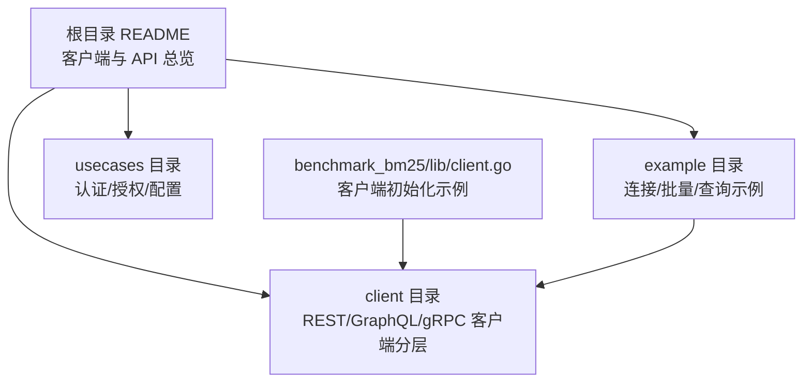
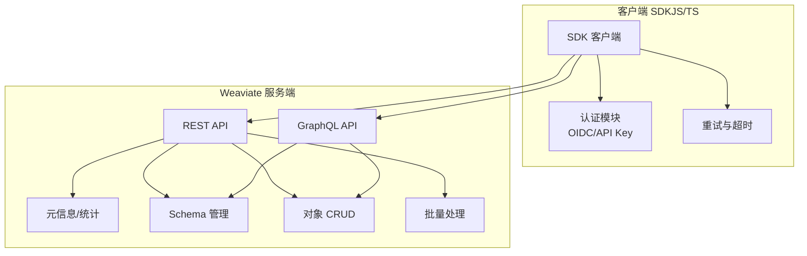
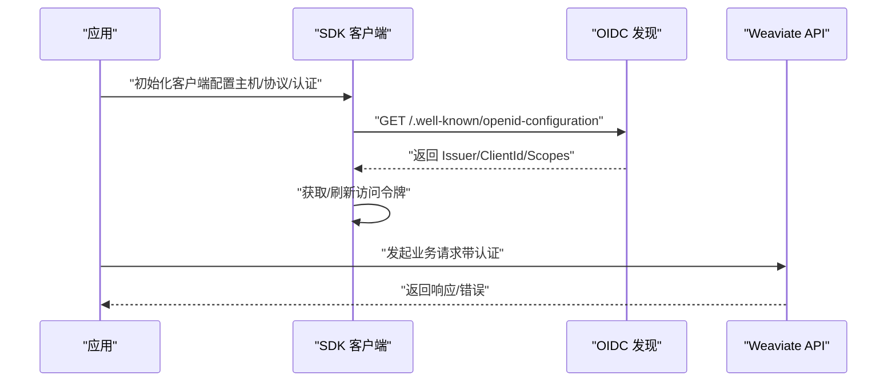
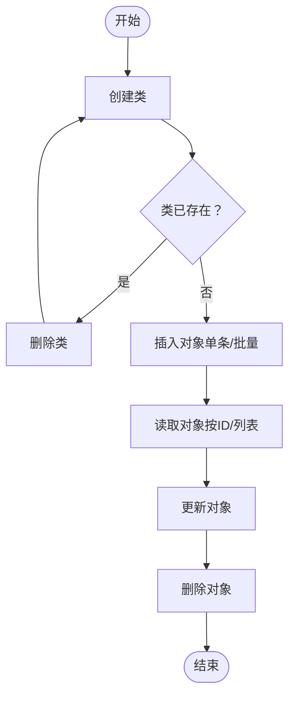
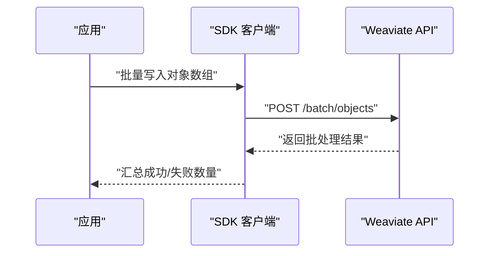
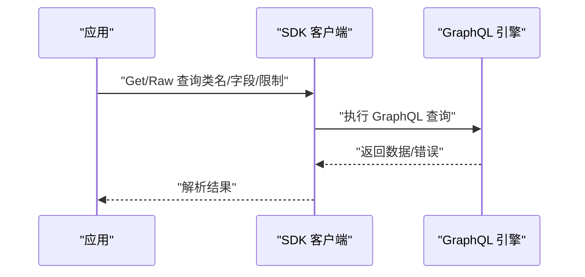
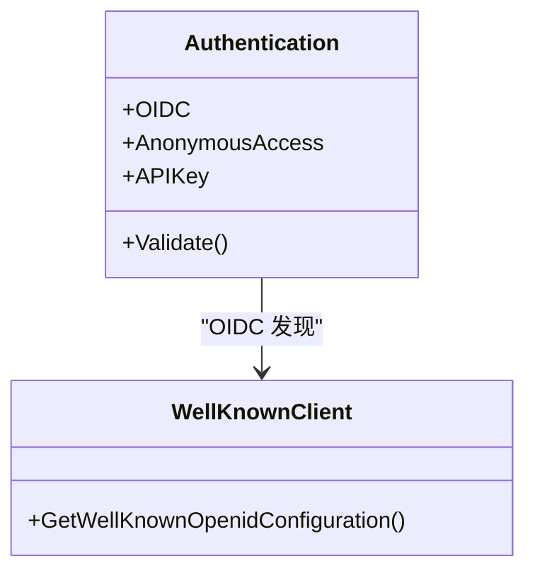
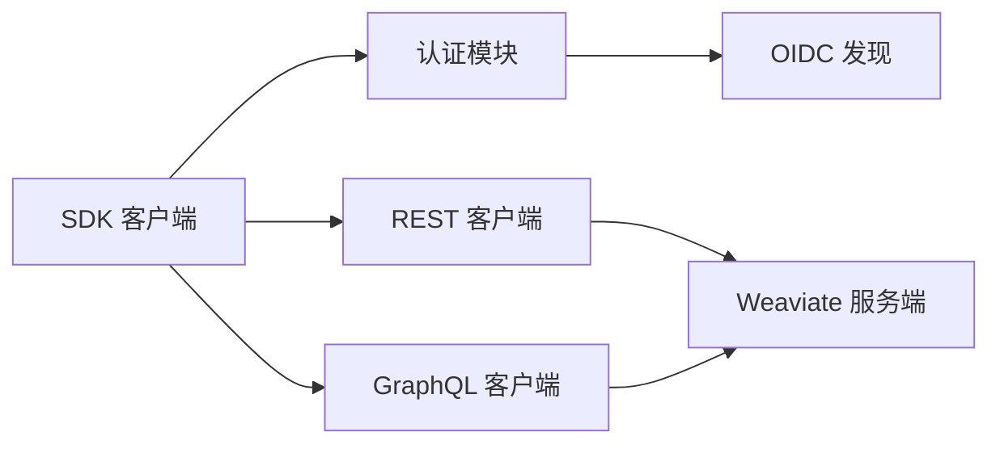

# JavaScript/TypeScript SDK

<cite>
**本文引用的文件**
- [README.md](file://README.md)
- [basic_weaviate_test.go](file://example/basic_weaviate_test.go)
- [query_existing_data_test.go](file://example/query_existing_data_test.go)
- [client.go](file://test/benchmark_bm25/lib/client.go)
- [well_known_client.go](file://client/well_known/well_known_client.go)
- [authentication.go](file://usecases/config/authentication.go)
- [authentication.go](file://usecases/auth/authentication/authentication.go)
</cite>

## 目录
1. [简介](#简介)
2. [项目结构](#项目结构)
3. [核心组件](#核心组件)
4. [架构总览](#架构总览)
5. [详细组件分析](#详细组件分析)
6. [依赖分析](#依赖分析)
7. [性能考虑](#性能考虑)
8. [故障排查指南](#故障排查指南)
9. [结论](#结论)
10. [附录](#附录)

## 简介
本文件面向 Weaviate JavaScript/TypeScript SDK 的使用者，提供从安装、配置到核心 API 使用、Promise/async-await 模式、错误处理、TypeScript 类型安全以及性能优化与生产部署的完整指南。仓库中包含大量以 Go 语言实现的客户端与示例，其中也包含与 JavaScript/TypeScript SDK 相关的元信息与参考路径，便于对照理解。

## 项目结构
本仓库主要由后端服务、模块化适配层、OpenAPI 规范与示例组成。与 JavaScript/TypeScript SDK 相关的关键位置包括：
- 根目录 README：提供客户端库与 API 的总体说明，包含 JavaScript/TypeScript 官方链接与资源索引。
- example 目录：包含使用 Go 客户端进行连接、批量写入、GraphQL 查询等示例，可作为 JS/TS 使用模式的参考。
- client 目录：包含各子系统的客户端实现（如 objects、batch、graphql、meta 等），用于理解 API 分层与调用方式。
- usecases 目录：包含认证、授权等配置与运行时逻辑，有助于理解鉴权与安全设置。
- test/benchmark_bm25/lib/client.go：展示如何通过 Config 初始化客户端，可映射到 JS/TS 的初始化流程。

**图表来源**
- [README.md](file://README.md#L98-L110)
- [client.go](file://test/benchmark_bm25/lib/client.go#L20-L34)

**章节来源**
- [README.md](file://README.md#L98-L110)
- [client.go](file://test/benchmark_bm25/lib/client.go#L20-L34)

## 核心组件
- 客户端初始化与配置
  - 参考 Go 客户端的 Config 结构与 New/Client 初始化方式，JS/TS SDK 的初始化流程应遵循类似的“配置对象 + 构造函数”的模式。
  - 关键点：主机地址、协议（HTTP/HTTPS）、超时、认证（API Key/OIDC）、重试策略等。
- 对象操作
  - Schema 管理：类创建、删除、存在性检查。
  - 数据写入：单条/批量插入对象。
  - 数据读取：按类名/ID 获取、列表查询、校验。
  - 数据更新与删除：按 ID 更新与删除。
- 批量处理
  - 批量对象写入与删除，返回批处理结果与错误聚合。
- 查询与过滤
  - GraphQL 查询：Get/Raw 查询、聚合、近邻搜索、限制、字段选择。
  - 过滤器：Where 子句、排序、游标、分页等。
- 认证与安全
  - OIDC 发现端点：/.well-known/openid-configuration。
  - 静态 API Key 与匿名访问配置。
- 元数据与统计
  - 元信息获取、节点状态、集群统计等。

**章节来源**
- [basic_weaviate_test.go](file://example/basic_weaviate_test.go#L14-L118)
- [query_existing_data_test.go](file://example/query_existing_data_test.go#L15-L125)
- [well_known_client.go](file://client/well_known/well_known_client.go#L46-L74)
- [authentication.go](file://usecases/config/authentication.go#L20-L44)
- [authentication.go](file://usecases/auth/authentication/authentication.go#L14-L19)

## 架构总览
Weaviate 提供 REST、GraphQL 与 gRPC 三种 API。JS/TS SDK 通常通过 REST/GraphQL 与服务端交互；认证方面支持 OIDC 与静态 API Key。

**图表来源**
- [README.md](file://README.md#L110-L110)
- [well_known_client.go](file://client/well_known/well_known_client.go#L46-L74)

## 详细组件分析

### 客户端初始化与配置
- 初始化流程
  - 通过配置对象（包含主机、协议、认证等）构造客户端实例。
  - 可选：设置超时、重试、并发限制、日志级别等。
- 认证方式
  - OIDC：通过 /.well-known/openid-configuration 获取发现信息，完成令牌获取与刷新。
  - API Key：在请求头中携带静态密钥。
  - 匿名访问：在未启用任何鉴权时允许匿名访问。
- 典型场景
  - Node.js 服务端：持久连接、连接池、统一中间件。
  - 浏览器端：避免泄露凭据、使用 HTTPS、短连接或缓存策略。

**图表来源**
- [well_known_client.go](file://client/well_known/well_known_client.go#L46-L74)
- [authentication.go](file://usecases/config/authentication.go#L20-L44)
- [authentication.go](file://usecases/auth/authentication/authentication.go#L14-L19)

**章节来源**
- [client.go](file://test/benchmark_bm25/lib/client.go#L20-L34)
- [well_known_client.go](file://client/well_known/well_known_client.go#L46-L74)
- [authentication.go](file://usecases/config/authentication.go#L20-L44)
- [authentication.go](file://usecases/auth/authentication/authentication.go#L14-L19)

### 对象操作（CRUD）
- 类管理
  - 创建类：指定类名、属性、向量化配置等。
  - 删除类：清理测试或迁移。
  - 存在性检查：避免重复创建。
- 写入
  - 单条插入：提交对象属性。
  - 批量插入：一次请求提交多个对象，返回批处理结果。
- 读取
  - 按类名/ID 获取对象。
  - 列表查询：分页、排序、过滤。
  - 校验：HEAD 请求验证对象是否存在。
- 更新与删除
  - 按 ID 更新对象属性。
  - 按 ID 删除对象。

**图表来源**
- [basic_weaviate_test.go](file://example/basic_weaviate_test.go#L31-L101)

**章节来源**
- [basic_weaviate_test.go](file://example/basic_weaviate_test.go#L31-L101)

### 批量处理
- 批量写入
  - 传入对象数组，返回每条记录的处理结果与错误信息。
  - 统计成功数量，校验无错误。
- 批量删除
  - 按 ID 删除多个对象，返回批处理结果。

**图表来源**
- [basic_weaviate_test.go](file://example/basic_weaviate_test.go#L90-L101)

**章节来源**
- [basic_weaviate_test.go](file://example/basic_weaviate_test.go#L90-L101)

### 查询与过滤（GraphQL）
- Get 查询
  - 指定类名、字段、限制、聚合等。
- Raw 查询
  - 自定义 GraphQL 查询字符串，适用于复杂聚合与近邻搜索。
- 近邻搜索
  - NearText/NearVector 等参数，支持正负样本与置信度/距离阈值。

**图表来源**
- [query_existing_data_test.go](file://example/query_existing_data_test.go#L31-L122)

**章节来源**
- [query_existing_data_test.go](file://example/query_existing_data_test.go#L31-L122)

### 认证与安全
- OIDC 发现
  - 通过 /.well-known/openid-configuration 获取 Issuer、ClientId、Scopes 等。
- 静态 API Key
  - 在请求头中携带 API Key，适用于服务端直连。
- 匿名访问
  - 默认启用匿名访问，但生产环境建议禁用。

**图表来源**
- [authentication.go](file://usecases/config/authentication.go#L20-L44)
- [well_known_client.go](file://client/well_known/well_known_client.go#L46-L74)

**章节来源**
- [authentication.go](file://usecases/config/authentication.go#L20-L44)
- [well_known_client.go](file://client/well_known/well_known_client.go#L46-L74)

## 依赖分析
- 组件耦合
  - SDK 客户端依赖认证模块与网络传输层。
  - GraphQL/REST 客户端分别对接不同 API 层，职责清晰。
- 外部依赖
  - OIDC 提供商（如 Auth0、Okta 等）。
  - Weaviate 服务端（REST/GraphQL/gRPC）。
- 循环依赖
  - 当前结构以 usecases 与 client 分层为主，未见明显循环依赖迹象。

**图表来源**
- [well_known_client.go](file://client/well_known/well_known_client.go#L46-L74)
- [authentication.go](file://usecases/config/authentication.go#L20-L44)

**章节来源**
- [well_known_client.go](file://client/well_known/well_known_client.go#L46-L74)
- [authentication.go](file://usecases/config/authentication.go#L20-L44)

## 性能考虑
- 连接与并发
  - Node.js 环境建议复用连接、设置合理的并发上限与队列长度。
  - 浏览器端避免长连接，采用短连接与缓存策略。
- 批量写入
  - 合理拆分批量大小，平衡吞吐与延迟。
- 查询优化
  - 仅选择必要字段，避免过深分页。
  - 使用过滤与排序减少扫描范围。
- 超时与重试
  - 设置合理超时与指数退避重试，避免雪崩效应。
- 缓存与预热
  - 对热点查询结果进行缓存，预热常用 Schema。

## 故障排查指南
- 连接失败
  - 检查主机地址与协议（HTTP/HTTPS）。
  - 确认防火墙与网络策略。
- 认证错误
  - OIDC：确认 /.well-known/openid-configuration 可达，检查 Issuer/ClientId/Scopes。
  - API Key：确认密钥有效且未过期。
- 写入失败
  - 查看批处理返回的错误详情，定位具体对象。
  - 检查类名、属性类型与向量化配置。
- 查询异常
  - 检查 GraphQL 查询语法与字段权限。
  - 确认过滤条件与排序字段存在。

**章节来源**
- [basic_weaviate_test.go](file://example/basic_weaviate_test.go#L103-L110)
- [well_known_client.go](file://client/well_known/well_known_client.go#L46-L74)

## 结论
Weaviate JavaScript/TypeScript SDK 提供了与 Go 客户端一致的 API 分层与能力边界。通过明确的初始化、认证与批量/查询流程，开发者可以在 Node.js 与浏览器环境中高效构建向量数据库应用。建议在生产环境启用严格的认证与监控，并结合本文的性能与故障排查建议，确保系统稳定与高性能。

## 附录
- 安装与入门
  - 参考根目录 README 中的“客户端库与 API”部分，获取 JavaScript/TypeScript 官方文档入口与示例资源。
- 使用示例路径
  - 基础连接与批量写入：参见 [basic_weaviate_test.go](file://example/basic_weaviate_test.go#L14-L118)。
  - GraphQL 查询与聚合：参见 [query_existing_data_test.go](file://example/query_existing_data_test.go#L15-L125)。
- 初始化参考
  - 参见 [client.go](file://test/benchmark_bm25/lib/client.go#L20-L34) 中的配置与客户端构造方式。

**章节来源**
- [README.md](file://README.md#L98-L110)
- [basic_weaviate_test.go](file://example/basic_weaviate_test.go#L14-L118)
- [query_existing_data_test.go](file://example/query_existing_data_test.go#L15-L125)
- [client.go](file://test/benchmark_bm25/lib/client.go#L20-L34)