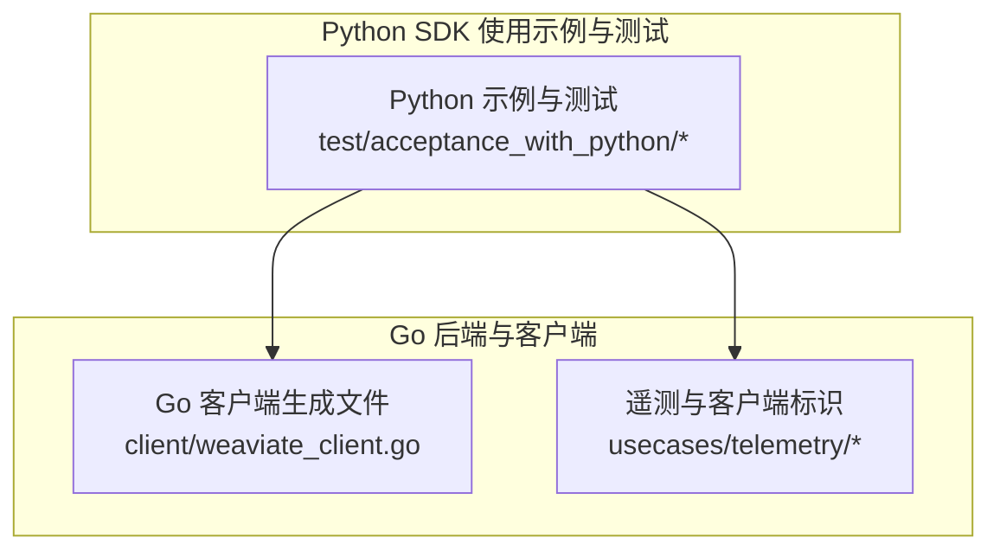
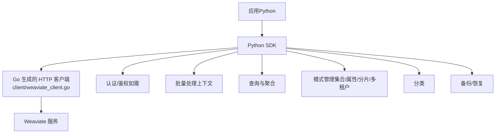
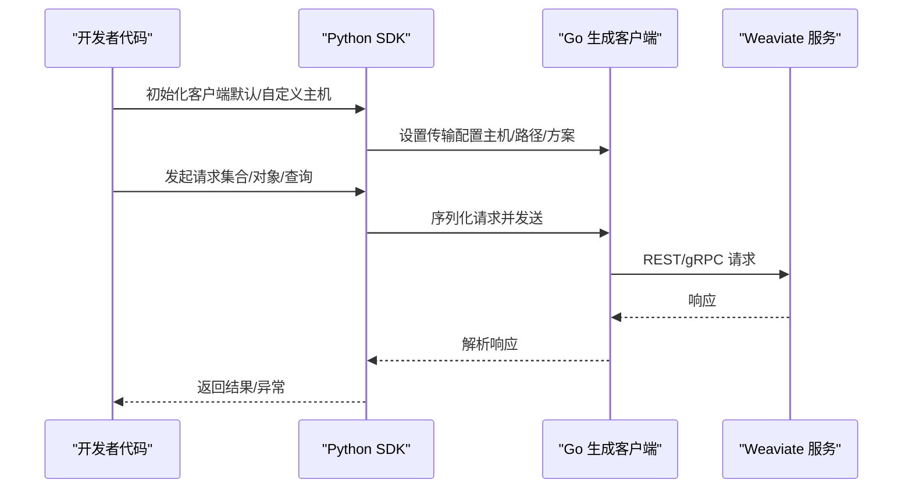
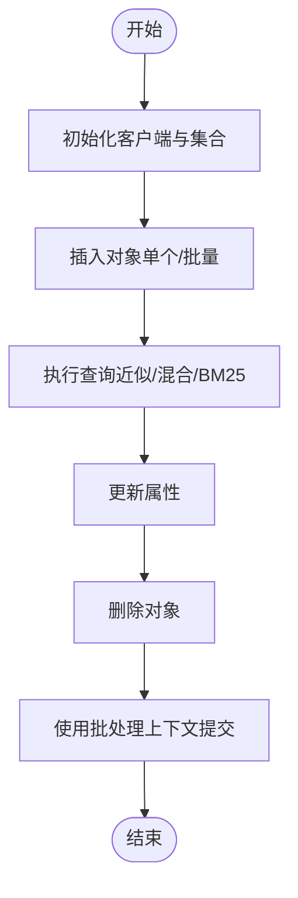
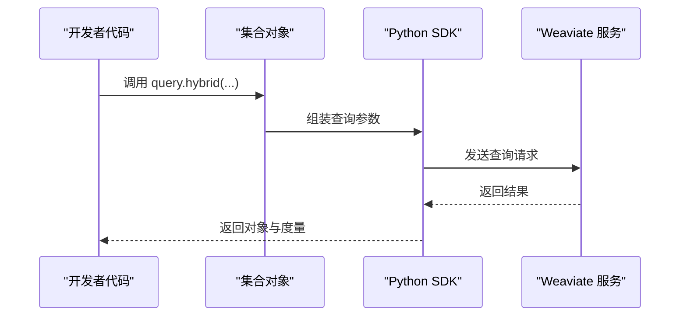
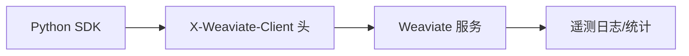

# Python SDK

<cite>
**本文引用的文件**
- [README.md](file://README.md)
- [client/weaviate_client.go](file://client/weaviate_client.go)
- [test/acceptance_with_python/test_auto_schema_ec.py](file://test/acceptance_with_python/test_auto_schema_ec.py)
- [test/acceptance_with_python/test_aggregate.py](file://test/acceptance_with_python/test_aggregate.py)
- [usecases/telemetry/client_tracker.go](file://usecases/telemetry/client_tracker.go)
- [usecases/telemetry/telemetry_test.go](file://usecases/telemetry/telemetry_test.go)
</cite>

## 目录
1. [简介](#简介)
2. [项目结构](#项目结构)
3. [核心组件](#核心组件)
4. [架构总览](#架构总览)
5. [详细组件分析](#详细组件分析)
6. [依赖分析](#依赖分析)
7. [性能考虑](#性能考虑)
8. [故障排查指南](#故障排查指南)
9. [结论](#结论)
10. [附录](#附录)

## 简介
本文件面向 Python 开发者，提供 Weaviate Python SDK 的使用与集成指南。Weaviate 是一个开源的云原生向量数据库，支持对象与向量的存储，并提供强大的语义搜索能力。Python SDK 提供了连接、集合管理、对象 CRUD、批量写入、聚合统计、分类、备份等核心功能。

- 安装方式
  - 使用 pip 安装：pip install -U weaviate-client
  - 从源码安装：参考项目根目录的安装与部署说明
- 初始化客户端
  - 默认连接本地实例
  - 自定义主机与端口
  - 认证配置（如需）
- 核心功能
  - 对象操作（CRUD）、批量处理、模式管理（集合、属性、分片、多租户）、分类、备份
  - 查询与聚合（近似最近邻、BM25、混合搜索、向量距离限制等）
  - 异步与连接池、重试机制、错误处理
- 性能优化与最佳实践
  - 批量写入策略、向量化配置、查询参数调优
  - 常见问题与排障建议

## 项目结构
本仓库以 Go 语言为主，提供了 Python SDK 的使用示例与测试用例。Python SDK 的高层 API 由 Python 测试与示例体现，底层通过 REST/gRPC 与 Weaviate 服务交互。

图表来源
- [client/weaviate_client.go](file://client/weaviate_client.go#L1-L194)
- [usecases/telemetry/client_tracker.go](file://usecases/telemetry/client_tracker.go#L184-L198)
- [usecases/telemetry/telemetry_test.go](file://usecases/telemetry/telemetry_test.go#L126-L127)

章节来源
- [README.md](file://README.md#L56-L60)
- [client/weaviate_client.go](file://client/weaviate_client.go#L1-L194)

## 核心组件
- 客户端初始化
  - 默认连接本地实例
  - 自定义主机与端口
  - 认证配置（如需）
- 集合管理
  - 创建集合、删除集合、列出集合
  - 属性定义、向量化配置、分片与复制配置、多租户
- 对象操作
  - 插入、查询、更新、删除
  - 批量插入与删除
- 查询与聚合
  - near_text、near_vector、hybrid、bm25 等
  - 聚合指标（计数、平均值、最大/最小等）
- 分类与备份
  - 分类任务提交与状态获取
  - 备份与恢复任务管理
- 异步与连接池
  - 批处理上下文管理
  - 连接池与重试策略（由底层客户端实现）

章节来源
- [README.md](file://README.md#L64-L94)
- [test/acceptance_with_python/test_auto_schema_ec.py](file://test/acceptance_with_python/test_auto_schema_ec.py#L20-L50)
- [test/acceptance_with_python/test_aggregate.py](file://test/acceptance_with_python/test_aggregate.py#L8-L28)

## 架构总览
Python SDK 通过 REST/gRPC 与 Weaviate 服务通信。Go 侧生成了 HTTP 客户端，Python 侧通过 pip 安装的包进行调用。

图表来源
- [client/weaviate_client.go](file://client/weaviate_client.go#L41-L99)

## 详细组件分析

### 客户端初始化与连接
- 默认连接本地实例
  - 使用默认主机与基础路径
- 自定义主机与端口
  - 可通过传输配置覆盖主机、基础路径与协议方案
- 认证配置
  - Python SDK 通过底层客户端支持认证头与令牌传递

图表来源
- [client/weaviate_client.go](file://client/weaviate_client.go#L56-L72)
- [client/weaviate_client.go](file://client/weaviate_client.go#L101-L117)

章节来源
- [README.md](file://README.md#L56-L60)
- [client/weaviate_client.go](file://client/weaviate_client.go#L41-L99)

### 对象 CRUD 与批量处理
- 插入对象
  - 通过集合对象的 data.insert 或 insert_many
- 查询数据
  - near_text、near_vector、hybrid、bm25 等查询
- 更新属性
  - 通过 update 接口更新指定对象属性
- 删除对象
  - 通过 delete_by_id 或 delete_many
- 批量处理
  - 使用固定大小批处理上下文，提升吞吐

章节来源
- [test/acceptance_with_python/test_auto_schema_ec.py](file://test/acceptance_with_python/test_auto_schema_ec.py#L41-L50)
- [test/acceptance_with_python/test_aggregate.py](file://test/acceptance_with_python/test_aggregate.py#L8-L28)

### 模式管理（集合、属性、分片、多租户）
- 创建集合
  - 定义属性、向量化配置、分片与复制因子、多租户开关
- 更新集合
  - 添加属性、调整分片与复制状态
- 删除集合
  - 清理集合及其数据
- 多租户
  - 为集合启用多租户并管理租户

章节来源
- [test/acceptance_with_python/test_auto_schema_ec.py](file://test/acceptance_with_python/test_auto_schema_ec.py#L30-L35)

### 分类与备份
- 分类
  - 提交分类任务并查询状态
- 备份
  - 创建备份、查询状态、恢复备份、取消操作

章节来源
- [README.md](file://README.md#L64-L94)

### 查询与聚合
- 近似最近邻（ANN）
  - near_text、near_vector
- 混合搜索
  - 结合语义与 BM25 的混合检索
- 聚合
  - 统计文本/数值字段的计数、平均值、最大/最小等

图表来源
- [test/acceptance_with_python/test_aggregate.py](file://test/acceptance_with_python/test_aggregate.py#L22-L27)

章节来源
- [test/acceptance_with_python/test_aggregate.py](file://test/acceptance_with_python/test_aggregate.py#L8-L28)

### 异步操作、连接池与重试机制
- 异步与批处理
  - 使用固定大小批处理上下文，减少网络往返
- 连接池与重试
  - 底层 Go 客户端具备传输层配置，支持连接复用与重试策略
- 错误处理
  - 对网络异常、超时、服务端错误进行捕获与处理

章节来源
- [client/weaviate_client.go](file://client/weaviate_client.go#L175-L193)

## 依赖分析
- Python SDK 通过 pip 安装的包与 Weaviate 服务交互
- 遥测头标识
  - 服务端会识别客户端类型与版本，便于统计与诊断

图表来源
- [usecases/telemetry/telemetry_test.go](file://usecases/telemetry/telemetry_test.go#L126-L127)
- [usecases/telemetry/client_tracker.go](file://usecases/telemetry/client_tracker.go#L184-L198)

章节来源
- [usecases/telemetry/telemetry_test.go](file://usecases/telemetry/telemetry_test.go#L126-L127)
- [usecases/telemetry/client_tracker.go](file://usecases/telemetry/client_tracker.go#L184-L198)

## 性能考虑
- 批量写入
  - 使用固定大小批处理上下文，合理设置批次大小与并发
- 向量化配置
  - 选择合适的向量化器与维度，平衡精度与性能
- 查询参数
  - 控制返回数量、使用过滤条件缩小范围、限制向量距离
- 连接与重试
  - 合理配置连接池与超时，避免频繁重建连接
- 多租户与分片
  - 合理设置分片与复制因子，提升读写扩展性

## 故障排查指南
- 连接失败
  - 检查主机与端口配置、网络连通性、认证信息
- 写入失败
  - 查看批处理失败对象列表，定位具体错误原因
- 查询异常
  - 检查查询参数合法性、集合存在性、向量化配置一致性
- 版本兼容
  - 某些特性仅在特定版本可用，需检查服务端版本

章节来源
- [test/acceptance_with_python/test_auto_schema_ec.py](file://test/acceptance_with_python/test_auto_schema_ec.py#L50-L51)

## 结论
Weaviate Python SDK 提供了从连接、集合管理、对象 CRUD 到查询与聚合的完整能力。通过合理的批量策略、向量化配置与查询参数调优，可显著提升性能与稳定性。结合遥测与错误处理机制，有助于在生产环境中高效集成与运维。

## 附录
- 安装与入门
  - 使用 pip 安装：pip install -U weaviate-client
  - 参考示例脚本与测试用例，快速上手
- 常用场景
  - 插入对象、查询数据、更新属性、删除对象
  - 批量写入、混合搜索、向量距离限制、聚合统计
- 最佳实践
  - 使用批处理上下文提升吞吐
  - 合理设置向量化器与查询参数
  - 关注服务端版本兼容性与遥测信息

章节来源
- [README.md](file://README.md#L56-L60)
- [README.md](file://README.md#L64-L94)