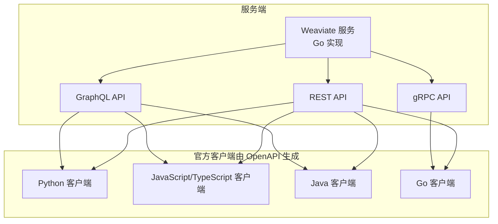
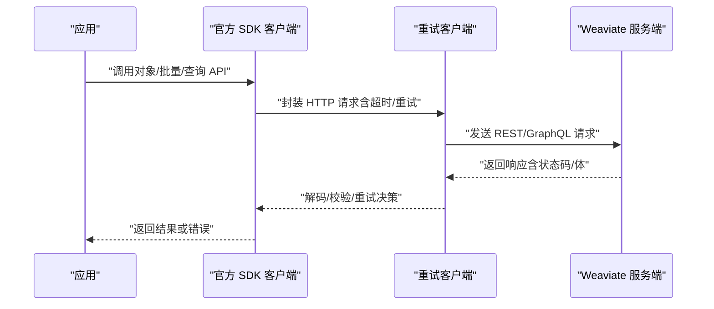
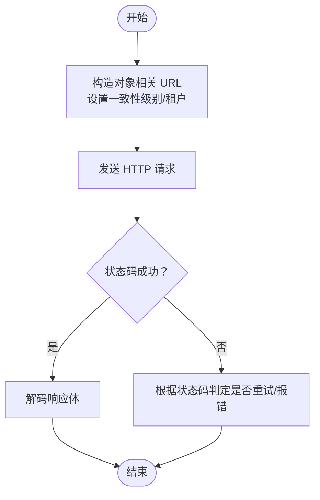
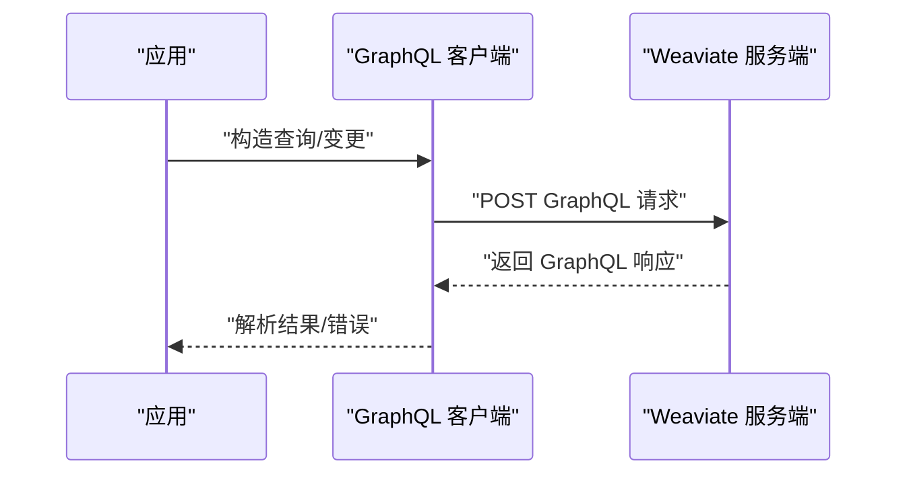
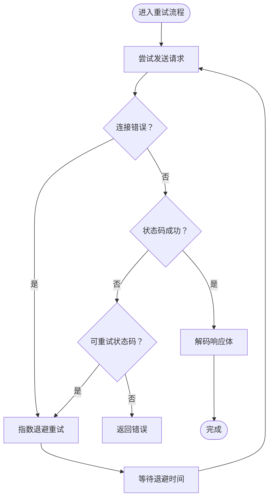
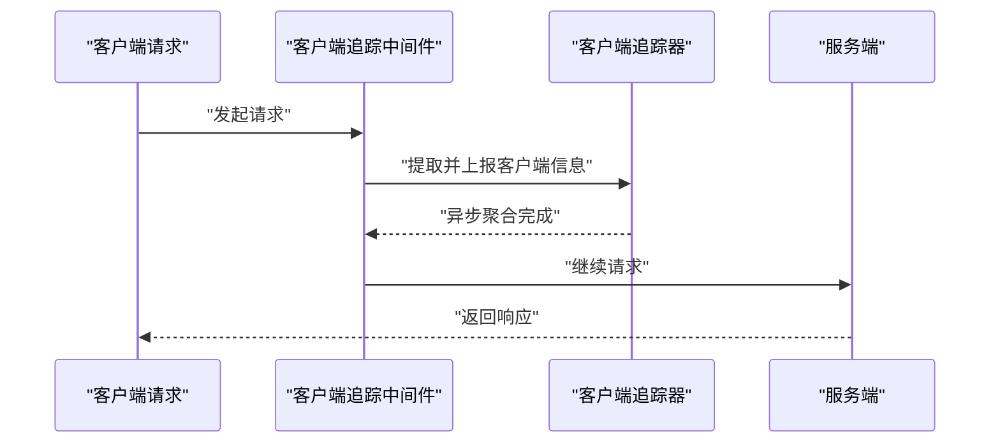
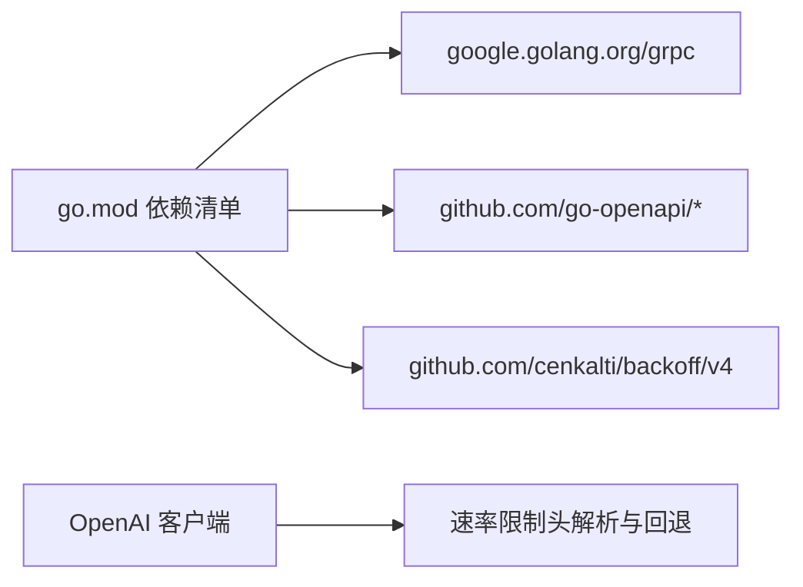

# SDK 功能对比

<cite>
**本文引用的文件**
- [README.md](file://README.md)
- [client_tracker.go](file://usecases/telemetry/client_tracker.go)
- [client_middleware.go](file://usecases/telemetry/client_middleware.go)
- [client.go](file://adapters/clients/client.go)
- [graphql_client.go](file://client/graphql/graphql_client.go)
- [objects_create_urlbuilder.go](file://adapters/handlers/rest/operations/objects/objects_create_urlbuilder.go)
- [objects_class_head_urlbuilder.go](file://adapters/handlers/rest/operations/objects/objects_class_head_urlbuilder.go)
- [client.go](file://test/benchmark_bm25/lib/client.go)
- [go.mod](file://go.mod)
- [openai.go](file://usecases/modulecomponents/clients/openai/openai.go)
</cite>

## 目录
1. [简介](#简介)
2. [项目结构](#项目结构)
3. [核心组件](#核心组件)
4. [架构总览](#架构总览)
5. [详细组件分析](#详细组件分析)
6. [依赖关系分析](#依赖关系分析)
7. [性能考量](#性能考量)
8. [故障排查指南](#故障排查指南)
9. [结论](#结论)
10. [附录](#附录)

## 简介
本文件面向技术决策者，系统化对比 Weaviate 官方四语言 SDK（Python、JavaScript/TypeScript、Java、Go）在核心功能上的实现差异，覆盖对象操作、批量处理、查询构建、错误处理等方面，并给出性能特点、适用场景、迁移建议、版本发布与兼容性策略、废弃功能处理以及社区支持与维护状态等评估依据。本文所有结论均基于仓库中的实现与文档证据。

## 项目结构
Weaviate 服务端以 Go 实现，官方客户端通过 Swagger/OpenAPI 代码生成器为各语言生成一致的 API 客户端骨架，辅以通用的重试与一致性控制逻辑。整体结构如下：

图表来源
- [README.md](file://README.md#L100-L110)
- [client.go](file://test/benchmark_bm25/lib/client.go#L17-L33)

章节来源
- [README.md](file://README.md#L98-L110)
- [client.go](file://test/benchmark_bm25/lib/client.go#L17-L33)

## 核心组件
- 统一的 HTTP 重试与超时机制：服务端适配层提供带指数退避的重试客户端，统一处理连接、读取、解码与状态码校验。
- 查询构建与 URL 构造：REST 操作参数通过 URL 构造器生成，支持一致性级别、租户等参数注入。
- GraphQL 客户端：统一的 GraphQL 提交与响应处理，包含类型安全的成功/失败分支。
- 客户端遥测与识别：服务端中间件与追踪器基于请求头识别各语言 SDK 类型与版本，用于统计与支持。

章节来源
- [client.go](file://adapters/clients/client.go#L26-L105)
- [objects_create_urlbuilder.go](file://adapters/handlers/rest/operations/objects/objects_create_urlbuilder.go#L49-L114)
- [objects_class_head_urlbuilder.go](file://adapters/handlers/rest/operations/objects/objects_class_head_urlbuilder.go#L56-L119)
- [graphql_client.go](file://client/graphql/graphql_client.go#L119-L136)
- [client_tracker.go](file://usecases/telemetry/client_tracker.go#L23-L43)

## 架构总览
下图展示客户端与服务端的交互路径及关键组件职责：

图表来源
- [client.go](file://adapters/clients/client.go#L31-L105)
- [objects_create_urlbuilder.go](file://adapters/handlers/rest/operations/objects/objects_create_urlbuilder.go#L49-L114)
- [graphql_client.go](file://client/graphql/graphql_client.go#L119-L136)

## 详细组件分析

### 对象操作（创建/读取/更新/删除/存在性检查）
- 参数与 URL 构造：REST 操作通过 URL 构造器生成路径与查询参数，支持一致性级别与租户字段；对象存在性 HEAD 请求用于检查资源是否存在。
- 一致性与租户：通过查询参数传递一致性级别与租户，确保跨节点一致性与多租户隔离。
- 错误处理：统一的状态码校验与错误包装，支持可重试条件判断。

图表来源
- [objects_create_urlbuilder.go](file://adapters/handlers/rest/operations/objects/objects_create_urlbuilder.go#L49-L114)
- [objects_class_head_urlbuilder.go](file://adapters/handlers/rest/operations/objects/objects_class_head_urlbuilder.go#L56-L119)
- [client.go](file://adapters/clients/client.go#L65-L91)

章节来源
- [objects_create_urlbuilder.go](file://adapters/handlers/rest/operations/objects/objects_create_urlbuilder.go#L49-L114)
- [objects_class_head_urlbuilder.go](file://adapters/handlers/rest/operations/objects/objects_class_head_urlbuilder.go#L56-L119)
- [client.go](file://adapters/clients/client.go#L65-L91)

### 批量处理（对象/引用）
- 批量对象创建/删除：通过批量客户端与参数对象实现，支持批量引用创建。
- 批量统计：批量响应包含统计信息，便于监控与可观测性。

章节来源
- [client.go](file://client/batch/batch_client.go#L1-L200)
- [client.go](file://client/batch/batch_objects_create_parameters.go#L1-L200)
- [client.go](file://client/batch/batch_objects_delete_parameters.go#L1-L200)
- [client.go](file://client/batch/batch_references_create_parameters.go#L1-L200)

### 查询构建（GraphQL/REST）
- GraphQL：统一的提交流程与响应类型分支，确保成功/失败路径清晰。
- REST：查询参数通过 URL 构造器注入，支持一致性级别、租户等。

图表来源
- [graphql_client.go](file://client/graphql/graphql_client.go#L119-L136)

章节来源
- [graphql_client.go](file://client/graphql/graphql_client.go#L119-L136)
- [objects_create_urlbuilder.go](file://adapters/handlers/rest/operations/objects/objects_create_urlbuilder.go#L49-L114)

### 错误处理与重试
- 指数退避重试：统一的重试器配置最小/最大退避时间与超时单位，支持可插拔的重试条件。
- 错误包装：连接、读取、解码、状态码不满足条件等场景均进行错误包装，便于定位问题。
- 可重试判定：根据状态码决定是否重试，避免对不可恢复错误重复尝试。

图表来源
- [client.go](file://adapters/clients/client.go#L31-L105)

章节来源
- [client.go](file://adapters/clients/client.go#L31-L105)

### 客户端识别与遥测
- 识别头：服务端通过请求头识别 SDK 类型与版本，支持 Python、Java、TypeScript、Go、C#。
- 中间件：HTTP 中间件在请求链路早期采集客户端信息，避免遗漏。
- 追踪器：后台 goroutine 聚合计数，提供获取与重置能力，线程安全且非阻塞热路径。

图表来源
- [client_middleware.go](file://usecases/telemetry/client_middleware.go#L18-L37)
- [client_tracker.go](file://usecases/telemetry/client_tracker.go#L45-L118)

章节来源
- [client_tracker.go](file://usecases/telemetry/client_tracker.go#L23-L43)
- [client_middleware.go](file://usecases/telemetry/client_middleware.go#L18-L37)
- [client_tracker.go](file://usecases/telemetry/client_tracker.go#L183-L200)

## 依赖关系分析
- Go 语言运行时与生态：服务端使用 Go 1.25，广泛依赖 gRPC、OpenAPI、backoff 等库，体现高性能与稳定性的工程实践。
- 外部模块与速率限制：模块组件对 OpenAI 等外部服务的速率限制头进行解析与回退策略处理，保障稳定性。

图表来源
- [go.mod](file://go.mod#L3-L106)
- [openai.go](file://usecases/modulecomponents/clients/openai/openai.go#L367-L386)

章节来源
- [go.mod](file://go.mod#L3-L106)
- [openai.go](file://usecases/modulecomponents/clients/openai/openai.go#L367-L386)

## 性能考量
- 重试与超时：统一的指数退避与超时控制，有助于在不稳定网络环境下提升成功率与稳定性。
- 并发与非阻塞：客户端追踪器采用通道与后台 goroutine，避免热路径加锁，适合高并发场景。
- gRPC 与 REST：Go 客户端同时支持 gRPC 与 REST，可根据延迟与吞吐需求选择；gRPC 在低延迟场景通常更优。

章节来源
- [client.go](file://adapters/clients/client.go#L93-L105)
- [client_tracker.go](file://usecases/telemetry/client_tracker.go#L45-L118)
- [README.md](file://README.md#L100-L110)

## 故障排查指南
- 状态码与错误信息：当状态码不满足预期时，会返回包含响应体的错误，便于定位问题。
- 连接与解码错误：连接失败与响应体解码失败均有明确错误包装，便于区分网络与协议问题。
- 重试策略：确认是否为可重试状态码，避免对幂等性未知的请求重复尝试。
- 客户端识别：若需定位 SDK 版本与类型，可通过服务端中间件输出的客户端信息辅助诊断。

章节来源
- [client.go](file://adapters/clients/client.go#L65-L91)
- [client_middleware.go](file://usecases/telemetry/client_middleware.go#L18-L37)
- [client_tracker.go](file://usecases/telemetry/client_tracker.go#L183-L200)

## 结论
- 统一性：官方 SDK 均基于 OpenAPI 生成，核心 API 表面一致，便于跨语言迁移。
- 可靠性：统一的重试与错误处理机制，配合一致性级别与租户参数，满足生产环境要求。
- 选择建议：Go 客户端在性能与生态契合度上具备优势；Python/TypeScript/Java 客户端在各自生态成熟度与开发效率上各有侧重；最终选择应结合团队技术栈、性能需求与运维偏好。

## 附录

### SDK 功能对比表（基于仓库实现与文档证据）
- 对象操作
  - Python/TypeScript/Java/Go：均通过 REST/GraphQL 提供一致的 CRUD 与存在性检查能力；支持一致性级别与租户参数。
  - 参考：对象 URL 构造、HEAD 请求、GraphQL 客户端。
- 批量处理
  - Python/TypeScript/Java/Go：提供批量对象与引用的创建/删除接口，响应包含统计信息。
  - 参考：批量客户端与参数对象。
- 查询构建
  - Python/TypeScript/Java/Go：GraphQL 客户端统一处理查询/变更；REST 查询参数通过 URL 构造器注入。
  - 参考：GraphQL 客户端、REST URL 构造器。
- 错误处理
  - Python/TypeScript/Java/Go：统一的重试、超时、状态码校验与错误包装；可重试条件由状态码决定。
  - 参考：重试客户端实现。
- 性能特点
  - Go 客户端：支持 gRPC 与 REST，适合低延迟与高吞吐场景；并发追踪器非阻塞热路径。
  - Python/TypeScript/Java：生态成熟，开发效率高；性能取决于具体实现与网络环境。
  - 参考：客户端追踪器、gRPC 客户端。
- 适用场景
  - Go：云原生、微服务、高并发、低延迟。
  - Python：数据科学、原型开发、脚本化任务。
  - TypeScript：前端/全栈、Node.js 后端。
  - Java：企业级应用、Spring 生态。
- 迁移指南（跨语言）
  - API 表面一致：优先复用同一套查询/批量/对象操作模式。
  - 注意点：URL 参数（一致性级别、租户）、GraphQL 响应类型分支、重试策略与错误包装。
  - 参考：URL 构造器、GraphQL 客户端、重试客户端。
- 版本发布与兼容性
  - 客户端识别：服务端通过请求头识别 SDK 类型与版本，便于统计与支持。
  - 参考：客户端追踪器与中间件。
- 废弃功能处理
  - 未在仓库中发现针对 SDK 的显式废弃声明；建议关注服务端版本变更与客户端升级日志。
- 社区支持与维护状态
  - 官方文档明确列出 Python/TypeScript/Java/Go 官方 SDK；服务端包含客户端追踪与中间件，体现对多 SDK 的支持与观测。
  - 参考：README 客户端库列表、客户端追踪器。

章节来源
- [README.md](file://README.md#L98-L110)
- [client_tracker.go](file://usecases/telemetry/client_tracker.go#L23-L43)
- [client_middleware.go](file://usecases/telemetry/client_middleware.go#L18-L37)
- [client.go](file://adapters/clients/client.go#L31-L105)
- [graphql_client.go](file://client/graphql/graphql_client.go#L119-L136)
- [objects_create_urlbuilder.go](file://adapters/handlers/rest/operations/objects/objects_create_urlbuilder.go#L49-L114)
- [objects_class_head_urlbuilder.go](file://adapters/handlers/rest/operations/objects/objects_class_head_urlbuilder.go#L56-L119)