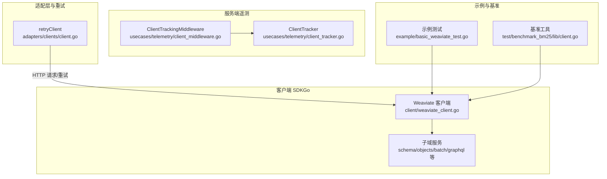
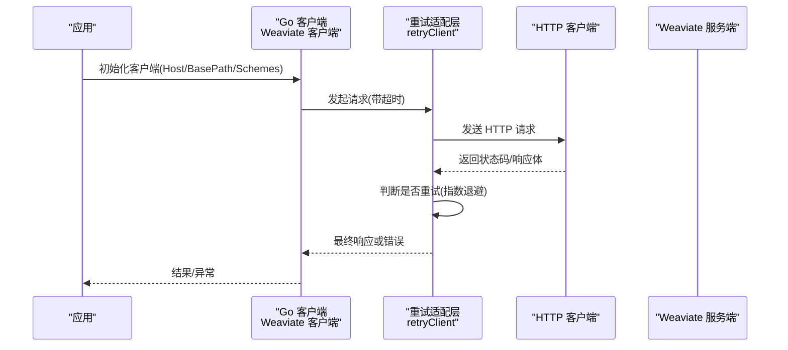
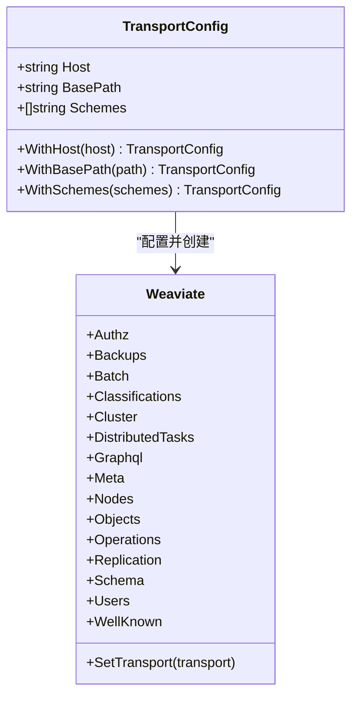
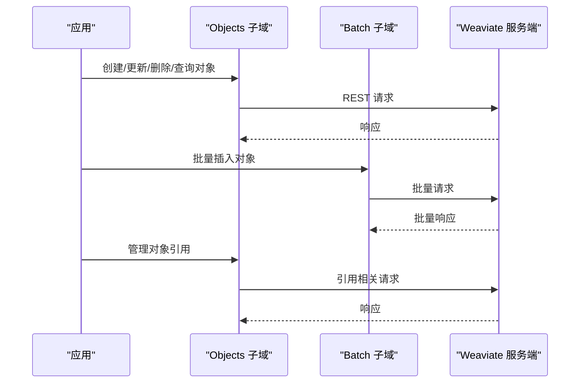
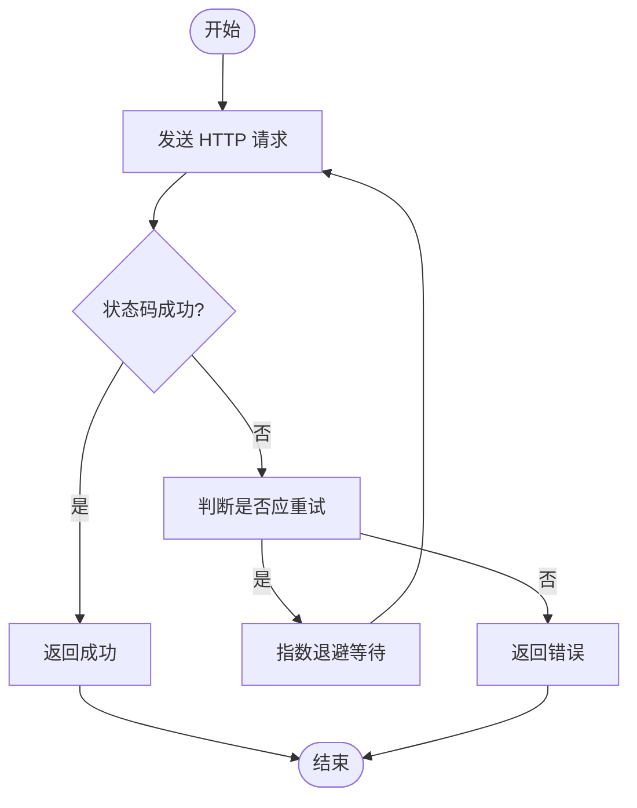
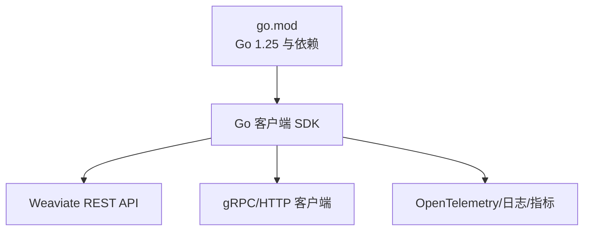

# 客户端 SDK

<cite>
**本文引用的文件**
- [README.md](file://README.md)
- [go.mod](file://go.mod)
- [example/basic_weaviate_test.go](file://example/basic_weaviate_test.go)
- [adapters/clients/client.go](file://adapters/clients/client.go)
- [client/weaviate_client.go](file://client/weaviate_client.go)
- [usecases/telemetry/client_tracker.go](file://usecases/telemetry/client_tracker.go)
- [usecases/telemetry/client_middleware.go](file://usecases/telemetry/client_middleware.go)
- [usecases/telemetry/telemetry_test.go](file://usecases/telemetry/telemetry_test.go)
- [cluster/rpc/client.go](file://cluster/rpc/client.go)
- [test/benchmark_bm25/lib/client.go](file://test/benchmark_bm25/lib/client.go)
</cite>

## 目录
1. [简介](#简介)
2. [项目结构](#项目结构)
3. [核心组件](#核心组件)
4. [架构总览](#架构总览)
5. [详细组件分析](#详细组件分析)
6. [依赖分析](#依赖分析)
7. [性能考虑](#性能考虑)
8. [故障排除指南](#故障排除指南)
9. [结论](#结论)
10. [附录](#附录)

## 简介
本文件面向客户端开发者，系统化梳理 Weaviate 官方客户端 SDK 的使用与集成要点，覆盖 Python、JavaScript/TypeScript、Java、Go 等语言版本的安装、配置、初始化、核心功能（对象操作、批量处理、查询构建、错误处理）、异步/同步模式、连接池与重试机制、版本管理与迁移、性能优化与故障排除等主题。文档同时给出与仓库中现有实现相对应的架构视图与流程图，帮助读者快速定位源码位置并进行二次开发与集成。

## 项目结构
Weaviate 服务端仓库中包含多个与客户端 SDK 相关的关键模块：
- 官方 Go 客户端：由 Swagger/OpenAPI 生成的 HTTP 客户端，统一聚合各子域（schema、objects、batch、graphql、meta 等），并通过 TransportConfig 统一配置主机、路径与协议。
- 服务端遥测与追踪：用于识别与统计不同语言客户端 SDK 的类型与版本，便于生态观测与兼容性分析。
- 适配层与重试：底层 HTTP 客户端封装了可配置的指数退避重试逻辑，提升网络波动下的稳定性。
- 示例与基准：提供基础的 Go 客户端使用示例与从 URL 解析配置的通用方法，便于快速上手与集成。

**图表来源**
- [client/weaviate_client.go](file://client/weaviate_client.go#L140-L194)
- [usecases/telemetry/client_tracker.go](file://usecases/telemetry/client_tracker.go#L45-L118)
- [usecases/telemetry/client_middleware.go](file://usecases/telemetry/client_middleware.go#L18-L37)
- [adapters/clients/client.go](file://adapters/clients/client.go#L26-L105)
- [example/basic_weaviate_test.go](file://example/basic_weaviate_test.go#L14-L118)
- [test/benchmark_bm25/lib/client.go](file://test/benchmark_bm25/lib/client.go#L20-L34)

**章节来源**
- [README.md](file://README.md#L98-L110)
- [client/weaviate_client.go](file://client/weaviate_client.go#L140-L194)

## 核心组件
- 官方 Go 客户端
  - 通过 TransportConfig 统一设置 Host、BasePath、Schemes，并在 NewHTTPClientWithConfig 中创建 Transport。
  - 将各子域服务（schema、objects、batch、graphql、meta、nodes、cluster、backups、users、well_known 等）注入到 Weaviate 结构体，形成统一入口。
  - 参考路径：[client/weaviate_client.go](file://client/weaviate_client.go#L56-L99)

- 服务端遥测与客户端识别
  - ClientType 枚举定义了已知客户端类型（python、java、csharp、typescript、go）。
  - ClientTracker 以通道与后台 goroutine 实现高并发下的非阻塞计数；ClientTrackingMiddleware 作为 HTTP 中间件，从请求头提取客户端标识并上报。
  - 参考路径：
    - [usecases/telemetry/client_tracker.go](file://usecases/telemetry/client_tracker.go#L23-L69)
    - [usecases/telemetry/client_middleware.go](file://usecases/telemetry/client_middleware.go#L18-L37)
    - [usecases/telemetry/telemetry_test.go](file://usecases/telemetry/telemetry_test.go#L782-L814)

- 适配层与重试机制
  - retryClient 包装标准 http.Client，提供带超时的请求执行与可配置重试策略；内部使用 backoff 库实现指数退避。
  - 参考路径：[adapters/clients/client.go](file://adapters/clients/client.go#L26-L105)

- 示例与基准工具
  - 示例测试展示连接、模式管理、批量插入与错误处理的基本流程。
  - 基准工具提供从 origin URL 解析出 scheme/host 并构造客户端的通用方法。
  - 参考路径：
    - [example/basic_weaviate_test.go](file://example/basic_weaviate_test.go#L14-L118)
    - [test/benchmark_bm25/lib/client.go](file://test/benchmark_bm25/lib/client.go#L20-L34)

**章节来源**
- [client/weaviate_client.go](file://client/weaviate_client.go#L56-L99)
- [usecases/telemetry/client_tracker.go](file://usecases/telemetry/client_tracker.go#L23-L69)
- [usecases/telemetry/client_middleware.go](file://usecases/telemetry/client_middleware.go#L18-L37)
- [adapters/clients/client.go](file://adapters/clients/client.go#L26-L105)
- [example/basic_weaviate_test.go](file://example/basic_weaviate_test.go#L14-L118)
- [test/benchmark_bm25/lib/client.go](file://test/benchmark_bm25/lib/client.go#L20-L34)

## 架构总览
下图展示客户端 SDK 与服务端之间的交互关系，以及重试与遥测在调用链中的位置。

**图表来源**
- [client/weaviate_client.go](file://client/weaviate_client.go#L56-L99)
- [adapters/clients/client.go](file://adapters/clients/client.go#L26-L105)

**章节来源**
- [client/weaviate_client.go](file://client/weaviate_client.go#L56-L99)
- [adapters/clients/client.go](file://adapters/clients/client.go#L26-L105)

## 详细组件分析

### Go 客户端初始化与配置
- TransportConfig 支持动态覆盖默认 Host/BasePath/Schemes，适合多环境部署与自定义网关。
- NewHTTPClientWithConfig 创建 Transport 并注入子域服务，SetTransport 可在运行时切换 Transport。
- 参考路径：
  - [client/weaviate_client.go](file://client/weaviate_client.go#L101-L138)
  - [client/weaviate_client.go](file://client/weaviate_client.go#L175-L194)

**图表来源**
- [client/weaviate_client.go](file://client/weaviate_client.go#L101-L138)
- [client/weaviate_client.go](file://client/weaviate_client.go#L140-L194)

**章节来源**
- [client/weaviate_client.go](file://client/weaviate_client.go#L101-L138)
- [client/weaviate_client.go](file://client/weaviate_client.go#L175-L194)

### 对象操作与批量处理
- 对象 CRUD 与引用管理：objects 子域提供对象的增删改查与引用的创建/更新/删除。
- 批量处理：batch 子域提供批量对象与批量引用的创建，适合高吞吐写入。
- 示例测试展示了 Schema 管理、批量插入与错误处理的典型流程。
- 参考路径：
  - [example/basic_weaviate_test.go](file://example/basic_weaviate_test.go#L31-L101)

**图表来源**
- [example/basic_weaviate_test.go](file://example/basic_weaviate_test.go#L31-L101)

**章节来源**
- [example/basic_weaviate_test.go](file://example/basic_weaviate_test.go#L31-L101)

### 查询构建与 GraphQL
- GraphQL 子域提供批量与单次查询能力，适合复杂组合查询与聚合。
- 参考路径：
  - [client/weaviate_client.go](file://client/weaviate_client.go#L89-L89)

**章节来源**
- [client/weaviate_client.go](file://client/weaviate_client.go#L89-L89)

### 错误处理与重试
- retryClient 内部封装了带超时的请求与指数退避重试，根据状态码判断是否需要重试。
- 参考路径：[adapters/clients/client.go](file://adapters/clients/client.go#L26-L105)

**图表来源**
- [adapters/clients/client.go](file://adapters/clients/client.go#L26-L105)

**章节来源**
- [adapters/clients/client.go](file://adapters/clients/client.go#L26-L105)

### 遥测与客户端识别
- ClientTrackingMiddleware 从请求头提取客户端类型与版本，ClientTracker 以通道聚合计数，避免锁竞争。
- 参考路径：
  - [usecases/telemetry/client_middleware.go](file://usecases/telemetry/client_middleware.go#L18-L37)
  - [usecases/telemetry/client_tracker.go](file://usecases/telemetry/client_tracker.go#L45-L118)
  - [usecases/telemetry/telemetry_test.go](file://usecases/telemetry/telemetry_test.go#L782-L814)

**章节来源**
- [usecases/telemetry/client_middleware.go](file://usecases/telemetry/client_middleware.go#L18-L37)
- [usecases/telemetry/client_tracker.go](file://usecases/telemetry/client_tracker.go#L45-L118)
- [usecases/telemetry/telemetry_test.go](file://usecases/telemetry/telemetry_test.go#L782-L814)

### gRPC 客户端（集群/节点）
- 集群 RPC 客户端封装了与 RAFT 集群节点的通信，包含连接管理、地址解析、消息大小限制与 Sentry 集成等特性。
- 参考路径：[cluster/rpc/client.go](file://cluster/rpc/client.go#L100-L123)

**章节来源**
- [cluster/rpc/client.go](file://cluster/rpc/client.go#L100-L123)

## 依赖分析
- Go 版本与模块
  - go.mod 显示项目使用 Go 1.25，包含大量第三方依赖（如 AWS、GCS、OpenTelemetry、gRPC、backoff 等），为客户端 SDK 的网络与可观测性能力提供支撑。
- 客户端 SDK 与服务端的耦合点
  - Go 客户端通过 OpenAPI 生成的 Transport 与服务端 REST API 交互；遥测中间件与服务端统计配合，用于生态观测。

**图表来源**
- [go.mod](file://go.mod#L1-L274)
- [client/weaviate_client.go](file://client/weaviate_client.go#L56-L99)

**章节来源**
- [go.mod](file://go.mod#L1-L274)
- [client/weaviate_client.go](file://client/weaviate_client.go#L56-L99)

## 性能考虑
- 连接与传输
  - 使用 TransportConfig 自定义 BasePath 与 Schemes，结合服务端网关/反向代理可优化 TLS 与路由。
  - 参考路径：[client/weaviate_client.go](file://client/weaviate_client.go#L101-L138)
- 重试与超时
  - retryClient 的指数退避与超时控制有助于在网络抖动时稳定吞吐；建议根据业务延迟预算调整重试次数与超时。
  - 参考路径：[adapters/clients/client.go](file://adapters/clients/client.go#L26-L105)
- 批量写入
  - 使用 batch 子域进行批量插入，显著降低请求开销；示例测试展示了批量插入与校验。
  - 参考路径：[example/basic_weaviate_test.go](file://example/basic_weaviate_test.go#L90-L101)
- gRPC 与集群
  - 集群 RPC 客户端支持最大消息大小配置与 Sentry 集成，适合高吞吐与强一致读取场景。
  - 参考路径：[cluster/rpc/client.go](file://cluster/rpc/client.go#L100-L123)

**章节来源**
- [client/weaviate_client.go](file://client/weaviate_client.go#L101-L138)
- [adapters/clients/client.go](file://adapters/clients/client.go#L26-L105)
- [example/basic_weaviate_test.go](file://example/basic_weaviate_test.go#L90-L101)
- [cluster/rpc/client.go](file://cluster/rpc/client.go#L100-L123)

## 故障排除指南
- 常见问题与定位
  - 连接失败：检查 Host 与 Schemes 是否匹配服务端暴露端口；确认防火墙与 TLS 配置。
  - 超时与重试：适当增大超时时间与重试上限；关注指数退避策略对延迟的影响。
  - 批量错误：逐条校验对象属性与引用格式；参考示例测试中的错误断言方式。
  - 遥测与版本：通过 ClientTrackingMiddleware 与 ClientTracker 确认客户端类型与版本上报是否正常。
- 参考路径：
  - [example/basic_weaviate_test.go](file://example/basic_weaviate_test.go#L103-L110)
  - [usecases/telemetry/client_middleware.go](file://usecases/telemetry/client_middleware.go#L18-L37)
  - [usecases/telemetry/client_tracker.go](file://usecases/telemetry/client_tracker.go#L45-L118)

**章节来源**
- [example/basic_weaviate_test.go](file://example/basic_weaviate_test.go#L103-L110)
- [usecases/telemetry/client_middleware.go](file://usecases/telemetry/client_middleware.go#L18-L37)
- [usecases/telemetry/client_tracker.go](file://usecases/telemetry/client_tracker.go#L45-L118)

## 结论
Weaviate 官方 Go 客户端以 TransportConfig 为中心，统一承载多子域服务与 REST API 交互；配合指数退避重试与遥测中间件，既保证了稳定性也便于生态观测。结合示例测试与基准工具，开发者可快速完成从连接、模式管理、批量写入到查询与错误处理的全链路集成。对于更高吞吐与一致性需求，可结合集群 RPC 客户端与服务端配置进一步优化。

## 附录
- 安装与入门
  - README 提供了多语言客户端链接与基础示例，建议优先参考对应语言官方文档。
  - 参考路径：[README.md](file://README.md#L98-L110)
- 从 URL 构造客户端
  - 基准工具展示了从 origin URL 解析 scheme/host 的通用方法，便于在多环境部署中复用。
  - 参考路径：[test/benchmark_bm25/lib/client.go](file://test/benchmark_bm25/lib/client.go#L20-L34)

**章节来源**
- [README.md](file://README.md#L98-L110)
- [test/benchmark_bm25/lib/client.go](file://test/benchmark_bm25/lib/client.go#L20-L34)