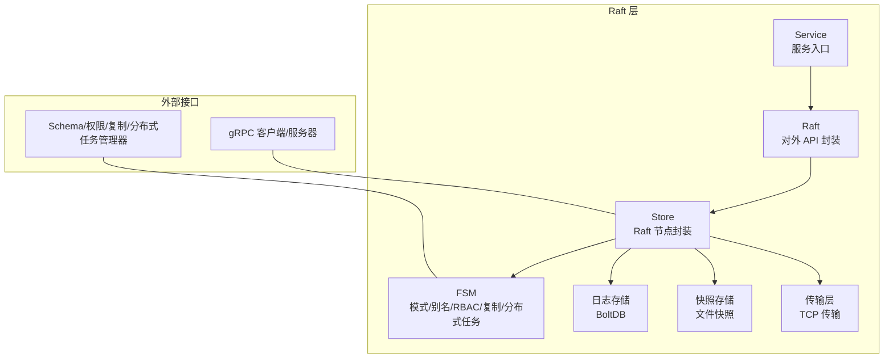
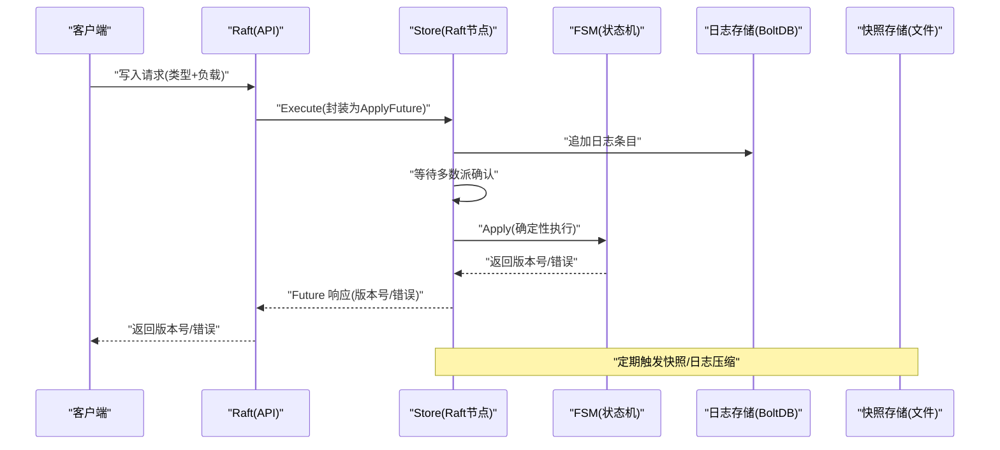
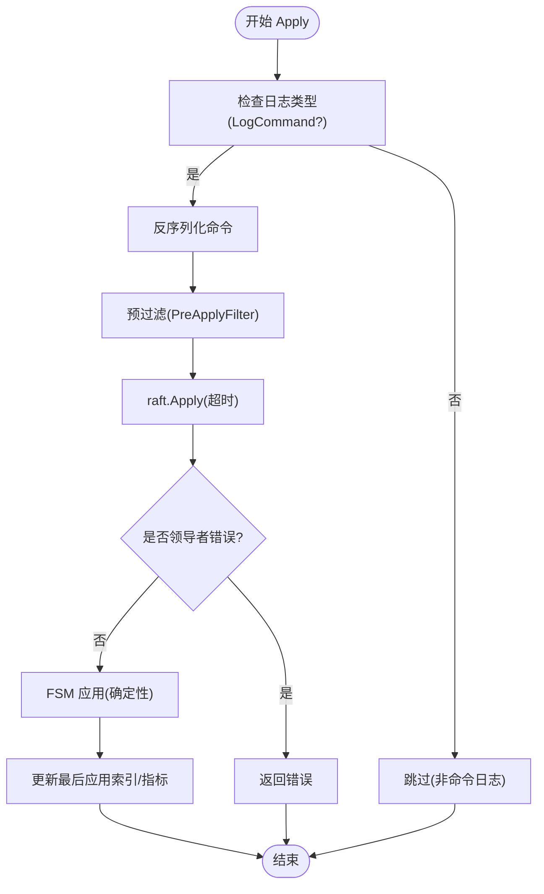
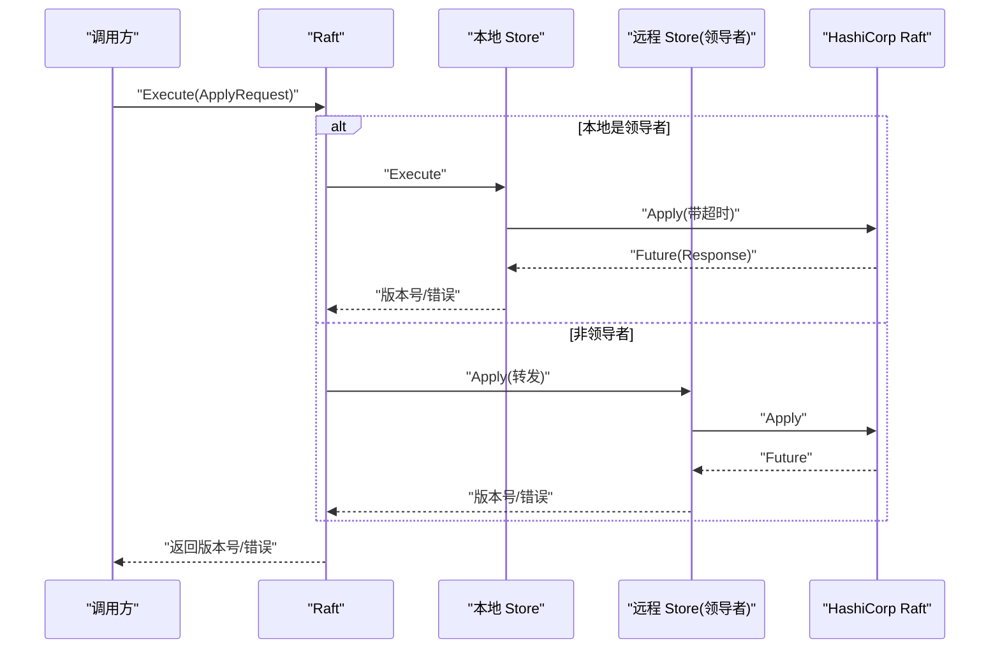
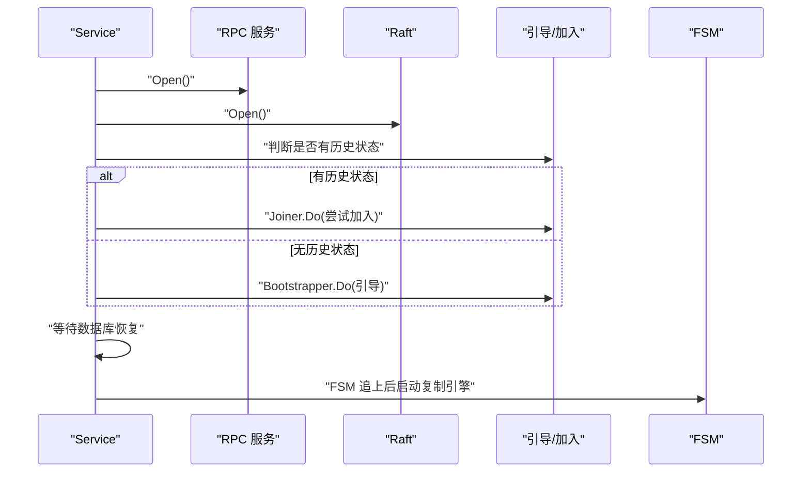
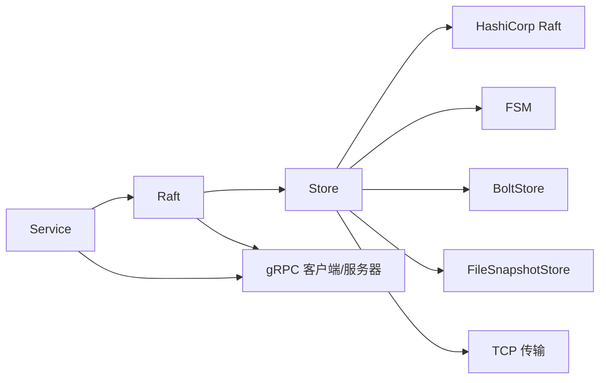

# Raft 一致性协议

<cite>
**本文引用的文件**
- [cluster/raft.go](file://cluster/raft.go)
- [cluster/service.go](file://cluster/service.go)
- [cluster/store.go](file://cluster/store.go)
- [cluster/store_apply.go](file://cluster/store_apply.go)
- [cluster/store_snapshot.go](file://cluster/store_snapshot.go)
- [cluster/store_cluster_rpc.go](file://cluster/store_cluster_rpc.go)
- [cluster/raft_apply_endpoints.go](file://cluster/raft_apply_endpoints.go)
- [cluster/raft_cluster_endpoints.go](file://cluster/raft_cluster_endpoints.go)
- [cluster/bootstrap/joiner.go](file://cluster/bootstrap/joiner.go)
- [cluster/fsm/snapshot.go](file://cluster/fsm/snapshot.go)
- [usecases/config/config_handler.go](file://usecases/config/config_handler.go)
- [usecases/monitoring/prometheus.go](file://usecases/monitoring/prometheus.go)
</cite>

## 目录
1. [引言](#引言)
2. [项目结构](#项目结构)
3. [核心组件](#核心组件)
4. [架构总览](#架构总览)
5. [详细组件分析](#详细组件分析)
6. [依赖关系分析](#依赖关系分析)
7. [性能考量](#性能考量)
8. [故障排查指南](#故障排查指南)
9. [结论](#结论)
10. [附录](#附录)

## 引言
本文件系统性梳理 Weaviate 在分布式场景下对 HashiCorp Raft 的实现与集成，覆盖领导者选举、日志复制、状态机复制、快照与日志压缩、成员管理与重新配置、以及在分布式向量数据库中的特殊考虑（如多租户、分片、复制与分布式任务）。文档同时给出配置参数说明、性能调优建议、监控指标与常见问题排查路径，帮助读者从原理到实践全面理解 Weaviate 的 Raft 子系统。

## 项目结构
Weaviate 的 Raft 子系统主要位于 cluster 包中，围绕 Store（Raft 节点封装）、Raft（对外 API 封装）、Service（服务入口）三大构件协同工作，并通过 FSM（状态机）承载模式、别名、RBAC、动态用户、复制与分布式任务等子系统的状态持久化与恢复。

图示来源
- [cluster/service.go](file://cluster/service.go#L69-L117)
- [cluster/raft.go](file://cluster/raft.go#L44-L99)
- [cluster/store.go](file://cluster/store.go#L384-L464)

章节来源
- [cluster/service.go](file://cluster/service.go#L46-L117)
- [cluster/raft.go](file://cluster/raft.go#L26-L99)
- [cluster/store.go](file://cluster/store.go#L191-L255)

## 核心组件
- Service：Raft 层主入口，负责初始化 RPC 服务、构建 Raft FSM、启动复制引擎、引导与恢复流程。
- Raft：对外 API 封装，屏蔽底层节点选择与远程调用细节，统一提供写入、查询、成员管理等能力。
- Store：HashiCorp Raft 节点的具体实现，负责日志/快照存储、状态机应用、领导者检测、配置变更、一致性等待等。
- FSM：状态机，聚合模式（Schema）、别名、RBAC、动态用户、复制与分布式任务的状态与快照能力。
- 配置与监控：通过 usecases/config 提供 Raft 参数校验与默认值；通过 Prometheus 暴露 Schema 写入/读取与等待版本等指标。

章节来源
- [cluster/service.go](file://cluster/service.go#L46-L117)
- [cluster/raft.go](file://cluster/raft.go#L26-L99)
- [cluster/store.go](file://cluster/store.go#L191-L255)
- [cluster/fsm/snapshot.go](file://cluster/fsm/snapshot.go#L14-L44)
- [usecases/config/config_handler.go](file://usecases/config/config_handler.go#L573-L600)
- [usecases/monitoring/prometheus.go](file://usecases/monitoring/prometheus.go#L780-L797)

## 架构总览
Weaviate 的 Raft 架构以 Store 为核心，围绕其构建 Raft 节点，使用 BoltDB 作为日志存储、文件系统作为快照存储，通过 TCP 传输进行节点间通信。Service 负责引导与恢复、RPC 服务启停、复制引擎生命周期管理；Raft 对外暴露统一的 Apply/Query/Join/Remove 接口；FSM 承载多类状态（Schema、别名、RBAC、动态用户、复制、分布式任务），并支持快照与恢复。

图示来源
- [cluster/raft_apply_endpoints.go](file://cluster/raft_apply_endpoints.go#L279-L326)
- [cluster/store_apply.go](file://cluster/store_apply.go#L27-L61)
- [cluster/store.go](file://cluster/store.go#L384-L387)

## 详细组件分析

### Store：Raft 节点封装与状态机应用
- 初始化与存储
  - 日志存储：使用 BoltDB（raft-boltdb）作为后端，配合内存日志缓存提升性能。
  - 快照存储：使用文件系统快照，保留最近若干份快照。
  - 传输层：基于 TCP 的 NetworkTransport，支持连接池与超时控制。
- Raft 配置
  - 支持自定义心跳/选举/领导租约超时，以及快照间隔、阈值、尾部日志数等。
  - 可通过乘数调整超时，以适应跨数据中心或高延迟网络。
- 状态机应用
  - Apply 严格保证幂等与确定性，按日志顺序执行，区分 schemaOnly 与非 schemaOnly 场景，避免重启时重复落盘。
  - 维护 raftLastAppliedIndex 与 fsmLastAppliedIndex 指标，用于观测一致性进度。
- 成员管理与重新配置
  - Join/Remove/Notify 提供添加/移除节点与引导集群的能力，仅领导者可提交配置变更。
- 快照与恢复
  - Snapshot/Persist/Restore 将 Schema、别名、RBAC、动态用户、复制与分布式任务状态打包为快照，支持向前兼容的旧格式恢复。
- 一致性等待
  - WaitForAppliedIndex 提供按版本号等待一致性，结合 ConsistencyWaitTimeout 控制等待上限。

图示来源
- [cluster/store_apply.go](file://cluster/store_apply.go#L77-L152)

章节来源
- [cluster/store.go](file://cluster/store.go#L419-L464)
- [cluster/store.go](file://cluster/store.go#L735-L785)
- [cluster/store_apply.go](file://cluster/store_apply.go#L27-L152)
- [cluster/store_snapshot.go](file://cluster/store_snapshot.go#L27-L98)
- [cluster/store_cluster_rpc.go](file://cluster/store_cluster_rpc.go#L23-L102)

### Raft：对外 API 封装
- 写入流程
  - 本地领导者直接调用 Store.Execute；非领导者则转发至领导者，内部采用指数退避重试，重试上限与选举超时相关。
  - 写入成功返回版本号，用于后续一致性等待。
- 查询与统计
  - 提供 LeaderWithID、StorageCandidates、Stats 等查询接口，便于上层路由与可观测性。
- 关闭流程
  - 非投票节点关闭前自动从集群移除，避免影响选举。

图示来源
- [cluster/raft_apply_endpoints.go](file://cluster/raft_apply_endpoints.go#L279-L326)
- [cluster/raft.go](file://cluster/raft.go#L48-L99)

章节来源
- [cluster/raft.go](file://cluster/raft.go#L26-L99)
- [cluster/raft_apply_endpoints.go](file://cluster/raft_apply_endpoints.go#L32-L326)

### Service：服务入口与引导
- 启动阶段
  - 初始化 RPC 客户端/服务器，构建 FSM（含 Schema、RBAC、动态用户、复制、分布式任务管理器）。
  - 判断是否存在已有 Raft 状态：若存在则尝试加入 join 列表；否则进入引导流程，等待足够候选节点后 BootstrapCluster。
- 复制引擎
  - 当 FSM 追上后启动复制引擎，负责副本复制、迁移与状态同步。
- 关闭阶段
  - 若当前为领导者且集群规模>1，优先进行领导权移交；随后依次关闭 RPC、Raft、日志存储与 Schema 数据库。

图示来源
- [cluster/service.go](file://cluster/service.go#L149-L209)
- [cluster/bootstrap/joiner.go](file://cluster/bootstrap/joiner.go#L44-L114)

章节来源
- [cluster/service.go](file://cluster/service.go#L46-L209)
- [cluster/bootstrap/joiner.go](file://cluster/bootstrap/joiner.go#L27-L114)

### 快照与日志压缩
- 快照内容
  - 包含 Schema、别名、RBAC、动态用户、分布式任务与复制操作状态，支持向前兼容的旧格式恢复。
- 触发条件
  - 由 Raft 配置的 SnapshotInterval 与 SnapshotThreshold 控制；TrailingLogs 控制保留尾部日志数量，便于快速追赶。
- 压缩策略
  - 通过快照与尾部日志策略减少磁盘占用与追赶时间；Store 在恢复后根据需要重载数据库。

章节来源
- [cluster/store_snapshot.go](file://cluster/store_snapshot.go#L27-L98)
- [cluster/store_snapshot.go](file://cluster/store_snapshot.go#L100-L201)
- [cluster/fsm/snapshot.go](file://cluster/fsm/snapshot.go#L14-L44)
- [cluster/store.go](file://cluster/store.go#L103-L122)

### 成员管理与重新配置
- 加入/移除
  - 仅领导者可提交 AddVoter/AddNonvoter/RemoveServer；非领导者会返回错误并提示领导者地址。
- 引导
  - 当节点具备投票权且未引导且达到预期候选数量时，收集候选节点并 BootstrapCluster。
- 通知
  - Notify 记录候选节点，当达到 BootstrapExpect 后一次性引导，避免多次引导。

章节来源
- [cluster/store_cluster_rpc.go](file://cluster/store_cluster_rpc.go#L23-L102)

### 领导者变更与网络分区处理
- 领导权移交
  - 关闭前若为领导者且集群规模>1，先执行领导权移交，降低停机窗口内的写入中断风险。
- 网络分区
  - 通过一致性等待与重试策略缓解短暂分区；长时间分区下，新领导者将继续推进共识，旧领导者在恢复后成为跟随者。
- 一元节点恢复
  - 支持启用/强制单节点恢复，避免错误的配置导致无法达成法定人数。

章节来源
- [cluster/store.go](file://cluster/store.go#L525-L534)
- [cluster/store.go](file://cluster/store.go#L389-L395)

### 分布式向量数据库的特殊考虑
- 多租户与分片
  - 通过 UpdateShardStatus、AddReplicaToShard、DeleteReplicaFromShard 等命令协调分片状态与副本数量，保障跨节点一致性。
- 复制与分布式任务
  - 复制引擎在 FSM 追上后启动，负责副本复制、迁移与取消；分布式任务管理器支持任务注册、完成记录与清理。
- 元数据仅投票节点
  - 支持 MetadataOnlyVoters，仅参与投票不加载本地数据，降低资源占用并加速选举。

章节来源
- [cluster/raft_apply_endpoints.go](file://cluster/raft_apply_endpoints.go#L198-L213)
- [cluster/raft_apply_endpoints.go](file://cluster/raft_apply_endpoints.go#L113-L153)
- [cluster/store.go](file://cluster/store.go#L140-L141)

## 依赖关系分析
- 组件耦合
  - Service 依赖 Raft、FSM、RPC 客户端/服务器与管理器集合；Raft 依赖 Store 与 RPC 客户端；Store 依赖 Raft 库、日志/快照存储与传输层。
- 外部依赖
  - 使用 HashiCorp Raft、Prometheus 指标、Sentry（可选）与 BoltDB 文件存储。
- 循环依赖
  - 未发现循环依赖；各模块职责清晰，接口边界明确。

图示来源
- [cluster/service.go](file://cluster/service.go#L69-L117)
- [cluster/raft.go](file://cluster/raft.go#L44-L99)
- [cluster/store.go](file://cluster/store.go#L384-L464)

章节来源
- [cluster/service.go](file://cluster/service.go#L46-L117)
- [cluster/raft.go](file://cluster/raft.go#L26-L99)
- [cluster/store.go](file://cluster/store.go#L191-L255)

## 性能考量
- 超时与乘数
  - 通过 TimeoutsMultiplier 与 Heartbeat/Election/LeaderLease 超时组合，适配高延迟网络，减少频繁选举。
- 快照与日志压缩
  - 合理设置 SnapshotInterval/SnapshotThreshold/TrailingLogs，平衡追赶速度与磁盘占用。
- 并发与背压
  - Apply 流程在 Raft 内部串行化，避免并发冲突；FSM 应用函数在独立 goroutine 中执行并进行 panic 恢复。
- 指标观测
  - 通过 Prometheus 暴露 Apply 持续时间、失败计数、最后应用索引等关键指标，辅助容量规划与性能调优。

章节来源
- [cluster/store.go](file://cluster/store.go#L735-L785)
- [cluster/store_apply.go](file://cluster/store_apply.go#L80-L85)
- [usecases/monitoring/prometheus.go](file://usecases/monitoring/prometheus.go#L780-L797)

## 故障排查指南
- 无法找到领导者
  - 非领导者节点在 Apply 时会返回领导者错误；可通过 LeaderWithID 获取当前领导者地址。
- 一致性等待超时
  - WaitForAppliedIndex 在 ConsistencyWaitTimeout 到期后返回错误；检查集群健康与日志追赶进度。
- 快照/恢复异常
  - 检查快照编码/解码错误与各子系统恢复逻辑；必要时回滚到更早快照。
- 引导失败
  - 无历史状态时需满足 BootstrapExpect；有历史状态时使用 Joiner.Do 尝试加入现有集群。
- 单节点恢复
  - 启用 EnableOneNodeRecovery 或 ForceOneNodeRecovery，避免错误配置导致无法启动。

章节来源
- [cluster/raft_apply_endpoints.go](file://cluster/raft_apply_endpoints.go#L307-L323)
- [cluster/store.go](file://cluster/store.go#L598-L623)
- [cluster/store_snapshot.go](file://cluster/store_snapshot.go#L100-L201)
- [cluster/bootstrap/joiner.go](file://cluster/bootstrap/joiner.go#L44-L114)
- [cluster/store.go](file://cluster/store.go#L389-L395)

## 结论
Weaviate 的 Raft 实现以 Store 为核心，结合 Raft、FSM、日志/快照与 RPC 服务，提供了高可用、可扩展的分布式一致性基础。通过合理的超时与快照配置、完善的成员管理与重新配置能力、以及丰富的监控指标，Weaviate 能够在复杂网络环境下稳定运行，并为向量数据库的多租户、分片与复制场景提供可靠的一致性保障。

## 附录

### Raft 配置参数说明
- 超时与乘数
  - HeartbeatTimeout/ElectionTimeout/LeaderLeaseTimeout：心跳/选举/领导租约超时，建议在高延迟网络上调大并使用 TimeoutsMultiplier。
  - TimeoutsMultiplier：超时乘数，生产环境建议≥5。
- 快照与日志
  - SnapshotInterval：快照检查间隔（随机抖动范围为 [interval, 2×interval]）。
  - SnapshotThreshold：超过该阈值后触发快照。
  - TrailingLogs：快照后保留的尾部日志数，便于快速追赶。
- 引导与一致性
  - BootstrapTimeout/BootstrapExpect：引导阶段等待候选节点数量与超时。
  - ConsistencyWaitTimeout：一致性等待超时。
- 投票与恢复
  - Voter/MetadataOnlyVoters：是否参与投票与是否仅存储元数据。
  - EnableOneNodeRecovery/ForceOneNodeRecovery：启用/强制单节点恢复。
- 其他
  - WorkDir/Host/RaftPort/RPCPort/RaftRPCMessageMaxSize：工作目录与网络端口配置。
  - NodeNameToPortMap/NodeSelector：节点名称到端口映射与成员列表选择器。

章节来源
- [cluster/store.go](file://cluster/store.go#L68-L189)
- [usecases/config/config_handler.go](file://usecases/config/config_handler.go#L573-L600)

### 监控指标
- SchemaWrites：Schema 写入耗时（总是涉及领导者）。
- SchemaReadsLocal/SchemaReadsLeader：本地/领导者 Schema 读取耗时。
- SchemaWaitForVersion：等待特定版本到达的耗时。
- Store 指标：weaviate_cluster_store_fsm_apply_duration_seconds、weaviate_cluster_store_fsm_apply_failures_total、weaviate_cluster_store_raft_last_applied_index、weaviate_cluster_store_fsm_last_applied_index、weaviate_cluster_store_fsm_startup_applied_index。

章节来源
- [usecases/monitoring/prometheus.go](file://usecases/monitoring/prometheus.go#L780-L797)
- [cluster/store.go](file://cluster/store.go#L257-L307)