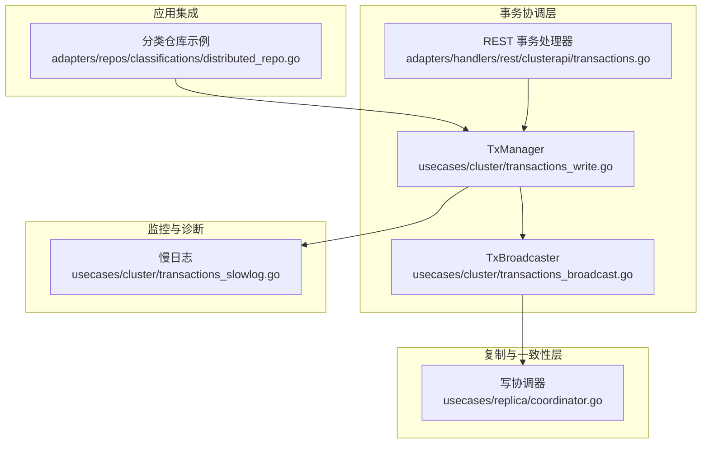
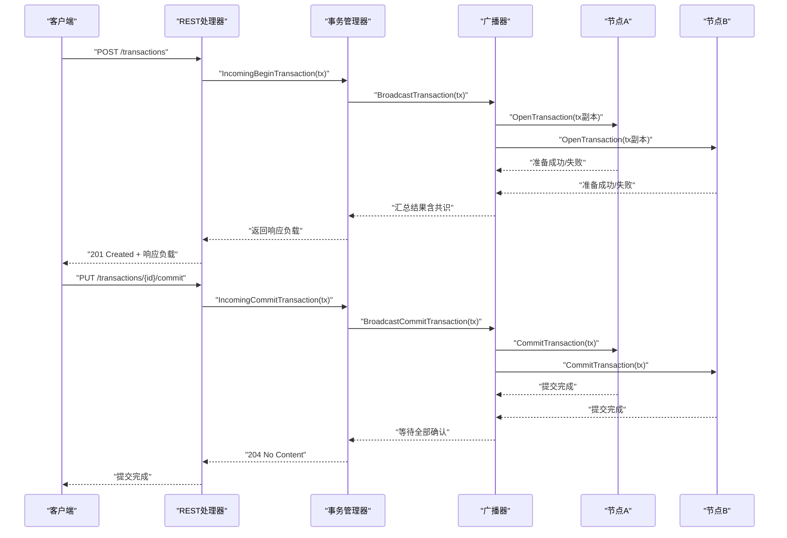
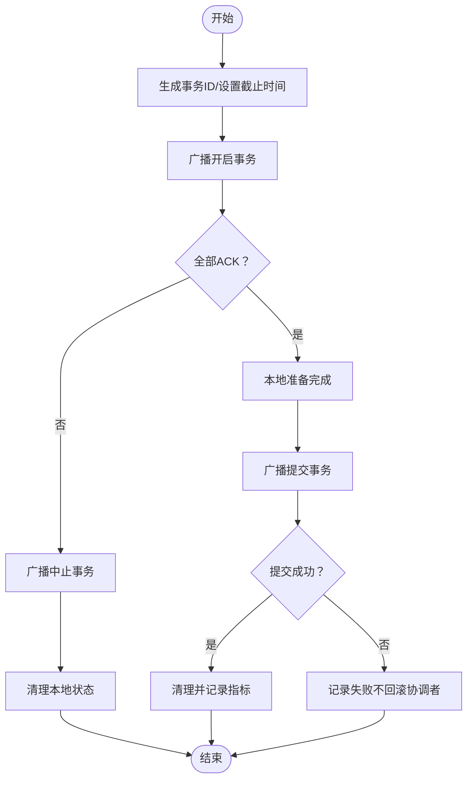
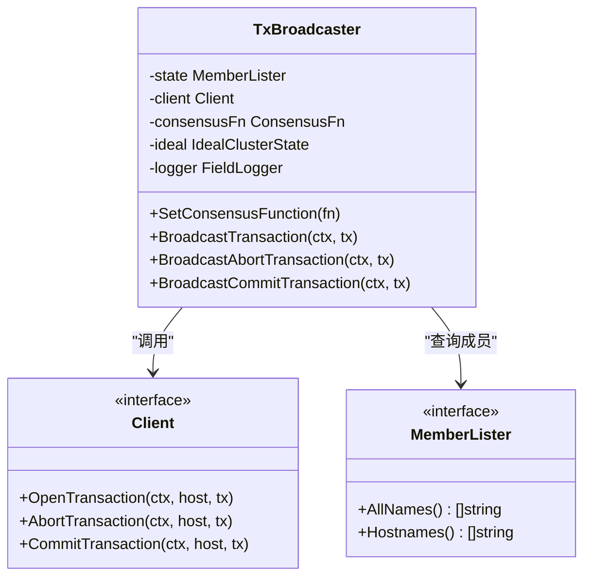
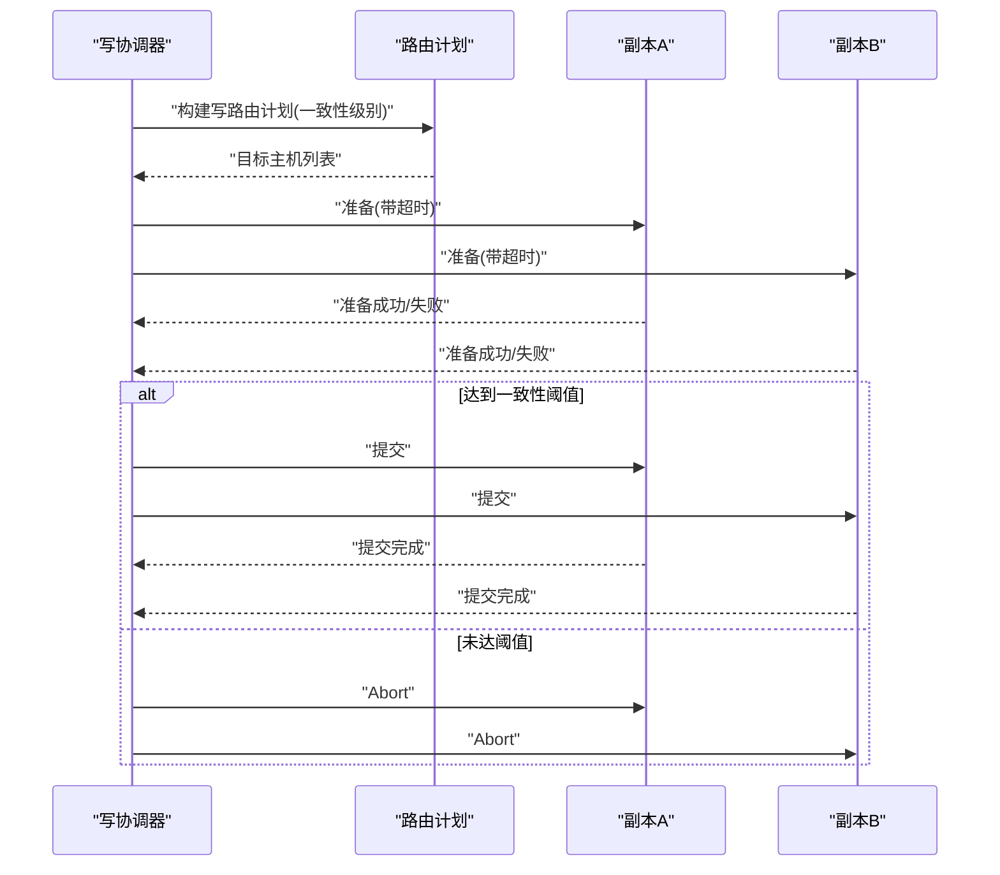
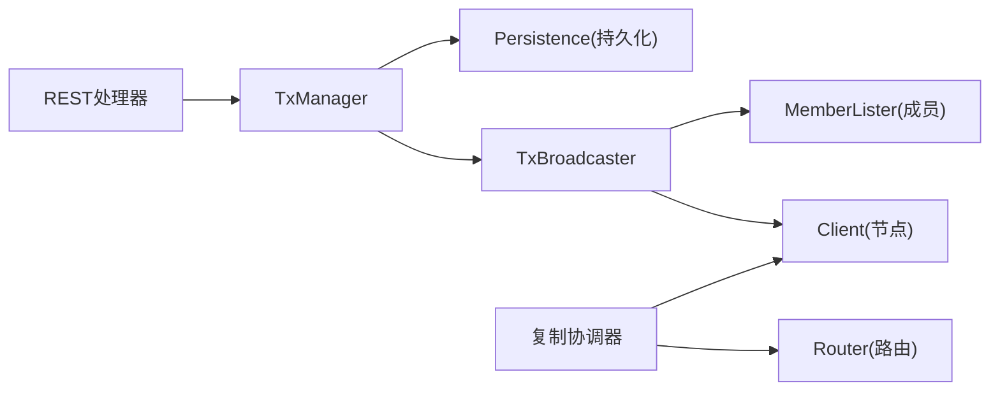

# 分布式事务

<cite>
**本文引用的文件**
- [usecases/cluster/transactions_write.go](file://usecases/cluster/transactions_write.go)
- [usecases/cluster/transactions_broadcast.go](file://usecases/cluster/transactions_broadcast.go)
- [adapters/handlers/rest/clusterapi/transactions.go](file://adapters/handlers/rest/clusterapi/transactions.go)
- [usecases/replica/coordinator.go](file://usecases/replica/coordinator.go)
- [adapters/repos/classifications/distributed_repo.go](file://adapters/repos/classifications/distributed_repo.go)
- [usecases/cluster/transactions_slowlog.go](file://usecases/cluster/transactions_slowlog.go)
- [usecases/cluster/transactions_test.go](file://usecases/cluster/transactions_test.go)
- [adapters/repos/db/vector/cache/sharded_lock_cache.go](file://adapters/repos/db/vector/cache/sharded_lock_cache.go)
- [adapters/repos/db/vector/common/sharded_locks_test.go](file://adapters/repos/db/vector/common/sharded_locks_test.go)
- [usecases/backup/coordinator_test.go](file://usecases/backup/coordinator_test.go)
</cite>

## 目录
1. [引言](#引言)
2. [项目结构](#项目结构)
3. [核心组件](#核心组件)
4. [架构总览](#架构总览)
5. [详细组件分析](#详细组件分析)
6. [依赖关系分析](#依赖关系分析)
7. [性能考量](#性能考量)
8. [故障排查指南](#故障排查指南)
9. [结论](#结论)
10. [附录](#附录)

## 引言
本文件面向 Weaviate 的分布式事务系统，围绕两阶段提交（2PC）、补偿事务与幂等性保障、事务协调机制（发起、参与者协调、结果传播）、并发控制策略（分布式锁、乐观并发控制、冲突检测）、事务隔离与一致性模型、监控与超时、故障恢复、性能优化与死锁规避等主题进行系统化技术说明。文档以代码为依据，辅以图示帮助读者理解跨节点事务在分布式环境中的行为与约束。

## 项目结构
Weaviate 的分布式事务能力由“事务管理器”“广播器”“REST 入口”“复制协调器”以及“慢日志监控”等模块协同实现。事务管理器负责本地事务生命周期与持久化；广播器负责向集群成员广播事务操作；REST 入口接收外部请求并委派给事务管理器；复制协调器用于写/读一致性级别的两阶段提交与回退重试；慢日志用于诊断长耗时事务。

**图表来源**
- [usecases/cluster/transactions_write.go](file://usecases/cluster/transactions_write.go#L50-L127)
- [usecases/cluster/transactions_broadcast.go](file://usecases/cluster/transactions_broadcast.go#L25-L59)
- [adapters/handlers/rest/clusterapi/transactions.go](file://adapters/handlers/rest/clusterapi/transactions.go#L52-L67)
- [usecases/replica/coordinator.go](file://usecases/replica/coordinator.go#L51-L102)
- [adapters/repos/classifications/distributed_repo.go](file://adapters/repos/classifications/distributed_repo.go#L57-L86)
- [usecases/cluster/transactions_slowlog.go](file://usecases/cluster/transactions_slowlog.go#L49-L85)

**章节来源**
- [usecases/cluster/transactions_write.go](file://usecases/cluster/transactions_write.go#L1-L127)
- [usecases/cluster/transactions_broadcast.go](file://usecases/cluster/transactions_broadcast.go#L1-L59)
- [adapters/handlers/rest/clusterapi/transactions.go](file://adapters/handlers/rest/clusterapi/transactions.go#L1-L67)
- [usecases/replica/coordinator.go](file://usecases/replica/coordinator.go#L1-L102)
- [adapters/repos/classifications/distributed_repo.go](file://adapters/repos/classifications/distributed_repo.go#L57-L86)
- [usecases/cluster/transactions_slowlog.go](file://usecases/cluster/transactions_slowlog.go#L1-L85)

## 核心组件
- 事务管理器（TxManager）
  - 负责事务的开启、提交、中止、过期清理、持久化与并发保护。
  - 提供“协调者”和“参与者”两种角色：协调者发起事务并广播，参与者接收并执行。
  - 支持可配置的 TTL、过期回调、慢日志、只读事务白名单等。
- 广播器（TxBroadcaster）
  - 将事务操作广播到所有集群成员，支持共识函数对响应进行合并。
  - 对健康状态进行校验，必要时拒绝不满足容错要求的事务。
- REST 事务处理器
  - 接收外部事务请求，解码并委派给事务管理器处理。
- 复制协调器（Replica Coordinator）
  - 实现写/读一致性级别的两阶段提交，支持背压与指数退避重试。
- 慢日志（txSlowLog）
  - 周期性输出事务状态，辅助定位长时间阻塞或异常路径。

**章节来源**
- [usecases/cluster/transactions_write.go](file://usecases/cluster/transactions_write.go#L50-L127)
- [usecases/cluster/transactions_broadcast.go](file://usecases/cluster/transactions_broadcast.go#L25-L59)
- [adapters/handlers/rest/clusterapi/transactions.go](file://adapters/handlers/rest/clusterapi/transactions.go#L52-L67)
- [usecases/replica/coordinator.go](file://usecases/replica/coordinator.go#L51-L102)
- [usecases/cluster/transactions_slowlog.go](file://usecases/cluster/transactions_slowlog.go#L49-L85)

## 架构总览
Weaviate 的分布式事务采用“协调者-参与者-广播器”的协作模式。协调者在本地开启事务后，通过广播器向所有成员发起准备阶段；成员在本地执行准备逻辑并返回结果；当达到一致性阈值后，协调者进入提交阶段并向成员广播提交请求。读路径通过复制协调器按一致性级别拉取数据，并在失败时进行回退重试。

**图表来源**
- [adapters/handlers/rest/clusterapi/transactions.go](file://adapters/handlers/rest/clusterapi/transactions.go#L106-L175)
- [usecases/cluster/transactions_write.go](file://usecases/cluster/transactions_write.go#L473-L514)
- [usecases/cluster/transactions_write.go](file://usecases/cluster/transactions_write.go#L544-L567)
- [usecases/cluster/transactions_broadcast.go](file://usecases/cluster/transactions_broadcast.go#L65-L120)
- [usecases/cluster/transactions_broadcast.go](file://usecases/cluster/transactions_broadcast.go#L149-L178)

## 详细组件分析

### 事务管理器（TxManager）
- 角色与职责
  - 协调者：发起事务、广播、提交、中止；维护当前事务上下文与过期计时器；持久化事务状态。
  - 参与者：接收来自协调者的事务请求，执行业务逻辑（commitFn/responseFn），并清理本地状态。
- 关键流程
  - 开启事务：生成唯一 ID、设置截止时间、启动过期协程、广播至全节点；若任一节点失败则回滚。
  - 提交事务：验证本地事务有效性后广播提交；广播失败不回滚协调者，避免网络时序导致的不一致。
  - 中止事务：参与者收到中止请求即清理本地状态；协调者在开启失败时自动回滚。
  - 过期与清理：基于 TTL 启动异步取消器，到期后清理并记录指标。
- 并发与一致性
  - 使用互斥锁保护当前事务指针与状态；提交过程避免持有锁执行业务逻辑，防止死锁。
  - 支持“容忍节点失败”的事务类型，允许在部分节点不可用时继续运行。
- 幂等性与恢复
  - 提供“悬挂事务恢复”接口，仅对明确允许的事务类型进行重放，避免非幂等操作重复执行。
- 指标与监控
  - 记录事务打开/关闭次数与时长，区分协调者/参与者与提交/中止/过期状态。

**图表来源**
- [usecases/cluster/transactions_write.go](file://usecases/cluster/transactions_write.go#L334-L409)
- [usecases/cluster/transactions_write.go](file://usecases/cluster/transactions_write.go#L411-L471)
- [usecases/cluster/transactions_write.go](file://usecases/cluster/transactions_write.go#L544-L634)

**章节来源**
- [usecases/cluster/transactions_write.go](file://usecases/cluster/transactions_write.go#L50-L127)
- [usecases/cluster/transactions_write.go](file://usecases/cluster/transactions_write.go#L334-L409)
- [usecases/cluster/transactions_write.go](file://usecases/cluster/transactions_write.go#L411-L471)
- [usecases/cluster/transactions_write.go](file://usecases/cluster/transactions_write.go#L544-L634)

### 广播器（TxBroadcaster）
- 职责
  - 将事务操作（开启/提交/中止）广播到所有集群成员；在开启阶段可注入共识函数对多节点响应进行合并。
  - 在未启用“容忍节点失败”时，校验理想集群状态，确保满足一致性前提。
- 超时与容错
  - 对每个节点调用设置固定超时，避免无限阻塞；使用错误组聚合结果，统一返回。
- 一致性与共识
  - 通过共识函数对多个节点返回的事务负载进行合并，使协调者拥有最终一致的 payload。

**图表来源**
- [usecases/cluster/transactions_broadcast.go](file://usecases/cluster/transactions_broadcast.go#L25-L59)
- [usecases/cluster/transactions_broadcast.go](file://usecases/cluster/transactions_broadcast.go#L40-L49)

**章节来源**
- [usecases/cluster/transactions_broadcast.go](file://usecases/cluster/transactions_broadcast.go#L65-L120)
- [usecases/cluster/transactions_broadcast.go](file://usecases/cluster/transactions_broadcast.go#L122-L178)

### REST 事务处理器
- 职责
  - 解析外部 JSON 请求，构造事务对象，委派给事务管理器处理开启/提交/中止。
  - 根据错误类型映射 HTTP 状态码（如并发冲突映射为 409）。
- 集成点
  - 与事务管理器的接口保持一致，便于替换不同类型的事务处理器（如分类事务）。

**章节来源**
- [adapters/handlers/rest/clusterapi/transactions.go](file://adapters/handlers/rest/clusterapi/transactions.go#L106-L175)
- [adapters/handlers/rest/clusterapi/transactions.go](file://adapters/handlers/rest/clusterapi/transactions.go#L178-L217)

### 复制协调器（Replica Coordinator）
- 写路径（两阶段提交）
  - 准备阶段：向目标副本广播准备请求，累计达到一致性阈值后缓存后续成功结果。
  - 提交阶段：对达到阈值的副本广播提交请求，统计成功数量并更新指标。
  - 回退重试：对额外副本进行尽力而为的提交，不等待响应。
- 读路径
  - 按一致性级别并发拉取，优先尝试直连候选节点；失败时使用指数退避队列回退重试。
- 超时与背压
  - 写路径使用固定超时上下文；读路径为每个工作线程分配独立超时，避免整体阻塞。

**图表来源**
- [usecases/replica/coordinator.go](file://usecases/replica/coordinator.go#L104-L165)
- [usecases/replica/coordinator.go](file://usecases/replica/coordinator.go#L167-L212)
- [usecases/replica/coordinator.go](file://usecases/replica/coordinator.go#L245-L305)

**章节来源**
- [usecases/replica/coordinator.go](file://usecases/replica/coordinator.go#L104-L165)
- [usecases/replica/coordinator.go](file://usecases/replica/coordinator.go#L167-L212)
- [usecases/replica/coordinator.go](file://usecases/replica/coordinator.go#L245-L305)
- [usecases/replica/coordinator.go](file://usecases/replica/coordinator.go#L307-L430)

### 应用集成示例：分布式分类仓库
- 通过远程事务管理器开启集群范围事务，提交后在本地落盘。
- 该模式体现“协调者-参与者”协作：协调者负责跨节点一致性，参与者负责本地业务落盘。

**章节来源**
- [adapters/repos/classifications/distributed_repo.go](file://adapters/repos/classifications/distributed_repo.go#L57-L86)
- [adapters/repos/classifications/distributed_repo.go](file://adapters/repos/classifications/distributed_repo.go#L88-L97)

## 依赖关系分析
- 组件耦合
  - TxManager 依赖 Remote 接口（广播器）与持久化接口；对外暴露 Begin/Commit/Abort 三类入口。
  - TxBroadcaster 依赖 MemberLister 与 Client，负责跨节点通信与共识。
  - REST 处理器依赖 TxManager 接口，作为外部入口。
  - 复制协调器依赖路由与客户端，实现写/读一致性。
- 潜在循环依赖
  - 当前设计通过接口解耦，未见直接循环依赖；共识函数与持久化接口进一步降低耦合。
- 外部依赖
  - 错误组（并发错误聚合）、指数退避、Prometheus 指标等。

**图表来源**
- [adapters/handlers/rest/clusterapi/transactions.go](file://adapters/handlers/rest/clusterapi/transactions.go#L52-L67)
- [usecases/cluster/transactions_write.go](file://usecases/cluster/transactions_write.go#L50-L89)
- [usecases/cluster/transactions_broadcast.go](file://usecases/cluster/transactions_broadcast.go#L25-L59)
- [usecases/replica/coordinator.go](file://usecases/replica/coordinator.go#L51-L63)

**章节来源**
- [adapters/handlers/rest/clusterapi/transactions.go](file://adapters/handlers/rest/clusterapi/transactions.go#L52-L67)
- [usecases/cluster/transactions_write.go](file://usecases/cluster/transactions_write.go#L50-L89)
- [usecases/cluster/transactions_broadcast.go](file://usecases/cluster/transactions_broadcast.go#L25-L59)
- [usecases/replica/coordinator.go](file://usecases/replica/coordinator.go#L51-L63)

## 性能考量
- 两阶段提交的延迟
  - 准备阶段与提交阶段均需等待多数节点确认，延迟受网络与节点负载影响。
  - 复制协调器对额外副本采用“尽力而为”提交，减少主路径等待。
- 超时与背压
  - 广播器与复制协调器均设置固定超时，避免单点阻塞；读路径使用指数退避队列回退重试。
- 并发控制
  - 事务管理器在提交阶段避免持有锁执行业务逻辑，降低死锁风险。
  - 分布式锁（分片锁）用于热点对象的并发保护，避免全局锁竞争。
- 指标与观测
  - 事务打开/关闭计数与时长指标，区分协调者/参与者与提交/中止/过期状态，便于定位瓶颈。

**章节来源**
- [usecases/cluster/transactions_broadcast.go](file://usecases/cluster/transactions_broadcast.go#L83-L101)
- [usecases/replica/coordinator.go](file://usecases/replica/coordinator.go#L263-L291)
- [usecases/cluster/transactions_write.go](file://usecases/cluster/transactions_write.go#L591-L609)
- [adapters/repos/db/vector/cache/sharded_lock_cache.go](file://adapters/repos/db/vector/cache/sharded_lock_cache.go#L136-L146)
- [adapters/repos/db/vector/common/sharded_locks_test.go](file://adapters/repos/db/vector/common/sharded_locks_test.go#L70-L164)

## 故障排查指南
- 事务过期
  - 当事务超过 TTL 仍未提交，会触发过期清理并记录指标；可通过慢日志定位长时间阻塞。
- 广播失败
  - 开启/提交广播失败时，协调者记录错误但不回滚已提交节点，避免不一致；建议检查网络与节点健康。
- 并发冲突
  - 同时开启多个事务会返回并发错误；在高并发下应避免同时发起同类事务。
- 节点失败
  - 若未启用“容忍节点失败”，且存在确认死亡节点，则拒绝事务；可调整策略或等待节点恢复。
- 读路径失败
  - 读协调器使用指数退避与回退队列，若仍失败可检查一致性级别与路由计划。

**章节来源**
- [usecases/cluster/transactions_write.go](file://usecases/cluster/transactions_write.go#L210-L275)
- [usecases/cluster/transactions_write.go](file://usecases/cluster/transactions_write.go#L367-L403)
- [usecases/cluster/transactions_write.go](file://usecases/cluster/transactions_write.go#L451-L471)
- [usecases/cluster/transactions_write.go](file://usecases/cluster/transactions_write.go#L334-L342)
- [usecases/cluster/transactions_broadcast.go](file://usecases/cluster/transactions_broadcast.go#L66-L70)
- [usecases/replica/coordinator.go](file://usecases/replica/coordinator.go#L349-L420)
- [usecases/cluster/transactions_slowlog.go](file://usecases/cluster/transactions_slowlog.go#L135-L161)

## 结论
Weaviate 的分布式事务体系以 TxManager 为核心，结合 TxBroadcaster 与复制协调器，实现了基于两阶段提交的一致性保障与可观测性。通过 TTL、慢日志、指标与背压策略，系统在高并发与网络波动环境下具备较好的鲁棒性。幂等性与悬挂事务恢复机制进一步提升了可靠性。未来可在共识函数与持久化策略上持续演进，以适配更复杂的业务一致性需求。

## 附录
- 并发控制与锁
  - 分片锁用于热点对象保护，避免全局锁竞争；测试覆盖了锁与锁全集的互斥行为。
- 超时与恢复
  - 广播与复制路径均设置固定超时；备份协调器对节点超时进行状态更新与取消处理，体现分布式超时治理思路。

**章节来源**
- [adapters/repos/db/vector/common/sharded_locks_test.go](file://adapters/repos/db/vector/common/sharded_locks_test.go#L70-L164)
- [usecases/backup/coordinator_test.go](file://usecases/backup/coordinator_test.go#L893-L914)