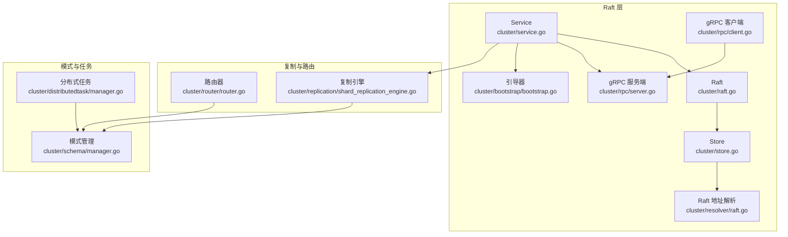
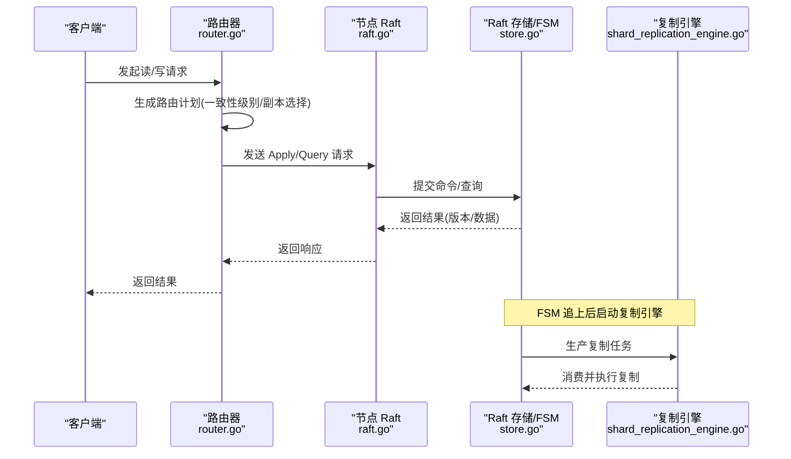
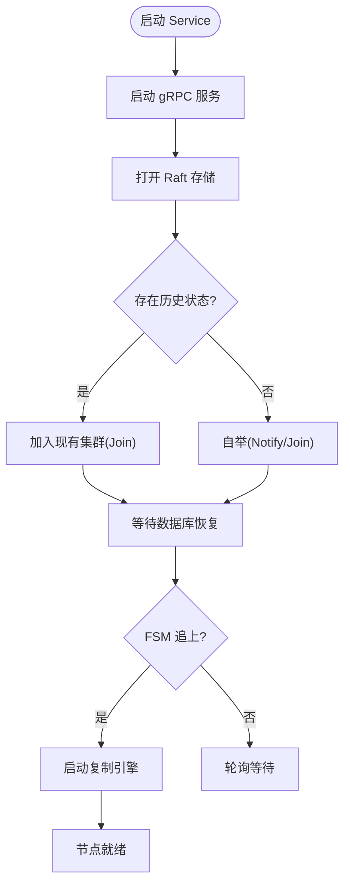
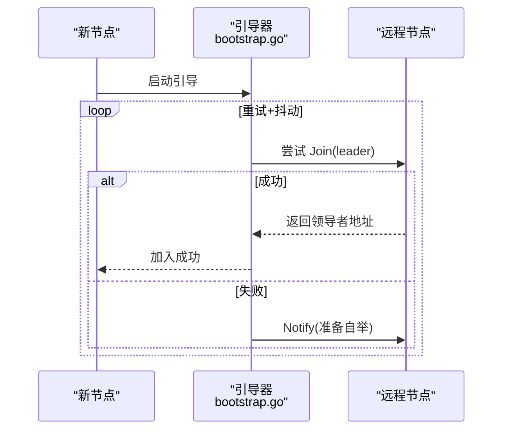
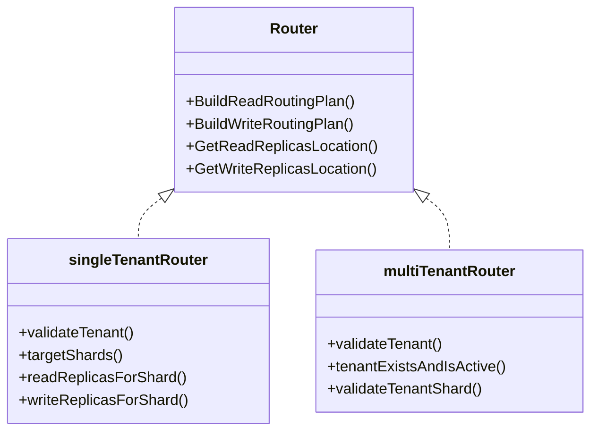
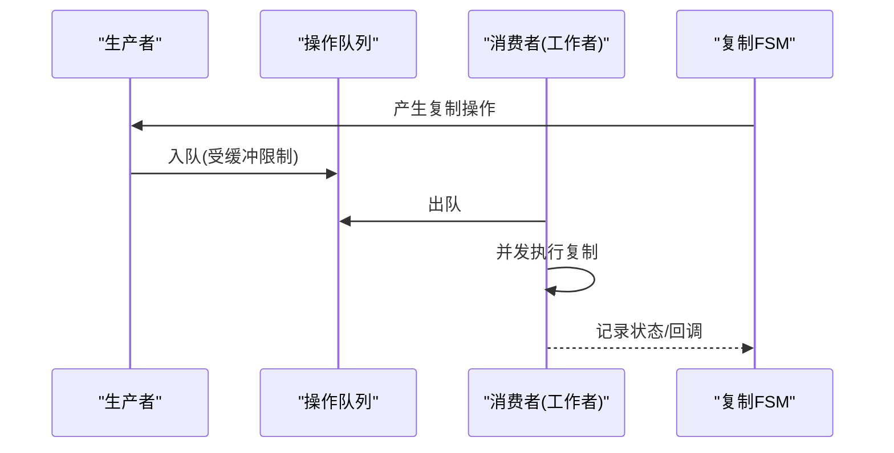
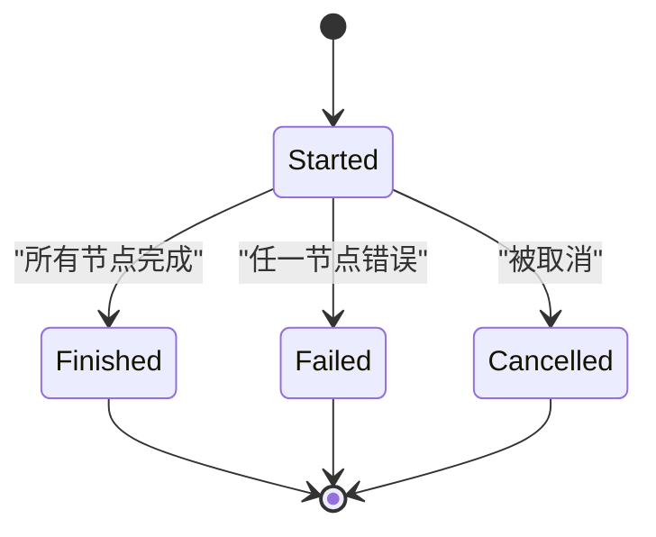
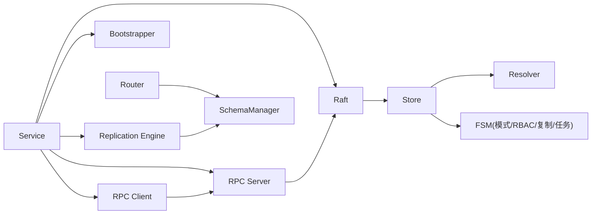

# 分布式系统

<cite>
**本文引用的文件**
- [cluster/raft.go](file://cluster/raft.go)
- [cluster/service.go](file://cluster/service.go)
- [cluster/store.go](file://cluster/store.go)
- [cluster/resolver/raft.go](file://cluster/resolver/raft.go)
- [cluster/router/router.go](file://cluster/router/router.go)
- [cluster/replication/shard_replication_engine.go](file://cluster/replication/shard_replication_engine.go)
- [cluster/schema/manager.go](file://cluster/schema/manager.go)
- [cluster/bootstrap/bootstrap.go](file://cluster/bootstrap/bootstrap.go)
- [cluster/rpc/server.go](file://cluster/rpc/server.go)
- [cluster/rpc/client.go](file://cluster/rpc/client.go)
- [cluster/distributedtask/manager.go](file://cluster/distributedtask/manager.go)
- [docs/metrics.md](file://docs/metrics.md)
- [cluster/usage/service.go](file://cluster/usage/service.go)
- [cluster/types/types.go](file://cluster/types/types.go)
</cite>

## 目录
1. [简介](#简介)
2. [项目结构](#项目结构)
3. [核心组件](#核心组件)
4. [架构总览](#架构总览)
5. [详细组件分析](#详细组件分析)
6. [依赖关系分析](#依赖关系分析)
7. [性能考量](#性能考量)
8. [故障排除指南](#故障排除指南)
9. [结论](#结论)
10. [附录](#附录)

## 简介
本文件面向分布式系统开发者与运维人员，系统性梳理 Weaviate 的分布式子系统，重点覆盖以下方面：
- Raft 一致性协议实现：一致性算法、状态机复制、成员管理与引导流程
- 集群管理：节点发现、加入/离开、领导者转移与恢复
- 分片与路由：单租户/多租户路由、副本选择、一致性级别与负载均衡
- 复制引擎：基于生产者-消费者模型的分片复制、异步复制与回压
- 分布式任务：跨节点任务生命周期管理与完成聚合
- 部署最佳实践、性能调优与监控指标
- 故障排除与运维建议

## 项目结构
Weaviate 的分布式层位于 cluster 包内，围绕 Raft 存储、RPC 服务、路由与复制引擎组织。关键模块职责如下：
- cluster/raft.go：对外暴露 Raft 接口，封装 Store 并提供查询/写入入口
- cluster/store.go：Raft 节点与 FSM 的具体实现，负责状态持久化、快照、领导者检测与恢复
- cluster/service.go：Raft 层主入口，协调 RPC 服务、引导、复制引擎启动与关闭
- cluster/resolver/raft.go：将 Raft 节点 ID 解析为网络地址，支持本地与远端解析
- cluster/rpc/server.go 与 client.go：gRPC 服务端与客户端，提供 Join/Notify/Remove/Apply/Query 等 RPC
- cluster/bootstrap/bootstrap.go：引导流程，尝试加入现有集群或通知其他节点准备自举
- cluster/router/router.go：读写路由规划，依据分片与副本状态选择目标节点
- cluster/replication/shard_replication_engine.go：分片复制引擎，生产者-消费者并发执行复制任务
- cluster/schema/manager.go：模式管理，将 Raft 命令应用到模式与数据库
- cluster/distributedtask/manager.go：分布式任务管理，跨节点任务的开始、完成记录与清理
- docs/metrics.md：Prometheus 指标清单，含集群、复制、分布式任务等关键指标
- cluster/usage/service.go：节点使用量统计服务，用于容量规划与运维观测
- cluster/types/types.go：类型与接口定义，如 RaftResolver、ClassState 等

图表来源
- [cluster/service.go](file://cluster/service.go#L69-L117)
- [cluster/raft.go](file://cluster/raft.go#L44-L99)
- [cluster/store.go](file://cluster/store.go#L309-L339)
- [cluster/resolver/raft.go](file://cluster/resolver/raft.go#L46-L85)
- [cluster/rpc/server.go](file://cluster/rpc/server.go#L64-L82)
- [cluster/rpc/client.go](file://cluster/rpc/client.go#L126-L128)
- [cluster/bootstrap/bootstrap.go](file://cluster/bootstrap/bootstrap.go#L49-L61)
- [cluster/router/router.go](file://cluster/router/router.go#L39-L98)
- [cluster/replication/shard_replication_engine.go](file://cluster/replication/shard_replication_engine.go#L112-L133)
- [cluster/schema/manager.go](file://cluster/schema/manager.go#L52-L90)
- [cluster/distributedtask/manager.go](file://cluster/distributedtask/manager.go#L41-L53)

章节来源
- [cluster/raft.go](file://cluster/raft.go#L26-L99)
- [cluster/service.go](file://cluster/service.go#L46-L117)
- [cluster/store.go](file://cluster/store.go#L191-L255)
- [cluster/resolver/raft.go](file://cluster/resolver/raft.go#L26-L85)
- [cluster/rpc/server.go](file://cluster/rpc/server.go#L49-L82)
- [cluster/rpc/client.go](file://cluster/rpc/client.go#L100-L128)
- [cluster/bootstrap/bootstrap.go](file://cluster/bootstrap/bootstrap.go#L35-L61)
- [cluster/router/router.go](file://cluster/router/router.go#L100-L127)
- [cluster/replication/shard_replication_engine.go](file://cluster/replication/shard_replication_engine.go#L32-L109)
- [cluster/schema/manager.go](file://cluster/schema/manager.go#L44-L90)
- [cluster/distributedtask/manager.go](file://cluster/distributedtask/manager.go#L25-L53)

## 核心组件
- Raft 抽象与服务
  - Raft 对外提供统一的 Apply/Query/Leader/Ready 等能力，内部委托 Store 执行
  - Service 作为入口，初始化 RPC 服务、Store、复制引擎，并在 FSM 追上后启动复制引擎
- Raft 存储与 FSM
  - Store 负责 Raft 节点构造、日志/快照、领导者检测、旧模式迁移与关闭流程
  - FSM 内部维护 Schema、RBAC、动态用户、复制管理与分布式任务管理
- 引导与成员管理
  - Bootstrapper 通过 Join/Notify 与远程节点交互，支持“就地”自举或加入现有集群
  - Resolver 将 Raft 节点 ID 解析为网络地址，支持本地与远端场景
- RPC 通信
  - gRPC 服务端提供 Join/Notify/Remove/Apply/Query；客户端按需连接领导者，具备重试策略
- 路由与复制
  - Router 基于分片与副本状态生成读写路由计划，支持单租户/多租户
  - 复制引擎采用生产者-消费者并发模型，带背压与限流，保障复制吞吐与稳定性
- 模式与分布式任务
  - SchemaManager 将 Raft 命令应用到模式与数据库，支持类/属性/租户/分片状态更新
  - DistributedTaskManager 管理跨节点任务生命周期，记录节点完成与清理

章节来源
- [cluster/raft.go](file://cluster/raft.go#L26-L99)
- [cluster/service.go](file://cluster/service.go#L46-L117)
- [cluster/store.go](file://cluster/store.go#L191-L255)
- [cluster/bootstrap/bootstrap.go](file://cluster/bootstrap/bootstrap.go#L35-L61)
- [cluster/rpc/server.go](file://cluster/rpc/server.go#L49-L82)
- [cluster/rpc/client.go](file://cluster/rpc/client.go#L100-L128)
- [cluster/router/router.go](file://cluster/router/router.go#L100-L127)
- [cluster/replication/shard_replication_engine.go](file://cluster/replication/shard_replication_engine.go#L32-L109)
- [cluster/schema/manager.go](file://cluster/schema/manager.go#L44-L90)
- [cluster/distributedtask/manager.go](file://cluster/distributedtask/manager.go#L25-L53)

## 架构总览
下图展示 Weaviate 分布式层的关键交互：客户端请求经路由器选择目标节点，节点上的 Raft 层将写操作提交到 FSM，FSM 应用到模式与数据库；复制引擎在 FSM 追上后并发执行分片复制；读请求可直接在本地或按一致性级别路由到副本。

图表来源
- [cluster/router/router.go](file://cluster/router/router.go#L338-L407)
- [cluster/raft.go](file://cluster/raft.go#L44-L99)
- [cluster/store.go](file://cluster/store.go#L363-L417)
- [cluster/replication/shard_replication_engine.go](file://cluster/replication/shard_replication_engine.go#L135-L218)

## 详细组件分析

### Raft 实现与状态机复制
- Raft 抽象
  - Raft 封装 Store，提供 Apply/Query/Leader/Ready 等方法，确保写操作在领导者上应用，读操作可按一致性等待
- Store 初始化与恢复
  - 初始化日志/快照存储、TCP 传输、构建 Raft 节点；若无历史状态则报告就绪
  - 支持旧模式迁移（仅领导者），并在领导者变更时进行领导权移交
- FSM 与模式管理
  - FSM 内置 Schema/RBAC/动态用户/复制/分布式任务管理器，作为状态机承载集群元数据
- 关键流程
  - Open：启动 RPC 服务、打开 Raft、根据是否存在历史状态决定 Join 或 Bootstrap
  - Close：领导者转移、关闭传输与 Raft、关闭日志与数据库

图表来源
- [cluster/service.go](file://cluster/service.go#L149-L209)
- [cluster/store.go](file://cluster/store.go#L363-L417)
- [cluster/bootstrap/bootstrap.go](file://cluster/bootstrap/bootstrap.go#L63-L130)

章节来源
- [cluster/raft.go](file://cluster/raft.go#L44-L99)
- [cluster/store.go](file://cluster/store.go#L360-L417)
- [cluster/service.go](file://cluster/service.go#L149-L209)
- [cluster/bootstrap/bootstrap.go](file://cluster/bootstrap/bootstrap.go#L63-L130)

### 成员管理与引导流程
- 引导器
  - 先尝试 Join，失败则 Notify 其他节点，达到期望数量后自举
  - 支持抖动与重试，避免同时发起导致竞争
- 地址解析
  - Resolver 将 Raft 节点 ID 解析为网络地址，支持本地与远端场景
- RPC 接口
  - 服务端提供 Join/Notify/Remove/Apply/Query；客户端按领导者地址建立连接，具备默认重试策略

图表来源
- [cluster/bootstrap/bootstrap.go](file://cluster/bootstrap/bootstrap.go#L63-L130)
- [cluster/rpc/server.go](file://cluster/rpc/server.go#L84-L109)
- [cluster/rpc/client.go](file://cluster/rpc/client.go#L130-L151)

章节来源
- [cluster/bootstrap/bootstrap.go](file://cluster/bootstrap/bootstrap.go#L35-L130)
- [cluster/resolver/raft.go](file://cluster/resolver/raft.go#L58-L85)
- [cluster/rpc/server.go](file://cluster/rpc/server.go#L84-L132)
- [cluster/rpc/client.go](file://cluster/rpc/client.go#L130-L176)

### 分片与路由系统
- 路由器
  - 单租户/多租户两种实现，依据分片与副本状态生成读写路由计划
  - 支持一致性级别校验与首选节点排序（本地或直连候选）
- 副本过滤
  - 读：按一致性过滤可用副本
  - 写：区分主写与附加写副本，满足一致性要求
- 租户一致性
  - 多租户模式下校验租户存在与热状态，确保只对活跃租户进行路由

图表来源
- [cluster/router/router.go](file://cluster/router/router.go#L100-L127)
- [cluster/router/router.go](file://cluster/router/router.go#L177-L327)
- [cluster/router/router.go](file://cluster/router/router.go#L419-L537)

章节来源
- [cluster/router/router.go](file://cluster/router/router.go#L100-L127)
- [cluster/router/router.go](file://cluster/router/router.go#L177-L327)
- [cluster/router/router.go](file://cluster/router/router.go#L419-L537)

### 复制引擎与异步复制
- 引擎设计
  - 生产者-消费者模型，缓冲通道实现背压；支持最大工作者数量限制
  - 生命周期：Start 启动生产者/消费者协程，Stop 优雅关闭；支持运行状态查询
- 并发与回压
  - 有限缓冲通道防止生产者过快；工作者池限制并发度；超时与错误传播
- 与复制 FSM 的集成
  - 引擎消费来自 FSM 的复制操作，执行节点间数据复制

图表来源
- [cluster/replication/shard_replication_engine.go](file://cluster/replication/shard_replication_engine.go#L135-L218)

章节来源
- [cluster/replication/shard_replication_engine.go](file://cluster/replication/shard_replication_engine.go#L32-L271)

### 分布式事务与并发控制
- 任务生命周期
  - AddTask：记录任务开始与版本号；RecordNodeCompletion：节点完成并聚合；CancelTask/CleanUpTask：取消与清理
  - 通过版本号与状态机保证幂等与一致性
- 与复制/模式的协作
  - 在模式更新与分片状态变更时，通过 Raft 命令触发分布式任务，确保全网一致

图表来源
- [cluster/distributedtask/manager.go](file://cluster/distributedtask/manager.go#L55-L120)

章节来源
- [cluster/distributedtask/manager.go](file://cluster/distributedtask/manager.go#L25-L170)

### 模式管理与一致性保证
- SchemaManager
  - 将 Raft 命令应用到模式与数据库，先模式后数据库，必要时触发数据库回调
  - 支持类/属性/租户/分片状态更新、副本增删、同步与迁移
- 一致性等待
  - Store 提供 WaitForAppliedIndex，SchemaReader 在读取前等待指定版本，确保读到最新状态

章节来源
- [cluster/schema/manager.go](file://cluster/schema/manager.go#L171-L676)
- [cluster/store.go](file://cluster/store.go#L598-L623)

## 依赖关系分析
- 组件耦合
  - Service 依赖 Raft、Store、RPC、Resolver、Bootstrapper、ReplicationEngine
  - Raft 依赖 Store 与 RPC 客户端
  - Store 依赖 Resolver、Schema/RBAC/DynamicUser/Replication/DistributedTask 管理器
  - Router 依赖 SchemaReader、ReplicationFSMReader、NodeSelector
  - 复制引擎依赖 FSM 生产者与消费者
- 外部依赖
  - Raft 库、gRPC、Prometheus 指标注册、Sentry 链路追踪（可选）

图表来源
- [cluster/service.go](file://cluster/service.go#L69-L117)
- [cluster/raft.go](file://cluster/raft.go#L44-L99)
- [cluster/store.go](file://cluster/store.go#L309-L339)
- [cluster/resolver/raft.go](file://cluster/resolver/raft.go#L46-L85)
- [cluster/rpc/server.go](file://cluster/rpc/server.go#L64-L82)
- [cluster/rpc/client.go](file://cluster/rpc/client.go#L126-L128)
- [cluster/bootstrap/bootstrap.go](file://cluster/bootstrap/bootstrap.go#L49-L61)
- [cluster/router/router.go](file://cluster/router/router.go#L39-L98)
- [cluster/replication/shard_replication_engine.go](file://cluster/replication/shard_replication_engine.go#L112-L133)
- [cluster/schema/manager.go](file://cluster/schema/manager.go#L52-L90)

章节来源
- [cluster/service.go](file://cluster/service.go#L46-L117)
- [cluster/store.go](file://cluster/store.go#L309-L339)
- [cluster/resolver/raft.go](file://cluster/resolver/raft.go#L46-L85)
- [cluster/rpc/server.go](file://cluster/rpc/server.go#L64-L82)
- [cluster/rpc/client.go](file://cluster/rpc/client.go#L126-L128)
- [cluster/bootstrap/bootstrap.go](file://cluster/bootstrap/bootstrap.go#L49-L61)
- [cluster/router/router.go](file://cluster/router/router.go#L39-L98)
- [cluster/replication/shard_replication_engine.go](file://cluster/replication/shard_replication_engine.go#L112-L133)
- [cluster/schema/manager.go](file://cluster/schema/manager.go#L52-L90)

## 性能考量
- Raft 配置
  - 心跳/选举/领导者租约超时可乘以倍数以适应网络延迟
  - 快照阈值与间隔、尾随日志数影响快照频率与恢复速度
- 复制引擎
  - 缓冲区大小与最大工作者数决定并发度与内存占用
  - 操作超时与关闭超时影响停机时间与资源回收
- RPC 重试
  - Apply/Query 与 Join/Remove/Notify 采用不同重试策略，避免对内部错误无限重试
- 指标与观测
  - 复制引擎、分布式任务、集群 Store、HTTP/gRPC 服务器均有 Prometheus 指标，便于定位瓶颈

章节来源
- [cluster/store.go](file://cluster/store.go#L735-L785)
- [cluster/replication/shard_replication_engine.go](file://cluster/replication/shard_replication_engine.go#L111-L133)
- [cluster/rpc/client.go](file://cluster/rpc/client.go#L30-L93)
- [docs/metrics.md](file://docs/metrics.md#L152-L199)

## 故障排除指南
- 无法加入集群
  - 检查地址解析是否成功（Resolver/NodeSelector），确认远程节点可达
  - 查看引导器日志，确认 Join/Notify 是否成功
- 读不到最新数据
  - 确认一致性等待是否生效（SchemaReader/WaitForAppliedIndex）
  - 检查领导者地址与版本等待超时
- 复制未启动或卡住
  - 等待 FSM 追上后复制引擎才启动；检查复制引擎运行状态与队列长度
- 领导者频繁切换
  - 调整心跳/选举/租约超时倍数，避免网络抖动引发频繁选举
- 停机/重启
  - 关闭顺序：停止复制引擎 → 关闭 Raft → 关闭 RPC → 关闭日志与数据库
- 使用量与容量
  - 使用 usage 服务收集节点使用量，结合备份后端统计容量

章节来源
- [cluster/resolver/raft.go](file://cluster/resolver/raft.go#L58-L85)
- [cluster/bootstrap/bootstrap.go](file://cluster/bootstrap/bootstrap.go#L63-L130)
- [cluster/store.go](file://cluster/store.go#L598-L623)
- [cluster/service.go](file://cluster/service.go#L211-L239)
- [cluster/usage/service.go](file://cluster/usage/service.go#L63-L134)

## 结论
Weaviate 的分布式层以 Raft 为核心，结合 RPC、路由与复制引擎，实现了强一致的状态机复制与可扩展的分片/副本管理。通过清晰的组件边界与可观测指标，系统在一致性、可用性与可运维性之间取得平衡。建议在生产环境中合理设置 Raft 超时、复制引擎并发参数与 RPC 重试策略，并持续关注关键指标以保障稳定性与性能。

## 附录
- 部署最佳实践
  - 使用奇数个投票节点（至少 3）以获得最大容错
  - 为每个节点配置独立工作目录与持久化存储
  - 启用合适的 Raft 超时倍数以适配网络环境
  - 开启复制引擎并合理设置最大工作者数
  - 使用监控与告警覆盖复制引擎、分布式任务与集群 Store 指标
- 监控指标参考
  - 复制引擎：pending/ongoing/completed/failed/cancelled、运行状态
  - 分布式任务：各命名空间运行中的任务数
  - 集群 Store：FSM 应用耗时与失败次数、最后应用索引
  - gRPC/HTTP：请求时延、大小、在途请求数与状态码分布

章节来源
- [docs/metrics.md](file://docs/metrics.md#L152-L205)