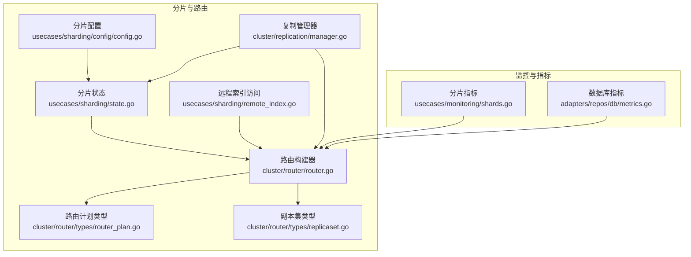
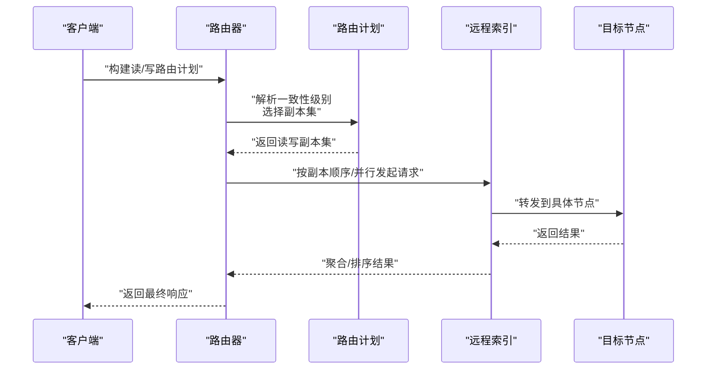
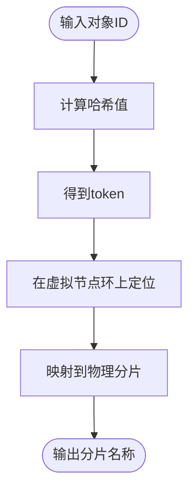
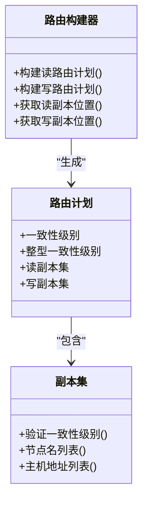
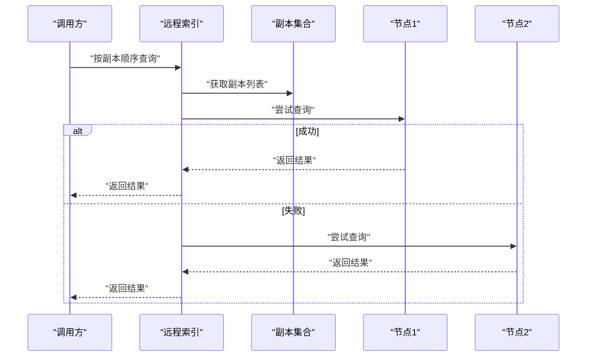
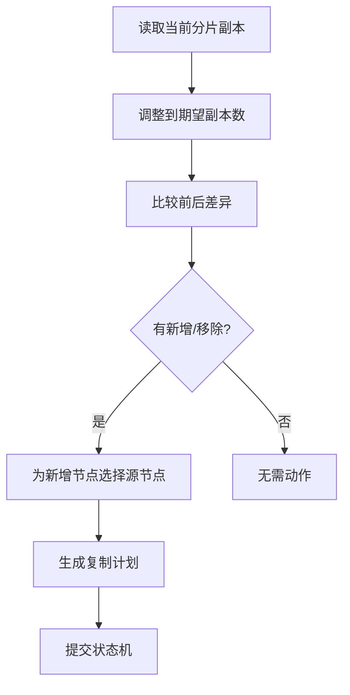
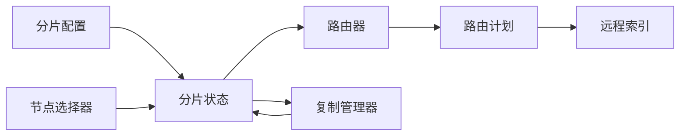

# 分片与路由

<cite>
**本文引用的文件**
- [usecases/sharding/state.go](file://usecases/sharding/state.go)
- [usecases/sharding/config/config.go](file://usecases/sharding/config/config.go)
- [usecases/sharding/remote_index.go](file://usecases/sharding/remote_index.go)
- [cluster/router/router.go](file://cluster/router/router.go)
- [cluster/router/types/router_plan.go](file://cluster/router/types/router_plan.go)
- [cluster/router/types/replicaset.go](file://cluster/router/types/replicaset.go)
- [cluster/replication/manager.go](file://cluster/replication/manager.go)
- [usecases/monitoring/shards.go](file://usecases/monitoring/shards.go)
- [adapters/repos/db/metrics.go](file://adapters/repos/db/metrics.go)
- [usecases/sharding/remote_index_test.go](file://usecases/sharding/remote_index_test.go)
</cite>

## 目录
1. [简介](#简介)
2. [项目结构](#项目结构)
3. [核心组件](#核心组件)
4. [架构总览](#架构总览)
5. [组件详解](#组件详解)
6. [依赖关系分析](#依赖关系分析)
7. [性能考量](#性能考量)
8. [故障排查指南](#故障排查指南)
9. [结论](#结论)
10. [附录](#附录)

## 简介
本文件面向 Weaviate 的分片与路由系统，系统性阐述以下主题：
- 分片策略与数据分布：哈希分片、一致性哈希环、虚拟节点映射
- 路由机制：读写路由、副本选择、一致性级别解析
- 动态分片管理：副本扩缩容、节点变更、复制计划生成
- 远程索引访问与跨节点查询：副本遍历、并发查询、错误聚合
- 配置优化、性能调优与监控指标
- 故障处理、数据重平衡与集群扩容实践

## 项目结构
Weaviate 将分片与路由能力分布在多个子模块中：
- usecases/sharding：分片状态、配置、远程索引访问
- cluster/router：路由构建器与读写路由计划
- cluster/replication：复制状态机与副本扩缩容计划
- usecases/monitoring：分片加载/卸载等运行时指标
- adapters/repos/db：数据库层指标与异步复制相关度量

**图表来源**
- [usecases/sharding/state.go](file://usecases/sharding/state.go#L34-L44)
- [usecases/sharding/config/config.go](file://usecases/sharding/config/config.go#L28-L37)
- [usecases/sharding/remote_index.go](file://usecases/sharding/remote_index.go#L40-L63)
- [cluster/router/router.go](file://cluster/router/router.go#L39-L98)
- [cluster/router/types/router_plan.go](file://cluster/router/types/router_plan.go#L20-L36)
- [cluster/router/types/replicaset.go](file://cluster/router/types/replicaset.go#L19-L23)
- [cluster/replication/manager.go](file://cluster/replication/manager.go#L35-L48)
- [usecases/monitoring/shards.go](file://usecases/monitoring/shards.go#L14-L61)
- [adapters/repos/db/metrics.go](file://adapters/repos/db/metrics.go#L68-L86)

**章节来源**
- [usecases/sharding/state.go](file://usecases/sharding/state.go#L1-L725)
- [usecases/sharding/config/config.go](file://usecases/sharding/config/config.go#L1-L193)
- [usecases/sharding/remote_index.go](file://usecases/sharding/remote_index.go#L1-L546)
- [cluster/router/router.go](file://cluster/router/router.go#L1-L646)
- [cluster/router/types/router_plan.go](file://cluster/router/types/router_plan.go#L1-L196)
- [cluster/router/types/replicaset.go](file://cluster/router/types/replicaset.go#L1-L212)
- [cluster/replication/manager.go](file://cluster/replication/manager.go#L1-L637)
- [usecases/monitoring/shards.go](file://usecases/monitoring/shards.go#L1-L61)
- [adapters/repos/db/metrics.go](file://adapters/repos/db/metrics.go#L46-L86)

## 核心组件
- 分片状态与配置
  - 分片状态对象维护物理分片、虚拟节点、副本集合与复制因子，并支持多租户分区模式
  - 分片配置定义分片数量、虚拟节点数、哈希函数与键策略
- 路由构建器
  - 单租户/多租户两种路由实现，根据一致性级别与副本可用性生成读写路由计划
- 远程索引访问
  - 对副本进行遍历式查询或全副本并行查询，支持错误聚合与上下文取消
- 复制管理器
  - 基于当前/期望副本集合计算扩缩容动作，生成复制计划并驱动状态机

**章节来源**
- [usecases/sharding/state.go](file://usecases/sharding/state.go#L34-L44)
- [usecases/sharding/config/config.go](file://usecases/sharding/config/config.go#L28-L37)
- [cluster/router/router.go](file://cluster/router/router.go#L100-L120)
- [usecases/sharding/remote_index.go](file://usecases/sharding/remote_index.go#L40-L63)
- [cluster/replication/manager.go](file://cluster/replication/manager.go#L35-L48)

## 架构总览
Weaviate 的分片与路由体系围绕“分片状态 + 路由构建 + 远程访问 + 复制管理”协同工作：
- 分片状态决定对象到分片的映射（哈希分片）
- 路由器根据副本可用性与一致性级别生成读写计划
- 远程索引负责跨节点访问与副本遍历
- 复制管理器负责副本扩缩容与状态同步

**图表来源**
- [cluster/router/router.go](file://cluster/router/router.go#L196-L407)
- [cluster/router/types/router_plan.go](file://cluster/router/types/router_plan.go#L47-L91)
- [usecases/sharding/remote_index.go](file://usecases/sharding/remote_index.go#L509-L545)

## 组件详解

### 分片策略与数据分布
- 哈希分片与一致性哈希环
  - 使用 Murmur3 哈希对对象 ID 计算 token，落在虚拟节点环上，映射到物理分片
  - 虚拟节点均匀分布，提升负载均衡；物理分片副本按环相邻原则分配
- 多租户分区
  - 启用分区时，每个租户对应一个物理分片，分片名即租户名
- 配置要点
  - 默认键为 “_id”，默认策略为 “hash”，默认函数为 “murmur3”
  - 虚拟节点数 = 物理分片数 × 每物理分片虚拟节点数

**图表来源**
- [usecases/sharding/state.go](file://usecases/sharding/state.go#L317-L343)
- [usecases/sharding/config/config.go](file://usecases/sharding/config/config.go#L21-L51)

**章节来源**
- [usecases/sharding/state.go](file://usecases/sharding/state.go#L317-L343)
- [usecases/sharding/state.go](file://usecases/sharding/state.go#L565-L620)
- [usecases/sharding/config/config.go](file://usecases/sharding/config/config.go#L53-L70)

### 路由机制：读写路由与一致性
- 读路由
  - 单租户：可针对全部分片或指定分片；按一致性级别解析所需副本数
  - 多租户：租户名即分片名；校验租户状态为热（ACTIVE/HOT）
- 写路由
  - 必须明确目标分片；写副本集通常包含主副本与额外副本
  - 一致性级别解析需满足每分片可用副本数
- 副本排序与首选节点
  - 优先使用直接候选节点或本地节点，其余按副本列表顺序排列

**图表来源**
- [cluster/router/router.go](file://cluster/router/router.go#L196-L407)
- [cluster/router/types/router_plan.go](file://cluster/router/types/router_plan.go#L47-L91)
- [cluster/router/types/replicaset.go](file://cluster/router/types/replicaset.go#L168-L211)

**章节来源**
- [cluster/router/router.go](file://cluster/router/router.go#L196-L407)
- [cluster/router/types/router_plan.go](file://cluster/router/types/router_plan.go#L20-L36)
- [cluster/router/types/replicaset.go](file://cluster/router/types/replicaset.go#L168-L211)

### 远程索引访问与跨节点查询
- 单副本查询
  - 遍历副本列表，直到首个成功响应；支持随机起点避免热点
- 全副本查询
  - 并发向所有副本发起查询，聚合结果；对本地副本跳过重复查询
- 错误处理
  - 上下文取消传播；错误聚合后若无有效结果则返回聚合错误

**图表来源**
- [usecases/sharding/remote_index.go](file://usecases/sharding/remote_index.go#L509-L545)
- [usecases/sharding/remote_index.go](file://usecases/sharding/remote_index.go#L432-L507)

**章节来源**
- [usecases/sharding/remote_index.go](file://usecases/sharding/remote_index.go#L509-L545)
- [usecases/sharding/remote_index.go](file://usecases/sharding/remote_index.go#L432-L507)
- [usecases/sharding/remote_index_test.go](file://usecases/sharding/remote_index_test.go#L23-L77)

### 动态分片管理：扩缩容与复制计划
- 扩缩容计划生成
  - 基于当前/期望副本集合计算新增/移除/剩余节点
  - 为每个新增节点随机选择一个源节点用于数据迁移
- 状态机与操作生命周期
  - 复制管理器通过状态机记录操作状态、错误与取消流程
  - 支持按集合/分片/目标节点查询复制详情

**图表来源**
- [cluster/replication/manager.go](file://cluster/replication/manager.go#L337-L436)
- [cluster/replication/manager.go](file://cluster/replication/manager.go#L438-L504)

**章节来源**
- [cluster/replication/manager.go](file://cluster/replication/manager.go#L337-L436)
- [cluster/replication/manager.go](file://cluster/replication/manager.go#L438-L504)

## 依赖关系分析
- 分片状态依赖配置与节点选择器，初始化时生成虚拟节点环并映射到物理分片
- 路由器依赖分片状态与副本过滤器，解析一致性级别并排序副本
- 远程索引依赖分片状态与节点解析器，按副本访问远端节点
- 复制管理器依赖分片状态与节点选择器，生成扩缩容计划并驱动状态机

**图表来源**
- [usecases/sharding/config/config.go](file://usecases/sharding/config/config.go#L39-L51)
- [usecases/sharding/state.go](file://usecases/sharding/state.go#L286-L314)
- [cluster/router/router.go](file://cluster/router/router.go#L100-L120)
- [cluster/replication/manager.go](file://cluster/replication/manager.go#L41-L48)

**章节来源**
- [usecases/sharding/state.go](file://usecases/sharding/state.go#L286-L314)
- [cluster/router/router.go](file://cluster/router/router.go#L100-L120)
- [cluster/replication/manager.go](file://cluster/replication/manager.go#L41-L48)

## 性能考量
- 哈希分片与虚拟节点
  - 提升均匀性与稳定性；虚拟节点数越大，分布越均匀但内存开销增加
- 副本与一致性
  - 更高的副本数提升可用性，但写放大与网络开销上升；一致性级别越高，可用副本数要求越高
- 远程查询
  - 全副本并行查询可降低尾延迟，但需注意并发上限与资源消耗
- 监控与指标
  - 分片加载/卸载计数器可用于评估热插拔与重平衡影响
  - 数据库层异步复制相关指标有助于观察复制吞吐与延迟

**章节来源**
- [usecases/monitoring/shards.go](file://usecases/monitoring/shards.go#L14-L61)
- [adapters/repos/db/metrics.go](file://adapters/repos/db/metrics.go#L46-L86)

## 故障排查指南
- 查询失败与副本不可用
  - 检查路由计划中的副本是否被过滤（一致性级别不满足）
  - 使用远程索引的全副本查询功能验证各副本健康状况
- 扩缩容异常
  - 查看复制管理器的复制详情与状态历史，确认是否存在错误或取消流程
  - 核对当前/期望副本集合差异，确保源节点选择合理
- 多租户状态问题
  - 确认租户状态为热（ACTIVE/HOT）方可查询；冻结/解冻过程中的中间状态会影响路由

**章节来源**
- [cluster/router/router.go](file://cluster/router/router.go#L482-L537)
- [cluster/replication/manager.go](file://cluster/replication/manager.go#L122-L140)
- [usecases/sharding/remote_index.go](file://usecases/sharding/remote_index.go#L432-L507)

## 结论
Weaviate 的分片与路由系统通过“哈希分片 + 一致性哈希环 + 副本集一致性解析 + 远程索引遍历/并行查询 + 复制管理器”的组合，实现了高可用、可扩展且可观测的数据访问路径。在多租户场景下，分区化分片进一步增强了隔离与治理能力。配合完善的监控指标与复制计划工具，系统可在高并发与大规模集群中保持稳定与高效。

## 附录

### 分片配置优化建议
- 虚拟节点数
  - 建议从默认值起步，结合节点规模与数据增长趋势调整，避免过度增大导致内存压力
- 副本因子
  - 在可用节点充足时适度提高副本数以增强容错；同时关注写放大与网络带宽
- 一致性级别
  - 生产环境建议采用“quorum”或更高，确保强一致读写；对低延迟读可使用“one”

**章节来源**
- [usecases/sharding/config/config.go](file://usecases/sharding/config/config.go#L21-L51)
- [cluster/router/types/replicaset.go](file://cluster/router/types/replicaset.go#L168-L211)

### 性能调优清单
- 读路径
  - 启用全副本并行查询以降低尾延迟；限制并发度防止拥塞
- 写路径
  - 控制写副本数量与一致性级别；批量写入减少网络往返
- 监控
  - 关注分片加载/卸载指标与异步复制指标，及时发现异常

**章节来源**
- [usecases/monitoring/shards.go](file://usecases/monitoring/shards.go#L14-L61)
- [adapters/repos/db/metrics.go](file://adapters/repos/db/metrics.go#L46-L86)