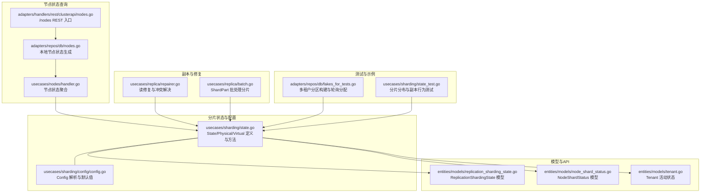
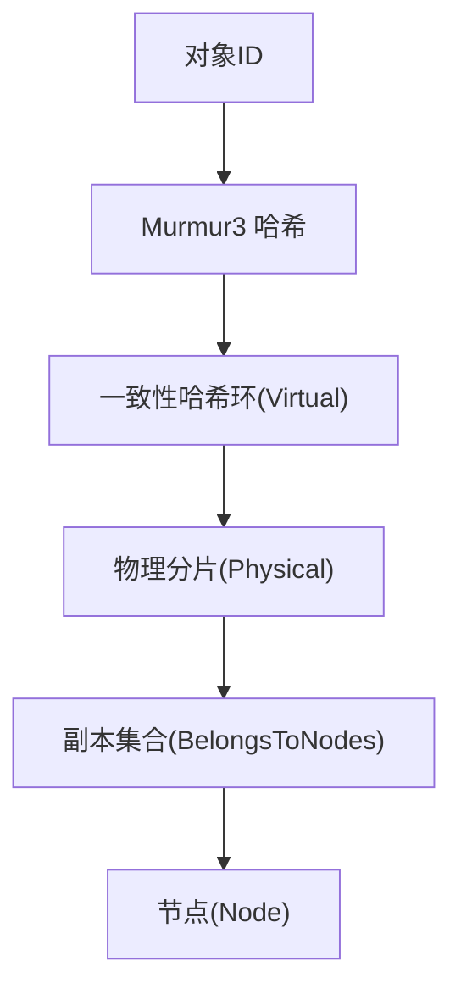
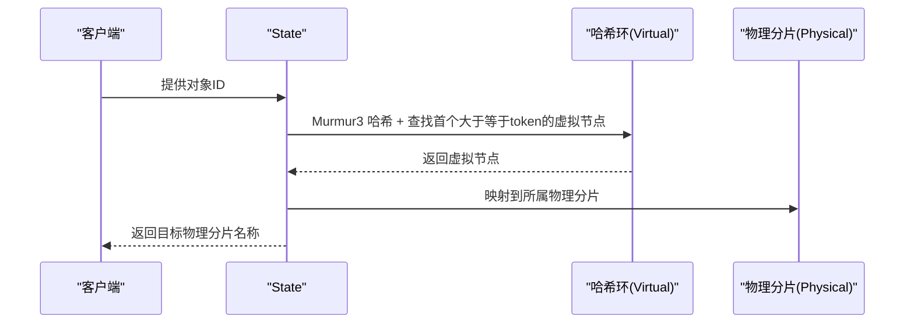
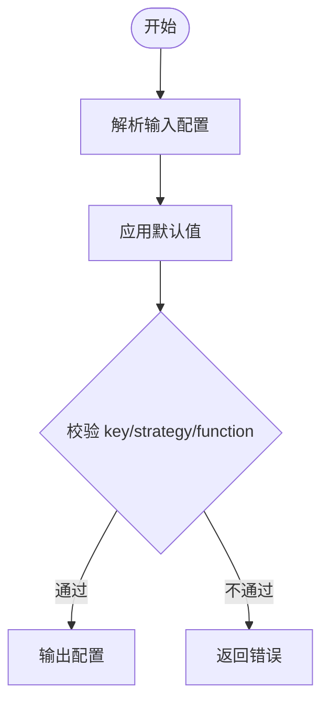
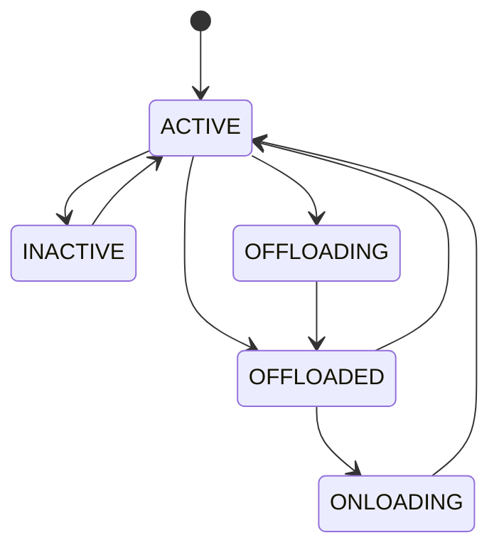
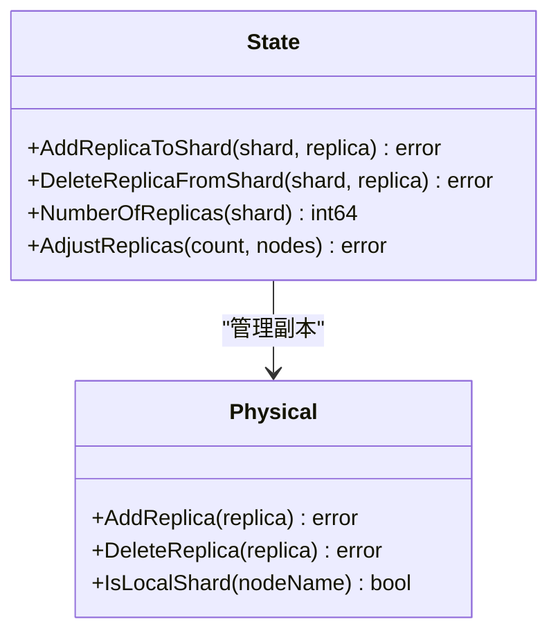
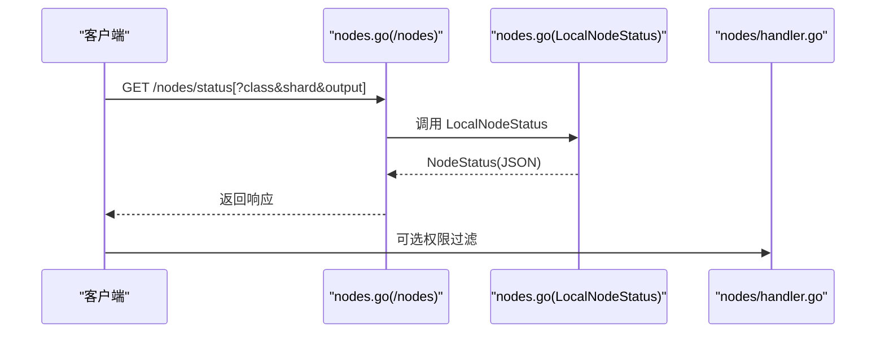
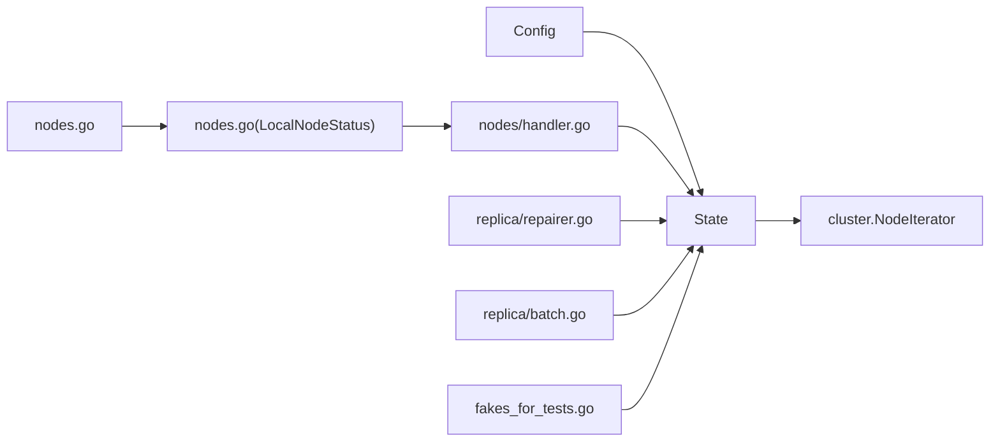

# 分片策略

<cite>
**本文引用的文件**
- [usecases/sharding/state.go](file://usecases/sharding/state.go)
- [usecases/sharding/config/config.go](file://usecases/sharding/config/config.go)
- [entities/models/replication_sharding_state.go](file://entities/models/replication_sharding_state.go)
- [entities/models/node_shard_status.go](file://entities/models/node_shard_status.go)
- [adapters/handlers/rest/clusterapi/nodes.go](file://adapters/handlers/rest/clusterapi/nodes.go)
- [adapters/repos/db/nodes.go](file://adapters/repos/db/nodes.go)
- [usecases/nodes/handler.go](file://usecases/nodes/handler.go)
- [usecases/replica/repairer.go](file://usecases/replica/repairer.go)
- [usecases/replica/batch.go](file://usecases/replica/batch.go)
- [adapters/repos/db/fakes_for_tests.go](file://adapters/repos/db/fakes_for_tests.go)
- [entities/models/tenant.go](file://entities/models/tenant.go)
- [openapi-specs/schema.json](file://openapi-specs/schema.json)
- [grpc/generated/protocol/v1/tenants.pb.go](file://grpc/generated/protocol/v1/tenants.pb.go)
- [adapters/repos/db/backup.go](file://adapters/repos/db/backup.go)
- [usecases/sharding/state_test.go](file://usecases/sharding/state_test.go)
</cite>

## 目录
1. [引言](#引言)
2. [项目结构](#项目结构)
3. [核心组件](#核心组件)
4. [架构总览](#架构总览)
5. [详细组件分析](#详细组件分析)
6. [依赖关系分析](#依赖关系分析)
7. [性能考量](#性能考量)
8. [故障排查指南](#故障排查指南)
9. [结论](#结论)
10. [附录](#附录)

## 引言
本技术文档围绕 Weaviate 的分片策略进行系统性说明，重点覆盖以下方面：
- 分片核心概念与实现：哈希分片算法、虚拟节点、一致性哈希环；当前版本对“范围分片”与“一致性哈希”的支持现状与限制。
- 分片状态管理：分片生命周期、状态转换（含多租户活动状态）、持久化与序列化。
- 分片配置参数：分片数量、副本数量、分配策略与默认值。
- 分片键与数据分布：当前仅支持基于对象 ID 的哈希分片，以及 Murmur3 哈希函数。
- 性能优化：热点数据处理、负载均衡策略与建议。
- 故障检测与恢复：读修复、异步复制状态、备份与恢复流程中的分片状态维护。
- 高并发场景表现：在不同策略下的适用性与注意事项。

## 项目结构
Weaviate 的分片策略由“分片状态模型”“配置解析器”“REST/内部查询接口”“读修复与副本协调”等模块共同组成。下图展示与分片相关的关键文件与交互：

**图表来源**
- [usecases/sharding/state.go](file://usecases/sharding/state.go#L34-L147)
- [usecases/sharding/config/config.go](file://usecases/sharding/config/config.go#L28-L51)
- [entities/models/replication_sharding_state.go](file://entities/models/replication_sharding_state.go#L28-L38)
- [entities/models/node_shard_status.go](file://entities/models/node_shard_status.go#L28-L62)
- [adapters/handlers/rest/clusterapi/nodes.go](file://adapters/handlers/rest/clusterapi/nodes.go#L47-L146)
- [adapters/repos/db/nodes.go](file://adapters/repos/db/nodes.go#L87-L186)
- [usecases/nodes/handler.go](file://usecases/nodes/handler.go#L71-L101)
- [usecases/replica/repairer.go](file://usecases/replica/repairer.go#L46-L101)
- [usecases/replica/batch.go](file://usecases/replica/batch.go#L72-L99)
- [adapters/repos/db/fakes_for_tests.go](file://adapters/repos/db/fakes_for_tests.go#L244-L292)
- [usecases/sharding/state_test.go](file://usecases/sharding/state_test.go#L29-L80)

**章节来源**
- [usecases/sharding/state.go](file://usecases/sharding/state.go#L34-L147)
- [usecases/sharding/config/config.go](file://usecases/sharding/config/config.go#L28-L51)
- [adapters/handlers/rest/clusterapi/nodes.go](file://adapters/handlers/rest/clusterapi/nodes.go#L47-L146)
- [adapters/repos/db/nodes.go](file://adapters/repos/db/nodes.go#L87-L186)
- [usecases/nodes/handler.go](file://usecases/nodes/handler.go#L71-L101)
- [usecases/replica/repairer.go](file://usecases/replica/repairer.go#L46-L101)
- [usecases/replica/batch.go](file://usecases/replica/batch.go#L72-L99)
- [adapters/repos/db/fakes_for_tests.go](file://adapters/repos/db/fakes_for_tests.go#L244-L292)
- [usecases/sharding/state_test.go](file://usecases/sharding/state_test.go#L29-L80)

## 核心组件
- 分片状态 State：封装物理分片、虚拟节点、一致性哈希环、副本集合、分片配置与本地节点名等信息，并提供分片选择、副本增删、分区添加/删除、节点映射替换等能力。
- 分片配置 Config：定义分片数量、虚拟节点数、分片键、策略与哈希函数等参数，默认值与校验逻辑。
- 节点状态模型：用于对外暴露每个节点上各分片的状态（是否加载、对象数、向量索引状态、异步复制状态等）。
- 多租户活动状态：通过 Tenant 活动状态控制分片的可用性与存储位置（如热/冷/冻结等）。
- 读修复与副本协调：在读取时对多个副本进行一致性检查与修复，保证数据一致性。

**章节来源**
- [usecases/sharding/state.go](file://usecases/sharding/state.go#L34-L147)
- [usecases/sharding/config/config.go](file://usecases/sharding/config/config.go#L28-L51)
- [entities/models/node_shard_status.go](file://entities/models/node_shard_status.go#L28-L62)
- [entities/models/tenant.go](file://entities/models/tenant.go#L29-L40)

## 架构总览
Weaviate 的分片采用“物理分片 + 虚拟节点 + 一致性哈希环”的设计。对象 ID 经 Murmur3 哈希后落入哈希环，确定目标物理分片。副本集通过“右邻”规则在环上连续分布，确保均匀性与可扩展性。多租户模式下，每个租户对应一个物理分片（或分区），并可设置活动状态以控制其可查询性与存储位置。

**图表来源**
- [usecases/sharding/state.go](file://usecases/sharding/state.go#L327-L343)
- [usecases/sharding/state.go](file://usecases/sharding/state.go#L565-L590)
- [usecases/sharding/state.go](file://usecases/sharding/state.go#L595-L620)

**章节来源**
- [usecases/sharding/state.go](file://usecases/sharding/state.go#L327-L343)
- [usecases/sharding/state.go](file://usecases/sharding/state.go#L565-L590)
- [usecases/sharding/state.go](file://usecases/sharding/state.go#L595-L620)

## 详细组件分析

### 分片状态与生命周期
- 初始化：根据节点列表与副本因子初始化物理分片，按“右邻”规则分配副本，随后生成虚拟节点并随机打散到哈希环上，完成虚拟到物理的映射。
- 运行期：通过对象 ID 计算哈希，定位虚拟节点，再映射到物理分片；支持本地分片判断、遍历本地分片等辅助能力。
- 更新与迁移：支持节点映射替换、副本增删、分区添加/删除；在多租户场景中，分区即租户分片，支持按租户状态进行活动控制。
- 持久化：分片状态可序列化为 JSON 并在需要时重建，保证重启后的分片布局一致。

**图表来源**
- [usecases/sharding/state.go](file://usecases/sharding/state.go#L327-L343)
- [usecases/sharding/state.go](file://usecases/sharding/state.go#L634-L644)

**章节来源**
- [usecases/sharding/state.go](file://usecases/sharding/state.go#L286-L314)
- [usecases/sharding/state.go](file://usecases/sharding/state.go#L398-L460)
- [usecases/sharding/state.go](file://usecases/sharding/state.go#L565-L620)
- [usecases/sharding/state.go](file://usecases/sharding/state.go#L657-L696)

### 分片配置参数
- 关键参数
  - desiredCount：期望物理分片数（默认与节点数相同）
  - virtualPerPhysical：每个物理分片对应的虚拟节点数（默认 128）
  - desiredVirtualCount：虚拟节点总数（= desiredCount × virtualPerPhysical）
  - key：分片键（当前仅支持 “_id”）
  - strategy：分片策略（当前仅支持 “hash”）
  - function：哈希函数（当前仅支持 “murmur3”）
- 默认值与校验：若未显式指定，按默认值填充；当 key/strategy/function 不符合当前支持范围时，将返回错误。

**图表来源**
- [usecases/sharding/config/config.go](file://usecases/sharding/config/config.go#L85-L146)
- [usecases/sharding/config/config.go](file://usecases/sharding/config/config.go#L53-L70)

**章节来源**
- [usecases/sharding/config/config.go](file://usecases/sharding/config/config.go#L28-L51)
- [usecases/sharding/config/config.go](file://usecases/sharding/config/config.go#L85-L146)

### 分片键选择与数据分布
- 当前版本仅支持基于对象 ID 的哈希分片，且使用 Murmur3 哈希函数。
- 测试用例验证了在随机对象 ID 下，物理分片的分布接近均匀（最低阈值约 15%），表明哈希环与虚拟节点打散策略有效。

**章节来源**
- [usecases/sharding/state.go](file://usecases/sharding/state.go#L327-L343)
- [usecases/sharding/state_test.go](file://usecases/sharding/state_test.go#L29-L80)

### 多租户分区与活动状态
- 分区启用时，每个租户对应一个物理分片（分区），并可设置活动状态（如 ACTIVE/INACTIVE/OFFLOADED 等）。
- 租户活动状态影响数据可查询性与存储位置（例如 OFFLOADED 表示数据位于远程后端）。状态变更通过 RAFT 协议更新，期间可能经历过渡状态（如 OFFLOADING/ONLOADING）。
- 多租户分区构建示例：使用轮询方式为租户选择副本节点，确保跨节点均匀分布。

**图表来源**
- [entities/models/tenant.go](file://entities/models/tenant.go#L29-L40)
- [openapi-specs/schema.json](file://openapi-specs/schema.json#L3282-L3294)
- [grpc/generated/protocol/v1/tenants.pb.go](file://grpc/generated/protocol/v1/tenants.pb.go#L38-L80)
- [adapters/repos/db/fakes_for_tests.go](file://adapters/repos/db/fakes_for_tests.go#L273-L290)

**章节来源**
- [adapters/repos/db/fakes_for_tests.go](file://adapters/repos/db/fakes_for_tests.go#L244-L292)
- [entities/models/tenant.go](file://entities/models/tenant.go#L29-L40)
- [openapi-specs/schema.json](file://openapi-specs/schema.json#L3282-L3294)

### 副本管理与一致性
- 副本增删：支持为指定物理分片添加/删除副本，删除操作受最小副本因子限制。
- 副本调整：根据节点候选集动态扩展或收缩副本集合，确保唯一性与数量满足要求。
- 一致性哈希环：通过虚拟节点与随机打散策略，降低扩容/缩容时的数据迁移成本。

**图表来源**
- [usecases/sharding/state.go](file://usecases/sharding/state.go#L155-L270)

**章节来源**
- [usecases/sharding/state.go](file://usecases/sharding/state.go#L155-L270)

### 节点状态查询与可观测性
- REST 接口：/nodes/status 支持按类名与分片名过滤，支持输出级别（最小/详细）。
- 内部实现：聚合本地节点状态，包含各分片对象数、加载状态、向量索引状态、异步复制状态等。
- 权限与过滤：根据授权策略对返回的分片列表进行资源过滤。

**图表来源**
- [adapters/handlers/rest/clusterapi/nodes.go](file://adapters/handlers/rest/clusterapi/nodes.go#L47-L146)
- [adapters/repos/db/nodes.go](file://adapters/repos/db/nodes.go#L87-L186)
- [usecases/nodes/handler.go](file://usecases/nodes/handler.go#L71-L101)

**章节来源**
- [adapters/handlers/rest/clusterapi/nodes.go](file://adapters/handlers/rest/clusterapi/nodes.go#L47-L146)
- [adapters/repos/db/nodes.go](file://adapters/repos/db/nodes.go#L87-L186)
- [usecases/nodes/handler.go](file://usecases/nodes/handler.go#L71-L101)

### 读修复与副本一致性
- 读修复：在读取时从多个副本收集结果，依据时间戳与删除标记进行冲突解决，必要时触发写入修复。
- 删除策略：支持“冲突时删除”等策略，减少不一致带来的脏读风险。

**章节来源**
- [usecases/replica/repairer.go](file://usecases/replica/repairer.go#L46-L101)

### 批处理与分片划分
- ShardPart：将批量数据按目标分片拆分，便于并行写入与复制。
- 适用场景：批量导入、复制任务等需要按分片粒度调度的场景。

**章节来源**
- [usecases/replica/batch.go](file://usecases/replica/batch.go#L72-L99)

### 分片状态模型与序列化
- ReplicationShardingState：描述集合的分片与副本分布，常用于复制/恢复场景的状态交换。
- NodeShardStatus：描述单个节点上分片的统计与状态（对象数、加载状态、向量索引状态、异步复制状态等）。
- 备份流程：在备份过程中会序列化分片状态，确保备份完成后可正确恢复。

**章节来源**
- [entities/models/replication_sharding_state.go](file://entities/models/replication_sharding_state.go#L28-L38)
- [entities/models/node_shard_status.go](file://entities/models/node_shard_status.go#L28-L62)
- [adapters/repos/db/backup.go](file://adapters/repos/db/backup.go#L274-L293)

## 依赖关系分析
- State 依赖 Config 提供分片参数；依赖 cluster.NodeIterator 实现节点遍历与“右邻”分配。
- 节点状态查询链路：REST -> DB(LocalNodeStatus) -> usecases(nodes/handler) -> DB(Index.getShardsNodeStatus)。
- 读修复依赖副本发现与 FinderClient，结合删除策略进行修复。
- 多租户分区构建依赖轮询节点选择策略，确保副本均匀分布。

**图表来源**
- [usecases/sharding/state.go](file://usecases/sharding/state.go#L421-L460)
- [adapters/handlers/rest/clusterapi/nodes.go](file://adapters/handlers/rest/clusterapi/nodes.go#L47-L146)
- [adapters/repos/db/nodes.go](file://adapters/repos/db/nodes.go#L87-L186)
- [usecases/nodes/handler.go](file://usecases/nodes/handler.go#L71-L101)
- [usecases/replica/repairer.go](file://usecases/replica/repairer.go#L46-L101)
- [usecases/replica/batch.go](file://usecases/replica/batch.go#L72-L99)
- [adapters/repos/db/fakes_for_tests.go](file://adapters/repos/db/fakes_for_tests.go#L273-L290)

**章节来源**
- [usecases/sharding/state.go](file://usecases/sharding/state.go#L421-L460)
- [adapters/handlers/rest/clusterapi/nodes.go](file://adapters/handlers/rest/clusterapi/nodes.go#L47-L146)
- [adapters/repos/db/nodes.go](file://adapters/repos/db/nodes.go#L87-L186)
- [usecases/nodes/handler.go](file://usecases/nodes/handler.go#L71-L101)
- [usecases/replica/repairer.go](file://usecases/replica/repairer.go#L46-L101)
- [usecases/replica/batch.go](file://usecases/replica/batch.go#L72-L99)
- [adapters/repos/db/fakes_for_tests.go](file://adapters/repos/db/fakes_for_tests.go#L273-L290)

## 性能考量
- 哈希分片与虚拟节点
  - 使用 128 个虚拟节点/物理分片的默认配置，有助于平滑分布，降低扩容/缩容时的重分布成本。
  - 对于热点数据，建议结合业务层的分片键设计（如引入业务域前缀）与副本因子调优。
- 副本与负载均衡
  - 增加副本因子可提升读吞吐与容错能力，但需平衡写放大与存储开销。
  - 在多租户场景中，合理设置租户活动状态（如将冷数据冻结至远端存储）可降低热节点压力。
- 向量索引与队列长度
  - 观察 NodeShardStatus 中的向量索引状态与队列长度，及时调整批处理大小与并发度。

[本节为通用指导，无需特定文件引用]

## 故障排查指南
- 节点状态与分片可见性
  - 通过 /nodes/status 获取节点与分片状态，确认对象数、加载状态、异步复制状态是否正常。
- 读修复与冲突
  - 若出现读到不一致结果，检查读修复日志与指标，确认删除策略配置是否符合预期。
- 备份与恢复
  - 备份流程会序列化分片状态，若恢复失败，优先核对备份状态与分片布局一致性。
- 多租户状态异常
  - 若租户处于冻结/解冻过渡态，等待过渡完成后再次尝试访问；必要时通过更新租户活动状态强制推进。

**章节来源**
- [adapters/handlers/rest/clusterapi/nodes.go](file://adapters/handlers/rest/clusterapi/nodes.go#L47-L146)
- [adapters/repos/db/nodes.go](file://adapters/repos/db/nodes.go#L87-L186)
- [usecases/nodes/handler.go](file://usecases/nodes/handler.go#L71-L101)
- [usecases/replica/repairer.go](file://usecases/replica/repairer.go#L46-L101)
- [adapters/repos/db/backup.go](file://adapters/repos/db/backup.go#L239-L293)

## 结论
Weaviate 当前版本采用“哈希分片 + 一致性哈希环 + 虚拟节点”的成熟方案，配合副本与多租户活动状态，实现了良好的可扩展性与可靠性。对于高并发场景，建议结合副本因子、分片键设计与租户状态策略进行综合优化；同时通过节点状态观测与读修复机制保障一致性与稳定性。

[本节为总结，无需特定文件引用]

## 附录
- 分片状态与配置的默认值与校验逻辑
  - 默认虚拟节点/物理分片比：128
  - 默认分片键：_id
  - 默认策略：hash
  - 默认哈希函数：murmur3
- 多租户活动状态枚举与语义
  - ACTIVE/INACTIVE/OFFLOADED 及其过渡态（OFFLOADING/ONLOADING）等，详见模型与 OpenAPI 规范。

**章节来源**
- [usecases/sharding/config/config.go](file://usecases/sharding/config/config.go#L21-L26)
- [entities/models/tenant.go](file://entities/models/tenant.go#L29-L40)
- [openapi-specs/schema.json](file://openapi-specs/schema.json#L3282-L3294)