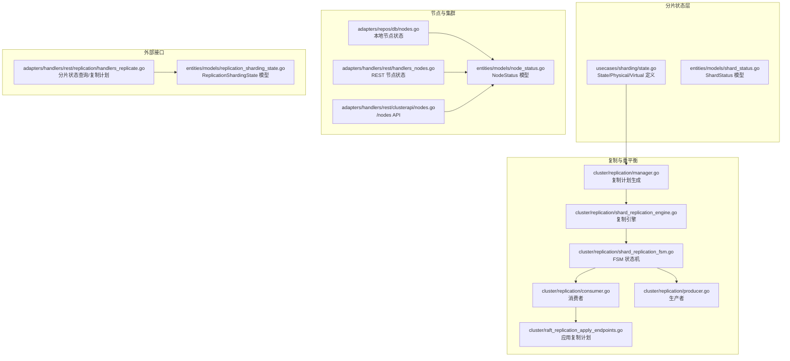
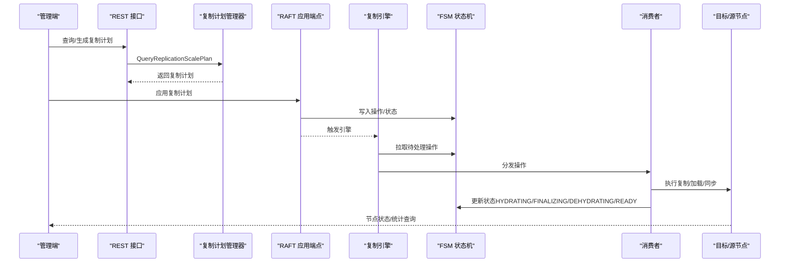
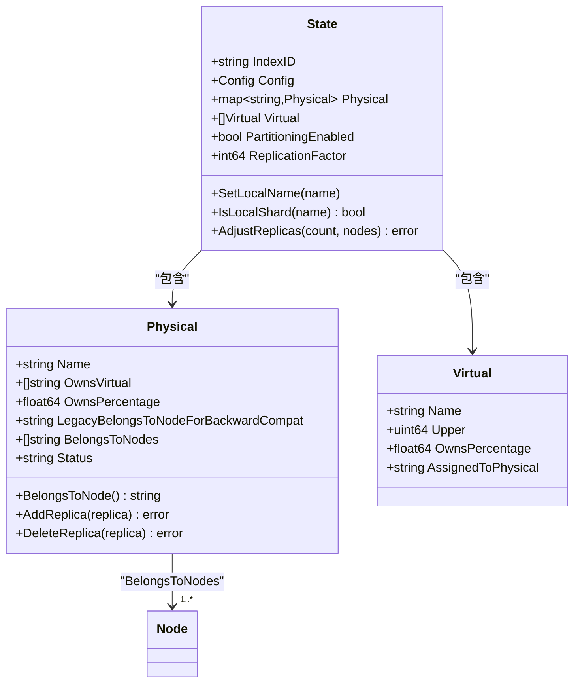
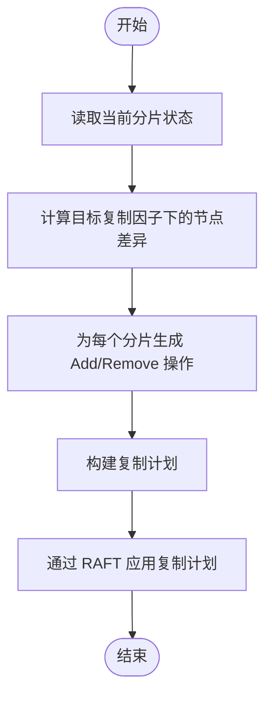
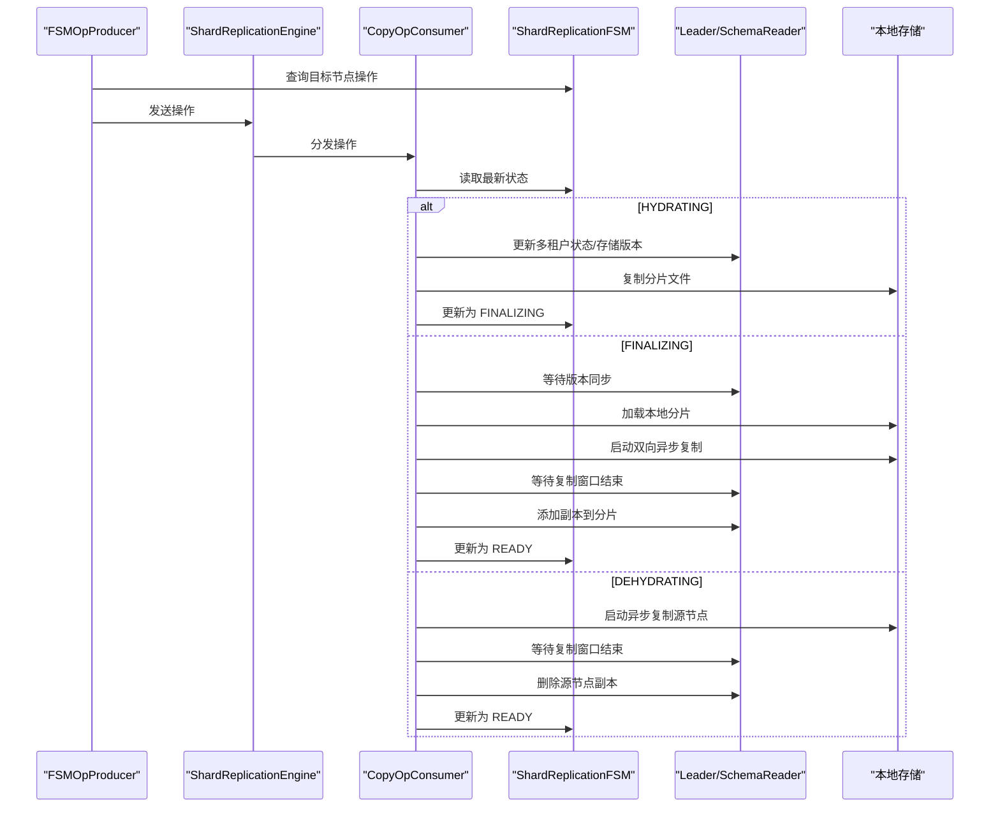
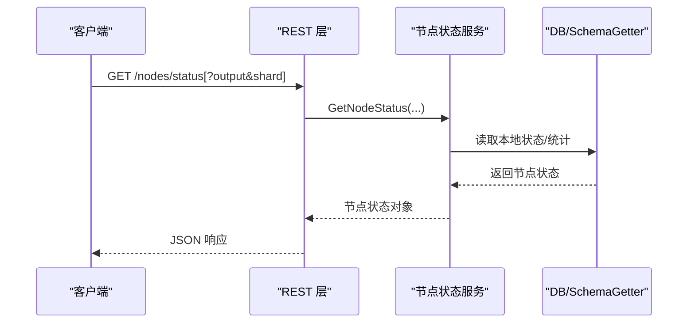
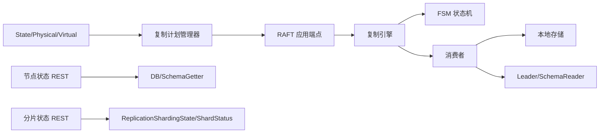

# 动态分片管理

<cite>
**本文引用的文件**
- [usecases/sharding/state.go](file://usecases/sharding/state.go)
- [entities/models/shard_status.go](file://entities/models/shard_status.go)
- [cluster/replication/manager.go](file://cluster/replication/manager.go)
- [adapters/handlers/rest/replication/handlers_replicate.go](file://adapters/handlers/rest/replication/handlers_replicate.go)
- [cluster/raft_replication_apply_endpoints.go](file://cluster/raft_replication_apply_endpoints.go)
- [adapters/repos/db/nodes.go](file://adapters/repos/db/nodes.go)
- [adapters/handlers/rest/handlers_nodes.go](file://adapters/handlers/rest/handlers_nodes.go)
- [adapters/handlers/rest/clusterapi/nodes.go](file://adapters/handlers/rest/clusterapi/nodes.go)
- [entities/models/node_status.go](file://entities/models/node_status.go)
- [entities/models/replication_sharding_state.go](file://entities/models/replication_sharding_state.go)
- [cluster/replication/shard_replication_engine.go](file://cluster/replication/shard_replication_engine.go)
- [cluster/replication/shard_replication_fsm.go](file://cluster/replication/shard_replication_fsm.go)
- [cluster/replication/consumer.go](file://cluster/replication/consumer.go)
- [cluster/replication/producer.go](file://cluster/replication/producer.go)
</cite>

## 目录
1. [引言](#引言)
2. [项目结构](#项目结构)
3. [核心组件](#核心组件)
4. [架构总览](#架构总览)
5. [详细组件分析](#详细组件分析)
6. [依赖关系分析](#依赖关系分析)
7. [性能考量](#性能考量)
8. [故障排查指南](#故障排查指南)
9. [结论](#结论)
10. [附录](#附录)

## 引言
本技术文档聚焦 Weaviate 的动态分片管理能力，系统性阐述分片的动态调整机制（扩容、缩容、迁移）、负载均衡与容量扩展策略、状态监控与健康检查、重平衡算法、运维工具与监控界面使用，以及故障恢复、数据完整性与一致性的保障措施。文档以代码级分析为基础，辅以图示帮助读者快速理解从状态模型到执行引擎的全链路实现。

## 项目结构
Weaviate 的动态分片管理涉及以下关键层次：
- 分片状态模型：定义物理/虚拟分片、副本集合、复制因子等核心数据结构与操作。
- 复制与重平衡：通过复制计划生成器与复制引擎协调跨节点的数据复制与状态变更。
- 状态机与执行：基于有限状态机（FSM）驱动复制操作生命周期，消费者负责具体状态处理。
- 节点与集群视图：提供节点状态查询、统计聚合与健康度评估接口。
- REST 接口：对外暴露分片状态查询、复制计划生成与应用等 API。

图表来源
- [usecases/sharding/state.go](file://usecases/sharding/state.go#L34-L147)
- [cluster/replication/manager.go](file://cluster/replication/manager.go#L337-L468)
- [cluster/raft_replication_apply_endpoints.go](file://cluster/raft_replication_apply_endpoints.go#L78-L121)
- [cluster/replication/shard_replication_engine.go](file://cluster/replication/shard_replication_engine.go#L48-L133)
- [cluster/replication/shard_replication_fsm.go](file://cluster/replication/shard_replication_fsm.go#L61-L106)
- [cluster/replication/consumer.go](file://cluster/replication/consumer.go#L48-L114)
- [cluster/replication/producer.go](file://cluster/replication/producer.go#L21-L51)
- [adapters/repos/db/nodes.go](file://adapters/repos/db/nodes.go#L87-L123)
- [adapters/handlers/rest/handlers_nodes.go](file://adapters/handlers/rest/handlers_nodes.go#L34-L80)
- [adapters/handlers/rest/clusterapi/nodes.go](file://adapters/handlers/rest/clusterapi/nodes.go#L47-L146)
- [entities/models/node_status.go](file://entities/models/node_status.go#L151-L342)
- [adapters/handlers/rest/replication/handlers_replicate.go](file://adapters/handlers/rest/replication/handlers_replicate.go#L437-L459)
- [entities/models/replication_sharding_state.go](file://entities/models/replication_sharding_state.go#L28-L38)

章节来源
- [usecases/sharding/state.go](file://usecases/sharding/state.go#L34-L147)
- [cluster/replication/manager.go](file://cluster/replication/manager.go#L337-L468)
- [cluster/replication/shard_replication_engine.go](file://cluster/replication/shard_replication_engine.go#L48-L133)
- [cluster/replication/shard_replication_fsm.go](file://cluster/replication/shard_replication_fsm.go#L61-L106)
- [cluster/replication/consumer.go](file://cluster/replication/consumer.go#L48-L114)
- [cluster/replication/producer.go](file://cluster/replication/producer.go#L21-L51)
- [adapters/repos/db/nodes.go](file://adapters/repos/db/nodes.go#L87-L123)
- [adapters/handlers/rest/handlers_nodes.go](file://adapters/handlers/rest/handlers_nodes.go#L34-L80)
- [adapters/handlers/rest/clusterapi/nodes.go](file://adapters/handlers/rest/clusterapi/nodes.go#L47-L146)
- [entities/models/node_status.go](file://entities/models/node_status.go#L151-L342)
- [adapters/handlers/rest/replication/handlers_replicate.go](file://adapters/handlers/rest/replication/handlers_replicate.go#L437-L459)
- [entities/models/replication_sharding_state.go](file://entities/models/replication_sharding_state.go#L28-L38)

## 核心组件
- 分片状态模型（State/Physical/Virtual）
  - 物理分片（Physical）：记录每个分片归属的节点集合、拥有百分比、状态等。
  - 虚拟分片（Virtual）：用于一致性哈希环，决定对象映射到物理分片。
  - 复制因子与副本管理：支持增删副本、调整副本集、校验可用节点数量。
- 复制计划生成（Manager.QueryReplicationScalePlan）
  - 基于当前分片布局与目标复制因子，计算“新增/删除/保留”节点的差异，生成可应用的复制计划。
- 复制引擎与状态机（Engine + FSM）
  - 引擎采用生产者-消费者模式，缓冲通道实现背压；FSM 维护复制操作的状态流转。
- 消费者与生产者
  - 生产者按轮询从 FSM 获取应由当前节点处理的操作；消费者并发执行状态转换，含超时、重试、取消与清理。
- 节点状态与健康检查
  - 提供节点状态查询、统计聚合与健康度评估，支持最小/详细/冗长输出级别。

章节来源
- [usecases/sharding/state.go](file://usecases/sharding/state.go#L34-L147)
- [cluster/replication/manager.go](file://cluster/replication/manager.go#L337-L468)
- [cluster/replication/shard_replication_engine.go](file://cluster/replication/shard_replication_engine.go#L48-L133)
- [cluster/replication/shard_replication_fsm.go](file://cluster/replication/shard_replication_fsm.go#L61-L106)
- [cluster/replication/consumer.go](file://cluster/replication/consumer.go#L48-L114)
- [cluster/replication/producer.go](file://cluster/replication/producer.go#L21-L51)
- [adapters/repos/db/nodes.go](file://adapters/repos/db/nodes.go#L87-L123)

## 架构总览
动态分片管理的端到端流程如下：
- 管理侧调用复制计划生成接口，得到可应用的计划。
- 通过 RAFT 应用复制计划，写入 FSM 并触发复制引擎。
- 引擎拉取操作并按状态机推进：HYDRATING → FINALIZING → READY（或 DEHYDRATING → READY），期间进行异步复制、同步与一致性校验。
- 节点状态接口提供健康度与统计信息，辅助运维观测。

图表来源
- [adapters/handlers/rest/replication/handlers_replicate.go](file://adapters/handlers/rest/replication/handlers_replicate.go#L437-L459)
- [cluster/replication/manager.go](file://cluster/replication/manager.go#L337-L468)
- [cluster/raft_replication_apply_endpoints.go](file://cluster/raft_replication_apply_endpoints.go#L78-L121)
- [cluster/replication/shard_replication_engine.go](file://cluster/replication/shard_replication_engine.go#L135-L218)
- [cluster/replication/shard_replication_fsm.go](file://cluster/replication/shard_replication_fsm.go#L108-L146)
- [cluster/replication/consumer.go](file://cluster/replication/consumer.go#L177-L339)

## 详细组件分析

### 分片状态模型与副本管理
- 物理分片（Physical）
  - 记录分片名称、归属节点列表、拥有百分比、状态字段。
  - 支持添加/删除副本，校验副本数量不得低于复制因子。
- 虚拟分片（Virtual）
  - 通过一致性哈希环将对象映射到物理分片；初始化时随机打散，确保均匀分布。
- 复制因子与副本调整
  - 通过 AdjustReplicas 将副本集收缩或扩展至目标数量，并确保节点唯一性与可用性。
- 分区化（多租户）
  - 支持分区模式下的分片分配与状态管理，冻结/解冻状态参与布局决策。

图表来源
- [usecases/sharding/state.go](file://usecases/sharding/state.go#L34-L147)
- [usecases/sharding/state.go](file://usecases/sharding/state.go#L224-L270)
- [usecases/sharding/state.go](file://usecases/sharding/state.go#L565-L620)

章节来源
- [usecases/sharding/state.go](file://usecases/sharding/state.go#L34-L147)
- [usecases/sharding/state.go](file://usecases/sharding/state.go#L224-L270)
- [usecases/sharding/state.go](file://usecases/sharding/state.go#L565-L620)

### 复制计划生成与应用
- 计划生成
  - 读取当前分片布局，为目标复制因子计算“新增/删除/保留”的节点集合差异，生成复制计划。
  - 对每个分片，确定需要添加/移除的节点，并为添加节点选择合适的源节点（用于迁移或空副本创建）。
- 计划应用
  - 通过 RAFT 应用端点将计划转化为 FSM 操作，触发复制引擎执行。
  - 对于缩容场景，先在目标节点完成 FINALIZING（异步复制完成并加载），再在源节点进入 DEHYDRATING（启动异步复制、等待窗口后删除副本并同步）。

图表来源
- [cluster/replication/manager.go](file://cluster/replication/manager.go#L337-L468)
- [cluster/raft_replication_apply_endpoints.go](file://cluster/raft_replication_apply_endpoints.go#L78-L121)

章节来源
- [cluster/replication/manager.go](file://cluster/replication/manager.go#L337-L468)
- [cluster/raft_replication_apply_endpoints.go](file://cluster/raft_replication_apply_endpoints.go#L78-L121)

### 复制引擎与状态机
- 引擎（ShardReplicationEngine）
  - 启动生产者与消费者协程，使用带缓冲通道实现背压；支持优雅关闭与错误传播。
- 状态机（ShardReplicationFSM）
  - 维护操作 ID、目标/源节点索引、状态映射与指标；提供按节点/集合/分片维度查询操作的能力。
  - 提供读写副本过滤逻辑：根据操作状态动态决定哪些副本可用于读/写。
- 消费者（CopyOpConsumer）
  - 按状态机推进：REGISTERED→HYDRATING→FINALIZING→READY 或 DEHYDRATING→READY。
  - 在 FINALIZING 阶段启动双向异步复制，等待复制窗口完成后更新分片状态；在 MOVE 场景下，DEHYDRATING 阶段在源节点删除副本并同步。
  - 支持取消/删除操作：清理异步复制、同步分片状态、通知 FSM。
- 生产者（FSMOpProducer）
  - 周期性轮询 FSM，筛选当前节点应处理的操作并发送到通道。

图表来源
- [cluster/replication/shard_replication_engine.go](file://cluster/replication/shard_replication_engine.go#L135-L218)
- [cluster/replication/shard_replication_fsm.go](file://cluster/replication/shard_replication_fsm.go#L108-L146)
- [cluster/replication/consumer.go](file://cluster/replication/consumer.go#L341-L764)
- [cluster/replication/producer.go](file://cluster/replication/producer.go#L53-L131)

章节来源
- [cluster/replication/shard_replication_engine.go](file://cluster/replication/shard_replication_engine.go#L48-L133)
- [cluster/replication/shard_replication_fsm.go](file://cluster/replication/shard_replication_fsm.go#L61-L106)
- [cluster/replication/consumer.go](file://cluster/replication/consumer.go#L177-L339)
- [cluster/replication/producer.go](file://cluster/replication/producer.go#L53-L131)

### 节点状态监控与健康检查
- 节点状态接口
  - 提供节点状态查询（最小/详细/冗长输出），返回节点名、版本、Git Hash、状态（健康/不健康/不可用/超时）、分片列表、统计信息、批处理统计与运行模式。
- 统计与健康度
  - 健康度由集群健康评分决定；冗长输出包含各分片统计与批量统计。
- REST 节点 API
  - /nodes/status 与 /nodes/statistics 提供统一入口，支持按类与分片过滤。

图表来源
- [adapters/handlers/rest/handlers_nodes.go](file://adapters/handlers/rest/handlers_nodes.go#L34-L80)
- [adapters/handlers/rest/clusterapi/nodes.go](file://adapters/handlers/rest/clusterapi/nodes.go#L47-L146)
- [adapters/repos/db/nodes.go](file://adapters/repos/db/nodes.go#L87-L123)
- [entities/models/node_status.go](file://entities/models/node_status.go#L151-L342)

章节来源
- [adapters/handlers/rest/handlers_nodes.go](file://adapters/handlers/rest/handlers_nodes.go#L34-L80)
- [adapters/handlers/rest/clusterapi/nodes.go](file://adapters/handlers/rest/clusterapi/nodes.go#L47-L146)
- [adapters/repos/db/nodes.go](file://adapters/repos/db/nodes.go#L87-L123)
- [entities/models/node_status.go](file://entities/models/node_status.go#L151-L342)

### 分片状态查询与模型
- REST 查询
  - 支持按集合或集合+分片查询分片布局，返回集合名与分片-副本映射。
- 数据模型
  - ReplicationShardingState 描述集合的分片布局；ShardStatus 提供单分片状态字段。

章节来源
- [adapters/handlers/rest/replication/handlers_replicate.go](file://adapters/handlers/rest/replication/handlers_replicate.go#L437-L459)
- [entities/models/replication_sharding_state.go](file://entities/models/replication_sharding_state.go#L28-L38)
- [entities/models/shard_status.go](file://entities/models/shard_status.go#L26-L33)

## 依赖关系分析
- 分片状态模型依赖集群节点选择器（NodeSelector）以获取候选节点，确保副本数量与可用节点匹配。
- 复制引擎依赖生产者（FSMOpProducer）与消费者（CopyOpConsumer），并通过 FSM 协调状态流转。
- 节点状态接口依赖 DB 与 SchemaGetter 获取本地状态与集群健康评分。
- REST 层依赖各 UC 层与模型层，提供统一的查询与应用入口。

图表来源
- [usecases/sharding/state.go](file://usecases/sharding/state.go#L224-L270)
- [cluster/replication/manager.go](file://cluster/replication/manager.go#L337-L468)
- [cluster/raft_replication_apply_endpoints.go](file://cluster/raft_replication_apply_endpoints.go#L78-L121)
- [cluster/replication/shard_replication_engine.go](file://cluster/replication/shard_replication_engine.go#L135-L218)
- [cluster/replication/shard_replication_fsm.go](file://cluster/replication/shard_replication_fsm.go#L108-L146)
- [cluster/replication/consumer.go](file://cluster/replication/consumer.go#L527-L764)
- [adapters/repos/db/nodes.go](file://adapters/repos/db/nodes.go#L87-L123)
- [adapters/handlers/rest/replication/handlers_replicate.go](file://adapters/handlers/rest/replication/handlers_replicate.go#L437-L459)
- [entities/models/replication_sharding_state.go](file://entities/models/replication_sharding_state.go#L28-L38)

章节来源
- [usecases/sharding/state.go](file://usecases/sharding/state.go#L224-L270)
- [cluster/replication/manager.go](file://cluster/replication/manager.go#L337-L468)
- [cluster/raft_replication_apply_endpoints.go](file://cluster/raft_replication_apply_endpoints.go#L78-L121)
- [cluster/replication/shard_replication_engine.go](file://cluster/replication/shard_replication_engine.go#L135-L218)
- [cluster/replication/shard_replication_fsm.go](file://cluster/replication/shard_replication_fsm.go#L108-L146)
- [cluster/replication/consumer.go](file://cluster/replication/consumer.go#L527-L764)
- [adapters/repos/db/nodes.go](file://adapters/repos/db/nodes.go#L87-L123)
- [adapters/handlers/rest/replication/handlers_replicate.go](file://adapters/handlers/rest/replication/handlers_replicate.go#L437-L459)
- [entities/models/replication_sharding_state.go](file://entities/models/replication_sharding_state.go#L28-L38)

## 性能考量
- 并发与背压
  - 引擎使用带缓冲通道与最大工作协程数限制，避免资源耗尽；生产者在通道满时阻塞，天然实现背压。
- 超时与重试
  - 消费者对每一步操作设置超时；状态转换失败时使用指数退避重试，防止风暴效应。
- 异步复制窗口
  - FINALIZING/DEHYDRATING 阶段引入上界时间窗口，确保复制完成后再更新分片状态，降低一致性风险。
- 轮询与节流
  - 生产者使用定时器轮询 FSM，避免在消费者落后时产生堆积；缺省情况下丢弃多余 tick，减少压力。

## 故障排查指南
- 常见问题定位
  - 复制操作卡在 HYDRATING/FINALIZING/DEHYDRATING：检查消费者日志、FSM 状态、异步复制是否完成。
  - 副本未添加/删除：确认计划已应用、Schema 版本同步完成、同步步骤是否成功。
  - 节点状态异常（UNHEALTHY/UNAVAILABLE/TIMEOUT）：检查节点健康评分、网络连通性与磁盘空间。
- 关键路径
  - 复制引擎启动/停止、生产者/消费者错误、FSM 状态不一致、异步复制状态查询失败。
- 运维建议
  - 使用 /nodes/status 与 /nodes/statistics 获取节点与集群统计；必要时切换到冗长输出以获取分片级详情。
  - 对于大规模缩容，优先使用 MOVE 类型以减少数据重复传输；对于扩容，优先使用 COPY 类型并确保源节点有足够空间。

章节来源
- [cluster/replication/shard_replication_engine.go](file://cluster/replication/shard_replication_engine.go#L135-L218)
- [cluster/replication/consumer.go](file://cluster/replication/consumer.go#L341-L764)
- [adapters/repos/db/nodes.go](file://adapters/repos/db/nodes.go#L87-L123)

## 结论
Weaviate 的动态分片管理通过“状态模型 + 复制计划 + FSM + 引擎”的组合，实现了高可靠、可观测且可扩展的分片动态调整能力。其设计强调：
- 可观测性：节点状态、分片状态、复制进度与健康度全面覆盖。
- 可靠性：异步复制窗口、版本同步、取消/删除清理、超时与重试。
- 可扩展性：副本扩缩容、迁移类型（COPY/MOVE）灵活适配不同场景。

## 附录
- 运维工具与监控界面使用
  - /nodes/status：查看节点健康与分片分布；支持输出级别控制。
  - /nodes/statistics：查看集群统计信息。
  - REST 分片状态查询：按集合或集合+分片获取布局。
  - 复制计划生成与应用：通过管理器生成计划并经 RAFT 应用，观察引擎日志与 FSM 状态变化。
- 最佳实践
  - 扩容优先 COPY，缩容优先 MOVE；在业务低峰期执行大规模重平衡。
  - 监控复制引擎通道长度与消费者错误率，及时发现背压与异常。
  - 使用冗长输出定位分片级问题，结合异步复制状态与同步步骤排查一致性问题。