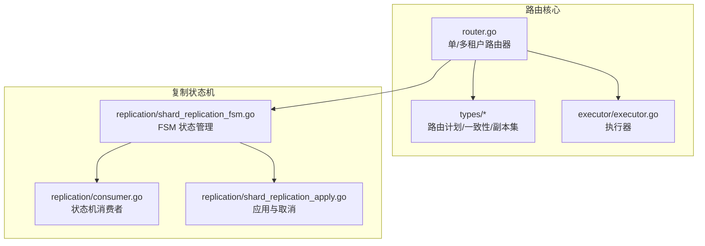
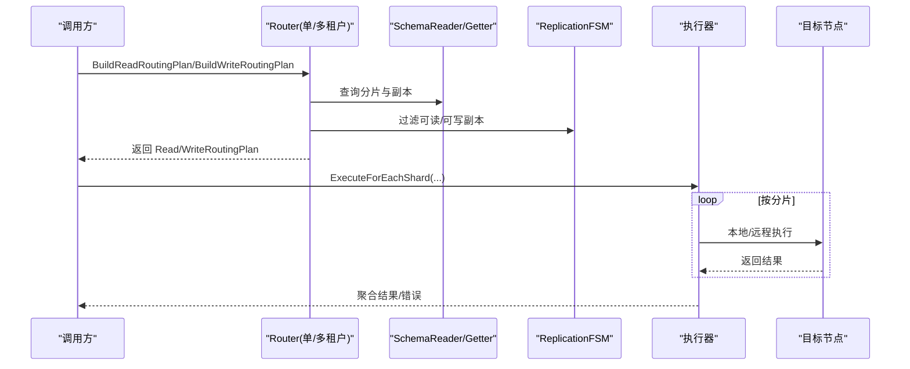
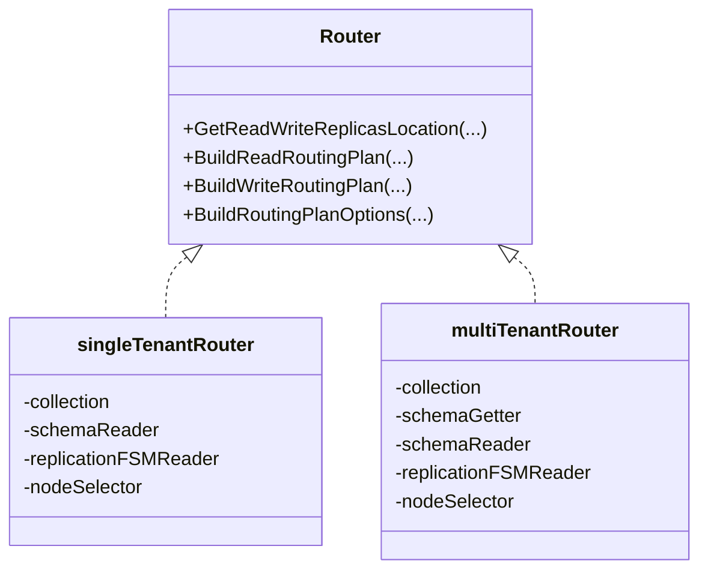
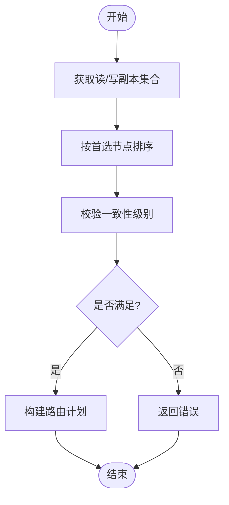
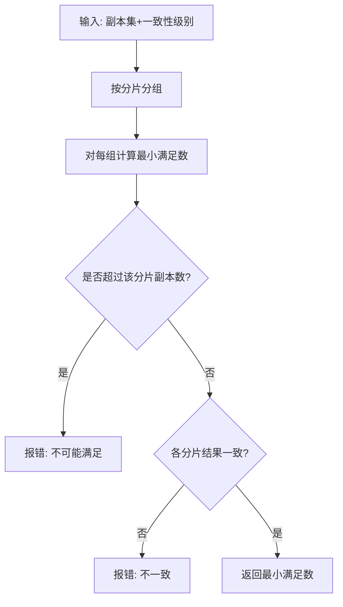
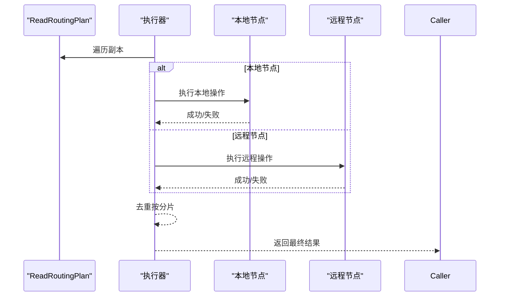
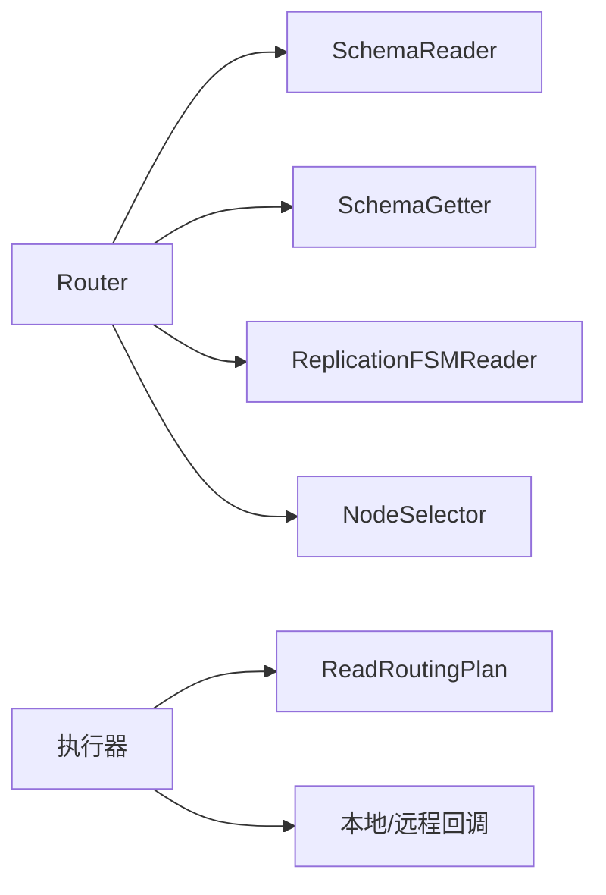

# 路由机制

<cite>
**本文引用的文件**
- [router.go](file://cluster/router/router.go)
- [router_plan.go](file://cluster/router/types/router_plan.go)
- [consistency_level.go](file://cluster/router/types/consistency_level.go)
- [router_intf.go](file://cluster/router/types/router_intf.go)
- [replicaset.go](file://cluster/router/types/replicaset.go)
- [executor.go](file://cluster/router/executor/executor.go)
- [router_test.go](file://cluster/router/router_test.go)
- [router_fsm_test.go](file://cluster/router/router_fsm_test.go)
- [shard_replication_fsm.go](file://cluster/replication/shard_replication_fsm.go)
- [consumer.go](file://cluster/replication/consumer.go)
- [replication_apply.go](file://cluster/replication/shard_replication_apply.go)
</cite>

## 目录
1. [引言](#引言)
2. [项目结构](#项目结构)
3. [核心组件](#核心组件)
4. [架构总览](#架构总览)
5. [详细组件分析](#详细组件分析)
6. [依赖关系分析](#依赖关系分析)
7. [性能考量](#性能考量)
8. [故障排查指南](#故障排查指南)
9. [结论](#结论)
10. [附录](#附录)

## 引言
本文件系统性阐述 Weaviate 集群中的路由机制，覆盖以下关键主题：
- 单租户与多租户路由的差异与选择
- 路由计划构建流程（读/写）与一致性级别控制
- 路由执行器的并行执行、结果聚合与错误处理
- 性能监控指标与调优建议
- 故障处理、重试与降级策略
- 大规模集群下的扩展性与稳定性保障

## 项目结构
Weaviate 的路由位于 cluster/router 子模块，围绕 Router 接口抽象，提供单租户与多租户两种实现，并通过执行器完成跨节点的并行操作。

图表来源
- [router.go](file://cluster/router/router.go#L35-L98)
- [router_plan.go](file://cluster/router/types/router_plan.go#L20-L100)
- [executor.go](file://cluster/router/executor/executor.go#L32-L78)
- [shard_replication_fsm.go](file://cluster/replication/shard_replication_fsm.go#L163-L212)
- [consumer.go](file://cluster/replication/consumer.go#L391-L408)
- [replication_apply.go](file://cluster/replication/shard_replication_apply.go#L185-L211)

章节来源
- [router.go](file://cluster/router/router.go#L35-L98)
- [router_plan.go](file://cluster/router/types/router_plan.go#L20-L100)
- [executor.go](file://cluster/router/executor/executor.go#L32-L78)

## 核心组件
- 路由构建器：根据集合是否启用分区（多租户），返回相应的 Router 实现。
- 单租户路由器：按物理分片定位读/写副本，不涉及租户隔离。
- 多租户路由器：以租户名作为分片键，校验租户状态（HOT/COLD/FROZEN 等）。
- 路由计划类型：读/写路由计划、副本集、一致性级别枚举与验证。
- 执行器：对每个分片或副本进行本地/远程执行，支持去重与顺序控制。

章节来源
- [router.go](file://cluster/router/router.go#L35-L98)
- [router_plan.go](file://cluster/router/types/router_plan.go#L20-L100)
- [consistency_level.go](file://cluster/router/types/consistency_level.go#L14-L33)
- [replicaset.go](file://cluster/router/types/replicaset.go#L19-L211)
- [executor.go](file://cluster/router/executor/executor.go#L20-L78)

## 架构总览
路由机制的关键路径：
- 构建阶段：Router 基于分片元数据与复制状态机过滤可用副本，结合一致性级别计算最小满足数。
- 执行阶段：执行器按分片去重，优先本地节点，再并行远程节点执行，收集结果并处理错误。

图表来源
- [router.go](file://cluster/router/router.go#L330-L407)
- [router.go](file://cluster/router/router.go#L580-L617)
- [executor.go](file://cluster/router/executor/executor.go#L32-L78)
- [replicaset.go](file://cluster/router/types/replicaset.go#L168-L211)

## 详细组件分析

### 单租户路由 vs 多租户路由
- 单租户路由
  - 不区分租户；读/写副本来自所有物理分片。
  - 支持直接指定分片名或全量分片。
- 多租户路由
  - 租户名即分片名；必须提供有效且处于 HOT 状态的租户。
  - 写入时严格要求目标分片与租户一致。

图表来源
- [router.go](file://cluster/router/router.go#L100-L126)

章节来源
- [router.go](file://cluster/router/router.go#L100-L126)
- [router.go](file://cluster/router/router.go#L419-L425)
- [router.go](file://cluster/router/router.go#L619-L626)

### 路由计划构建流程
- 读路由计划
  - 获取读副本集合，排序（首选直连候选或本地节点），校验一致性级别。
- 写路由计划
  - 获取主写副本与附加写副本，排序后生成计划，校验一致性级别。

图表来源
- [router.go](file://cluster/router/router.go#L329-L367)
- [router.go](file://cluster/router/router.go#L376-L407)
- [replicaset.go](file://cluster/router/types/replicaset.go#L168-L211)

章节来源
- [router.go](file://cluster/router/router.go#L329-L407)
- [replicaset.go](file://cluster/router/types/replicaset.go#L168-L211)

### 一致性级别控制
- 支持级别：ONE、QUORUM、ALL
- 计算规则：对每个分片独立计算所需最小副本数，若不同分片结果不一致则报错
- 与复制状态机协同：FSM 状态决定哪些副本可用于读/写

图表来源
- [consistency_level.go](file://cluster/router/types/consistency_level.go#L23-L33)
- [replicaset.go](file://cluster/router/types/replicaset.go#L168-L211)

章节来源
- [consistency_level.go](file://cluster/router/types/consistency_level.go#L14-L33)
- [replicaset.go](file://cluster/router/types/replicaset.go#L168-L211)

### 路由执行器
- 并行执行：按分片去重，本地节点优先，其余并行远程执行
- 结果聚合：逐分片执行，错误即时返回
- 错误处理：本地/远程执行失败均包装上下文错误

图表来源
- [executor.go](file://cluster/router/executor/executor.go#L32-L78)

章节来源
- [executor.go](file://cluster/router/executor/executor.go#L20-L78)

### 路由计划数据模型
- 读/写路由计划包含：分片、租户、副本集、一致性级别与内部数值
- 副本集：读副本集（每分片一个）、写副本集（主写+附加写）

章节来源
- [router_plan.go](file://cluster/router/types/router_plan.go#L47-L100)
- [replicaset.go](file://cluster/router/types/replicaset.go#L19-L162)

## 依赖关系分析
- Router 依赖：
  - SchemaReader：查询分片与副本
  - SchemaGetter：多租户状态查询
  - ReplicationFSMReader：基于复制状态机过滤可用副本
  - NodeSelector：解析节点主机名
- 执行器依赖：
  - ReadRoutingPlan 中的副本集与本地主机名
  - 回调函数用于本地/远程执行

图表来源
- [router.go](file://cluster/router/router.go#L100-L126)
- [executor.go](file://cluster/router/executor/executor.go#L32-L78)

章节来源
- [router.go](file://cluster/router/router.go#L100-L126)
- [executor.go](file://cluster/router/executor/executor.go#L32-L78)

## 性能考量
- 分片去重与排序
  - 执行器按分片去重，避免重复访问同一分片
  - 优先本地节点减少网络往返
- 一致性级别影响
  - QUORUM/ALL 提升一致性但增加等待与失败概率
  - ONE 最低延迟，适合读放大场景
- 复制状态机状态
  - READY 时读写副本最多；DEHYDRATING 时仅部分可用，需谨慎选择
- 监控与调优
  - 关注路由计划构建耗时、执行器并行度、节点间延迟
  - 通过一致性级别与直连候选优化端到端延迟

[本节为通用指导，无需特定文件来源]

## 故障排查指南
- 常见错误
  - 无可用副本：构建路由计划时报“未找到副本”
  - 租户无效/非活动：多租户路由在 HOT 之外状态拒绝
  - 一致性不可满足：某分片副本不足导致无法满足级别
- 定位步骤
  - 检查分片与副本映射（SchemaReader）
  - 检查租户状态（SchemaGetter）
  - 检查复制状态机状态（FSM）
  - 查看执行器错误日志（本地/远程执行失败）
- 重试与降级
  - 对可重试错误进行指数退避重试
  - 在一致性允许范围内降级到更低级别（如从 QUORUM 降到 ONE）
  - 降级时记录并上报监控指标

章节来源
- [router.go](file://cluster/router/router.go#L344-L346)
- [router.go](file://cluster/router/router.go#L527-L537)
- [replicaset.go](file://cluster/router/types/replicaset.go#L184-L200)
- [executor.go](file://cluster/router/executor/executor.go#L44-L52)

## 结论
Weaviate 的路由机制通过 Router 抽象统一了单/多租户场景，结合复制状态机与一致性级别，实现了高可用与强一致性的平衡。执行器负责高效的并行调度与错误传播。在大规模集群中，应结合监控指标与一致性策略进行精细化调优，确保稳定与性能兼顾。

[本节为总结，无需特定文件来源]

## 附录

### 测试用例要点
- 单租户/多租户副本定位与错误处理
- 一致性级别验证与异常分支
- 复制状态机状态对路由的影响

章节来源
- [router_test.go](file://cluster/router/router_test.go#L53-L217)
- [router_test.go](file://cluster/router/router_test.go#L335-L444)
- [router_fsm_test.go](file://cluster/router/router_fsm_test.go#L35-L210)
- [router_fsm_test.go](file://cluster/router/router_fsm_test.go#L212-L374)