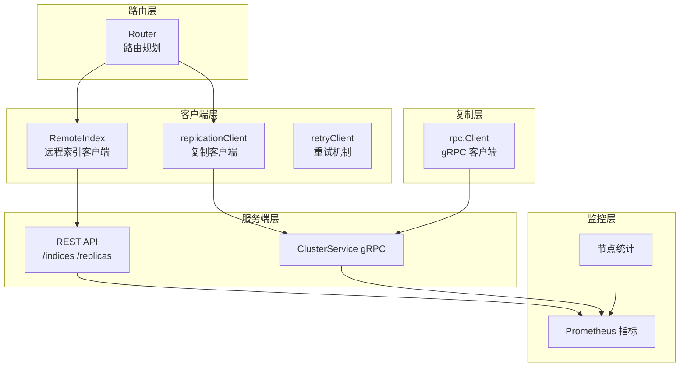
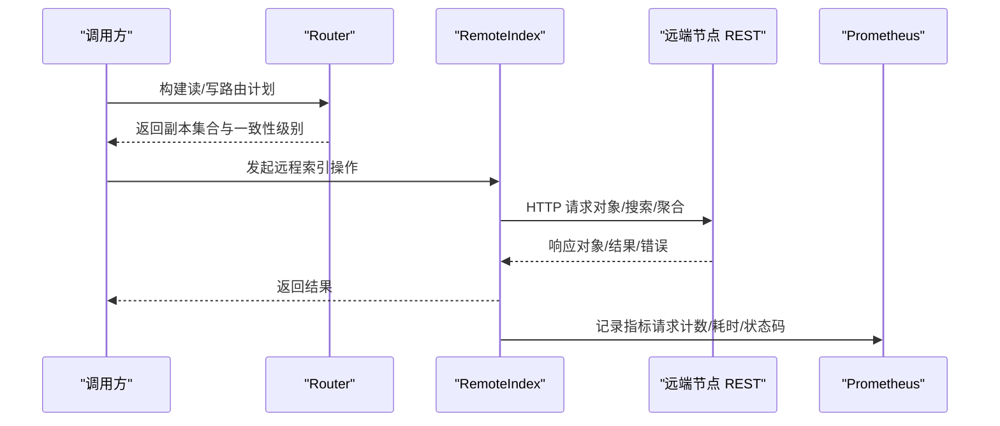
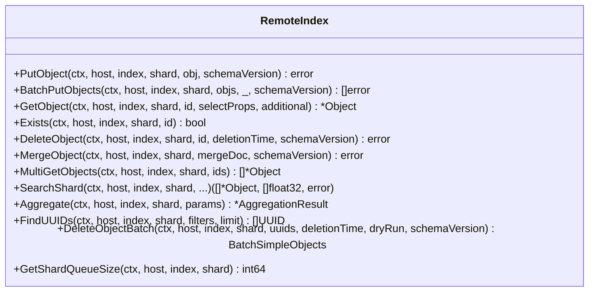
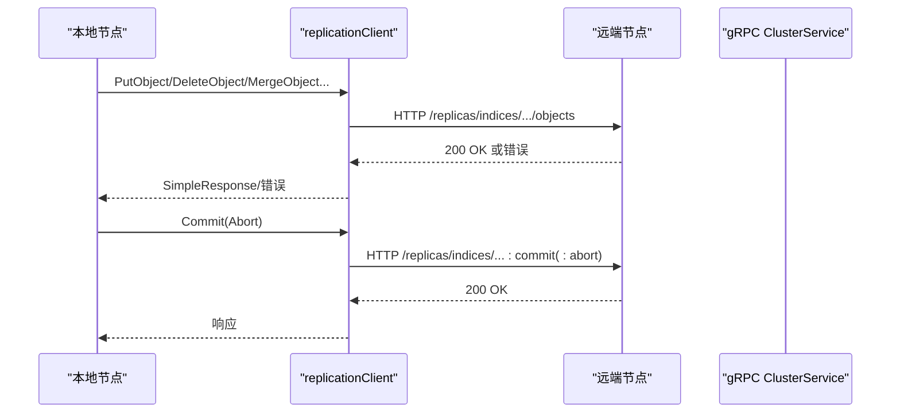
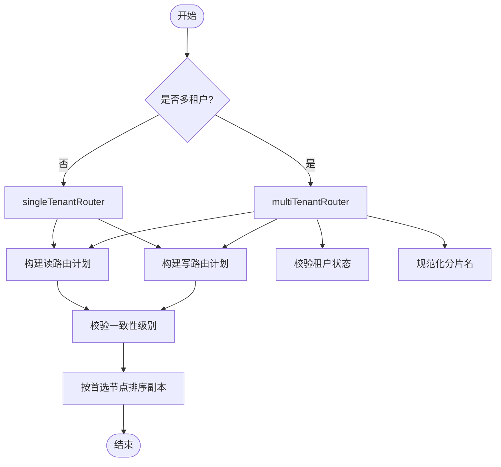
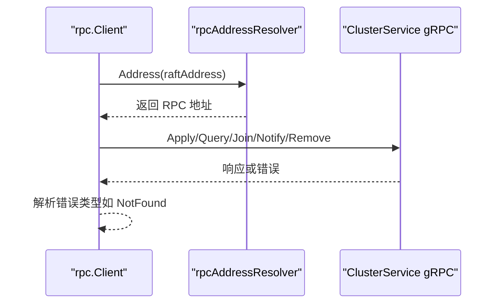
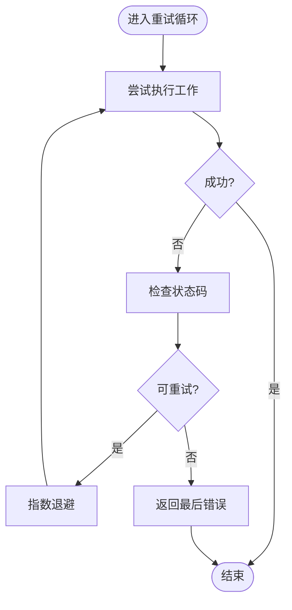
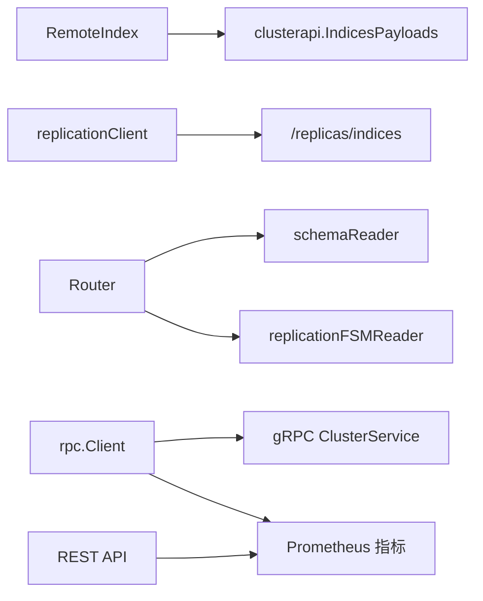
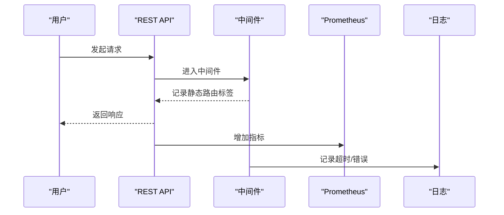

# 远程索引访问

<cite>
**本文档引用的文件**
- [adapters/clients/remote_index.go](file://adapters/clients/remote_index.go)
- [adapters/clients/remote_index_test.go](file://adapters/clients/remote_index_test.go)
- [adapters/clients/replication.go](file://adapters/clients/replication.go)
- [adapters/clients/replication_test.go](file://adapters/clients/replication_test.go)
- [adapters/clients/client.go](file://adapters/clients/client.go)
- [cluster/router/router.go](file://cluster/router/router.go)
- [cluster/rpc/client.go](file://cluster/rpc/client.go)
- [cluster/rpc/client_retry_test.go](file://cluster/rpc/client_retry_test.go)
- [cluster/distributedtask/scheduler.go](file://cluster/distributedtask/scheduler.go)
- [cluster/distributedtask/scheduler_test.go](file://cluster/distributedtask/scheduler_test.go)
- [adapters/handlers/rest/clusterapi/serve.go](file://adapters/handlers/rest/clusterapi/serve.go)
- [adapters/handlers/rest/handlers_nodes.go](file://adapters/handlers/rest/handlers_nodes.go)
- [adapters/repos/db/metrics.go](file://adapters/repos/db/metrics.go)
- [adapters/repos/db/node_wide_metrics.go](file://adapters/repos/db/node_wide_metrics.go)
- [adapters/repos/db/queue/worker.go](file://adapters/repos/db/queue/worker.go)
- [cluster/utils/retry.go](file://cluster/utils/retry.go)
</cite>

## 目录
1. [简介](#简介)
2. [项目结构](#项目结构)
3. [核心组件](#核心组件)
4. [架构总览](#架构总览)
5. [详细组件分析](#详细组件分析)
6. [依赖分析](#依赖分析)
7. [性能考虑](#性能考虑)
8. [故障排查指南](#故障排查指南)
9. [结论](#结论)
10. [附录](#附录)

## 简介
本文件面向 Weaviate 的远程索引访问系统，系统性阐述跨节点索引访问的实现原理与工程实践，覆盖以下主题：
- 远程查询代理：如何通过统一的远程索引客户端发起跨节点读写请求
- 数据传输协议：HTTP/REST 协议与内容类型协商、参数编码与压缩
- 结果合并机制：多副本一致性与结果聚合策略
- 远程索引建立与维护：分片创建、状态管理、版本控制与一致性保障
- 性能优化策略：网络压缩、批量传输、超时与重试、队列背压
- 查询执行计划与调度：路由规划、并行执行、负载分配
- 监控指标与故障诊断：关键指标、日志与告警、超时与重试策略
- 可靠性与容错：网络分区、超时重试、错误恢复与一致性权衡

## 项目结构
Weaviate 的远程索引访问由“客户端-服务端-路由-复制-监控”五层协同完成：
- 客户端层：远程索引客户端与复制客户端封装 HTTP/REST 与 gRPC 交互
- 路由层：根据集合、分片与多租户配置构建读写路由计划
- 复制层：基于 Raft 的复制一致性与事务协调
- 服务端层：REST API 与内部 gRPC 服务处理请求
- 监控层：Prometheus 指标与节点统计

**图表来源**
- [adapters/clients/remote_index.go](file://adapters/clients/remote_index.go#L53-L67)
- [adapters/clients/replication.go](file://adapters/clients/replication.go#L53-L60)
- [cluster/router/router.go](file://cluster/router/router.go#L35-L98)
- [cluster/rpc/client.go](file://cluster/rpc/client.go#L100-L123)
- [adapters/handlers/rest/clusterapi/serve.go](file://adapters/handlers/rest/clusterapi/serve.go#L214-L229)
- [adapters/repos/db/metrics.go](file://adapters/repos/db/metrics.go#L46-L66)

**章节来源**
- [adapters/clients/remote_index.go](file://adapters/clients/remote_index.go#L53-L67)
- [adapters/clients/replication.go](file://adapters/clients/replication.go#L53-L60)
- [cluster/router/router.go](file://cluster/router/router.go#L35-L98)
- [cluster/rpc/client.go](file://cluster/rpc/client.go#L100-L123)
- [adapters/handlers/rest/clusterapi/serve.go](file://adapters/handlers/rest/clusterapi/serve.go#L214-L229)
- [adapters/repos/db/metrics.go](file://adapters/repos/db/metrics.go#L46-L66)

## 核心组件
- 远程索引客户端（RemoteIndex）：负责对远端节点的索引进行对象增删改查、批量操作、聚合与搜索等
- 复制客户端（replicationClient）：负责跨节点复制、一致性提交、回滚与修复
- 路由器（Router）：根据集合、分片与多租户配置，确定读写副本集合与一致性级别
- gRPC 客户端（rpc.Client）：与 Raft 集群节点通信，执行 Apply/Query 等关键操作
- 重试机制（retryClient/retryer）：指数退避与最大重试次数控制，提升网络抖动下的稳定性
- 监控与指标：Prometheus 指标与节点统计，辅助可观测性与容量规划

**章节来源**
- [adapters/clients/remote_index.go](file://adapters/clients/remote_index.go#L53-L67)
- [adapters/clients/replication.go](file://adapters/clients/replication.go#L53-L60)
- [cluster/router/router.go](file://cluster/router/router.go#L100-L120)
- [cluster/rpc/client.go](file://cluster/rpc/client.go#L100-L123)
- [adapters/clients/client.go](file://adapters/clients/client.go#L93-L128)
- [adapters/repos/db/metrics.go](file://adapters/repos/db/metrics.go#L46-L66)

## 架构总览
远程索引访问的关键流程：
- 客户端侧：路由器根据一致性级别与多租户配置生成读写路由计划；随后由 RemoteIndex 或 replicationClient 发起跨节点请求
- 传输协议：HTTP/REST 用于索引操作，gRPC 用于 Raft 管理与强一致读写
- 结果合并：读取多副本后按一致性级别进行合并或裁决
- 监控与观测：REST/gRPC 调用路径均接入静态路由标签与指标采集

**图表来源**
- [cluster/router/router.go](file://cluster/router/router.go#L330-L367)
- [adapters/clients/remote_index.go](file://adapters/clients/remote_index.go#L502-L555)
- [adapters/handlers/rest/clusterapi/serve.go](file://adapters/handlers/rest/clusterapi/serve.go#L214-L229)
- [adapters/repos/db/metrics.go](file://adapters/repos/db/metrics.go#L46-L66)

## 详细组件分析

### 远程索引客户端（RemoteIndex）
职责与能力：
- 对象级操作：PutObject、GetObject、Exists、DeleteObject、MergeObject
- 批量操作：BatchPutObjects、BatchAddReferences、DeleteObjectBatch
- 搜索与聚合：SearchShard、Aggregate、FindUUIDs
- 其他：GetShardQueueSize、分片状态与文件操作等

数据传输与协议：
- HTTP 方法映射：POST/GET/DELETE/PATCH
- 内容类型协商：通过 clusterapi.IndicesPayloads.*.SetContentTypeHeaderReq/CheckContentTypeHeader
- 参数编码：Base64 编码选择属性与附加属性；查询参数传递 schemaVersion
- 响应解析：统一使用 clusterapi.IndicesPayloads.*.Unmarshal

错误处理与重试：
- 成功状态码校验：successCode 或自定义 ok 条件
- 重试策略：doWithCustomMarshaller/do 组合，结合 shouldRetry 判定可重试状态码

**图表来源**
- [adapters/clients/remote_index.go](file://adapters/clients/remote_index.go#L69-L164)
- [adapters/clients/remote_index.go](file://adapters/clients/remote_index.go#L229-L310)
- [adapters/clients/remote_index.go](file://adapters/clients/remote_index.go#L339-L432)
- [adapters/clients/remote_index.go](file://adapters/clients/remote_index.go#L434-L500)
- [adapters/clients/remote_index.go](file://adapters/clients/remote_index.go#L502-L616)
- [adapters/clients/remote_index.go](file://adapters/clients/remote_index.go#L618-L751)
- [adapters/clients/remote_index.go](file://adapters/clients/remote_index.go#L753-L800)

**章节来源**
- [adapters/clients/remote_index.go](file://adapters/clients/remote_index.go#L69-L164)
- [adapters/clients/remote_index.go](file://adapters/clients/remote_index.go#L229-L310)
- [adapters/clients/remote_index.go](file://adapters/clients/remote_index.go#L339-L432)
- [adapters/clients/remote_index.go](file://adapters/clients/remote_index.go#L434-L500)
- [adapters/clients/remote_index.go](file://adapters/clients/remote_index.go#L502-L616)
- [adapters/clients/remote_index.go](file://adapters/clients/remote_index.go#L618-L751)
- [adapters/clients/remote_index.go](file://adapters/clients/remote_index.go#L753-L800)

### 复制客户端（replicationClient）
职责与能力：
- 对象级复制：PutObject、DeleteObject、MergeObject、PutObjects、DeleteObjects
- 批量引用：AddReferences
- 一致性控制：Commit、Abort
- 修复与校验：FetchObject/FetchObjects、DigestObjects/DigestObjectsInRange、HashTreeLevel、OverwriteObjects
- 查询：FindUUIDs

协议与压缩：
- HTTP 路径前缀：/replicas/indices/{index}/shards/{shard}/objects
- 请求头：SchemaVersionKey、RequestKey
- 哈希树请求使用 zstd 压缩（X-Request-Compression: zstd）

**图表来源**
- [adapters/clients/replication.go](file://adapters/clients/replication.go#L200-L305)
- [adapters/clients/replication.go](file://adapters/clients/replication.go#L355-L375)
- [adapters/clients/replication.go](file://adapters/clients/replication.go#L118-L157)

**章节来源**
- [adapters/clients/replication.go](file://adapters/clients/replication.go#L200-L305)
- [adapters/clients/replication.go](file://adapters/clients/replication.go#L355-L375)
- [adapters/clients/replication.go](file://adapters/clients/replication.go#L118-L157)

### 路由器（Router）
职责与能力：
- 单租户与多租户两种路由实现
- 读写副本集合选择：根据一致性级别与首选节点排序
- 租户状态校验与分片规范化（多租户）

**图表来源**
- [cluster/router/router.go](file://cluster/router/router.go#L78-L98)
- [cluster/router/router.go](file://cluster/router/router.go#L329-L407)
- [cluster/router/router.go](file://cluster/router/router.go#L539-L578)

**章节来源**
- [cluster/router/router.go](file://cluster/router/router.go#L78-L98)
- [cluster/router/router.go](file://cluster/router/router.go#L329-L407)
- [cluster/router/router.go](file://cluster/router/router.go#L539-L578)

### gRPC 客户端（rpc.Client）
职责与能力：
- 与 Raft 集群节点通信：Join/Notify/Remove/Apply/Query
- 服务配置：针对不同 RPC 类型设置不同的重试策略与超时
- 连接管理：缓存 leader 连接，避免频繁重建

**图表来源**
- [cluster/rpc/client.go](file://cluster/rpc/client.go#L130-L215)
- [cluster/rpc/client.go](file://cluster/rpc/client.go#L233-L280)

**章节来源**
- [cluster/rpc/client.go](file://cluster/rpc/client.go#L130-L215)
- [cluster/rpc/client.go](file://cluster/rpc/client.go#L233-L280)

### 重试机制（retryClient/retryer）
- 指数退避：最小/最大退避时间可配置，最大重试次数上限
- 可重试状态码：5xx、TooManyRequests、ServiceUnavailable
- 自定义解码：支持 doWithCustomMarshaller 以处理特殊响应格式

**图表来源**
- [adapters/clients/client.go](file://adapters/clients/client.go#L65-L91)
- [adapters/clients/client.go](file://adapters/clients/client.go#L111-L124)

**章节来源**
- [adapters/clients/client.go](file://adapters/clients/client.go#L65-L91)
- [adapters/clients/client.go](file://adapters/clients/client.go#L111-L124)

## 依赖分析
- RemoteIndex 依赖 clusterapi.IndicesPayloads 进行序列化/反序列化与内容类型检查
- replicationClient 依赖 /replicas/indices 路径与 SchemaVersionKey/RequestKey 查询参数
- Router 依赖 schemaReader 与 replicationFSMReader 提供分片与副本状态
- rpc.Client 依赖 gRPC 服务配置与连接缓存
- 监控层通过静态路由标签与指标向量记录请求路径与状态

**图表来源**
- [adapters/clients/remote_index.go](file://adapters/clients/remote_index.go#L84-L100)
- [adapters/clients/replication.go](file://adapters/clients/replication.go#L377-L396)
- [cluster/router/router.go](file://cluster/router/router.go#L35-L98)
- [cluster/rpc/client.go](file://cluster/rpc/client.go#L100-L123)
- [adapters/handlers/rest/clusterapi/serve.go](file://adapters/handlers/rest/clusterapi/serve.go#L214-L229)

**章节来源**
- [adapters/clients/remote_index.go](file://adapters/clients/remote_index.go#L84-L100)
- [adapters/clients/replication.go](file://adapters/clients/replication.go#L377-L396)
- [cluster/router/router.go](file://cluster/router/router.go#L35-L98)
- [cluster/rpc/client.go](file://cluster/rpc/client.go#L100-L123)
- [adapters/handlers/rest/clusterapi/serve.go](file://adapters/handlers/rest/clusterapi/serve.go#L214-L229)

## 性能考虑
- 网络压缩
  - 复制客户端在哈希树请求中使用 zstd 压缩请求体，并设置 X-Request-Compression 头
  - 建议在大对象/大批量场景启用压缩以降低带宽占用
- 批量传输
  - RemoteIndex 支持批量对象写入与批量引用添加，减少 RTT
  - replicationClient 的批量写入接口可显著降低请求开销
- 超时与重试
  - 不同操作设置不同超时单位与最大重试次数，避免长时间阻塞
  - 指数退避与最大退避时间限制，防止雪崩效应
- 队列背压
  - 队列 Worker 使用指数回退与最大回退时间，避免瞬时高负载导致过载
- 负载均衡与路由
  - 路由器优先选择本地节点或直接候选节点，减少跨机房延迟
  - 一致性级别与额外副本可提升可用性但可能增加延迟

**章节来源**
- [adapters/clients/replication.go](file://adapters/clients/replication.go#L128-L140)
- [adapters/clients/replication.go](file://adapters/clients/replication.go#L159-L177)
- [adapters/clients/remote_index.go](file://adapters/clients/remote_index.go#L119-L164)
- [adapters/clients/client.go](file://adapters/clients/client.go#L93-L128)
- [adapters/repos/db/queue/worker.go](file://adapters/repos/db/queue/worker.go#L134-L143)

## 故障排查指南
- 超时与重试
  - HTTP 层：RemoteIndex/SearchShard/DeleteObjectBatch 等使用带超时的 do/doWithCustomMarshaller
  - gRPC 层：rpc.Client 针对 Apply/Query/Join/Notify/Remove 设置不同重试策略
  - 重试条件：shouldRetry/shouldRetry(code) 判定 5xx、TooManyRequests、ServiceUnavailable
- 日志与中间件
  - REST 中间件对 I/O 超时进行专门处理与提示，建议结合命令行超时参数调整
- 指标与观测
  - Prometheus 指标：请求总数、耗时、状态码分布、异步复制迭代/传播耗时等
  - 节点统计：/cluster/statistics 返回健康状态与 Raft 同步状态
- 常见问题定位
  - 内容类型不匹配：检查 SetContentTypeHeaderReq/CheckContentTypeHeader 的使用
  - Schema 版本不一致：确认 URL 查询参数 schemaVersion 传递正确
  - 路由失败：检查 Router 的一致性级别与副本可用性

**图表来源**
- [adapters/handlers/rest/clusterapi/serve.go](file://adapters/handlers/rest/clusterapi/serve.go#L214-L229)
- [adapters/handlers/rest/handlers_nodes.go](file://adapters/handlers/rest/handlers_nodes.go#L78-L106)
- [adapters/repos/db/metrics.go](file://adapters/repos/db/metrics.go#L46-L66)

**章节来源**
- [cluster/rpc/client.go](file://cluster/rpc/client.go#L30-L93)
- [adapters/clients/client.go](file://adapters/clients/client.go#L65-L91)
- [adapters/handlers/rest/panics_middleware.go](file://adapters/handlers/rest/panics_middleware.go#L97-L104)
- [adapters/handlers/rest/clusterapi/serve.go](file://adapters/handlers/rest/clusterapi/serve.go#L214-L229)
- [adapters/handlers/rest/handlers_nodes.go](file://adapters/handlers/rest/handlers_nodes.go#L78-L106)
- [adapters/repos/db/metrics.go](file://adapters/repos/db/metrics.go#L46-L66)

## 结论
Weaviate 的远程索引访问体系通过“路由-客户端-复制-服务端-监控”的分层设计，在保证一致性与可用性的同时，提供了高效的跨节点数据访问能力。HTTP/REST 与 gRPC 的混合使用满足了不同场景的需求，而完善的重试、压缩与指标体系则确保了系统的可靠性与可观测性。实践中应结合业务特征合理设置一致性级别、批量大小与超时参数，以获得最佳性能与稳定性。

## 附录
- 测试参考
  - RemoteIndex/replication 客户端测试覆盖连接错误、状态码错误、解码错误与重试行为
  - gRPC 客户端测试验证不同 RPC 的重试策略与最大尝试次数
- 分布式任务调度
  - Scheduler 周期性扫描任务并启动可执行任务，结合指标统计任务运行状态

**章节来源**
- [adapters/clients/remote_index_test.go](file://adapters/clients/remote_index_test.go#L41-L185)
- [adapters/clients/replication_test.go](file://adapters/clients/replication_test.go#L119-L196)
- [cluster/rpc/client_retry_test.go](file://cluster/rpc/client_retry_test.go#L51-L169)
- [cluster/distributedtask/scheduler.go](file://cluster/distributedtask/scheduler.go#L181-L208)
- [cluster/distributedtask/scheduler_test.go](file://cluster/distributedtask/scheduler_test.go#L33-L53)