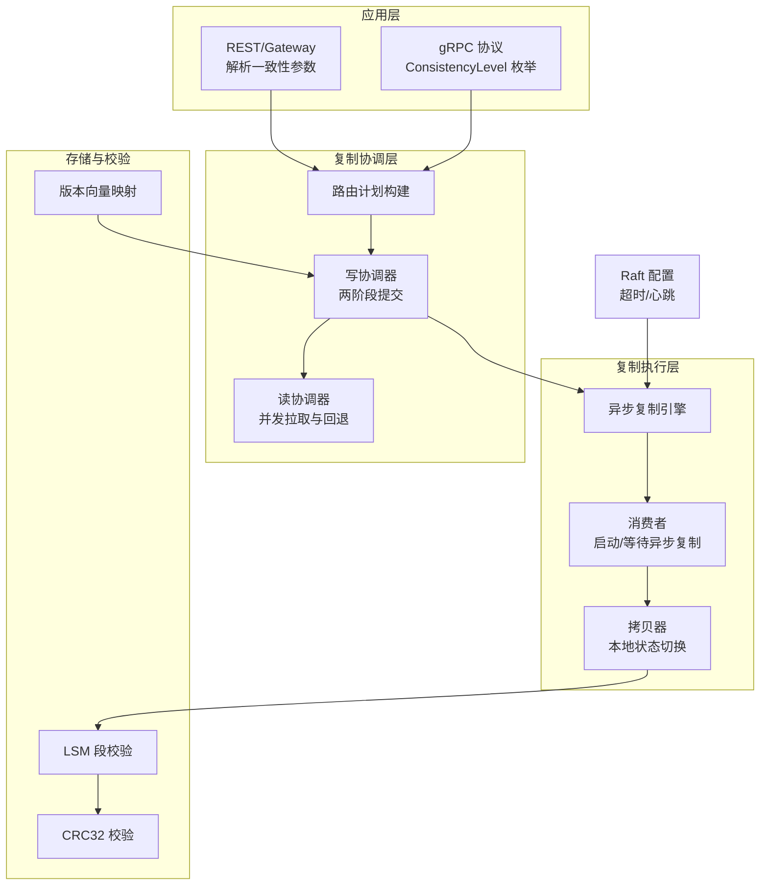
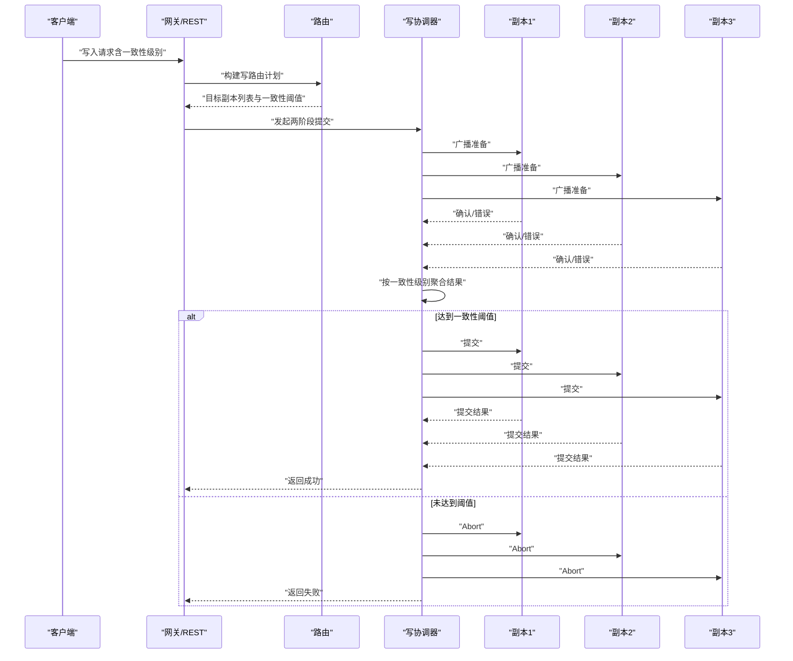
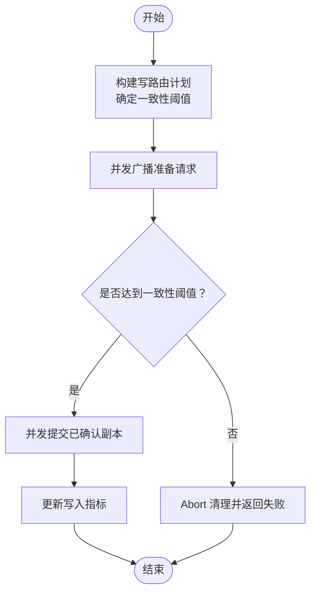
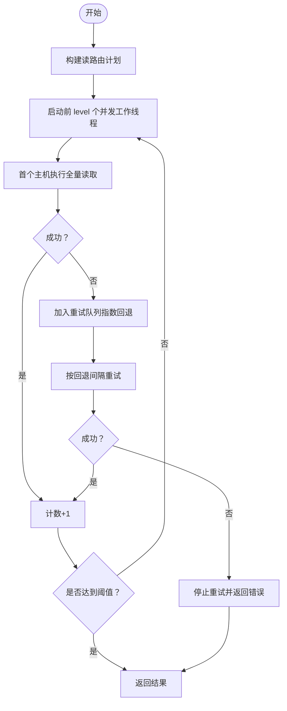
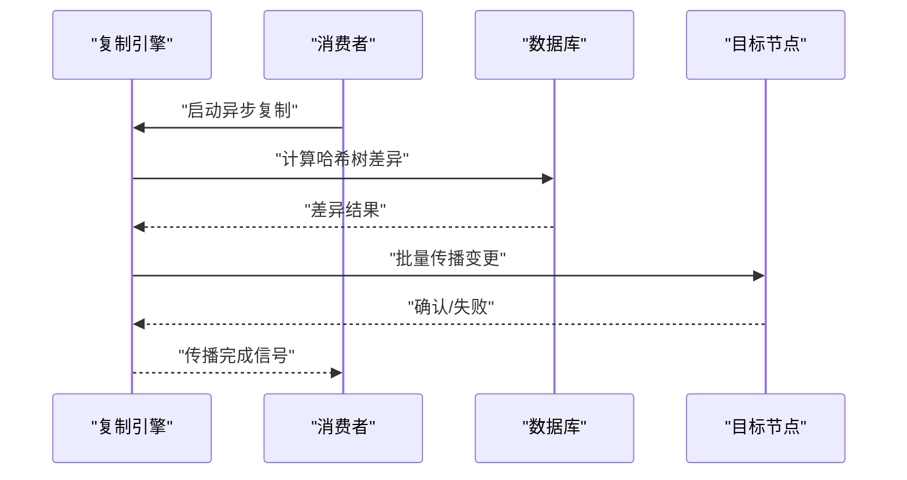
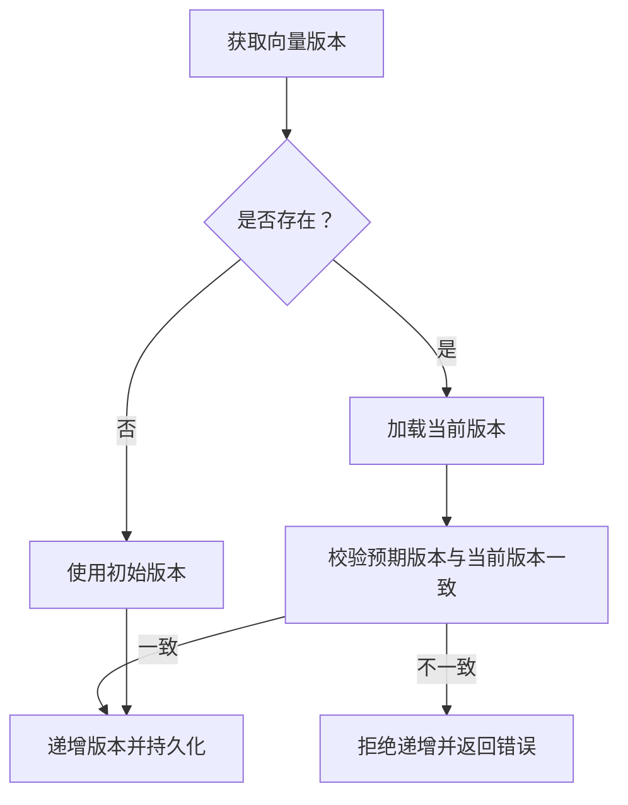
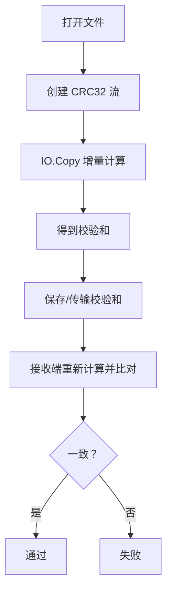
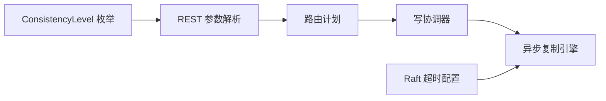

# 一致性保证

<cite>
**本文引用的文件**
- [coordinator.go](file://usecases/replica/coordinator.go)
- [metrics.go](file://usecases/replica/metrics.go)
- [version_map.go](file://adapters/repos/db/vector/hfresh/version_map.go)
- [file_crc32.go](file://usecases/integrity/file_crc32.go)
- [checksum_reader.go](file://usecases/integrity/checksum_reader.go)
- [checksum_writer.go](file://usecases/integrity/checksum_writer.go)
- [resumable_crc32.go](file://usecases/integrity/resumable_crc32.go)
- [index.go](file://adapters/repos/db/index.go)
- [index_async_replication.go](file://adapters/repos/db/index_async_replication.go)
- [consumer.go](file://cluster/replication/consumer.go)
- [copier.go](file://cluster/replication/copier/copier.go)
- [store.go](file://cluster/store.go)
- [base.pb.go](file://grpc/generated/protocol/v1/base.pb.go)
- [objects_class_get_parameters.go](file://client/objects/objects_class_get_parameters.go)
- [handers_objects.go](file://adapters/handlers/rest/handlers_objects.go)
- [crud_test.go](file://test/acceptance/replication/read_repair/crud_test.go)
- [network_isolation_test.go](file://test/acceptance/recovery/network_isolation_test.go)
</cite>

## 目录
1. [引言](#引言)
2. [项目结构](#项目结构)
3. [核心组件](#核心组件)
4. [架构总览](#架构总览)
5. [详细组件分析](#详细组件分析)
6. [依赖关系分析](#依赖关系分析)
7. [性能考量](#性能考量)
8. [故障排查指南](#故障排查指南)
9. [结论](#结论)
10. [附录](#附录)

## 引言
本文件围绕 Weaviate 的复制一致性保证机制进行系统化技术说明，重点涵盖：
- 最终一致性与一致性级别（因果、会话、单调读）在复制层的落地方式
- 复制延迟的度量与监控指标
- 冲突检测与解决策略（版本向量、向量时钟、冲突消除）
- 数据完整性校验（CRC32 校验、分段校验）
- 一致性级别的配置选项与性能权衡
- 一致性故障的诊断与恢复策略

## 项目结构
Weaviate 的一致性保障横跨多个层次：应用层（REST/gRPC）、路由与复制协调器、异步复制引擎、底层存储与校验工具。关键路径如下：
- 应用入口与一致性参数解析：REST 层对一致性参数进行解析与校验
- 复制协调器：两阶段提交广播与提交，按一致性级别聚合结果
- 异步复制：基于哈希树的差异计算与传播
- 存储与校验：LSM 段落校验、对象级 CRC32 校验
- Raft 配置：超时与心跳参数影响一致性达成的稳定性

**图示来源**
- [handers_objects.go](file://adapters/handlers/rest/handlers_objects.go#L910-L922)
- [base.pb.go](file://grpc/generated/protocol/v1/base.pb.go#L22-L51)
- [coordinator.go](file://usecases/replica/coordinator.go#L246-L305)
- [consumer.go](file://cluster/replication/consumer.go#L619-L644)
- [copier.go](file://cluster/replication/copier/copier.go#L498-L532)
- [index_async_replication.go](file://adapters/repos/db/index_async_replication.go#L171-L224)
- [store.go](file://cluster/store.go#L735-L771)

**章节来源**
- [handers_objects.go](file://adapters/handlers/rest/handlers_objects.go#L910-L922)
- [base.pb.go](file://grpc/generated/protocol/v1/base.pb.go#L22-L51)
- [coordinator.go](file://usecases/replica/coordinator.go#L246-L305)
- [consumer.go](file://cluster/replication/consumer.go#L619-L644)
- [copier.go](file://cluster/replication/copier/copier.go#L498-L532)
- [index_async_replication.go](file://adapters/repos/db/index_async_replication.go#L171-L224)
- [store.go](file://cluster/store.go#L735-L771)

## 核心组件
- 写协调器（Two-Phase Commit）：负责广播准备、按一致性级别收集确认并触发提交；支持“尽力而为”向额外副本发送提交以提升可用性但不计入一致性门槛。
- 读协调器（并发拉取与回退）：根据一致性级别并发查询候选副本，必要时使用指数回退重试，确保达到成功数目标。
- 异步复制引擎：基于哈希树的差异计算与批量传播，支持频率、并发、批大小等可调参数。
- 版本向量映射：用于向量记录的版本跟踪与删除标记，避免并发更新导致的不一致。
- 数据完整性校验：LSM 段落校验与对象级 CRC32 校验，保障持久化数据的正确性。

**章节来源**
- [coordinator.go](file://usecases/replica/coordinator.go#L104-L165)
- [coordinator.go](file://usecases/replica/coordinator.go#L167-L212)
- [coordinator.go](file://usecases/replica/coordinator.go#L307-L430)
- [version_map.go](file://adapters/repos/db/vector/hfresh/version_map.go#L60-L126)
- [index_async_replication.go](file://adapters/repos/db/index_async_replication.go#L171-L224)

## 架构总览
Weaviate 的一致性由“同步复制（两阶段提交）+ 异步复制（哈希树差异）”共同实现。同步复制保证强一致写入（取决于一致性级别），异步复制用于尽快收敛副本状态，降低读写延迟。

**图示来源**
- [coordinator.go](file://usecases/replica/coordinator.go#L246-L305)
- [coordinator.go](file://usecases/replica/coordinator.go#L104-L165)
- [coordinator.go](file://usecases/replica/coordinator.go#L167-L212)

## 详细组件分析

### 写协调器与一致性级别
- 广播阶段：向目标副本并发发送“准备”请求，按一致性级别阈值收集确认；若无法达到阈值则 Abort 并清理。
- 提交阶段：对已确认的副本发送“提交”，统计成功数量并上报指标。
- 指标：成功全部、成功部分、失败计数与耗时直方图。
- 默认一致性：当未显式指定时，默认采用 QUORUM。

**图示来源**
- [coordinator.go](file://usecases/replica/coordinator.go#L246-L305)
- [coordinator.go](file://usecases/replica/coordinator.go#L104-L165)
- [coordinator.go](file://usecases/replica/coordinator.go#L167-L212)
- [metrics.go](file://usecases/replica/metrics.go#L68-L82)
- [index.go](file://adapters/repos/db/index.go#L3742-L3753)

**章节来源**
- [coordinator.go](file://usecases/replica/coordinator.go#L246-L305)
- [metrics.go](file://usecases/replica/metrics.go#L68-L82)
- [index.go](file://adapters/repos/db/index.go#L3742-L3753)

### 读协调器与回退策略
- 并发拉取：为前 level 个副本启动并发工作线程，优先尝试“全量读取”（通常针对首选副本）。
- 回退重试：对失败的主机使用指数回退策略加入重试队列，直至达到一致性阈值或耗尽重试。
- 指标：成功全部、成功部分、失败计数与耗时直方图。

**图示来源**
- [coordinator.go](file://usecases/replica/coordinator.go#L307-L430)

**章节来源**
- [coordinator.go](file://usecases/replica/coordinator.go#L307-L430)

### 异步复制与延迟监控
- 异步复制引擎：周期性计算哈希树差异，批量传播变更，支持频率、并发、批大小、预传播超时等参数。
- 启停与等待：消费者在最终化阶段会启动异步复制并等待其完成，确保副本收敛。
- 指标：哈希树初始化、迭代次数、差异计算时延、传播时延、对象计数等。

**图示来源**
- [consumer.go](file://cluster/replication/consumer.go#L619-L644)
- [copier.go](file://cluster/replication/copier/copier.go#L498-L532)
- [index_async_replication.go](file://adapters/repos/db/index_async_replication.go#L171-L224)
- [metrics.go](file://adapters/repos/db/metrics.go#L46-L66)

**章节来源**
- [consumer.go](file://cluster/replication/consumer.go#L619-L644)
- [copier.go](file://cluster/replication/copier/copier.go#L498-L532)
- [index_async_replication.go](file://adapters/repos/db/index_async_replication.go#L171-L224)
- [metrics.go](file://adapters/repos/db/metrics.go#L46-L66)

### 版本向量与冲突消除
- 版本向量映射：为每个向量记录维护一个版本号，支持递增、删除标记与缓存/持久化存储。
- 冲突检测：通过比较旧版本与预期版本，若不一致则拒绝递增，避免并发写入导致的覆盖。
- 冲突消除：删除标记采用墓碑位，后续读取可识别并跳过。

**图示来源**
- [version_map.go](file://adapters/repos/db/vector/hfresh/version_map.go#L77-L126)

**章节来源**
- [version_map.go](file://adapters/repos/db/vector/hfresh/version_map.go#L77-L126)

### 数据完整性校验
- 文件级 CRC32：对文件内容进行 CRC32 计算，用于备份/恢复场景的数据完整性核验。
- 流式 CRC32：支持 Reader/Writer 接口，便于在传输过程中增量校验。
- 段落校验：LSM 段落末尾包含校验和，读取时进行校验，破坏将直接报错。

**图示来源**
- [file_crc32.go](file://usecases/integrity/file_crc32.go#L20-L35)
- [checksum_reader.go](file://usecases/integrity/checksum_reader.go#L29-L60)
- [checksum_writer.go](file://usecases/integrity/checksum_writer.go#L30-L72)
- [resumable_crc32.go](file://usecases/integrity/resumable_crc32.go#L23-L66)

**章节来源**
- [file_crc32.go](file://usecases/integrity/file_crc32.go#L20-L35)
- [checksum_reader.go](file://usecases/integrity/checksum_reader.go#L29-L60)
- [checksum_writer.go](file://usecases/integrity/checksum_writer.go#L30-L72)
- [resumable_crc32.go](file://usecases/integrity/resumable_crc32.go#L23-L66)

## 依赖关系分析
- 一致性级别枚举：gRPC 层定义了 ONE/QUORUM/ALL 三档一致性级别。
- REST 层参数解析：对一致性参数进行合法性校验，并转换为内部表示。
- 路由与复制：路由计划决定目标副本集合与一致性阈值；协调器据此执行两阶段提交。
- Raft 配置：心跳、选举、租约超时等参数影响集群稳定性和一致性达成速度。

**图示来源**
- [base.pb.go](file://grpc/generated/protocol/v1/base.pb.go#L22-L51)
- [handers_objects.go](file://adapters/handlers/rest/handlers_objects.go#L910-L922)
- [coordinator.go](file://usecases/replica/coordinator.go#L246-L305)
- [store.go](file://cluster/store.go#L735-L771)

**章节来源**
- [base.pb.go](file://grpc/generated/protocol/v1/base.pb.go#L22-L51)
- [handers_objects.go](file://adapters/handlers/rest/handlers_objects.go#L910-L922)
- [coordinator.go](file://usecases/replica/coordinator.go#L246-L305)
- [store.go](file://cluster/store.go#L735-L771)

## 性能考量
- 一致性级别与延迟权衡
  - ONE：最低延迟，风险最高，适合读多写少或可容忍短期不一致的场景。
  - QUORUM：折中方案，兼顾延迟与一致性，适用于大多数生产场景。
  - ALL：最高一致性，延迟与吞吐压力最大，适合强一致要求的金融/审计类业务。
- 异步复制参数
  - 频率与并发：提高频率与并发可加速收敛，但增加 CPU/网络开销。
  - 批大小与传播延迟：增大批大小可提升吞吐，但会放大单次传播时延。
  - 预传播超时：控制预热阶段的最长等待时间，避免长时间阻塞。
- Raft 超时乘数
  - 在多节点集群中适当提高超时乘数可减少频繁的领导者选举，提升稳定性。

**章节来源**
- [index_async_replication.go](file://adapters/repos/db/index_async_replication.go#L171-L224)
- [store.go](file://cluster/store.go#L735-L771)

## 故障排查指南
- 一致性失败定位
  - 观察写协调器指标：成功全部/成功部分/失败计数，结合耗时直方图判断是网络抖动还是节点不可用。
  - 检查路由计划：确认目标副本集合与一致性阈值是否符合预期。
- 读取不一致
  - 使用 ONE/QUORUM 级别对比测试，逐步提升至 ALL 以验证问题是否消失。
  - 关注读协调器回退重试日志，定位慢节点或网络异常。
- 异步复制异常
  - 查看异步复制指标：哈希树初始化、差异计算、传播耗时与失败计数。
  - 检查目标节点存活检查频率与传播超时，必要时调整参数。
- 数据损坏与校验失败
  - 对段落文件进行校验，若校验失败，需从健康副本重建或修复。
  - 对对象级数据进行 CRC32 校验，定位具体损坏文件并替换。
- 网络隔离与脑裂
  - 集群健康检查应覆盖所有节点，出现脑裂时需手动干预合并分区并强制一致性收敛。

**章节来源**
- [metrics.go](file://usecases/replica/metrics.go#L68-L82)
- [metrics.go](file://adapters/repos/db/metrics.go#L46-L66)
- [crud_test.go](file://test/acceptance/replication/read_repair/crud_test.go#L639-L657)
- [network_isolation_test.go](file://test/acceptance/recovery/network_isolation_test.go#L27-L54)

## 结论
Weaviate 的一致性保证通过“同步复制（两阶段提交）+ 异步复制（哈希树差异）”协同实现：同步复制确保写入满足所选一致性级别，异步复制加速副本收敛，降低读写延迟。配合版本向量与数据完整性校验，系统在高并发与网络波动环境下仍能维持数据正确性与可恢复性。合理选择一致性级别与调优异步复制参数，可在性能与一致性之间取得最佳平衡。

## 附录

### 一致性级别与默认行为
- 支持级别：ONE、QUORUM、ALL
- 默认一致性：未指定时采用 QUORUM
- REST 参数解析：对传入字符串进行合法性校验

**章节来源**
- [base.pb.go](file://grpc/generated/protocol/v1/base.pb.go#L22-L51)
- [handers_objects.go](file://adapters/handlers/rest/handlers_objects.go#L910-L922)
- [index.go](file://adapters/repos/db/index.go#L3742-L3753)

### 复制延迟指标与阈值建议
- 指标
  - 写入耗时直方图、读取耗时直方图
  - 成功全部/成功部分/失败计数
  - 异步复制哈希树初始化/差异计算/传播耗时与对象计数
- 阈值建议
  - 写入/读取 P95/P99 延迟超过 SLA 时，考虑提升一致性级别或优化网络。
  - 异步复制传播耗时持续升高时，调大批大小或并发，或检查目标节点负载。

**章节来源**
- [metrics.go](file://usecases/replica/metrics.go#L68-L82)
- [metrics.go](file://adapters/repos/db/metrics.go#L46-L66)